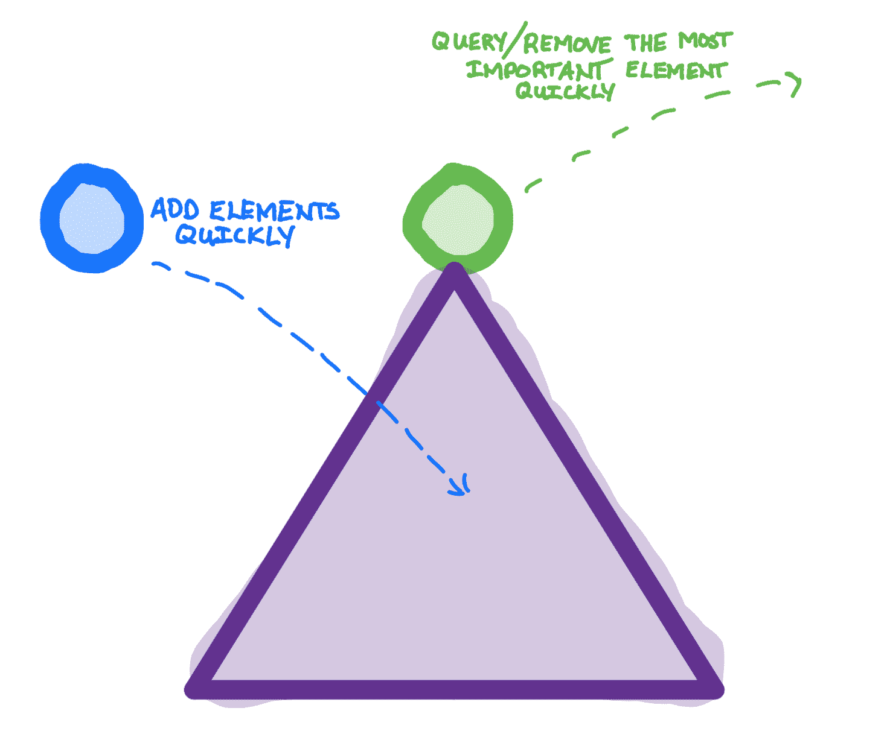
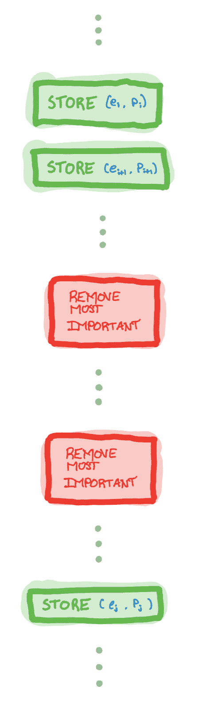
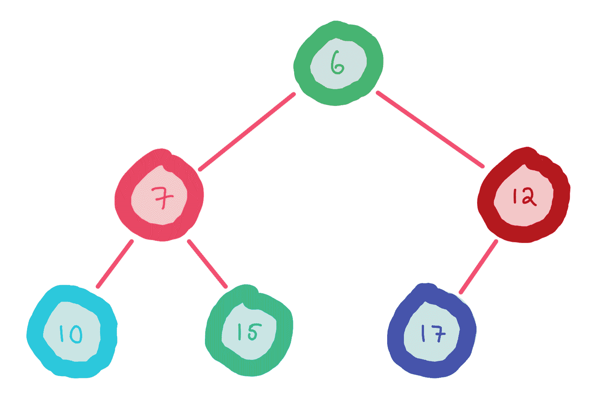
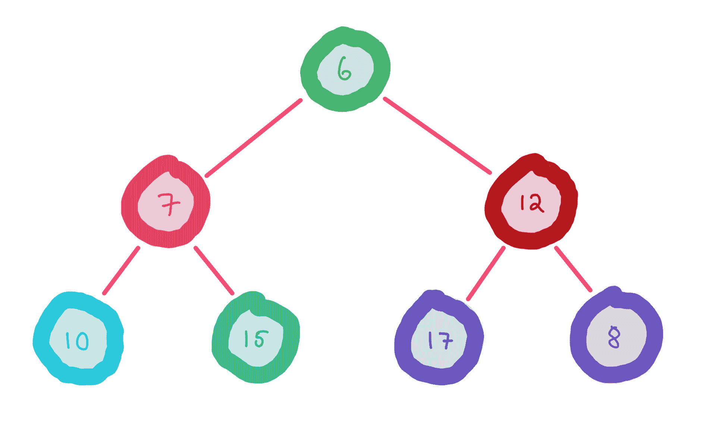
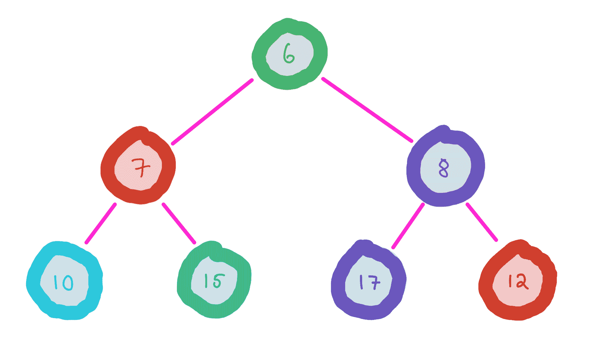
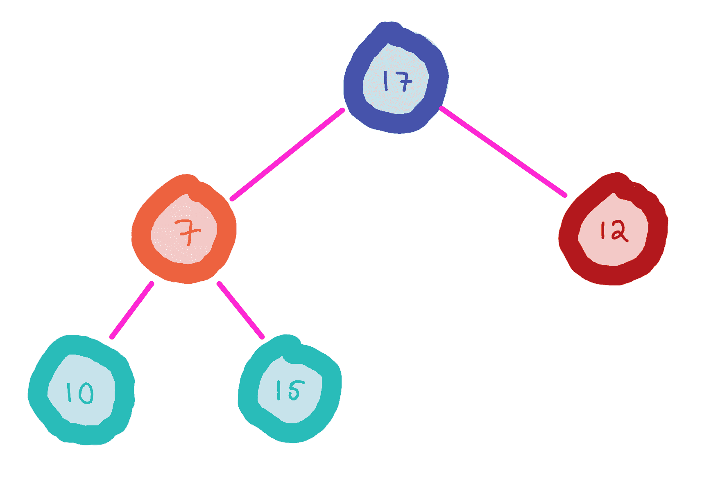
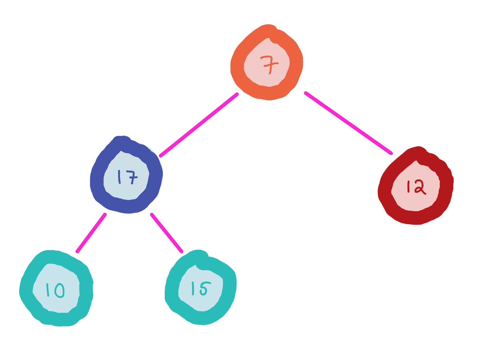
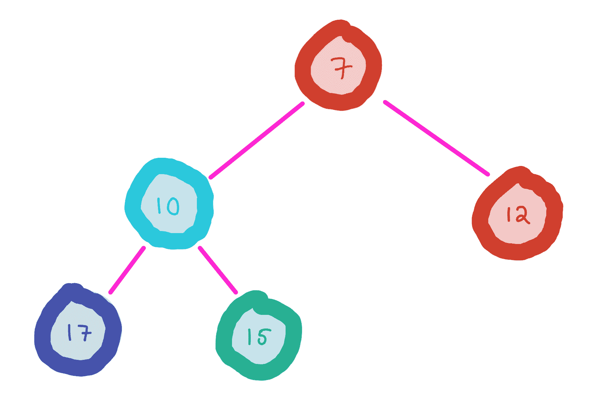
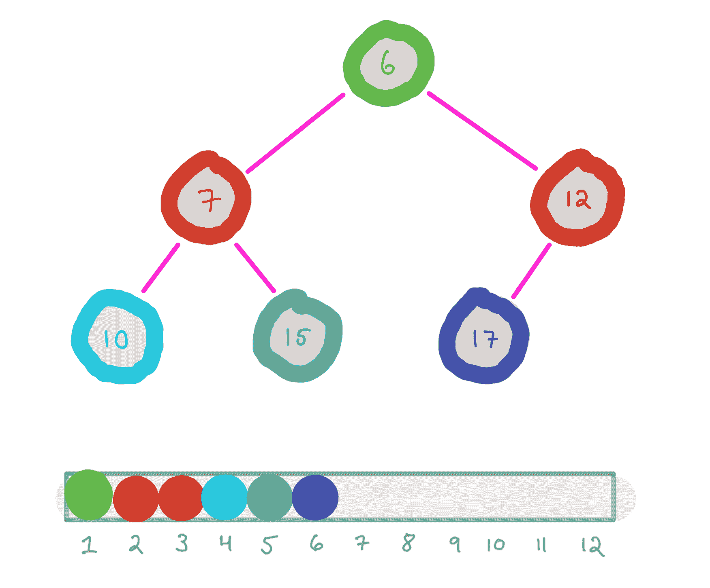
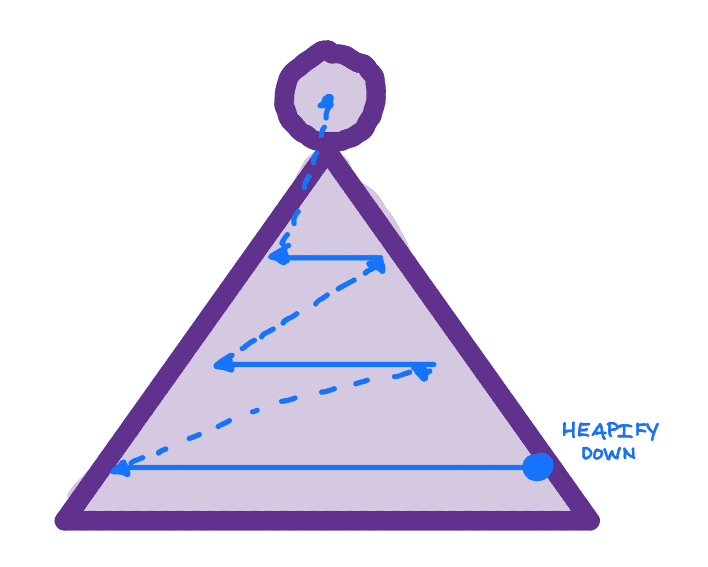

# 堆

> 原文：[`courses.physics.illinois.edu/cs225/sp2019/notes/heaps/`](https://courses.physics.illinois.edu/cs225/sp2019/notes/heaps/)

返回笔记由 Eddie Huang 提供

一个堆

## 动机

元素的连续存储和移除

假设你有一个最多包含`n`个元素的集合，每个元素都有一个关联的优先级`p`[`i`]。这些元素逐个给你。在任何时候，你可能会被要求移除你迄今为止持有的最重要的（优先级最高的）元素。你会怎么做？

一个简单的解决方案可能是维护一个大小为`n`的数组，并将新元素简单地追加到数组的末尾。每当有查询时，你只需简单地扫描数组以找到最重要的元素。查询将花费线性时间（`O(n)`），如果有`k`个查询，则总查询时间为`O(kn)`。因此，总时间将是`O(n+kn)`。

我们可以用堆做得更好

## 堆的特性

堆允许你快速存储元素和查询最重要的元素，这通常是对数时间。

堆可以用树来表示，其中每个节点都是一个具有关联的`优先级`或`权重`的元素。树必须满足的唯一属性是：

*父节点的优先级高于其任何子节点*

因此，根节点应该始终具有最高的优先级。

在上面的例子中，我们存储元素并在随机时间查询最重要的元素，总运行时间将是`O(n log(n) + k log(n))`，其中存储元素和移除最重要的元素都花费`O(log n)`时间。如果查询次数`k`大于`O(log n)`，则此运行时间更快。

## 二叉堆

堆是一种抽象数据结构，堆有许多数据结构版本，如斐波那契堆或二项式堆，它们都有各自的优缺点。二叉堆是最常见的、最简单的堆数据结构之一，也是我们在这门课程中要讨论的。二叉堆是满足堆属性的完全二叉树。由于它们是完全二叉树，它们的高度总是节点数量的对数。

二叉最小堆

优先级通常表示为一个数字，其中优先级的顺序可以是两个数字之间的最小值或最大值。因此，我们使用`min-heap`或`max-heap`来命名数值二叉堆。

#### 插入

一个二叉最小堆

插入新元素

`堆化上升`：重复与父节点交换，直到满足堆属性

在二叉堆中插入节点时，我们将其添加到下一个叶子位置，这样堆仍然是一个完全二叉树。直到新节点比其父节点具有更低的优先级，我们重复将这个节点与其父节点交换，这将恢复树的堆属性。这种重复交换称为`向上 heapify`。

交换次数最多是树的高度，因此插入操作的时间复杂度为对数时间。

#### 删除

二叉最小堆

移除最重要的元素并用最右侧的叶子节点替换它

`向下 heapify`：重复与具有更高优先级的子节点交换，直到满足堆属性

`向下 heapify`：重复与具有更高优先级的子节点交换，直到满足堆属性

要删除最高优先级的元素，我们只需删除根节点，并用其最右侧的叶子节点替换它。直到这个前叶子节点比其两个子节点具有更高的优先级，我们重复将这个节点与具有更高优先级的子节点交换，这将恢复树的堆属性。这种重复交换称为`向下 heapify`。

交换次数最多是树的高度，因此删除操作的时间复杂度也是对数时间。

#### 使用数组实现完全二叉树

使用 1 索引数组表示完全二叉树

完全二叉树可以使用 1 索引数组实现，其中数组的`[a = 2^i + j, j < 2^i]`索引表示树的第`i`层的第`j`个节点。

+   父节点位于`⌊a/2⌋`索引处。

+   左子节点和右子节点分别位于`2a`和`2a+1`索引处。

由于堆是完全二叉树，因此也可以使用数组来实现。

> 你也可以使用 0 索引数组来模拟完全二叉树，但可能不那么优雅

#### 将无序完全二叉树转换为二叉堆

将无序完全二叉树转换为堆

将无序完全二叉树转换为二叉堆的最有效方法是向下`heapify`所有节点，从树的最低层开始，逐层向上。

这需要*线性*时间

## 应用

#### 优先队列

堆可以用来实现优先队列，这是一种抽象数据类型，它总是出队具有最高优先级的元素。

> 抽象数据类型比描述它们行为而不提供概念模型的数据结构更抽象

#### 堆排序

堆也可以用来排序元素。只需将所有元素添加到堆中，然后出队它们。结果将是按顺序出来的元素。

让 `n` 表示元素的数量。使用二叉堆，每次插入的时间复杂度是对数级的，每次删除的时间复杂度也是对数级的，因此整体的时间复杂度是 `O(n log(n) + n log(n)) = O(n log(n))`.
