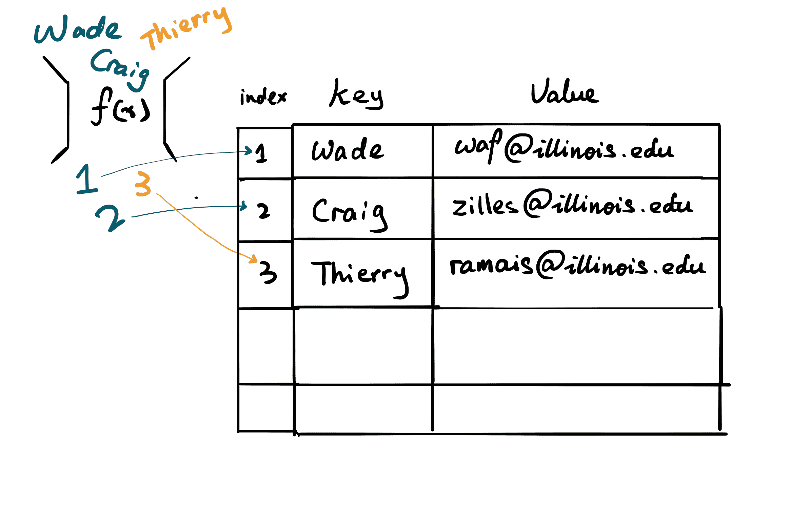
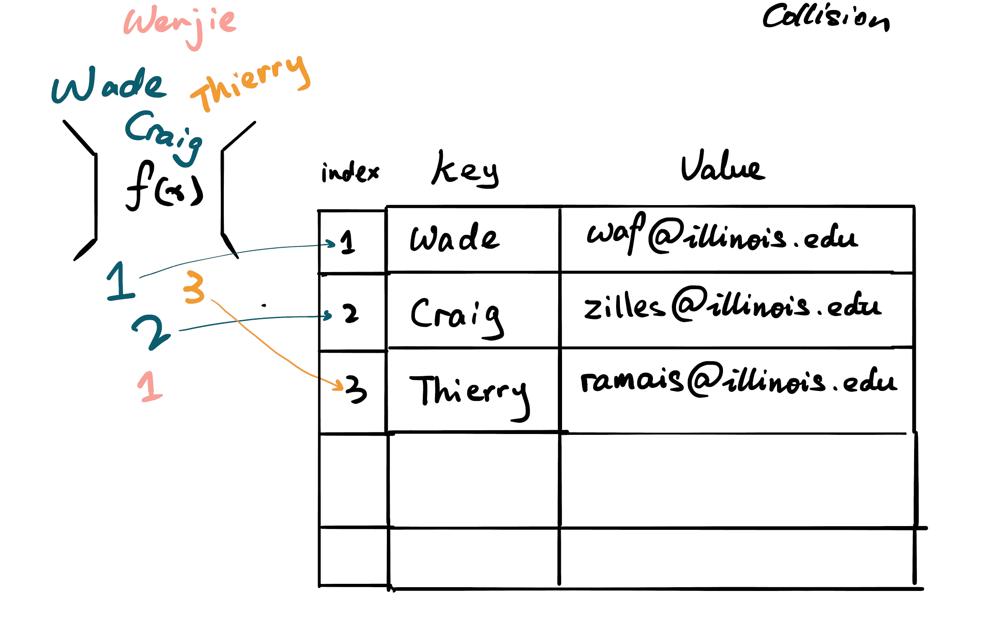
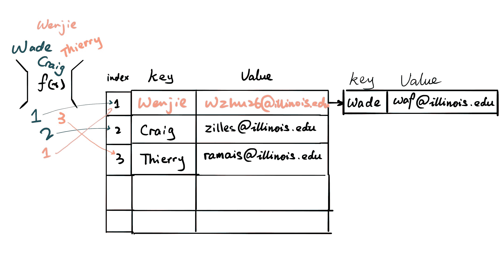
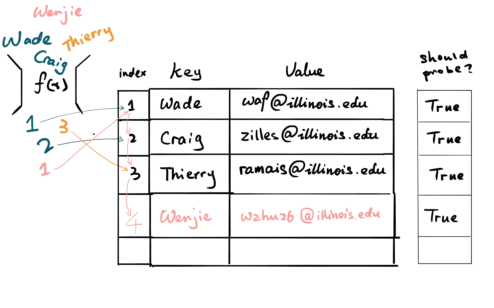

# 哈希表

> 原文：[`courses.physics.illinois.edu/cs225/sp2019/notes/hashtable/`](https://courses.physics.illinois.edu/cs225/sp2019/notes/hashtable/)

返回笔记 by Siping Meng

## 简介

哈希有许多用途。在 225 中，我们讨论了哈希如何用于存储数据。要执行哈希，我们需要两样东西

+   *哈希函数*：将键转换为较小的数字，并使用该数字作为表中的索引。

+   *哈希表*：一个根据索引存储值的数组。

CS225 教授的姓名与其电子邮件地址的哈希

## 哈希冲突

假设前面的工作如下所示：

+   如果输入以*w*开头，*返回 1*

+   如果输入以*c*开头，*返回 2*

+   如果输入以*t*开头，*返回 3*

现在我们想在我们的联系表中插入一个助教，比如说*键*：**Wenjie**和*值*：**wzhu26@illinois.edu**。哈希函数将返回*1*。

沃德和文杰的哈希值冲突

## 两种哈希存储类型

#### 分离链接

我们可以做到的是让我们的哈希表单元格指向几个具有相同哈希函数输出的值链接列表。

CS225 教职工的姓名与其电子邮件地址的分离链接哈希

#### 线性探测

我们还可以做的是只填充表，而不创建任何额外的内存。

当我们看到冲突时，我们将尝试线性探测下一个空间。在我们的情况下，我们应该从槽位*1*开始检查，但哦，*waf*在那里，所以我们探测到槽位*2*。然而，教授*Craig*已经占据了那个空间，因此我们需要再次探测到槽位*3*，并在那里找到了可爱的*Thierry*。幸运的是，槽位#*4*是空的，所以我们可以把我们的助教信息放在那里。

当搜索一个元素时，我们将逐个检查表槽，直到找到所需的元素，或者明确元素不在表中。

CS225 教职工的姓名与其电子邮件地址的线性探测哈希
