# k-d Trees

> 原文：[`courses.physics.illinois.edu/cs225/sp2019/notes/kd-tree/`](https://courses.physics.illinois.edu/cs225/sp2019/notes/kd-tree/)

返回笔记 by Jenny Chen

## 概述

k-d Tree 是一种二叉搜索树，用于在 *k* 维空间中组织点。k-d Tree 中的每个节点包含一个点。每个父节点根据某个维度将空间分割成两个子空间。它以这种方式分割空间，使得其左子树中的每个节点都在左子空间中，而其右子树中的每个节点都在右子空间中。节点分割的维度取决于该节点在树中的层级。

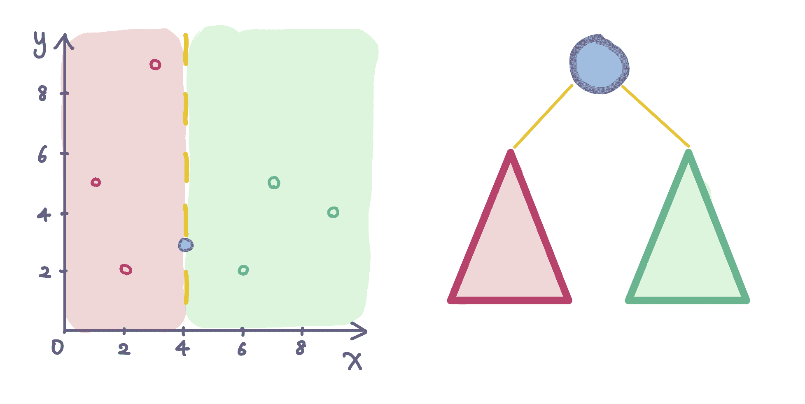

蓝色节点在第一个维度（*x* 轴）上进行分割。每个具有较小 *x* 坐标的节点属于其左子树，而每个具有较大 *x* 坐标的节点属于其右子树。

## 构建 k-d Tree

在本课程中，我们专注于基于点数组构建一个平衡的 k-d Tree。

#### 交替分割维度

如前所述，每个节点在某个维度上分割空间。传统上，第 *i* 层的节点在第 *i* 维度上分割空间。如果 *i* 大于 *k*，则维度会回绕到 *i* mod *k*。

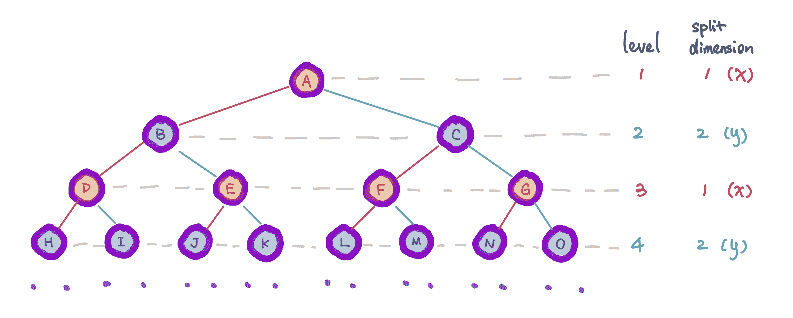

这是 k-d Tree 存储二维点的示例。在奇数层的每个节点分割 *x* 维度，而在偶数层的每个节点分割 *y* 维度。

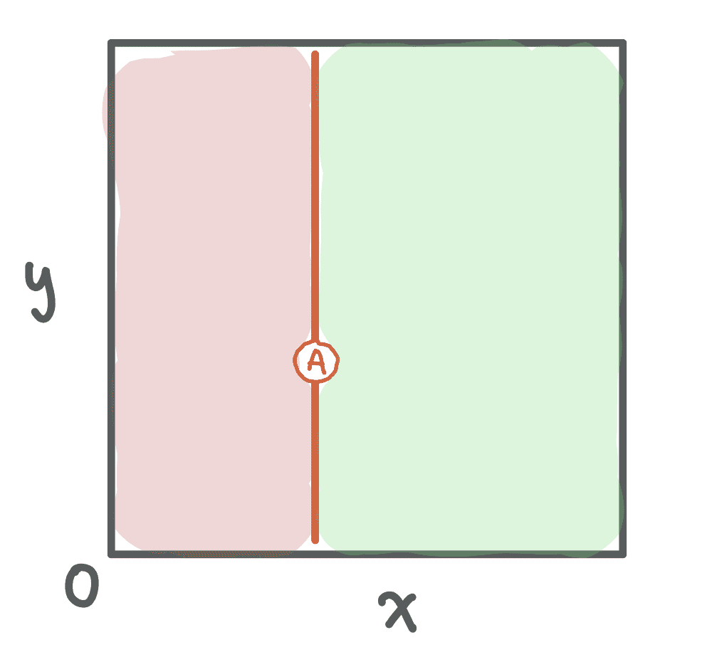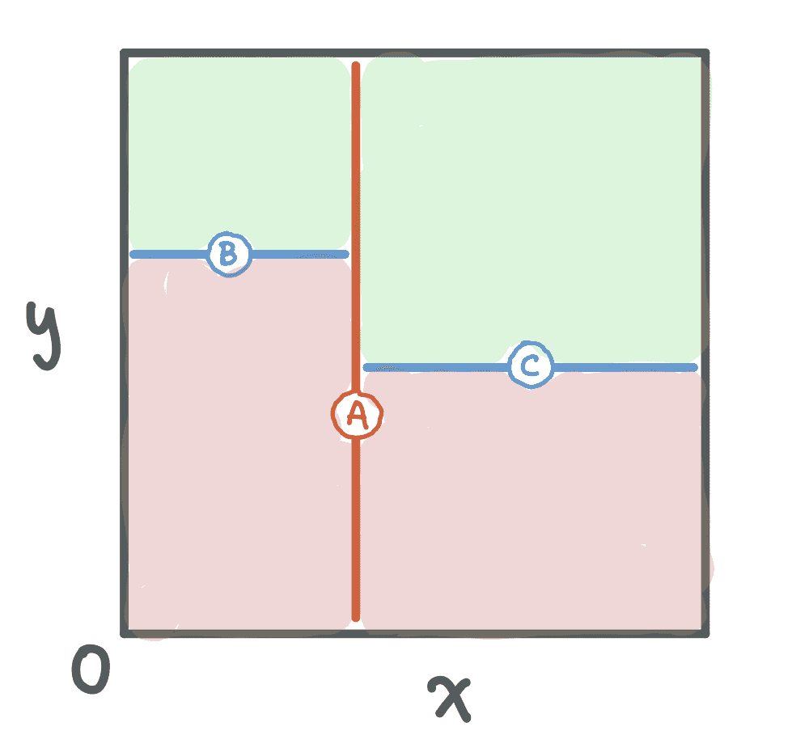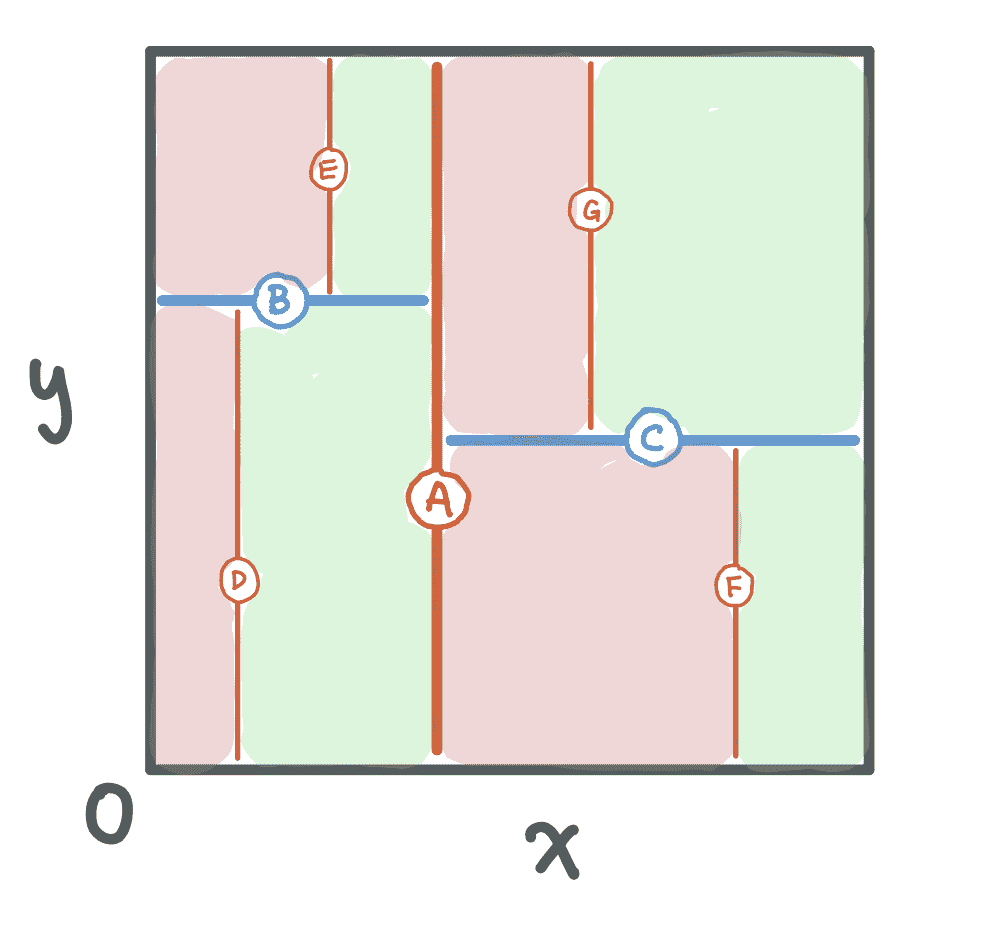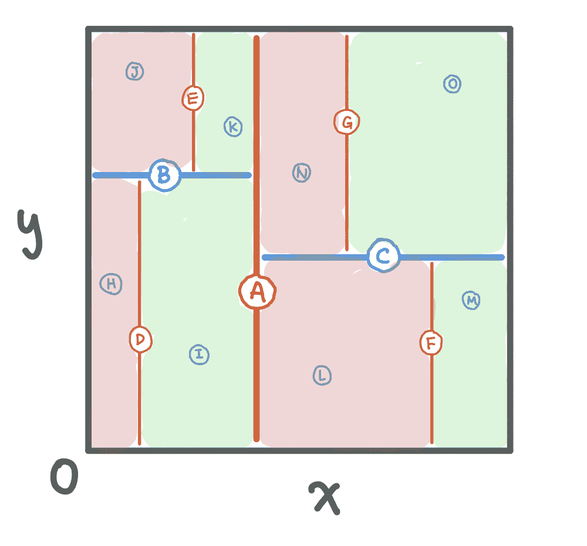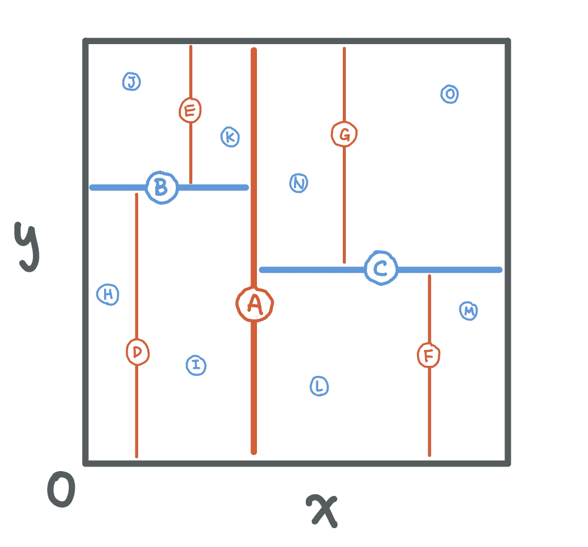上一页 下一页

kd-Tree 按层级分割空间。

#### 查找中位数

为了构建一个平衡的 k-d Tree，每个节点应该分割空间，使得左子空间和右子空间中的节点数量相等。因此，我们需要从当前维度中选择中位数作为子根。

#### 在子树上递归

找到子根后，将所有位于左子空间中的节点放入一个数组中，其余的放入另一个数组中。对子数组重复此过程。

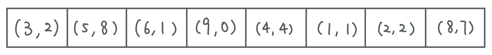

假设我们得到了这个数组来构建一个 kd-Tree。

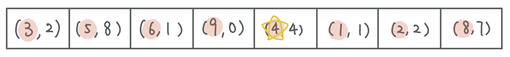

(4, 4) 在 *x* 坐标上为中位数，将其作为子根。

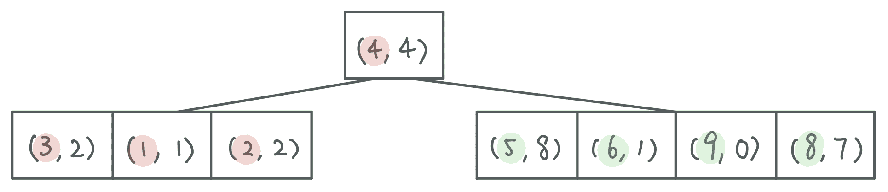

将数组分割，使得所有 *x* 坐标小于 4 的点位于 (4, 4) 的左侧，而所有 *x* 坐标大于 4 的点位于 (4, 4) 的右侧。

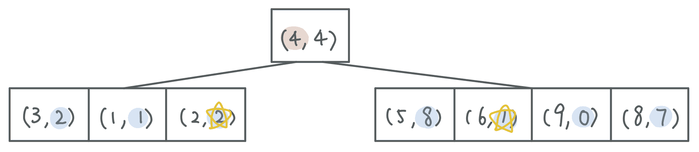

在每个子数组中根据 *y* 坐标找到中位数。

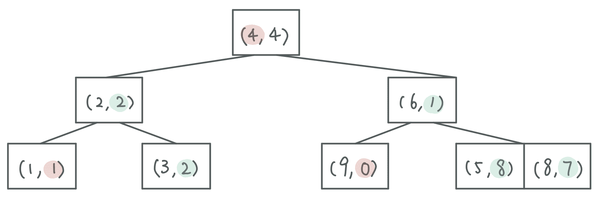

通过每个子数组的中位数对其进行分区，并将中位数作为子根。重复此过程，直到数组仅由一个节点组成。
