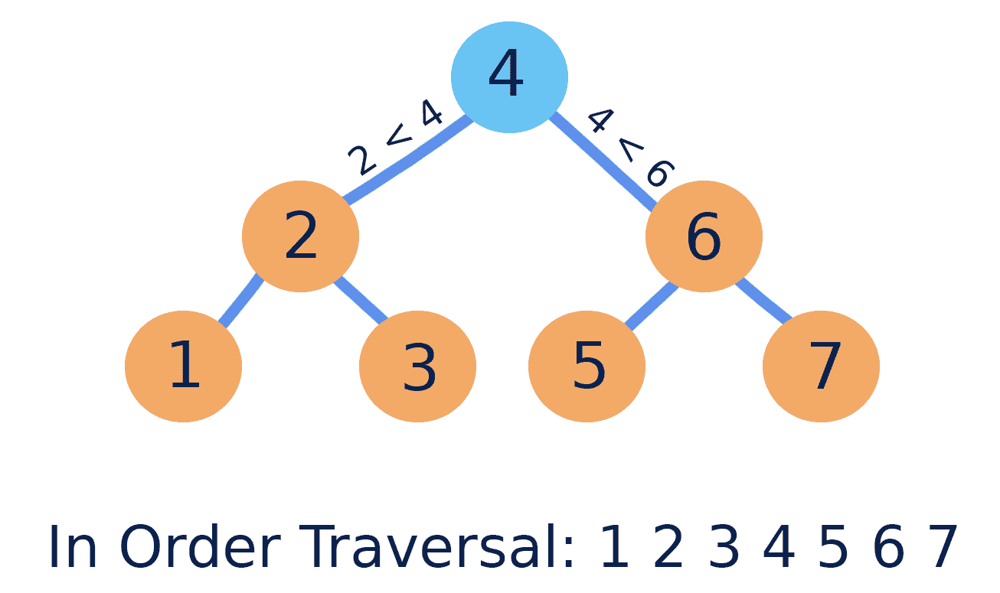
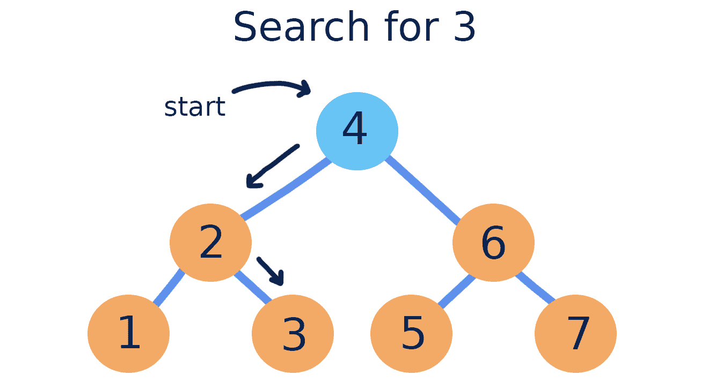
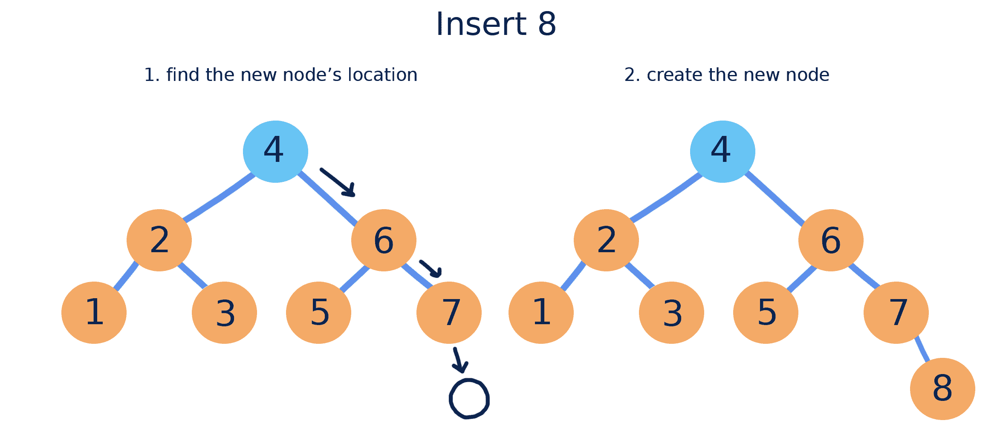
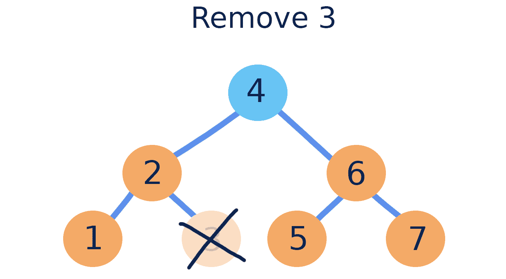
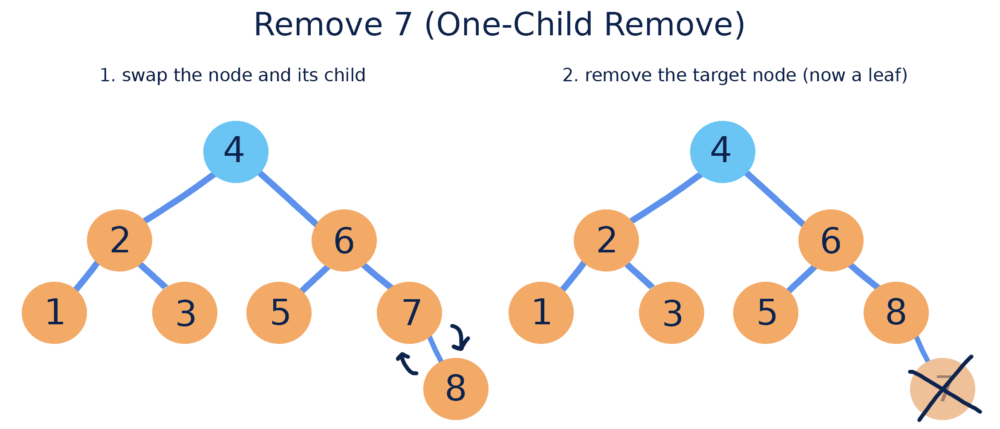
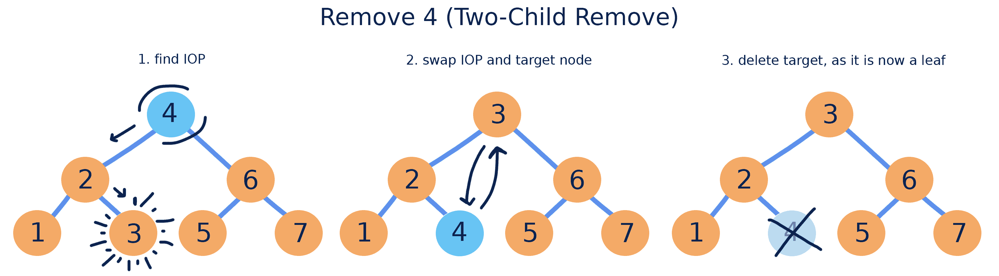
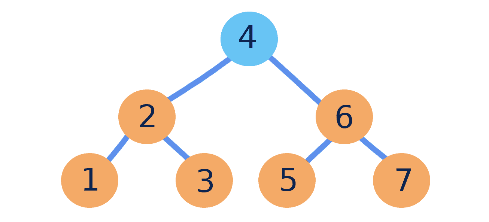
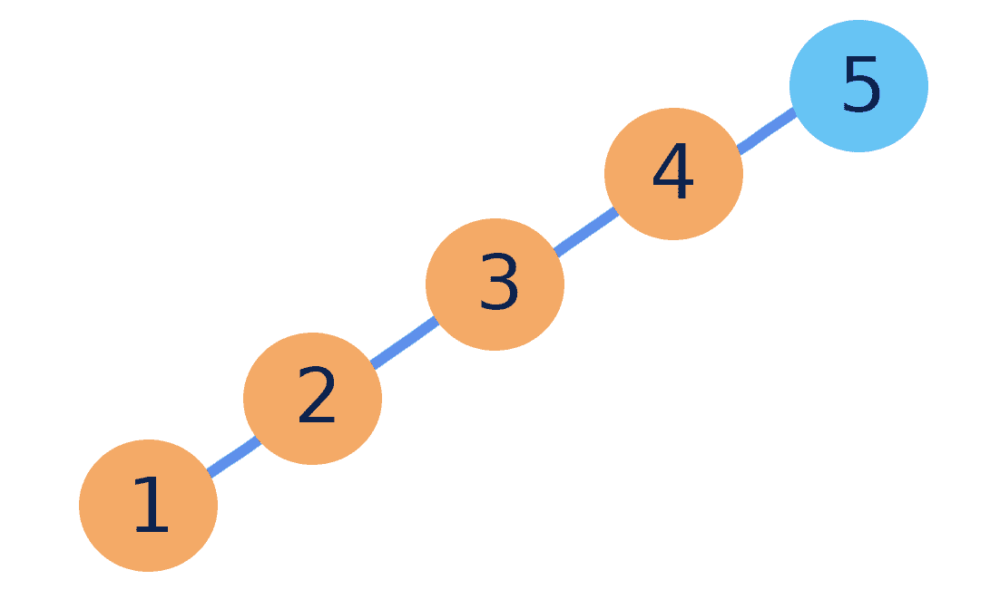

# 二叉搜索树

> [`courses.physics.illinois.edu/cs225/sp2019/notes/bst/`](https://courses.physics.illinois.edu/cs225/sp2019/notes/bst/)

返回笔记 by Tamara Nelson-Fromm

## 定义

*二叉搜索树*（BST）是一种*二叉树*，其中左子树中的每个节点都小于根节点，而右子树中的每个节点的值都大于根节点。二叉搜索树的性质是递归的：如果我们考虑任何节点作为“根”，这些性质仍然成立。

由于二叉搜索树中的节点是有序的，因此*中序遍历*（左节点，然后根节点，然后右节点）将始终产生一个递增数值顺序的值序列。

## 搜索

二叉搜索树被称为“搜索树”，因为它们使搜索特定值比无序树更有效。在理想的二叉搜索树中，我们不需要在搜索特定值时访问每个节点。

这是我们如何在二叉搜索树中进行搜索的方式：

1.  从树的*根节点*开始

1.  如果值小于当前节点，则向左移动

1.  如果值大于当前节点，则向右移动

## 插入

在二叉搜索树中添加的新节点总是添加到*叶子*位置。执行搜索可以轻松找到新节点位置。

## 移除

当从二叉搜索树中移除节点时，我们关注的是保持树的其他部分处于正确的顺序。这意味着移除操作取决于我们正在移除的节点是否有子节点。这里有三种情况：

如果被移除的节点是叶子节点，它可以简单地被删除。

如果节点有一个子节点（左或右），我们在删除节点时必须将子节点移动到节点的位置。

如果节点有两个子节点，我们必须首先找到*中序前驱*（IOP）：我们节点左子树中的最大节点。IOP 始终是一个叶子节点，可以通过从左子树的根节点开始并向右移动来找到。然后我们可以将正在移除的节点与其 IOP 交换，并删除它，因为它现在是一个叶子节点。

## 运行时和二叉搜索树

根据二叉搜索树中包含的值及其添加的顺序，BST 操作的性能可能会有所不同。这种性能取决于树的形状和包含的节点数量。

在理想情况下，二叉搜索树的左右子树中的节点数量相似。由于在理想的 BST 中进行搜索时需要访问的节点较少，因此所有利用 find 操作（包括搜索、插入和移除）的操作都具有`O(lg(n))`的时间复杂度。

二叉搜索树最坏的情况是它的值以**数值顺序**添加。这种结构看起来不再像树，而更像是一个链表！由于搜索时可能需要访问每个节点，最坏情况下的二叉搜索树在所有利用查找的操作中都有`O(n)`的时间复杂度。

