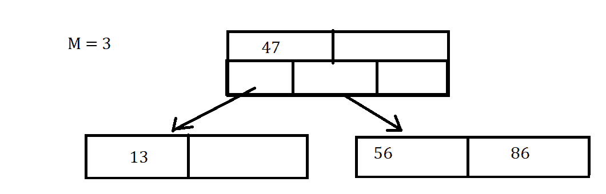
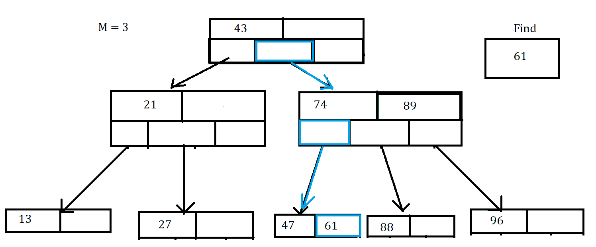
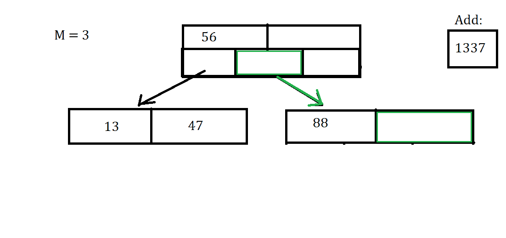
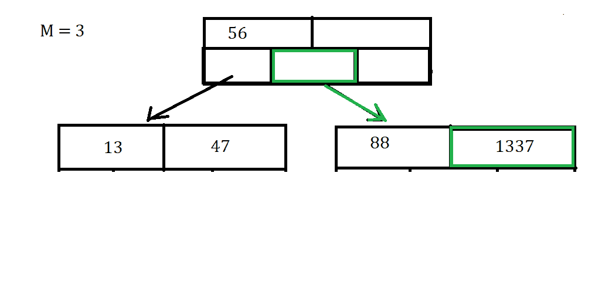
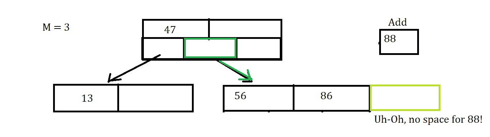
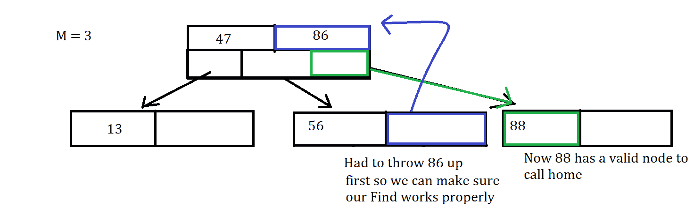
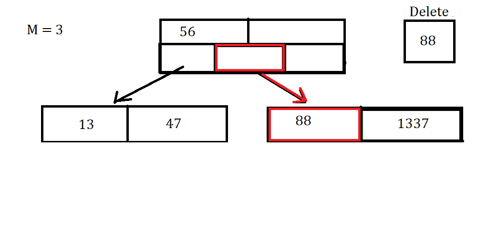
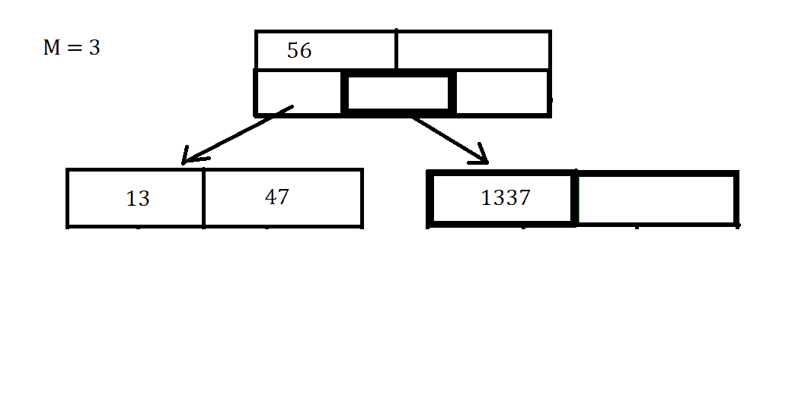

# B 树

> 原文：[`courses.physics.illinois.edu/cs225/sp2019/notes/btrees/`](https://courses.physics.illinois.edu/cs225/sp2019/notes/btrees/)

返回笔记 by Adrian Clark

## 定义

*B 树*是一种自平衡的[二叉搜索树(BST)](https://courses.engr.illinois.edu/cs225/sp2019/notes/bst/)。在这种类型的树中，每个节点可能拥有超过 2 个子节点。每个节点通常持有 2 个容器，在这种情况下，让我们假设是 2 个数组，其中一个数组持有节点的键，另一个指向节点的子节点。

## B 树特性

关于 B 树特性的以下几点需要注意：

1.  M 表示节点可以指向的最大子节点数

1.  每个节点的最大键数是 M-1

1.  根节点要么是叶子节点，要么是具有 2 到 M 个子节点和 1 到 M-1 个键的内部节点

1.  除了根节点外，其余内部节点有 M/2 到 M 个子节点

1.  所有叶子都在同一深度，这使得树平衡

## 寻找

寻找特定关键字的流程与在 BST（二叉搜索树）中搜索非常相似，特别是由于 B 树是 BST 的一种。这也是递归遍历更受欢迎的另一个案例。以下步骤中，请注意，`i`代表你当前所在关键字的索引。  步骤：

1.  遍历当前节点键数组的每个索引

1.  如果关键字在这个节点的键数组中，则返回该关键字

1.  如果关键字不在这个节点中，你有两个选择。 一：找到下一个最大的关键字，并前往该节点的第 i 个子节点，也称为当前关键字的左子节点。 二：找到下一个最小的关键字，并前往第(i + 1)个子节点，也称为当前关键字的右子节点。我说你有两个选择，因为你要找的关键字可能小于节点的第一个关键字，或者大于最后一个关键字。

1.  如果你到达了应该包含数据值的最底层叶子节点，但在键数组中没有看到它，那么这个值不在树中。

在这个例子中，我们可以看到我们从根节点开始，沿着蓝色箭头和方框的路径找到正确的值。即使在这张图片中没有显示，请记住通过你经过的节点键数组进行遍历

## 插入

插入过程需要你通过搜索一个有效的数据插入位置来导航到叶子节点。当你到达底部时，你将尝试添加数据。我说尝试，因为如果该节点有空间插入数据，这将很快且简单。但这种情况并不总是如此，有时节点已满，你必须分裂节点。

假设我们想要插入关键字 1337。首先，我们必须找到正确的节点，并查看是否有空间插入数据。

幸运的是，这是一个非常简单的情况，我们可以直接将键插入到节点中。这并不总是这种情况，因为我们可能需要拆分一个节点，或者调整节点的数组，以确保它们处于正确的顺序。

## 节点拆分

节点拆分通常在插入键之后发生。  步骤：

1.  当你尝试向节点 N1 插入时，你会注意到键的数量现在大于 M-1。

1.  现在，你必须将中间键放入父节点的键中

1.  现在，所有在 N1 数组中的键，大于抛出的键，都放入父节点的(i+1)子节点中，其中 i 是抛出键的索引。其余的放入父树的第 i 个子节点中。如果一个子节点不存在但可以放置，由于父节点有空间，你可以创建子节点并填充它。

假设我们尝试向树中添加值 88。

哎呀，那个节点已满，所以现在我们必须将值 86 抛到父节点，因为它位于 56 和 88 之间。由于那是抛出的中间值，而 88 大于 86，我们将 88 放入(i+1)子节点，其中 i 是 86 在父节点中的索引。

这是我们幸运的情况，因为我们的操作很简单，因为你可能会遇到父节点也满了的问题，这需要你进行更多操作。

## 移除/删除

*在 Lab B-Tree 中不执行数据点的移除/删除*

移除操作与插入操作非常相似：通过搜索导航到叶节点，当你到达要删除的数据时，你必须删除该数据。然而，在删除数据之后，你必须确保树仍然保持其二叉搜索树（BST）属性和 B 树属性。这次移除是否移除了节点中的一个重要键？这次移除是否使节点下的子节点数量低于 M/2？这些都是删除操作可能出现的潜在场景，这就是合并节点想法的来源。

假设我们想要移除数据值 88。首先，我们必须找到该节点（如果存在的话），然后将其移除。

一旦我们删除了该数据点，你可能会注意到我们的数组中有一个空隙，这是我们不想看到的。为了解决这个问题，我们可以将数据值 1337 移动到之前 88 所在的位置。

幸运的是这次删除没有让我们不得不合并任何节点，所以这次过程很简单。删除可能更复杂，你可以访问[这里](https://medium.com/@vijinimallawaarachchi/all-you-need-to-know-about-deleting-keys-from-b-trees-9090f3334b5c)或学习 CS411 - 数据库系统来了解更多关于删除的信息，因为删除还会产生不同的合并场景。

## 合并节点

*在 Lab B-Tree 中不执行节点的合并*

合并节点通常发生在删除键之后。例如，在你删除数据后，一个节点可能少于 M/2 个子节点，那么你必须合并某些节点。

节点的合并不像拆分那样简单，因为你必须处理树更多的语义。因为你可能会移动多个键，而不仅仅是将它们抛到父节点，还可能将它们抛到各种子节点。

如果你想了解更多，我鼓励你谷歌搜索或查看本页“删除/删除”部分中的链接

## 运行时间

搜索：

`O(logn)` 由于这是一个二叉搜索树，我们的搜索算法会让我们检查每个节点以查找值，如果不在那里，我们就去正确的子节点，我们的运行时间是 `O(log(n))`。或者更正式地说，运行时间等于 `O(depth*logM)`，其中深度等于 log(n)，由于 N » m，我们可以说最终是 O(log(n))。

键的合并/拆分：

`O(M)` 由于每个节点最多可以有 M 个键，我们必须找到正确的键来拆分/合并。

插入/删除：

`O((M/log M)*logN)` 由于我们必须首先到达叶节点并找到放置节点的地方，现在我们必须通过拆分和合并键来更新树，以保持树的完整性。
