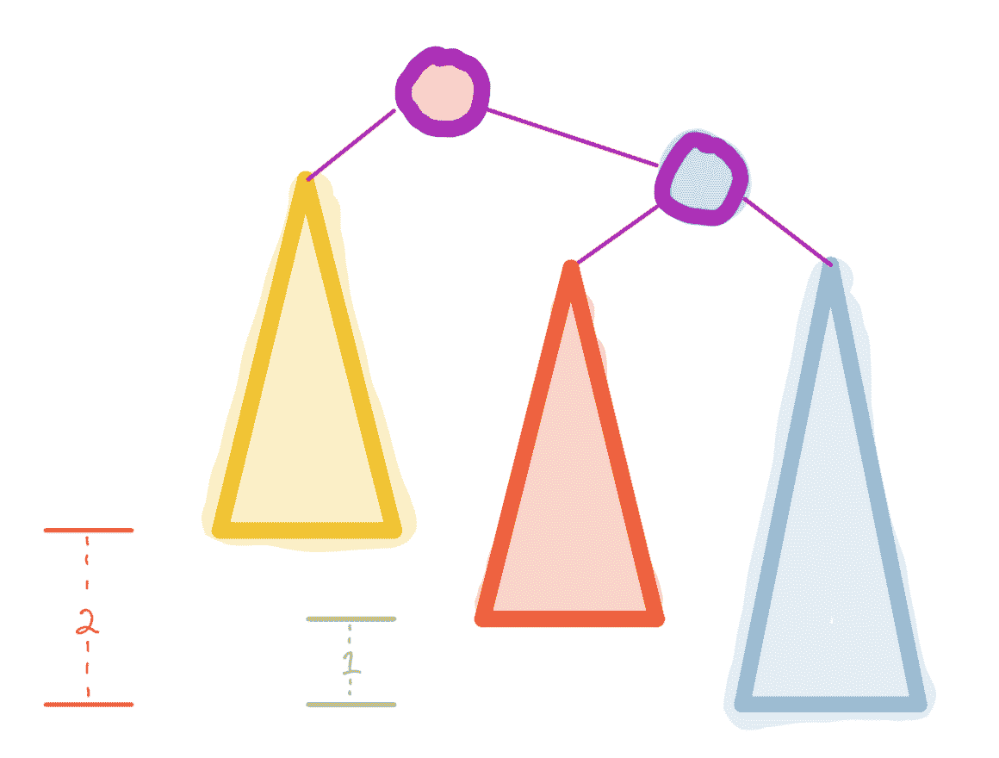
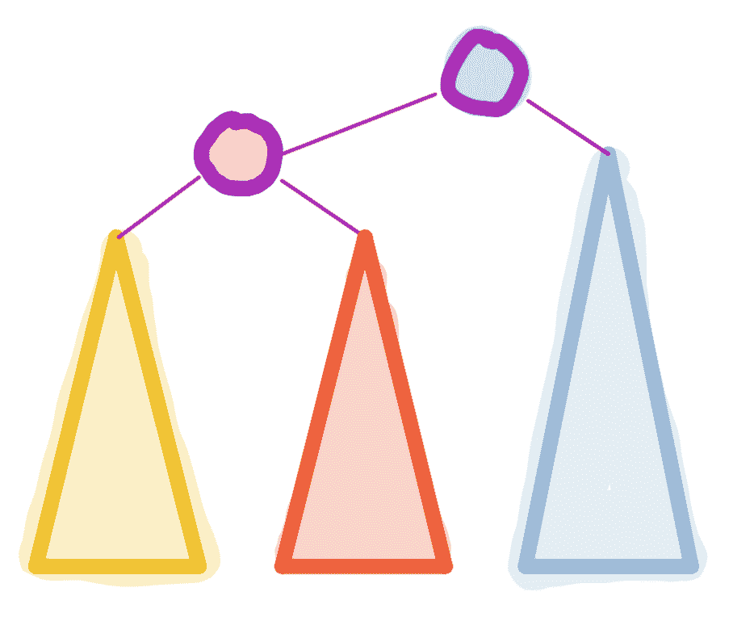
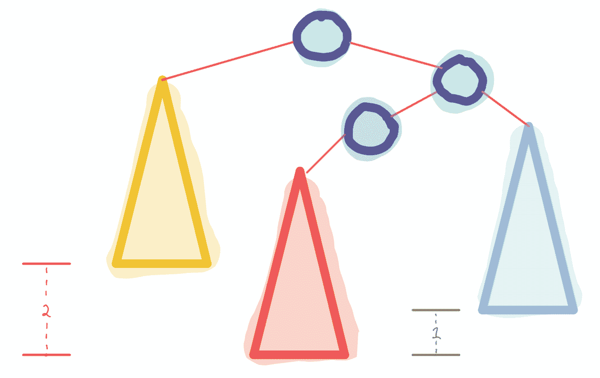
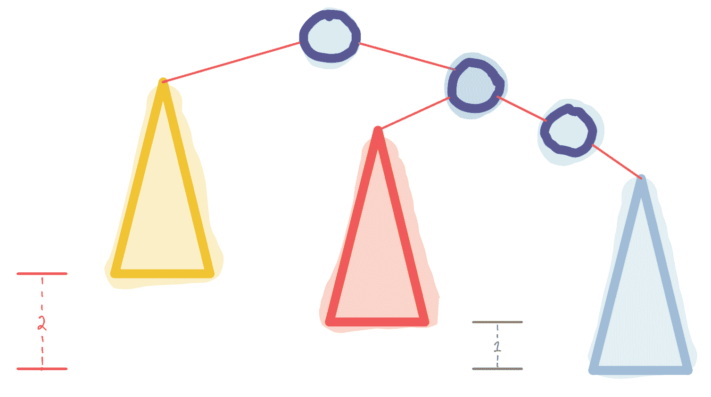
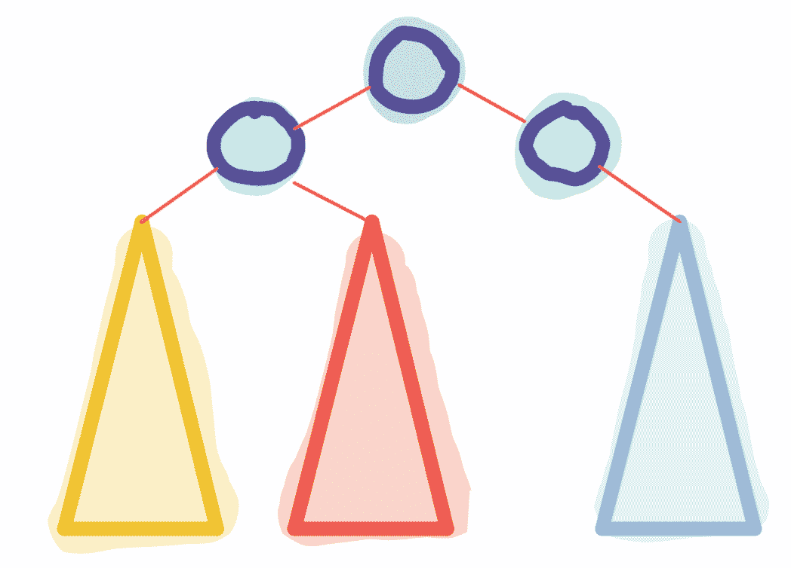

# AVL 树

> 原文：[`courses.physics.illinois.edu/cs225/sp2019/notes/avl-trees/`](https://courses.physics.illinois.edu/cs225/sp2019/notes/avl-trees/)

返回笔记 —— 艾迪·黄（Eddie Huang）编写

#### 一个酷炫的演示

[交互式 AVL 树模拟器](https://www.cs.usfca.edu/~galles/visualization/AVLtree.html)

#### 描述

AVL 树是自平衡的二叉搜索树，允许你在对数时间内存储和查询数据。它们保持对数高度，以便`find`和`insert`等函数的对数时间。每当任何节点有*2 或更大的*不平衡时，树就会执行旋转以重新平衡。

二叉树中节点的*不平衡*定义为它的两个子树之间的高度差。

如果 AVL 树有多个不平衡节点，它将从最低级别到最高级别重新平衡节点。

#### 左旋转

1: 不平衡树

2: 左旋转

右旋转和左旋转是彼此的镜像。

#### 右左旋转

1: 不平衡树

2: 右旋转

3: 左旋转

左右旋转和右左旋转是彼此的镜像。
