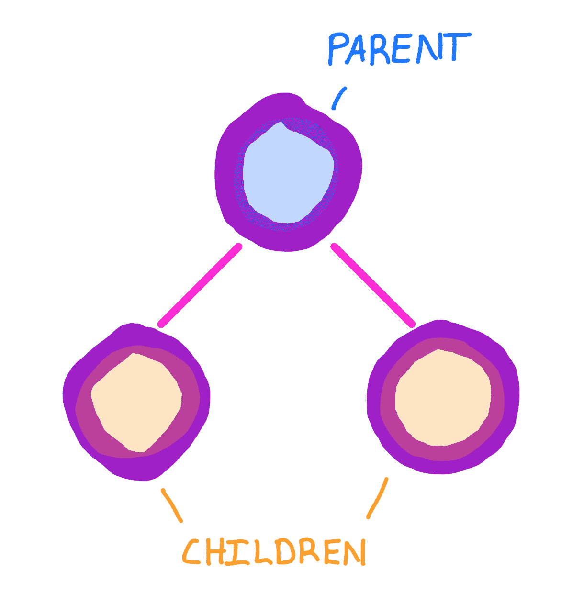
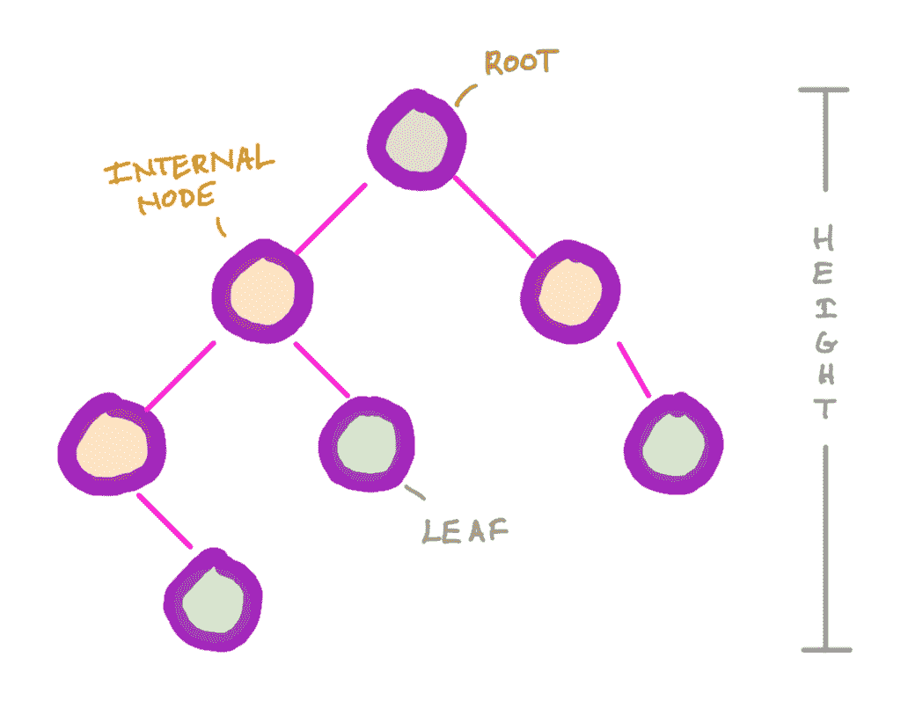
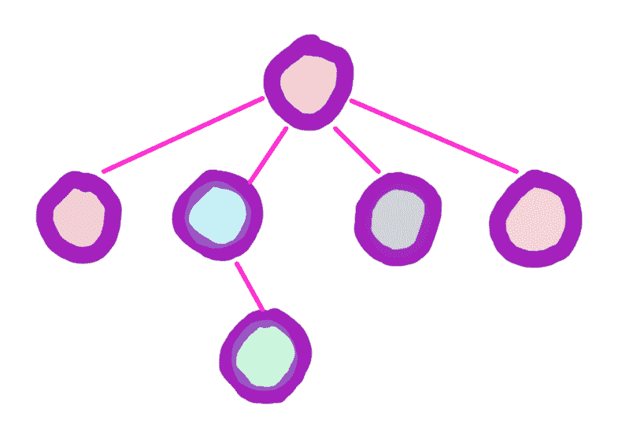
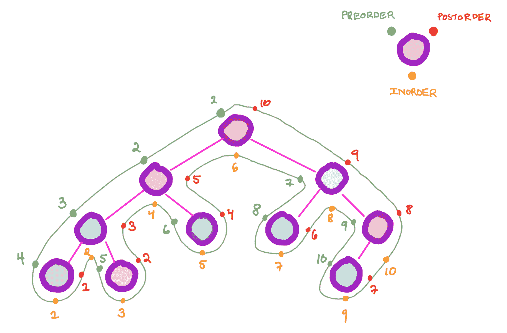
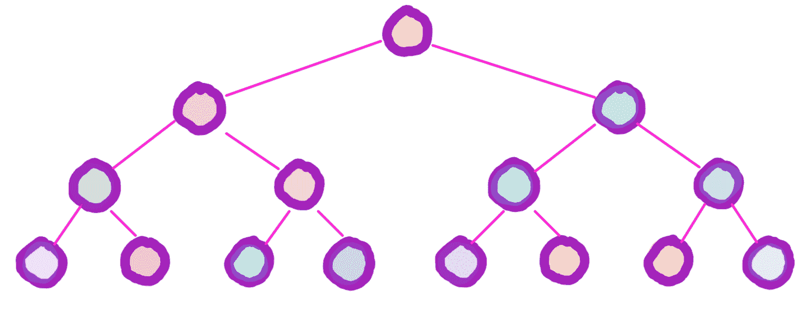
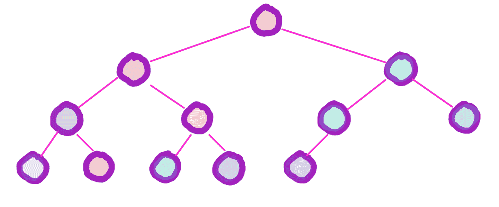
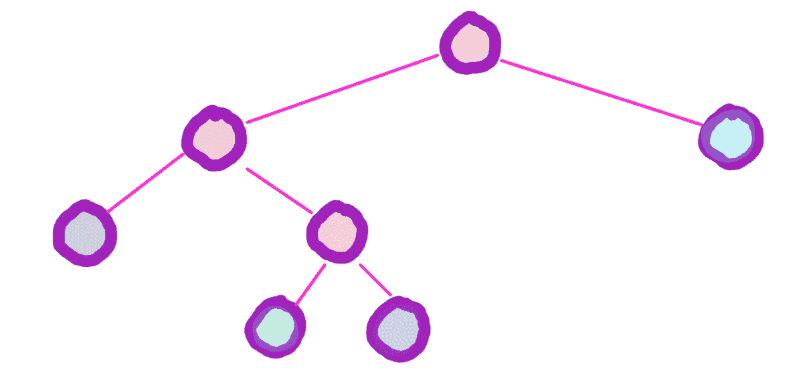

# 树

> 原文：[`courses.physics.illinois.edu/cs225/sp2019/notes/trees/`](https://courses.physics.illinois.edu/cs225/sp2019/notes/trees/)

回到笔记 by Eddie Huang

## 一些符号

树中的节点可以有`父节点`和/或`子节点`

顶部的节点被称为`根`。没有子节点的节点是`叶子`。所有其他节点是`内部节点`。树的高度比层数少一。例如，空树的高度是`-1`，只有一个根的树的高度是`0`

这是一个 4 叉树。一个`n`叉树在其所有节点中最多有`n`个子节点。在本课程中，我们主要研究 2 叉树（二叉树），即每个节点最多有两个子节点的树

## 遍历

由于树中的节点可以有多个子节点，因此有多种遍历树的方法。在这里，我们讨论三种主要的遍历方式：

+   `前序遍历`：访问**当前节点**，然后递归地前序遍历**左子树**和**右子树**

+   `中序遍历`：递归地中序遍历**左子树**，然后访问**当前节点**，然后递归地中序遍历**右子树**

+   `后序遍历`：递归地后序遍历**左子树**和**右子树**，然后访问**当前节点**

树的`前序遍历`、`中序遍历`和`后序遍历`

## 树的类型

**完美**

每一层都是完全填充的

**完全**

除了最后一层之外，每一层都是完全填充的，在最后一层，所有节点尽可能向左移动

**完整**

每个节点要么没有子节点，要么有最大数量的子节点
