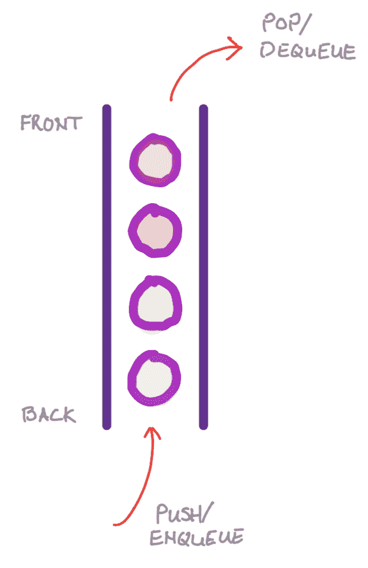
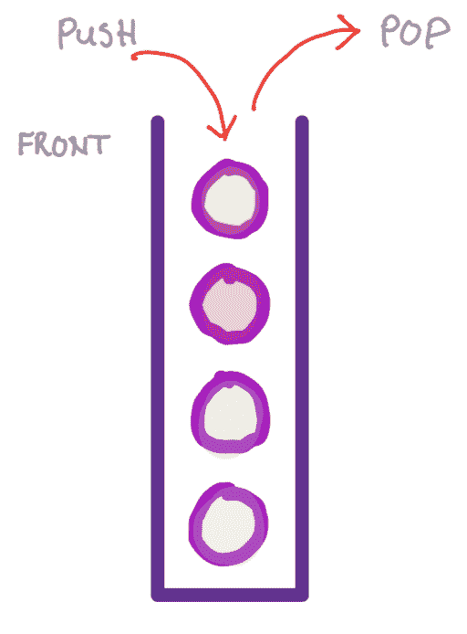
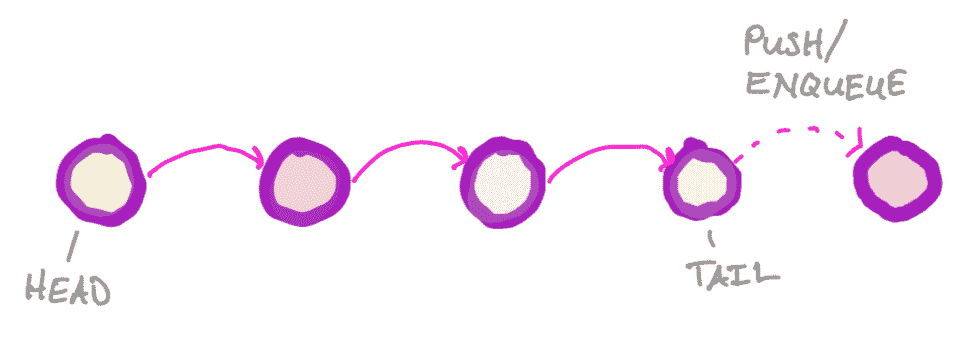
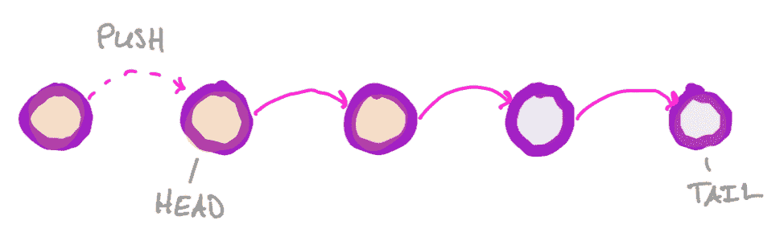
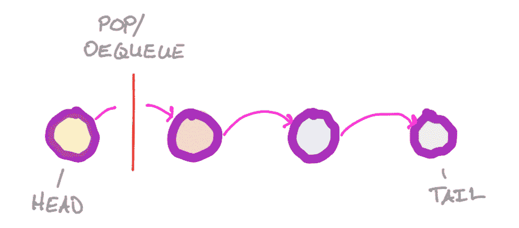
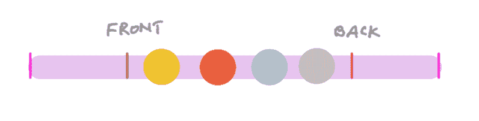
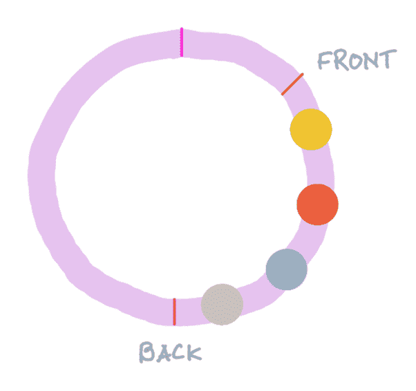
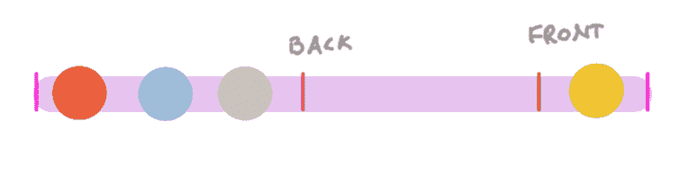
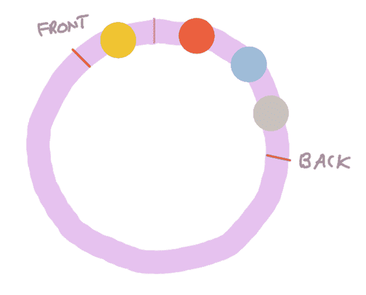

# 队列和栈

> 原文：[`courses.physics.illinois.edu/cs225/sp2019/notes/quacks/`](https://courses.physics.illinois.edu/cs225/sp2019/notes/quacks/)

返回笔记 by Jenny Chen, Eddie Huang

##### 尝试

DataBounceData*此动画由 Jenny Chen 和 Yanchen Lu 提供*

##### 简介

队列和栈（quacks）是用于存储和查询特定线性顺序中元素的数据结构。队列和栈共享一个公共接口：

+   `push` - 添加一个元素。（对于队列，这也称为 `enqueue`）

+   `pop` - 查询/删除一个元素。（对于队列，这也称为 `dequeue`）

##### 队列

队列返回元素按照它们存储的顺序。

队列返回元素按照它们存储的顺序。我们称这种数据结构为*先进先出（FIFO）*。

##### 栈

栈以与它们存储的顺序相反的顺序输出元素

栈返回元素按照它们存储的相反顺序；也就是说，最后添加的元素被返回。我们称这种数据结构为*后进先出（LIFO）*。

##### 实现

队列和栈通常使用链表或数组实现。

###### 链表

在链表实现的**队列**中入队一个元素

在链表实现的**栈**中推入一个元素

在链表实现的**队列**或**栈**中弹出/出队一个元素

###### 数组

在使用数组实现队列和栈时，重要的是将它们视为“环形”数组。数组的开始和结束对于栈或队列来说并不重要。只需跟踪定位队列/栈前后索引即可。这种实现的一个局限性是它限制了数据结构可以存储的元素数量。

队列/栈的数组实现

队列/栈的环形数组可视化

队列/栈绕数组的两端循环

队列/栈的环形数组可视化
