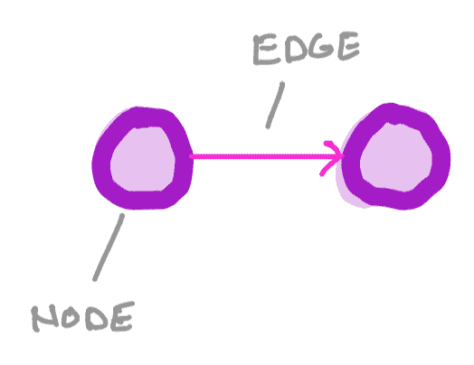
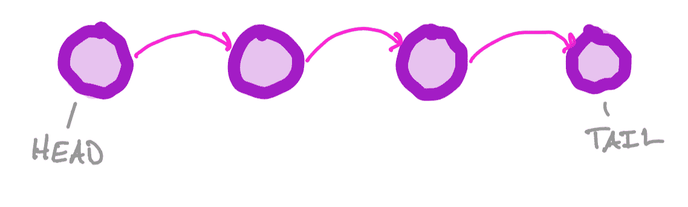
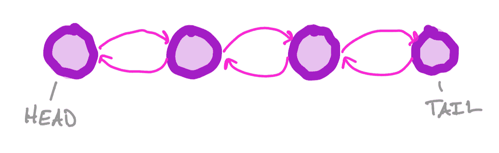

# 链表

> 原文：[`courses.physics.illinois.edu/cs225/sp2019/notes/linked-lists/`](https://courses.physics.illinois.edu/cs225/sp2019/notes/linked-lists/)

返回笔记 —— 爱迪·黄

##### 图记法的简要介绍

图由一组`节点`（也称为`顶点`）和形成节点之间连接的`边`组成。

由两个节点和它们之间的一条有向边组成的图

##### 链表

链表理想地用于存储需要某种顺序的信息。链表是一种特殊的图，其中节点和边形成链状结构。末尾的节点只包含一个边，而内部节点包含两个边（一个入边和一个出边）。第一个节点被称为`头`，最后一个节点被称为`尾`。

单链表

双链表

链表主要有两种类型：单链表和双链表。在单链表中，只存在*前向*边（即边只从一个节点连接到列表中的下一个节点）。在双链表中，存在*前向*和*后向*边。
