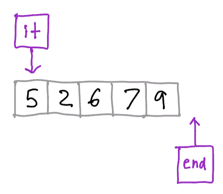
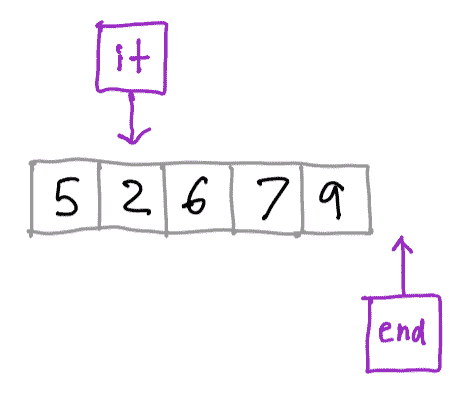
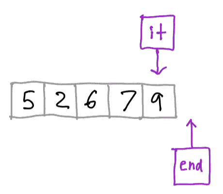
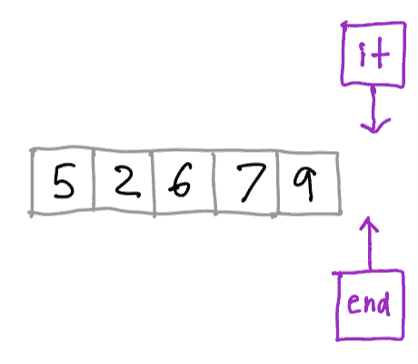
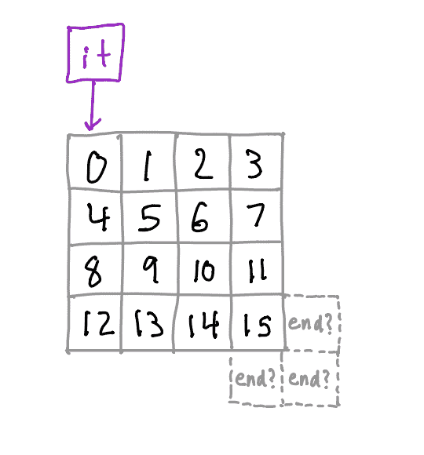
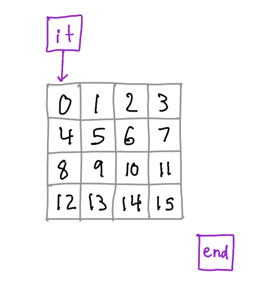
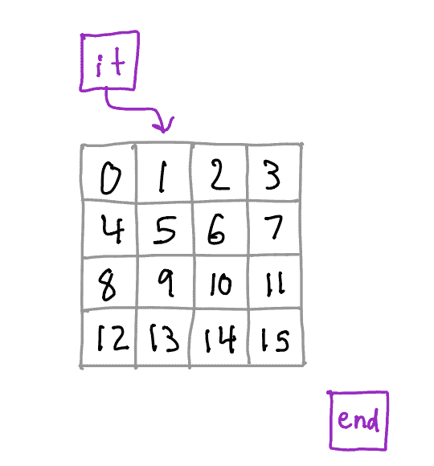
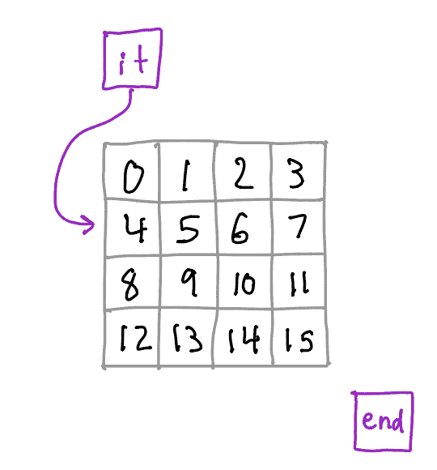
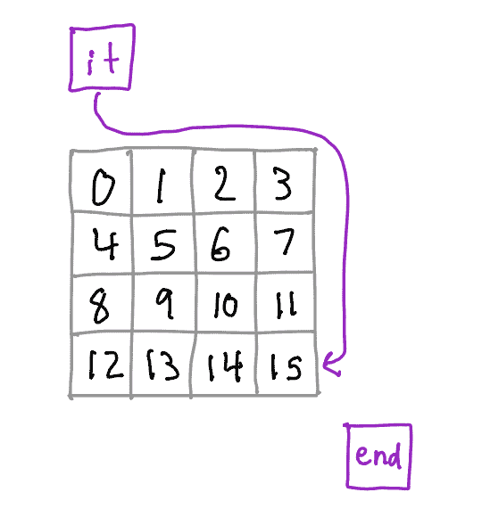
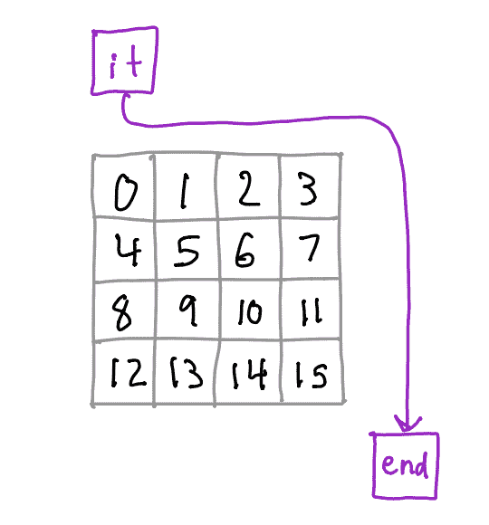

# 迭代器

> 原文：[`courses.physics.illinois.edu/cs225/sp2019/notes/iterators/`](https://courses.physics.illinois.edu/cs225/sp2019/notes/iterators/)

返回笔记 by Nathan Walters

*已经掌握了迭代器的基础知识？可以直接跳转到代码示例，基于范围的 for 循环，或使用迭代器处理非线性数据结构。*

*## 迭代器的动机

在 C++（以及一般而言）中，我们经常处理元素集合——实际上，这类数据结构正是本课程的重点！我们经常想要对特定数据结构中的所有元素执行某些操作，例如“将列表中的每个整数加五”或“打印树中的每个节点”。我们编写的用于执行这些迭代的代码往往取决于我们使用的数据结构类型。我们可能需要一个 for 循环来处理数组，两个嵌套的 for 循环来处理图像中的像素，或者一些递归函数调用来处理树。

*迭代器*提供了一种对遍历数据结构中某些元素的过程的抽象。只要你能定义一个遍历容器中元素顺序，你就可以为它编写一个迭代器！使 C++迭代器如此强大的原因是它们都具有相同的接口。你可以使用完全相同的代码来遍历列表、二维数组、树或图。

## 概念模型



这里有一个整数数组和一些用紫色框表示的迭代器。有两个迭代器：一个指向我们的容器中的第一个元素，另一个指向容器数据的“超出末尾”位置。在这个点上，我们可以询问迭代器“你的当前元素是什么？”它会回答“5”。

现在，让我们将迭代器前进到下一个元素。只要迭代器不在“超出末尾”的位置，我们就可以继续前进它。



现在迭代器会告诉我们它的当前元素是“2”。让我们再前进几个位置到数组的末尾。



我们仍然可以询问迭代器它指向的元素，它会回答“9”。现在让我们再前进一次。



从数组开头开始的迭代器现在位于“超出末尾”的位置。在这个点上，我们不能再前进迭代器，也无法检查迭代器指向的元素；这是未定义的。

这可能看起来像是你对数组迭代的概念模型，确实在很大程度上是相同的。但记住，使迭代器如此强大的原因：它们可以在任何数据结构上工作，而不仅仅是数组！

## C++中的迭代器

现在您已经对迭代器是什么以及它做什么有了高层次的理解，让我们考虑以下代码。它创建了一个包含 5 个整数的`std::vector`并打印出来。

```c
#include <iostream>
#include <vector> 
int main() {
  std::vector<int> numbers = {1, 2, 3, 4, 5};
  for (int i = 0; i < numbers.size(); i++) {
    std::cout << numbers[i] << std::endl;
  }
} 
```

这就是您可能熟悉的 for 循环风格：初始化一个索引变量为零，并在每次迭代中递增一次，直到到达列表的末尾。

让我们看看如果我们使用迭代器，这段代码会是什么样子：

```c
#include <iostream>
#include <vector> 
int main() {
  std::vector<int> numbers = {1,2,3,4,5};
  for (std::vector<int>::iterator it = numbers.begin(); it != numbers.end(); ++it) {
    std::cout << *it << std::endl;
  }
} 
```

这可能一开始看起来有些令人困惑；让我们将其分解。

首先，请注意，我们声明了一个类型为`std::vector<int>::iterator`的变量`it`。正如您应该能够从其类型推断出来，`it`本身就是迭代器！我们将其初始化为`numbers.begin()`。支持迭代的容器有一个名为`begin()`的成员函数，它返回一个指向容器中第一个元素的迭代器。

接下来，我们比较`it`与`numbers.end()`。`end()`函数返回一个迭代器，它指向容器中“超过末尾”的位置。为什么它会这样做呢？想象一下对某个数组`arr`的“经典”for 循环：

```c
for (int i = 0; i < 10; i++) {
    // Do some stuff here
} 
```

如果`arr`有 10 个元素，我们只能访问`arr[0]`到`arr[9]`，但在 for 循环中我们会检查`i < 10`。10 与“超过末尾”的迭代器类似。

在 for 循环的最后一条语句中，我们调用`++it`。在非原始类型上调用`++`看起来可能有点奇怪；我们通常只在整数等类型上调用它。但请记住，C++以其所有辉煌的灵活性，允许我们为某些类型重载运算符。在这种情况下，迭代器重载了前增量运算符。调用这个运算符将迭代器移动到容器中的“下一个”元素。

现在，在 for 循环的主体中，我们使用`*it`来访问`it`当前“指向”的容器中的元素。再次强调，这可能会看起来有些奇怪——您通常只使用`*`运算符来解引用指针。与`++`类似，迭代器重载了这个运算符，表示“给我你现在所在的元素”。以这种方式，迭代器表现得有点像指针，但请记住，它本身实际上并不是一个指针！

## 基于范围的 for 循环

与您习惯的 for 循环风格相比，迭代器可能看起来是多余的代码。让我们再次比较我们的循环，既有迭代器，也没有迭代器。

```c
for (int i = 0; i < numbers.size(); i++) {}
for (std::vector<int>::iterator it = numbers.begin(); it != numbers.end(); ++it) {} 
```

第二个看起来显然比第一个长得多，也更难以处理。幸运的是，C++的设计者想到了这一点，并给了我们基于范围的 for 循环。让我们用这个来重写之前的例子。

```c
#include <iostream>
#include <vector> 
int main() {
  std::vector<int> numbers = {1,2,3,4,5};
  for (int & num : numbers) {
    std::cout << num << std::endl;
  }
} 
```

这看起来是不是更优雅了？事实上，许多人甚至可能更喜欢这种“经典”的 for 循环，它有一个整数索引。您可以将第 6 行读作“对于`numbers`中的每个整数`num`”。因此，这种循环风格有时被称为“for-each”循环。

这就是我们所说的在迭代器之上的**语法糖**。它利用了迭代器和提供它们的容器具有标准化接口的事实。编译器看到`numbers`有`begin()`和`end()`方法，这些方法返回迭代器，因此它可以自动生成对这些函数的调用，检查迭代器是否等于`end()`，并在每次迭代后调用`++`。实际上，编译器将为这个循环生成的代码几乎与上面我们看到的更明确的迭代器代码完全相同。编译器甚至可以自动为我们“取消引用”迭代器：注意，我们可以在循环体中直接使用`num`。

## 超越线性结构

到目前为止，我们只看了在`std::vector`上下文中的迭代器，它是一个具有良好定义的顺序的线性结构。但迭代器也可以与其他类型的结构一起使用，例如树、网格和图。对于这些结构，可能不清楚应该使用哪种迭代顺序——在某些情况下，可能不止一个！但我们可以为任何我们可以定义某种遍历类型的结构实现迭代器。

让我们考虑一个相对简单的例子。这个学期我们一直在处理 PNG 文件，一个相当常见的任务是迭代`PNG`对象中的所有像素。让我们考虑一下我们如何使用迭代器使这个过程更容易。

首先，我们可以在 PNG 上定义一些迭代顺序。如果我们的唯一目标只是迭代每个像素，我们访问像素的顺序并不重要。我们可以按行优先、按列优先，甚至随机访问像素。为了简化问题，让我们按行优先扫描。也就是说，我们访问坐标`(0, 0)`、`(1, 0)`、`(2, 0)`、……、`(0, 1)`、`(1, 1)`、……，依此类推。



注意到一些有趣的事情——与数组不同，我们没有非常明显的方式来定义“超出结束”的位置。这是可以接受的！这个位置不必与容器中的实际元素或位置相对应。相反，语义只需要是这样的：一旦我们推进迭代器超过容器中的最后一个元素，迭代器就“等于”结束迭代器。因此，我们可以定义我们的结束迭代器为一些抽象的位置，它不在图像网格本身上。



我们从迭代器指向第一个位置开始。让我们将其向前推进一个位置。



如果我们再向前推进几步，我们最终会到达图像的第二行的第一列。



如果我们继续前进，我们将到达图像上的最后一个有效坐标。



如果我们再尝试向前推进一次，我们的迭代器将结束在“超出结束”的迭代器上。



到目前为止，我们无法再进一步，所以这就完成了！

我们可以想象扩展 `PNG` 类以支持迭代器。为此，我们需要添加 `begin()` 和 `end()` 方法。我们还需要定义一个具有以下属性的定制迭代器：

+   `operator++` 将会移动到下一个像素的坐标或者特殊的状态“one-past-the-end”

+   `operator*` 将返回当前位置 `HSLAPixel` 的引用

+   `operator!=` 将检查两个迭代器是否处于相同的位置，并在迭代器达到 `end()` 迭代器时返回 `false`

我们不会深入探讨这种实现的细节。然而，我们可以看到它如何被用来改进我们的代码。

例如，考虑这个将 PNG 转换为灰度的函数：

```c
void grayscale(cs225::PNG & png) {
  for (unsigned x = 0; x < png.width(); x++) {
    for (unsigned y = 0; y < png.height(); y++) {
      cs225::HSLAPixel & pixel = png.getPixel(x, y);
      pixel.s = 0;
    }
  }  
} 
```

使用我们新升级的 `PNG` 类，我们可以重写这段代码以使用迭代器：

```c
void grayscale(PNG & png) {
  for (PNG::iterator it = png.begin(); it != png.end(); ++it)
    HSLAPixel & pixel = *it;
    pixel.s = 0;
  }  
} 
```

或者，更好的是，我们可以使用基于范围的 for 循环：

```c
void grayscale(PNG & png) {
  for (HSLAPixel & pixel : png) {
    pixel.s = 0;
  }  
} 
```*
