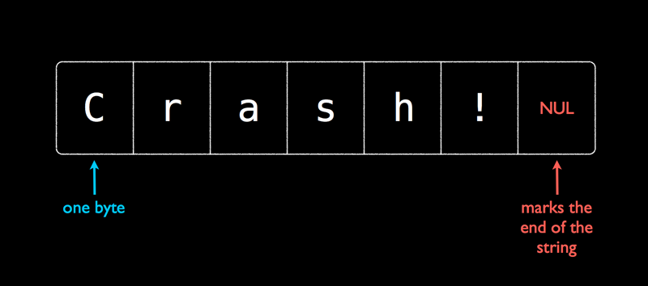
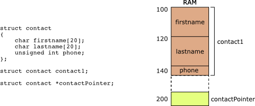

# C 编程，第四部分：字符串和结构

## 字符串、结构和陷阱

## 那么什么是字符串？



在 C 中，���们使用[空终止](https://en.wikipedia.org/wiki/Null-terminated_string)字符串，而不是[长度前缀](https://en.wikipedia.org/wiki/String_(computer_science)#Length-prefixed)，出于历史原因。对于你平常的编程来说，这意味着你需要记住空字符！在 C 中，字符串被定义为一堆字节，直到你达到'\0'或空字节为止。

## 字符串的两个位置

每当你定义一个常量字符串（即形式为`char* str = "constant"`的字符串）时，该字符串存储在*数据*或*代码*段中，这是**只读**的，这意味着任何尝试修改字符串都会导致段错误。

然而，如果有人`malloc`空间，就可以更改该字符串为他们想要的任何内容。

## 内存管理不善

一个常见的陷阱是当你写下面的内容时

```cpp
char* hello_string = malloc(14);
                       ___ ___ ___ ___ ___ ___ ___ ___ ___ ___ ___ ___ ___ ___
// hello_string ----> | g | a | r | b | a | g | e | g | a | r | b | a | g | e |
                       ‾‾‾ ‾‾‾ ‾‾‾ ‾‾‾ ‾‾‾ ‾‾‾ ‾‾‾ ‾‾‾ ‾‾‾ ‾‾‾ ‾‾‾ ‾‾‾ ‾‾‾ ‾‾‾
hello_string = "Hello Bhuvan!";
// (constant string in the text segment)
// hello_string ----> [ "H" , "e" , "l" , "l" , "o" , " " , "B" , "h" , "u" , "v" , "a" , "n" , "!" , "\0" ]
                       ___ ___ ___ ___ ___ ___ ___ ___ ___ ___ ___ ___ ___ ___
// memory_leak -----> | g | a | r | b | a | g | e | g | a | r | b | a | g | e |
                       ‾‾‾ ‾‾‾ ‾‾‾ ‾‾‾ ‾‾‾ ‾‾‾ ‾‾‾ ‾‾‾ ‾‾‾ ‾‾‾ ‾‾‾ ‾‾‾ ‾‾‾ ‾‾‾
hello_string[9] = 't'; //segfault!!
```

我们做了什么？我们为 14 个字节分配了空间，重新分配了指针，成功地导致了段错误！记住跟踪你的指针在做什么。你可能想要做的是使用`string.h`函数`strcpy`。

```cpp
strcpy(hello_string, "Hello Bhuvan!");
```

## 记住空字节！

忘记对字符串进行空终止会对字符串产生重大影响！边界检查很重要。前面在 wikibook 中提到的 heartbleed 漏洞部分是因为这个原因。

## 我在哪里可以找到所有这些函数的深入和全面的解释？

[就在这里！](https://linux.die.net/man/3/string)

## 字符串信息/比较：`strlen` `strcmp`

`int strlen(const char *s)` 返回字符串的长度，不包括空字节

`int strcmp(const char *s1, const char *s2)` 返回一个整数，确定字符串的词典顺序。如果 s1 在字典中出现在 s2 之前，则返回-1。如果两个字符串相等，则返回 0。否则返回 1。

对于大多数这些函数，它们期望字符串是可读的，而不是`NULL`，但是当你传递`NULL`时会出现未定义的行为。

## 字符串修改：`strcpy` `strcat` `strdup`

`char *strcpy(char *dest, const char *src)` 将`src`的字符串复制到`dest`。**假设 dest 有足够的空间容纳 src**

`char *strcat(char *dest, const char *src)` 将`src`的字符串连接到目的地的末尾。**此函数假定目的地末尾有足够的空间容纳`src`，包括空字节**

`char *strdup(const char *dest)` 返回字符串的`malloc`副本。

## 字符串搜索：`strchr` `strstr`

`char *strchr(const char *haystack, int needle)` 返回`haystack`中`needle`第一次出现的指针。如果找不到，则返回`NULL`。

`char *strstr(const char *haystack, const char *needle)` 与上面相同，但这次是一个字符串！

## 字符串标记化：`strtok`

一个危险但有用的函数`strtok`接受一个字符串并对其进行标记化。这意味着它将把字符串转换为单独的字符串。这个函数有很多规范，所以请阅读 man 页面，下面是一个人为的例子。

```cpp
#include <stdio.h>
#include <string.h>

int main(){
    char* upped = strdup("strtok,is,tricky,!!");
    char* start = strtok(upped, ",");
    do{
        printf("%s\n", start);
    }while((start = strtok(NULL, ",")));
    return 0;
}
```

**输出**

```cpp
strtok
is
tricky
!!
```

当我像这样改变`upped`时会发生什么？

```cpp
char* upped = strdup("strtok,is,tricky,,,!!");
```

## 内存移动：`memcpy`和`memmove`

为什么`memcpy`和`memmove`都在`<string.h>`中？因为字符串本质上是带有空字节的原始内存！

`void *memcpy(void *dest, const void *src, size_t n)` 将从`str`开始的`n`个字节移动到`dest`。**小心** 当内存区域重叠时会出现未定义的行为。这是一个经典的“在我的机器上工作”的例子，因为很多时候 valgrind 无法检测到它，因为在你的机器上它看起来是有效的。当自动评分器出现时，会失败。考虑更安全的版本。

`void *memmove(void *dest, const void *src, size_t n)` 做与上述相同的事情，但如果内存区域重叠，则保证所有字节都会正确复制过去。

## 那么`struct`是什么？



从低级别来看，一个结构体只是一块连续的内存，仅此而已。就像数组一样，结构体有足够的空间来存储所有的成员。但与数组不同，它可以存储不同的类型。考虑上面声明的 contact 结构。

```cpp
struct contact {
    char firstname[20];
    char lastname[20];
    unsigned int phone;
};

struct contact bhuvan;
```

**简短的插曲**

```cpp
/* a lot of times we will do the following typdef
 so we can just write contact contact1 */

typedef struct contact contact;
contact bhuvan;

/* You can also declare the struct like this to get
 it done in one statement */
typedef struct optional_name {
    ...
} contact;
```

如果你在没有任何优化和重新排序的情况下编译代码，你可以期望每个变量的地址看起来像这样。

```cpp
&bhuvan           // 0x100
&bhuvan.firstname // 0x100 = 0x100+0x00
&bhuvan.lastname  // 0x114 = 0x100+0x14
&bhuvan.phone     // 0x128 = 0x100+0x28
```

因为你的编译器所做的就是说'嘿，保留这么多空间，我会去计算你想要写入的任何变量的偏移量'。

## 这些偏移量是什么意思？

偏移量是变量开始的地方。电话变量从第`0x128`字节开始，持续 sizeof(int)字节，但并非总是如此。**偏移量并不决定变量的结束位置**。考虑在许多内核代码中看到的以下黑客行为。

```cpp
typedef struct {
    int length;
    char c_str[0];
} string;

const char* to_convert = "bhuvan";
int length = strlen(to_convert);

// Let's convert to a c string
string* bhuvan_name;
bhuvan_name = malloc(sizeof(string) + length+1);
/*
Currently, our memory looks like this with junk in those black spaces
 ___ ___ ___ ___ ___ ___ ___ ___ ___ ___ ___
 bhuvan_name = |   |   |   |   |   |   |   |   |   |   |   |
 ‾‾‾ ‾‾‾ ‾‾‾ ‾‾‾ ‾‾‾ ‾‾‾ ‾‾‾ ‾‾‾ ‾‾‾ ‾‾‾ ‾‾‾
*/

bhuvan_name->length = length;
/*
This writes the following values to the first four bytes
The rest is still garbage
 ___ ___ ___ ___ ___ ___ ___ ___ ___ ___ ___
 bhuvan_name = | 0 | 0 | 0 | 6 |   |   |   |   |   |   |   |
 ‾‾‾ ‾‾‾ ‾‾‾ ‾‾‾ ‾‾‾ ‾‾‾ ‾‾‾ ‾‾‾ ‾‾‾ ‾‾‾ ‾‾‾
*/

strcpy(bhuvan_name->c_str, to_convert);
/*
Now our string is filled in correctly at the end of the struct
 ___ ___ ___ ___ ___ ___ ___ ___ ___ ___ ____
 bhuvan_name = | 0 | 0 | 0 | 6 | b | h | u | v | a | n | \0 |
 ‾‾‾ ‾‾‾ ‾‾‾ ‾‾‾ ‾‾‾ ‾‾‾ ‾‾‾ ‾‾‾ ‾‾‾ ‾‾‾ ‾‾‾‾
*/

strcmp(bhuvan_name->c_str, "bhuvan") == 0 //The strings are equal!
```

## 但并不是所有的结构都是完美的

结构体可能需要一些叫做[填充](http://www.catb.org/esr/structure-packing/)（教程）的东西。**我们不指望你在这门课程中对结构体进行打包，只是知道它存在。这是因为在早期（甚至现在）当你必须从内存中获取一个地址时，你必须以 32 位或 64 位块的方式进行。这也意味着你只能请求那些是它的倍数的地址。这意味着

```cpp
struct picture{
    int height;
    pixel** data;
    int width;
    char* enconding;
}
// You think picture looks like this
           height      data         width     encoding
           ___ ___ ___ ___ ___ ___ ___ ___ ___ ___ ___ ___
picture = |       |               |       |               |
           ‾‾‾ ‾‾‾ ‾‾‾ ‾‾‾ ‾‾‾ ‾‾‾ ‾‾‾ ‾‾‾ ‾‾‾ ‾‾‾ ‾‾‾ ‾‾‾
```

概念上可能看起来像这样

```cpp
struct picture{
    int height;
    char slop1[4];
    pixel** data;
    int width;
    char slop2[4];
    char* enconding;
}
           height   slop1       data        width   slop2  encoding
           ___ ___ ___ ___ ___ ___ ___ ___ ___ ___ ___ ___ ___ ___ ___ ___
picture = |       |       |               |       |       |               |
           ‾‾‾ ‾‾‾ ‾‾‾ ‾‾‾ ‾‾‾ ‾‾‾ ‾‾‾ ‾‾‾ ‾‾‾ ‾‾‾ ‾‾‾ ‾‾‾ ‾‾‾ ‾‾‾ ‾‾‾ ‾‾‾
```

（这是在 64 位系统上）这并不总是这样，因为有时处理器支持不对齐访问。这是什么意思？嗯，有两种选择你可以设置一个属性

```cpp
struct __attribute__((packed, aligned(4))) picture{
    int height;
    pixel** data;
    int width;
    char* enconding;
}
// Will look like this
           height       data        width     encoding
           ___ ___ ___ ___ ___ ___ ___ ___ ___ ___ ___ ___
picture = |       |               |       |               |
           ‾‾‾ ‾‾‾ ‾‾‾ ‾‾‾ ‾‾‾ ‾‾‾ ‾‾‾ ‾‾‾ ‾‾‾ ‾‾‾ ‾‾‾ ‾‾‾
```

但现在每次我想要访问`data`或`encoding`，我都必须进行两次内存访问。你可以做的另一件事是重新排列结构，尽管这并不总是可能的

```cpp
struct picture{
    int height;
    int width;
    pixel** data;
    char* enconding;
}
// You think picture looks like this
           height   width        data         encoding
           ___ ___ ___ ___ ___ ___ ___ ___ ___ ___ ___ ___
picture = |       |       |               |               |
           ‾‾‾ ‾‾‾ ‾‾‾ ‾‾‾ ‾‾‾ ‾‾‾ ‾‾‾ ‾‾‾ ‾‾‾ ‾‾‾ ‾‾‾ ‾‾‾
```


