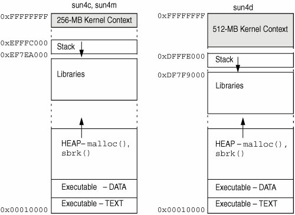
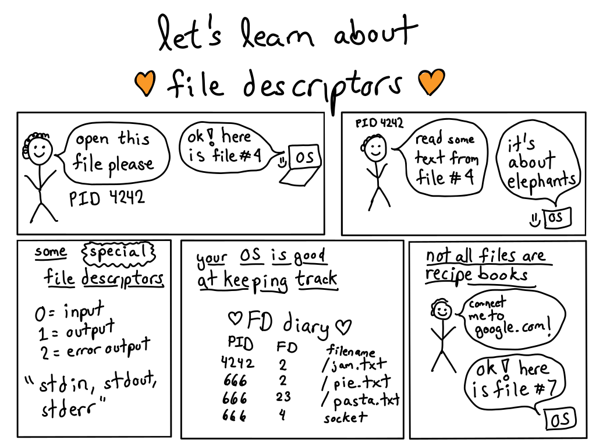

# 进程，第一部分：介绍

## 概述

进程是正在运行的程序（有点）。进程也只是计算机程序运行的一个实例。进程有很多可用的东西。在每个程序开始时，您会得到一个进程，但每个程序都可以创建更多的进程。事实上，您的操作系统只启动一个进程，所有其他进程都是从那个进程分叉出来的——在启动时都是在后台完成的。

## 在开始时

当您的 Linux 机器上的操作系统启动时，会创建一个名为`init.d`的进程。该进程是一个特殊的进程，处理信号、中断和某些内核元素的持久性模块。每当您想要创建一个新进程时，都会调用`fork`（将在后面的部分讨论）并使用另一个函数来加载另一个程序。

## 进程隔离

进程非常强大，但它们是隔离的！这意味着默认情况下，没有进程可以与另一个进程通信。这非常重要，因为如果您有一个庞大的系统（比如 EWS），那么您希望一些进程具有更高的特权（监控、管理），而您绝对不希望普通用户能够故意或者意外地通过修改进程来使整个系统崩溃。

如果我运行以下代码，

```cpp
int secrets; //maybe defined in the kernel or else where
secrets++;
printf("%d\n", secrets); 
```

在两个不同的终端上，正如您所猜测的，它们都会打印出 1 而不是 2。即使我们改变代码以执行一些非常巧妙的操作（除了直接读取内存），也没有办法改变另一个进程的状态（好吧，也许[这个](https://en.wikipedia.org/wiki/Dirty_COW)，但那就有点太深入了）。

## 进程内容

## 内存布局



当一个进程启动时，它会得到自己的地址空间。这意味着每个进程都会得到（对于内存

+   **堆栈**。堆栈是存储自动变量和函数调用返回地址的地方。每次声明一个新变量，程序都会将堆栈指针向下移动，以保留变量的空间。堆栈的这一部分是可写的，但不可执行。如果堆栈增长得太远（意味着它要么超出了预设的边界，要么与堆相交），您很可能会得到堆栈溢出，最终导致段错误或类似的错误。**默认情况下，堆栈是静态分配的，这意味着只有一定数量的空间可以写入**

+   **堆**。堆是一个不断扩大的内存区域。如果要分配一个大对象，它就会放在这里。堆从文本段的顶部开始向上增长（这意味着有时当您调用`malloc`时，它会要求操作系统将堆边界向上推）。这个区域也是可写的，但不可执行。如果系统受限或者地址用完了（在 32 位系统上更常见），就可能用完堆内存。

+   **数据段**。这包含了所有的全局变量。这一部分从文本段的末尾开始，大小是静态的，因为全局变量的数量在编译时就已知。这一部分是可写的，但不可执行，没有其他太花哨的东西。

+   **文本段**。这可以说是地址中最重要的部分。这是存储所有代码的地方。由于汇编编译成了 1 和 0，这就是 1 和 0 存储的地方。程序计数器在这个段中执行指令，并向下移动到下一个指令。重要的是要注意，这是代码中唯一可执行的部分。如果您尝试在运行时更改代码，很可能会导致段错误（虽然有办法绕过，但假设它会导致段错误）。

+   为什么它不从零开始？这超出了本课程的[范围](https://en.wikipedia.org/wiki/Address_space_layout_randomization)，但这是出于安全考虑。

## 文件描述符



正如小册子所示，操作系统跟踪文件描述符及其指向的内容。我们将在后面看到，文件描述符不一定指向实际文件，操作系统会为您跟踪它们。另外，请注意，在进程之间文件描述符可能会被重用，但在进程内部它们是唯一的。

文件描述符也有位置的概念。您可以完全从磁盘上读取文件，因为操作系统跟踪文件中的位置，并且该位置也属于您的进程。

## 安全/权限

## 进程功能/限制（奖励）

当您复习期末考试时，您可以回来看看进程也具有所有这些东西。第一次看时 - 它可能不太有意义。

## 进程 ID（PID）

为了跟踪所有这些进程，您的操作系统为每个进程分配一个数字，该进程称为 PID，即进程 ID。

进程还可以包含

+   映射

+   状态

+   文件描述符

+   权限

[分叉，第一部分：介绍](https://github.com/angrave/SystemProgramming/wiki/Forking%2C-Part-1%3A-Introduction)
