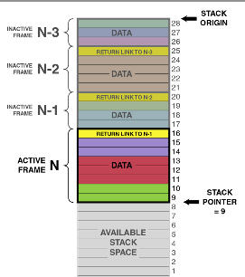
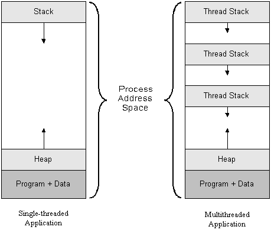

# Pthreads，第一部分：介绍

## 线程简介

## 什么是线程？

线程是“执行线程”的缩写。它表示 CPU 已经（并将）执行的指令序列。为了记住如何从函数调用返回，并存储自动变量和参数的值，线程使用堆栈。

## 轻量级进程（LWP）是什么？它与线程有什么关系？

对于所有目的和意图来说，线程就是一个进程（意味着创建线程类似于`fork`），只是**没有复制**，意味着没有写时复制。这允许进程共享相同的地址空间、变量、堆、文件描述符等。

创建线程的实际系统调用类似于`fork`；它是`clone`。我们不会深入讨论，但您可以阅读[man pages](http://man7.org/linux/man-pages/man2/clone.2.html)，请记住这超出了本课程的直接范围。

在许多情况下，LWP 或线程比 forking 更受欢迎，因为创建它们的开销要少得多。但在某些情况下（特别是 Python 使用这种方式），多进程是使代码更快的方法。

## 线程的堆栈是如何工作的？

您的主函数（以及您可能调用的其他函数）具有自动变量。我们将使用堆栈将它们存储在内存中，并使用简单指针（“堆栈指针”）跟踪堆栈的大小。如果线程调用另一个函数，我们将将堆栈指针向下移动，以便我们有更多的空间用于参数和自动变量。一旦从函数返回，我们可以将堆栈指针移回到其先前的值。我们在堆栈上保留旧的堆栈指针值的副本！这就是为什么从函数返回非常快速的原因-释放自动变量使用的内存很容易-我们只需要更改堆栈指针。



在多线程程序中，有多个堆栈，但只有一个地址空间。pthread 库分配一些堆栈空间（可以在堆中分配，也可以使用主程序的堆栈的一部分），并使用`clone`函数调用在该堆栈地址启动线程。总地址空间可能看起来像这样。



## 我的进程可以有多少个线程？

您可以在一个进程内运行多个线程。您可以免费获得第一个线程！它运行您在“main”内编写的代码。如果您需要更多线程，可以使用 pthread 库调用`pthread_create`创建一个新线程。您需要传递一个指向函数的指针，以便线程知道从哪里开始。

您创建的所有线程都存在于相同的虚拟内存中，因为它们是同一进程的一部分。因此，它们都可以看到堆、全局变量和程序代码等。因此，您可以让两个（或更多）CPU 同时在同一进程中运行您的程序。由操作系统来分配线程给 CPU。如果活动线程多于 CPU，则内核将为线程分配一个 CPU 进行短暂的持续时间（或直到它没有要做的事情），然后将自动切换 CPU 以处理另一个线程。例如，一个 CPU 可能正在处理游戏 AI，而另一个线程正在计算图形输出。

## 简单用法

## Hello world pthread 示例

要使用 pthread，您需要包括`pthread.h`，并且需要使用`-pthread`（或`-lpthread`）编译器选项进行编译。此选项告诉编译器您的程序需要线程支持

要创建线程，请使用函数`pthread_create`。此函数有四个参数：

```cpp
int pthread_create(pthread_t *thread, const pthread_attr_t *attr,
                   void *(*start_routine) (void *), void *arg);
```

+   第一个是指向将保存新创建的线程的 ID 的变量的指针。

+   第二个是指向属性的指针，我们可以使用它来调整和调优一些 pthread 的高级特性。

+   第三个是指向我们想要运行的函数的指针

+   第四个是将赋予我们的函数的指针

`void *(*start_routine) (void *)` 这个参数很难理解！它表示一个接受 `void *` 指针并返回 `void *` 指针的指针。它看起来像一个函数声明，只是函数的名称被 `(* .... )` 包裹起来。

以下是最简单的例子：

```cpp
#include <stdio.h>
#include <pthread.h>
// remember to set compilation option -pthread

void *busy(void *ptr) {
// ptr will point to "Hi"
    puts("Hello World");
    return NULL;
}
int main() {
    pthread_t id;
    pthread_create(&id, NULL, busy, "Hi");
    while (1) {} // Loop forever
}
```

如果我们想要等待线程完成，可以使用 `pthread_join`。

```cpp
void *result;
pthread_join(id, &result);
```

在上面的例子中，`result` 将会是 `null`，因为忙碌的函数返回了 `null`。我们需要传递结果的地址，因为 `pthread_join` 将会写入指针的内容。

参见[Pthreads Part 2](https://github.com/angrave/SystemProgramming/wiki/Pthreads%2C-Part-2%3A-Usage-in-Practice)
