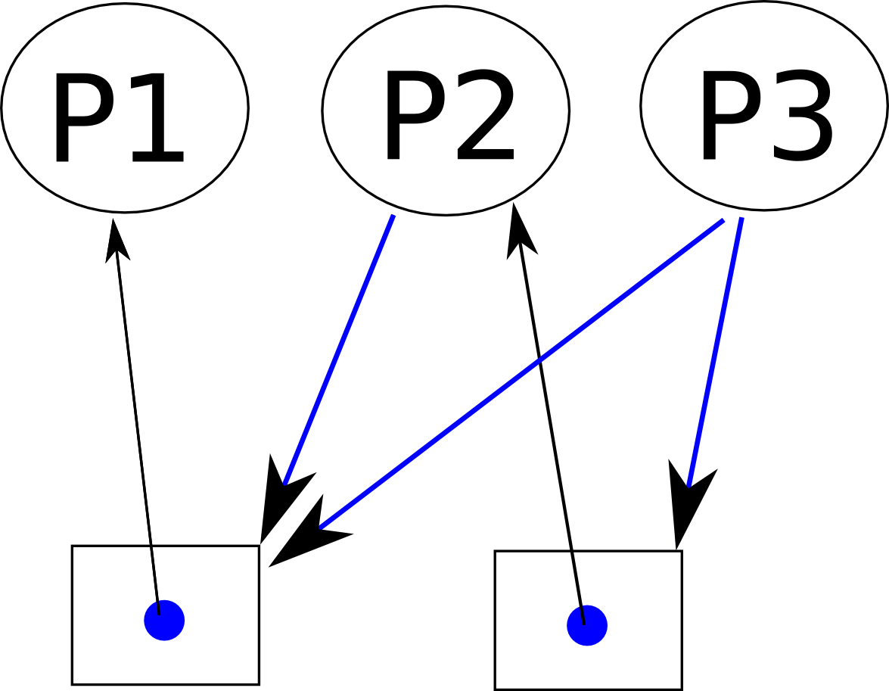

# 死锁，第一部分：资源分配图

## 什么是资源分配图？

资源分配图跟踪哪个进程持有哪个资源，以及哪个进程正在等待特定类型的资源。这是一个非常强大而简单的工具，用来说明交互进程如何发生死锁。如果一个进程*使用*一个资源，就从资源节点到进程节点画一个箭头。如果一个进程*请求*一个资源，就从进程节点到资源节点画一个箭头。

如果资源分配图中有一个循环，并且循环中的每个资源只提供一个实例，那么进程将发生死锁。例如，如果进程 1 持有资源 A，进程 2 持有资源 B，进程 1 正在等待 B，进程 2 正在等待 A，那么进程 1 和 2 将发生死锁。

这里有另一个例子，显示了进程 1 和 2 获取资源 1 和 2，而进程 3 正在等待获取这两个资源。在这个例子中，没有死锁，因为没有循环依赖。

## 死锁！

很多时候，我们不知道资源可能被获取的具体顺序，所以我们可以绘制有向图。

作为可能性矩阵。然后我们可以画箭头，看看是否有一个有向版本会导致死锁。

考虑以下资源分配图（假设进程请求对文件的独占访问）。如果有一堆进程在运行，并且它们请求资源，操作系统最终处于这种状态，你就会发生死锁！你可能看不到这一点，因为操作系统可能会**抢占**一些进程来打破循环，但你的三个孤独进程仍然有可能发生死锁。你也可以使用`make`和规则依赖关系（例如我们的 parmake MP）制作这种类型的图表。

