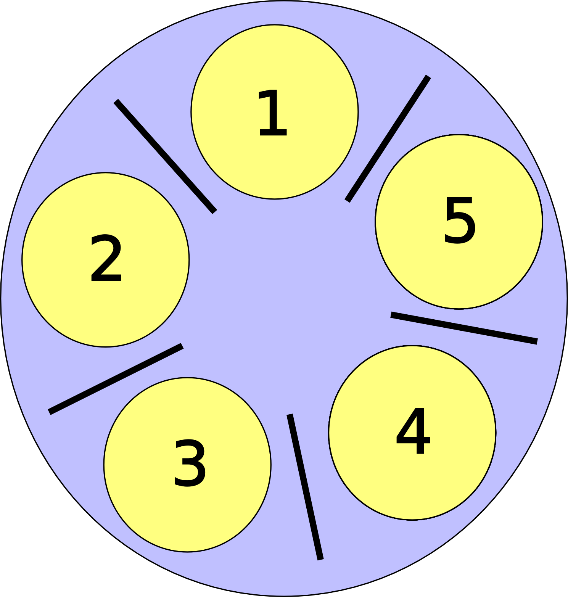

# 死锁，第二部分：死锁条件

## Coffman 条件

死锁有四个*必要*和*充分*条件。这些被称为 Coffman 条件。

+   互斥

+   循环等待

+   持有并等待

+   无抢占

如果打破其中任何一个，就不会发生死锁！

所有这些条件都是死锁所必需的，所以让我们依次讨论每一个。首先是简单的-

+   互斥：资源不能被共享

+   循环等待：资源分配图中存在一个循环。存在一组进程{P1，P2，...}，使得 P1 正在等待 P2 持有的资源，P2 正在等待 P3，...，P3 正在等待 P1 持有的资源。

+   持有并等待：一个进程获取了一个不完整的资源集，并在等待其他资源时保持它们。

+   无抢占：一旦一个进程获取了一个资源，该资源就不能被从一个进程那里拿走，而且进程也不会自愿放弃一个资源。

## 打破 Coffman 条件

两个学生需要一支笔和一张纸：

+   学生们共享一支笔和一张纸。避免了死锁，因为不需要互斥。

+   学生们都同意先拿笔再拿纸。避免了死锁，因为不会有循环等待。

+   学生们一次拿起笔和纸（“要么都拿，要么都不拿”）。避免了死锁，因为没有*持有并等待*

+   学生们是朋友，会要求对方放弃持有的资源。避免了死锁，因为允许抢占。

## 活锁

活锁不是死锁-

考虑以下的“解决方案”

+   如果他们无法在 10 秒内拿起另一个资源，学生们会放下一个持有的资源。这个解决方案避免了死锁，但可能会遭受活锁。

活锁发生在一个进程继续执行但无法取得进展。在实践中，活锁可能是因为程序员已经采取措施避免死锁。在上面的例子中，在繁忙的系统中，学生将不断释放第一个资源，因为他们永远无法获得第二个资源。系统不是死锁（学生进程仍在执行），但也没有取得任何进展。

## 死锁预防/避免 vs 死锁检测

死锁预防是确保死锁不会发生，这意味着你打破了 Coffman 条件。这在单个程序内效果最好，软件工程师可以选择打破某个 Coffman 条件。考虑[银行家算法](https://en.wikipedia.org/wiki/Banker's_algorithm)。这是另一个用于避免死锁的算法。整个实现超出了本课程的范围，只需知道操作系统有更通用的算法。

另一方面，死锁检测允许系统进入死锁状态。进入后，系统使用其拥有的信息来打破死锁。例如，考虑多个进程访问文件。操作系统能够通过文件描述符在某个级别（通过 API 或直接）跟踪所有文件/资源。如果操作系统在操作系统文件描述符表中检测到一个有向循环，它可能会打破一个进程的持有（例如通过调度）并让系统继续进行。

## 餐桌哲学家

餐桌哲学家问题是一个经典的同步问题。想象我邀请 N（假设为 5）位哲学家共进晚餐。我们将他们安排在一张桌子旁，放置 5 根筷子（每位哲学家之间各有一根）。哲学家交替地想要吃饭或思考。为了吃饭，哲学家必须拿起他们位置两侧的两根筷子（原始问题要求每位哲学家有两把叉子）。然而这些筷子是与他的邻居共享的。

设计一种有效的解决方案，使所有哲学家都能吃饭吗？或者，会有一些哲学家挨饿，永远得不到第二根筷子吗？或者他们全部陷入僵局？例如，想象每个客人都拿起左边的筷子，然后等待右边的筷子空闲。哎呀 - 我们的哲学家陷入了僵局！
