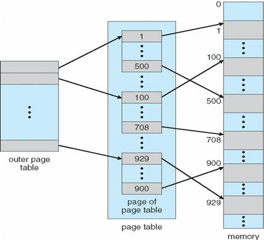
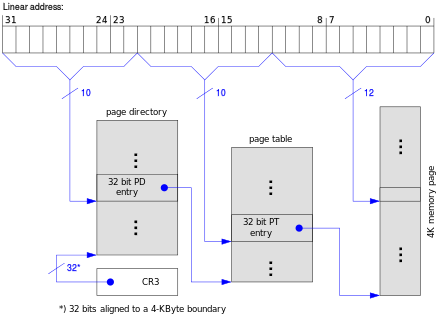

# 虚拟内存，第一部分：虚拟内存简介

## 什么是虚拟内存？

在非常简单的嵌入式系统和早期计算机中，进程直接访问内存，即“地址 1234”对应于物理内存的特定部分中存储的特定字节。在现代系统中，情况已经不再是这样。相反，每个进程都是隔离的；并且存在着一个地址转换过程，将进程的特定 CPU 指令或数据的地址与物理内存（“RAM”）的实际字节对应起来。内存地址不再是“真实的”；进程在虚拟内存中运行。虚拟内存不仅可以保护进程的安全（因为一个进程不能直接读取或修改另一个进程的内存），还允许系统有效地分配和重新分配内存的部分给不同的进程。

## MMU 是什么？

内存管理单元是 CPU 的一部分。它将虚拟内存地址转换为物理地址。如果当前没有从特定虚拟地址到物理地址的映射，或者当前 CPU 指令尝试写入进程只有读取访问权限的位置，MMU 也可能中断 CPU。

## 那么我们如何将虚拟地址转换为物理地址？

想象一下你有一台 32 位的机器。指针可以保存 32 位，即它们可以寻址 2^32 个不同的位置，即 4GB 的内存（我们将遵循一个地址可以保存一个字节的标准约定）。

想象我们有一个大表 - 这是聪明的部分 - 存储在内存中！对于每个可能的地址（共 40 亿个），我们将存储“真实”即物理地址。每个物理地址将需要 4 个字节（以容纳 32 位）。这种方案将需要 160 亿字节来存储所有条目。哎呀 - 我们的查找方案将消耗我们可能为我们的 4GB 机器购买的所有内存。我们需要做得比这更好。我们的查找表最好比我们拥有的内存小，否则我们将没有空间留给我们的实际程序和操作系统数据。解决方案是将内存分成称为“页面”和“帧”的小区域，并为每个页面使用查找表。

## 什么是页面？有多少个页面？

页面是一块虚拟内存。Linux 操作系统上的典型块大小为 4KB（即 2^12 个地址），尽管您可以找到更大块的示例。

因此，我们不再谈论单个字节，而是谈论 4KB 的块，每个块称为一个页面。我们还可以对我们的页面进行编号（“页面 0”“页面 1”等）

## 例如：32 位机器有多少页（假设页面大小为 4KB）？

答案：2^32 地址 / 2^12 = 2^20 页。

记住 2^10 是 1024，所以 2^20 略大于一百万。

对于 64 位机器，2^64 / 2^12 = 2^52，大约是 10^15 页。

## 什么是帧？

帧（有时称为“页帧”）是一块*物理内存*或 RAM（=随机存取存储器）。这种内存有时被称为“主存储器”（与较慢的辅助存储器相对，例如具有较低访问时间的旋转磁盘）

一个帧的字节数与虚拟页面相同。如果 32 位机器有 2^32（4GB）的 RAM，那么在机器的可寻址空间中将有相同数量的帧。64 位机器不太可能有 2^64 字节的 RAM - 你能看出为什么吗？

## 什么是页面表，它有多大？

页面表是页面到帧之间的映射。例如，页面 1 可能映射到帧 45，页面 2 映射到帧 30。其他帧可能目前未使用或分配给其他正在运行的进程，或者由操作系统内部使用。

一个简单的页面表就是一个数组，`int frame = table[ page_num ];`

对于一个 32 位机器，每个 4KB 页面的条目需要保存一个帧号-即 20 位，因为我们计算出有 2^20 个帧。每个条目需要 2.5 个字节！实际上，我们将每个条目四舍五入到 4 个字节，并找到这些多余位的用途。每个条目需要 4 个字节 x 2^20 个条目= 4MB 的物理内存用于存储页表。

对于一个 64 位机器，每个 4KB 页面的条目需要 52 位。让我们将每个条目四舍五入到 64 位（8 字节）。有 2^52 个条目，大约需要 2^55 字节（大约 40PB...）哎呀，我们的页表太大了。

在 64 位体系结构中，内存地址是稀疏的，因此我们需要一种机制来减小页表的大小，因为大多数条目永远不会被使用。



这里有一个页表的视觉示例。想象访问一个数组并获取数组元素。

## 偏移量是什么，它是如何使用的？

记住，我们的页表将页面映射到帧，但每个页面都是一块连续的地址。我们如何计算在特定帧内使用哪个特定字节？解决方案是直接重用虚拟内存地址的最低位。例如，假设我们的进程正在读取以下地址- `VirtualAddress = 11110000111100001111000010101010（二进制）`

在页面大小为 256 字节的机器上，最低的 8 位（10101010）将被用作偏移量。剩下的上位位将是页号（111100001111000011110000）。

## 多级页表

多级页面是 64 位体系结构的页表大小问题的一种解决方案。我们将看看最简单的实现-两级页表。每个表都是指向下一级表的指针列表，不需要所有子表都存在。下面是 32 位体系结构的两级页表的示例-

```cpp
VirtualAddress = 11110000111111110000000010101010 (binary)
                 |_Index1_||        ||          | 10 bit Directory index
                           |_Index2_||          | 10 bit Sub-table index
                                     |__________| 12 bit offset (passed directly to RAM) 
```

在上述方案中，确定帧号需要两次内存读取：使用顶部的 10 位在页表目录中。如果每个条目使用 2 个字节，我们只需要 2KB 来存储整个目录。每个子表将指向物理帧（即需要 4 个字节来存储 20 位）。然而，对于只需要微小内存的进程，我们只需要指定低内存地址（用于堆和程序代码）和高内存地址（用于堆栈）的条目。每个子表是 1024 个条目 x 4 个字节，即每个子表需要 4KB。因此，我们的多级页表的总内存开销已经从 4MB（单级）减少到 3 帧内存（12KB）！

页表会使内存访问变慢吗？（TLB 是什么）

是的-显著！（但由于聪明的硬件，通常不会...）与直接读取或写入内存相比。对于单个页表，我们的机器现在慢了一倍！（需要两次内存访问）对于两级页表，内存访问现在慢了三倍。（需要三次内存访问）

为了克服这种开销，MMU 包括一个最近使用的虚拟页到帧查找的关联缓存。这个缓存被称为 TLB（“转换旁路缓冲区”）。每当需要将虚拟地址转换为物理内存位置时，TLB 与页表并行查询。对于大多数程序的大多数内存访问，TLB 缓存结果的机会很大。但是，如果一个程序没有良好的缓存一致性（例如从许多不同页面的随机内存位置读取），那么 TLB 将不会有结果缓存，现在 MMU 必须使用速度慢得多的页表来确定物理帧。



这可能是如何分割多级页表的方式。

## 高级帧和页面保护

## 帧可以在进程之间共享吗？它们可以被专门化吗？

是的！除了存储帧编号之外，页面表还可以用于存储进程是否可以写入或只读特定帧。只读帧可以安全地在多个进程之间共享。例如，C 库指令代码可以在所有动态将代码加载到进程内存中的进程之间共享。每个进程只能读取该内存。这意味着如果您尝试写入内存中的只读页面，您将收到`SEGFAULT`。这就是为什么有时内存访问会导致段错误，有时不会，这完全取决于您的硬件是否允许您访问。

此外，进程可以使用`mmap`系统调用与子进程共享页面。`mmap`是一个有趣的调用，因为它不是将每个虚拟地址绑定到物理帧，而是绑定到其他东西。这个其他东西可以是文件、GPU 单元或者你能想到的任何其他内存映射操作！写入内存地址可能会直接写入设备，或者写入可能会被操作系统暂停，但这是一个非常强大的抽象，因为操作系统通常能够执行优化（多个进程内存映射相同的文件可以让内核创建一个映射）。

## 页面表中还存储了什么，以及为什么？

除了上面讨论的只读位和使用统计信息之外，通常至少存储只读、修改和执行信息。

## 什么是页面故障？

页面故障是指运行中的程序尝试访问其地址空间中未映射到物理内存的某些虚拟内存。页面故障也会在其他情况下发生。

有三种类型的页面故障

**次要** 如果页面尚未映射，但是是有效地址。这可能是`sbrk(2)`要求的内存，但尚未写入，这意味着操作系统可以在分配空间之前等待第一次写入。操作系统只需创建页面，将其加载到内存中，然后继续进行。

**主要** 如果页面的映射不在内存中而在磁盘上。这将会将页面交换到内存中，并将另一个页面交换出去。如果这种情况发生频繁，您的程序就会被称为*抖动*MMU。

**无效** 当您尝试写入不可写内存地址或读取不可读内存地址时。MMU 会生成一个无效故障，操作系统通常会生成一个`SIGSEGV`，表示分段违规，这意味着您写入了超出您可以写入的段的位置。

### 只读位

只读位将页面标记为只读。尝试写入页面将导致页面故障。然后内核将处理页面故障。只读页面的两个例子包括在多个进程之间共享 c 运行时库（出于安全考虑，您不希望允许一个进程修改库）；以及写时复制，其中复制页面的成本可以延迟到第一次写入发生时。

### 脏位

[`en.wikipedia.org/wiki/Page_table#Page_table_data`](http://en.wikipedia.org/wiki/Page_table#Page_table_data)

> 脏位允许进行性能优化。从磁盘分页到物理内存，然后再次读取，然后再次分页出去的页面不需要写回磁盘，因为页面没有更改。但是，如果页面在分页后被写入，其脏位将被设置，表示页面必须写回备份存储。这种策略要求备份存储在将页面分页到内存后保留页面的副本。当不使用脏位时，备份存储只需与任何时刻分页出的所有页面的瞬时总大小一样大。当使用脏位时，始终会存在一些页面既存在于物理内存中又存在于备份存储中。

### 执行位

执行位定义了页面中的字节是否可以作为 CPU 指令执行。通过禁用页面，可以防止恶意存储在进程内存中的代码（例如通过堆栈溢出）被轻易执行。（更多阅读：[`en.wikipedia.org/wiki/NX_bit#Hardware_background`](http://en.wikipedia.org/wiki/NX_bit#Hardware_background)）

### 了解更多

在 x86 平台上，有关分页和页面位的更低级别的技术讨论可在[[`wiki.osdev.org/Paging`](http://wiki.osdev.org/Paging)]找到。
