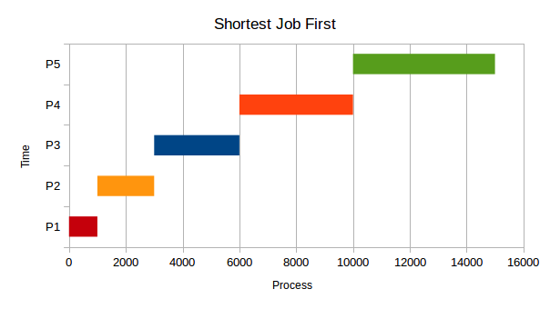
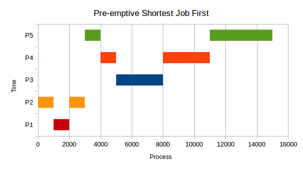
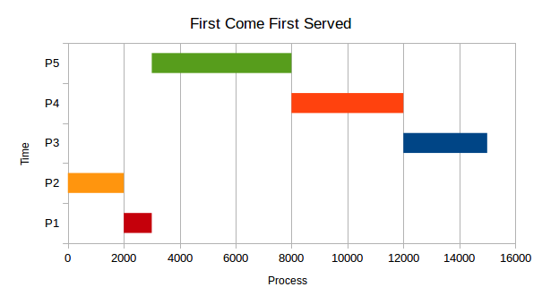
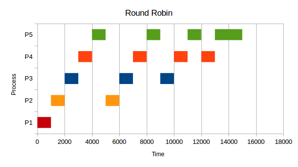

# 调度，第二部分：调度进程：算法

## 一些著名的调度算法是什么？

对于所有的例子，

进程 1：运行时间 1000 毫秒

进程 2：运行时间 2000 毫秒

进程 3：运行时间 3000 毫秒

进程 4：运行时间 4000 毫秒

进程 5：运行时间 5000 毫秒

## 最短作业优先（SJF）

+   P1 到达：0 毫秒

+   P2 到达：0 毫秒

+   P3 到达：0 毫秒

+   P4 到达：0 毫秒

+   P5 到达：0 毫秒

所有进程在开始时到达，调度程序安排具有最短总 CPU 时间的作业。明显的问题是，这个调度程序需要在运行程序之前知道这个程序将在未来的时间内运行多长时间。

技术说明：实际的 SJF 实现不会使用进程的总执行时间，而是使用突发时间（包括进程不再准备运行之前的未来计算执行的总 CPU 时间）。可以通过使用基于先前突发时间的指数衰减加权滚动平均值来估计预期的突发时间，但是为了简化讨论，我们将在这里使用进程的总运行时间作为突发时间的代理。

**优点**

+   较短的作业往往会先运行

**缺点**

+   需要算法是全知的

## 抢占式最短作业优先（PSJF）

抢占式最短作业优先类似于最短作业优先，但如果新作业的运行时间比进程的剩余运行时间短，则运行该作业。（如果像我们的例子一样相等，我们的算法可以选择）。调度程序使用进程的总运行时间，如果要使用最短*剩余*时间，那就是 PSJF 的一个变体，称为最短剩余时间优先。

+   P2 在 0 毫秒

+   P1 在 1000 毫秒

+   P5 在 3000 毫秒

+   P4 在 4000 毫秒

+   P3 在 5000 毫秒

我们的算法是这样的。它运行 P2，因为它是唯一要运行的东西。然后 P1 在 1000 毫秒时进来，P2 运行了 2000 毫秒，所以我们的调度程序会抢占性地停止 P2，并让 P1 一直运行（这完全取决于算法，因为时间相等）。然后，P5 进来了--因为没有进程在运行，调度程序将运行进程 5。P4 进来了，因为运行时间相等于 P5，调度程序停止 P5 并运行 P4。最后 P3 进来，抢占 P4，并运行到完成。然后 P4 运行，然后 P5 运行。

**优点**

+   确保较短的作业先运行

**缺点**

+   需要再次知道运行时间

**注意：**出于历史原因，该算法比较总运行时间*而不是*剩余运行时间。如果要考虑剩余时间，将使用抢占式最短剩余时间优先（PSRTF）。

## 先来先服务（FCFS）

+   P2 在 0 毫秒

+   P1 在 1000 毫秒

+   P5 在 3000 毫秒

+   P4 在 4000 毫秒

+   P3 在 5000 毫秒

进程按到达顺序进行调度。FCFS 的一个优点是调度算法很简单：就绪队列只是一个 FIFO（先进先出）队列。FCFS 遭受护航效应的影响。

这里 P2 到达，然后是 P1 到达，然后是 P5，然后是 P4，然后是 P3。您可以看到 P5 的护航效应。

**优点**

+   简单实现

**缺点**

+   长时间运行的进程可能会阻塞所有其他进程

## 轮转法（RR）

进程按照它们在就绪队列中的到达顺序进行调度。但是在一个小的时间步长之后，正在运行的进程将被强制从运行状态中移除，并放回就绪队列。这确保了长时间运行的进程不能使所有其他进程无法运行。进程在返回就绪队列之前可以执行的最长时间称为时间量子。在时间量子较大的极限情况下（时间量子长于所有进程的运行时间），轮转法将等效于 FCFS。

+   P1 到达：0 毫秒

+   P2 到达：0 毫秒

+   P3 到达：0 毫秒

+   P4 到达：0 毫秒

+   P5 到达：0 毫秒

量子=1000 毫秒

在这里，所有进程同时到达。P1 运行 1 个量子，然后完成。P2 运行一个量子；然后，它被停止给 P3。在所有其他进程运行一个量子后，我们循环回到 P2，直到所有进程都完成。

**优点**

+   确保公平的概念

**缺点**

+   大量进程=大量切换

## 优先级

进程按优先级值的顺序进行调度。例如，导航进程可能比日志记录进程更重要执行。
