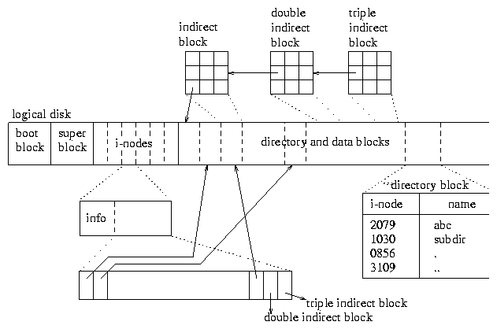

# 文件系统，第一部分：介绍

## 导航/术语

## 设计一个文件系统！你的设计目标是什么？

文件系统的设计是一个困难的问题，因为有许多我们想要满足的高级设计目标。一个不完整的理想目标清单包括：

+   可靠和健壮（即使有硬件故障或由于断电而导致不完整的写入）

+   访问（安全）控制

+   会计和配额

+   索引和搜索

+   版本控制和备份功能

+   加密

+   自动压缩

+   高性能（例如内存中的缓存）

+   高效使用存储去重

并非所有文件系统都原生支持所有这些目标。例如，许多文件系统不会自动压缩很少使用的文件

## `.`、`..`和`...`是什么？

在标准的 Unix 文件系统中：

+   `.`表示当前目录

+   `..`表示父目录

+   `...`不是任何目录的有效表示（这不是爷爷文件夹）。它*可能*是磁盘上的一个文件的名称。

## 绝对路径和相对路径是什么？

绝对路径是从您的目录树的'根节点'开始的路径。相对路径是从树中的当前位置开始的路径。

## 相对路径和绝对路径的一些例子是什么？

如果您从您的主目录开始（简称“~”），那么`Desktop/cs241`将是一个相对路径。它的绝对路径对应物可能是类似于`/Users/[yourname]/Desktop/cs241`的东西。

## 如何简化`a/b/../c/./`？

记住`..`表示'父文件夹'，`.`表示'当前文件夹'。

例如：`a/b/../c/.`

+   步骤 1：`cd a`（在 a 中）

+   步骤 2：`cd b`（在 a/b 中）

+   步骤 3：`cd ..`（在 a 中，因为..表示'父文件夹'）

+   步骤 4：`cd c`（在 a/c 中）

+   步骤 5：`cd .`（在 a/c 中，因为.表示'当前文件夹'）

因此，这条路径可以简化为`a/c`。

## 那么什么是文件系统？

文件系统是如何在磁盘上组织信息的。每当您想要访问一个文件时，文件系统规定了文件的读取方式。这是一个文件系统的示例图像。

哇，这太多了，让我们分解一下

+   超级块：这个块包含关于文件系统的元数据，大小、最后修改时间、日志、索引节点数和第一个索引节点的起始位置、数据块数和第一个数据块的起始位置。

+   索引节点：这是关键的抽象。索引节点是一个文件。

+   磁盘块：这是数据存储的地方。文件的实际内容

## 索引节点如何存储文件内容？

来自[Wikipedia](http://en.wikipedia.org/wiki/Inode)：

> *在类 Unix 风格的文件系统中，索引节点，非正式地称为 inode，是用来表示文件系统对象的数据结构，可以是各种东西，包括文件或目录。每个 inode 存储文件系统对象数据的属性和磁盘块位置。文件系统对象属性可能包括操作元数据（例如更改、访问、修改时间），以及所有者和权限数据（例如组 ID、用户 ID、权限）。*

要读取文件的前几个字节，跟随第一个间接块指针到第一个间接块并读取前几个字节，写入是相同的过程。如果要读取整个文件，继续读取直接块，直到大小用完（我们稍后会讨论间接块）

> “计算机科学中的所有问题都可以通过另一层间接性来解决。”- David Wheeler

## 为什么要使磁盘块的大小与内存页面相同？

支持虚拟内存，这样我们就可以将东西分页到内存中和从内存中分页出来。

## 我们想要为每个文件存储什么信息？

+   文件名

+   文件大小

+   创建时间、最后修改时间、最后访问时间

+   权限

+   文件路径

+   校验和

+   文件数据（索引节点）

## 文件的传统权限是什么：用户-组-其他权限？

一些常见的文件权限包括：

+   755：`rwx r-x r-x`

用户：`rwx`，组：`r-x`，其他人：`r-x`

用户可以读取、写入和执行。组和其他人只能读取和执行。

+   644：`rw- r-- r--`

用户：`rw-`，组：`r--`，其他人：`r--`

用户可以读写。组和其他人只能读。

## 对于每个角色的常规文件，有 3 个权限位是什么？

+   读（最高有效位）

+   写（第二位）

+   执行（最低有效位）

## “644”“755”是什么意思？

这些是八进制格式（基数 8）的权限示例。每个八进制数字对应不同的角色（用户、组、全局）。

我们可以按照八进制格式读取权限如下：

+   644 - 用户权限为 R/W，组权限为 R，全局权限为 R

+   755 - 用户权限为 R/W/X，组权限为 R/X，全局权限为 R/X

## 每个间接表可以存储多少个指针？

举个例子，假设我们将磁盘分成 4KB 块，并且我们想要寻址多达 2^32 块。

最大磁盘大小为 4KB * 2^32 = 16TB（记住 2^10 = 1024）

一个磁盘块可以存储 4KB / 4B（每个指针需要 32 位）= 1024 个指针。每个指针指向一个 4KB 的磁盘块 - 因此您可以引用多达 1024 * 4KB = 4MB 的数据

对于相同的磁盘配置，双间接块存储 1024 个指针指向 1024 个间接表。因此，双间接块可以引用多达 1024 * 4MB = 4GB 的数据。

同样，三重间接块可以引用多达 4TB 的数据。

[转到文件系统：第二部分](https://github.com/angrave/SystemProgramming/wiki/File-System,-Part-2:-Files-are-inodes-(everything-else-is-just-data...))
