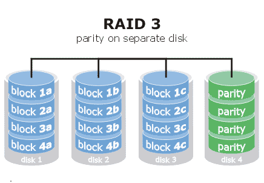
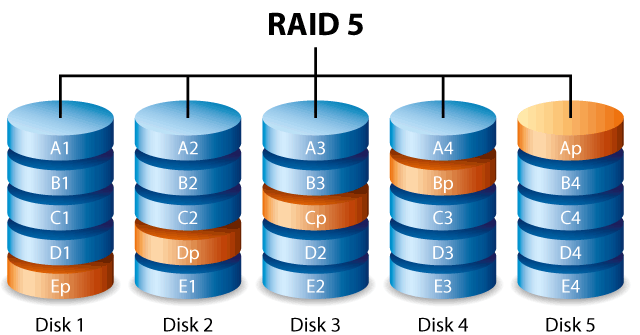

# 文件系统，第七部分：可扩展和可靠的文件系统

## 可靠的单磁盘文件系统

## 内核如何以及为什么缓存文件系统？

大多数文件系统在物理内存中缓存大量磁盘数据。在这方面，Linux 特别极端：所有未使用的内存都被用作巨大的磁盘缓存。

磁盘缓存可能会对整个系统性能产生重大影响，因为磁盘 I/O 速度很慢。这对于旋转磁盘上的随机访问请求尤其如此，其中磁盘读写延迟由移动读写磁盘头到正确位置所需的寻道时间主导。

为了提高效率，内核会缓存最近使用的磁盘块。对于写入，我们必须在性能和可靠性之间进行权衡：磁盘写入也可以被缓存（“写回缓存”），其中修改后的磁盘块存储在内存中直到被驱逐。或者可以采用“写穿缓存”策略，其中磁盘写入立即发送到磁盘。后者比写回缓存更安全（因为文件系统修改会快速存储到持久介质），但比写回缓存慢；如果写入被缓存，那么它们可以被延迟，并且可以根据每个磁盘块的物理位置进行高效调度。

请注意，这是一个简化的描述，因为固态硬盘（SSD）可以用作辅助写回缓存。

无论是固态硬盘（SSD）还是旋转硬盘，在读取或写入顺序数据时都具有改进的性能。因此，操作系统通常可以使用预读策略来分摊读取请求成本（例如旋转硬盘的时间成本），并请求每个请求的几个连续磁盘块。通过在用户应用程序需要下一个磁盘块之前发出下一个磁盘块的 I/O 请求，可以减少表面磁盘 I/O 延迟。

## 我的数据很重要！我可以强制磁盘写入保存到物理介质并等待完成吗？

是的（几乎）。调用`sync`请求将文件系统更改写入（刷新）到磁盘。但并非所有操作系统都会遵守此请求，即使数据已从内核缓冲区中驱逐，磁盘固件也会使用内部磁盘缓存，或者可能尚未完成更改物理介质。

注意，您还可以使用`fsync（int fd）`请求将与特定文件描述符相关的所有更改刷新到磁盘。

## 如果我的磁盘在重要操作中失败怎么办？

别担心，大多数现代文件系统都有一种称为**日志**的东西来解决这个问题。文件系统在完成潜在昂贵的操作之前，会将其要做的事情写在日志中。在崩溃或故障的情况下，可以逐步查看日志并查看哪些文件损坏并修复它们。这是一种在关键数据存在且没有明显备份的情况下挽救硬盘的方法。

## 磁盘故障的可能性有多大？

磁盘故障是用“平均故障时间”来衡量的。对于大型数组，平均故障时间可能会非常短。例如，如果 MTTF（单个磁盘）= 30,000 小时，则 MTTF（100 个磁盘）= 30000/100 = 300 小时，即约 12 天！

## 冗余

## 如何保护我的数据免受磁盘故障？

很简单！数据存储两次！这是“RAID-1”磁盘阵列的主要原则。RAID 是廉价磁盘冗余阵列的缩写。通过将写入复制到一个磁盘并将写入复制到另一个磁盘（备份磁盘），数据恰好有两份副本。如果一个磁盘故障，另一个磁盘将作为唯一副本，直到可以重新克隆。读取数据更快（因为数据可以从任一磁盘请求），但写入可能会慢两倍（现在每个磁盘块写入需要发出两个写命令），并且与使用单个磁盘相比，每字节存储成本翻了一番。

另一个常见的 RAID 方案是 RAID-0，意味着文件可以分割在两个磁盘中，但如果任何一个磁盘故障，那么文件将无法恢复。这样做的好处是可以将写入时间减半，因为文件的一部分可以写入硬盘一，另一部分可以写入硬盘二。

还常常将这些系统结合在一起。如果你有很多硬盘，考虑 RAID-10。这是指有两个 RAID-1 系统，但这些系统在彼此之间以 RAID-0 连接。这意味着你可以从减速中获得大致相同的速度，但现在任何一个磁盘都可以故障，你可以恢复该磁盘。（如果来自相对 RAID 分区的两个磁盘故障，有可能进行恢复，尽管我们大多数时候不依赖它）。

## RAID-3 是什么？

RAID-3 使用奇偶校验码而不是镜像数据。对于每 N 位写入，我们将写入一个额外的位，即“奇偶校验位”，以确保写入的 1 的总数是偶数。奇偶校验位被写入到额外的磁盘上。如果任何一个磁盘（包括奇偶校验磁盘）丢失，那么它的内容仍然可以使用其他磁盘的内容计算出来。



RAID-3 的一个缺点是每当写入一个磁盘块时，奇偶校验块也总是会被写入。这意味着实际上有一个单独的磁盘瓶颈。实际上，这更有可能导致故障，因为一个磁盘被 100%使用，一旦该磁盘故障，其他磁盘更容易发生故障。

## RAID-3 对数据丢失有多安全？

单个磁盘故障不会导致数据丢失（因为有足够的数据可以从剩余的磁盘重建阵列）。当两个磁盘不可用时，由于不再有足够的数据来重建阵列，数据丢失将发生。我们可以根据修复时间计算两个磁盘故障的概率，这不仅包括插入新磁盘的时间，还包括重建整个阵列内容所需的时间。

```cpp
MTTF = mean time to failure
MTTR = mean time to repair
N = number of original disks

p = MTTR / (MTTF-one-disk / (N-1)) 
```

使用典型数字（MTTR=1 天，MTTF=1000 天，N-1=9，p=0.009

在重建过程中，另一块驱动器出现故障的概率为 1%（在这一点上，你最好希望你仍然有原始数据的可访问备份）。

在实践中，修复过程中第二次故障的概率可能更高，因为重建阵列是 I/O 密集型的（并且在正常 I/O 请求活动之上）。这种更高的 I/O 负载也会对磁盘阵列造成压力

## RAID-5 是什么？

RAID-5 类似于 RAID-3，只是检查块（奇偶校验信息）分配给不同的磁盘用于不同的块。检查块在磁盘阵列中“旋转”。RAID-5 提供比 RAID-3 更好的读写性能，因为不再有单个奇偶校验磁盘的瓶颈。唯一的缺点是你需要更多的磁盘来设置这个，并且需要使用更复杂的算法。



## 分布式存储

故障是常见情况，谷歌报告称每年有 2-10%的磁盘故障，现在将这个数字乘以单个仓库中的 60,000 多个磁盘...必须经受住不仅是磁盘的故障，还有服务器机架或整个数据中心的故障

解决方案简单冗余（每个文件有 2 或 3 个副本），例如，谷歌 GFS（2001 年）更有效的冗余（类似于 RAID 3++），例如，[Google Colossus 文件系统](http://goo.gl/LwFIy)（约 2010 年）：可定制的复制，包括带有 1.5 倍冗余的 Reed-Solomon 编码
