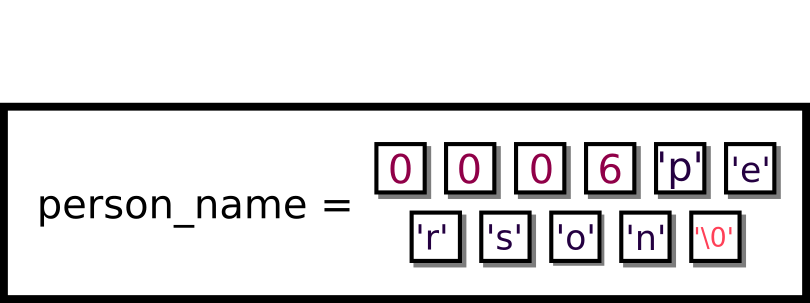

# C 编程语言

注意：本章内容较长，涉及许多细节。如果您对某些部分已有经验，可以自由地略过。

C 语言是进行严肃系统编程的事实上的编程语言。为什么？大多数内核都通过 C 语言提供 API。Linux 内核（Love 2010）和基于 C 的 XNU 内核（Inc. 2017），MacOS 就是基于这个内核的，都是用 C 语言编写的，并且提供了 C API - 应用程序编程接口。Windows 内核使用 C++，但在 Windows 上进行系统编程比 UNIX 对新手系统程序员来说要困难得多。C 语言没有类和资源获取初始化（RAII）这样的抽象，这有助于清理内存。C 语言也给你提供了更多机会“自食其果”，但它让你能够在更精细的层面上做事。

## C 语言的历史

C 语言是由 Dennis Ritchie 和 Ken Thompson 在 1973 年于贝尔实验室开发的（Ritchie 1993）。当时，我们已经有像 Fortran、ALGOL 和 LISP 这样的编程语言瑰宝。C 语言的目的是双重的。首先，它被设计用来针对当时最流行的计算机，例如 PDP-7。其次，它试图去除一些低级构造（如管理寄存器和编写汇编代码进行跳转），并创建一种能够以可读的代码形式程序化地表达程序（与 LISP 中的数学化表达相对）的语言。同时，它仍然具有与操作系统接口的能力。这听起来像是一项艰巨的任务。最初，它仅在贝尔实验室内部与 UNIX 操作系统一起使用。

第一次“真正”的标准化是由 Brian Kernighan 和 Dennis Ritchie 的书籍（Kernighan and Ritchie 1988）实现的。这本书至今仍被广泛认为是唯一的可移植 C 指令集。K&R 书籍被称为学习 C 的实际标准。虽然从 ANSI 到 ISO 存在着不同的 C 标准，但 ISO 作为一种语言规范在很大程度上取得了胜利。我们将主要关注的是 POSIX C 库，它扩展了 ISO 标准。现在，为了把大象从房间里请出来，Linux 内核未能符合 POSIX 标准。这主要是因为 Linux 开发者不愿意支付合规费用。这也是因为他们不想完全符合众多不同的标准，因为这意味着维护合规性会增加开发成本。

我们将致力于使用 C99 标准，因为它是大多数计算机都认可的，但有时也会使用一些新的 C11 功能。我们还将讨论一些附带功能，因为它们与 GNU C 库广泛使用。我们将首先提供一个相当全面的关于语言及其功能的概述。如果您已经使用过基于 C 的语言，可以自由地略过。

### 功能

+   速度。程序和系统之间几乎没有区别。

+   简单性。C 语言及其标准库包含一组简单的可移植函数。

+   手动内存管理。C 语言赋予程序管理其内存的能力。然而，如果程序有内存错误，这可能会成为一个缺点。

+   通用性。通过外函数接口（FFI）和各种类型的语言绑定，大多数其他语言都可以调用 C 函数，反之亦然。标准库无处不在。C 语言作为一门流行的语言，经受了时间的考验，看起来它似乎不会走向何方。

## C 语言快速入门

学习 C 的经典方式是从“hello world”程序开始。Kernighan 和 Ritchie 很久以前提出的原始示例并没有改变。

```c
#include <stdio.h>
int main(void) {
 printf("Hello World\n");
 return 0;
}
```

1.  指令取自操作系统中的文件（代表**标准**输入和输出），复制文本，并将其替换到相应的位置。

1.  是一个函数声明。第一个词告诉编译器函数的返回类型。括号()之前的部分是函数名。在 C 语言中，单个编译程序中不能有两个具有相同名称的函数，尽管共享库可能可以。然后是参数列表。当我们为常规函数提供参数列表时，意味着编译器如果函数以非零参数数量被调用，则应产生错误。对于具有类似声明的常规函数，意味着函数可以像这样调用，因为没有分隔符。是一个特殊函数。声明的方式有很多，但标准的方式是 ， ， 和 。

1.  是一个函数调用。定义为的一部分。该函数已被编译，并位于我们的机器上的其他位置 - C 标准库的位置。只需记住包含头文件，并使用适当的参数（字符串字面量）调用函数。如果不包含换行符，缓冲区将不会被刷新（即写入不会立即完成）。

1.  必须返回一个整数。按照惯例，0 表示成功，其他任何值都表示失败。以下是一些具有特殊意义的退出代码/状态：[`tldp.org/LDP/abs/html/exitcodes.html`](http://tldp.org/LDP/abs/html/exitcodes.html)。一般来说，假设 0 表示成功。

```c
$ gcc main.c -o main
$ ./main
Hello World
$
```

1.  是 GNU 编译器集合的缩写，它包含一系列可供使用的编译器。编译器根据扩展名推断你正在尝试编译一个 .c 文件。

1.  告诉你的 shell 在当前目录下执行名为 main 的程序。然后程序会打印出 "hello world"。

如果系统编程像编写“hello world”一样简单，我们的工作就会容易得多。

### 预处理器

预处理器是什么？预处理是编译器在**实际编译程序之前**执行的一种复制和粘贴操作。以下是一个替换示例

```c
// Before preprocessing
#define MAX_LENGTH 10
char buffer[MAX_LENGTH]

// After preprocessing
char buffer[10]
```

虽然预处理程序有一些副作用。一个问题是要能够正确地进行标记化，这意味着尝试使用预处理程序重新定义 C 语言的内部结构可能是不可行的。另一个问题是它们不能无限嵌套 - 存在一个有限的深度，它们需要停止。宏也是简单的文本替换，没有语义。例如，看看如果宏尝试执行内联修改会发生什么。

```c
#define min(a,b) a < b ? a : b
int main() {
 int x = 4;
 if(min(x++, 5)) printf("%d is six", x);
 return 0;
}
```

宏是简单的文本替换，所以上面的例子展开为

```c
x++ < 5 ? x++ : 5
```

在这种情况下，打印出的内容是透明的，但将会是 6。你能试着找出原因吗？还要考虑当运算符优先级起作用时的边缘情况。

```c
int x = 99;
int r = 10 + min(99, 100); // r is 100!
// This is what it is expanded to
int r = 10 + 99 < 100 ? 99 : 100
// Which means
int r = (10 + 99) < 100 ? 99 : 100
```

某些参数的灵活性也存在逻辑问题。一个常见的混淆来源是与静态数组和运算符。

```c
#define ARRAY_LENGTH(A) (sizeof((A)) / sizeof((A)[0]))
int static_array[10]; // ARRAY_LENGTH(static_array) = 10
int* dynamic_array = malloc(10); // ARRAY_LENGTH(dynamic_array) = 2 or 1 consistently
```

宏有什么问题？嗯，如果传递了一个静态数组，它就会工作，因为静态数组返回数组占用的字节数，除以它就会给出条目数。但如果传递一个内存块的指针，取指针的 sizeof 并除以第一个条目的大小，并不总是给出数组的大小。

## 语言设施

### 关键字

C 有一系列的关键字。以下是您应该简要了解的 C99 中的某些构造。

1.  是在 case 语句或循环语句中使用的关键字。当在 case 语句中使用时，程序会跳转到块的末尾。

    ```c
    switch(1) {
     case 1: /* Goes to this switch */
     puts("1");
     break; /* Jumps to the end of the block */
     case 2: /* Ignores this program */
     puts("2");
     break;
    } /* Continues here */
    ```

    在循环的上下文中，使用它会跳出最内层的循环。循环可以是 for、while 或 do-while 构造。

    ```c
    while(1) {
     while(2) {
     break; /* Breaks out of while(2) */
     } /* Jumps here */
     break; /* Breaks out of while(1) */
    } /* Continues here */
    ```

1.  是一个语言级构造，告诉编译器该数据应该保持不变。如果尝试更改 const 变量，程序将无法编译。当放在类型之前时，编译器会重新排序第一个类型和 const。然后编译器使用[左结合规则](https://en.wikipedia.org/wiki/Operator_associativity)。这意味着指针左侧的内容是常量。这被称为 const-correctness。

    ```c
    const int i = 0; // Same as "int const i = 0"
    char *str = ...; // Mutable pointer to a mutable string
    const char *const_str = ...; // Mutable pointer to a constant string
    char const *const_str2 = ...; // Same as above
    const char *const const_ptr_str = ...;
    // Constant pointer to a constant string
    ```

    但是，重要的是要知道这是一个编译器强加的限制。有绕过这个限制的方法，并且程序将以定义良好的行为运行。在系统编程中，唯一不能写入的内存类型是系统写保护的内存。

    ```c
    const int i = 0; // Same as "int const i = 0"
    (*((int *)&i)) = 1; // i == 1 now
    const char *ptr = "hi";
    *ptr = '\0'; // Will cause a Segmentation Violation
    ```

1.  是仅存在于循环构造中的控制流语句。Continue 会跳过循环主体的其余部分，并将程序计数器设置回循环之前的开始位置。

    ```c
    int i = 10;
    while(i--) {
     if(1) continue; /* This gets triggered */
     *((int *)NULL) = 0;
    } /* Then reaches the end of the while loop */
    ```

1.  是另一个循环构造。这些循环执行主体并在循环底部检查条件。如果条件为零，则执行下一个语句 - 程序计数器设置为循环之后的第一个指令。否则，循环主体将被执行。

    ```c
    int i = 1;
    do {
     printf("%d\n", i--);
    } while (i > 10) /* Only executed once */
    ```

1.  是用来声明枚举的关键字。枚举是一种可以取许多有限值的数据类型。如果你有一个枚举并且没有指定任何数字，C 编译器将为该枚举生成一个唯一的数字（在当前枚举的上下文中），并用于比较。声明枚举实例的语法是 。这个附加的好处是编译器可以对这些表达式进行类型检查，以确保你只比较相同类型的值。

    ```c
    enum day{ monday, tuesday, wednesday,
     thursday, friday, saturday, sunday};

    void process_day(enum day foo) {
     switch(foo) {
     case monday:
     printf("Go home!\n"); break;
     // ...
     }
    }
    ```

    完全可以将枚举值分配为不同或相同的。如果你分配数字，不建议依赖于编译器的一致编号。如果你打算使用这个抽象，尽量别打破它。

    ```c
    enum day{
     monday = 0,
     tuesday = 0,
     wednesday = 0,
     thursday = 1,
     friday = 10,
     saturday = 10,
     sunday = 0};

    void process_day(enum day foo) {
     switch(foo) {
     case monday:
     printf("Go home!\n"); break;
     // ...
     }
    }
    ```

1.  是一个特殊的关键字，告诉编译器该变量可能定义在另一个对象文件或库中，因此程序在缺少变量时也能编译，因为程序将引用系统或另一个文件中的变量。

    ```c
    // file1.c
    extern int panic;

    void foo() {
     if (panic) {
     printf("NONONONONO");
     } else {
     printf("This is fine");
     }
    }

    //file2.c

    int panic = 1;
    ```

1.  是一个允许你使用初始化条件、循环不变式和更新条件进行迭代的关键字。这旨在与 while 循环等价，但语法不同。

    ```c
    for (initialization; check; update) {
     //...
    }

    // Typically
    int i;
    for (i = 0; i < 10; i++) {
     //...
    }
    ```

    根据 C89 标准，不能在循环初始化块中声明变量。这是因为关于在循环中定义的变量的作用域规则在标准中存在分歧。随着更近期的标准的出现，这个问题已经得到了解决，因此人们现在可以使用他们今天所熟悉和喜爱的 for 循环。

    ```c
    for(int i = 0; i < 10; ++i) {
    ```

    循环的评估顺序如下

    1.  执行初始化语句。

    1.  检查不变式。如果为假，则终止循环并执行下一个语句。如果为真，则继续到循环体。

    1.  执行循环体。

    1.  执行更新语句。

    1.  跳转到检查不变式步骤。

1.  是一个允许你进行条件跳转的关键字。不要在你的程序中使用它。原因是当与多个链串在一起时，它会使你的代码难以理解，这被称为意大利面代码。尽管如此，在某些情况下是可以接受的，例如 Linux 内核中的错误检查代码。当添加另一个堆栈帧进行清理不是一个好主意时，通常在内核上下文中使用该关键字。内核清理的典型例子如下。

    ```c
    void setup(void) {
    Doe *deer;
    Ray *drop;
    Mi *myself;

    if (!setupdoe(deer)) {
     goto finish;
    }

    if (!setupray(drop)) {
     goto cleanupdoe;
    }

    if (!setupmi(myself)) {
     goto cleanupray;
    }

    perform_action(deer, drop, myself);

    cleanupray:
    cleanup(drop);
    cleanupdoe:
    cleanup(deer);
    finish:
    return;
    }
    ```

1.  是控制流关键字。有几种使用这些关键字的方法（1）裸 if（2）带有 else 的 if（3）带有 else-if 的 if（4）带有 else if 和 else 的 if。注意，else 与最近的 if 匹配。与不匹配的 if 和 else 语句相关的一个微妙错误是[悬空 else 问题](https://en.wikipedia.org/wiki/Dangling_else)。语句总是从 if 执行到 else。如果任何中间条件为真，if 块执行该操作并转到该块的末尾。

    ```c
    // (1)

    if (connect(...))
     return -1;

    // (2)
    if (connect(...)) {
     exit(-1);
    } else {
     printf("Connected!");
    }

    // (3)
    if (connect(...)) {
     exit(-1);
    } else if (bind(..)) {
     exit(-2);
    }

    // (1)
    if (connect(...)) {
     exit(-1);
    } else if (bind(..)) {
     exit(-2);
    } else {
     printf("Successfully bound!");
    }
    ```

1.  是一个编译器关键字，告诉编译器可以省略 C 函数调用过程并将代码“粘贴”到被调用函数中。相反，编译器被提示直接将函数体替换到调用函数中。这并不总是建议明确这样做，因为编译器通常足够智能，知道何时为你生成函数。

    ```c
    inline int max(int a, int b) {
     return a < b ? a : b;
    }

    int main() {
     printf("Max %d", max(a, b));
     // printf("Max %d", a < b ? a : b);
    }
    ```

1.  是一个关键字，告诉编译器这个特定的内存区域不应与其他所有内存区域重叠。这种用例是告诉程序的用户，如果内存区域重叠，则这是未定义的行为。请注意，当内存区域重叠时，memcpy 有未定义的行为。如果这种情况可能出现在你的程序中，考虑使用 memmove。

    ```c
    memcpy(void * restrict dest, const void* restrict src, size_t bytes);

    void add_array(int *a, int * restrict c) {
     *a += *c;
    }
    int *a = malloc(3*sizeof(*a));
    *a = 1; *a = 2; *a = 3;
    add_array(a + 1, a) // Well defined
    add_array(a, a) // Undefined
    ```

1.  是一个控制流运算符，用于退出当前函数。如果函数是空的，它就简单地退出函数。否则，另一个参数作为返回值跟随。

    ```c
    void process() {
     if (connect(...)) {
     return -1;
     } else if (bind(...)) {
     return -2
     }
     return 0;
    }
    ```

1.  是一个很少使用的修饰符，它强制类型被定义为有符号而不是无符号。这个修饰符之所以很少使用，是因为类型默认是有符号的，需要使用修饰符来将其定义为无符号，但在某些情况下可能很有用，例如当你想让编译器默认使用有符号类型，如下所示。

    ```c
    int count_bits_and_sign(signed representation) {
     //...
    }
    ```

1.  是一个在编译时评估的运算符，其结果为表达式包含的字节数。当编译器推断类型时，以下代码会发生变化。

    ```c
    char a = 0;
    printf("%zu", sizeof(a++));
    ```

    ```c
    char a = 0;
    printf("%zu", 1);
    ```

    然后，编译器可以进一步操作。编译器必须在编译时（而不是链接时）有一个类型的完整定义，否则你可能会得到一个奇怪的错误。考虑以下情况

    ```c
    // file.c
    struct person;

    printf("%zu", sizeof(person));

    // file2.c

    struct person {
     // Declarations
    }
    ```

    这段代码无法编译，因为 sizeof 无法在没有知道结构完整声明的情况下编译。这就是为什么程序员要么在头文件中放置完整的声明，要么抽象创建和交互，以便用户无法访问我们结构内部的原因。此外，如果编译器知道数组对象的完整长度，它将使用该长度而不是将其退化成指针。

    ```c
    char str1[] = "will be 11";
    char* str2 = "will be 8";
    sizeof(str1) //11 because it is an array
    sizeof(str2) //8 because it is a pointer
    ```

    小心，使用 sizeof 来获取字符串长度！

1.  是一个具有三种含义的类型说明符。

    1.  当与全局变量或函数声明一起使用时，表示变量或函数的作用域仅限于文件。

    1.  当与函数变量一起使用时，表示该变量具有静态分配，意味着变量在程序启动时只分配一次，而不是每次程序运行时都分配，其生命周期延长到程序的生命周期。

    ```c
    // visible to this file only
    static int i = 0;

    static int _perform_calculation(void) {
     // ...
    }

    char *print_time(void) {
     static char buffer[200]; // Shared every time a function is called
     // ...
    }
    ```

1.  是一个关键字，允许你将多个类型配对组合成一个新的结构。C-struct 是连续的内存区域，可以像访问独立的变量一样访问每个内存中的特定元素。请注意，元素之间可能存在填充，使得每个变量都是内存对齐的（从其大小的倍数开始的内存地址开始）。

    ```c
    struct hostname {
     const char *port;
     const char *name;
     const char *resource;
    }; // You need the semicolon at the end
    // Assign each individually
    struct hostname facebook;
    facebook.port = "80";
    facebook.name = "www.google.com";
    facebook.resource = "/";

    // You can use static initialization in later versions of c
    struct hostname google = {"80", "www.google.com", "/"};
    ```

1.  开关语句本质上是一种被美化的跳转语句。这意味着你取一个字节或一个整数，程序的流程控制就会跳转到那个位置。注意，switch 语句的各个 case 会连续执行。这意味着如果执行从一个 case 开始，控制流将继续到所有后续的 case，直到遇到 break 语句。

    ```c
    switch(/* char or int */) {
     case INT1: puts("1");
     case INT2: puts("2");
     case INT3: puts("3");
    }
    ```

    如果我们给一个值为 2，那么

    ```c
    switch(2) {
     case 1: puts("1"); /* Doesn't run this */
     case 2: puts("2"); /* Runs this */
     case 3: puts("3"); /* Also runs this */
    }
    ```

    这其中更有名的例子是 Duff 的设备，它允许循环展开。你不需要为了这门课程理解这段代码，但看看它很有趣（Duff，n.d.)。

    ```c
    send(to, from, count)
    register short *to, *from;
    register count;
    {
     register n=(count+7)/8;
     switch(count%8){
     case 0:	do{	*to = *from++;
     case 7:		*to = *from++;
     case 6:		*to = *from++;
     case 5:		*to = *from++;
     case 4:		*to = *from++;
     case 3:		*to = *from++;
     case 2:		*to = *from++;
     case 1:		*to = *from++;
     }while(--n>0);
     }
    }
    ```

    这段代码突出了 switch 语句是 goto 语句，你可以在 switch case 的另一端放置任何代码。大多数时候这没有意义，有时这太过有意义。

1.  声明了一个类型的别名。通常与结构体一起使用，以减少在类型中写“struct”时的视觉混乱。

    ```c
    typedef float real;
    real gravity = 10;
    // Also typedef gives us an abstraction over the underlying type used.
    // In the future, we only need to change this typedef if we
    // wanted our physics library to use doubles instead of floats.

    typedef struct link link_t;
    //With structs, include the keyword 'struct' as part of the original types
    ```

    在这个课程中，我们经常使用 typedef 来定义函数。例如，一个函数的 typedef 可以是这样的

    ```c
    typedef int (*comparator)(void*,void*);

    int greater_than(void* a, void* b){
     return a > b;
    }
    comparator gt = greater_than;
    ```

    这声明了一个函数类型比较器，它接受两个参数并返回一个整数。

1.  是一个新的类型说明符。联合体是一块内存，许多变量都占用这块内存。它用于在保持一致性的同时，具有在类型之间切换的灵活性，而无需维护跟踪位的函数。考虑一个例子，我们有不同的像素值。

    ```c
    union pixel {
     struct values {
     char red;
     char blue;
     char green;
     char alpha;
     } values;
     uint32_t encoded;
    }; // Ending semicolon needed
    union pixel a;
    // When modifying or reading
    a.values.red;
    a.values.blue = 0x0;

    // When writing to a file
    fprintf(picture, "%d", a.encoded);
    ```

1.  是一个类型修饰符，它强制修改它们的变量具有特定行为。无符号类型只能与原始的 int 类型（如和）一起使用。与无符号算术相关联有很多行为。在大多数情况下，除非你的代码涉及位移动，否则了解无符号和有符号算术之间的行为差异不是必需的。

1.  是一个双关语关键字。在函数或参数定义的术语中使用时，它表示函数明确返回没有值或接受没有参数。以下声明了一个不接受参数且不返回任何值的函数。

    ```c
    void foo(void);
    ```

    另一个使用指针的场景是当你定义一个类型别名时。指针只是一个内存地址。它被指定为一个不完整的类型，这意味着你不能取消引用它，但它可以被提升为任何其他类型。使用此指针进行指针算术是未定义的行为。

    ```c
    int *array = void_ptr; // No cast needed
    ```

1.  是一个编译器关键字。这意味着编译器不应该优化其值。考虑以下简单的函数。

    ```c
    int flag = 1;
    pass_flag(&flag);
    while(flag) {
     // Do things unrelated to flag
    }
    ```

    编译器可能会这样做，因为 while 循环的内部与标志无关，可以优化为以下形式，即使函数可能会改变数据。

    ```c
    while(1) {
     // Do things unrelated to flag
    }
    ```

    如果你使用 volatile 关键字，编译器被迫将变量保留在内存中并执行该检查。这在多进程或多线程程序中很有用，这样我们就可以用另一个序列的执行来影响一个序列的运行。

1.  代表传统的循环。循环顶部有一个条件，在每次执行循环体之前都会检查这个条件。如果条件评估为非零值，则循环体会被执行。

### C 数据类型

C 中有许多数据类型。正如你可能意识到的，它们要么是整数，要么是浮点数，其他类型是这些类型的变体。

1.  表示正好一个字节数据。字节中的位数可能不同，但总是相同的大小，这对于所有数据类型的所有版本都是正确的。这必须在边界上对齐（这意味着你无法在两个地址之间使用位）。其余类型将假设一个字节中有 8 位。

1.  至少需要两个字节。这是在两个字节边界上对齐的，这意味着地址必须是 2 的倍数。

1.  至少需要两个字节。再次对齐到两个字节边界（“ISO C 标准” 2005 第 34 页）。在大多数机器上这将是对齐到 4 个字节。

1.  至少需要四个字节，对齐到四个字节边界。在某些机器上这可以是 8 个字节。

1.  至少需要八个字节，对齐到八个字节边界。

1.  代表由 IEEE（“IEEE 标准浮点算术” 2008）紧密指定的 IEEE-754 单精度浮点数。在大多数机器上，这将是对齐到四个字节边界的四个字节。

1.  代表由同一标准指定的 IEEE-754 双精度浮点数，对齐到最近的八个字节边界。

如果你需要一个固定宽度的整数类型，为了更可移植的代码，你可以使用在 stdint.h 中定义的类型，其形式为[u]int*width*_t，其中 u（这是可选的）表示有符号性，而 width 是 8、16、32 和 64 中的任何一个。

### 操作符

操作符是 C 语言中作为语言语法一部分定义的语言构造。这些操作符按照优先级顺序列出。

+   是下标操作符。其中是数字类型，是指针类型。

+   是结构解引用（或箭头）操作符。如果你有一个指向结构的指针，你可以使用这个操作符来访问其元素之一。

+   是结构引用操作符。如果你有一个对象，你可以访问一个元素。

+   是一元加法和减法操作符。它们分别保留或否定整数或浮点类型的符号。

+   是解引用操作符。如果你有一个指针，你可以使用这个操作符来访问位于这个内存地址的元素。如果你正在读取，返回值将是底层类型的大小。如果你正在写入，值将以偏移量写入。

+   是取地址操作符。它接受一个元素并返回其地址。

+   是增量操作符。你可以将其用作前缀或后缀，这意味着正在增加的变量可以在操作符之前或之后。和。

+   是减量操作符。这与增量操作符具有相同的语义，除了它将变量的值减少一个。

+   是 sizeof 运算符，它在编译时评估。这也在关键字部分提到。

+   其中是算术二进制运算符。如果操作数都是数字类型，那么操作分别是加、减、乘、取模和除。如果左操作数是指针而右操作数是整数类型，那么只能使用加或减，并调用指针算术的规则。

+   是位移运算符。右边的操作数必须是一个整数类型，其符号会被忽略，除非它是负数，在这种情况下，行为是未定义的。左边的运算符决定了大量的语义。如果我们进行左移，则右侧总会引入零。如果我们进行右移，则有一些不同的情况

    +   如果左边的操作数是有符号的，则整数会被符号扩展。这意味着如果数字设置了符号位，则任何右移都会在左侧引入 1。如果数字没有设置符号位，任何右移都会在左侧引入零。

    +   如果操作数是无符号的，无论哪种方式，都会在左侧引入零。

    ```c
    unsigned short uns = -127; // 1111111110000001
    short sig = 1; // 0000000000000001
    uns << 2; // 1111111000000100
    sig << 2; // 0000000000000100
    uns >> 2; // 0011111111100000
    sig >> 2; // 0000000000000000
    ```

    注意，以字大小（例如，在 64 位架构中以 64 位）进行位移会导致未定义的行为。

+   是大于等于/小于等于关系运算符。它们按照名称所暗示的那样工作。

+   是大于/小于关系运算符。它们再次按照名称所暗示的那样执行。

+   是等于/不等于关系运算符。它们再次按照名称所暗示的那样执行。

+   是逻辑与运算符。如果第一个操作数是零，则第二个操作数不会被评估，表达式将评估为 0。否则，它产生第二个操作数的 1-0 值。

+   是逻辑或运算符。如果第一个操作数不是零，则第二个操作数不会被评估，表达式将评估为 1。否则，它产生第二个操作数的 1-0 值。

+   是逻辑非运算符。如果操作数是零，则返回 1。否则，返回 0。

+   是按位与运算符。如果两个操作数中都设置了位，则输出中也会设置。否则，它不会设置。

+   是按位或运算符。如果任一操作数中设置了位，则输出中也会设置。否则，它不会设置。

+   是按位非运算符。如果输入中设置了位，则输出中不会设置，反之亦然。

+   是三元/条件运算符。你将布尔条件放在冒号之前，如果它评估为非零，则返回冒号之前的元素，否则返回冒号之后的元素。

+   是逗号运算符。先评估，然后评估，并返回。在由逗号分隔的多个语句序列中，从左到右评估所有语句，并返回最右边的表达式。

## C 和 Linux

到目前为止，我们已经涵盖了 C 的语言基础。现在，我们将关注 C 和可与我们交互的 POSIX 类型的函数。我们将讨论可移植函数，例如。我们将评估它们的内部结构，并在 POSIX 模型和更具体的 GNU/Linux 下仔细审查。有几个关于这种哲学的东西使得了解其余部分更容易，所以我们将把这些东西放在这里。

### 万物皆文件

一个 POSIX 口诀是“万物皆文件”。尽管这最近已经过时，而且更加错误，但我们今天仍然使用这个约定。这个声明意味着一切都是文件描述符，它是一个整数。例如，这里有一个文件对象，一个网络套接字，和一个内核对象。这些都是对内核文件描述符表中的记录的引用。

```c
int file_fd = open(...);
int network_fd = socket(...);
int kernel_fd = epoll_create1(...);
```

对这些对象的操作是通过系统调用完成的。在我们继续之前，最后要注意的一点是，文件描述符仅仅是*指针*。想象一下，示例中的每个文件描述符实际上都指向操作系统从中选择和选择的对象表中的一个条目（即文件描述符表）。对象可以被分配和释放，关闭和打开等。程序通过使用通过系统调用指定的 API 和库函数与这些对象交互。

### 系统调用

在我们深入探讨常见的 C 函数之前，我们需要知道什么是系统调用。如果你是一名学生并且已经完成了 HW0，你可以自由地跳过这一节。

系统调用是内核执行的操作。首先，操作系统准备一个系统调用。接下来，内核尽其所能地在内核空间执行系统调用，这是一个特权操作。在先前的例子中，我们获得了文件描述符对象的访问权限。现在我们也可以向代表文件的文件描述符对象写入一些字节，操作系统将尽力将这些字节写入磁盘。

```c
write(file_fd, "Hello!", 6);
```

当我们说内核尽力而为时，这包括操作可能因多种原因失败的可能性。其中一些原因是：文件不再有效，硬盘故障，系统中断等。程序员与外部系统通信的方式是通过系统调用。需要注意的是，系统调用是昂贵的。它们在时间和 CPU 周期上的成本最近已经降低，但尽可能少地使用它们。

### C 系统调用

在下一节中将要讨论的许多 C 函数都是抽象，它们根据当前平台调用正确的底层系统调用。例如，它们的 Windows 实现可能与其他操作系统完全不同。尽管如此，我们将从它们的 Linux 实现的角度来研究这些函数。

## 常见 C 函数

要获取有关任何函数的更多信息，请使用手册页。注意，手册页组织成几个部分。第二部分是系统调用。第三部分是 C 库。在网上，使用 Google。在 shell 中，或

### 错误处理

在我们深入所有函数的细节之前，要知道在 C 中，大多数处理错误返回的函数与像 C++或 Java 这样的编程语言中用异常处理错误的方法相矛盾。有多个反对异常的论点。

1.  异常使控制流程更难以理解。

1.  异常导向的语言需要保留堆栈跟踪和维护跳转表。

1.  异常可能是复杂对象。

关于异常也有一些论点

1.  异常可能来自多层深处。

1.  异常有助于减少全局状态。

1.  异常区分业务逻辑和正常流程。

无论优点/缺点如何，我们使用前者是因为与像 FORTRAN 这样的语言向后兼容（“FORTRAN IV PROGRAMMER’S REFERENCE MANUAL” 1972 P. 84）。每个线程都会得到一个副本，因为它存储在每个线程堆栈的顶部——关于线程的更多内容将在后面讨论。当调用一个可能返回错误的函数时，如果该函数根据手册页返回错误，则程序员需要检查 errno。

```c
#include <errno.h>

FILE *f = fopen("/does/not/exist.txt", "r");
if (NULL == f) {
 fprintf(stderr, "Errno is %d\n", errno);
 fprintf(stderr, "Description is %s\n", strerror(errno));
}
```

有一个快捷函数可以打印 errno 的英文描述。此外，一个函数可能将其错误代码作为返回值本身返回。

```c
int s = getnameinfo(...);
if (0 != s) {
 fprintf(stderr, "getnameinfo: %s\n", gai_strerror(s));
}
```

一定要检查手册页以了解返回代码的特征。

### 输入/输出

在本节中，我们将涵盖标准库中的所有基本输入和输出函数，并参考系统调用。每个进程在开始执行时都有三个数据流：标准输入（用于程序输入）、标准输出（用于程序输出）和标准错误（用于错误和调试消息）。通常，标准输入来自运行程序的终端，而标准输出是相同的终端。然而，程序员可以使用重定向，使他们的程序能够将输出和/或输入发送到文件或其他程序。

它们分别由文件描述符 0 和 1 指定。2 保留用于标准错误，按照库的惯例是不缓存的（即 IO 操作立即执行）。

#### 以 stdout 为导向的流

标准输出或 stdout 导向的流是只有写入 stdout 选项的流。这是大多数人熟悉的此类函数。第一个参数是一个包含要打印的数据占位符的格式字符串。常见的格式说明符如下

1.  将参数视为 C 字符串指针，持续打印所有字符，直到遇到 NULL 字符。

1.  将参数打印为整数。

1.  将参数打印为内存地址。

为了性能，缓冲数据直到其缓存满或打印换行符。以下是一个打印内容的示例。

```c
char *name = ... ; int score = ...;
printf("Hello %s, your result is %d\n", name, score);
printf("Debug: The string and int are stored at: %p and %p\n", name, &score );
// name already is a char pointer and points to the start of the array.
// We need "&" to get the address of the int variable
```

从上一节中，调用系统调用。是 C 库函数，而则是系统调用 system。

printf 的缓冲语义稍微复杂一些。ISO 定义了三种类型的流（“ISO C 标准” 2005 第 278 页）

+   无缓冲，其中流的内容尽可能快地到达目的地。

+   行缓冲，其中流的内容一旦提供换行符就会到达目的地。

+   完全缓冲，其中流的内容一旦缓冲区满就会到达目的地。

标准错误被定义为“非完全缓冲”（“ISO C 标准” 2005 第 279 页）。标准输出和输入仅当流目的地不是交互式设备时才被定义为完全缓冲。通常，标准错误将不被缓冲，如果输出是终端，则标准输入和输出将是行缓冲，否则是完全缓冲。这与 printf 有关，因为 printf 仅使用 FILE 接口提供的抽象，并使用上述语义来确定何时写入。可以通过在流上调用 fflush()来强制写入。

要打印字符串和单个字符，使用和

```c
puts("Current selection: ");
putchar('1');
```

#### 其他流

要向其他文件流打印，使用，其中 _file_ 是预定义的（‘stdout’或‘stderr’）或由或返回的 FILE 指针。有一个与文件描述符一起工作的 printf 等效函数，称为 dprintf。只需使用。

要将数据打印到 C 字符串中，使用或更好。返回写入的字符数，不包括终止字节。我们会使用打印的字符串大小小于提供的缓冲区大小 – 考虑到打印整数，它将永远不会超过 11 个字符加上空字节。如果 printf 处理可变参数输入，则使用前面所示的前一个函数更安全。

```c
// Fixed
char int_string[20];
sprintf(int_string, "%d", integer);

// Variable length
char result[200];
int len = snprintf(result, sizeof(result), "%s:%d", name, score);
```

### 以 stdin 为方向的函数

标准输入或 stdin 方向的函数直接从 stdin 读取。大多数这些函数由于设计不佳而被弃用。这些函数将 stdin 视为一个我们可以从中读取字节的文件。最臭名昭著的违规者是。它在 C99 标准中已被弃用，并被从最新的 C 标准（C11）中删除。它被弃用的原因是无法控制读取的长度，因此缓冲区容易被溢出。当这种操作被恶意用于劫持程序控制流时，这被称为缓冲区溢出。

程序应使用或代替。以下是一个从标准输入读取最多 10 个字符的快速示例。

```c
char *fgets (char *str, int num, FILE *stream);

ssize_t getline(char **lineptr, size_t *n, FILE *stream);

// Example, the following will not read more than 9 chars
char buffer[10];
char *result = fgets(buffer, sizeof(buffer), stdin);
```

注意，与不同，它会将换行符复制到缓冲区中。另一方面，的其中一个优点是，会自动在堆上分配和重新分配足够大小的缓冲区。

```c
// ssize_t getline(char **lineptr, size_t *n, FILE *stream);

/* set buffer and size to 0; they will be changed by getline */
char *buffer = NULL;
size_t size = 0;

ssize_t chars = getline(&buffer, &size, stdin);

// Discard newline character if it is present,
if (chars > 0 && buffer[chars-1] == '\n')
buffer[chars-1] = '\0';

// Read another line.
// The existing buffer will be re-used, or, if necessary,
// It will be `free`'d and a new larger buffer will `malloc`'d
chars = getline(&buffer, &size, stdin);

// Later... don't forget to free the buffer!
free(buffer);
```

除了那些功能之外，我们还有一个具有双重含义的函数。比如说，如果函数调用失败，按照 errno 约定，将会将错误的英文版本打印到 stderr。

```c
int main(){
 int ret = open("IDoNotExist.txt", O_RDONLY);
 if(ret < 0){
 perror("Opening IDoNotExist:");
 }
 //...
 return 0;
}
```

要使用库函数解析输入，除了读取输入外，可以使用（或或）分别从默认输入流、任意文件流或 C 字符串中获取输入。所有这些函数都将返回解析的项目数量。检查这个数字是否等于预期的数量是个好主意。此外，像这样的函数自然需要有效的指针。它们不仅需要指向有效的内存，还需要可写。传递错误的指针值是一个常见的错误来源。例如，

```c
int *data = malloc(sizeof(int));
char *line = "v 10";
char type;
// Good practice: Check scanf parsed the line and read two values:
int ok = 2 == sscanf(line, "%c %d", &type, &data); // pointer error
```

我们本想将字符值写入 c，将整数值写入 malloc 分配的内存中。然而，我们传递的是数据指针的地址，而不是指针所指向的内容！所以我们将改变指针本身。现在指针将指向地址 10，因此当调用 free(data)时，这段代码将随后失败。

现在，scanf 将一直读取字符，直到字符串结束。为了防止 scanf 导致缓冲区溢出，使用格式说明符。确保传递的值比缓冲区大小少一个。

```c
char buffer[10];
scanf("%9s", buffer); // reads up to 9 characters from input (leave room for the 10th byte to be the terminating byte)
```

最后要注意的一点是，如果系统调用很昂贵，由于兼容性的原因，这个系列调用更昂贵。因为它需要能够正确处理所有的 printf 说明符，所以代码效率不高 TODO：需要引用。对于高性能程序，应该自己编写解析代码。如果是一个一次性程序或脚本，可以自由使用 scanf。

### string.h

String.h 函数是一系列处理如何操作和检查内存片段的函数。大多数函数都处理 C 字符串。C 字符串是一系列以 NUL 字符（等于字节 0x00）分隔的字节。有关所有这些函数的更多信息（https://linux.die.net/man/3/string）。文档中未提及的行为，如的结果，被认为是未定义的行为。

+   返回字符串的长度。

+   返回一个整数，确定字符串的字典序。如果 s1 在字典中排在 s2 之前，则返回-1。如果两个字符串相等，则返回 0。否则，返回 1。

+   将字符串复制到。**此函数假定 dest 有足够的空间容纳 src，否则行为未定义**

+   将字符串连接到目标字符串的末尾。**此函数假定在目标字符串的末尾有足够的空间容纳，包括 NUL 字节**

+   返回字符串的’d 副本。

+   返回在中的第一次出现处的指针。如果没有找到，则返回。

+   与上面相同，但这次是一个字符串！

+   一个危险但有用的函数 strtok 接受一个字符串并将其标记化。这意味着它将字符串转换为单独的字符串。此函数有很多规范，所以请阅读手册页面，以下是一个虚构的例子。

    ```c
     #include <stdio.h>
     #include <string.h>

     int main(){
     char* upped = strdup("strtok,is,tricky,!!");
     char* start = strtok(upped, ",");
     do{
     printf("%s\n", start);
     }while((start = strtok(NULL, ",")));
     return 0;
     }
    ```

    **输出**

    ```c
    strtok
    is
    tricky
    !!
    ```

    为什么这很棘手？好吧，当 upped 改为以下内容时会发生什么？

    ```c
     char* upped = strdup("strtok,is,tricky,,,!!");
    ```

+   对于整数解析，使用或。

    这些函数所做的就是取你的字符串指针和一个（即二进制、八进制、十进制、十六进制等）以及可选的指针，并返回一个解析值。

    ```c
     int main(){
     const char *nptr = "1A2436";
     char* endptr;
     long int result = strtol(nptr, &endptr, 16);
     return 0;
     }
    ```

    但是要小心！错误处理很棘手，因为函数不会返回错误代码。如果传递了一个无效的数字字符串，它将返回 0。调用者必须小心区分有效的 0 和错误。这通常涉及到下面的 errno trampoline。

    ```c
     int main(){
     const char *input = "0"; // or "!##@" or ""
     char* endptr;
     int saved_errno = errno;
     errno = 0
     long int parsed = strtol(input, &endptr, 10);
     if(parsed == 0 && errno != 0){
     // Definitely an error
     }
     errno = saved_errno;
     return 0;
     }
    ```

+   从开始移动字节到。**小心**，当内存区域重叠时会有未定义的行为。这是经典的“在我的机器上它工作！”例子之一，因为很多时候 Valgrind 无法检测到它，因为它看起来在你的机器上工作。考虑更安全的版本。

+   与上面做的是同一件事，但如果内存区域重叠，则可以保证所有字节都将正确复制。并且都在？

## C 内存模型

C 内存模型可能与你之前见过的不同。我们不是用类型安全来分配对象，而是使用自动变量或请求一个字节序列，或者使用另一个家族成员，然后稍后我们再使用它。

### 结构体

在底层术语中，结构体是一块连续的内存，没有更多。就像数组一样，结构体有足够的空间来存储其所有成员。但与数组不同，它可以存储不同类型。考虑上面声明的 contact 结构体。

```c
struct contact {
 char firstname[20];
 char lastname[20];
 unsigned int phone;
};

struct contact person;
```

我们经常会使用以下 typedef，这样我们就可以使用结构体名称作为完整的类型。

```c
typedef struct contact contact;
contact person;

typedef struct optional_name {
 ...
} contact;
```

如果你没有进行任何优化和重新排序就编译代码，你可以期望每个变量的地址看起来像这样。

```c
&person           // 0x100
&person.firstname // 0x100 = 0x100+0x00
&person.lastname  // 0x114 = 0x100+0x14
&person.phone     // 0x128 = 0x100+0x28
```

你的编译器所做的只是说“保留这么多空间”。每当代码中发生读取或写入操作时，编译器将计算变量的偏移量。偏移量是变量开始的位置。在这个编译器中，电话变量从第几个字节开始，并继续占用 sizeof(int)个字节。**但是偏移量并不决定变量结束的位置**。考虑以下在许多内核代码中看到的黑客技巧。

```c
 typedef struct {
 int length;
 char c_str[0];
} string;

const char* to_convert = "person";
int length = strlen(to_convert);

// Let's convert to a c string
string* person;
person = malloc(sizeof(string) + length+1);
```

目前，我们的内存看起来像以下图像。那些盒子中没有任何东西


指向 11 个空盒子的结构体

那么当我们分配长度时会发生什么？前四个盒子填充了长度变量的值。其余的空间保持不变。我们将假设我们的机器是大端字节序。这意味着最低有效字节是最后一个字节。

```c
person->length = length;
```


指向 11 个盒子，其中 4 个填充了 0006，7 个垃圾

现在，我们可以使用以下调用将字符串写入我们结构体的末尾。

```c
strcpy(person->c_str, to_convert);
```



指向 11 个盒子，其中 4 个填充了 0006，7 个字符串“person”

我们甚至可以进行一个合理性检查，以确保字符串相等。

```c
strcmp(person->c_str, "person") == 0 //The strings are equal!
```

那个零长度数组所做的是指向**结构体的末尾**，这意味着编译器将为操作系统（ints，chars 等）计算的所有元素留出空间。零长度数组将占用零字节的空间。由于结构体是连续的内存块，我们可以分配**更多**的空间，并将额外的空间用作存储额外字节的场所。虽然这看起来像是一种花招，但它是一种重要的优化，因为以任何其他方式实现可变长度字符串，都需要进行两次不同的内存分配调用。这对于编程中如此常见的字符串操作来说效率非常低。

### C 语言中的字符串

由于历史原因，在 C 语言中，我们使用[空终止](https://en.wikipedia.org/wiki/Null-terminated_string)字符串而不是[长度前缀](https://en.wikipedia.org/wiki/String_(computer_science)#Length-prefixed)字符串。对于日常程序员来说，记住要为你的字符串添加 NUL 终止符！在 C 语言中，字符串被定义为以空字符或 NUL 字节结束的一组字节。

### 字符串的位置

每次定义一个字符串字面量——形式为——该字符串就会存储在*数据*段中。根据你的架构，它是**只读的**，这意味着任何尝试修改字符串都会导致 SEGFAULT。也可以声明字符串位于可写数据段或栈中。要做到这一点，指定字符串的长度或将括号放在指针位置而不是使用指针，并将数据段或栈的相应全局作用域或函数作用域。然而，如果需要改变字符串的空间，可以将其更改为任何想要的。忘记为字符串添加 NUL 终止符会对字符串产生重大影响！边界检查很重要。书中提到的 heartbleed 漏洞部分原因就是这一点。

在 C 语言中，字符串以内存中的字符形式表示。字符串的结尾包含一个 NUL（0）字节。所以"ABC"需要四个（4）字节。找出 C 字符串长度的唯一方法就是不断读取内存，直到找到 NUL 字节。C 字符总是恰好一个字节。

#### 字符串字面量是常量

字符串字面量自然是常量。任何写入都会导致操作系统产生 SEGFAULT。

```c
char array[] = "Hi!"; // array contains a mutable copy
strcpy(array, "OK");

char *ptr = "Can't change me"; // ptr points to some immutable memory
strcpy(ptr, "Will not work");
```

字符串字面量是存储在程序只读数据段中的字符数组，它是不可变的。两个字符串字面量可能在内存中共享相同的空间。以下是一个例子。

```c
char *str1 = "Mark Twain likes books";
char *str2 = "Mark Twain likes books";
```

指向和的字符串实际上可能位于内存中的相同位置。

Char 数组，然而，包含从代码段复制到栈或静态内存中的字面值。以下这些 char 数组位于不同的内存位置。

```c
char arr1[] = "Mark Twain also likes to write";
char arr2[] = "Mark Twain also likes to write";
```

这里有一些常见的初始化字符串的方法。它们在内存中位于何处？

```c
char *str = "ABC";
char str[] = "ABC";
char str[]={'A','B','C','\0'};
```

```c
char ary[] = "Hello";
char *ptr = "Hello";
```

我们也可以轻松地打印出指针和 C 字符串的内容。以下是一些示例代码来说明这一点。

```c
char ary[] = "Hello";
char *ptr = "Hello";
// Print out address and contents
printf("%p : %s\n", ary, ary);
printf("%p : %s\n", ptr, ptr);
```

如前所述，字符数组是可变的，因此我们可以更改其内容。注意在数组的范围内写入。C 语言在编译时不会进行边界检查，但无效的读取/写入可能导致程序崩溃。

```c
strcpy(ary, "World"); // OK
strcpy(ptr, "World"); // NOT OK - Segmentation fault (crashes by default; unless SIGSEGV is blocked)
```

然而，与数组不同，我们可以将其更改为指向另一块内存，

```c
ptr = "World"; // OK!
ptr = ary; // OK!
ary = "World"; // NO won't compile
// ary is doomed to always refer to the original array.
printf("%p : %s\n", ptr, ptr);
strcpy(ptr, "World"); // OK because now ptr is pointing to mutable memory (the array)
```

与指针不同，指针持有堆或栈上变量的地址，而字符数组（字符串字面量）指向程序数据部分中的只读内存。这意味着指针比数组更灵活，尽管数组的名称是其起始地址的指针。

在更常见的情况下，指针将指向堆内存，在这种情况下，指针所引用的内存**可以**被修改。

## 指针

指针是存储地址的变量。这些地址有一个数值，但通常程序员对内存地址处的值更感兴趣。在本节中，我们将尝试为您介绍指针的基本概念。

### 指针基础

#### 声明指针

指针指的是内存地址。指针的类型很有用——它告诉编译器需要读取/写入多少字节，并定义了指针算术（加法和减法）的语义。

```c
int *ptr1;
char *ptr2;
```

由于 C 语言的语法，或任何指针实际上并不是它自己的类型。你必须在每个指针变量前加上一个星号。作为一个常见的陷阱，以下

```c
int* ptr3, ptr4;
```

只会将声明为指针。实际上将是一个普通的 int 变量。为了修复这个声明，确保星号在指针之前。

```c
int *ptr3, *ptr4;
```

对于结构体也要记住这一点。如果没有使用 typedef 声明，那么指针将跟在类型后面。

```c
struct person *ptr3;
```

#### 使用指针进行读取/写入

假设已经声明。为了讨论的需要，让我们假设包含内存地址。要写入指针，必须取消引用并分配一个值。

```c
*ptr = 0; // Writes some memory.
```

C 语言所做的是获取指针的类型，这是一个与操作符，并从指针的起始位置写入字节，这意味着字节、、、都将为零。写入的字节数取决于指针类型。对于所有原始类型来说都是如此，但结构体略有不同。

读取的方式大致相同，只是将变量放在它需要值的位置。

```c
int doubled = *ptr * 2;
```

读取和写入非原始类型变得复杂。编译单元——通常是文件或头文件——需要能够快速获取数据结构的大小。这意味着不可见的数据结构不能被复制。以下是一个分配结构体指针的示例：

```c
#include <stdio.h>

typedef struct {
 int a1;
 int a2;
} pair;

int main() {
 pair obj;
 pair zeros;
 zeros.a1 = 0;
 zeros.a2 = 0;
 pair *ptr = &obj;
 obj.a1 = 1;
 obj.a2 = 2;
 *ptr = zeros;
 printf("a1: %d, a2: %d\n", ptr->a1, ptr->a2);
 return 0;
}
```

对于读取结构体指针，不要直接进行。相反，程序员创建抽象来创建、复制和销毁结构体。如果这听起来很熟悉，这就是 C++最初打算在标准委员会走偏之前要做的。

### 指针算术

除了添加到整数外，指针还可以添加到。然而，指针类型用于确定要增加指针多少。指针通过添加的值的倍数乘以底层类型的大小来移动。对于 char 指针，这很简单，因为字符始终是一个字节。

```c
char *ptr = "Hello"; // ptr holds the memory location of 'H'
ptr += 2; // ptr now points to the first 'l''
```

如果 int 是 4 个字节，那么 ptr+1 将指向 ptr 指向的地址之后的 4 个字节。

```c
char *ptr = "ABCDEFGH";
int *bna = (int *) ptr;
bna +=1; // Would cause iterate by one integer space (i.e 4 bytes on some systems)
ptr = (char *) bna;
printf("%s", ptr);
```

注意到只有’EFGH’被打印出来。这是为什么？嗯，如上所述，当我们执行’bna+=1’时，我们是在增加**整数**指针的值 1，(在大多数系统中相当于 4 个字节)这相当于 4 个字符（每个字符只有 1 个字节）。因为 C 中的指针算术总是自动按所指向的类型的大小进行缩放，POSIX 标准禁止对 void 指针进行算术运算。话虽如此，编译器通常会将其底层类型视为。这里是一个机器翻译。以下两个指针算术操作是相等的

```c
int *ptr1 = ...;

// 1
int *offset = ptr1 + 4;

// 2
char *temp_ptr1 = (char*) ptr1;
int *offset = (int*)(temp_ptr1 + sizeof(int)*4);
```

**每次进行指针算术时，都要深呼吸并确保你正在移动你认为要移动的字节数。**

### 那么什么是 void 指针？

void 指针是一个没有类型的指针。当数据类型未知或当 C 代码与其他没有 API 的其他编程语言进行接口时使用 void 指针。你可以将其视为一个原始指针，或一个内存地址。默认情况下返回一个 void 指针，可以安全地提升为任何其他类型。

```c
void *give_me_space = malloc(10);
char *string = give_me_space;
```

C 自动提升到其适当类型。和不是完全 ISO C 兼容的，这意味着它们将允许对 void 指针进行算术运算。它们将其视为指针。不要这样做，因为它不可移植 - 它不能保证与所有编译器一起工作！

## 常见错误

### 空字节

这段代码有什么问题？

```c
void mystrcpy(char*dest, char* src) {
 // void means no return value
 while( *src ) { dest = src; src ++; dest++; }
}
```

在上面的代码中，它只是将 dest 指针更改为指向源字符串。此外，NUL 字节没有被复制。这里是一个更好的版本 -

```c
while( *src ) { *dest = *src; src ++; dest++; }
*dest = *src;
```

注意，也常见到以下类型的实现，它在表达式测试中做所有事情，包括复制 NUL 字节。然而，这很糟糕，因为它在同一行中执行多个操作。

```c
while( (*dest++ = *src++ )) {};
```

### 双重释放

双重释放错误是指程序意外地尝试两次释放相同的分配。

```c
int *p = malloc(sizeof(int));
free(p);

*p = 123; // Oops! - Dangling pointer! Writing to memory we don't own anymore

free(p); // Oops! - Double free!
```

解决方法是首先编写正确的程序！其次，养成将指针设置为 NULL 的好习惯，一旦内存被释放。这确保了指针不能在不崩溃程序的情况下被错误地使用。

```c
p = NULL; // No dangling pointers
```

### 返回自动变量的指针

```c
int *f() {
 int result = 42;
 static int imok;
 return &imok; // OK - static variables are not on the stack
 return &result; // Not OK
}
```

自动变量仅在函数的生命周期内绑定到堆栈内存。函数返回后，继续使用该内存是错误的。

### 内存分配不足

```c
struct User {
 char name[100];
};
typedef struct User user_t;

user_t *user = (user_t *) malloc(sizeof(user));
```

在上面的例子中，我们需要为结构体分配足够的字节。相反，我们分配了足够的字节来容纳一个指针。一旦我们开始使用用户指针，我们就会破坏内存。正确的代码如下所示。

```c
struct User {
 char name[100];
};
typedef struct User user_t;

user_t * user = (user_t *) malloc(sizeof(user_t));
```

### 缓冲区溢出/下溢

一个著名的例子：Heart Bleed 在大小不足的缓冲区中执行了 memcpy 操作。一个简单的例子：实现 strcpy 并忘记在确定所需内存大小时加一。

```c
#define N (10)
int i = N, array[N];
for( ; i >= 0; i--) array[i] = i;
```

C 无法检查指针是否有效。上述示例写入的内存位置超出了数组界限。这可能导致内存损坏，因为该内存位置可能被用于其他目的。在实践中，这可能更难被发现，因为溢出/下溢可能发生在库调用中。这里是我们的老朋友 gets。

```c
gets(array); // Let's hope the input is shorter than my array!
```

### 字符串需要 strlen(s)+1 个字节

每个字符串必须在最后一个字符之后有一个空字节。要存储字符串“Hi”，需要 3 个字节：[H] [i] [\0]。

```c
char *strdup(const char *input) {  /* return a copy of 'input' */
 char *copy;
 copy = malloc(sizeof(char*));     /* nope! this allocates space for a pointer, not a string */
 copy = malloc(strlen(input));     /* Almost...but what about the null terminator? */
 copy = malloc(strlen(input) + 1); /* That's right. */
 strcpy(copy, input);   /* strcpy will provide the null terminator */
 return copy;
}
```

### 使用未初始化的变量

```c
int myfunction() {
 int x;
 int y = x + 2;
 ...
```

自动变量持有内存或寄存器中偶然出现的垃圾或位模式。假设它总是初始化为零是错误的。

### 假设未初始化的内存将被清零

```c
void myfunct() {
 char array[10];
 char *p = malloc(10);
```

自动（临时变量）和堆分配可能包含随机字节或垃圾。

## 逻辑和程序流程错误

这些是一系列可能导致程序编译但执行未预期功能的错误。

### 相等与相等

在 C 中，赋值运算符也返回赋值后的值。大多数时候它被忽略。我们可以用它来在同一行初始化多个东西。

```c
int p1, p2;
p1 = p2 = 0;
```

更令人困惑的是，如果我们忘记在相等运算符中省略等号，我们最终会赋值给那个变量。大多数时候这不是我们想要的。

```c
int answer = 3; // Will print out the answer.
if (answer = 42) { printf("The answer is %d", answer);}
```

解决这个问题的快速方法是养成将常数放在前面的习惯。这个错误在 while 循环条件中很常见。大多数现代编译器不允许在没有括号的情况下将条件赋给变量。

```c
 if (42 = answer) { printf("The answer is %d", answer);}
```

有时候我们想要这样做。一个常见的例子是 getline。

```c
while ((nread = getline(&line, &len, stream)) != -1)
```

这段代码调用了 getline，并将返回值或读取的字节数赋值给 nread。它还在同一行检查该值是否为-1，如果是，则终止循环。将括号放在任何赋值条件周围总是好的做法。

### 未声明的或原型不正确的函数

一些代码片段可能执行以下操作。

```c
time_t start = time();
```

系统函数“time”实际上接受一个参数，即指向某个内存的指针，该内存可以接收 time_t 结构或 NULL。编译器未能捕获这个错误，因为程序员通过包含省略了有效的函数原型。

更令人困惑的是，这可能会编译，工作几十年后崩溃。原因是时间在链接时间而不是编译时间找到，C 标准库几乎肯定已经在内存中。由于没有传递参数，我们希望堆栈上的参数（任何垃圾）被清零，因为如果没有，时间将尝试将函数的结果写入那个垃圾，这将导致程序 SEGFAULT。

### 多余的分号

这是一个相当简单的例子，不需要时不要使用分号。

```c
for(int i = 0; i < 5; i++) ; printf("Printed once");
while(x < 10); x++ ; // X is never incremented
```

然而，以下代码是完全可以接受的。

```c
for(int i = 0; i < 5; i++){
 printf("%d\n", i);;;;;;;;;;;;;
}
```

这种代码是可以的，因为 C 语言使用分号（;）来分隔语句。如果在分号之间没有语句，那么就没有什么可做的，编译器会继续到下一个语句。为了避免很多混淆，**始终使用花括号**。这增加了代码的行数，这是一个很好的生产力指标。

## 主题

+   C 字符串表示

+   C 字符串作为指针

+   char p[]与 char* p

+   简单的 C 字符串函数（strcmp, strcat, strcpy）

+   sizeof char

+   sizeof x 与 x*

+   堆内存生命周期

+   对堆分配的调用

+   解引用指针

+   取地址运算符

+   指针算术

+   字符串复制

+   字符串截断

+   双重释放错误

+   字符串字面量

+   打印格式化。

+   内存越界错误

+   静态内存

+   文件输入/输出。POSIX 与 C 库

+   C 输入输出：fprintf 和 printf

+   POSIX 文件 I/O（读取、写入、打开）

+   stdout 的缓冲

## 问题/练习

+   以下代码打印出什么？

    ```c
    int main(){
    fprintf(stderr, "Hello ");
    fprintf(stdout, "It's a small ");
    fprintf(stderr, "World\n");
    fprintf(stdout, "place\n");
    return 0;
    }
    ```

+   以下两个声明之间的区别是什么？其中一个的返回值是什么？

    ```c
    char str1[] = "first one";
    char *str2 = "another one";
    ```

+   C 中的字符串是什么？

+   编写一个简单的。关于，，或？附加题：在只遍历字符串一次的情况下编写函数。

+   以下每一行通常应该返回什么？

    ```c
    int *ptr;
    sizeof(ptr);
    sizeof(*ptr);
    ```

+   什么是？它与.有什么不同？一旦分配了内存，我们如何使用？

+   什么是运算符？关于？

+   指针算术。假设以下地址。以下位移是什么？

    ```c
    char** ptr = malloc(10); //0x100
    ptr[0] = malloc(20); //0x200
    ptr[1] = malloc(20); //0x300
    ```

+   我们如何防止双重释放错误？

+   打印字符串的 printf 指定符是什么，或者？

+   以下代码是否有效？为什么？在哪里？

    ```c
    char *foo(int var){
    static char output[20];
    snprintf(output, 20, "%d", var);
    return output;
    }
    ```

+   编写一个函数，该函数接受一个路径作为字符串，并打开该文件，每次打印 40 个字节的内容，但每隔一次打印会反转字符串（尝试使用 POSIX API 来完成此操作）。

+   POSIX 文件描述符模型与 C 的（即使用哪些函数调用，哪个是缓冲的）有什么区别？POSIX 是否使用 C 的内部，反之亦然？

## 快速问答：指针算术

指针算术很重要！深呼吸，找出每个操作移动指针的字节数。以下是一个快速问答部分。我们将使用以下定义：

```c
int *int_; // sizeof(int) == 4;
long *long_; // sizeof(long) == 8;
char *char_;
int *short_; //sizeof(short) == 2;
int **int_ptr; // sizeof(int*) == 8;
```

以下加法操作移动了多少字节？

### 快速问答解决方案

1.  4

1.  56

1.  -12

1.  -16

1.  0

1.  -16

1.  72
