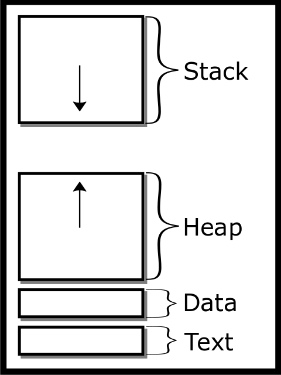
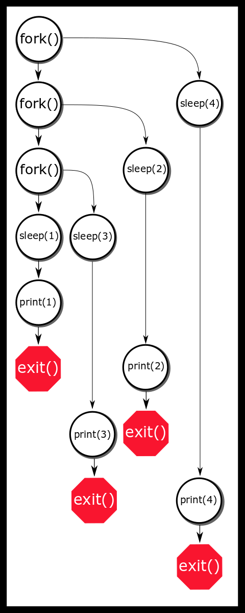
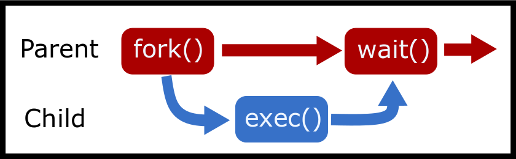

# 进程

要理解什么是进程，你需要了解什么是操作系统。操作系统是一个程序，它提供了硬件和用户软件之间的接口，同时也提供了一套软件可以使用的一系列工具。操作系统管理硬件，并给用户程序提供了一种统一的方式与硬件交互，只要操作系统可以安装在该硬件上。尽管这个想法听起来像是终极解决方案，但我们知道有许多不同的操作系统，它们都有自己的怪癖和标准。为了解决这个问题，存在另一层抽象：POSIX 或可移植操作系统接口。这是一个标准（现在可能有多个标准）——操作系统必须实现以成为 POSIX 兼容——我们将要研究的几乎所有系统几乎都是 POSIX 兼容的，这更多是由于政治原因。

在我们讨论 POSIX 系统之前，我们应该了解内核的一般概念。在操作系统（OS）中，有两个空间：内核空间和用户空间。内核空间是一种强大的操作模式，允许系统与硬件交互，并有可能破坏你的机器。用户空间是大多数应用程序运行的地方，因为它们不需要这种级别的权力来进行每个操作。当用户空间程序需要额外的权力时，它通过内核执行的系统调用来与硬件交互。这增加了一层安全性，以确保普通用户程序不能破坏你的整个操作系统。为了我们课程的目的，我们将讨论单机多用户操作系统。这就是在标准笔记本电脑或台式机上有一个中央时钟的地方。其他操作系统放宽了中央时钟的要求（分布式）或硬件的“标准化”（嵌入式系统）。其他不变量确保事件在特定时间发生。

操作系统由许多不同的部分组成。可能有程序在运行以处理传入的 USB 连接，另一个程序保持连接到网络等。最重要的是内核——尽管它可能是一组进程——它是操作系统的核心。内核有许多重要的任务。其中第一个是引导。

1.  计算机硬件从只读存储器中执行代码，称为固件。

1.  固件执行引导加载程序，它通常符合可扩展固件接口（），这是系统固件和操作系统之间的接口。

1.  引导加载程序的引导管理器根据引导设置加载操作系统内核。

1.  你的内核从无到有执行[引导](https://en.wikipedia.org/wiki/Bootstrapping)自身。

1.  内核执行启动脚本，如启动网络和 USB 处理。

1.  内核执行用户空间脚本，如启动桌面，然后你可以使用你的计算机！

当一个程序在用户空间执行时，内核为用户空间中的程序提供一些重要的服务。

+   调度进程和线程

+   处理同步原语（futexes、互斥锁、信号量等）

+   提供系统调用，如或

+   管理虚拟内存和低级二进制设备，如驱动程序

+   管理文件系统

+   处理网络上的通信

+   处理进程间的通信

+   动态链接库

+   列表可以一直继续下去。

内核创建第一个进程（另一种选择是 system.d）。*init.d* 启动程序，如图形用户界面、终端等——默认情况下，这是系统创建的唯一一个显式进程。所有其他进程都是通过系统调用和从单个进程实例化而来的。

## 文件描述符

虽然这些在上一个章节中已经提到，但我们将快速回顾一下文件描述符。Julia Evans 的一本小册子提供了更多细节（Evans 2018）。

内核跟踪文件描述符及其指向的内容。稍后我们将学习两个要点：文件描述符指向的不仅仅是文件，操作系统还跟踪它们。

注意，文件描述符可以在进程之间重用，但在进程内部，它们是唯一的。文件描述符可能有一个位置的概念。这些被称为可寻址流。程序可以完全读取磁盘上的文件，因为操作系统跟踪文件中的位置，这个属性也属于你的进程。

其他文件描述符指向网络套接字和各种其他信息，这些是不可寻址流。

## 进程

进程是计算机程序可能正在运行的实例。进程拥有许多可用的资源。每个程序的开始时，程序会获得一个进程，但每个程序可以创建更多的进程。程序由以下部分组成：

+   二进制格式：这告诉操作系统关于二进制中各个位段的详细信息——哪些部分是可执行的，哪些部分是常量，哪些库需要包含等。

+   一组机器指令

+   表示从哪个指令开始的一个数字

+   常量

+   链接库以及在哪里填写这些库的地址

进程很强大，但它们是隔离的！

这意味着默认情况下，没有进程可以与另一个进程通信。

这很重要，因为在复杂的系统（如伊利诺伊大学工程工作站）中，不同的进程可能具有不同的权限。当然不希望普通用户能够通过故意或意外修改进程来使整个系统崩溃。正如你们大多数人现在所意识到的那样，如果你将以下代码片段放入程序中，两个并行调用的程序变量之间是不共享的。

```c
int secrets;
secrets++;
printf("%d\n", secrets);
```

在两个不同的终端上，它们都会打印出 1 而不是 2。即使我们更改代码以尝试影响其他进程实例，也无法无意中改变另一个进程的状态。然而，还有其他有意改变其他进程程序状态的方法。

## 进程内容

### 内存布局

当一个进程启动时，它会获得自己的地址空间。每个进程都会得到以下内容。

+   **栈**

    栈是自动分配的变量和函数调用返回地址存储的地方。每次声明一个新的变量时，程序都会将栈指针向下移动以为该变量预留空间。这个栈段是可写的，但不可执行。这种行为由不可执行（NX）位控制，有时称为 W^X（写 XOR 执行）位，有助于防止恶意代码，例如在栈上运行。

    如果栈增长得太远——意味着它要么超过了预设的边界，要么与堆相交——程序将出现栈溢出错误，这很可能会导致 SEGFAULT。**默认情况下，栈是静态分配的；可以写入的空间是有限的。**

+   **堆**

    堆是内存中一个连续的、可扩展的区域（“malloc 概述” 2018）。如果一个程序想要分配一个其生命周期是手动控制的或其大小在编译时无法确定的对象，它就会想要创建一个堆变量。

    堆从文本段的顶部开始，向上增长，这意味着它可能会将堆边界（称为程序断点）向上推。

    我们将在关于内存分配的章节中更深入地探讨这个问题。这个区域也是可写的，但不可执行。如果系统受限或程序耗尽了地址，就会耗尽堆内存，这种现象在 32 位系统上更为常见。

+   **数据段**

    这个段包含两部分，一个初始化数据段和一个未初始化段。此外，初始化数据段被分为可读和可写部分。

    +   **初始化数据段** 这包含了程序的所有全局变量以及任何其他静态变量。

        这个部分从文本段的末尾开始，并且因为全局变量的数量在编译时是已知的，所以它的大小是固定的。数据段的末尾称为“程序断点”，可以通过使用 brk / sbrk 来扩展。

        这个部分是可写的（Van der Linden 1994 P. 124）。最值得注意的是，这个部分包含了以下方式初始化的变量：

        ```c
        int global = 1;
        ```

    +   **未初始化数据段 / BSS** BSS 代表一个旧的汇编操作符，称为由符号开始的块。

        这包含了所有全局变量以及任何其他隐式置零的静态持续时间变量。

        示例：

        ```c
        int assumed_to_be_zero;
        ```

        这个变量将被置零；否则，我们将面临涉及与其他进程隔离的安全风险。它们被放入不同的部分以加快进程启动时间。这个部分从数据段的末尾开始，并且由于全局变量的数量在编译时已知，因此其大小也是静态的。目前，初始化和未初始化的数据段被合并并称为数据段（Van der Linden 1994 P. 124），尽管在目的上有所不同。

+   **文本段**

    这就是所有可执行指令存储的地方，它是可读的（函数指针）但不可写。程序计数器通过这个段逐个执行指令。需要注意的是，这是程序默认的唯一可执行部分。如果程序在运行时修改其代码，程序很可能会产生 SEGFAULT。有绕过这个问题的方法，但在这门课程中我们不会探讨这些方法。为什么它不总是从零开始？这是因为一个名为[地址空间布局随机化](https://en.wikipedia.org/wiki/Address_space_layout_randomization)的安全特性。关于这个特性的原因和解释超出了本课程的范围，但了解它的存在是有好处的。话虽如此，如果程序在编译时带有 DEBUG 标志，这个地址可以被设置为常量。



进程地址空间

### 其他内容

为了跟踪所有这些进程，操作系统为每个进程分配一个称为进程 ID（PID）的数字。进程还被赋予其父进程的 PID，称为父进程 ID（）。每个进程都有一个父进程，那个父进程可能是。

进程还可以包含以下信息：

+   **运行状态** - 进程是准备就绪、正在运行、已停止、已终止等（关于这一点将在调度章节中详细说明）。

+   **文件描述符** - 从整数到真实设备（文件、USB 闪存驱动器、套接字）的映射列表

+   **权限** - 文件正在运行什么以及进程属于哪个。进程随后只能根据授予其的权限执行操作，例如访问文件。有一些技巧可以使程序以不同于启动程序的用户身份运行（例如，启动一个由 a 启动的程序并以 a 的身份执行）。更具体地说，一个进程有一个真实用户 ID（标识进程的所有者），一个有效用户 ID（用于尝试访问仅由超级用户可访问的文件的非特权用户），以及一个保存用户 ID（用于特权用户执行非特权操作）。

+   **参数** - 一系列字符串，告诉你的程序在什么参数下运行。

+   **环境变量** - 一系列可以修改的键值对字符串。这些通常用于指定库和二进制文件的路径、程序配置设置等。

根据 POSIX 规范，一个进程只需要一个线程和地址空间，但大多数内核开发者和用户都知道，这些还不够（“定义” 2018）。

## Fork 简介

### 一句警告

进程复制是一个强大而危险的工具。如果你犯了一个错误导致 fork 恶性循环，**你可能会使整个系统崩溃**。为了减少这种情况的可能性，通过在命令行中输入，将最大进程数限制在一个较小的数字，例如 40。注意，这个限制仅适用于用户，这意味着如果你触发 fork 恶性循环，你将无法杀死所有创建的进程，因为调用需要你的 shell 来完成。这非常不幸。一个解决方案是在事先以另一个用户（例如 root）的身份启动另一个 shell 实例，并从那里杀死进程。

另一个方法是使用内置命令来杀死所有用户进程（你只有一次尝试）。

最后，你可以重新启动系统，但使用 exec 函数，你只有一次机会。

在测试 fork() 代码时，确保你有对涉及机器的 root 权限和/或物理访问权限。如果你必须远程工作在 fork() 代码上，请记住，**kill -9 -1** 在紧急情况下可以救你。如果你没有准备好，fork 可能会 **极其危险**。**你已经收到警告了**。

### Fork 功能

系统调用通过复制现有进程的状态（略有不同）来创建一个新的进程，称为子进程。

+   子进程在父进程之后执行下一行。

+   作为一个附带说明，在较老的 UNIX 系统中，无论资源是否被修改，父进程的整个地址空间都会被直接复制。当前的行为是内核执行 [写时复制](https://en.wikipedia.org/wiki/Copy-on-write)，这可以节省大量资源，同时效率高（Bovet 和 Cesati 2005 写时复制部分）。

这里有一个简单的例子：

```c
printf("I'm printed once!\n");
fork();
// Now two processes running if fork succeeded
// and each process will print out the next line.
printf("This line twice!\n");
```

这里有一个简单的地址空间复制的例子。以下程序可能会打印出 42 两次——但是为什么是在 !? 之后？

```c
#include <unistd.h>  /*fork declared here*/
#include <stdio.h>  /* printf declared here*/
int main() {
 int answer = 84 >> 1;
 printf("Answer: %d", answer);
 fork();
 return 0;
}
```

这一行只执行一次，然而请注意，打印的内容并没有被刷新到标准输出。没有打印换行符，我们没有调用 ，也没有改变缓冲模式。因此，输出文本仍然在进程内存中等待发送。当执行时，整个进程内存都会被复制，包括缓冲区。因此，子进程以一个非空输出缓冲区开始，这可能在程序退出时被刷新。我们说“可能”，因为内容可能在没有良好程序退出的情况下未被写入。

要编写针对父进程和子进程不同的代码，检查 `fork` 的返回值。如果返回 -1，则意味着在创建新子进程的过程中出现了错误。应该检查 *errno* 中存储的值以确定发生了什么类型的错误。常见的错误包括 和 ，它们本质上意味着“再试一次——资源暂时不可用”，以及“没有这样的文件或目录”。

同样，返回值为 0 表示我们处于子进程的上下文中，而正整数表示我们处于父进程的上下文中。

`fork` 返回的正值是子进程的进程 ID (*pid*)。

记忆 `fork` 返回值所代表的内容的一个方法是，子进程可以通过调用 - 来找到其父进程——被复制的原始进程，因此不需要从 . 中获取任何额外的返回信息。然而，父进程可能有多个子进程，因此需要明确地告知其子进程的 PID。

根据 POSIX 标准，每个进程只有一个父进程。

父进程只能从 `fork` 的返回值中知道新子进程的 PID。

```c
pid_t id = fork();
if (id == -1) exit(1); // fork failed
if (id > 0) {
 // Original parent
 // A child process with id 'id'
 // Use waitpid to wait for the child to finish
} else { // returned zero
 // Child Process
}
```

下面是一个稍微有点愚蠢的例子。它会打印什么？试着用多个参数运行这个程序。

```c
#include <unistd.h>
#include <stdio.h>
int main(int argc, char **argv) {
 pid_t id;
 int status;
 while (--argc && (id=fork())) {
 waitpid(id,&status,0); /* Wait for child*/
 }
 printf("%d:%s\n", argc, argv[argc]);
 return 0;
}
```

下面是另一个例子。这就是今天这个令人惊讶的并行 O(N) 的 *sleepsort* 是一个愚蠢的赢家。它首次在 2011 年发布于 [4chan](https://dis.4chan.org/read/prog/1295544154)。下面展示了这个糟糕但有趣的排序算法的一个版本。这个排序算法可能无法产生正确的输出。

```c
int main(int c, char **v) {
 while (--c > 1 && !fork());
 int val  = atoi(v[c]);
 sleep(val);
 printf("%d\n", val);
 return 0;
}
```

想象我们这样运行这个程序

```c
$ ./ssort 1 3 2 4
```



排序 1, 3, 2, 4 的时间

由于系统调度器的工作方式，算法实际上并不是 O(N)。本质上，这个程序将实际的排序外包给了操作系统。

### Fork Bomb

“fork bomb” 是我们之前警告过你的。当尝试创建无限数量的进程时，就会发生这种情况。这通常会导致系统几乎停止运行，因为它试图为准备运行的大量进程分配 CPU 时间和内存。系统管理员不喜欢它们，并可能对每个用户可以拥有的进程数量设置上限，或者因为它们干扰了其他用户的程序而撤销登录权限。一个程序可以使用 来限制创建的子进程数量。

fork bomb 不一定是恶意的——它们有时是由于编程错误而发生的。下面是一个简单的恶意示例。

```c
while (1) fork();
```

如果你调用 `fork` 时不小心，很容易引发一个错误，尤其是在循环中。你能在这里找到 fork bomb 吗？

```c
#include <unistd.h>
#define HELLO_NUMBER 10

int main(){
 pid_t children[HELLO_NUMBER];
 int i;
 for(i = 0; i < HELLO_NUMBER; i++){
 pid_t child = fork();
 if(child == -1) {
 break;
 }
 if(child == 0) {
 // Child
 execlp("ehco", "echo", "hello", NULL);
 }
 else{
 // Parent
 children[i] = child;
 }
 }

 int j;
 for(j = 0; j < i; j++){
 waitpid(children[j], NULL, 0);
 }
 return 0;
}
```

我们拼错了，所以调用失败了。这意味着什么？我们本应创建 10 个进程，却创建了*1024 个进程，导致我们的机器被 fork 炸弹攻击**。**我们如何防止这种情况发生？在 exec 之后立即添加退出，这样如果 exec 失败，我们就不会无限制地调用 fork。**还有其他各种方法。如果我们删除了二进制文件呢？如果二进制文件本身创建了 fork 炸弹呢？

### 信号

我们将在课程结束前全面探讨信号，但现在讨论这个主题是相关的，因为与 fork 和其他函数调用相关的各种语义详细说明了信号是什么。

可以将信号视为软件中断。这意味着接收信号的进程将停止当前程序的执行，并使程序响应信号。

操作系统定义了各种信号，其中两个你可能已经知道：SIGSEGV 和 SIGINT。第一个是由于非法内存访问引起的，第二个是由想要终止程序的用户发送的。在每种情况下，程序都会从当前执行的行跳转到信号处理程序。如果程序没有提供信号处理程序，则执行默认处理程序——例如终止程序或忽略信号。

这里是一个简单用户定义的信号处理程序的例子：

```c
void handler(int signum) {
 write(1, "signaled!", 9);
 // we don't need the signum because we are only catching SIGINT
 // if you want to use the same piece of code for multiple
 // signals, check the signum
}
int main() {
 signal(SIGINT, handler);
 while(1) ;
 return 0;
}
```

信号在其生命周期中有四个阶段：生成、挂起、阻塞和接收状态。这指的是进程生成信号、内核即将传递信号、信号被阻塞以及内核传递信号时，每个阶段都需要一些时间来完成。更多内容请参阅信号章节的介绍。

术语很重要，因为 fork 和 exec 根据信号的状态需要不同的操作。

要注意的是，在程序逻辑中使用信号通常是一种较差的编程实践，即发送信号以执行特定操作。原因是信号没有交付时间框架，也没有保证它们会被交付。有更好的方法在两个进程之间进行通信。

如果你想了解更多，可以自由地跳到关于 POSIX 信号的章节并阅读它。它不长，会给你详细介绍如何在进程中处理信号。

### POSIX Fork 详细信息

POSIX 确定了 fork 的标准（“Fork” 2018）。你可以阅读前面的引用，但请注意，它可能相当冗长。以下是相关内容的摘要：

1.  fork 在成功时将返回一个非负整数。

1.  子进程将继承父进程的所有打开文件描述符。这意味着如果父进程读取了文件的一半并进行了 fork，子进程将从该偏移量开始。在子进程端进行读取将按相同数量移动父进程的偏移量。任何其他标志也将被继承。

1.  挂起的信号不会被继承。这意味着如果父进程有一个挂起的信号并创建了一个子进程，除非另一个进程向子进程发送信号，否则子进程不会接收到该信号。

1.  进程将创建一个线程（关于这一点稍后讨论。普遍观点是不要同时创建进程和线程）。

1.  由于我们使用了写时复制（COW），只读内存地址在进程间是共享的。

1.  如果程序设置了某些内存区域，它们可以在进程间共享。

1.  信号处理程序会被继承，但可以被更改。

1.  进程的当前工作目录（通常缩写为 CWD）会被继承，但可以被更改。

1.  环境变量会被继承，但可以被更改。

父亲和子进程之间的关键区别包括：

+   由 . 返回的进程 ID，由 . 返回的父进程 ID。

+   当子进程完成时，父进程通过信号 SIGCHLD 被通知，但反之则不然。

+   子进程不会继承挂起的信号或定时器警报。完整的列表请参阅 [fork 手册页](http://man7.org/linux/man-pages/man2/fork.2.html)

+   子进程有其自己的环境变量集。

### Fork 和 FILEs

在使用和分叉时有一些棘手的边缘情况。首先，我们必须进行技术上的区分。**文件描述符**是指向文件描述符的 struct。文件描述符可以指向许多不同的 struct，但就我们的目的而言，它们将指向一个表示文件系统上文件的 struct。这个文件描述符包含路径、描述符已读取到文件中的位置等元素。文件描述符指向文件描述符。这很重要，因为当一个进程被分叉时，只有文件描述符被克隆，而不是描述符。以下代码片段只包含一个描述符。

```c
 int file = open(...);
 if(!fork) {
 read(file, ...);
 } else {
 read(file, ...);
 }
```

一个进程将读取文件的一部分，另一个进程将读取文件的另一部分。在以下示例中，由于两个不同的文件句柄，存在两个描述。

```c
 if(!fork) {
 int file = open(...);
 read(file, ...);
 } else {
 int file = open(...);
 read(file, ...);
 }
```

让我们考虑我们的动机示例。

```c
$ cat test.txt
A
B
C
```

看看这段代码，它做了什么？

```c
size_t buffer_cap = 0;
char * buffer = NULL;
ssize_t nread;
FILE * file = fopen("test.txt", "r");
int count = 0;
while((nread = getline(&buffer, &buffer_cap, file) != -1) {
 printf("%s", buffer);
 if(fork() == 0) { 
 exit(0);
 }
 wait(NULL);
}
```

初始想法可能认为它会逐行打印文件，并有一些额外的分叉。实际上，这是未定义的行为，因为我们没有准备文件描述符。简而言之，以下是避免这个示例的步骤。

1.  作为程序员，你需要确保在分叉之前准备所有文件描述符。

1.  如果它是一个文件描述符或无缓冲的，它已经准备好了。

1.  如果文件已打开用于读取并且已被完全读取，它已经准备好了。

1.  否则，**必须**关闭或关闭以准备。

1.  如果文件描述符已经准备好，那么如果子进程正在使用它，则父进程必须将其设置为非活动状态，反之亦然。一个进程在使用它，如果它被读取或写入，或者如果该进程 *出于任何原因* 调用了 。如果两个进程同时使用它，整个应用程序的行为是未定义的。

那么，我们如何修复代码？我们必须在分叉之前刷新文件，并在调用之后才使用它——关于这一点的具体细节将在下一节中讨论。

```c
size_t buffer_cap = 0;
char * buffer = NULL;
ssize_t nread;
FILE * file = fopen("test.txt", "r");
int count = 0;
while((nread = getline(&buffer, &buffer_cap, file) != -1) {
 printf("%s", buffer);
 fflush(file);
 if(fork() == 0) { 
 exit(0);
 }
 wait(NULL);
}
```

如果父进程和子进程需要异步执行并需要保持文件句柄打开，会发生什么？由于事件顺序，我们需要确保父进程知道子进程已完成使用。我们将在后面的章节中讨论进程间通信，但现在我们可以使用双重 fork 方法。

```c
//... 
fflush(file);
pid_t child = fork();
if(child == 0) { 
 fclose(file);
 if (fork() == 0) {
 // Do asynchronous work
 // Safe exit, this child doesn't know about
 // the file descriptor
 exit(0);
 }
 exit(0);
}
waitpid(child, NULL, 0);
```

如果你对它是如何工作的感兴趣，请查看附录以获取 Fork-file 问题的描述。

## 等待和执行

如果父进程想要等待子进程完成，它必须使用（或），这两个都等待子进程改变进程状态，这可以是以下之一：

1.  儿童终止

1.  儿童被信号停止

1.  儿童被信号恢复

注意，waitpid 可以被设置为非阻塞，这意味着它们将立即返回，让程序知道子进程是否已退出。

```c
pid_t child_id = fork();
if (child_id == -1) { perror("fork"); exit(EXIT_FAILURE);}
if (child_id > 0) {
 // We have a child! Get their exit code
 int status;
 waitpid( child_id, &status, 0 );
 // code not shown to get exit status from child
} else { // In child ...
 // start calculation
 exit(123);
}
```

是的简化版本。接受一个指向整数的指针并等待任何子进程。在第一个子进程改变状态后返回。以下是的操作行为：

一个程序可以等待一个特定的进程，或者它可以传递特殊值以执行不同的事情（检查手册页）。

waitpid 的最后一个参数是一个可选参数。选项如下：

WNOHANG - 返回搜索的进程是否已退出

WNOWAIT - 等待，但允许另一个等待调用使子进程可等待

WEXITED - 等待已退出的子进程

WSTOPPED - 等待停止的子进程

WCONTINUED - 等待继续的子进程

退出状态或存储在上面的两个调用中的整型指针的值将在下面解释。

### 退出状态

要找到从子进程返回的值或包含在中的值，请使用。通常，程序将使用和。有关更多信息，请参阅/手册页。

```c
int status;
pid_t child = fork();
if (child == -1) {
 return 1; //Failed
}
if (child > 0) {
 // Parent, wait for child to finish
 pid_t pid = waitpid(child, &status, 0);
 if (pid != -1 && WIFEXITED(status)) {
 int exit_status = WEXITSTATUS(status);
 printf("Process %d returned %d" , pid, exit_status);
 }
} else {
 // Child, do something interesting
 execl("/bin/ls", "/bin/ls", ".", (char *) NULL); // "ls ."
}
```

一个进程只能有 256 个返回值，其余的位是信息位，信息通过位移动提取。然而，内核有一种内部方式来跟踪被信号、已退出或已停止的进程。此 API 被抽象化，以便内核开发者可以随意更改它。记住：这些宏只有在满足前提条件时才有意义。例如，如果进程没有被信号，进程的退出状态就不会被定义。宏不会对程序进行检查，因此程序员必须确保逻辑正确。例如，程序应该使用来检查进程是否被停止，然后使用来找到停止它的信号。因此，没有必要记住以下内容。这是对状态变量内部信息存储的高级概述。来自旧伯克利标准分布（BSD）内核的（“Source to Sys/Wait.h”，n.d.）：

```c
/* If WIFEXITED(STATUS), the low-order 8 bits of the status. */
#define _WSTATUS(x) (_W_INT(x) & 0177)
#define _WSTOPPED 0177 /* _WSTATUS if process is stopped */
#define WIFSTOPPED(x) (_WSTATUS(x) == _WSTOPPED)
#define WSTOPSIG(x) (_W_INT(x) >> 8)
#define WIFSIGNALED(x)  (_WSTATUS(x) != _WSTOPPED && _WSTATUS(x) != 0)
#define WTERMSIG(x) (_WSTATUS(x))
#define WIFEXITED(x)  (_WSTATUS(x) == 0)
```

关于退出代码有一个约定。如果进程正常退出且一切顺利，则应返回零。除此之外，并没有太多广泛接受的约定。如果程序指定了返回代码来表示某些条件，它可能能够更好地理解 256 个错误代码。例如，如果程序在进入阶段 1（如写入文件）时执行了其他操作，则可以返回，等等。通常，UNIX 程序不是设计来遵循这项政策的，为了简化。

### 僵尸和孤儿

在你的进程的子进程中等待是一个好习惯。如果父进程不等待其子进程，它们就会变成所谓的僵尸。当子进程终止并在内核进程表中为你的进程占用一个位置时，就会创建僵尸。进程表跟踪有关进程的以下信息：PID、状态以及它是如何被杀死的。消除僵尸的唯一方法是等待你的子进程。如果长时间运行的父进程从不等待其子进程，它可能会失去分叉的能力。

话虽如此，程序并不总是需要等待你的子进程！你的父进程可以继续执行代码，而无需等待子进程。如果父进程在没有等待其子进程的情况下死亡，一个进程可以使其子进程成为孤儿。一旦父进程完成，其任何子进程都将被分配给第一个进程，其 PID 为 1。因此，这些子进程将看到返回值为 1。这些孤儿最终会完成，并在短时间内成为僵尸。init 进程会自动等待其所有子进程，从而将这些僵尸从系统中移除。

### 高级：异步等待

警告：本节使用了一些部分介绍的信号。当子进程完成时，父进程会收到 SIGCHLD 信号，因此信号处理程序可以等待该进程。下面展示了一个稍微简化的版本。

```c
pid_t child;

void cleanup(int signal) {
 int status;
 waitpid(child, &status, 0);
 write(1,"cleanup!\n",9);
}
int main() {
 // Register signal handler BEFORE the child can finish
 signal(SIGCHLD, cleanup); // or better - sigaction
 child = fork();
 if (child == -1) { exit(EXIT_FAILURE);}

 if (child == 0) {
 // Do background stuff e.g. call exec
 } else { /* I'm the parent! */
 sleep(4); // so we can see the cleanup
 puts("Parent is done");
 }
 return 0;
}
```

然而，上述示例遗漏了一些细微之处。

1.  可能会有多个子进程完成，但父进程只会收到一个 SIGCHLD 信号（信号不会被排队）

1.  SIGCHLD 信号可以因其他原因被发送（例如，一个子进程暂时停止了）

1.  它使用已弃用的代码，而不是更通用的 sigaction。

下面展示了一个更健壮的回收僵尸进程的代码。

```c
void cleanup(int signal) {
 int status;
 while (waitpid((pid_t) (-1), 0, WNOHANG) > 0) {

 }
}
```

## exec

要使子进程执行另一个程序，请在 fork 之后使用其中一个函数。该函数集用指定程序的进程映像替换进程映像。这意味着调用之后的任何代码行都将被执行程序的代码行替换。程序想要子进程做的任何其他工作都应该在调用之前完成。命名方案可以简称为助记符。

1.  e – 显式地将指向环境变量的指针数组传递给新的进程映像。

1.  l – 将命令行参数单独（作为列表）传递给函数。

1.  p – 使用 PATH 环境变量查找要执行的文件名。

1.  v – 命令行参数作为指针数组（向量）传递给函数。

注意，如果信息通过数组传递，则数组必须以 NULL 元素终止。

下面是此代码的一个示例。此代码执行

```c
#include <unistd.h>
#include <sys/types.h>
#include <sys/wait.h>
#include <stdlib.h>
#include <stdio.h>

int main(int argc, char**argv) {
 pid_t child = fork();
 if (child == -1) return EXIT_FAILURE;
 if (child) {
 int status;
 waitpid(child , &status ,0);
 return EXIT_SUCCESS;

 } else {
 // Other versions of exec pass in arguments as arrays
 // Remember first arg is the program name
 // Last arg must be a char pointer to NULL

 execl("/bin/ls", "/bin/ls", "-alh", (char *) NULL);

 // If we get to this line, something went wrong!
 perror("exec failed!");
 }
}
```

尝试解码以下示例

```c
#include <unistd.h>
#include <fcntl.h>  // O_CREAT, O_APPEND etc. defined here

int main() {
 close(1); // close standard out
 open("log.txt", O_RDWR | O_CREAT | O_APPEND, S_IRUSR | S_IWUSR);
 puts("Captain's log");
 chdir("/usr/include");
 // execl( executable,  arguments for executable including program name and NULL at the end)

 execl("/bin/ls", /* Remaining items sent to ls*/ "/bin/ls", ".", (char *) NULL); // "ls ."
 perror("exec failed");
 return 0;
}
```

此示例将 "Captain’s Log" 写入文件，然后将 /usr/include 中的所有内容打印到同一文件中。上述代码中没有错误检查（我们假设 close、open、chdir 等按预期工作）。

1.  – 将使用最低可用的文件描述符（即 1），因此标准输出（stdout）现在被重定向到日志文件。

1.  – 将当前目录更改为 /usr/include。

1.  – 将程序映像替换为 /bin/ls 并调用其 main() 方法。

1.  – 我们不期望到达这里——如果我们做到了，那么就失败了。

1.  我们需要 "return 0;"，因为如果缺少它，编译器会报错。

### POSIX Exec 详细信息

POSIX 详细说明了 exec 需要覆盖的所有语义（“Exec” 2018）。注意以下内容：

1.  在 exec 之后，文件描述符将被保留。这意味着如果程序打开一个文件而没有关闭它，它将在子进程中保持打开状态。这是一个问题，因为通常子进程不知道这些文件描述符。尽管如此，它们在文件描述符表中占用一个槽位，可能会阻止其他进程访问该文件。这一点的例外是，如果文件描述符设置了 Close-On-Exec 标志（O_CLOEXEC）——我们将在后面介绍设置标志。

1.  不同的信号语义：执行进程保留信号掩码和挂起的信号集，但不保留信号处理程序，因为它是不同的程序。

1.  除非使用环境版本的 exec，否则环境变量将被保留。

1.  操作系统可能会打开 0、1、2——stdin、stdout、stderr，如果它们在 exec 之后被关闭；大多数情况下，它们会保持关闭。

1.  执行的进程以相同的 PID 运行，并且与上一个进程具有相同的父进程和进程组。

1.  执行的进程将在相同的用户和组以及相同的当前工作目录下运行。

### 简化

pre-packs 上述代码（Jones 2010 P. 371）。以下是如何使用 system 的代码片段。

```c
#include <unistd.h>
#include <stdlib.h>

int main(int argc, char**argv) {
 system("ls"); // execl("/bin/sh", "/bin/sh", "-c", "\\"ls\\"")
 return 0;
}
```

这个调用将 fork，执行通过参数传递的命令，原始父进程将等待这个命令完成。这也意味着这是一个阻塞调用。父进程不能继续，直到启动的进程退出。实际上，它创建了一个 shell，然后传递字符串，这比直接使用多出很多开销。标准 shell 将使用环境变量来搜索与命令匹配的文件名。通常，使用 system 对于许多简单的运行此命令问题就足够了，但对于更复杂或微妙的问题可能会迅速变得有限，并且它隐藏了 fork-exec-wait 模式的机制，所以我们鼓励你学习和使用和而不是。这也可能是一个巨大的安全风险。通过允许某人访问环境变量的 shell 版本，程序可能会遇到各种问题：

```c
int main(int argc, char**argv) {
 char *to_exec = asprintf("ls %s", argv[1]);
 system(to_exec);
}
```

将类似于 argv[1] = "; sudo su"的内容传递出去是一个巨大的安全风险，被称为[权限提升](https://en.wikipedia.org/wiki/Privilege_escalation)。

## fork-exec-wait 模式

一种常见的编程模式是调用后跟和。原始进程调用 fork，创建一个子进程。然后子进程使用 exec 启动新程序的执行。同时，父进程使用（或）等待子进程完成。



Fork, exec, wait diagram

```c
#include <unistd.h>

int main() {
 pid_t pid = fork();
 if (pid < 0) { // fork failure
 exit(1);
 } else if (pid > 0) {
 int status;
 waitpid(pid, &status, 0);
 } else {
 execl("/bin/ls", "/bin/ls", NULL);
 exit(1); // For safety.
 }
}
```

为什么不直接执行 ls？原因是现在我们有一个监控程序——我们的父进程可以执行其他操作。它可以继续并执行另一个函数，或者它也可以修改系统的状态或读取函数调用的输出。

### 环境变量

环境变量是系统为所有进程保留的变量。你的系统现在就设置了这些！在 Bash 中，一些已经定义了。

```c
$ echo $HOME
/home/user
$ echo $PATH
/usr/local/sbin:/usr/bin:...
```

C 程序如何后来这些？它们可以分别调用和函数。

```c
char* home = getenv("HOME"); // Will return /home/user
setenv("HOME", "/home/user", 1 /*set overwrite to true*/ );
```

环境变量很重要，因为它们在进程之间继承，并且可以用来指定一组标准行为（“环境变量” 2018），尽管你不需要记住这些选项。另一个与安全相关的问题是，环境变量不能被外部进程读取，而 argv 可以。

## 进一步阅读

阅读 man 页和上面的 POSIX 组！这里有一些指导问题。请注意，我们并不期望你记住 man 页。

+   fork 可能失败的一个原因是什么？

+   fork 是否将所有页面复制到子进程？

+   文件描述符在父进程和子进程之间是否被克隆？

+   文件描述符在父进程和子进程之间是否被克隆？

+   以 exec 调用结束的？之间的区别是什么？

+   exec 调用中 l 和 v 之间的区别是什么？还有？

+   exec 错误发生在什么时候？会发生什么？

+   wait 是否仅在子进程退出时才通知？

+   将负值传递给 wait 是否是错误？

+   如何从状态中提取信息？

+   wait 失败的原因可能是什么？

+   当父进程没有等待其子进程时会发生什么？

+   [分叉](http://man7.org/linux/man-pages/man2/fork.2.html)

+   [exec](http://man7.org/linux/man-pages/man3/exec.3.html)

+   [wait](http://man7.org/linux/man-pages/man2/wait.2.html)

### 主题

+   正确使用 fork、exec 和 waitpid。

+   使用带有路径的 exec。

+   理解 fork、exec 和 waitpid 的作用。例如，如何使用它们的返回值。

+   SIGKILL 与 SIGSTOP 与 SIGINT 的区别。

+   在终端按下 CTRL-C 时，会发送什么信号？

+   使用 shell 中的 kill 命令或 kill POSIX 调用。

+   进程内存隔离。

+   进程内存布局（堆、栈等在哪里；无效的内存地址）。

+   什么是分叉炸弹、僵尸进程和孤儿进程？如何创建/删除它们。

+   getpid 与 getppid

+   如何使用 WAIT 退出状态宏 WIFEXITED 等。

## 问题/练习

+   使用带有 p 和不带有 p 的 exec 有什么区别？操作系统

+   程序如何将命令行参数传递给？关于？又如何？按照惯例，第一个命令行参数应该是什么？

+   程序如何知道是否成功或失败？

+   wait 函数中传递的指针是什么？wait 何时会失败？

+   之间、之间、之间、之间有什么区别？默认行为是什么？哪些可以由程序设置信号处理器？

+   当你按下？键时，会发送什么信号？

+   我的终端锚定在 PID = 1337，并且已经变得无响应。请告诉我发送到该终端的终端命令和 C 代码。

+   一个进程能否通过常规方式更改另一个进程的内存？为什么？

+   堆、栈、数据段和文本段在哪里？哪些段程序可以写入？哪些是无效的内存地址？

+   用 C 语言编写一个分叉炸弹（请勿运行）。

+   什么是孤儿进程？它是如何变成僵尸进程的？父进程应该做什么来避免这种情况？

+   你不喜欢你的父母告诉你你不能做某事吗？编写一个程序，向父进程发送。

+   编写一个函数，该函数通过 fork、exec 和 wait 等待一个可执行文件，并使用 wait 宏告诉我进程是否正常退出或被信号终止。如果进程正常退出，则打印返回值。如果不正常，则打印导致进程终止的信号编号。
