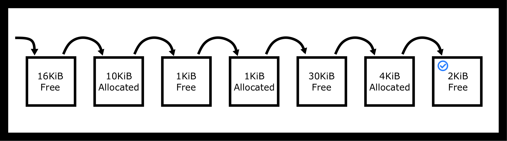
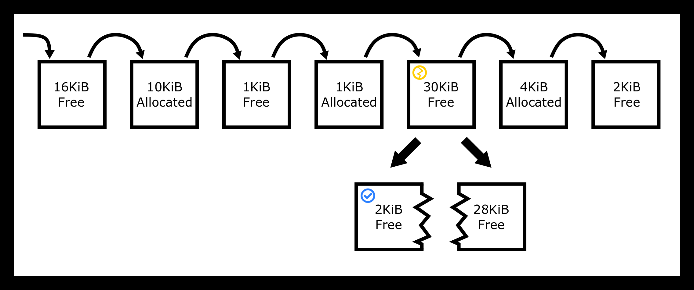
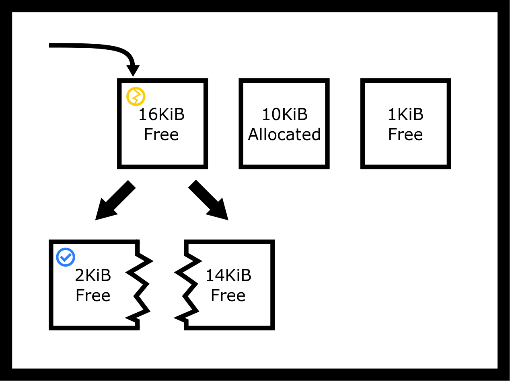
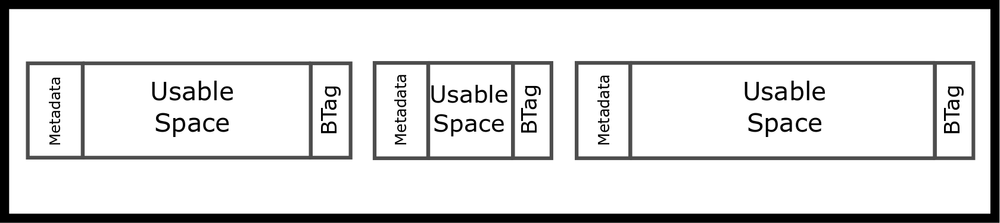
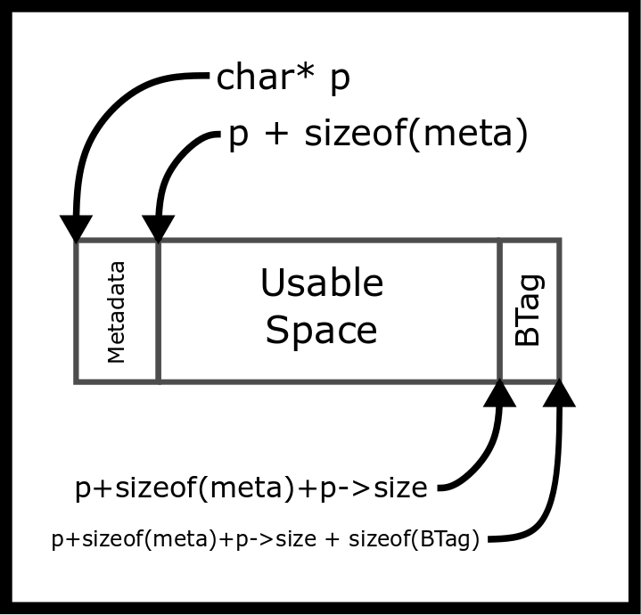
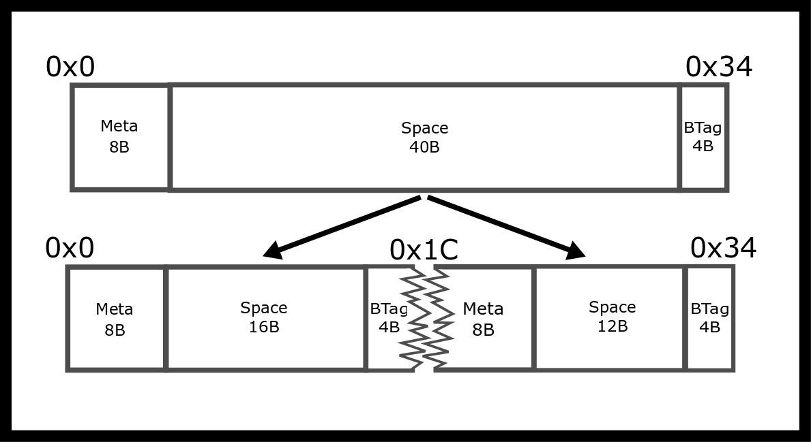
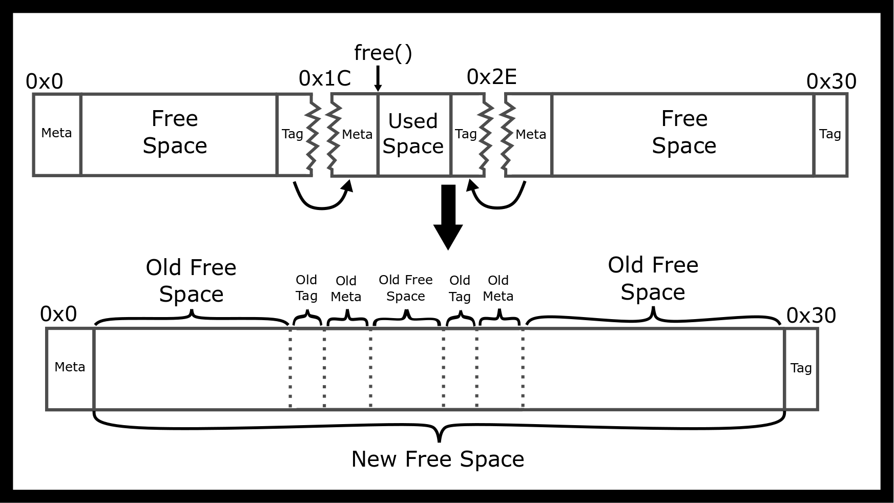
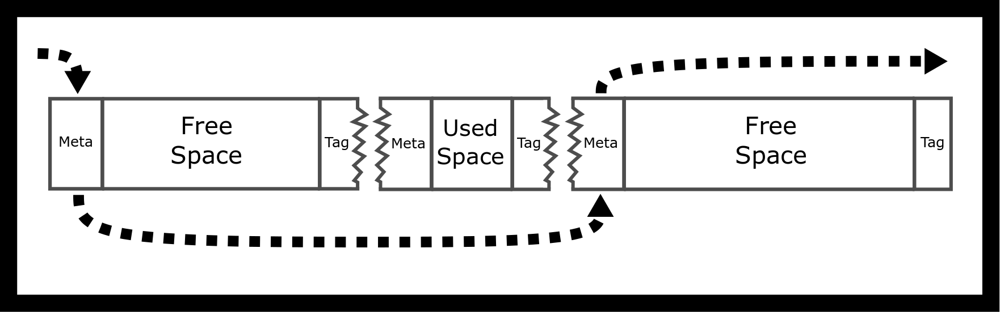
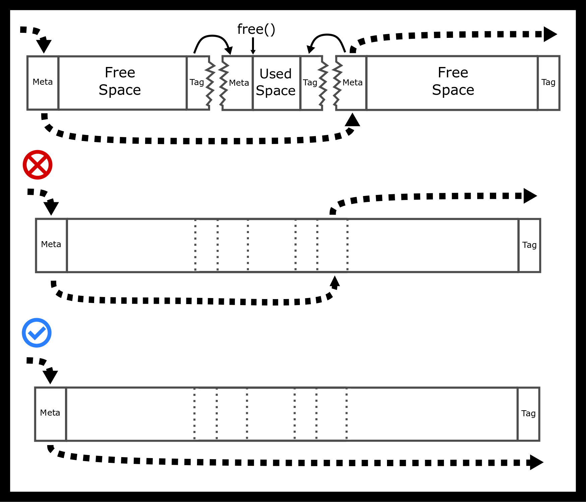

# 内存分配器

## 简介

内存分配很重要！在任何应用程序中，分配和释放堆内存是最常见的操作之一。在系统级别，堆是一系列连续的地址，程序可以扩展或收缩并用作其地址空间（“malloc 概述” 2018）。在 POSIX 中，这被称为系统断点。我们使用来移动系统断点。大多数程序不会直接与这个调用交互，它们使用围绕它的内存分配系统来处理分块和跟踪哪些内存已分配，哪些已释放。

我们将主要探讨简单的分配器。只需知道还有其他方式来划分内存，比如使用或其他分配方案和方法。

## C 内存分配 API

+   是一个 C 库调用，用于保留可能未初始化的连续内存块（Jones 2010 P. 348）。与栈内存不同，内存保留分配直到用相同的指针调用。如果可以返回至少请求这么多空闲空间的指针，或者。这意味着 malloc 即使在有空间的情况下也可能返回 NULL。健壮的程序应该检查返回值。如果你的代码假设成功，但实际上没有，那么当程序尝试写入地址 0 时，程序可能会崩溃（segfault）。此外，由于性能原因，malloc 会在内存中留下垃圾，请检查你的代码以确保程序中所有程序值都已初始化。

+   允许程序调整先前在堆上分配的现有内存分配的大小（通过 malloc、calloc 或 realloc）（Jones 2010 P. 349）。realloc 最常用的用途是调整用于存储值数组的内存的大小。realloc 有两个需要注意的问题。一是可能会返回新的指针。二是它可能会失败。以下是一个建议的 realloc 简单但可读的实现版本，以及示例用法。

    ```c
    void * realloc(void * ptr, size_t newsize) {
     // Simple implementation always reserves more memory
     // and has no error checking
     void *result = malloc(newsize);
     size_t oldsize =  ... //(depends on allocator's internal data structure)
     if (ptr) memcpy(result, ptr, newsize < oldsize ? newsize : oldsize);
     free(ptr);
     return result;
    }

    int main() {
     // 1
     int *array = malloc(sizeof(int) * 2);
     array[0] = 10; array[1] = 20;
     // Oops need a bigger array - so use realloc..
     array = realloc(array, 3 * sizeof(int));
     array[2] = 30;

    }
    ```

    上述代码很脆弱。如果失败，程序会泄漏内存。健壮的代码会检查返回值，并且只有在非 NULL 的情况下才重新分配原始指针。

    ```c
    int main() {
     // 1
     int *array = malloc(sizeof(int) * 2);
     array[0] = 10; array[1] = 20;
     void *tmp = realloc(array, 3 * sizeof(int));
     if (tmp == NULL) {
     // Nothing to do here.
     } else if (tmp == array) {
     // realloc returned same space
     array[2] = 30;
     } else {
     // realloc returned different space
     array = tmp;
     array[2] = 30;
     }

    }
    ```

+   将内存内容初始化为零，并接受两个参数：项目数量和每个项目的字节大小。关于这些限制的深入讨论见[这篇文章](http://locklessinc.com/articles/calloc/)。程序员通常使用而不是显式调用，来将内存内容设置为零，因为考虑到了某些性能因素。注意与是相同的，但你应该遵循手册中的约定。以下是一个 calloc 的简单实现。

    ```c
    void *calloc(size_t n, size_t size) {
     size_t total = n * size; // Does not check for overflow!
     void *result = malloc(total);

     if (!result) return NULL;

     // If we're using new memory pages
     // allocated from the system by calling sbrk
     // then they will be zero so zero-ing out is unnecessary,
     // We will be non-robust and memset either way.
     return memset(result, 0, total);
    }
    ```

+   接收一个指向内存块开始的指针，并在后续调用其他分配函数时使其可用。这是很重要的，因为我们不希望我们的地址空间中的每个进程都占用大量的内存。一旦我们完成对内存的使用，我们就停止使用它，使用‘free’。以下是一个简单用法的示例。

    ```c
    int *ptr = malloc(sizeof(*ptr));
    do_something(ptr);
    free(ptr);
    ```

    如果程序在释放内存后使用了一块内存——这是未定义的行为。

### 堆和 sbrk

堆是进程内存的一部分，其大小会变化。当程序调用（,）和时，堆内存分配由 C 库执行。通过调用 C 库，可以根据程序对更多堆内存的需求增加堆的大小。由于堆和栈都需要增长，我们将它们放在地址空间的相反两端。栈的增长方式与堆不同，新的栈部分是为新的线程分配的。对于典型的架构，堆向上增长，而栈向下增长。

现在，现代操作系统的内存分配器不再需要。相反，它们可以请求独立的虚拟内存区域，并维护多个内存区域。例如，吉字节请求可能被放置在比小分配请求不同的内存区域。然而，这个细节是不必要的复杂性。

程序通常不需要调用，尽管调用可能很有趣，因为它告诉程序堆当前结束的位置。相反，程序使用，和，它们是 C 库的一部分。这些函数的内部实现可能需要在额外的堆内存时调用。

```c
void *top_of_heap = sbrk(0);
malloc(16384);
void *top_of_heap2 = sbrk(0);
printf("The top of heap went from %p to %p \n", top_of_heap, top_of_heap2);
// Example output: The top of heap went from 0x4000 to 0xa000
```

注意，操作系统新获得的内存必须被清零。如果操作系统保留了物理 RAM 的内容，那么一个进程可能会了解到之前使用过该内存的另一个进程的内存。这将是一个安全漏洞。不幸的是，这意味着在释放任何内存之前，请求通常是零。这是不幸的，因为许多程序员错误地编写了假设分配的内存将*始终*为零的 C 程序。

```c
char* ptr = malloc(300);
// contents is probably zero because we get brand new memory
// so beginner programs appear to work!
// strcpy(ptr, "Some data"); // work with the data
free(ptr);
// later
char *ptr2 = malloc(300); // Contents might now contain existing data and is probably not zero
```

## 分配简介

让我们尝试编写 Malloc。这是我们第一次尝试——一个简单的版本。

```c
void* malloc(size_t size)
{
 // Ask the system for more bytes by extending the heap space.
 // sbrk returns -1 on failure
 void *p = sbrk(size);
 if(p == (void *) -1) return NULL; // No space left
 return p;
}
 void free() {/* Do nothing */}
```

上面的 malloc 实现是最简单的，尽管有一些缺点。

+   系统调用与库调用相比速度较慢。我们应该预留大量内存，并且只偶尔从系统请求更多内存。

+   释放内存后不重用。我们的程序从不重用堆内存——它总是请求更大的堆。

如果在典型程序中使用此分配器，进程会很快耗尽所有可用内存。相反，我们需要一个可以高效使用堆空间并且仅在必要时请求更多内存的分配器。一些程序使用这种类型的分配器。考虑一个视频游戏在加载下一个场景时分配对象。与以下放置策略相比，这样做并丢弃整个内存块要快得多。

### 放置策略

在程序执行期间，内存被分配和释放，因此在堆内存中会出现可以用于未来内存请求的间隙。内存分配器需要跟踪堆的哪些部分当前被分配，哪些部分是可用的。假设我们的当前堆大小是 64K。让我们假设堆看起来像以下表格。


空堆块

如果执行一个新的 2KiB malloc 请求（），应该在何处保留内存？它可以使用最后一个 2KiB 的空隙，这恰好是完美的尺寸！或者它可以将其他两个空闲空隙中的一个分割。这些选择代表了不同的安置策略。无论选择哪个空隙，分配器都需要将空隙分割成两个。新分配的空间，将返回给程序，如果还有剩余空间，则是一个更小的空隙。完美适配策略找到足够小的最小空隙（至少 2KiB）：



最佳适配找到精确匹配

最坏适配策略找到足够大的最大空隙，因此将 30KiB 的空隙分割成两个：



最坏适配找到最不匹配项

首次适配策略找到足够大的第一个可用空隙，因此将 16KiB 的空隙分割成两个。我们甚至不需要查看整个堆！



首次适配找到第一个匹配项

需要记住的一点是，这些安置策略不需要替换块。例如，我们的首次适配分配器可以返回未损坏的原始块。注意，这将导致大约 14KiB 的空间被用户和分配器未使用。我们称之为内部碎片。

相比之下，外部碎片化是指尽管我们在堆中有足够的内存，但它可能被分割成一种方式，使得连续的该尺寸块不可用。在我们的上一个例子中，64KiB 的堆内存中，有 17KiB 被分配，47KiB 是空闲的。然而，最大的可用块只有 30KiB，因为我们的可用未分配堆内存被分割成更小的块。

### 安置策略的优缺点

编写堆分配器的挑战

+   需要最小化碎片化（即最大化内存利用率）

+   需要高性能

+   实现复杂——使用链表和指针算术进行大量指针操作。

+   无论是碎片化还是性能，都取决于应用程序的分配配置文件，这可以评估但不能预测，在实践中，在特定的使用条件下，专用分配器通常可以优于通用实现。

+   分配器事先不知道程序的内存分配请求。即使我们知道，这也是一个已知的 NP-hard 问题——背包问题！

不同的策略以非直观的方式影响堆内存的碎片化，这些影响只有通过数学分析或在现实条件下的仔细模拟（例如模拟数据库或网络服务器的内存分配请求）才能发现。

首先，我们将对每个算法（Garey, Graham, 和 Ullman 1972）采用更数学化、一次性的方法。论文描述了一个场景，即你有一定数量的桶和一定数量的分配，你试图将分配放入尽可能少的桶中，从而尽可能少地使用内存。论文讨论了理论影响，并在长期运行中对理想内存使用和实际内存使用之间的比率设定了一个很好的限制。对于那些感兴趣的人来说，论文得出结论，随着桶数量的增加，实际内存使用与理想内存使用的比率约为 1.7，对于最佳匹配算法，这个比率下限为 1.7。这个分析的问题在于，很少有实际应用需要这种一次性分配。视频游戏对象分配通常会为每个级别指定不同的子堆，并在需要快速内存分配方案时填满该子堆。

在实践中，我们将使用 2005 年进行的一项更严格调查的结果（Wilson 等人 1995）。调查确保指出内存分配是一个不断变化的目标。对一个程序来说好的分配方案可能对另一个程序来说并不好。程序不会均匀地遵循分配的分布。调查讨论了我们介绍的所有分配方案以及一些额外的方案。以下是一些总结的要点：

1.  最佳匹配算法在选取几乎合适的块大小时可能会出现问题，剩余空间被分割得非常小，以至于程序可能不会使用它。解决这个问题的一个方法可能是设置一个分割阈值。在常规负载下，这种小的分割并不常见。此外，最佳匹配算法的最坏情况行为很糟糕，但这种情况通常不会发生[第 43 页]。

1.  调查还讨论了首次匹配的一个重要区别。首次匹配可以有多个概念。首次可以是按照“释放”的时间顺序排列，或者可以通过块的起始地址排列，或者可以按照最后释放的时间顺序排列——首次是最不经常使用的。调查没有深入探讨每种性能，但确实记录了地址顺序和最近最少使用（LRU）列表最终比最近最常使用列表有更好的性能。

1.  调查最后总结说，在模拟随机（假设随机均匀）的工作负载下，最佳适配（best fit）和首次适配（first fit）表现相当。即使在实践中，最佳适配和地址排序的首次适配在分割阈值和合并操作中也表现得相当。原因并不完全清楚。

我们还做一些额外的笔记

1.  最佳适配可能比完整堆扫描所需时间更少。当找到一个完美大小或完美大小在阈值内的块时，可以根据你的边缘情况策略返回该块。

1.  最坏适配也是如此。你的堆可以用最大堆数据结构表示，每次分配调用可以简单地弹出顶部，重新堆化，并可能插入一个分割内存块。然而，使用斐波那契堆可能会非常低效。

1.  首次适配（First-Fit）需要有一个块顺序。大多数情况下，程序员会默认选择链表，这是一个不错的选择。在使用最近最少使用（least recently used）和最近最少使用（most recently used）链表策略时，改进空间不大，但使用地址排序的链表，你可以通过结合使用随机跳表（skip-list）和单链表，将插入速度从 O(n)提升到 O(log(n))。插入操作会使用跳表作为快捷方式来找到插入块的正确位置，而删除操作会像正常一样遍历列表。

1.  我们还没有讨论过许多放置策略，其中一个是下一个适配（next-fit），它是在下一个适配块上的首次适配。这增加了确定性随机性——请原谅这个矛盾的说法。你不需要了解这个算法，因为你知道你正在实现一个作为机器问题一部分的内存分配器，还有更多这样的算法。

## 内存分配器教程

内存分配器需要跟踪哪些字节当前已被分配，哪些可供使用。本节介绍了构建分配器或实现分配器的实际代码的实现和概念细节。

从概念上讲，我们正在考虑创建链表和块列表！请欣赏以下 ASCII 艺术。bt 是边界标签的缩写。



3 Adjacent Memory blocks

在我们的下一个块中，我们将有隐式指针，这意味着我们可以通过加法从一个块跳转到另一个块。这与我们的元块中的显式字段形成对比。



Malloc addition

可以通过找到当前块的末尾来获取下一个块。这就是我们所说的“隐式列表”。

实际的间隔可能不同。元数据可以包含不同内容。最小化元数据实现将仅包含块的大小。

由于我们写入内存中的整数和指针是我们已经控制的，因此我们可以后来一致地从地址跳转到下一个地址。这种内部信息代表了一些开销。这意味着即使我们从系统请求了 1024 KiB 的连续内存，分配该大小的请求也可能失败。

我们的堆内存是一系列块，其中每个块要么已分配，要么未分配。因此，在概念上有一个空闲块列表，但它以我们存储在每个块中的块大小信息的形式隐含存在。让我们从简单实现的角度来考虑它。

```c
typedef struct {
 size_t block_size;
 char data[0];
} block;
block *p = sbrk(100);
p->size = 100 - sizeof(*p) - sizeof(BTag);
// Other block allocations
```

我们可以通过向块的尺寸添加来从一个块导航到下一个块。

```c
p + sizeof(metadata) + p->block_size + sizeof(BTag)
```

确保你的类型转换正确！否则，程序将移动极端数量的字节。

调用程序永远不会看到这些值。它们是内存分配器实现内部的。例如，假设你的分配器被要求保留 80 字节（()）并需要 8 字节的内部头数据。分配器需要找到一个至少 88 字节的未分配空间。在更新堆数据后，它会返回一个指向块的指针。然而，返回的指针指向的是可用空间，而不是内部数据！相反，我们将返回块的起始地址加 8 字节。在实现中，请记住指针算术依赖于类型。例如，它加上，不一定是 8 字节！

### 实现内存分配器

最简单的实现使用首次适配。从第一个块开始，假设它存在，并迭代，直到找到一个表示足够大未分配空间的块，或者我们已经检查了所有块。如果没有找到合适的块，那么是时候再次调用以足够扩展堆的大小了。对于这门课程，我们将尝试服务每一个内存请求，直到操作系统告诉我们我们将耗尽堆空间。其他应用程序可能限制自己使用特定的堆大小，导致请求间歇性失败。此外，快速实现可能会显著扩展它，这样我们就不需要很快请求更多的堆内存。

当找到一个空闲块时，它可能比我们需要的空间大。如果是这样，我们将在我们的隐式列表中创建两个条目。第一个条目是已分配的块，第二个条目是剩余的空间。如果程序想要保持开销小，有方法可以做到这一点。我们建议首先考虑可读性。

```c
typedef struct {
 size_t block_size;
 int is_free;
 char data[0];
} block;
block *p = sbrk(100);
p->size = 100 - sizeof(*p) - sizeof(boundary_tag);
// Other block allocations
```

如果程序想要某些位持有不同的信息片段，请使用位字段！

```c
typedef struct {
 unsigned int block_size : 7;
 unsigned int is_free : 1;
} size_free;

typedef struct {
 size_free info;
 char data[0];
} block;
```

编译器将处理位移。设置好你的字段后，它就变成了简单地遍历每个块并检查适当的字段。

这里是发生情况的视觉表示。如果我们假设我们有一个看起来像这样的块，我们想要分配 16 字节的空间，那么我们需要做的分割如下。



Malloc split

这也涉及到对齐问题。

### 对齐和向上取整的考虑

许多架构期望多字节数据对齐到 2 的某个倍数（例如 4、16 等）。例如，通常要求 4 字节数据对齐到 4 字节边界，8 字节数据对齐到 8 字节边界。如果多字节数据存储在不合理的边界上，性能可能会受到显著影响，因为它可能需要额外的内存读取。在某些架构上，这种惩罚甚至更大——程序会因为[总线错误](http://en.wikipedia.org/wiki/Bus_error#Unaligned_access)而崩溃。如果你们的架构课程中没有内存保护，你们中的大多数人可能都经历过这种情况。

由于不知道用户将如何使用分配的内存，返回给程序的指针需要针对最坏情况对齐，这取决于架构。

根据 glibc 文档，glibc 使用以下启发式方法（“虚拟内存分配和分页” 2001)

> malloc 给你的块保证是对齐的，这样它就可以容纳任何类型的数据。在 GNU 系统上，地址通常是 8 的倍数，在 64 位系统上是 16 的倍数。"例如，如果你需要计算所需的 16 字节单元数，别忘了向上取整。

这就是 C 中的数学看起来像什么。

```c
int s = (requested_bytes + tag_overhead_bytes + 15) / 16
```

额外的常数确保不完整的单元向上取整。注意，真正的代码更可能使用符号大小，例如，而不是编码数值常数 15。[这里有一篇关于内存对齐的精彩文章，如果你对此更感兴趣](http://www.ibm.com/developerworks/library/pa-dalign/)

另一个可能的影响是，当给定的块大于其分配大小时，可能会发生内部碎片。假设我们有一个大小为 16B 的空闲块（不包括元数据）。如果它们分配 7 字节，分配器可能想要向上取整到 16B 并返回整个块。当实现合并和分割时，这会变得很危险。如果分配器没有实现其中任何一个，它可能最终会为一个 7B 的分配返回一个大小为 64B 的块！这个分配的开销很大，这正是我们试图避免的。

### 实现 free

当调用时，我们需要重新应用偏移量以回到块的“真实”起始位置——即我们存储大小信息的地方。一个简单的实现会简单地标记块为未使用。如果我们正在将块分配状态存储在位域中，那么我们需要清除位：

```c
p->info.is_free = 0;
```

然而，我们还有更多的工作要做。如果当前块和下一个块（如果存在）都是空闲的，我们需要将这些块合并成一个单独的块。同样，我们还需要检查上一个块。如果它存在并且代表未分配的内存，那么我们需要将这些块合并成一个大的单独块。

为了能够将一个空闲块与前面的空闲块合并，我们还需要找到前面的块，因此我们也将块的大小存储在块的末尾。这些被称为“边界标签”（Knuth 1973）。这是 Knuth 解决合并问题的两种方法。由于块是连续的，一个块的末尾紧邻下一个块的开始。因此，当前块（除了第一个块之外）可以向后查看几个字节以查找前一个块的大小。有了这些信息，分配器现在可以向后跳转！

以双合并为例。如果我们想要释放中间的块，我们需要将周围的块转换成一个大的块



空闲双合并

### 性能

根据上述描述，可以构建一个内存分配器。其主要优点是简单性——至少与其他分配器相比是简单的！分配内存是一个最坏情况下的线性时间操作——搜索链表以找到足够大的空闲块。释放分配是常数时间。不需要超过 3 个块合并成一个单独的块，并且使用最近最少使用块方案，只需要一个链表条目。

使用这个分配器，可以尝试不同的放置策略。例如，分配器可以从最后一个释放的块开始搜索。如果分配器存储块指针，它需要更新指针，以确保它们始终有效。

### 显式空闲列表分配器

通过实现一个显式的双向链表来管理空闲节点，可以取得更好的性能。在这种情况下，我们可以立即遍历到下一个空闲块和上一个空闲块。这可以减少搜索时间，因为链表只包括未分配的块。第二个优点是，我们现在可以控制链表的顺序。例如，当一个块被释放时，我们可以选择将其插入到链表的开始处，而不是总是插入到其邻居之间。我们可能需要更新我们的结构体，使其看起来像这样

```c
typedef struct {
 size_t info;
 struct block *next;
 char data[0];
} block;
```

这就是它看起来像什么，以及我们的隐式链表



空闲列表

我们在哪里存储我们链表的指针？一个简单的技巧是意识到块本身没有被使用，并将下一个和前一个指针作为块的一部分存储，尽管你必须确保空闲块总是足够大，可以容纳两个指针。我们仍然需要实现边界标签，这样我们就可以正确地释放块并将它们与其两个邻居合并。因此，显式空闲列表需要更多的代码和复杂性。使用显式链接列表时，使用一个快速简单的“查找第一个”算法来查找第一个足够大的链接。然而，由于链接顺序可以修改，这对应着不同的放置策略。如果链接是从大到小维护的，那么这会产生一个“最坏匹配”放置策略。

尽管如此，也存在边缘情况，考虑如何在双合并的同时维护你的空闲列表。我们包含了一个常见的错误示例图。



空闲列表的良好和不良合并

我们建议在尝试实现 malloc 时，先在概念上绘制所有情况，然后再编写代码。

#### 显式链接列表插入策略

新释放的块可以轻松地插入两个可能的位置：在开始处或在地址顺序中。在开始处插入创建了一个 LIFO（后进先出）策略。最近释放的空间将被重用。研究表明，碎片化比使用地址顺序更严重（Wilson 等人 1995))。

按地址顺序插入（“地址顺序策略”）将已释放的块插入，以便块按递增的地址顺序访问。这种策略需要更多时间来释放一个块，因为必须使用边界标签（大小数据）来找到下一个和上一个未分配的块。然而，碎片化较少。

## 案例研究：伙伴分配器，一个分隔列表的例子

分隔分配器是指将堆分成不同区域，这些区域由不同子分配器根据分配请求的大小来处理的分配器。大小被分组为 2 的幂，每个大小由不同的子分配器处理，并且每个大小都维护其空闲列表。

这种类型的知名分配器是 buddy 分配器（Rangan, Raman, 和 Ramanujam 1999 P. 85）。我们将讨论二进制 buddy 分配器，它将分配分成大小为<semantics><mrow><msup><mn>2</mn><mi>n</mi></msup><mo>;</mo><mi>n</mi><mo>=</mo><mn>1</mn><mo>,</mo><mn>2</mn><mo>,</mo><mn>3</mn><mo>,</mo><mi>.</mi><mi>.</mi><mi>.</mi></mrow><annotation encoding="application/x-tex">2^n; n = 1, 2, 3, ...</annotation></semantics>倍的一些基本单元字节数的块，但其他也存在，如斐波那契分割，其中分配会被向上舍入到下一个斐波那契数。基本概念很简单：如果没有大小为<semantics><msup><mn>2</mn><mi>n</mi></msup><annotation encoding="application/x-tex">2^n</annotation></semantics>的空闲块，就转到下一级，并偷取那个块并将其分割成两个。如果两个相同大小的相邻块都未被分配，它们可以合并成一个大小加倍的单一大块。

Buddy 分配器速度快，因为可以计算与合并的相邻块地址，而不是遍历大小标签。最佳性能通常需要少量汇编代码来使用专门的 CPU 指令找到最低的非零位。

Buddy 分配器的主要缺点是它们会遭受*内部碎片化*，因为分配会被向上舍入到最近的块大小。例如，一个 68 字节的分配将需要一个 128 字节的块。

## 案例研究：SLUB 分配器，Slab 分配

SLUB 分配器是一种为 Linux 内核[SLUB](http://en.wikipedia.org/wiki/SLUB_%28software%29)服务的 slab 分配器。想象一下，你正在为内核创建一个分配器，你的要求是什么？这里是一个假设的简短清单。

1.  首要的是，你希望内存占用低，以便内核能够安装在所有类型的硬件上：嵌入式、桌面、超级计算机等。

1.  然后，你希望实际内存尽可能连续，以便利用缓存。每次执行系统调用时，内核的页面都需要加载到内存中。这意味着如果它们都是连续的，处理器将能够更有效地缓存它们。

1.  最后，你希望你的分配速度快。

进入 SLUB 分配器。SLUB 分配器是一个具有最小分割和合并的分离列表分配器。这里的区别在于，分离列表专注于更现实的分配大小，而不是 2 的幂。SLUB 还专注于保持缓存中的页面，同时尽量减少整体内存占用。存在不同大小的块，内核将每个分配请求向上舍入到满足其要求的最小块大小。与其它分配器相比，这个分配器的一个重大区别是它通常符合页面大小。我们将在另一章中讨论虚拟内存和页面，但内核将以 4Kib 或 4096 字节的跨度直接处理内存页面。

## 进一步阅读

指导性问题

+   malloc 分配的内存是否已初始化？calloc 或 realloc 分配的内存呢？

+   realloc 是否接受元素数量或空间（以字节为单位）作为其参数？

+   为什么分配函数可能会出错？

请参阅[手册页](http://man7.org/linux/man-pages/man3/malloc.3.html)或书籍附录中的 17.18.1 部分！

+   [块分配](https://en.wikipedia.org/wiki/Slab_allocation)

+   [伙伴内存分配](http://en.wikipedia.org/wiki/Buddy_memory_allocation)

## 主题

+   最佳适应

+   最坏适应

+   首次适应

+   伙伴分配器

+   内部碎片化

+   外部碎片化

+   sbrk

+   自然对齐

+   边界标记

+   合并

+   分割

+   块分配/内存池

## 问题/练习

+   什么是内部碎片化？何时会成为一个问题？

+   什么是外部碎片化？何时会成为一个问题？

+   什么是最佳适应放置策略？它在外部碎片化方面如何？时间复杂度是多少？

+   什么是最坏适应放置策略？它在外部碎片化方面是否有任何优势？时间复杂度是多少？

+   什么是首次适应放置策略？它在外部碎片化方面有何优势？期望的时间复杂度是多少？

+   假设我们正在使用一个 64kb 的新块伙伴分配器。它是如何分配 1.5kb 的？

+   当 malloc 的 5 行实现有何用途？

+   什么是自然对齐？

+   什么是合并/分割？它们如何增加/减少碎片化？何时可以进行合并或分割？

+   边界标记是如何工作的？它们如何被用来合并或分割？
