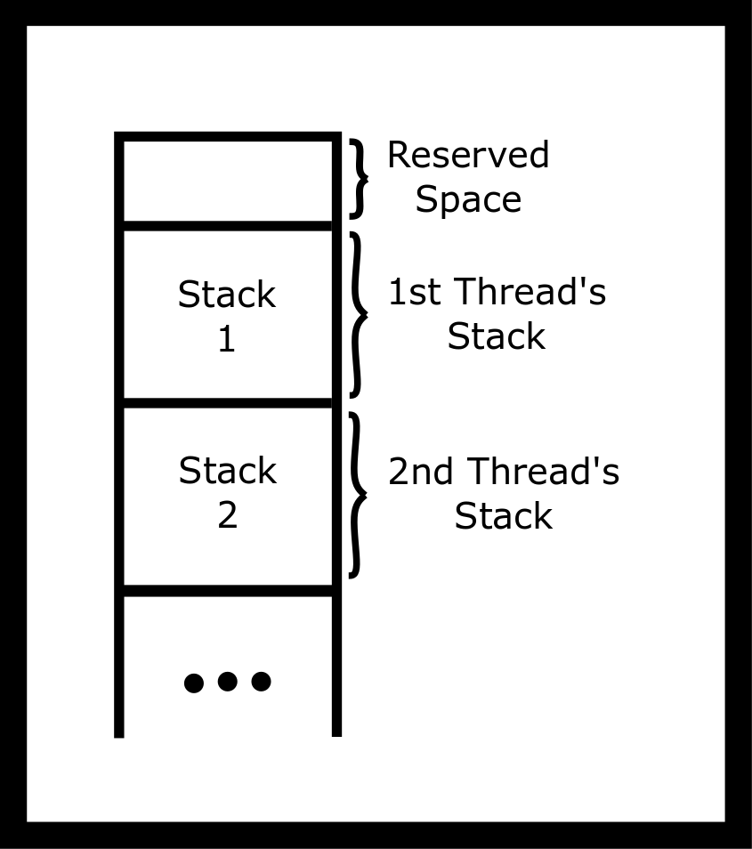
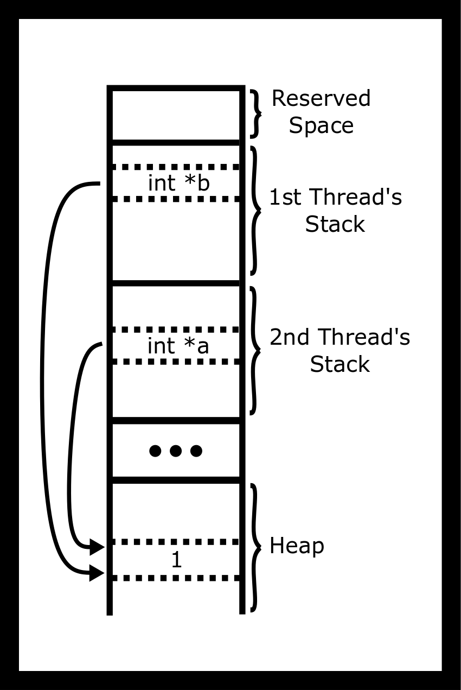
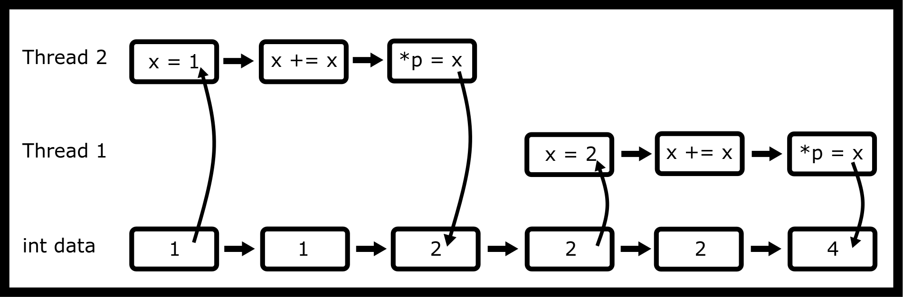
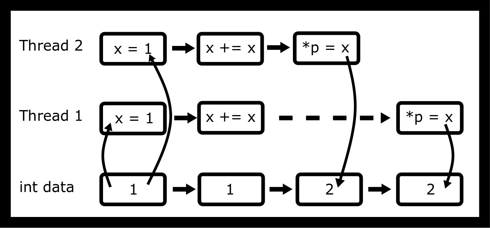

# 线程

线程是“执行线程”的简称。它代表了 CPU 将要执行的指令序列。为了记住如何从函数调用中返回，以及存储自动变量和参数的值，线程使用一个栈。几乎有点奇怪的是，线程是一个进程，这意味着创建线程类似于进程，但是没有复制，也就是说没有写时复制。这允许进程共享相同的地址空间、变量、堆、文件描述符等。创建线程的实际系统调用类似于。它是。我们不会深入细节，但你可以阅读[man 手册](http://man7.org/linux/man-pages/man2/clone.2.html)，记住这超出了本课程的直接范围。LWP（轻量级进程）或线程在许多场景下比 fork 更受欢迎，因为创建它们的开销要小得多。但在某些情况下，特别是 Python 使用这种情况，多进程是使你的代码更快的方法。

## 进程与线程的比较

创建单独的进程有用的情况：

+   当需要更多安全性时。例如，Chrome 浏览器为不同的标签页使用不同的进程。

+   当运行现有且完整的程序时需要创建新进程，例如启动‘gcc’。

+   当你在遇到同步原语，并且每个进程都在操作系统中的某个东西时。

+   当你有太多线程时——内核试图将所有线程调度到彼此附近，这可能会造成比好处更多的伤害。

+   当你不想担心竞态条件时

+   当通信量足够小，以至于只需要简单的 IPC（进程间通信）时。

另一方面，创建线程更有用，当：

+   你想利用多核系统的力量来完成一项任务

+   当你无法处理进程的开销时

+   当你想要简化进程间的通信时

+   当你希望线程成为同一进程的一部分时

## 线程内部结构

你的主函数和其他函数有自动变量。我们将使用栈在内存中存储它们，并通过使用简单的指针（“栈指针”）来跟踪栈的大小。如果线程调用另一个函数，我们将移动我们的栈指针，以便有更多空间用于参数和自动变量。一旦从函数返回，我们可以将栈指针移回到其先前值。我们保留旧栈指针值的副本——在栈上！这就是为什么从函数返回是快速的原因。因为程序需要改变栈指针，所以自动变量占用的内存很容易“释放”。

在多线程程序中，有多个栈，但只有一个地址空间。pthread 库分配一些栈空间，并使用函数调用在栈地址处启动线程。



线程栈可视化

一个程序可以在一个进程中运行多个线程。程序会免费获得第一个线程！它运行你写在‘main’中的代码。如果程序需要更多线程，它可以调用以使用 pthread 库创建新线程。您需要传递一个指向函数的指针，以便线程知道从哪里开始。

由于线程都是同一进程的一部分，它们都生活在相同的虚拟内存中。因此，它们都可以看到堆、全局变量和程序代码。



堆中指向同一位置的线程

因此，一个程序可以在同一进程中同时由两个（或更多）CPU 工作，并且它们可以同时工作。操作系统负责将线程分配给 CPU。如果一个程序的活动线程比 CPU 多，内核将分配一个线程给 CPU 进行短暂的处理，或者直到它没有更多事情可做，然后自动将 CPU 切换到处理另一个线程。例如，一个 CPU 可能正在处理游戏 AI，而另一个线程正在计算图形输出。

## 简单用法

要使用 pthread，需要包含并编译和链接或编译器选项。此选项告诉编译器，您的程序需要线程支持。要创建线程，请使用函数。此函数接受四个参数：

```c
int pthread_create(pthread_t *thread, const pthread_attr_t *attr,
void *(*start_routine) (void *), void *arg);
```

+   第一个是指向将持有新创建的线程 ID 的变量的指针。

+   第二个是指向我们可以用来调整和调整 pthread 一些高级功能的属性的指针。

+   第三是我们要运行的函数的指针

+   第四是传递给我们的函数的指针

参数难以阅读！这意味着一个接受指针并返回指针的指针。它看起来像函数声明，除了函数名被括号包围。

```c
#include <stdio.h>
#include <pthread.h>

void *busy(void *ptr) {
 // ptr will point to "Hi"
 puts("Hello World");
 return NULL;
}
int main() {
 pthread_t id;
 pthread_create(&id, NULL, busy, "Hi");
 void *result;
 pthread_join(id, &result);
}
```

在上述示例中，结果将是，因为繁忙的函数返回了。我们需要传递结果地址，因为我们将写入指针的内容。

在手册页中，它警告程序员应该使用作为不透明类型，并且不要查看内部结构。尽管如此，我们经常忽略这一点。

## Pthread 函数

这里有一些常见的 pthread 函数：

+   创建一个新线程。每个线程都会得到一个新的栈。如果程序两次调用，则您的进程将包含三个栈 - 每个线程一个。第一个线程是在进程启动时创建的，其他两个是在创建后。实际上，可能还有更多的栈，但让我们保持简单。重要的思想是每个线程都需要一个栈，因为栈包含自动变量和旧的 CPU PC 寄存器，这样它就可以在函数完成后返回调用函数。

+   停止一个线程。注意，线程可能仍然继续。例如，当线程执行操作系统调用（例如）时，它可能被终止。在实际应用中，很少使用，因为线程不会清理像文件这样的打开资源。另一种实现方法是使用一个布尔（int）变量，其值用于通知其他线程它们应该完成并清理。

+   停止调用线程，意味着线程在调用后永远不会返回。如果没有其他线程正在运行，pthread 库将自动完成进程。这等价于从线程函数返回；两者都结束线程并设置线程的返回值（void 指针）。在线程中调用是简单程序确保所有线程完成的一种常见方式。例如，在以下程序中，线程可能没有时间开始。另一方面，退出整个进程并设置进程的退出值。这等价于在主方法中。进程内的所有线程都将停止。注意，版本会创建线程僵尸；然而，这不是一个长时间运行的进程，所以我们并不关心。

    ```c
    int main() {
     pthread_t tid1, tid2;
     pthread_create(&tid1, NULL, myfunc, "Jabberwocky");
     pthread_create(&tid2, NULL, myfunc, "Vorpel");
     if (keep_threads_going) {
     pthread_exit(NULL);
     } else {
     exit(42); //or return 42;
     }

     // No code is run after exit
    }
    ```

+   等待线程完成并记录其返回值。已完成的线程将继续消耗资源。最终，如果创建了足够的线程，将会失败。在实际应用中，这仅是长时间运行进程的问题，但对于简单、短暂的生命周期进程来说并不是问题，因为所有线程资源在进程退出时都会自动释放。这相当于让你的孩子变成僵尸，所以对于长时间运行的进程要记住这一点。在退出示例中，我们也可以等待所有线程。

    ```c
    // ...
    void* result;
    pthread_join(tid1, &result);
    pthread_join(tid2, &result);
    return 42;
    // ...
    ```

有许多退出线程的方法。以下是一个不完整的列表：

+   从线程函数返回

+   调用

+   使用

+   通过信号终止进程。

+   调用或

+   从

+   执行另一个程序

+   断开电脑的电源

+   一些未定义的行为可以终止你的线程，这是未定义的行为

## 竞争条件

竞争条件是指程序的结果由处理器根据其事件序列确定。这意味着代码的执行是非确定性的。这意味着相同的程序可以运行多次，并且根据内核如何调度线程，可能会产生不准确的结果。以下是一个典型的竞争条件。

```c
void *thread_main(void *p) {
 int *p_int = (int*) p;
 int x = *p_int;
 x += x;
 *p_int = x;
 return NULL;
}

int main() {
 int data = 1;
 pthread_t one, two;
 pthread_create(&one, NULL, thread_main, &data);
 pthread_create(&two, NULL, thread_main, &data);
 pthread_join(one, NULL);
 pthread_join(two, NULL);
 printf("%d\n", data);
 return 0;
}
```

分析汇编代码，有许多不同的代码访问方式。我们将假设数据存储在寄存器中。以下是不进行优化的增量代码（假设 int_ptr 包含 eax）。

```c
mov eax, DWORD PTR [rbp-4]    ;Loads int_ptr
add eax, eax                  ;Does the addition
mov DWORD PTR [rbp-4], eax    ;Stores it back
```

考虑这种访问模式。



线程访问 - 不是竞争条件

这种访问模式将导致变量变为 4。问题是当指令并行执行时。



线程访问 - 竞争条件

这种访问模式将导致变量被 2\. 这是一种未定义的行为和竞态条件。我们希望一次只有一个线程访问代码的一部分。

但当用编译时，汇编输出是一个单条指令。

```c
shl dword ptr [rdi]   # Optimized way of doing the add
```

难道这不能解决问题吗？这只是一个汇编指令，所以没有交错？它不能解决硬件本身可能遇到的竞态条件问题，因为我们作为程序员没有告诉硬件去检查它。最简单的方法是添加*lock*前缀（指南 2011，1120）。

但我们不想在汇编语言中编码！我们需要为这个问题想出一个软件解决方案。

#### 赛马日

这里还有一个小的竞态条件。以下代码本应启动十个线程，整数从 0 到 9。然而，当运行时打印出！或者很少打印出我们期望的内容。你能看出为什么吗？

```c
#include <pthread.h>
void* myfunc(void* ptr) {
 int i = *((int *) ptr);
 printf("%d ", i);
 return NULL;
}

int main() {
 // Each thread gets a different value of i to process
 int i;
 pthread_t tid;
 for(i =0; i < 10; i++) {
 pthread_create(&tid, NULL, myfunc, &i); // ERROR
 }
 pthread_exit(NULL);
}
```

上述代码受到一个-的影响，i 的值正在改变。新线程在示例输出中开始得晚，最后一个线程在循环结束后开始。为了克服这个竞态条件，我们将为每个线程提供一个指向其自己的数据区域的指针。例如，对于每个线程，我们可能想要存储 id、起始值和输出值。我们将把 i 视为一个指针，并通过值进行转换。

```c
void* myfunc(void* ptr) {
 int data = ((int) ptr);
 printf("%d ", data);
 return NULL;
}

int main() {
 // Each thread gets a different value of i to process
 int i;
 pthread_t tid;
 for(i =0; i < 10; i++) {
 pthread_create(&tid, NULL, myfunc, (void *)i);
 }
 pthread_exit(NULL);
}
```

竞态条件不在我们的代码中。它们可能存在于提供的代码中。一些函数如， ， ，不是线程安全的。让我们看看一个也是不“线程安全”的简单函数。结果缓冲区可以存储在全局内存中。在单线程程序中这是好的。我们不想返回一个指向栈上无效地址的指针，但在整个内存中只有一个结果缓冲区。如果两个线程同时使用它，一个会破坏另一个。

```c
char *to_message(int num) {
 static char result [256];
 if (num < 10) sprintf(result, "%d : blah blah" , num);
 else strcpy(result, "Unknown");
 return result;
}
```

有一些方法可以解决这个问题，比如使用同步锁，但首先让我们通过设计来做这件事。你会如何修复上面的函数？你可以更改任何参数和任何返回类型。这里有一个有效的解决方案。

```c
int to_message_r(int num, char *buf, size_t nbytes) {
 size_t written;
 if (num < 10) {
 written = snprintf(buf, nbtytes, "%d : blah blah" , num);
 } else {
 strncpy(buf, "Unknown", nbytes);
 buf[nbytes] = '\0';
 written = strlen(buf) + 1;
 }
 return written <= nbytes;
}
```

我们不是让函数负责内存，而是让调用者负责！许多程序，包括希望你的程序，需要的通信量最小。通常 malloc 调用比锁定互斥锁或向另一个线程发送消息要少。

### 不要跨界

一个程序可以在一个多线程进程中 fork！然而，子进程只有一个线程，它是调用进程的线程的克隆。我们可以将这视为一个简单示例，其中后台线程永远不会在子进程中打印第二条消息。

```c
#include <pthread.h>
#include <stdio.h>
#include <unistd.h>

static pid_t child = -2;

void *sleepnprint(void *arg) {
 printf("%d:%s starting up...\n", getpid(), (char *) arg);

 while (child == -2) {sleep(1);} /* Later we will use condition variables */

 printf("%d:%s finishing...\n",getpid(), (char*)arg);

 return NULL;
}
int main() {
 pthread_t tid1, tid2;
 pthread_create(&tid1,NULL, sleepnprint, "New Thread One");
 pthread_create(&tid2,NULL, sleepnprint, "New Thread Two");

 child = fork();
 printf("%d:%s\n",getpid(), "fork()ing complete");
 sleep(3);

 printf("%d:%s\n",getpid(), "Main thread finished");

 pthread_exit(NULL);
 return 0; /* Never executes */
}
```

```c
8970:New Thread One starting up...
8970:fork()ing complete
8973:fork()ing complete
8970:New Thread Two starting up...
8970:New Thread Two finishing...
8970:New Thread One finishing...
8970:Main thread finished
8973:Main thread finished
```

实际上，在分叉之前创建线程可能导致意外的错误，因为（如上所示）在分叉时其他线程会立即终止。另一个线程可能通过调用 malloc 锁定互斥锁，然后永远不会解锁它。然而，高级用户可能会发现这很有用，但我们建议程序在充分理解这种方法局限性和困难的情况下避免在分叉之前创建线程。

### 令人尴尬的并行问题

近年来，并行算法的研究已经激增。任何只需稍加努力就能实现并行的难题都可以称为令人尴尬的并行问题。其中许多问题与某些同步概念相关，但并非总是如此。你已经知道一个可并行化的算法，即归并排序！

```c
void merge_sort(int *arr, size_t len){
 if(len > 1){
 // Merge Sort the left half
 // Merge Sort the right half
 // Merge the two halves
 }
```

在你对线程有了新的理解之后，你所需要做的就是为左半部分创建一个线程，为右半部分创建一个线程。鉴于你的 CPU 有多个真实核心，你将看到根据[Amdahl 定律](https://en.wikipedia.org/wiki/Amdahl's_law)的速度提升。在这里，时间复杂度分析也变得很有趣。并行算法以<semantics><mrow><mi>O</mi><mo stretchy="false" form="prefix">(</mo><msup><mo>log</mo><mn>3</mn></msup><mo stretchy="false" form="prefix">(</mo><mi>n</mi><mo stretchy="false" form="postfix">)</mo><mo stretchy="false" form="postfix">)</mo></mrow><annotation encoding="application/x-tex">O(\log³(n))</annotation></semantics>的运行时间运行，因为我们假设我们有很多核心。

然而，在实践中，我们通常进行两个更改。一是，一旦数组足够小，我们就放弃并行归并排序算法，并使用在小型数组上运行快速的常规排序，通常在这个级别上遵循缓存一致性规则。另一件事是我们知道 CPU 没有无限的核心。为了解决这个问题，我们通常保持一个工作池。由于缓存一致性、调度额外线程等问题，你不会立即看到速度提升。然而，在更大的代码片段上，你将开始看到速度提升。

另一个令人尴尬的并行问题是并行映射。假设我们想要逐个元素将一个函数应用于整个数组。

```c
int *map(int (*func)(int), int *arr, size_t len){
 int *ret = malloc(len*sizeof(*arr));
 for(size_t i = 0; i < len; ++i) {
 ret[i] = func(arr[i]);
 }
 return ret;
}
```

由于没有任何元素依赖于其他元素，你将如何进行并行化？你认为将工作分配给线程的最佳方式是什么？

在附录中查看线程调度以获取更多调度方法。

### 其他问题

来自[Wikipedia](https://en.wikipedia.org/wiki/Embarrassingly_parallel)

+   在 Web 服务器上同时为多个用户提供静态文件。

+   曼德布罗特集、Perlin 噪声和类似图像，其中每个点都是独立计算的。

+   计算机图形的渲染。在计算机动画中，每一帧可以独立渲染（参见并行渲染）。

+   密码学中的暴力搜索。

+   举世瞩目的实际例子包括分布式.net 和加密货币中使用的证明工作系统。

+   生物信息学中的 BLAST 搜索，用于多个查询（但不用于单个大型查询）

+   比较数千个任意获取的面（例如，通过闭路电视的安全或监控视频）与大量先前存储的面（例如，流氓画廊或类似的观察名单）的大规模人脸识别系统。

+   比较许多独立场景的计算机模拟，例如气候模型。

+   遗传算法等进化计算元启发式算法。

+   数值天气预报的集成计算。

+   粒子物理学中的事件模拟和重建。

+   行军方阵算法

+   二次筛法和数域筛法的筛选步骤。

+   随机森林机器学习技术的树增长步骤。

+   每个谐波独立计算的离散傅里叶变换。

### 高级：轻量级进程？

在本章的开头，我们提到线程是进程。我们这是什么意思？你可以像创建进程一样创建一个线程。看看下面的示例代码。

```c
 // 8 KiB stacks
#define STACK_SIZE (8 * 1024 * 1024)

int thread_start(void *arg) {
 // Just like the pthread function
 puts("Hello Clone!")
 // This share the same heap and address space!
 return 0;
}

int main() {
 // Allocate stack space for the child
 char *child_stack = malloc(STACK_SIZE);
 // Remember stacks work by growing down, so we need
 // to give the top of the stack
 char *stack_top = stack + STACK_SIZE;

 // clone create thread
 pid_t pid = clone(thread_start, stack_top, SIGCHLD, NULL);
 if (pid == -1) {
 perror("clone");
 exit(1);
 }
 printf("Child pid %ld\n", (long) pid);

 // Wait like any child
 if (waitpid(pid, NULL, 0) == -1) {
 perror("waitpid");
 exit(1);
 }

 return 0;
}
```

这看起来很简单，不是吗？为什么不用这个功能？首先，有一大堆样板代码。此外，pthread 是 POSIX 标准的一部分，并具有定义的功能。Pthreads 允许程序设置各种属性——一些类似于 clone 的选项——以自定义你的线程。但如我们之前提到的，出于可移植性的原因，随着每个抽象层次的增加，我们都会失去一些功能。clone 可以做一些很酷的事情，比如在创建其他页面的副本时保持堆的不同部分相同。程序对调度的控制更精细，因为它是一个具有相同映射的进程。

在本课程中，任何时候都不应该使用 clone。但将来，要知道它是一个完美的 fork 替代方案。你必须小心并研究边缘情况。

### 进一步阅读

指导问题：

+   pthread create 的第一个参数是什么？

+   pthread create 中的起始路由是什么？arg 又是如何？

+   为什么 pthread create 可能会失败？

+   在一个进程中，线程共享哪些东西？线程有什么不同之处？

+   线程如何唯一地识别自己？

+   一些非线程安全库函数的例子是什么？为什么它们可能不是线程安全的？

+   程序如何停止一个线程？

+   程序如何获取线程的“返回值”？

+   [手册页面](http://man7.org/linux/man-pages/man3/pthread_create.3.html)

+   [pthread 参考指南](http://man7.org/linux/man-pages/man7/pthreads.7.html)

+   [简洁的第三方示例代码解释创建、连接和退出](http://www.thegeekstuff.com/2012/04/terminate-c-thread/)

## 主题

+   pthread 生命周期

+   每个线程都有一个堆栈

+   从线程捕获返回值

+   使用

+   使用

+   使用

+   在什么条件下进程会退出

## 问题

+   当 pthread 被创建时会发生什么？

+   每个线程的堆栈在哪里？

+   程序在给定的情况下如何获取返回值？线程可以设置该返回值的方式有哪些？如果程序丢弃了返回值，会发生什么？

+   为什么这很重要（考虑栈空间、寄存器、返回值）？

+   如果它不是最后一个线程，会怎么办？在调用 pthread_exit 之后，还会调用哪些其他函数？

+   请给出三个多线程进程退出的条件。还有其他条件吗？

+   什么是令人尴尬的并行问题？
