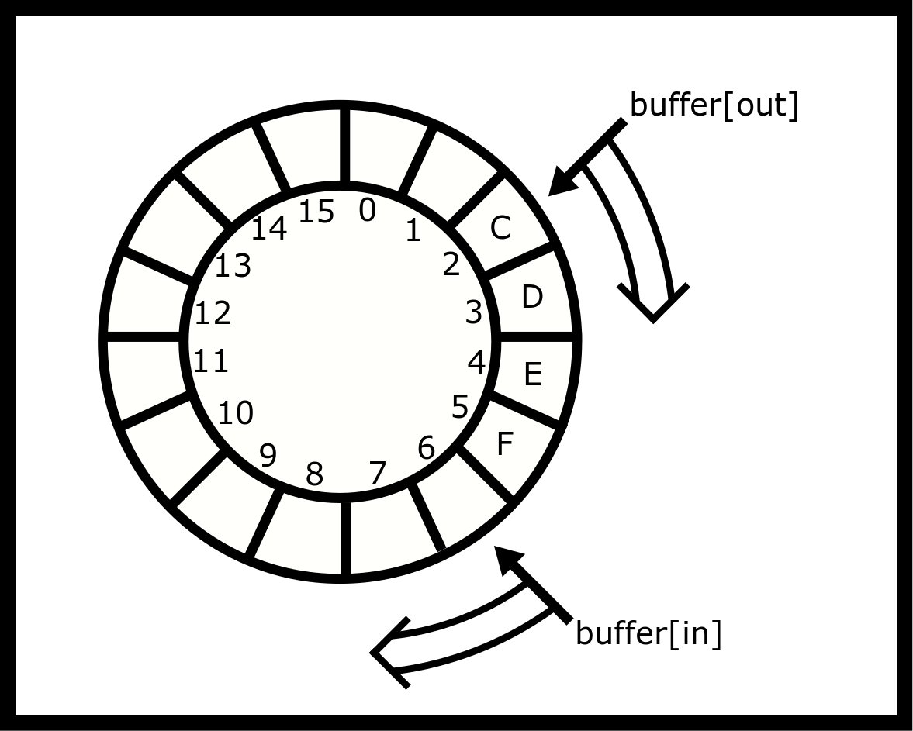

# 同步

同步协调各种任务，以确保它们都完成在正确的状态。在 C 语言中，我们有一系列机制来控制在给定状态下允许线程执行的操作。大多数时候，线程可以无需通信地进展，但每隔一段时间，两个或更多的线程可能想要访问临界区。临界区是程序要正确运行时一次只能由一个线程执行的代码段。如果两个线程（或进程）同时在临界区内部执行代码，程序可能不再具有正确的行为。

正如我们在上一章中提到的，竞态条件发生在操作同时触及内存的同一时间。如果内存位置只能由一个线程访问，例如下面的自动变量，那么就没有竞态条件的可能性，也没有与之相关的临界区。然而，该变量是一个全局变量，被两个线程访问。可能两个线程会同时尝试增加该变量。

```c
#include <stdio.h>
#include <pthread.h>

int sum = 0; //shared

void *countgold(void *param) {
 int i; //local to each thread
 for (i = 0; i < 10000000; i++) {
 sum += 1;
 }
 return NULL;
}

int main() {
 pthread_t tid1, tid2;
 pthread_create(&tid1, NULL, countgold, NULL);
 pthread_create(&tid2, NULL, countgold, NULL);

 //Wait for both threads to finish:
 pthread_join(tid1, NULL);
 pthread_join(tid2, NULL);

 printf("ARRRRG sum is %d\n", sum);
 return 0;
}
```

上述代码的典型输出是因为存在竞态条件。该代码允许两个线程同时读取和写入。例如，两个线程都将当前的总和值复制到运行每个线程的 CPU（让我们选择 123）。两个线程各自对其副本加一。两个线程都将值写回（124）。如果线程在不同的时间访问总和，计数将是 125。以下是一些可能的不同顺序。

允许的模式

良好的线程访问模式

| 线程 1 | 线程 2 |
| --- | --- |
| 加载地址，加 1（局部 i=1） | ... |
| 存储（全局 i=1） | ... |
| ... | 加载地址，加 1（局部 i=2） |
| ... | 存储（全局 i=2） |

部分重叠

恶劣的线程访问模式

| 线程 1 | 线程 2 |
| --- | --- |
| 加载地址，加 1（局部 i=1） | ... |
| 存储（全局 i=1） | 加载地址，加 1（局部 i=1） |
| ... | 存储（全局 i=1） |

完全重叠

可怕的线程访问模式

| 线程 1 | 线程 2 |
| --- | --- |
| 加载地址，加 1（局部 i=1） | 加载地址，加 1（局部 i=1） |
| 存储（全局 i=1） | 存储（全局 i=1） |

我们希望代码的第一个模式是互斥的。这引出了我们的第一个同步原语，互斥锁。

## 互斥锁

为了确保一次只有一个线程可以访问全局变量，请使用互斥锁（mutex）——即互斥的简称。如果当前有一个线程正在临界区内部，我们希望另一个线程等待直到第一个线程完成。在严格意义上，互斥锁不是一个原语，尽管它是具有有用线程 API 的最小原语之一。互斥锁也不是一个数据结构。它是一个抽象数据类型。

让我们考虑一个满足互斥锁 API 的鸭子。如果有人拥有鸭子，他们就可以访问共享资源！我们称之为互斥锁鸭子。其他人必须摇摇摆摆地等待。一旦有人放手鸭子，他们必须停止与资源的交互，下一个抓取者才能与共享资源交互。现在你知道了鸭子的起源。

实现互斥锁有许多方法，我们将在本章中给出几个。目前，让我们使用 pthread 库提供的黑盒。以下是声明互斥锁的方法。

```c
pthread_mutex_t m = PTHREAD_MUTEX_INITIALIZER;
pthread_mutex_lock(&m); // start of Critical Section
// Critical section
pthread_mutex_unlock(&m); //end of Critical Section
```

### 互斥锁生命周期

对于所有互斥锁，有两种初始化互斥锁的方法：

宏在功能上等同于更通用的。换句话说，将创建具有默认属性的互斥锁。在 init 版本中包括选项以在性能和额外的错误检查、高级共享等方面进行权衡。虽然我们建议在程序中使用 init 函数来创建位于堆上的互斥锁，但你可以使用任何一种方法。

```c
pthread_mutex_t *lock = malloc(sizeof(pthread_mutex_t));
pthread_mutex_init(lock, NULL);
//later
pthread_mutex_destroy(lock);
free(lock);
```

一旦我们完成对互斥锁的使用，我们也应该调用它。注意，程序只能销毁未锁定的互斥锁，在已锁定的互斥锁上销毁是未定义的行为。关于初始化和销毁互斥锁需要注意的事项：

1.  初始化已经初始化的互斥锁是未定义的行为

1.  销毁已锁定的互斥锁是未定义的行为

1.  保持一个模式，只有一个线程初始化互斥锁。

1.  将互斥锁的字节复制到新的内存位置然后使用它是不支持的。要引用互斥锁，程序*必须*有一个指向该内存地址的指针。

1.  全局/静态互斥锁不需要销毁。

### 互斥锁用法

如何使用互斥锁？这里有一个完整的示例，灵感来源于之前的代码片段。

```c
#include <stdio.h>
#include <pthread.h>

// Create a global mutex, this is ready to be locked!
pthread_mutex_t m = PTHREAD_MUTEX_INITIALIZER;

int sum = 0;

void *countgold(void *param) {
 int i;

 //Same thread that locks the mutex must unlock it
 //Critical section is 'sum += 1'
 //However locking and unlocking ten million times
 //has significant overhead

 pthread_mutex_lock(&m);

 // Other threads that call lock will have to wait until we call unlock

 for (i = 0; i < 10000000; i++) {
 sum += 1;
 }
 pthread_mutex_unlock(&m);
 return NULL;
}

int main() {
 pthread_t tid1, tid2;
 pthread_create(&tid1, NULL, countgold, NULL);
 pthread_create(&tid2, NULL, countgold, NULL);

 pthread_join(tid1, NULL);
 pthread_join(tid2, NULL);

 printf("ARRRRG sum is %d\n", sum);
 return 0;
}
```

在上面的代码中，线程在进入之前获取了计数屋的锁。关键部分只是这样，所以下面的版本也是正确的。

```c
for (i = 0; i < 10000000; i++) {
 pthread_mutex_lock(&m);
 sum += 1;
 pthread_mutex_unlock(&m);
}
return NULL;
}
```

这个过程运行得更慢，因为我们锁和解锁互斥锁一百万次，这是昂贵的——至少与增加变量相比。在这个简单的例子中，我们不需要线程——我们本可以加两次！一个更快的多线程示例是使用自动（局部）变量添加一百万，然后在计算循环完成后将结果添加到共享总和中：

```c
int local = 0;
for (i = 0; i < 10000000; i++) {
 local += 1;
}

pthread_mutex_lock(&m);
sum += local;
pthread_mutex_unlock(&m);

return NULL;
}
```

从一些常见问题开始。首先，C 互斥锁不会锁定变量。互斥锁是一个简单的数据结构。它与代码一起工作，而不是数据。如果一个互斥锁被锁定，其他线程将继续。只有在线程尝试锁定一个已经锁定的互斥锁时，线程才需要等待。一旦原始线程解锁互斥锁，第二个（等待的）线程将获得锁并能够继续。以下代码创建了一个实际上什么也不做的互斥锁。

```c
int a;
pthread_mutex_t m1 = PTHREAD_MUTEX_INITIALIZER,
m2 = = PTHREAD_MUTEX_INITIALIZER;
// later
// Thread 1
pthread_mutex_lock(&m1);
a++;
pthread_mutex_unlock(&m1);

// Thread 2
pthread_mutex_lock(&m2);
a++;
pthread_mutex_unlock(&m2);
```

这里有一些其他需要注意的问题，没有特定的顺序

1.  不要横穿水流！如果在程序中使用线程，不要在程序中间进行分叉。这意味着在初始化互斥锁之后任何时候。

1.  锁定互斥锁的线程是唯一可以解锁它的线程。

1.  每个程序可以有多个互斥锁。一个线程安全的可能设计包括每个数据结构一个锁，每个堆一个锁，或者每组数据结构一个锁。如果一个程序只有一个锁，那么可能存在对锁的显著竞争。如果两个线程正在更新两个不同的计数器，使用相同的锁并不是必要的。

1.  锁只是工具。它们不会发现临界区！

1.  调用和 . 总会有一些开销，然而，这是为了正确运行的程序所必须付出的代价！

1.  由于错误条件下的早期返回而没有解锁互斥锁

1.  资源泄露（没有调用 ）

1.  使用未初始化的互斥锁或使用已经被销毁的互斥锁

1.  在一个线程上两次锁定互斥锁而没有先解锁

1.  死锁

### 互斥锁实现

所以我们有一个很酷的数据结构。我们如何实现它？下面是一个简单且不正确的实现示例。该函数简单地解锁互斥锁并返回。锁定函数首先检查锁是否已经锁定。如果当前锁定，它将再次检查，直到另一个线程解锁互斥锁。目前，我们将避免其他线程能够解锁它们不拥有的锁的条件，并专注于互斥排他方面。

```c
// Version 1 (Incorrect!)

void lock(mutex_t *m) {
 while(m->locked) { /*Locked? Never-mind - loop and check again!*/ }

 m->locked = 1;
}

void unlock(mutex_t *m) {
 m->locked = 0;
}
```

第 1 版使用不必要的“忙等待”，浪费了 CPU 资源。然而，有一个更严重的问题。我们有一个竞争条件！如果两个线程同时调用，两个线程都可能读取为零。因此，两个线程都会认为它们对锁有独占访问权，并且两个线程将继续执行。

我们可能尝试通过在循环中调用来稍微减少 CPU 开销 - pthread_yield 建议操作系统该线程不会在短时间内使用 CPU，因此 CPU 可能会分配给等待运行的线程。这仍然留下了竞争条件。我们需要一个更好的实现。我们将在本章的临界区部分稍后讨论这个问题。现在，我们将讨论信号量。

### 高级：使用硬件实现互斥锁

我们可以使用 C11 原子操作来完美地做到这一点！一个完整的解决方案在这里详细说明。这是一个自旋锁互斥锁，[futex](https://locklessinc.com/articles/mutex_cv_futex/)的实现可以在网上找到。

首先是数据结构和初始化代码。

```c
typedef struct mutex_{
 // We need some variable to see if the lock is locked
 atomic_int_least8_t lock;
 // A mutex needs to keep track of its owner so
 // Another thread can't unlock it
 pthread_t owner;
} mutex;

#define UNLOCKED 0
#define LOCKED 1
#define UNASSIGNED_OWNER 0

int mutex_init(mutex* mtx){
 // Some simple error checking
 if(!mtx){
 return 0;
 }
 // Not thread-safe the user has to take care of this
 atomic_init(&mtx->lock, UNLOCKED);
 mtx->owner = UNASSIGNED_OWNER;
 return 1;
}
```

这是初始化代码，这里没有特别之处。我们将互斥锁的状态设置为未锁定，并将所有者设置为锁定。

```c
int mutex_lock(mutex* mtx){
 int_least8_t zero = UNLOCKED;
 while(!atomic_compare_exchange_weak_explicit
 (&mtx->lock,
 &zero,
 LOCKED,
 memory_order_seq_cst,
 memory_order_seq_cst)){
 zero = UNLOCKED;
 sched_yield(); // Use system calls for scheduling speed
 }
 // We have the lock now
 mtx->owner = pthread_self();
 return 1;
}
```

这段代码做了什么？它初始化了一个变量，我们将保持它作为未解锁状态。[原子比较和交换](https://en.wikipedia.org/wiki/Compare-and-swap)是大多数现代架构支持的指令（在 x86 上它是）。这个操作的伪代码看起来像这样

```c
int atomic_compare_exchange_pseudo(int* addr1, int* addr2, int val){
 if(*addr1 == *addr2){
 *addr1 = val;
 return 1;
 }else{
 *addr2 = *addr1;
 return 0;
 }
}
```

除了它都是通过原子操作完成的，这意味着在一个不可中断的操作中完成。那么“弱”部分是什么意思呢？原子指令容易发生**虚假失败**，这意味着这些原子函数有两种版本：强和弱部分，强部分保证成功或失败，而弱部分可能在操作成功时也会失败。这些就是你在下面的条件变量中会看到的虚假失败。我们使用弱部分是因为它更快，而且我们处于一个循环中！这意味着如果它稍微失败得更频繁一些，我们也可以接受，因为我们无论如何都会继续旋转。

在 while 循环内部，我们未能获取锁！我们将零重置为未锁定并稍作休眠。当我们醒来时，我们再次尝试获取锁。一旦我们成功交换，我们就进入了临界区！我们将互斥锁的所有者设置为当前线程以用于解锁方法，并成功返回。

这是如何保证互斥的呢？当与原子操作一起工作时，我们不确定！但在这个简单的例子中，我们可以，因为能够成功期望锁为未锁定（0）并将其交换为锁定（1）状态的线程被认为是获胜者。我们如何实现解锁？

```c
int mutex_unlock(mutex* mtx){
 if(unlikely(pthread_self() != mtx->owner)){
 return 0; // Can't unlock a mutex if the thread isn't the owner
 }
 int_least8_t one = 1;
 //Critical section ends after this atomic
 mtx->owner = UNASSIGNED_OWNER;
 if(!atomic_compare_exchange_strong_explicit(
 &mtx->lock,
 &one,
 UNLOCKED,
 memory_order_seq_cst,
 memory_order_seq_cst)){
 //The mutex was never locked in the first place
 return 0;
 }
 return 1;
}
```

为了满足 API，除非线程是拥有它的那个线程，否则线程不能解锁互斥锁。然后我们取消分配互斥锁的所有者，因为原子操作后临界区已经结束。我们希望有一个强交换，因为我们不希望阻塞。我们期望互斥锁被锁定，并将其交换以解锁。如果交换成功，我们已解锁互斥锁。如果交换不成功，这意味着互斥锁是**未锁定**的，我们试图将其从未锁定切换到未锁定，保留了解锁的行为。

这是什么内存顺序的问题？我们之前讨论了内存栅栏，这里就是！我们不会深入讨论，因为这超出了本课程的范围，但在[这篇文章](https://gcc.gnu.org/wiki/Atomic/GCCMM/AtomicSync)的范围内。我们需要一致性来确保没有加载或存储在之前或之后被排序。程序需要创建依赖链以实现更有效的排序。

### 信号量

信号量是另一种同步原语。它被初始化为某个值。线程可以增加或减少这个值。如果值达到零并且调用了等待操作，线程将被阻塞，直到调用了发布操作。

使用信号量与使用互斥锁一样简单。首先，决定初始值，例如数组中剩余空间的数量。与 pthread 互斥锁不同，创建信号量没有捷径 - 使用点号。

```c
#include <semaphore.h>

sem_t s;
int main() {
 sem_init(&s, 0, 10); // returns -1 (=FAILED) on OS X
 sem_wait(&s); // Could do this 10 times without blocking
 sem_post(&s); // Announce that we've finished (and one more resource item is available; increment count)
 sem_destroy(&s); // release resources of the semaphore
}
```

当使用信号量时，等待和发布操作可以从不同的线程中调用！与互斥锁不同，增加和减少操作可以来自不同的线程。

如果你想使用信号量来实现互斥锁，这会变得特别有用。互斥锁是一个信号量，它总是在它之前。一些教科书将互斥锁称为二进制信号量。你必须小心，不要将多于一个的互斥锁添加到信号量中，否则你的互斥锁抽象就会失效。这就是通常使用互斥锁来实现信号量，反之亦然的原因。

+   使用计数为 1 的值初始化信号量。

+   替换为

+   替换为

```c
sem_t s;
sem_init(&s, 0, 1);

sem_wait(&s);
// Critical Section
sem_post(&s);
```

但要小心，这并不相同！互斥锁可以很好地处理我们所说的锁反转问题。这意味着以下代码在传统互斥锁下会出错，但在线程中会产生竞态条件。

```c
// Thread 1
sem_wait(&s);
// Critical Section
sem_post(&s);

// Thread 2
// Some threads want to see the world burn
sem_post(&s);

// Thread 3
sem_wait(&s);
// Not thread-safe!
sem_post(&s);
```

如果我们用互斥锁来替换它，现在就不会起作用了。

```c
// Thread 1
mutex_lock(&s);
// Critical Section
mutex_unlock(&s);

// Thread 2
// Foiled!
mutex_unlock(&s);

// Thread 3
mutex_lock(&s);
// Now it's thread-safe
mutex_unlock(&s);
```

此外，二进制信号量与互斥锁不同，因为一个线程可以从另一个线程解锁互斥锁。

#### 信号安全

此外，并不是所有可以在信号处理程序内部正确使用的函数都可以。我们可以释放一个等待的线程，这样它现在就可以执行我们不允许在信号处理程序内部调用的所有调用，例如。以下是一些利用这一点的代码示例；

```c
#include <stdio.h>
#include <pthread.h>
#include <signal.h>
#include <semaphore.h>
#include <unistd.h>

sem_t s;

void handler(int signal) {
 sem_post(&s); /* Release the Kraken! */
}

void *singsong(void *param) {
 sem_wait(&s);
 printf("Waiting until a signal releases...\n");
}

int main() {
 int ok = sem_init(&s, 0, 0 /* Initial value of zero*/);
 if (ok == -1) {
 perror("Could not create unnamed semaphore");
 return 1;
 }
 signal(SIGINT, handler); // Too simple! See Signals chapter

 pthread_t tid;
 pthread_create(&tid, NULL, singsong, NULL);
 pthread_exit(NULL); /* Process will exit when there are no more threads */
}
```

信号量还有其他用途，比如跟踪数组中的空位。我们将在线程安全数据结构部分讨论这些内容。

## 条件变量

条件变量允许一组线程在唤醒之前睡眠。API 允许唤醒一个或所有线程。如果程序只唤醒一个线程，操作系统将决定唤醒哪个线程。线程不会直接通过 id 唤醒其他线程。相反，一个线程“信号”条件变量，然后它会唤醒一个（或所有）在条件变量内部睡眠的线程。

条件变量也和互斥锁以及循环一起使用，所以当唤醒时，它们必须在临界区检查一个条件。如果线程需要在临界区外被唤醒，POSIX 提供了其他方法来做这件事。在条件变量中睡眠的线程可以通过调用（唤醒所有）或（唤醒一个）来被唤醒。请注意，尽管函数名如此，这与 POSIX 标准无关！

有时，一个等待的线程可能会无缘无故地唤醒。这被称为*虚假唤醒*。如果你阅读了互斥锁的硬件实现部分，这类似于同名的原子失败。

为什么会出现虚假唤醒？为了性能。在多 CPU 系统中，可能存在竞态条件导致唤醒（信号）请求未被注意到。内核可能无法检测到丢失的唤醒调用，但可以检测到可能发生的情况。为了避免可能丢失的信号，线程被唤醒，以便程序代码可以再次测试条件。如果你想知道原因，请查看附录。

## 线程安全数据结构

自然地，我们希望我们的数据结构也是线程安全的！我们可以使用互斥锁和同步原语来实现这一点。首先是一些定义。原子性是指操作是线程安全的。我们通过提供锁前缀在硬件中提供原子指令。

```c
lock ...
```

但原子性也适用于更高阶的操作。我们说一个数据结构操作是原子的，如果它一次性发生并且成功或根本不发生。

因此，我们可以使用同步原语来使我们的数据结构线程安全。大部分情况下，我们将使用互斥锁，因为它们比二进制信号量具有更多的语义意义。注意，这是一个介绍。编写高性能的线程安全数据结构需要它自己的书籍！例如，以下是一个线程不安全的栈。

```c
// A simple fixed-sized stack (version 1)
#define STACK_SIZE 20
int count;
double values[STACK_SIZE];

void push(double v) {
 values[count++] = v;
}

double pop() {
 return values[--count];
}

int is_empty() {
 return count == 0;
}
```

栈的版本 1 是线程不安全的，因为如果有两个线程同时调用 push 或 pop，那么结果或栈可能不一致。例如，想象一下如果有两个线程同时调用 pop，那么两个线程可能会读取相同的值，都可能会读取原始的计数值。

要将此转换为线程安全的数据结构，我们需要确定代码的*关键部分*，这意味着我们需要询问哪些代码部分必须一次只有一个线程。在上面的例子中，，和函数访问相同的内存，以及栈的所有关键部分。当（和）执行时，数据结构处于不一致的状态，例如计数可能尚未写入，因此它可能仍然包含原始值。通过将这些方法包装在互斥锁中，我们可以确保一次只有一个线程可以更新（或读取）栈。下面显示了一个候选的“解决方案”。这是否正确？如果不正确，它将如何失败？

```c
// An attempt at a thread-safe stack (version 2)
#define STACK_SIZE 20
int count;
double values[STACK_SIZE];

pthread_mutex_t m1 = PTHREAD_MUTEX_INITIALIZER;
pthread_mutex_t m2 = PTHREAD_MUTEX_INITIALIZER;

void push(double v) {
 pthread_mutex_lock(&m1);
 values[count++] = v;
 pthread_mutex_unlock(&m1);
}

double pop() {
 pthread_mutex_lock(&m2);
 double v = values[--count];
 pthread_mutex_unlock(&m2);

 return v;
}

int is_empty() {
 pthread_mutex_lock(&m1);
 return count == 0;
 pthread_mutex_unlock(&m1);
}
```

版本 2 至少包含一个错误。花点时间看看你是否能找到错误（们）并分析其后果。

如果有三个线程同时调用，锁确保在 push 或 is_empty 时只有一次只有一个线程操作栈——两个线程将需要等待第一个线程完成。类似的论点也适用于对.的并发调用。然而，版本 2 并没有防止 push 和 pop 同时运行，因为它们使用了两个不同的互斥锁。在这种情况下，修复很简单——为 push 和 pop 函数使用相同的互斥锁。

代码有一个第二个错误。在比较之后返回，并且没有锁定互斥锁。然而，错误不会立即被发现。例如，假设一个线程调用，而第二个线程稍后调用。这个线程会神秘地停止。使用调试器，你可以发现线程在方法内部的 lock()方法上卡住了，因为之前的调用从未解锁锁。因此，一个线程的疏忽导致在任意其他线程中时间较晚出现的问题。让我们尝试纠正这些问题。

```c
// An attempt at a thread-safe stack (version 3)
int count;
double values[count];
pthread_mutex_t m = PTHREAD_MUTEX_INITIALIZER;

void push(double v) {
 pthread_mutex_lock(&m);
 values[count++] = v;
 pthread_mutex_unlock(&m);
}
double pop() {
 pthread_mutex_lock(&m);
 double v = values[--count];
 pthread_mutex_unlock(&m);
 return v;
}
int is_empty() {
 pthread_mutex_lock(&m);
 int result = count == 0;
 pthread_mutex_unlock(&m);
 return result;
}
```

版本 3 是线程安全的。我们已经确保了所有关键部分的互斥。有一些需要注意的事项。

+   是线程安全的，但它的结果可能已经过时。当线程得到结果时，栈可能已经不再为空！这通常是在线程安全的数据结构中，移除或弃用返回大小的函数的原因。

+   没有防止下溢（在空栈上弹出）或溢出（在已满栈上压入）的保护。

最后一点可以使用计数信号量来修复。该实现假设一个单独的栈。一个更通用版本可能包括互斥锁作为内存结构的一部分，并用于初始化互斥锁。例如，

```c
// Support for multiple stacks (each one has a mutex)
typedef struct stack {
 int count;
 pthread_mutex_t m;
 double *values;
} stack_t;

stack_t* stack_create(int capacity) {
 stack_t *result = malloc(sizeof(stack_t));
 result->count = 0;
 result->values = malloc(sizeof(double) * capacity);
 pthread_mutex_init(&result->m, NULL);
 return result;
}
void stack_destroy(stack_t *s) {
 free(s->values);
 pthread_mutex_destroy(&s->m);
 free(s);
}

// Warning no underflow or overflow checks!

void push(stack_t *s, double v) {
 pthread_mutex_lock(&s->m);
 s->values[(s->count)++] = v;
 pthread_mutex_unlock(&s->m);
}

double pop(stack_t *s) {
 pthread_mutex_lock(&s->m);
 double v = s->values[--(s->count)];
 pthread_mutex_unlock(&s->m);
 return v;
}

int is_empty(stack_t *s) {
 pthread_mutex_lock(&s->m);
 int result = s->count == 0;
 pthread_mutex_unlock(&s->m);
 return result;
}

int main() {
 stack_t *s1 = stack_create(10 /* Max capacity*/);
 stack_t *s2 = stack_create(10);
 push(s1, 3.141);
 push(s2, pop(s1));
 stack_destroy(s2);
 stack_destroy(s1);
}
```

在我们修复信号量的问题之前。我们该如何修复条件变量的问题？在查看上一节中的代码之前先试一试。如果我们的栈满了或空了，我们需要在压入和弹出时等待。尝试的解决方案：

```c
// Assume cv is a condition variable
// correctly initialized

void push(stack_t *s, double v) {
 pthread_mutex_lock(&s->m);
 if(s->count == 0) pthread_cond_wait(&s->cv, &s->m);
 s->values[(s->count)++] = v;
 pthread_mutex_unlock(&s->m);
}

double pop(stack_t *s) {
 pthread_mutex_lock(&s->m);
 if(s->count == 0) pthread_cond_wait(&s->cv, &s->m);
 double v = s->values[--(s->count)];
 pthread_mutex_unlock(&s->m);
 return v;
}
```

以下解决方案有效吗？在查看答案之前，先花点时间找出错误。

你都捕捉到它们了吗？

1.  第一个很简单。在压入时，我们的检查应该针对总容量，而不是零。

1.  我们只有 if 语句检查。wait()可能会意外唤醒

1.  我们从不通知任何线程！线程可能会无限期地等待。

让我们修复那些错误，这个解决方案有效吗？

```c
void push(stack_t *s, double v) {
 pthread_mutex_lock(&s->m);
 while(s->count == capacity) pthread_cond_wait(&s->cv, &s->m);
 s->values[(s->count)++] = v;
 pthread_mutex_unlock(&s->m);
 pthread_cond_signal(&s->cv);
}

double pop(stack_t *s) {
 pthread_mutex_lock(&s->m);
 while(s->count == 0) pthread_cond_wait(&s->cv, &s->m);
 double v = s->values[--(s->count)];
 pthread_cond_broadcast(&s->cv);
 pthread_mutex_unlock(&s->m);
 return v;
}
```

这个解决方案也不行！问题是出在信号上。你能看到为什么吗？你会怎么做来修复它？

现在，我们该如何使用计数信号量来防止溢出和下溢？我们将在下一节中讨论。

### 使用信号量

让我们使用计数信号量来跟踪剩余空间的数量，并使用另一个信号量来跟踪栈中的项目数量。我们将这两个信号量称为和。记住，如果信号量的计数被递减到零（由另一个线程调用 sem_post），则会等待。

```c
// Sketch #1

sem_t sitems;
sem_t sremain;
void stack_init(){
 sem_init(&sitems, 0, 0);
 sem_init(&sremain, 0, 10);
}

double pop() {
 // Wait until there's at least one item
 sem_wait(&sitems);
 ...

 void push(double v) {
 // Wait until there's at least one space
 sem_wait(&sremain);
 ...
 }
```

图#2 过早地实现了。另一个在压入时等待的线程可能会错误地尝试写入一个满栈。同样，在 pop()中等待的线程也被允许过早地继续。

```c
// Sketch #2 (Error!)
double pop() {
 // Wait until there's at least one item
 sem_wait(&sitems);
 sem_post(&sremain); // error! wakes up pushing() thread too early
 return values[--count];
}
void push(double v) {
 // Wait until there's at least one space
 sem_wait(&sremain);
 sem_post(&sitems); // error! wakes up a popping() thread too early
 values[count++] = v;
}
```

图 3 实现了正确的信号量逻辑，但你能否找到错误？

```c
// Sketch #3 (Error!)
double pop() {
 // Wait until there's at least one item
 sem_wait(&sitems);
 double v= values[--count];
 sem_post(&sremain);
 return v;
}

void push(double v) {
 // Wait until there's at least one space
 sem_wait(&sremain);
 values[count++] = v;
 sem_post(&sitems);
}
```

图 3 正确地使用信号量强制执行缓冲区满和空的条件。然而，没有*互斥*。两个线程可以同时处于*关键部分*，这会破坏数据结构或至少导致数据丢失。修复方法是围绕关键部分包裹一个互斥锁：

```c
// Simple single stack - see the above example on how to convert this into multiple stacks.
// Also a robust POSIX implementation would check for EINTR and error codes of sem_wait.

// PTHREAD_MUTEX_INITIALIZER for statics (use pthread_mutex_init() for stack/heap memory)
#define SPACES 10
pthread_mutex_t m= PTHREAD_MUTEX_INITIALIZER;
int count = 0;
double values[SPACES];
sem_t sitems, sremain;

void init() {
 sem_init(&sitems, 0, 0);
 sem_init(&sremains, 0, SPACES); // 10 spaces
}

double pop() {
 // Wait until there's at least one item
 sem_wait(&sitems);

 pthread_mutex_lock(&m); // CRITICAL SECTION
 double v= values[--count];
 pthread_mutex_unlock(&m);

 sem_post(&sremain); // Hey world, there's at least one space
 return v;
}

void push(double v) {
 // Wait until there's at least one space
 sem_wait(&sremain);

 pthread_mutex_lock(&m); // CRITICAL SECTION
 values[count++] = v;
 pthread_mutex_unlock(&m);

 sem_post(&sitems); // Hey world, there's at least one item
}
// Note a robust solution will need to check sem_wait's result for EINTR (more about this later)
```

当我们开始反转锁和等待命令时会发生什么？

```c
double pop() {
 pthread_mutex_lock(&m);
 sem_wait(&sitems);

 double v= values[--count];
 pthread_mutex_unlock(&m);

 sem_post(&sremain);
 return v;
}

void push(double v) {
 sem_wait(&sremain);

 pthread_mutex_lock(&m);
 values[count++] = v;
 pthread_mutex_unlock(&m);

 sem_post(&sitems);
}
```

我们不会直接给你答案，而是让你自己思考。这是否是一种允许的加锁和解锁方式？是否存在一系列可能导致竞态条件的操作？关于死锁呢？如果有，请提供。如果没有，请提供一个简短的证明，说明为什么不会发生。

## 关键部分的软件解决方案

如前所述，我们的代码中有一些部分只能由一个线程一次执行。我们将这个要求描述为“互斥”。只有一个线程（或进程）可以访问共享资源。在多线程程序中，我们可以用互斥锁和解锁调用封装临界区：

```c
pthread_mutex_lock() // one thread allowed at a time! (others will have to wait here)
// ... Do Critical Section stuff here!
pthread_mutex_unlock() // let other waiting threads continue
```

我们将如何实现这些锁和解锁调用？我们能否创建一个纯软件算法来确保互斥？这是我们之前尝试的方法。

```c
pthread_mutex_lock(p_mutex_t *m) {
 while(m->lock) ;
 m->lock = 1;
}
pthread_mutex_unlock(p_mutex_t *m) {
 m->lock = 0;
}
```

如我们之前提到的，即使考虑到线程可以解锁其他线程的锁，这个实现*也不满足互斥*。让我们仔细看看两个线程同时运行的“实现”。

为了简化讨论，我们只考虑两个线程。注意这些论点适用于线程和进程，经典的计算机科学文献用两个需要独占访问临界区或共享资源的进程来讨论这些问题。提升标志代表线程/进程进入临界区的意图。

我们希望解决方案具有三个主要期望的特性，以解决临界区问题。

1.  互斥。线程/进程获得独占访问权限。其他线程必须等待它退出临界区。

1.  有界等待。一个线程/进程不能被另一个线程无限期地取代。

1.  进展。如果没有线程/进程在临界区内，线程/进程应该能够继续进行，而无需等待。

在这些想法的指导下，让我们检查另一个候选解决方案，该方案仅在两个线程同时需要访问时才使用基于轮询的标志。

### 天真的解决方案

记住下面概述的伪代码是更大程序的一部分。线程或进程在进程生命周期内通常需要多次进入临界区。所以，想象每个例子都被包含在一个循环中，在这个循环中，线程或进程会在随机的时间内做其他工作。

下面描述的候选解决方案有什么问题吗？

```c
// Candidate #1
wait until your flag is lowered
raise my flag
// Do Critical Section stuff
lower my flag
```

答案：候选解决方案 #1 也存在竞态条件，因为两个线程/进程都可能读取对方的标志值已降低并继续。

这表明我们应该在检查其他线程的标志之前提升标志，如下面的候选解决方案 #2。

```c
// Candidate #2
raise my flag
wait until your flag is lowered
// Do Critical Section stuff
lower my flag
```

候选解决方案 #2 满足互斥。两个线程同时进入临界区是不可能的。然而，这段代码存在死锁！假设两个线程同时希望进入临界区。

候选解决方案 #2 分析

| 时间 | 线程 1 | 线程 2 |
| --- | --- | --- |
| 1 | 提升标志 |  |
| 2 |  | 提升标志 |
| 3 | 等待 | 等待 |

两个进程现在都在等待对方降低它们的标志。由于两者现在都永远卡住了，所以没有一个会进入临界区！这表明我们应该使用基于轮询的变量来尝试解决谁应该继续。

### 轮询解决方案

以下候选解决方案 #3 使用轮询变量礼貌地允许一个线程然后是另一个线程继续

```c
// Candidate #3
wait until my turn is myid
// Do Critical Section stuff
turn = yourid
```

候选人 #3 满足互斥性。每个线程或进程都可以独占访问关键部分。然而，两个线程/进程必须采取严格的轮询方式来使用关键部分。它们被迫进入交替的关键部分访问模式。如果线程 1 每毫秒都希望读取哈希表，而另一个线程每秒写入哈希表，那么读取线程将不得不再等待 999 毫秒才能再次从哈希表中读取。这个“解决方案”是无效的，因为我们的线程应该能够在没有其他线程当前在关键部分中的情况下进行进展并进入关键部分。

### 轮询和标志解决方案

以下是否是 CSP 的正确解决方案？

```c
\\ Candidate #4
raise my flag
if your flag is raised, wait until my turn
// Do Critical Section stuff
turn = yourid
lower my flag
```

分析这些解决方案很棘手。即使是关于这个特定主题的同行评审论文也包含错误的解决方案（Hyman 1966！）！乍一看，这似乎满足了互斥性、有限等待和进展。轮询标志仅在出现平局时使用，因此允许进展和有限等待，互斥性似乎得到了满足。也许你能找到一个反例？

候选人 #4 失败是因为一个线程没有等待另一个线程降低其标志。经过一些思考或灵感，可以创建以下场景来演示互斥性没有得到满足。

想象第一个线程运行此代码两次。此时轮询标志指向第二个线程。当第一个线程仍在关键部分内部时，第二个线程到达。第二个线程可以立即继续进入关键部分！

候选解决方案 #4

| 时间 | 轮询 | 线程 # 1 | 线程 # 2 |
| --- | --- | --- | --- |
| 1 | 2 | 提升我的标志 |  |
| 2 | 2 | 如果你的标志被提升，等待我的轮询 | 提升我的标志 |
| 3 | 2 | // 执行关键部分内容 | 如果你的标志被提升，等待我的轮询（TRUE！） |
| 4 | 2 | // 执行关键部分内容 | 执行关键部分内容 - 哎呀 |

## 工作解决方案

该问题的第一个解决方案是 Dekker 的解决方案。Dekker 算法（1962）是第一个可证明正确的解决方案。尽管如此，它是在一份未发表的论文中，所以直到后来才被发现（Dekker 和 Dijkstra 1965）（这是 1965 年发布的英文转录版本）。算法的一个版本如下。

```c
raise my flag
while (your flag is raised) :
   if it is your turn to win :
     lower my flag
     wait while your turn
     raise my flag
// Do Critical Section stuff
set your turn to win
lower my flag
```

注意，在关键部分中，无论循环迭代零次、一次还是多次，进程的标志总是被提升。此外，标志可以解释为立即进入关键部分的意图。只有当另一个进程也提升了标志时，一个进程才会推迟，降低其意图标志并等待。让我们检查一下条件。

1.  互斥。让我们尝试绘制一个简单的证明。循环不变量是在检查条件开始时，你的标志必须被提升——这是通过穷举实现的。由于线程离开循环的唯一方式是条件为假，因此标志必须在关键部分的全过程中被提升。由于循环阻止线程在另一个线程的标志提升时退出，并且在关键部分有一个线程提升了标志，因此另一个线程不能同时进入关键部分。

1.  有限等待。假设关键部分在有限时间内结束，一旦一个线程离开了关键部分，它就不能再获得关键部分。原因是转换变量被设置为另一个线程，这意味着那个线程现在有优先权。这意味着一个线程不能被另一个线程无限期地取代。

1.  进度。如果其他线程不在关键部分，它将简单地继续进行简单的检查。我们没有对系统调度器随机停止线程做出任何声明。这是一个理想化的场景，其中线程将不断执行指令。

### Peterson 的解决方案

Peterson 在 1981 年（Peterson 1981）发表了其新颖且简单的解决方案。下面展示了他算法的一个版本，该版本使用了一个共享变量。

```c
// Candidate #5
raise my flag
turn = other_thread_id
while (your flag is up and turn is other_thread_id)
    loop
// Do Critical Section stuff
lower my flag
```

这个解决方案满足互斥、有限等待和进度。如果线程#2 已经将转换设置为 2 并且目前处于关键部分。线程#1 到达，*将转换重新设置为 1*，然后等待线程 2 降低标志。

1.  互斥。让我们再次尝试绘制一个简单的证明。一个线程只有在转换变量是你的或者另一个线程的标志没有提升之前才能进入关键部分。如果另一个线程的标志没有提升，它不是试图进入关键部分。这是线程执行的第一步，也是线程撤销的最后一步。如果转换变量被设置为这个线程，这意味着另一个线程已经将控制权交给了这个线程。由于我的标志被提升并且转换变量被设置，另一个线程必须等待在循环中，直到当前线程完成。

1.  有限等待。在降低标志后，在 while 循环中等待的线程将离开，因为第一个条件被破坏。这意味着线程不能总是获胜。

1.  进度。如果没有其他线程竞争，其他线程的标志就不会被提升。这意味着一个线程可以越过 while 循环并执行关键部分的项目。

不幸的是，由于指令乱序，我们今天不能以同样的方式实现软件互斥锁。请查看附录以获取该问题的解决方案。

## 实现计数信号量

现在我们已经解决了临界区问题，可以合理地实现互斥锁。我们将如何实现其他同步原语？让我们从信号量开始。为了实现一个具有高效 CPU 使用的信号量，我们将说我们已经实现了一个条件变量。仅使用互斥锁实现 O(1)空间条件变量并不简单，或者至少 O(1)堆空间条件变量并不简单。我们不想在实现原语时调用 malloc，否则我们可能会死锁！

+   我们可以使用条件变量来实现计数信号量。

+   每个信号量都需要一个计数、一个条件变量和一个互斥锁。

    ```c
    typedef struct sem_t {
     ssize_t count;
     pthread_mutex_t m;
     pthread_condition_t cv;
    } sem_t;
    ```

实现初始化互斥锁和条件变量。

```c
int sem_init(sem_t *s, int pshared, int value) {
 if (pshared) {
 errno = ENOSYS /* 'Not implemented'*/;
 return -1;
 }

 s->count = value;
 pthread_mutex_init(&s->m, NULL);
 pthread_cond_init(&s->cv, NULL);
 return 0;
}
```

我们的实现需要在计数上增加。我们还将唤醒在条件变量内休眠的所有线程。注意，我们锁定和解锁互斥锁，以确保一次只有一个线程在临界区内部。

```c
void sem_post(sem_t *s) {
 pthread_mutex_lock(&s->m);
 s->count++;
 pthread_cond_signal(&s->cv);
 /* A woken thread must acquire the lock, so it will also have to wait until we call unlock*/

 pthread_mutex_unlock(&s->m);
}
```

我们的实现可能需要在信号量的计数为零时休眠。就像那样，我们使用锁来封装临界区，这样一次只有一个线程可以执行我们的代码。注意，如果线程需要等待，互斥锁将被解锁，允许另一个线程进入并唤醒我们。

还要注意，即使线程在从`sem_post`返回之前被唤醒，它也必须重新获取锁，因此它将不得不等待`sem_post`完成。

```c
void sem_wait(sem_t *s) {
 pthread_mutex_lock(&s->m);
 while (s->count == 0) {
 pthread_cond_wait(&s->cv, &s->m); /*unlock mutex, wait, relock mutex*/
 }
 s->count--;
 pthread_mutex_unlock(&s->m);
}
```

这就是一个计数信号量的完整实现。请注意，我们每次都会调用它。在实践中，这意味着即使没有等待的线程，也会进行不必要的调用。一个更高效的实现只会在有需要时调用，即。

```c
/* Did we increment from zero to one- time to signal a thread sleeping inside sem_post */
if (s->count == 1) /* Wake up one waiting thread!*/
pthread_cond_signal(&s->cv);
```

### 其他信号量考虑事项

+   生产的信号量实现可能包括一个队列以确保公平性和优先级。这意味着我们唤醒最高优先级和/或最长休眠的线程。

+   高级使用允许信号量在进程间共享。我们的实现仅适用于同一进程内的线程。我们可以通过设置条件变量和互斥锁属性来修复这个问题。

实现条件变量与互斥锁的复杂度较高，所以我们将其留在了附录中。

## 屏障

假设我们想要执行一个有两个阶段的并发计算，但我们不想在第一阶段完成之前进入第二阶段。我们可以使用一种称为**屏障**的同步方法。当一个线程到达屏障时，它将在屏障处等待，直到所有线程都到达屏障，然后他们一起继续前进。

想象一下，和朋友们一起去远足。你心里记着有多少个朋友，并约定在每座山的山顶等待彼此。比如说，你是第一个到达第一座山顶的人。你会在山顶等待你的朋友们。一个接一个，他们会到达山顶，但没有人会继续前进，直到你们小组的最后一个人到达。一旦他们到达，你们所有人就会继续前进。

Pthreads 有一个实现此功能的函数。您需要声明一个变量并将其初始化为。它接受将参与屏障的线程数量作为参数。以下是一个使用屏障的示例程序。

```c
#define _GNU_SOURCE
#include <stdio.h>
#include <stdlib.h>
#include <unistd.h>
#include <pthread.h>
#include <time.h>

#define THREAD_COUNT 4

pthread_barrier_t mybarrier;

void* threadFn(void *id_ptr) {
 int thread_id = *(int*)id_ptr;
 int wait_sec = 1 + rand() % 5;
 printf("thread %d: Wait for %d seconds.\n", thread_id, wait_sec);
 sleep(wait_sec);
 printf("thread %d: I'm ready...\n", thread_id);

 pthread_barrier_wait(&mybarrier);

 printf("thread %d: going!\n", thread_id);
 return NULL;
}

int main() {
 int i;
 pthread_t ids[THREAD_COUNT];
 int short_ids[THREAD_COUNT];

 srand(time(NULL));
 pthread_barrier_init(&mybarrier, NULL, THREAD_COUNT + 1);

 for (i=0; i < THREAD_COUNT; i++) {
 short_ids[i] = i;
 pthread_create(&ids[i], NULL, threadFn, &short_ids[i]);
 }

 printf("main() is ready.\n");

 pthread_barrier_wait(&mybarrier);

 printf("main() is going!\n");

 for (i=0; i < THREAD_COUNT; i++) {
 pthread_join(ids[i], NULL);
 }

 pthread_barrier_destroy(&mybarrier);

 return 0;
}
```

现在，让我们实现我们自己的屏障，并使用它来在大型计算中使所有线程保持同步。以下是我们的思考过程，

1.  线程进行第一次计算（使用并更改数据中的值）

1.  障碍！在继续之前，等待所有线程完成第一次计算

1.  线程进行第二次计算（使用并更改数据中的值）

线程函数有四个主要部分-

```c
// double data[256][8192]

void *calc(void *arg) {
 /* Do my part of the first calculation */
 /* Is this the last thread to finish? If so wake up all the other threads! */
 /* Otherwise wait until the other threads have finished part one */
 /* Do my part of the second calculation */
}
```

我们的主线程将创建 16 个线程，我们将每个计算分成 16 个单独的部分。每个线程将被分配一个唯一的值（0，1，2，..15），这样它就可以在自己的块上工作。由于(void*)类型可以容纳小的整数，我们将通过将其转换为 void 指针来传递的值。

```c
#define N (16)
double data[256][8192] ;
int main() {
 pthread_t ids[N];
 for(int i = 0; i < N; i++) {
 pthread_create(&ids[i], NULL, calc, (void *) i);
 }
 //...
}
```

注意，我们永远不会将此指针值作为实际内存位置解引用。

我们将直接将其转换回整数。

```c
void *calc(void *ptr) {
 // Thread 0 will work on rows 0..15, thread 1 on rows 16..31
 int x, y, start = N * (int) ptr;
 int end = start + N;
 for(x = start; x < end; x++) {
 for (y = 0; y < 8192; y++) {
 /* do calc #1 */
 }
 }
}
```

第一次计算完成后，我们需要等待较慢的线程，除非我们是最后一个线程！所以，跟踪到达我们障碍“检查点”的线程数量。

```c
// Global:
int remain = N;

// After calc #1 code:
remain--; // We finished
if (remain == 0) {/*I'm last!  -  Time for everyone to wake up! */ }
else {
 while (remain != 0) { /* spin spin spin*/ }
}
```

然而，代码有几个缺陷。一个是两个线程可能会尝试递减。另一个是循环是一个忙等待循环。我们可以做得更好！让我们使用一个条件变量，然后我们将使用广播/信号函数来唤醒睡眠的线程。

提醒一下，条件变量类似于一所房子！线程去那里睡觉（）。一个线程可以选择唤醒一个线程（）或所有线程（）。如果没有线程当前在等待，则这两个调用没有效果。

条件变量版本通常类似于忙等待错误的解决方案——正如我们将展示的。首先，让我们添加互斥锁和条件全局变量，并不要忘记在中初始化它们。

```c
//global variables
pthread_mutex_t m;
pthread_cond_t cv;

int main() {
 pthread_mutex_init(&m, NULL);
 pthread_cond_init(&cv, NULL);
```

我们将使用互斥锁来确保一次只有一个线程修改。最后一个到达的线程需要唤醒所有睡眠的线程——所以我们将使用 not

```c
pthread_mutex_lock(&m);
remain--;
if (remain == 0) {
 pthread_cond_broadcast(&cv);
}
else {
 while(remain != 0) {
 pthread_cond_wait(&cv, &m);
 }
}
pthread_mutex_unlock(&m);
```

当一个线程进入时，它释放互斥锁并睡眠。之后，线程将被唤醒。一旦我们将一个线程从睡眠中唤醒，在返回之前，它必须等待直到它可以锁定互斥锁。注意，即使一个睡眠的线程提前醒来，它也会检查 while 循环条件，并在必要时重新进入等待状态。

**上述屏障不可重用**。这意味着如果我们将其放入任何旧的计算循环中，代码有很大可能会遇到屏障要么死锁，要么线程比迭代快一步的情况。为什么会这样？因为有一个雄心勃勃的线程。

我们将假设有一个线程比所有其他线程都要快。使用屏障 API，这个线程应该正在等待，但它可能不是。为了使其具体化，让我们看看这段代码

```c
void barrier_wait(barrier *b) {
 pthread_mutex_lock(&b->m);
 // If it is 0 before decrement, we should be on
 // another iteration right?
 if (b->remain == 0) b->remain = NUM_THREADS;
 b->remain--;
 if (b->remain == 0) {
 pthread_cond_broadcast(&cv);
 }
 else {
 while(b->remain != 0) {
 pthread_cond_wait(&cv, &m);
 }
 }
 pthread_mutex_unlock(&b->m);
}

for (/* ... */) {
 // Some calc
 barrier_wait(b);
}
```

如果一个线程变得雄心勃勃会发生什么。嗯

1.  许多其他线程都在等待条件变量

1.  最后一个线程进行广播。

1.  一个单独的线程离开了 while 循环。

1.  这个单独的线程在其计算开始之前，其他任何线程甚至都没有醒来

1.  重置剩余线程的数量并返回睡眠状态。

所有其他本应醒来的线程都没有醒来，我们的实现陷入死锁。你将如何解决这个问题？提示：如果多个线程在循环中调用，则可以保证它们处于相同的迭代。

### 读者-写者问题

想象你有一个键值映射数据结构，它被许多线程使用。只要数据结构没有被写入，多个线程应该能够同时查找（读取）值。写者并不那么社交。为了避免数据损坏，一次只能有一个线程修改()数据结构，并且在此期间不允许任何读者读取。

这是一个*读者-写者问题*的例子。也就是说，我们如何有效地同步多个读者和写者，使得多个读者可以同时读取，但写者获得独占访问权限？

下面显示了不正确的尝试（“lock”是的缩写）：

### 尝试#1

```c
void read() {
 lock(&m)
 // do read stuff
 unlock(&m)
}

void write() {
 lock(&m)
 // do write stuff
 unlock(&m)
}
```

至少我们的第一次尝试没有数据损坏的问题。读者必须在写者写入时等待，反之亦然！然而，读者也必须等待其他读者。让我们尝试另一种实现。

### 尝试#2：

```c
void read() {
 while(writing) {/*spin*/}
 reading = 1
 // do read stuff
 reading = 0
}

void write() {
 while(reading || writing) {/*spin*/}
 writing = 1
 // do write stuff
 writing = 0
}
```

我们的第二次尝试存在竞态条件。想象一下，如果有两个线程同时调用或或同时调用 write，那么两个线程都能够继续执行！其次，我们可以有多个读者和多个写者，所以让我们跟踪读者或写者的总数，这把我们带到了尝试#3。

### 尝试#3

记住，执行*三个*动作。首先，它原子性地解锁互斥锁然后睡眠（直到被或唤醒）。第三，唤醒的线程在返回之前必须重新获取互斥锁。因此，只有一个线程实际上可以在由锁和解锁()方法定义的关键部分中运行。

以下第 3 种实现确保读者在有任何写者正在写入时进入。

```c
read() {
 lock(&m)
 while (writing)
 cond_wait(&cv, &m)
 reading++;

 /* Read here! */

 reading--
 cond_signal(&cv)
 unlock(&m)
}
```

然而，一次只有一个读者可以读取，因为候选方案#3 没有解锁互斥锁。一个更好的版本在读取之前解锁。

```c
read() {
 lock(&m);
 while (writing)
 cond_wait(&cv, &m)
 reading++;
 unlock(&m)

 /* Read here! */

 lock(&m)
 reading--
 cond_signal(&cv)
 unlock(&m)
}
```

这是否意味着写者和读可以同时读取和写入？不！首先，记住 cond_wait 需要在返回之前线程重新获取互斥锁。因此，一次只有一个线程可以在标记为**的关键部分中执行代码！

```c
read() {
 lock(&m);
 **  while (writing)
 **      cond_wait(&cv, &m)
 **  reading++;
 unlock(&m)
 /* Read here! */
 lock(&m)
 **  reading--
 **  cond_signal(&cv)
 unlock(&m)
}
```

写者必须等待所有人。互斥由锁保证。

```c
write() {
 lock(&m);
 **  while (reading || writing)
 **      cond_wait(&cv, &m);
 **  writing++;
 **
 ** /* Write here! */
 **  writing--;
 **  cond_signal(&cv);
 unlock(&m);
}
```

上面的候选方案#3 也使用。这只会唤醒一个线程。如果有许多读者正在等待写者完成，只有一名沉睡的读者会被唤醒。读者和写者应该使用，以便所有线程都应该醒来并检查它们的 while 循环条件。

### 饥饿的写者

上面的候选者#3 存在饥饿问题。如果读者不断到达，那么写者将永远无法进行（“reading”计数器永远不会减少到零）。这被称为*饥饿*，在重负载下会被发现。我们的解决方案是实现写者的有界等待。如果写者到达，他们仍然需要等待现有的读者，但是未来的读者必须被放置在“拘留所”并等待写者完成。这个“拘留所”可以通过使用变量和条件变量来实现，这样我们就可以在写者完成后唤醒线程。

计划是在写者到达时，在等待当前读者完成之前，通过增加计数器‘writer’来注册我们的写意。

```c
write() {
 lock()
 writer++

 while (reading || writing)
 cond_wait
 unlock()
 ...
}
```

当写者不为零时，不允许新来的读者继续。注意‘writer’表示有写者到达，而‘reading’和‘writing’计数器表示存在一个*活跃*的读者或写者。

```c
read() {
 lock()
 // readers that arrive *after* the writer arrived will have to wait here!
 while(writer)
 cond_wait(&cv,&m)

 // readers that arrive while there is an active writer
 // will also wait.
 while (writing)
 cond_wait(&cv,&m)
 reading++
 unlock
 ...
}
```

### 尝试#4

下面是我们对读者-写者问题的第一个工作解决方案。注意，如果你继续阅读关于“读者-写者问题”的内容，你会发现我们通过给予写者优先访问锁的方式解决了“第二个读者-写者问题”。这个解决方案不是最优的。然而，它满足了我们的原始问题，即 N 个活跃的读者，一个活跃的写者，并且在有持续的读者流时避免写者的饥饿。

你能识别出任何改进的地方吗？例如，你会如何改进代码，以便我们只唤醒读者或一个写者？

```c
int writers; // Number writer threads that want to enter the critical section (some or all of these may be blocked)
int writing; // Number of threads that are actually writing inside the C.S. (can only be zero or one)
int reading; // Number of threads that are actually reading inside the C.S.
// if writing !=0 then reading must be zero (and vice versa)

reader() {
 lock(&m)
 while (writers)
 cond_wait(&turn, &m)
 // No need to wait while(writing here) because we can only exit the above loop
 // when writing is zero
 reading++
 unlock(&m)

 // perform reading here

 lock(&m)
 reading--
 cond_broadcast(&turn)
 unlock(&m)
}

writer() {
 lock(&m)
 writers++
 while (reading || writing)
 cond_wait(&turn, &m)
 writing++
 unlock(&m)
 // perform writing here
 lock(&m)
 writing--
 writers--
 cond_broadcast(&turn)
 unlock(&m)
}
```

## 环形缓冲区

环形缓冲区是一种简单、通常固定大小的存储机制，其中连续的内存被当作环形处理，并且两个索引计数器跟踪队列的当前开始和结束位置。由于数组索引不是环形的，当索引计数器移动到数组末尾之后时，它们必须回绕到零。当数据被添加（入队）到队列的前端或从队列的尾部移除（出队）时，缓冲区中的当前项目形成一列火车，看起来像是在轨道上环形运行。



环形缓冲区可视化

下面是一个简单的（单线程）实现示例。注意，入队和出队方法没有防止下溢或上溢。当队列已满时，仍然可以添加项目，当队列为空时，仍然可以移除项目。如果我们向队列中添加 20 个整数（1，2，3，…，20）并且没有出队任何项目，那么值将会覆盖。我们现在不会修复这个问题，而是在创建多线程版本时，我们将确保在环形缓冲区满或空时，入队和出队线程被阻塞。

```c
void *buffer[16];
unsigned int in = 0, out = 0;

void enqueue(void *value) { /* Add one item to the front of the queue*/
 buffer[in] = value;
 in++; /* Advance the index for next time */
 if (in == 16) in = 0; /* Wrap around! */
}

void *dequeue() { /* Remove one item to the end of the queue.*/
 void *result = buffer[out];
 out++;
 if (out == 16) out = 0;
 return result;
}
```

### 环形缓冲区常见问题

很容易写出以下紧凑形式的入队或出队方法。

```c
// N is the capacity of the buffer
void enqueue(void *value)
b[ (in++) % N ] = value;
}
```

这种方法看起来似乎可以工作，但包含一个微小的错误。在超过四十亿次 enqueue 操作之后，int 值的将溢出并回绕到 0！因此，你可能会最终写入例如！

紧凑形式是正确的，如果 N 是 2 的幂，则使用位掩码。（16,32,64，…）

```c
b[ (in++) & (N-1) ] = value;
```

此缓冲区尚未防止覆盖。为此，我们将转向我们的多线程尝试，这将阻塞线程，直到有空间或至少有一个项目要删除。

### 多线程正确性

以下代码是一个不正确的实现。会发生什么？会阻塞吗？互斥性是否得到满足？缓冲区可以下溢吗？缓冲区可以溢出吗？为了清晰起见，我们将其简称为，并假设 sem_wait 不能被中断。

```c
#define N 16
void *b[N]
int in = 0, out = 0
p_m_t lock
sem_t s1,s2
void init() {
 p_m_init(&lock, NULL)
 sem_init(&s1, 0, 16)
 sem_init(&s2, 0, 0)
}

enqueue(void *value) {
 p_m_lock(&lock)

 // Hint: Wait while zero. Decrement and return
 sem_wait( &s1 )

 b[ (in++) & (N-1) ] = value

 // Hint: Increment. Will wake up a waiting thread
 sem_post(&s1)
 p_m_unlock(&lock)
}
void *dequeue(){
 p_m_lock(&lock)
 sem_wait(&s2)
 void *result = b[(out++) & (N-1) ]
 sem_post(&s2)
 p_m_unlock(&lock)
 return result
}
```

### 分析

在继续阅读之前，看看你能找到多少错误。然后确定如果线程调用 enqueue 和 dequeue 方法会发生什么。

+   enqueue 方法在同一个信号量（s1）上等待并发布，同样，enqueue 和（s2）也是如此，即我们递减值然后立即递增值，所以在函数结束时信号量值不变！

+   s1 的初始值为 16，因此信号量永远不会减少到零 - 如果环形缓冲区已满，enqueue 将不会阻塞，因此可能发生溢出。

+   s2 的初始值为零，因此对 dequeue 的调用将始终阻塞且永远不会返回！

+   互斥锁和 sem_wait 的顺序需要交换；然而，这个例子如此糟糕，以至于这个错误没有任何影响！

### 另一种分析

以下代码是一个不正确的实现。会发生什么？会阻塞吗？互斥性是否得到满足？缓冲区可以下溢吗？缓冲区可以溢出吗？为了清晰起见，我们将其简称为，并假设 sem_wait 不能被中断。

```c
void *b[16]
int in = 0, out = 0
p_m_t lock
sem_t s1, s2
void init() {
 sem_init(&s1,0,16)
 sem_init(&s2,0,0)
}

enqueue(void *value){
 sem_wait(&s2)
 p_m_lock(&lock)

 b[ (in++) & (N-1) ] = value

 p_m_unlock(&lock)
 sem_post(&s1)
}

void *dequeue(){
 sem_wait(&s1)
 p_m_lock(&lock)
 void *result = b[(out++) & (N-1)]
 p_m_unlock(&lock)
 sem_post(&s2)

 return result;
}
```

下面是一些我们希望您已经发现的几个问题。

+   s2 的初始值为 0。因此，enqueue 在第一次调用 sem_wait 时将阻塞，即使缓冲区为空！

+   s1 的初始值为 16。因此，dequeue 在第一次调用 sem_wait 时不会阻塞，即使缓冲区为空 - 下溢！dequeue 方法将返回无效数据。

+   代码不满足互斥性。两个线程可以同时修改或！代码似乎使用了互斥锁。不幸的是，锁从未用或初始化，因此锁可能不起作用（可能只是什么也不做）

### 环形缓冲区的正确实现

由于互斥锁存储在全局（静态）内存中，因此可以使用 . 初始化。如果我们已在堆上为互斥锁分配了空间，那么我们将使用

```c
#include <pthread.h>
#include <semaphore.h>
// N must be 2^i
#define N (16)

void *b[N]
int in = 0, out = 0
p_m_t lock = PTHREAD_MUTEX_INITIALIZER
sem_t countsem, spacesem

void init() {
 sem_init(&countsem, 0, 0)
 sem_init(&spacesem, 0, 16)
}
```

enqueue 方法如下所示。请确保注意。

1.  锁仅在临界区（对数据结构的访问）期间保持。

1.  一个完整的实现需要防止由于 POSIX 信号而导致的从 early returns 的早期返回。

```c
enqueue(void *value){
 // wait if there is no space left:
 sem_wait( &spacesem )

 p_m_lock(&lock)
 b[ (in++) & (N-1) ] = value
 p_m_unlock(&lock)

 // increment the count of the number of items
 sem_post(&countsem)
}
```

实现如下所示。注意对 . 的同步调用的对称性。在两种情况下，函数首先等待空间计数或项目计数为零。

```c
void *dequeue(){
 // Wait if there are no items in the buffer
 sem_wait(&countsem)

 p_m_lock(&lock)
 void *result = b[(out++) & (N-1)]
 p_m_unlock(&lock)

 // Increment the count of the number of spaces
 sem_post(&spacesem)

 return result
}
```

思考食物：

+   如果`and`调用顺序被交换会发生什么？

+   如果`and`调用顺序被交换会发生什么？

## 额外：进程同步

你以为你在使用不同的进程，所以不需要同步？再想想！你可能在一个进程内没有竞态条件，但如果你需要与周围的系统交互呢？让我们考虑一个激励性的例子

```c
void write_string(const char *data) {
 int fd = open("my_file.txt", O_WRONLY);
 write(fd, data, strlen(data));
 close(fd);
}

int main() {
 if(!fork()) {
 write_string("key1: value1");
 wait(NULL);
 } else {
 write_string("key2: value2");
 }
 return 0;
}
```

如果没有系统调用失败，那么我们应该得到类似这样的结果，因为文件一开始是空的。

```c
key1: value1
key2: value2
```

```c
key2: value2
key1: value1
```

### 中断

但是，有一个隐藏的细微差别。大多数系统调用可以被中断，这意味着操作系统可以停止一个正在进行的系统调用，因为它需要停止进程。所以，除了和之外，它们通常都会完成——如果写入失败并且没有写入字节，我们可能会得到类似或的结果。这是数据丢失，这是不正确的，但不会损坏文件。如果写入在部分写入后中断会发生什么？我们会得到各种各样的混乱。例如，

```c
key2: key1: value1
```

### 解决方案

一个程序可以在`fork`之前创建一个互斥锁——然而子进程和父进程不会共享虚拟内存，每个进程都将有一个独立的互斥锁。高级提示：使用共享内存的高级选项允许子进程和父进程在以正确选项创建并使用共享内存段的情况下共享一个互斥锁。参见[stackoverflow 示例](http://stackoverflow.com/questions/19172541/procs-fork-and-mutexes)

那我们应该怎么做？我们应该使用共享互斥锁！考虑以下代码。

```c
pthread_mutex_t * mutex = NULL;
pthread_mutexattr_t attr;

void write_string(const char *data) {
 pthread_mutex_lock(mutex);
 int fd = open("my_file.txt", O_WRONLY);
 int bytes_to_write = strlen(data), written = 0;
 while(written < bytes_to_write) {
 written += write(fd, data + written, bytes_to_write - written);
 }
 close(fd);
 pthread_mutex_unlock(mutex);
}

int main() {
 pthread_mutexattr_init(&attr);
 pthread_mutexattr_setpshared(&attr, PTHREAD_PROCESS_SHARED);
 pmutex = mmap (NULL, sizeof(pthread_mutex_t),
 PROT_READ|PROT_WRITE, MAP_SHARED|MAP_ANON, -1, 0);
 pthread_mutex_init(pmutex, &attrmutex);
 if(!fork()) {
 write_string("key1: value1");
 wait(NULL);
 pthread_mutex_destroy(pmutex);
 pthread_mutexattr_destroy(&attrmutex);
 munmap((void *)pmutex, sizeof(*pmutex));
 } else {
 write_string("key2: value2");
 }
 return 0;
}
```

代码在`main`函数中做的事情是使用一块内存初始化一个进程共享互斥锁。你将在稍后了解到这个调用做了什么——暂时假设它创建的是进程间共享的内存。我们可以在那块特殊的内存中初始化一个互斥锁，并像正常使用一样。为了防止失败，我们将调用放在一个 while 循环中，只要还有字节要写就持续写入。现在如果所有其他系统调用都正常工作，应该会有更多的竞态条件。

大多数程序试图完全避免这个问题，通过写入不同的文件，但了解跨进程的互斥锁是好的，它们是有用的。程序可以使用之前提到的所有原语！屏障、信号量和条件变量都可以在共享内存块上初始化，并以类似的方式用于它们的线程对应物。

+   你不必担心任意内存地址成为竞态条件的候选者。只有那些特别映射的区域才处于危险之中。

+   你可以得到进程的隔离性，如果一个进程失败，系统可以保持完整。

+   当你有大量线程时，创建一个进程可能会减轻系统负载

还有其他同步方式，查看附录中的 goroutines 或更高阶的同步。

## 外部资源

手册页的指导问题

+   递归互斥锁与默认互斥锁有何不同？

+   互斥锁的 trylock 与 mutex lock 有何不同？

+   为什么互斥锁锁定会失败？请给出一个例子。

+   如果一个线程尝试销毁一个已锁定的互斥锁会发生什么？

+   线程能否复制互斥锁的底层字节而不是使用指针？

+   信号量的生命周期是什么？

+   [pthread_mutex_lock 手册页](http://linux.die.net/man/3/pthread_mutex_lock)

+   [pthread_mutex_init 手册页](http://linux.die.net/man/3/pthread_mutex_init)

+   [sem_init](http://man7.org/linux/man-pages/man3/sem_init.3.html)

+   [sem_wait](http://man7.org/linux/man-pages/man3/sem_wait.3.html)

+   [sem_post](http://man7.org/linux/man-pages/man3/sem_post.3.html)

+   [sem_destroy](http://man7.org/linux/man-pages/man3/sem_destroy.3.html)

## 主题

+   原子操作

+   临界区

+   生产者消费者问题

+   使用条件变量

+   使用计数信号量

+   实现屏障

+   实现环形缓冲区

+   使用 pthread_mutex

+   实现生产者消费者

+   分析多线程代码

## 问题

+   什么是原子操作？

+   为什么以下代码在并行代码中不会工作？

    ```c
    //In the global section
    size_t a;
    //In pthread function
    for(int i = 0; i < 100000000; i++) a++;
    ```

    这会怎样？

    ```c
    //In the global section
    atomic_size_t a;
    //In pthread function
    for(int i = 0; i < 100000000; i++) atomic_fetch_add(a, 1);
    ```

+   原子操作有哪些缺点？保持局部变量和许多原子操作哪个更快？

+   什么是临界区？

+   一旦你确定了临界区，确保一次只有一个线程在该区域的一种方法是什么？

+   在这里识别临界区

    ```c
    struct linked_list;
    struct node;
    void add_linked_list(linked_list *ll, void* elem){
     node* packaged = new_node(elem);
     if(ll->head){
     ll->head =
     }else{
     packaged->next = ll->head;
     ll->head = packaged;
     ll->size++;
     }
    }

    void* pop_elem(linked_list *ll, size_t index){
     if(index >= ll->size) return NULL;

     node *i, *prev;
     for(i = ll->head; i && index; i = i->next, index--){
     prev = i;
     }

     //i points to the element we need to pop, prev before
     if(prev->next) prev->next = prev->next->next;
     ll->size--;
     void* elem = i->elem;
     destroy_node(i);
     return elem;
    }
    ```

+   你能将临界区做得有多紧密？

+   什么是生产者消费者问题？上述内容中的生产者消费者问题如何使用在上述部分？生产者消费者问题与读者写者问题有何关联？

+   什么是条件变量？为什么使用它比使用循环有优势？

+   为什么这段代码是危险的？

    ```c
    if(not_ready){
     pthread_cond_wait(&cv, &mtx);
    }
    ```

+   什么是计数信号量？请给我一个类似饼干罐/披萨盒/有限食品的类比。

+   什么是线程屏障？

+   使用计数信号量实现屏障。

+   编写一个生产者/消费者队列，生产者消费者栈如何？

+   请给出一个使用条件变量的读者-写者锁的实现，创建一个包含所需内容的结构体，它需要能够支持以下函数

    ```c
    typedef struct {

    } rw_lock_t;

    void reader_lock(rw_lock_t* lck) {

    }

    void writer_lock(rw_lock_t* lck) {

    }

    void reader_unlock(rw_lock_t* lck) {

    }

    void writer_unlock(rw_lock_t* lck) {

    }
    ```

    唯一的规范是在两个逗号之间和之间，没有写者可以写入。在写者锁定之间，一次只能有一个写者写入。

+   编写代码以实现一个仅使用三个计数信号量的生产者消费者模型。假设可能有多个线程调用入队和出队操作。确定每个信号量的初始值。

+   编写代码以使用条件变量和互斥锁实现生产者消费者模型。假设可能有多个线程调用入队和出队操作。

+   使用 CVs 实现添加（unsigned int）和减去（unsigned int）阻塞函数，这些函数永远不会允许全局值大于 100。

+   使用 CVs 为 15 个线程实现一个屏障。

+   以下代码做了什么？

    ```c
    void main() {
     pthread_mutex_t mutex;
     pthread_cond_t cond;

     pthread_mutex_init(&mutex, NULL);
     pthread_cond_init(&cond, NULL);

     pthread_cond_broadcast(&cond);
     pthread_cond_wait(&cond,&mutex);

     return 0;
    }
    ```

+   以下代码是否正确？如果不正确，你能修复它吗？

    ```c
    extern int money;
    void deposit(int amount) {
     pthread_mutex_lock(&m);
     money += amount;
     pthread_mutex_unlock(&m);
    }

    void withdraw(int amount) {
     if (money < amount) {
     pthread_cond_wait(&cv);
     }

     pthread_mutex_lock(&m);
     money -= amount;
     pthread_mutex_unlock(&m);
    }
    ```

+   绘制如何使用二进制信号量作为互斥锁的示例。记住，除了互斥之外，互斥锁只能由调用它的线程解锁。

    ```c
    sem_t sem;

    void lock() {

    }

    void unlock() {

    }
    ```

+   以下哪些陈述是正确的？

    +   可以有多个活跃的读者

    +   可以有多个活跃的作者

    +   当有活跃的作者时，活跃的读者数量必须为零

    +   如果有活跃的读者，活跃的作者数量必须为零

    +   作者必须等待当前活跃的读者完成
