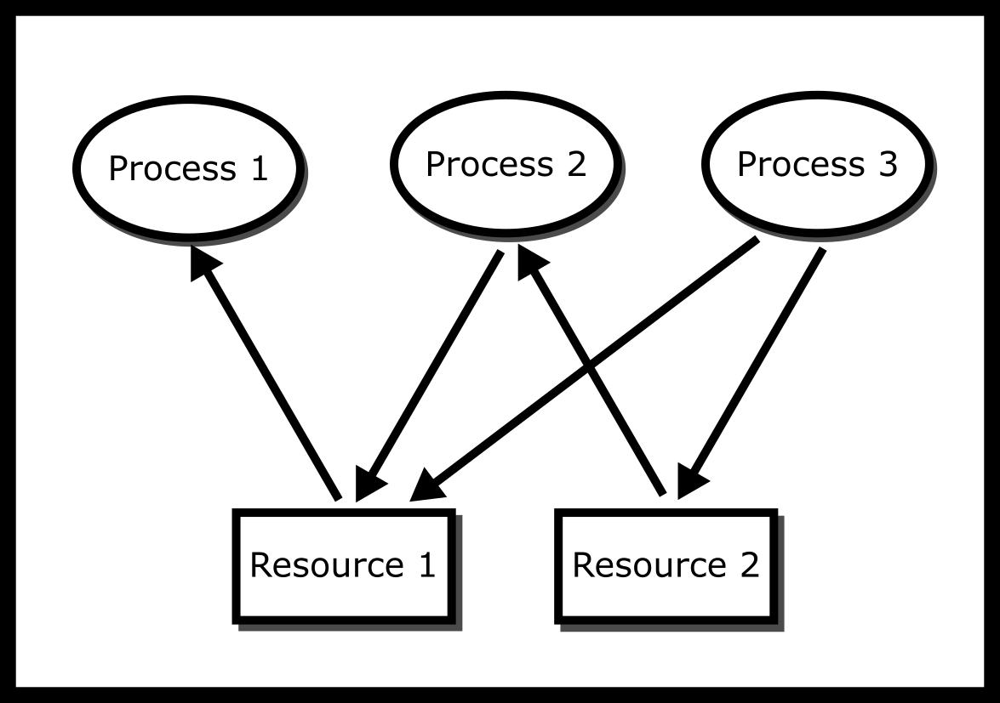
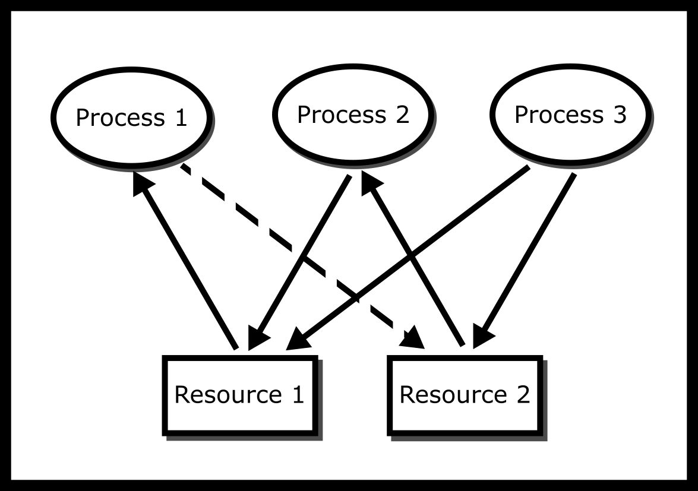
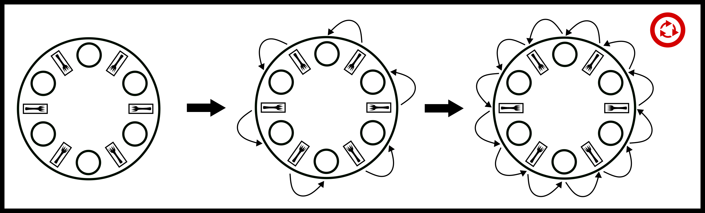
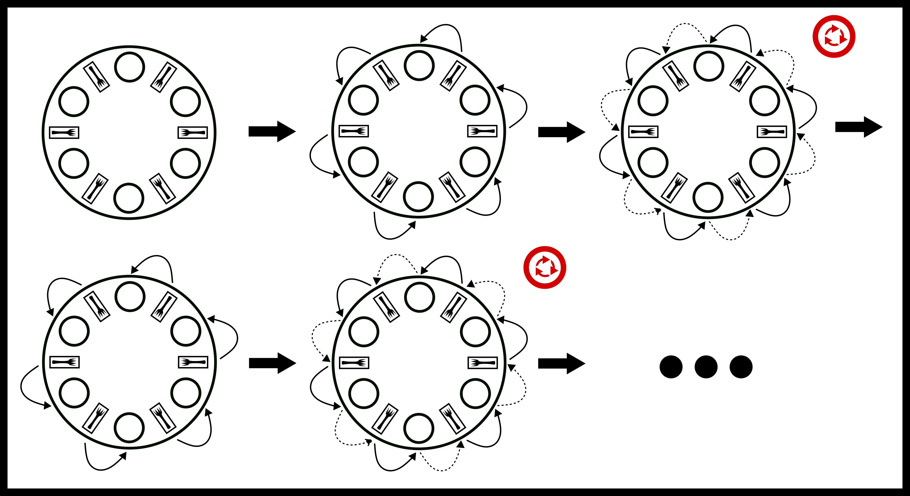
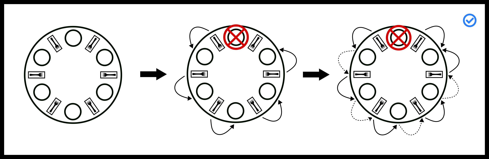
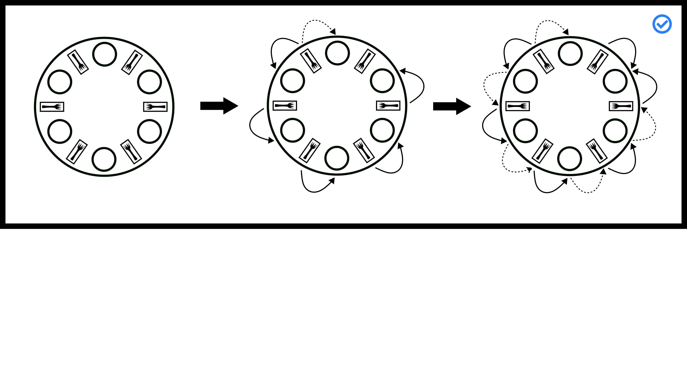

# 死锁

死锁被定义为系统无法向前进展的情况。在本章的其余部分，我们将系统定义为一系列规则，这些规则允许一组进程从一个状态移动到另一个状态，其中状态要么是正在工作，要么是在等待特定的资源。向前进展被定义为至少有一个进程正在工作，或者我们可以授予一个等待特定资源的进程该资源。在许多系统中，通过忽略整个概念来避免死锁（Silberschatz, Galvin, 和 Gagne 2006，第 237 页）。你听说过“打开再关闭”吗？对于风险较低的产物（用户操作系统、手机），允许死锁可能更有效率。但在“失败不是选项”的情况下——阿波罗 13 号，你需要一个能够跟踪、打破或预防死锁的系统。阿波罗 13 号不是因为死锁而失败，但在起飞时重启系统并不是一个好的选择。

关键任务操作系统需要正式保证，因为拿人们的生命打赌不是一个好主意。那么我们如何做到这一点呢？我们建模这个问题。尽管有一个常见的统计术语说所有模型都是错误的，但模型越接近系统，方法成功的可能性就越高。

## 资源分配图



资源分配图

有一种方法是通过资源分配图（RAG）来模拟系统。资源分配图跟踪哪个进程持有哪个资源，以及哪个进程正在等待特定类型的资源。这是一个简单而强大的工具，可以说明交互进程如何导致死锁。如果一个进程正在*使用*资源，则从资源节点到进程节点画一条箭头。如果一个进程正在*请求*资源，则从进程节点到资源节点画一条箭头。如果在资源分配图中存在一个循环，并且循环中的每个资源只提供一个实例，那么进程将会死锁。例如，如果进程 1 持有资源 A，进程 2 持有资源 B，进程 1 正在等待 B，而进程 2 正在等待 A，那么进程 1 和进程 2 将会死锁 8.1。我们将定义系统处于死锁状态，如果所有工作进程都不能执行除了等待之外的操作。我们可以通过遍历图并使用图遍历算法（如深度优先搜索 DFS）来寻找循环来检测死锁。这个图被视为有向图，我们可以将进程和资源都视为节点。

```c
 typedef struct {
 int node_id; // Node in this particular graph
 Graph **reachable_nodes; // List of nodes that can be reached from this node
 int size_reachable_nodes; // Size of the List
 } Graph;

 // isCyclic() traverses a graph using DFS and detects whether it has a cycle
 // isCyclic() uses a recursive approach
 // G points to a node in a graph, which can be either a resource or a process
 // is_visited is an array indexed with node_id and initialized with zeros (false) to record whether a particular node has been visited
 int isCyclic(Graph *G, int* is_visited) {
 if (this graph has been visited) {
 // Oh! the cycle is found
 return true;
 } else {
 1. Mark this node as visited
 2. Traverse through all nodes in the reachable_nodes
 3. Call isCyclic() for each node
 4. Evaluate the return value of isCyclic()
 }
 // Nope, this graph is acyclic
 return false;
 }
```



基于图的死锁

## 科夫曼条件

当然，在操作系统（OS）中，资源分配图（RAG）中的循环总是会发生，那么为什么系统不会停止呢？你可能看不到死锁，因为操作系统可能会**抢占**一些进程来打破循环，但你的三个孤独进程仍然有可能死锁。

死锁有四个**必要**且**充分**的条件——这意味着如果这些条件成立，那么在任意迭代中系统发生死锁的概率非零。这些被称为科夫曼条件（Coffman, Elphick, 和 Shoshani 1971）。

+   互斥：没有两个进程可以同时获得资源。

+   循环等待：资源分配图中存在一个循环，或者存在一个进程集合 {P1, P2,…}，其中 P1 正在等待 P2 持有的资源，而 P2 正在等待 P3,…，P3 正在等待 P1。

+   持有并等待：一旦获得资源，进程就会保持资源锁定。

+   无优先权：没有任何东西可以迫使进程放弃资源。

##### 证明：

死锁只有在四个科夫曼条件都满足的情况下才会发生。

<semantics><mo>→</mo><annotation encoding="application/x-tex">\rightarrow</annotation></semantics> 如果系统死锁，四个科夫曼条件就会明显出现。

+   为了进行矛盾证明，假设不存在循环等待。如果不成立，那么意味着资源分配图是无环的，这意味着至少有一个进程没有等待任何资源被释放。由于系统可以继续运行，系统不是死锁的。

+   为了进行矛盾证明，假设不存在互斥。如果不成立，那么意味着没有进程等待其他进程的资源。这打破了循环等待，之前的论证证明了正确性。

+   为了进行矛盾证明，假设进程不持有并等待，但我们的系统仍然死锁。由于我们根据第一个条件存在循环等待，至少有一个进程必须等待另一个进程。如果那样，并且进程不持有并等待，那么意味着一个进程必须释放一个资源。由于系统已经向前推进，它不可能死锁。

+   为了进行矛盾证明，假设我们存在优先权，但系统无法解除死锁。有一个进程，或者创建一个进程，能够识别出从上面必须明显可见的循环等待，并断开其中一个链接。根据第一个分支，我们不应该有死锁。

<semantics><mo>←</mo><annotation encoding="application/x-tex">\leftarrow</annotation></semantics> 如果四个条件都明显存在，则系统处于死锁状态。我们将证明如果系统没有死锁，那么四个条件就不会明显存在。尽管这个证明不是正式的，但让我们构建一个不包含循环等待的三个要求系统。假设存在一个进程集合 <semantics><mrow><mi>P</mi><mo>=</mo><mo stretchy="false" form="prefix">{</mo><msub><mi>p</mi><mn>1</mn></msub><mo>,</mo><msub><mi>p</mi><mn>2</mn></msub><mo>,</mo><mi>.</mi><mi>.</mi><mi>.</mi><mo>,</mo><msub><mi>p</mi><mi>n</mi></msub><mo stretchy="false" form="postfix">}</mo></mrow><annotation encoding="application/x-tex">P = \{p_1, p_2, ..., p_n\}</annotation></semantics> 和一个资源集合 <semantics><mrow><mi>R</mi><mo>=</mo><mo stretchy="false" form="prefix">{</mo><msub><mi>r</mi><mn>1</mn></msub><mo>,</mo><msub><mi>r</mi><mn>2</mn></msub><mo>,</mo><mi>.</mi><mi>.</mi><mi>.</mi><mo>,</mo><msub><mi>r</mi><mi>m</mi></msub><mo stretchy="false" form="postfix">}</mo></mrow><annotation encoding="application/x-tex">R = \{r_1, r_2, ..., r_m\}</annotation></semantics>。为了简化，一个进程一次只能请求一个资源，但证明可以推广到多个资源。假设系统在时间 <semantics><mi>t</mi><annotation encoding="application/x-tex">t</annotation></semantics> 的状态。假设系统的状态是一个元组 <semantics><mrow><mo stretchy="false" form="prefix">(</mo><msub><mi>h</mi><mi>t</mi></msub><mo>,</mo><msub><mi>w</mi><mi>t</mi></msub><mo stretchy="false" form="postfix">)</mo></mrow><annotation encoding="application/x-tex">(h_t, w_t)</annotation></semantics>，其中有两个函数 <semantics><mrow><msub><mi>h</mi><mi>t</mi></msub><mo>:</mo><mi>R</mi><mo>→</mo><mi>P</mi><mo>∪</mo><mo stretchy="false" form="prefix">{</mo><mtext mathvariant="normal">unassigned</mtext><mo stretchy="false" form="postfix">}</mo></mrow><annotation encoding="application/x-tex">h_t: R \rightarrow P \cup \{\text{unassigned}\}</annotation></semantics>，它将资源映射到拥有它们的进程（这是一个函数，意味着我们有互斥性）或者未分配的，以及 <semantics><mrow><msub><mi>w</mi><mi>t</mi></msub><mo>:</mo><mi>P</mi><mo>→</mo><mi>R</mi><mo>∪</mo><mo stretchy="false" form="prefix">{</mo><mtext mathvariant="normal">satisfied</mtext><mo stretchy="false" form="postfix">}</mo></mrow><annotation encoding="application/x-tex">w_t: P \rightarrow R \cup \{\text{satisfied}\}</annotation></semantics>，它将每个进程对资源的请求映射到资源或者进程是否满意。如果进程满意，我们考虑工作很平凡，进程退出，释放所有资源——这也可以推广。设 <semantics><mrow><msub><mi>L</mi><mi>t</mi></msub><mo>⊆</mo><mi>P</mi><mo>×</mo><mi>R</mi></mrow><annotation encoding="application/x-tex">L_t \subseteq P \times R</annotation></semantics> 为一个进程在任意给定时间释放资源的请求列表集合。系统的演变在每个时间步长都在进行。

+   释放 <semantics><msub><mi>L</mi><mi>t</mi></msub><annotation encoding="application/x-tex">L_t</annotation></semantics> 中的所有资源。

+   找到一个请求资源的进程

+   如果该资源可用，就将其分配给该进程，生成一个新的 <semantics><mrow><mo stretchy="false" form="prefix">(</mo><msub><mi>h</mi><mrow><mi>t</mi><mo>+</mo><mn>1</mn></mrow></msub><mo>,</mo><msub><mi>w</mi><mrow><mi>t</mi><mo>+</mo><mn>1</mn></mrow></msub><mo stretchy="false" form="postfix">)</mo></mrow><annotation encoding="application/x-tex">(h_{t+1}, w_{t+1})</annotation></semantics> 并退出当前迭代。

+   否则，找到另一个进程并尝试在上一步骤中进行相同的资源分配过程。

如果已经调查了所有进程，并且所有进程都在请求资源且没有任何资源可以分配，则认为系统已死锁。更正式地说，这个系统死锁意味着如果 <semantics><mrow><mo>∃</mo><msub><mi>t</mi><mn>0</mn></msub><mo>,</mo><mo>∀</mo><mi>t</mi><mo>≥</mo><msub><mi>t</mi><mn>0</mn></msub><mo>,</mo><mo>∀</mo><mi>p</mi><mo>∈</mo><mi>P</mi><mo>,</mo><msub><mi>w</mi><mi>t</mi></msub><mo stretchy="false" form="prefix">(</mo><mi>p</mi><mo stretchy="false" form="postfix">)</mo><mo>≠</mo><mtext mathvariant="normal">satisfied</mtext> <mrow><mtext mathvariant="normal">and</mtext></mrow> <mo>∃</mo><mi>q</mi><mo>,</mo><mi>q</mi><mo>≠</mo><mi>p</mi><mo>→</mo><msub><mi>h</mi><mi>t</mi></msub><mo stretchy="false" form="prefix">(</mo><msub><mi>w</mi><mi>t</mi></msub><mo stretchy="false" form="prefix">(</mo><mi>p</mi><mo stretchy="false" form="postfix">)</mo><mo stretchy="false" form="postfix">)</mo><mo>=</mo><mi>q</mi></mrow><annotation encoding="application/x-tex">\exists t_0, \forall t \geq t_0, \forall p \in P, w_t(p) \neq \text{satisfied} \text{ and } \exists q, q \neq p \rightarrow h_t(w_t(p)) = q</annotation></semantics>（这是我们需要证明的）。

互斥和非抢占性被编码到系统中。循环等待意味着第二个条件，即一个资源被另一个进程拥有，而这个进程又是由另一个进程拥有的，意味着在这个状态下 <semantics><mrow><mo>∀</mo><mi>p</mi><mo>∈</mo><mi>P</mi><mo>,</mo><mo>∃</mo><mi>q</mi><mo>≠</mo><mi>p</mi><mo>→</mo><msub><mi>h</mi><mi>t</mi></msub><mo stretchy="false" form="prefix">(</mo><msub><mi>w</mi><mi>t</mi></msub><mo stretchy="false" form="prefix">(</mo><mi>p</mi><mo stretchy="false" form="postfix">)</mo><mo stretchy="false" form="postfix">)</mo><mo>=</mo><mi>q</mi></mrow><annotation encoding="application/x-tex">\forall p \in P, \exists q \neq p \rightarrow h_t(w_t(p)) = q</annotation></semantics>. 循环等待还意味着在这个当前状态下，没有任何进程是满意的，意味着在这个状态下 <semantics><mrow><mo>∀</mo><mi>p</mi><mo>∈</mo><mi>P</mi><mo>,</mo><msub><mi>w</mi><mi>t</mi></msub><mo stretchy="false" form="prefix">(</mo><mi>p</mi><mo stretchy="false" form="postfix">)</mo><mo>≠</mo><mtext mathvariant="normal">satisfied</mtext></mrow><annotation encoding="application/x-tex">\forall p \in P, w_t(p) \neq \text{satisfied}</annotation></semantics>. 保持和等待简单地证明了从这一点开始，系统将不会改变，这是我们所需展示的所有条件。 <semantics><mi>▫</mi><annotation encoding="application/x-tex">\square</annotation></semantics>

如果一个系统违反了其中任何一个，它将无法出现死锁！考虑这样一个场景，两个学生都需要写笔和纸，而每种物品只有一件。违反互斥意味着学生们可以共享笔和纸。违反循环等待可能意味着学生们同意先拿笔再拿纸。作为反证法，假设在规则和条件下发生死锁。不失一般性，这意味着一个学生必须等待一支笔同时持有纸，而另一个学生也在等待一支笔并持有纸。我们自相矛盾，因为一个学生在没有拿笔的情况下拿走了纸，所以死锁无法发生。违反保持和等待可能意味着学生们尝试先拿笔再拿纸，如果学生未能拿走纸，则他们释放笔。这引入了一个新的问题，称为*活锁*，稍后将会讨论。违反抢占意味着如果两个学生陷入死锁，老师可以介入并通过给学生一个持有的物品或告诉两个学生放下物品来打破死锁。

livelock 与死锁相关。考虑上述的打破持有和等待解决方案。虽然死锁被避免了，但如果哲学家反复以相同的模式拿起相同的工具，将不会完成任何工作。活锁通常更难检测，因为进程在外部操作系统看来似乎正在工作，而在死锁中，操作系统通常知道两个进程正在等待系统级资源。另一个问题是，活锁有必要的条件（即死锁未能发生），但没有充分的条件——这意味着没有一组规则，活锁必须发生。你必须通过所谓的守恒量在系统中正式证明。必须枚举系统的每个步骤，如果每个步骤最终——在经过有限步骤之后——导致向前进展，则系统不会陷入活锁。甚至还有更好的系统可以证明有限等待；系统最多只能陷入活锁<semantics><mi>n</mi><annotation encoding="application/x-tex">n</annotation></semantics>个周期，这对于像证券交易所这样的东西可能很重要。

## 解决活锁和死锁的方法

忽略死锁是最明显的方法。相当幽默的是，这种方法被称为鸵鸟算法。尽管没有明显的来源，但算法的想法来自鸵鸟将头埋在沙子里的概念。当操作系统检测到死锁时，它不会采取任何异常行动，任何死锁通常都会消失。操作系统在停止进程以进行上下文切换时抢占进程。操作系统可以中断任何系统调用，可能打破死锁场景。操作系统还使一些文件为只读，从而使得资源可共享。该算法所指的是，如果有一个特定的对手精心制作程序——或者等价地，一个用户编写程序不当——操作系统会陷入死锁。对于日常生活来说，这通常是可以的。当它不是这样时，我们可以转向以下方法。

死锁检测允许系统进入死锁状态。进入后，系统使用这些信息来打破死锁。例如，考虑多个进程访问文件。操作系统可以在某些级别上通过文件描述符跟踪所有文件/资源，无论是通过 API 抽象还是直接。如果操作系统检测到操作系统文件描述符表中的有向循环，它可能会通过调度等方式打破一个进程的持有，让系统继续进行。为什么这在这一领域如此受欢迎，是因为我们无法知道程序将选择哪些资源，除非运行程序。这是 Rice 定理（Rice 1953)的扩展，该定理表示我们无法知道任何语义特征，除非运行程序（语义意义如它试图打开哪些文件）。因此，从理论上讲，这是合理的。然后问题就出现了，如果我们反复抢占一组资源，我们可能会达到一个活锁场景。解决这个问题的方法主要是概率性的。操作系统选择一个随机的资源来打破。尽管用户可以编写一个程序，其中打破持有并等待每个资源会导致活锁，但在实际运行程序的机器上，这种情况并不常见，或者发生的活锁也只持续几个周期。这些系统适用于需要保持非死锁状态的产品，但可以容忍短时间内出现活锁的小概率。

此外，我们还有**银行家算法**。其基本前提是银行永远不会枯竭，这可以防止死锁。您可以随时查看附录以获取更多详细信息。

## 进餐哲学家

进餐哲学家问题是一个经典的同步问题。想象一下，我们邀请了<semantics><mi>n</mi><annotation encoding="application/x-tex">n</annotation></semantics>（比如说 6）位哲学家共进晚餐。我们将他们安排在一张桌子旁，每两个哲学家之间有一根筷子。哲学家交替地想要进餐或思考。为了进餐，哲学家必须拿起他们位置两侧的两根筷子。原始问题要求每个哲学家都拥有两把叉子，但一个人可以用一把叉子吃饭，所以我们排除了这一点。然而，这些筷子是与邻居共享的。


进餐哲学家

有可能设计一个高效的解决方案，使得所有哲学家都能吃到食物吗？或者，会有一些哲学家饿死，永远得不到第二根筷子吗？或者，他们都会陷入死锁状态吗？例如，想象每个客人拿起他们左边的筷子，然后等待他们右边的筷子变得空闲。哎呀——我们的哲学家已经死锁了！每个哲学家本质上都是相同的，这意味着每个哲学家都有基于其他哲学家的相同指令集，即你不能告诉每个偶数哲学家做一件事，而每个奇数哲学家做另一件事。

### 失败的解决方案

```c
void* philosopher(void* forks){
 info phil_info = forks;
 pthread_mutex_t* left_fork = phil_info->left_fork;
 pthread_mutex_t* right_fork = phil_info->right_fork;
 while(phil_info->simulation){
 pthread_mutex_lock(left_fork);
 pthread_mutex_lock(right_fork);
 eat(left_fork, right_fork);
 pthread_mutex_unlock(left_fork);
 pthread_mutex_unlock(right_fork);
 }
}
```

这看起来不错，但是。如果每个人都拿起他们的左筷子并等待他们的右筷子呢？我们已经使程序死锁了。重要的是要注意，死锁并不总是发生，并且随着哲学家数量的增加，这种解决方案死锁的概率会降低。重要的是要注意，最终这个解决方案会死锁，导致线程饿死，这是不好的。以下是一个简单的资源分配图，展示了系统可能如何死锁。



左右用餐哲学家循环

所以现在你正在考虑打破一个 Coffman 条件。让我们打破“持有和等待”条件！

```c
void* philosopher(void* forks){
 info phil_info = forks;
 pthread_mutex_t* left_fork = phil_info->left_fork;
 pthread_mutex_t* right_fork = phil_info->right_fork;
 while(phil_info->simulation){
 int left_succeed = pthread_mutex_trylock(left_fork);
 if (!left_succeed) {
 sleep();
 continue;
 }
 int right_succeed = pthread_mutex_trylock(right_fork);
 if (!right_succeed) {
 pthread_mutex_unlock(left_fork);
 sleep();
 continue;
 }
 eat(left_fork, right_fork);
 pthread_mutex_unlock(left_fork);
 pthread_mutex_unlock(right_fork);
 }
}
```

现在哲学家拿起左筷子并尝试拿起右筷子。如果它可用，他们就开始吃。如果不可用，他们放下左筷子，然后再次尝试。没有死锁！但是，有一个问题。如果所有哲学家同时拿起左筷子，尝试拿起右筷子，放下左筷子，拿起左筷子，尝试拿起右筷子，如此循环呢？以下是系统时间演化的样子。



活锁失败

我们现在把解决方案活锁了！我们可怜的哲学家们仍然在饿着，所以让我们给他们一些合适的解决方案。

## 可行的解决方案

原始的仲裁者解决方案有一个仲裁者，比如一个互斥锁。让每个哲学家向仲裁者请求吃食物的许可或尝试锁定仲裁者的互斥锁。这个解决方案允许一次只有一个哲学家吃食物。当他们吃完后，另一个哲学家可以请求吃食物的许可。这防止了死锁，因为没有循环等待！没有哲学家需要等待其他任何哲学家。高级仲裁者解决方案是实现一个类，该类确定哲学家的筷子是否在仲裁者的控制下。如果是，就给他们筷子，让他们吃，然后收回筷子。这个解决方案的好处是能够让多个哲学家同时吃食物。

这些解决方案存在很多问题。一个是它们速度慢，并且有一个单点故障。假设所有哲学家都是善意的，仲裁者需要公平。在实际系统中，由于调度或伪随机性，仲裁者往往会给相同的过程分配筷子。需要注意的是，这防止了整个系统的死锁。但在我们的就餐哲学家模型中，哲学家必须自己释放锁。然后，你可以考虑恶意哲学家的案例（比如说笛卡尔，因为他的邪恶恶魔）。他可以永远抓住仲裁者。他会向前进步，系统也会向前进步，但没有办法确保每个进程都向前进步，除非对进程有所假设或者有真正的抢占——意味着一个更高的权威（比如说史蒂夫·乔布斯）告诉他们强制停止进餐。

##### 证明：

仲裁者解决方案不会导致死锁

证明过程几乎是最简单的。一次只能有一位哲学家请求资源。在只有一个哲学家行动的情况下，即先拿起左边的叉子然后是右边的叉子，无法在资源分配图中形成一个循环，这正是我们需要证明的。

<semantics><mi>▫</mi><annotation encoding="application/x-tex">\square</annotation></semantics>


**仲裁者图**

### 离开餐桌（Stallings 的解决方案）

为什么第一个解决方案会导致死锁？好吧，有<semantics><mi>n</mi><annotation encoding="application/x-tex">n</annotation></semantics>位哲学家和<semantics><mi>n</mi><annotation encoding="application/x-tex">n</annotation></semantics>根筷子。如果桌上只有 1 位哲学家呢？我们会死锁吗？不会。那么 2 位哲学家呢？3 位呢？你可以看到这个趋势。Stallings（Stallings 2011 P. 280）的解决方案是通过从桌上移除哲学家直到不可能发生死锁——想想桌上哲学家的神奇数字。在实际系统中，通过信号量和允许一定数量的哲学家通过来实现这一点。这有一个好处，就是多个哲学家可以同时进餐。

在哲学家们不是邪恶的情况下，这个解决方案需要大量的耗时上下文切换。而且也没有可靠的方法事先知道资源数量。在就餐哲学家问题中，这是因为所有事情都是已知的，但试图指定一个操作系统，其中系统不知道哪个进程将要打开哪个文件，可能会导致错误的解决方案。再次强调，由于信号量是系统构造，它们遵循系统时钟，这意味着相同的过程往往会再次被添加回队列中。现在，如果一个哲学家变得邪恶，那么问题就变成了没有抢占。一个哲学家可以吃他们想吃的任何东西，系统将继续运行，但这意味着在最坏的情况下，这个解决方案的公平性可能很低。这种方法最好与超时或强制上下文切换结合使用，以确保有限等待时间。

##### 证明：

斯塔林解决方案不会死锁。让我们给哲学家编号 <semantics><mrow><mo stretchy="false" form="prefix">{</mo><msub><mi>p</mi><mn>0</mn></msub><mo>,</mo><msub><mi>p</mi><mn>1</mn></msub><mo>,</mo><mi>.</mi><mi>.</mi><mo>,</mo><msub><mi>p</mi><mrow><mi>n</mi><mo>−</mo><mn>1</mn></mrow></msub><mo stretchy="false" form="postfix">}</mo></mrow><annotation encoding="application/x-tex">\{p_0, p_1, .., p_{n-1}\}</annotation></semantics> 和资源 <semantics><mrow><mo stretchy="false" form="prefix">{</mo><msub><mi>r</mi><mn>0</mn></msub><mo>,</mo><msub><mi>r</mi><mn>1</mn></msub><mo>,</mo><mi>.</mi><mi>.</mi><mo>,</mo><msub><mi>r</mi><mrow><mi>n</mi><mo>−</mo><mn>1</mn></mrow></msub><mo stretchy="false" form="postfix">}</mo></mrow><annotation encoding="application/x-tex">\{r_0, r_1, .., r_{n-1}\}</annotation></semantics>。哲学家 <semantics><msub><mi>p</mi><mi>i</mi></msub><annotation encoding="application/x-tex">p_i</annotation></semantics> 需要资源 <semantics><msub><mi>r</mi><mrow><mi>i</mi><mo>−</mo><mn>1</mn><mo>mod</mo><mi>n</mi></mrow></msub><annotation encoding="application/x-tex">r_{i-1 \mod n}</annotation></semantics> 和 <semantics><msub><mi>r</mi><mrow><mi>i</mi><mo>+</mo><mn>1</mn><mo>mod</mo><mi>n</mi></mrow></msub><annotation encoding="application/x-tex">r_{i + 1 \mod n}</annotation></semantics>。在不失一般性的情况下，让我们将 <semantics><msub><mi>p</mi><mi>i</mi></msub><annotation encoding="application/x-tex">p_i</annotation></semantics> 从图中去除。每个资源恰好有两个哲学家可以使用。现在资源 <semantics><msub><mi>r</mi><mrow><mi>i</mi><mo>−</mo><mn>1</mn><mo>mod</mo><mi>n</mi></mrow></msub><annotation encoding="application/x-tex">r_{i-1 \mod n}</annotation></semantics> 和 <semantics><msub><mi>r</mi><mrow><mi>i</mi><mo>+</mo><mn>1</mn><mo>mod</mo><mi>n</mi></mrow></msub><annotation encoding="application/x-tex">r_{i + 1 \mod n}</annotation></semantics> 只有一个哲学家在等待。即使持有和等待，没有抢占，也没有互斥或当前存在，资源永远不会进入一个状态，其中一个哲学家请求它们，而它们被另一个哲学家持有，因为只有一个哲学家可以请求它们。由于没有其他方式生成循环，循环等待不能成立。由于循环等待不能成立，死锁就不会发生。 <semantics><mi>▫</mi><annotation encoding="application/x-tex">\square</annotation></semantics>

这里是最坏情况的可视化。系统即将死锁，但这种方法解决了它。



Stalling solution almost deadlock

### 部分排序（迪杰斯特拉解决方案）

这就是迪杰斯特拉（Dijkstra）的解决方案（Dijkstra, n.d. P. 20）。他就是那个在考试中提出这个问题的那个人。为什么第一个解决方案会陷入死锁？迪杰斯特拉认为，最后一位拿起他左边叉子（导致解决方案死锁）的哲学家应该拿起他的右边叉子。他通过编号叉子 <semantics><mrow><mn>1</mn><mi>.</mi><mi>.</mi><mi>n</mi></mrow><annotation encoding="application/x-tex">1..n</annotation></semantics> 来实现这一点，并告诉每位哲学家拿起他编号较低的叉子。让我们再次运行死锁条件。每个人都试图先拿起他们编号较低的叉子。哲学家 <semantics><mn>1</mn><annotation encoding="application/x-tex">1</annotation></semantics> 拿起叉子 <semantics><mn>1</mn><annotation encoding="application/x-tex">1</annotation></semantics>，哲学家 <semantics><mn>2</mn><annotation encoding="application/x-tex">2</annotation></semantics> 拿起叉子 <semantics><mn>2</mn><annotation encoding="application/x-tex">2</annotation></semantics>，以此类推，直到我们到达哲学家 <semantics><mi>n</mi><annotation encoding="application/x-tex">n</annotation></semantics>。他们必须在叉子 <semantics><mn>1</mn><annotation encoding="application/x-tex">1</annotation></semantics> 和 <semantics><mi>n</mi><annotation encoding="application/x-tex">n</annotation></semantics> 之间做出选择。叉子 <semantics><mn>1</mn><annotation encoding="application/x-tex">1</annotation></semantics> 已经被哲学家 <semantics><mn>1</mn><annotation encoding="application/x-tex">1</annotation></semantics> 拿起，所以他们不能拿起那个叉子，这意味着他不会拿起叉子 <semantics><mi>n</mi><annotation encoding="application/x-tex">n</annotation></semantics>。我们已经打破了规则！这意味着死锁是不可能的。

一些问题在于，实体要么需要事先知道有限资源集合，要么能够产生一个一致的偏序，以防止循环等待发生。这也意味着需要有一个实体，无论是操作系统还是另一个进程，来决定数量，并且所有哲学家都需要在新资源到来时同意这个数量。正如我们之前看到的前面解决方案一样，这依赖于上下文切换。这优先考虑了已经吃过饭的哲学家，但可以通过引入随机的睡眠和等待来使其更加公平。

##### 证明：

迪杰斯特拉的解决方案不会死锁

证明与之前的证明类似。让我们对哲学家进行编号 <semantics><mrow><mo stretchy="false" form="prefix">{</mo><msub><mi>p</mi><mn>0</mn></msub><mo>,</mo><msub><mi>p</mi><mn>1</mn></msub><mo>,</mo><mi>.</mi><mi>.</mi><mo>,</mo><msub><mi>p</mi><mrow><mi>n</mi><mo>−</mo><mn>1</mn></mrow></msub><mo stretchy="false" form="postfix">}</mo></mrow><annotation encoding="application/x-tex">\{p_0, p_1, .., p_{n-1}\}</annotation></semantics> 和资源 <semantics><mrow><mo stretchy="false" form="prefix">{</mo><msub><mi>r</mi><mn>0</mn></msub><mo>,</mo><msub><mi>r</mi><mn>1</mn></msub><mo>,</mo><mi>.</mi><mi>.</mi><mo>,</mo><msub><mi>r</mi><mrow><mi>n</mi><mo>−</mo><mn>1</mn></mrow></msub><mo stretchy="false" form="postfix">}</mo></mrow><annotation encoding="application/x-tex">\{r_0, r_1, .., r_{n-1}\}</annotation></semantics>。哲学家 <semantics><msub><mi>p</mi><mi>i</mi></msub><annotation encoding="application/x-tex">p_i</annotation></semantics> 需要资源 <semantics><msub><mi>r</mi><mrow><mi>i</mi><mo>−</mo><mn>1</mn><mo>mod</mo><mi>n</mi></mrow></msub><annotation encoding="application/x-tex">r_{i-1 \mod n}</annotation></semantics> 和 <semantics><msub><mi>r</mi><mrow><mi>i</mi><mo>+</mo><mn>1</mn><mo>mod</mo><mi>n</mi></mrow></msub><annotation encoding="application/x-tex">r_{i + 1 \mod n}</annotation></semantics>。每位哲学家将先抓取 <semantics><msub><mi>r</mi><mrow><mi>i</mi><mo>−</mo><mn>1</mn><mo>mod</mo><mi>n</mi></mrow></msub><annotation encoding="application/x-tex">r_{i-1 \mod n}</annotation></semantics> 然后抓取 <semantics><msub><mi>r</mi><mrow><mi>i</mi><mo>+</mo><mn>1</mn><mo>mod</mo><mi>n</mi></mrow></msub><annotation encoding="application/x-tex">r_{i + 1 \mod n}</annotation></semantics>，但最后一位哲学家将按相反顺序抓取。即使持有并等待，也没有抢占，也没有互斥或当前存在。由于最后一位哲学家将抓取 <semantics><msub><mi>r</mi><mrow><mi>n</mi><mo>−</mo><mn>1</mn></mrow></msub><annotation encoding="application/x-tex">r_{n-1}</annotation></semantics> 然后是 <semantics><msub><mi>r</mi><mn>0</mn></msub><annotation encoding="application/x-tex">r_0</annotation></semantics>，有两种情况：哲学家拥有第一个锁或者哲学家没有。

如果最后一个哲学家<semantics><msub><mi>p</mi><mrow><mi>n</mi><mo>−</mo><mn>1</mn></mrow></msub><annotation encoding="application/x-tex">p_{n-1}</annotation></semantics>持有第一个锁，意味着前一个哲学家<semantics><msub><mi>p</mi><mrow><mi>n</mi><mo>−</mo><mn>2</mn></mrow></msub><annotation encoding="application/x-tex">p_{n-2}</annotation></semantics>正在等待<semantics><msub><mi>r</mi><mrow><mi>n</mi><mo>−</mo><mn>1</mn></mrow></msub><annotation encoding="application/x-tex">r_{n-1}</annotation></semantics>，意味着<semantics><msub><mi>r</mi><mrow><mi>n</mi><mo>−</mo><mn>2</mn></mrow></msub><annotation encoding="application/x-tex">r_{n-2}</annotation></semantics>是可用的。由于没有其他阻塞者，前一个哲学家<semantics><msub><mi>p</mi><mrow><mi>n</mi><mo>−</mo><mn>3</mn></mrow></msub><annotation encoding="application/x-tex">p_{n-3}</annotation></semantics>将获取她的第一个锁。现在这变成了对前面 stalling 证明的简化，因为我们现在有<semantics><mi>n</mi><annotation encoding="application/x-tex">n</annotation></semantics>资源，但只有<semantics><mrow><mi>n</mi><mo>−</mo><mn>1</mn></mrow><annotation encoding="application/x-tex">n-1</annotation></semantics>个哲学家，这意味着这不会死锁。

如果哲学家没有得到第一个锁，那么我们就回到了上面 Stalling 的证明，因为现在有<semantics><mrow><mi>n</mi><mo>−</mo><mn>1</mn></mrow><annotation encoding="application/x-tex">n-1</annotation></semantics>个哲学家争夺<semantics><mi>n</mi><annotation encoding="application/x-tex">n</annotation></semantics>资源。由于我们在这两种情况下都无法达到死锁，这个解决方案不会死锁，这正是我们需要证明的。

<semantics><mi>▫</mi><annotation encoding="application/x-tex">\square</annotation></semantics>



Stalling solution partial deadlock

附录中还有一些其他解决方案（清洁/脏叉子和演员模型）。

## 主题

+   Coffman 条件

+   资源分配图

+   进餐哲学家

+   失败的 DP 解决方案

+   活锁 DP 解决方案

+   工作 DP 解决方案：优点/缺点

+   [Ron Swanson Deadlock](http://adit.io/posts/2013-05-11-The-Dining-Philosophers-Problem-With-Ron-Swanson.html)

## 问题

+   什么是 Coffman 条件？

+   每个 Coffman 条件意味着什么？定义每一个。

+   依次给出打破每个 Coffman 条件的真实生活例子。一个需要考虑的情况：画家、颜料、画笔等。你将如何确保工作能够完成？

+   在以下片段中，哪个 Coffman 条件没有得到满足？

    ```c
    // Get both locks or none
    pthread_mutex_lock(a);
    if(pthread_mutex_trylock( b )) { /* failure */
     pthread_mutex_unlock( a );
    } 
    ```

+   以下调用被发出

    ```c
    // Thread 1
    pthread_mutex_lock(m1) // success
    pthread_mutex_lock(m2) // blocks

    // Thread 2
    pthread_mutex_lock(m2) // success
    pthread_mutex_lock(m1) // blocks 
    ```

    发生了什么？为什么会发生？如果第三个线程调用会发生什么？

+   有多少进程被阻塞了？通常，假设一个进程可以在获取以下所有资源后完成。

    +   P1 获取 R1

    +   P2 获取 R2

    +   P1 获取 R3

    +   P2 等待 R3

    +   P3 获取 R5

    +   P1 等待 R4

    +   P3 等待 R1

    +   P4 等待 R5

    +   P5 等待 R1

绘制资源图！
