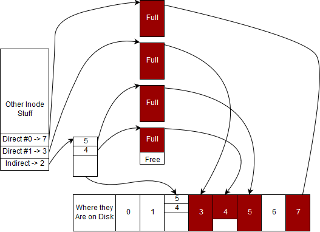

# 文件系统

文件系统很重要，因为它们允许你在计算机关闭、崩溃或内存损坏后持久化数据。在过去，文件系统使用成本很高。向文件系统（FS）写入涉及将数据写入磁带并从磁带中读取（“国际的”，n.d.）。这很慢，很重，并且容易出错。

如今，我们的大部分文件都存储在磁盘上——尽管并非所有文件都是这样！至少在速度上，磁盘仍然比内存慢一个数量级。

在我们开始本章之前，先介绍一些术语。**文件系统**，我们将在后面更具体地定义，是指满足文件系统 API 的任何东西。文件系统由存储介质支持，例如硬盘驱动器、固态驱动器、RAM 等。硬盘可以是**硬盘驱动器（HDD）**，它包括一个旋转的金属盘和一个可以电击盘面来编码 1 或 0 的磁头，或者是一个可以翻转芯片或独立驱动器上的某些 NAND 门的设备来存储 1 或 0。截至 2019 年，SSD 的速度比标准 HDD 快一个数量级。这些都是文件系统的典型支持介质。文件系统是在这个支持介质之上实现的，这意味着我们可以在商业可用的硬盘上实现 EXT、MinixFS、NTFS、FAT32 等。这个文件系统告诉操作系统如何组织 1 和 0 来存储文件信息以及目录信息，但关于这一点我们稍后再谈。为了避免过于拘泥于细节，我们可以说 EXT 或 NTFS 这样的文件系统直接实现了文件系统 API（打开、关闭等）。通常，操作系统会添加一层抽象，并要求操作系统满足其 API（例如，想象中的函数 linux_open、linux_close 等）。这两个好处是，一个文件系统可以为多个操作系统 API 实现，添加新的操作系统文件系统调用不需要所有底层文件系统更改它们的 API。例如，在 linux 的下一个版本中，如果有一个新的系统调用用于创建文件的备份，操作系统可以使用内部 API 来实现，而不是要求所有文件系统驱动程序更改它们的代码。

**最后一点背景信息非常重要。**在本章中，我们将使用 ISO 兼容的 KiB 或 Kibibyte 来表示文件的大小。*iB 系列是二进制存储的简称。这意味着以下内容：

Kibibyte 值

| 前缀 | 字节数值 |
| --- | --- |
| KiB | 1024B |
| MiB | 1024 * 1024 B |
| GiB | 1024 3̂ B |

标准记数前缀的含义如下：

千字节值

| 前缀 | 字节数值 |
| --- | --- |
| KB | 1000B |
| MB | 1000 * 1000 B |
| GB | 1000 3̂ B |

我们将在书中和网络章节中这样做，以保持一致性，避免混淆任何人。**在现实世界中，存在不同的惯例。**这个惯例是，当一个文件在操作系统中显示时，**KB 与 KiB 是相同的**。当我们谈论计算机网络、CD、其他存储时，**KB 与 KiB 不相同，并且是 ISO/公制定义的**。这是历史上的一个小怪癖，是由网络开发者和内存/硬盘存储开发者之间的冲突带来的。硬盘和内存开发者发现，如果一个比特可以处于两种状态之一，那么将千位前缀称为 1024 是自然的，因为它大约是 1000。网络开发者必须处理比特、实时信号处理以及各种其他因素，所以他们遵循了已经接受的惯例，即 Kilo- 表示某物的 1000 倍（“International,” n.d.）。你需要知道的是，如果你在野外看到 KB，它可能基于上下文是 1024。如果在任何时候你在这个班级中看到 KB 或任何家族成员提到文件系统问题，你可以安全地推断它们指的是 1024 作为基本单位。尽管如此，当你推动生产代码时，请确保询问这些差异！

## 什么是文件系统？

你可能遇到过古老的 UNIX 格言，“万物皆文件”。在大多数 UNIX 系统中，文件操作提供了一个接口来抽象许多不同的操作。网络套接字、硬件设备和磁盘上的数据都由类似文件的对象表示。一个类似文件的对象必须遵循以下约定：

1.  它必须向文件系统呈现自己。

1.  它必须支持常见的文件系统操作，例如创建、删除、重命名。至少，它需要能够打开和关闭。

文件系统是文件接口的实现。在本章中，我们将探讨文件系统提供的各种回调，一些典型功能及其相关实现细节。在本课程中，我们将主要讨论那些允许用户访问磁盘数据的文件系统，这对于现代计算机至关重要。

这里是一些文件系统的常见特性：

1.  它们处理存储本地文件和处理允许内核和用户空间之间安全通信的特殊设备。

1.  它们处理故障、可扩展性、索引、加密、压缩和性能。

1.  它们处理文件包含数据以及数据如何在磁盘上存储、分区和保护之间的抽象。

在我们深入探讨文件系统的细节之前，让我们看看一些例子。为了澄清，挂载点仅仅是将目录映射到内核中表示的文件系统。

1.  通常在 Linux 系统上挂载到 /，这是通常提供磁盘访问的文件系统，正如你所习惯的那样。

1.  通常挂载到 /proc，提供对进程的信息和控制。

1.  通常安装在 /sys，这是 /proc 的一个更现代版本，它还允许控制各种其他硬件，例如网络套接字。

1.  在某些系统中安装在 /tmp，这是一个内存文件系统，用于存储临时文件。

1.  这通过协议同步文件。

它告诉您基于目录的文件系统系统调用解析为什么。例如，在我们的情况下由文件系统解析，尽管它包含作为子系统的，但它由系统解析。

如您所注意到的，一些文件系统提供了对“非文件”事物的接口。例如，通常被称为*虚拟*文件系统，因为它们不提供与传统文件系统相同的数据访问。技术上，内核中的所有文件系统都表示为虚拟文件系统，但我们将区分*虚拟*文件系统为实际上不存储任何东西在硬盘上的文件系统。

### 文件 API

文件系统必须为各种操作提供回调函数。其中一些列在下面：

+   打开文件进行 IO 操作

+   读取文件内容

+   向文件写入

+   关闭文件并释放相关资源

+   修改文件的权限

+   与字符设备（如终端）的设备参数交互

并非每个文件系统都支持所有可能的回调函数。例如，许多文件系统省略或。许多文件系统不提供，这意味着它们只提供顺序访问。程序不能移动到文件中的任意位置。这与类似。在本章中，我们不会检查每个文件系统回调。如果您想了解更多关于此接口的信息，请尝试查看用户空间级别的文件系统（FUSE）的文档。

## 在磁盘上存储数据

要了解文件系统如何与磁盘上的数据交互，我们将使用三个关键术语。

1.  磁盘块是磁盘的一部分，用于存储文件或目录的内容。

1.  一个 inode *是*一个文件或目录。这意味着 inode 包含有关文件的元数据以及指向磁盘块的指针，以便文件实际上可以被写入或读取。

1.  超块包含有关 inode 和磁盘块元数据。一个示例超块可以存储每个磁盘块的使用情况，哪些 inode 正在使用等。现代文件系统可能实际上包含多个超块和一个类似超级块的超级块，它跟踪哪些扇区由哪些超级块管理。这有助于减少碎片。

虽然可能看起来令人不知所措，但到本章结束时，我们将能够理解文件系统的每个部分。

要对某种形式的存储上的数据进行推理——旋转磁盘、固态驱动器、磁带——通常的做法是首先考虑存储介质为*块*的集合。块可以被视为磁盘上的连续区域。虽然其大小有时由底层硬件的一些属性决定，但它更频繁地基于给定系统的页面大小来决定，这样可以从内存中缓存磁盘数据以实现更快的访问——这是许多文件系统的一个重要特性。

文件系统有一个特殊的块，称为*超级块*，它存储有关文件系统的元数据，例如日志（记录文件系统的更改）、inode 表、磁盘上第一个 inode 的位置等。关于超级块的重要之处在于它在磁盘上的位置是已知的。如果不是这样，你的计算机可能无法启动！考虑一个编程到主板上的简单 ROM。如果你的处理器不能告诉主板开始读取和解码磁盘块以启动启动序列，你就麻烦了。

索引节点是我们文件系统最重要的结构，因为它代表了一个文件。在我们深入探讨它之前，让我们列出我们需要的关键信息，以便能够使用文件。

+   名称

+   文件大小

+   创建时间、最后修改时间、最后访问时间

+   权限

+   文件路径

+   校验和

+   文件数据

### 文件内容

来自 [维基百科](http://en.wikipedia.org/wiki/Inode)：

> *在 Unix 风格的文件系统中，索引节点，非正式地称为 inode，是一种用于表示文件系统对象的数据结构，它可以表示各种事物，包括文件或目录。每个 inode 存储了文件系统对象数据的属性和磁盘块位置。文件系统对象的属性可能包括操作元数据（例如更改、访问、修改时间），以及所有者和权限数据（例如组 ID、用户 ID、权限）。*

超块可能存储一个 inode 数组，每个 inode 存储直接和可能的几种间接指针到磁盘块。由于 inode 存储在超块中，大多数文件系统对可以存在的 inode 数量有一个限制。由于每个 inode 对应一个文件，这也是该文件系统能够拥有的文件数量的限制。试图通过在其他位置存储 inode 来克服这个问题会极大地增加文件系统的复杂性。试图重新分配 inode 表的空间也是不可行的，因为 inode 数组之后的每个字节都必须移动，这是一个非常昂贵的操作。这并不是说完全没有解决方案，尽管通常没有必要增加 inode 的数量，因为 inode 的数量通常已经足够高。

大概念：忘记文件名。‘inode’就是文件。

人们通常认为文件名是“实际”的文件。不是这样！相反，考虑 inode 作为文件。inode 包含元信息（最后访问时间、所有权、大小）并指向用于存储文件内容的磁盘块。然而，inode 通常不存储文件名。文件名通常只存储在目录中（见下文）。

例如，要读取文件的前几个字节，遵循第一个直接块指针到第一个直接块，并读取前几个字节。写入过程遵循相同的步骤。如果一个程序想要读取整个文件，则持续读取直接块，直到读取的字节数等于文件的大小。如果文件的总大小小于直接块数量乘以块大小，则未使用的块指针将是未定义的。同样，如果文件的大小不是块大小的倍数，则最后一个块最后一个字节之后的数据将是垃圾。

如果一个文件比其直接块能寻址的最大空间还要大怎么办？针对这个问题，我们提出了程序员过于认真对待的一个格言。

> “所有计算机科学问题都可以通过另一层间接引用来解决。” - 大卫·惠勒

除了过多间接引用层的问题。

为了解决这个问题，我们引入了。一个单级间接块是一个存储指向更多数据块的指针的块。同样，双级间接块存储指向单级间接块的指针，这个概念可以推广到任意层次的间接引用。这是一个重要的概念，因为 inode 存储在超级块中，或者在一些已知位置的其他结构中，具有固定数量的空间，间接引用允许 inode 跟踪的空间量呈指数增长。

作为一个工作示例，假设我们将磁盘划分为 4KiB 大小的块，并且我们想要访问多达<semantics><msup><mn>2</mn><mn>32</mn></msup><annotation encoding="application/x-tex">2^{32}</annotation></semantics>个块。最大磁盘大小是<semantics><mrow><mn>4</mn><mi>K</mi><mi>i</mi><mi>B</mi><mo>*</mo><msup><mn>2</mn><mn>32</mn></msup><mo>=</mo><mn>16</mn><mi>T</mi><mi>i</mi><mi>B</mi></mrow><annotation encoding="application/x-tex">4KiB *2^{32} = 16TiB</annotation></semantics>，记住<semantics><mrow><msup><mn>2</mn><mn>10</mn></msup><mo>=</mo><mn>1024</mn></mrow><annotation encoding="application/x-tex">2^{10} = 1024</annotation></semantics>。一个磁盘块可以存储<semantics><mfrac><mrow><mn>4</mn><mi>K</mi><mi>i</mi><mi>B</mi></mrow><mrow><mn>4</mn><mi>B</mi></mrow></mfrac><annotation encoding="application/x-tex">\frac{4KiB}{4B}</annotation></semantics>个可能的指针或 1024 个指针。由于我们想要访问 32 位块，因此需要四个字节的指针。每个指针指向一个 4KiB 的磁盘块，因此你可以引用多达<semantics><mrow><mn>1024</mn><mo>*</mo><mn>4</mn><mi>K</mi><mi>i</mi><mi>B</mi><mo>=</mo><mn>4</mn><mi>M</mi><mi>i</mi><mi>B</mi></mrow><annotation encoding="application/x-tex">1024*4KiB = 4MiB</annotation></semantics>的数据。对于相同的磁盘配置，一个双间接块存储 1024 个指向 1024 个间接表的指针。因此，一个双间接块可以引用多达<semantics><mrow><mn>1024</mn><mo>*</mo><mn>4</mn><mi>M</mi><mi>i</mi><mi>B</mi><mo>=</mo><mn>4</mn><mi>G</mi><mi>i</mi><mi>B</mi></mrow><annotation encoding="application/x-tex">1024 * 4MiB = 4GiB</annotation></semantics>的数据。同样，一个三间接块可以引用多达 4TiB 的数据。由于间接级别增加，读取块之间的速度会慢三倍。实际的块内读取时间不会改变。

### 目录实现

目录是名称到 inode 编号的映射。它通常是普通文件，但在其 inode 中设置了一些特殊位，并且其内容具有特定的结构。POSIX 提供了一组小函数来读取每个条目的文件名和 inode 编号，我们将在本章后面深入讨论。

让我们思考一下实际文件系统中目录的样子。从理论上讲，它们是文件。磁盘块将包含*目录条目*或*dirents*。这意味着我们的磁盘块可以看起来像这样

```c
| inode_num | name   | | ----------- | ------ |
| 2043567   | hi.txt | | ... |
```

每个目录条目可以是固定大小的，也可以是可变长度的 C 字符串。这取决于特定的文件系统在底层如何实现它。要在 POSIX 系统上查看文件名到 inode 编号的映射，从 shell 中使用选项

```c
# ls -i
12983989 dirlist.c      12984068 sandwich.c
```

你可以稍后看到这是一个强大的抽象。一个文件可以在目录中有多个不同的名称，或者存在于多个目录中。

### UNIX 目录约定

在标准 UNIX 文件系统中，在请求读取目录时，会特别添加以下条目。

1.  代表当前目录

1.  代表父目录

令人反直觉的是，可以是磁盘上文件或目录的名称（你可以用试试），而不是祖父目录。只有当前目录和父目录有涉及（即，和）。令人困惑的是，shell 在展开 shell 命令时将解释为访问祖父目录的便捷快捷方式（如果存在）。

关于名称相关约定的额外事实：

1.  通常由 shell 展开为家目录

1.  在磁盘上以‘.’（点）开头的文件传统上被认为是‘隐藏’的，并且在没有额外标志的情况下（例如，程序会省略它们）。这不是文件系统的功能，程序可以选择忽略这一点。

1.  一些文件也可能以空字节 NUL 开头。这些通常是*抽象 UNIX 套接字*，用于防止文件系统杂乱无章，因为它们将被任何未预料到的程序有效地隐藏。然而，它们将被详细提供套接字信息的工具列出，因此这不是提供安全性的功能。

1.  如果你想要惹恼你的邻居，创建一个包含终端响铃字符的文件。每次文件被列出（例如通过调用‘ls’）时，都会听到一个可听到的响铃。

### 目录 API

在 C 语言中与文件交互通常是通过使用打开文件，然后或与文件交互，在调用之前释放资源来完成的，目录有特殊的调用，如，和。没有函数，因为这通常意味着创建文件或链接。程序会使用类似或的东西。

要探索这些功能，让我们编写一个程序来搜索目录中的特定文件。下面的代码有错误，试着找出它！

```c
int exists(char *directory, char *name)  {
 struct dirent *dp;
 DIR *dirp = opendir(directory);
 while ((dp = readdir(dirp)) != NULL) {
 puts(dp->d_name);
 if (!strcmp(dp->d_name, name)) {
 return 1; /* Found */
 }
 }
 closedir(dirp);
 return 0; /* Not Found */
}
```

你找到错误了吗？它泄漏资源！如果找到一个匹配的文件名，那么在早期返回时永远不会调用‘closedir’。任何打开的文件描述符和由‘opendir’分配的任何内存永远不会释放。这意味着最终进程将耗尽资源，或者调用将失败。

修复方法是确保我们在所有可能的代码路径中释放资源。

在上面的代码中，这意味着在之前调用。忘记释放资源是 C 编程中常见的错误，因为 C 语言没有支持确保所有代码路径都释放资源的功能。

给定一个打开的目录，在调用后，要么（XOR），父目录或子目录可以使用，或者。如果父目录和子目录都使用上述方法，则行为是未定义的。

有两个主要的问题和一个注意事项。函数返回“.”（当前目录）和“..”（父目录）。另一个是程序需要显式排除子目录的搜索，否则搜索可能需要很长时间。

对于许多应用来说，在递归搜索子目录之前先检查当前目录是合理的。这可以通过存储结果在链表中或重置目录结构从开始处重新启动来实现。

以下代码尝试递归地列出目录中的所有文件。作为一个练习，尝试识别它引入的错误。

```c
void dirlist(char *path) {
 struct dirent *dp;
 DIR *dirp = opendir(path);
 while ((dp = readdir(dirp)) != NULL) {
 char newpath[strlen(path) + strlen(dp->d_name) + 1];
 sprintf(newpath,"%s/%s", newpath, dp->d_name);
 printf("%s\n", dp->d_name);
 dirlist(newpath);
 }
}

int main(int argc, char **argv) {
 dirlist(argv[1]);
 return 0;
}
```

你找到了所有的 5 个错误吗？

```c
// Check opendir result (perhaps user gave us a path that can not be opened as a directory
if (!dirp) { perror("Could not open directory"); return; }

// +2 as we need space for the / and the terminating 0
char newpath[strlen(path) + strlen(dp->d_name) + 2];

// Correct parameter
sprintf(newpath,"%s/%s", path, dp->d_name);

// Perform stat test (and verify) before recursing
if (0 == stat(newpath,&s) && S_ISDIR(s.st_mode)) dirlist(newpath)

// Resource leak: the directory file handle is not closed after the while loop
closedir(dirp);
```

最后一点注意事项。这不是线程安全的！你不应该使用函数的重入版本。在进程内同步文件系统很重要，所以使用锁来包围 。

有关更多详细信息，请参阅[readdir 的 man 页](https://linux.die.net/man/3/readdir)。

### 链接

链接迫使我们将文件系统建模为图而不是树。

当将文件系统建模为树时，会暗示每个 inode 都有一个唯一的父目录，但链接允许 inode 在多个地方呈现为文件，可能具有不同的名称，从而导致 inode 有多个父目录。有两种类型的链接：

1.  硬链接简单来说就是目录中的一个条目，将某个 inode 号分配给已经具有不同名称和映射的 inode。如果我们已经在文件系统上有一个文件，我们可以使用以下命令创建指向相同 inode 的另一个链接：

    ```c
    $ ln file1.txt blip.txt
    ```

    然而，blip.txt *确实是*同一个文件。如果我们编辑 blip，我正在编辑与‘file1.txt’相同的文件。我们可以通过证明这两个文件名都指向相同的 inode 来证明这一点。

    ```c
    $ ls -i file1.txt blip.txt
    134235 file1.txt
    134235 blip.txt
    ```

    相应的 C 调用是

    ```c
    // Function Prototype
    int link(const char *path1, const char *path2);

    link("file1.txt", "blip.txt");
    ```

    为了简单起见，上面的例子在同一个目录内创建了硬链接。硬链接可以在同一个文件系统的任何地方创建。

1.  第二种链接称为软链接、符号链接或 symlink。符号链接不同，因为它是一个设置了特殊位的文件，并存储指向另一个文件的路径。简单来说，如果没有这个特殊位，它不过是一个包含文件路径的文本文件。注意，当人们通常谈论一个链接而没有指定硬链接或软链接时，他们指的是硬链接。

    在 shell 中创建符号链接，使用 。要读取链接的内容作为文件，使用 。这两个都在下面演示。

    ```c
    $ ln -s file1.txt file2.txt
    $ ls -i file1.txt blip.txt
    134235 file1.txt
    134236 file2.txt
    134235 blip.txt
    $ cat file1.txt
    file1!
    $ cat file2.txt
    file1!
    $ cat blip.txt
    file1!
    $ echo edited file2 >> file2.txt # >> is bash syntax for append to file
    $ cat file1.txt
    file1!
    edited file2
    $ cat file2.txt
    I'm file1!
    edited file2
    $ cat blip.txt
    file1!
    edited file2
    $ readlink myfile.txt
    file2.txt
    ```

    注意，和有不同的 inode 号，与硬链接不同。

    有一个创建符号链接的 C 库函数，它与`link`函数类似。

    ```c
    symlink(const char *target, const char *symlink);
    ```

    符号链接的一些优点是

    +   可以引用尚未存在的文件

    +   与硬链接不同，可以引用目录以及常规文件

    +   可以引用当前文件系统之外的文件（和目录）

    然而，符号链接有一个关键缺点，它们比常规文件和目录要慢。当读取链接的内容时，它们必须被解释为指向目标文件的新路径，这导致需要额外的 open 和 read 调用，因为必须打开和读取实际文件。另一个缺点是 POSIX 禁止硬链接目录，而允许符号链接。该命令将只允许 root 执行此操作，并且只有当您提供选项时。然而，即使是 root 也可能无法执行此操作，因为大多数文件系统都阻止这样做！

文件系统的完整性假设目录结构是一个从根目录可达的循环树。如果允许目录链接，强制执行或验证此约束将变得昂贵。打破这些假设可能会使文件完整性工具无法修复文件系统。递归搜索可能永远不会终止，目录可以有多个父目录，但 “..” 只能引用一个父目录。总的来说，这是一个坏主意。符号链接只是被忽略，这就是为什么我们可以使用它们来引用目录。

当您使用 rm 或 rmdir 删除文件时，您正在从一个目录中删除一个 inode 引用。然而，inode 可能仍然被其他目录引用。为了确定文件内容是否仍然需要，每个 inode 都保留一个引用计数，该计数在创建或删除新链接时更新。这个计数只跟踪硬链接，符号链接可以引用一个不存在的文件，因此，并不重要。

硬链接的一个例子是高效地在不同的时间点创建文件系统的多个存档。一旦存档区域有特定文件的副本，未来的存档就可以重新使用这些存档文件，而不是创建一个重复的文件。这被称为增量备份。苹果的“时间机器”软件就是这样做的。

### 路径

现在我们有了定义，并且已经讨论了目录，我们遇到了路径的概念。路径是一系列目录，为用户提供了一个文件系统中的“路径”。然而，也有一些细微差别。可能存在一个名为 `a/b/../c/./` 的路径。由于 . 和 .. 是目录中的特殊条目，这是一个有效的路径，实际上指的是 `a/c`。大多数文件系统功能都允许传递未压缩的路径。C 库提供了一个压缩路径或获取绝对路径的函数。为了简化，请记住，. 表示“父文件夹”，而 .. 表示“当前文件夹”。下面是一个示例，说明如何使用 shell 在文件系统中导航来简化 `a/b/../c/.`。

1.  (在/a)

1.  (在/a/b)

1.  (在/a 中，因为 .. 代表“父文件夹”)

1.  (在/a/c)

1.  (在/a/c 中，因为 . 代表“当前文件夹”)

因此，这个路径可以简化为 .

### 元数据

我们如何区分常规文件和目录？就这个而言，文件还可能包含许多其他属性。我们通过区分文件类型——与文件扩展名不同，例如 png、svg、pdf——使用 inode 内的字段来区分。系统是如何知道文件类型的？

此信息存储在 inode 中。要访问它，请使用 stat 调用。例如，要找出我的“notes.txt”文件最后访问的时间。

```c
struct stat s;
stat("notes.txt", &s);
printf("Last accessed %s", ctime(&s.st_atime));
```

实际上存在三种版本的 ；

```c
int stat(const char *path, struct stat *buf);
int fstat(int fd, struct stat *buf);
int lstat(const char *path, struct stat *buf);
```

例如，如果程序已经与该文件关联了一个文件描述符，则可以使用 来了解文件元数据。

```c
FILE *file = fopen("notes.txt", "r");
int fd = fileno(file); /* Just for fun - extract the file descriptor from a C FILE struct */
struct stat s;
fstat(fd, & s);
printf("Last accessed %s", ctime(&s.st_atime));
```

几乎与相同，但处理符号链接的方式不同。从 man 页面。

> lstat() 函数与 stat() 函数相同，区别在于如果路径名是一个符号链接，则它返回关于链接本身的信息，而不是它所指向的文件。

stat 函数使用 。从 man 页面：

```c
struct stat {
 dev_t     st_dev;         /* ID of device containing file */
 ino_t     st_ino;         /* Inode number */
 mode_t    st_mode;        /* File type and mode */
 nlink_t   st_nlink;       /* Number of hard links */
 uid_t     st_uid;         /* User ID of owner */
 gid_t     st_gid;         /* Group ID of owner */
 dev_t     st_rdev;        /* Device ID (if special file) */
 off_t     st_size;        /* Total size, in bytes */
 blksize_t st_blksize;     /* Block size for filesystem I/O */
 blkcnt_t  st_blocks;      /* Number of 512B blocks allocated */
 struct timespec st_atim;  /* Time of last access */
 struct timespec st_mtim;  /* Time of last modification */
 struct timespec st_ctim;  /* Time of last status change */
};
```

该字段可以用来区分常规文件和目录。为此，使用宏和 。

```c
struct stat s;
if (0 == stat(name, &s)) {
 printf("%s ", name);
 if (S_ISDIR( s.st_mode)) puts("is a directory");
 if (S_ISREG( s.st_mode)) puts("is a regular file");
} else {
 perror("stat failed - are you sure we can read this file's metadata?");
}
```

## 权限和位

权限是 UNIX 系统在文件系统中提供安全性的关键部分。你可能已经注意到，该字段包含的不仅仅是文件类型。它还包括模式，这是一个详细说明用户可以使用给定文件做什么和不能做什么的描述。任何文件通常都有三组权限。对于用户、组和其他（不属于前两类用户的所有用户）。对于这三类中的每一类，我们需要跟踪用户是否被允许读取文件、向文件写入和执行文件。由于有三类和三种权限，权限通常表示为一个三位八进制数。对于每一位，最低有效位对应于读取权限，中间位对应于写入权限，最后一位对应于执行权限。它们总是以 *用户*、*组*、*其他*（UGO）的形式呈现。以下是一些常见示例。以下是位约定：

1.  表示一组人可以读取

1.  表示一组人可以写入

1.  表示一组人可以执行

权限表

| 八进制代码 | 用户 | 组 | 其他 |
| --- | --- | --- | --- |
| 755 |  |  |  |
| 644 |  |  |  |

值得注意的是，对于目录，位具有略微不同的含义。对目录的写入访问将允许程序在目录内部创建或删除新文件或目录。你可以将其视为对目录条目（dirent）映射的写入访问。对目录的读取访问将允许程序列出目录的内容。这是对目录条目（dirent）映射的读取访问。执行将允许程序使用 cd 进入目录。如果没有执行位，则任何创建或删除文件或目录的尝试都将失败，因为你无法访问它们。然而，你可以列出目录的内容。

有几个命令行实用程序可以与文件的模式交互。更改文件类型。接受一个数字和一个文件，并更改权限位。然而，在我们详细讨论 chmod 之前，我们还必须了解用户 ID () 和组 ID ()。

### 用户 ID / 组 ID

UNIX 系统中的每个用户都有一个用户 ID。这是一个可以识别用户的唯一数字。同样，用户可以被添加到称为组的集合中，每个组也有一个唯一的识别号。组在 UNIX 系统中有很多用途。它们可以分配能力 - 一种描述用户对系统控制级别的方式。例如，你可能遇到的一个组是组，一组被信任的用户，他们被允许使用命令来临时获得更高的权限。我们将在本章中更多地讨论如何工作。每个文件在创建时都有一个所有者，即文件的创建者。这个所有者的用户 ID () 可以通过在文件系统中使用系统调用 . 来找到。同样，组 ID () 也会被设置。

每个进程都可以使用和确定其和 . 当一个进程尝试以特定模式打开文件时，它的和与文件的和进行比较。如果匹配，则进程打开文件的请求将与文件权限的用户字段上的位进行比较。如果匹配，则进程的请求将与权限的组字段进行比较。如果没有任何 ID 匹配，则将应用其他字段。

### 读取/更改文件权限

在我们讨论如何更改权限位之前，我们应该能够读取它们。在 C 中，可以使用库调用系列。要从命令行读取权限位，请使用 . 注意，权限将以格式‘trwxrwxrwx’输出。第一个字符表示文件类型。第一个字符的可能值包括但不限于。

1.  (-) 普通文件

1.  (d) 目录

1.  (c) 字符设备文件

1.  (l) 符号链接

1.  (p) 命名管道（也称为 FIFO）

1.  (b) 块设备

1.  (s) 套接字

或者，使用程序，它展示了从库调用中可以检索到的所有信息。

要更改权限位，有一个系统调用，. 为了简化我们的示例，我们将使用同名的命令行实用程序，简称为“更改模式”。使用有两种常见方式，要么是八进制值，要么是符号字符串。

```c
$ chmod 644 file1
$ chmod 755 file2
$ chmod 700 file3
$ chmod ugo-w file4
$ chmod o-rx file4
```

八进制（‘八进制’）数字描述了每个角色的权限：拥有文件的用户，组以及其他人。八进制数是分配给三种类型权限的三个值的总和：读（4）、写（2）、执行（1）

示例：

1.  r + w + x = 数字 * 用户有 4+2+1，完全权限

1.  组有 4+0+1，读和执行权限

1.  所有用户都有 4+0+1，读和执行权限

### 理解‘umask’

umask *减去*（减少）权限位，并在使用 open、mkdir 等创建新文件和新目录时使用。默认情况下，umask 设置为（八进制），这意味着组和其他权限将仅限于可读。每个进程都有一个当前的 umask 值。当进行 fork 时，子进程会继承父进程的 umask 值。

例如，通过在 shell 中设置 umask，确保未来创建的文件和目录只能被当前用户访问，

```c
$ umask 077
$ mkdir secretdir
```

作为一个代码示例，假设创建了一个新文件，其权限位为（用户、组和其他的读写位）：

```c
open("myfile", O_CREAT, S_IRUSR | S_IWUSR | S_IRGRP | S_IWGRP | S_IROTH | S_IWOTH);
```

如果 umask 是八进制，那么创建的文件的权限将是 & ~，例如。

```c
S_IRUSR | S_IWUSR | S_IRGRP | S_IROTH
```

### “setuid”位

你可能已经注意到，具有执行权限的文件可能设置了额外的位。这个位是粘性位。它表示当运行程序时，程序将用户的 uid 设置为文件所有者的 uid。类似地，还有一个位将执行者的 gid 设置为所有者的 gid。具有 set 的程序的经典示例是。

通常是由 root 用户拥有的程序 - 拥有所有权限的用户。通过使用，一个原本无特权的用户可以访问系统的绝大部分。这对于运行可能需要提升权限的程序很有用，例如使用来更改文件的所有权，或者使用来挂载或卸载文件系统（我们将在本章后面讨论这一动作）。以下是一些示例：

```c
$ sudo mount /dev/sda2 /stuff/mydisk
$ sudo adduser fred
$ ls -l /usr/bin/sudo
-r-s--x--x  1 root  wheel  327920 Oct 24 09:04 /usr/bin/sudo
```

当以设置了 setuid 位的进程执行时，仍然可以使用来确定用户的原始 uid。位的确切动作是设置有效用户 ID（），这可以通过来确定。和的动作描述如下。

+   返回真实用户 ID（如果以 root 登录，则为零）

+   返回有效用户 ID（如果以 root 身份操作，则为零，例如由于程序上设置了 setuid 标志）

这些函数可以允许编写一个只能由特权用户运行的程序，通过检查或更进一步，确保唯一可以运行代码的用户是 root，使用。

### 粘性位

我们今天使用的粘性位与最初的引入目的不同。粘性位是可以设置在可执行文件上的位，允许程序文本段在程序执行结束后仍然保留在交换空间中。这使得相同程序的后续执行更快。今天，这种行为不再被支持，粘性位仅在设置为目录时才有意义，

当目录的粘性位被设置时，只有文件的所有者、目录的所有者和 root 用户可以重命名或删除文件。这在多个用户对公共目录有写访问权限时很有用。粘性位的一个常见用途是共享和可写目录，其中可能存储了许多用户的文件，但用户不应能够访问其他用户的所有文件。

要设置粘性位，使用。

```c
aneesh$ mkdir sticky
aneesh$ chmod +t sticky
aneesh$ ls -l
drwxr-xr-x  7 aneesh aneesh    4096 Nov  1 14:19 .
drwxr-xr-x 53 aneesh aneesh    4096 Nov  1 14:19 ..
drwxr-xr-t  2 aneesh aneesh    4096 Nov  1 14:19 sticky
aneesh$ su newuser
newuser$ rm -rf sticky
rm: cannot remove 'sticky': Permission denied
newuser$ exit
aneesh$ rm -rf sticky
aneesh$ ls -l
drwxr-xr-x  7 aneesh aneesh    4096 Nov  1 14:19 .
drwxr-xr-x 53 aneesh aneesh    4096 Nov  1 14:19 ..
```

注意，在上面的例子中，用户名被添加到提示符前面，并使用命令来切换用户。

## 虚拟文件系统和其他文件系统

POSIX 系统，如 Linux 和 Mac OS X（基于 BSD），包括几个作为文件系统一部分挂载（可用）的虚拟文件系统。这些虚拟文件系统中的文件可能是动态生成的或存储在内存中。Linux 提供了 3 个主要的虚拟文件系统。

虚拟文件系统列表

| 设备 | 用例 |
| --- | --- |
|  | 物理和虚拟设备列表（例如网卡、光盘、随机数发生器） |
|  | 每个进程使用的资源列表和（传统上）系统信息集 |
|  | 内核内部实体的有序列表 |

如果我们想要一个连续的 0 流，我们可以运行 。

另一个例子是文件 ，一个存储你永远不会需要读取的位的好地方。发送到 的字节永远不会存储，只是简单地丢弃。 的一个常见用途是丢弃标准输出。例如，

```c
$ ls . >/dev/null
```

### 管理文件和文件系统

考虑到您可以从文件系统执行的大量操作，让我们探索一些可以用来管理文件和文件系统的工具和技术。

一个例子是创建一个安全的目录。假设你在 /tmp 中创建了自己的目录，然后设置了权限，使得只有你可以使用该目录（见下文）。这是安全的吗？

```c
$ mkdir /tmp/mystuff
$ chmod 700 /tmp/mystuff
```

在创建目录和更改其权限之间有一个机会窗口。这导致基于竞争条件的好几个漏洞。

另一个用户用指向第二个用户拥有的现有文件或目录的硬链接替换，然后他们就能够读取和控制目录的内容。哦不——我们的秘密不再是秘密了！

然而，在这个特定例子中，目录设置了粘滞位，所以只有所有者才能删除目录，上述简单攻击场景是不可能的。这并不意味着创建目录然后后来将其设置为私有就是安全的！更好的版本是从一开始就原子性地创建具有正确权限的目录。

```c
$ mkdir -m 700 /tmp/mystuff
```

### 获取随机数据

是一个包含随机数发生器的文件，其熵由环境噪声确定。 随机会阻塞/等待直到从环境中收集到足够的熵。

它像随机一样，但不同之处在于它允许重复（较低的熵阈值），因此不会阻塞。

可以将这两个都视为程序可以从中读取字符流，而不是具有起始和结束位置的文件。为了触及一个误解，大多数时候应该使用 .。唯一的特定用例是当需要在启动时需要加密安全的数据并且系统应该阻止时。否则，有以下原因。

1.  实际上，它们都产生了看起来足够随机的数字。

1.  可能在不方便的时候阻塞。如果一个服务正在编程一个高可扩展性的服务并依赖于，攻击者可以可靠地耗尽熵池并导致服务阻塞。

1.  手册页作者提出了一个假设攻击，其中攻击者耗尽熵池并猜测种子位，但这种攻击尚未实现。

1.  一些操作系统没有真正的类似 MacOS 的`cp`命令。

1.  安全专家会讨论计算安全与信息论安全，更多内容请参阅这篇文章[关于 Urandom 的神话](https://www.2uo.de/myths-about-urandom)。大多数加密都是计算安全的，这意味着也是如此。

### 复制文件

使用通用的命令。例如，以下命令从文件复制 1 MiB 的数据到文件。数据以 1024 个大小为 1024 字节的块复制。

```c
$ dd if=/dev/urandom of=/dev/null bs=1k count=1024
```

上面示例中的输入和输出文件都是虚拟的——它们不存在于磁盘上。这意味着传输速度不受硬件性能的影响。

也常用于复制磁盘或整个文件系统以创建可以烧录到其他磁盘或分发给其他用户的镜像。

### 更新修改时间

可执行文件如果不存在则创建文件，并更新文件的最后修改时间为当前时间。例如，我们可以使用当前时间创建一个新的私有文件：

```c
 $ umask 077       # all future new files will mask out all r,w,x bits for group and other access
 $ touch file123   # create a file if it non-existant, and update its modified time
 $ stat file123
 File: `file123'
 Size: 0           Blocks: 0          IO Block: 65536  regular empty file
 Device: 21h/33d Inode: 226148      Links: 1
 Access: (0600/-rw-------)  Uid: (395606/ angrave)   Gid: (61019/     ews)
 Access: 2014-11-12 13:42:06.000000000 -0600
 Modify: 2014-11-12 13:42:06.001787000 -0600
 Change: 2014-11-12 13:42:06.001787000 -0600
```

`touch`的一个示例用法是强制`make`重新编译在`makefile`内部修改编译选项后未更改的文件。记住，`make`是“懒惰”的——它会比较源文件的修改时间与相应的输出文件，以查看文件是否需要重新编译。

```c
 $ touch myprogram.c   # force my source file to be recompiled
 $ make
```

### 管理文件系统

要管理机器上的文件系统，使用`mount`。使用不带任何选项的`mount`会生成一个挂载的文件系统列表（每行一个文件系统），包括网络、虚拟和本地（旋转磁盘/基于 SSD）文件系统。以下是`mount`的典型输出。

```c
 $ mount
 /dev/mapper/cs341--server_sys-root on / type ext4 (rw)
 proc on /proc type proc (rw)
 sysfs on /sys type sysfs (rw)
 devpts on /dev/pts type devpts (rw,gid=5,mode=620)
 tmpfs on /dev/shm type tmpfs (rw,rootcontext="system_u:object_r:tmpfs_t:s0")
 /dev/sda1 on /boot type ext3 (rw)
 /dev/mapper/cs341--server_sys-srv on /srv type ext4 (rw)
 /dev/mapper/cs341--server_sys-tmp on /tmp type ext4 (rw)
 /dev/mapper/cs341--server_sys-var on /var type ext4 (rw)rw,bind)
 /srv/software/Mathematica-8.0 on /software/Mathematica-8.0 type none (rw,bind)
 engr-ews-homes.engr.illinois.edu:/fs1-homes/angrave/linux on /home/angrave type nfs (rw,soft,intr,tcp,noacl,acregmin=30,vers=3,sec=sys,sloppy,addr=128.174.252.102)
```

注意，每一行都包括文件系统的类型、源和挂载点。为了减少输出，我们可以将其管道输入到`grep`，只查看匹配正则表达式的行。

```c
 >mount | grep proc  # only see lines that contain 'proc'
 proc on /proc type proc (rw)
 none on /proc/sys/fs/binfmt_misc type binfmt_misc (rw)
```

#### 文件系统挂载

假设您已从[arch linux 下载页面](https://www.archlinux.org/download/)下载了一个可启动的 Linux 磁盘镜像。

```c
 $ wget $URL
```

在将文件系统放在 CD 上之前，我们可以将文件挂载为文件系统并探索其内容。注意：`mount`需要 root 权限，所以让我们使用`sudo`来运行它。

```c
 $ mkdir arch
 $ sudo mount -o loop archlinux-2015.04.01-dual.iso ./arch
 $ cd arch
```

在`mount`命令之前，`arch`目录是新的，显然是空的。挂载后，内容将从存储在文件系统内部的文件和目录中抽取。这个选项是必需的，因为我们想要挂载一个常规文件，而不是像物理磁盘这样的块设备。

循环选项将原始文件包装为块设备。在本例中，我们将在下面发现文件系统是在提供的。我们可以通过运行不带任何参数的 mount 命令来检查文件系统类型和挂载选项。我们将输出通过管道传输到，以便我们只看到包含‘arch’的相关输出行。

```c
$ mount | grep arch
/home/demo/archlinux-2014.11.01-dual.iso on /home/demo/arch type iso9660 (rw,loop=/dev/loop0)
```

iso9660 文件系统是一个最初为光盘存储媒体（即 CDRoms）设计的只读文件系统。尝试更改文件系统的内容将失败

```c
$ touch arch/nocando
touch: cannot touch `/home/demo/arch/nocando': Read-only file system
```

## 内存映射 I/O

虽然我们传统上认为从文件中读取和写入是一个通过使用和调用来发生的操作，但有一个替代方案，即使用映射文件到内存。这也可以用于 IPC，你可以在 IPC 章节中了解更多关于作为启用共享内存的系统调用的信息。在本章中，我们将简要探讨作为文件系统操作的使用。

将文件的内容映射到内存中。这使用户可以将整个文件作为内存中的缓冲区来处理，以便在编程时更容易理解语义，并避免显式地按离散块读取文件。

并非所有文件系统都支持使用它进行 I/O 操作。那些支持使用的文件系统行为各异。有些只是将和作为包装器来实现。而有些则会通过利用内核的页面缓存来添加额外的优化。当然，这种优化也可以用于和的实现，因此通常使用它们的性能是相同的。

用于执行一些操作，如将库和进程加载到内存中。如果许多程序只需要对同一文件进行读取访问，则可以在多个进程之间共享相同的物理内存。这用于常见的库，如 C 标准库。

将文件映射到内存的过程如下。

1.  需要一个文件描述符，因此我们需要先打开文件

1.  我们寻找所需的大小，并写入一个字节以确保文件长度足够。

1.  完成后，调用 munmap 从内存中取消映射文件。

这里有一个快速示例。

```c
#include <stdio.h>
#include <stdlib.h>
#include <sys/types.h>
#include <sys/stat.h>
#include <sys/mman.h>
#include <fcntl.h>
#include <unistd.h>
#include <errno.h>
#include <string.h>

int fail(char *filename, int linenumber) {
 fprintf(stderr, "%s:%d %s\n", filename, linenumber, strerror(errno));
 exit(1);
 return 0; /*Make compiler happy */
}
#define QUIT fail(__FILE__, __LINE__ )

int main() {
 // We want a file big enough to hold 10 integers
 int size = sizeof(int) * 10;

 int fd = open("data", O_RDWR | O_CREAT | O_TRUNC, 0600); //6 = read+write for me!

 lseek(fd, size, SEEK_SET);
 write(fd, "A", 1);

 void *addr = mmap(0, size, PROT_READ | PROT_WRITE, MAP_SHARED, fd, 0);
 printf("Mapped at %p\n", addr);
 if (addr == (void*) -1 ) QUIT;

 int *array = addr;
 array[0] = 0x12345678;
 array[1] = 0xdeadc0de;

 munmap(addr,size);
 return 0;

}
```

仔细的读者可能会注意到，我们使用的是最低有效字节格式来编写整数，因为这是我们运行此示例的 CPU 的字节序。我们还分配了一个比一个字节多的文件！选项指定了虚拟内存保护。选项（在此未使用）可以设置为允许 CPU 执行内存中的指令。

## 可靠的单硬盘文件系统

大多数文件系统都会在物理内存中缓存大量的磁盘数据。在这方面，Linux 是极端的。所有未使用的内存都用作巨大的磁盘缓存。磁盘缓存可以对整体系统性能产生重大影响，因为磁盘 I/O 速度慢。这对于旋转磁盘上的随机访问请求尤其如此，其中磁盘读写延迟主要由将读写磁盘头移动到正确位置所需的寻址时间决定。

为了效率，内核缓存最近使用的磁盘块。对于写入，我们必须在性能和可靠性之间做出权衡。磁盘写入也可以被缓存（“写回缓存”），修改后的磁盘块存储在内存中，直到被移除。或者，可以采用“写入通过缓存”策略，其中磁盘写入立即发送到磁盘。后者更安全，因为文件系统修改迅速存储到持久介质中，但比写回缓存慢。如果写入被缓存，则可以根据每个磁盘块的物理位置延迟和高效地调度。注意，这是一个简化的描述，因为固态驱动器（SSD）可以用作二级写回缓存。

固态硬盘（SSD）和旋转硬盘在读取或写入顺序数据时都提高了性能。因此，操作系统通常可以使用预读策略来分摊读取请求的成本，并请求每个请求的几个连续磁盘块。通过在用户应用程序需要下一个磁盘块之前发出对下一个磁盘块的 I/O 请求，可以减少明显的磁盘 I/O 延迟。

如果你的数据很重要，需要强制写入磁盘，可以调用请求将文件系统的更改写入（刷新）到磁盘。然而，操作系统可能会忽略这个请求。即使数据被从内核缓冲区中移除，磁盘固件可能会使用内部磁盘缓存，或者可能尚未完成对物理介质的更改。注意，你也可以请求使用 . 将与特定文件描述符相关联的所有更改刷新到磁盘。关于这个调用是否无用的争论很激烈，由 PostgreSQL 团队发起 [`lwn.net/Articles/752063/`](https://lwn.net/Articles/752063/)

如果你的操作系统在操作过程中失败，大多数现代文件系统会采取一种称为**日志记录**的措施来解决这个问题。文件系统所做的是，在它完成一个可能昂贵的操作之前，将它的操作记录下来。在发生崩溃或故障的情况下，可以逐步检查日志，查看哪些文件已损坏并修复它们。这是一种在存在关键数据且没有明显备份的情况下挽救硬盘的方法。

即使你的计算机不太可能发生这种情况，为数据中心编程意味着磁盘每几秒钟就会失败。磁盘故障使用“平均故障时间（MTTF）”来衡量。对于大型阵列，平均故障时间可能出人意料地短。如果 MTTF（单个磁盘）= 30,000 小时，那么 MTTF（1000 个磁盘）= 30,000/1000=30 小时，大约是一天半！这也假设磁盘之间的故障是独立的，而它们通常不是。

### RAID - 红 undant Array of Inexpensive Disks

防止这种情况的一种方法是将数据存储两次！这是“RAID-1”磁盘阵列的主要原则。通过将写入磁盘的数据与写入另一个备份磁盘的数据进行复制，数据恰好有两个副本。如果一个磁盘发生故障，另一个磁盘将作为唯一的副本，直到可以重新克隆。读取数据更快，因为可以从任一磁盘请求数据，但写入可能慢两倍，因为现在每个磁盘块写入都需要发出两个写入命令。与使用单个磁盘相比，每字节的存储成本翻倍。

另一个常见的 RAID 方案是 RAID-0，这意味着文件可以在两个磁盘之间分割，但如果任何磁盘发生故障，文件将无法恢复。这的好处是写入时间减半，因为文件的一部分可以写入硬盘一，另一部分写入硬盘二。

也常见将这些系统结合起来。如果你有很多硬盘，可以考虑 RAID-10。这是有两个 RAID-1 系统，但系统通过 RAID-0 相互连接。这意味着你会从减速中获得大致相同的速度，但现在任何一块磁盘都可以失败，你可以恢复那块磁盘。如果来自对立 RAID 分区的两块磁盘发生故障，有恢复的机会，尽管我们大多数时候并不指望它。

### 更高的 RAID 级别

RAID-3 使用奇偶校验码而不是镜像数据。对于每个写入的 N 位，我们将写入一个额外的位，即“奇偶校验位”，确保写入的 1 的总数是偶数。奇偶校验位写入到额外的磁盘。如果包括奇偶校验磁盘在内的任何磁盘丢失，则可以使用其他磁盘的内容计算其内容。

RAID-3 的一个缺点是，每当写入磁盘块时，奇偶校验块也总是会被写入。这意味着实际上有一个瓶颈在单独的磁盘上。在实践中，这更有可能导致故障，因为一个磁盘被 100%使用，一旦该磁盘发生故障，其他磁盘就更容易发生故障。

单个磁盘故障是可恢复的，因为剩余的磁盘中有足够的数据可以重建阵列。当两个磁盘无法使用时，将发生数据丢失，因为不再有足够的数据来重建阵列。我们可以根据修复时间来计算两个磁盘故障的概率，修复时间考虑了插入新磁盘的时间和重建整个阵列内容所需的时间。

```c
MTTF = mean time to failure
MTTR = mean time to repair
N = number of original disks

p = MTTR / (MTTF-one-disk / (N-1))
```

使用典型数字（MTTR=1 天，MTTF=1000 天，N-1=9，p=0.009）

在重建过程中，有 1%的概率另一个驱动器会失败（此时你最好希望你的原始数据仍然有一个可访问的备份。在实践中，修复过程中第二次故障的概率可能更高，因为重建阵列是 I/O 密集型的（并且还在正常的 I/O 请求活动之上）。这种更高的 I/O 负载也会对磁盘阵列造成压力。

RAID-5 与 RAID-3 类似，但校验块（奇偶校验信息）分配给不同磁盘的不同块。校验块在磁盘阵列中“旋转”。RAID-5 比 RAID-3 提供了更好的读写性能，因为没有单校验磁盘的瓶颈。唯一的缺点是，你需要更多的磁盘来设置这个环境，并且需要使用更复杂的算法。

失败是常见的。谷歌报告称，每年有 2-10%的磁盘会损坏。在一个仓库中，有 60,000 多个磁盘，这个数字乘以去，服务必须能够承受单个磁盘、服务器机架或整个数据中心故障。

### 解决方案

简单冗余（每个文件的 2 或 3 个副本），例如，谷歌 GFS（2001）。更高效的冗余（类似于 RAID 3++），例如，[谷歌 Colossus 文件系统](http://goo.gl/LwFIy)（约 2010 年）：可定制的复制，包括具有 1.5 倍冗余的里德-所罗门码

## 简单的文件系统模型

软件开发者需要不断实现文件系统。如果你对此感到惊讶，我们鼓励你看看 Hadoop、GlusterFS、Qumulo 等。截至 2018 年，文件系统是研究的热点领域，因为人们已经意识到我们设计的软件模型没有充分利用我们当前的硬件。此外，我们用于存储信息的硬件也在不断改进。因此，你可能会有一天自己设计文件系统。在本节中，我们将介绍一个假想的文件系统，并“走过”一些工作原理的例子。

那么，我们的假设文件系统看起来是什么样子呢？我们将基于它，这是一个简单的文件系统，碰巧是 Linux 运行的第一个文件系统。它在磁盘上顺序排列，第一部分是超级块。超级块存储有关整个文件系统的关键元数据。由于我们希望在了解磁盘上的其他数据之前能够读取此块，因此它需要位于一个已知的位置，因此磁盘的开始是一个不错的选择。在超级块之后，我们将保留一个记录哪些 inode 正在使用的映射。如果第 n 个 inode（inode 根为<semantics><mn>0</mn><annotation encoding="application/x-tex">0</annotation></semantics>）正在使用，则第 n 位被设置。同样，我们存储一个记录哪些数据块正在使用的映射。最后，我们有一个 inode 数组，然后是磁盘的其余部分 - 隐式地划分为数据块。从磁盘的硬件组件的角度来看，一个数据块可能和下一个数据块相同。将磁盘视为数据块的数组只是我们为了有一个描述文件在磁盘上位置的方法而做的事情。

下面是一个描述文件的 inode 可能看起来怎样的例子。请注意，为了简化，我们画了箭头，将 inode 中的数据块编号映射到磁盘上的位置。这些不是指针，更多的是数组中的索引。



样本文件填充

我们将假设数据块的大小为 4 KiB。

注意，文件在请求额外的数据块之前，会完全填满其数据块。我们将把这个特性称为文件是*紧凑的*。上面展示的文件很有趣，因为它使用了所有的直接块，间接块中的一个条目，以及部分使用了另一个间接块。

以下小节将全部参考上面展示的文件。

### 文件大小与磁盘空间

我们文件的大小必须存储在 inode 中。文件系统不知道文件实际内容的细节——这些数据被认为是用户的，并且只能由用户操作。然而，我们可以通过查看文件使用的块的数量来计算文件大小的上下限。

有两个完整的直接块，它们共同存储 <semantics><mrow><mn>2</mn><mo>*</mo><mi>s</mi><mi>i</mi><mi>z</mi><mi>e</mi><mi>o</mi><mi>f</mi><mo stretchy="false" form="prefix">(</mo><mi>d</mi><mi>a</mi><mi>t</mi><mi>a</mi><mi>_</mi><mi>b</mi><mi>l</mi><mi>o</mi><mi>c</mi><mi>k</mi><mo stretchy="false" form="postfix">)</mo><mo>=</mo><mn>2</mn><mo>*</mo><mn>4</mn><mi>K</mi><mi>i</mi><mi>B</mi><mo>=</mo><mn>8</mn><mi>K</mi><mi>i</mi><mi>B</mi></mrow><annotation encoding="application/x-tex">2*sizeof(data\_block)=2*4KiB=8KiB</annotation></semantics>.

间接块引用了两个已使用的块，根据上述计算，可以存储高达 <semantics><mrow><mn>8</mn><mi>K</mi><mi>i</mi><mi>B</mi></mrow><annotation encoding="application/x-tex">8KiB</annotation></semantics>。

我们现在可以将这些值相加，以得到文件大小的上限，即 <semantics><mrow><mn>16</mn><mi>K</mi><mi>i</mi><mi>B</mi></mrow><annotation encoding="application/x-tex">16KiB</annotation></semantics>.

那么下限是多少呢？我们知道我们必须使用两个直接块，一个由间接块引用的块，以及至少 1 字节由间接块引用的第二个块。有了这些信息，我们可以计算出下限为 <semantics><mrow><mn>2</mn><mo>*</mo><mn>4</mn><mi>K</mi><mi>i</mi><mi>B</mi><mo>+</mo><mn>4</mn><mi>K</mi><mi>i</mi><mi>B</mi><mo>+</mo><mn>1</mn><mo>=</mo><mn>12</mn><mi>K</mi><mi>i</mi><mi>B</mi><mo>+</mo><mn>1</mn><mi>B</mi></mrow><annotation encoding="application/x-tex">2*4KiB+4KiB+1=12KiB+1B</annotation></semantics>.

注意，到目前为止，我们的计算是为了确定用户在磁盘上存储了多少数据。那么，使用该文件系统存储这些数据所产生 *开销* 呢？你会注意到我们使用间接块来存储超出两个直接块使用的磁盘块号。在我们上面的计算中，我们忽略了这块。这将作为文件的开销来计算，因此，在磁盘上存储此文件的总开销是 <semantics><mrow><mi>s</mi><mi>i</mi><mi>z</mi><mi>e</mi><mi>o</mi><mi>f</mi><mo stretchy="false" form="prefix">(</mo><mi>i</mi><mi>n</mi><mi>d</mi><mi>i</mi><mi>r</mi><mi>e</mi><mi>c</mi><mi>t</mi><mi>_</mi><mi>b</mi><mi>l</mi><mi>o</mi><mi>c</mi><mi>k</mi><mo stretchy="false" form="postfix">)</mo><mo>=</mo><mn>4</mn><mi>K</mi><mi>i</mi><mi>B</mi><mo stretchy="false" form="postfix">)</mo></mrow><annotation encoding="application/x-tex">sizeof(indirect\_block)=4KiB)</annotation></semantics>。

考虑到开销，一个相关的计算可以是确定该文件系统中每个文件的最大/最小磁盘占用。

显然，大小为 <semantics><mn>0</mn><annotation encoding="application/x-tex">0</annotation></semantics> 的文件没有关联的数据块，并且在磁盘上不占用任何空间（忽略 inode 所需的空间，因为这些位于磁盘上的某个固定大小的数组中）。那么，最小非空文件占用的磁盘空间是多少呢？也就是说，考虑一个大小为 <semantics><mrow><mn>1</mn><mi>B</mi></mrow><annotation encoding="application/x-tex">1B</annotation></semantics> 的文件。请注意，当用户写入第一个字节时，会分配一个数据块。由于每个数据块的大小是 <semantics><mrow><mn>4</mn><mi>K</mi><mi>i</mi><mi>B</mi></mrow><annotation encoding="application/x-tex">4KiB</annotation></semantics>，我们发现 <semantics><mrow><mn>4</mn><mi>K</mi><mi>i</mi><mi>B</mi></mrow><annotation encoding="application/x-tex">4KiB</annotation></semantics> 是非空文件的最小磁盘占用。在这里，我们观察到文件大小将是 <semantics><mrow><mn>1</mn><mi>B</mi></mrow><annotation encoding="application/x-tex">1B</annotation></semantics>，尽管使用了 <semantics><mrow><mn>4</mn><mi>K</mi><mi>i</mi><mi>B</mi></mrow><annotation encoding="application/x-tex">4KiB</annotation></semantics> 的磁盘空间——文件大小和磁盘占用之间的区别是由于开销！

寻找最大值稍微复杂一些。正如我们在本章前面看到的，具有这种结构的文件系统可以在一个间接块中有<semantics><mn>1024</mn><annotation encoding="application/x-tex">1024</annotation></semantics>个数据块号。这意味着最大文件大小可以是<semantics><mrow><mn>2</mn><mo>*</mo><mn>4</mn><mi>K</mi><mi>i</mi><mi>B</mi><mo>+</mo><mn>1024</mn><mo>*</mo><mn>4</mn><mi>K</mi><mi>i</mi><mi>B</mi><mo>=</mo><mn>4</mn><mi>M</mi><mi>i</mi><mi>B</mi><mo>+</mo><mn>8</mn><mi>K</mi><mi>i</mi><mi>B</mi></mrow><annotation encoding="application/x-tex">2*4KiB + 1024*4KiB = 4MiB + 8KiB</annotation></semantics>（在考虑直接块之后）。然而，在磁盘上我们也会存储间接块本身。这意味着还需要额外的<semantics><mrow><mn>4</mn><mi>K</mi><mi>i</mi><mi>B</mi></mrow><annotation encoding="application/x-tex">4KiB</annotation></semantics>开销来处理间接块，所以总磁盘使用量将是<semantics><mrow><mn>4</mn><mi>M</mi><mi>i</mi><mi>B</mi><mo>+</mo><mn>12</mn><mi>K</mi><mi>i</mi><mi>B</mi></mrow><annotation encoding="application/x-tex">4MiB + 12KiB</annotation></semantics>。

注意，当只使用直接块时，完全填满一个直接块意味着我们的文件大小和磁盘使用量是同一件事！虽然这似乎是我们总是想要的理想情况，但它对最大文件大小施加了限制性限制。通过增加直接块的数量来尝试解决这个问题似乎很有希望，但请注意，这需要增加 inode 的大小并减少存储用户数据的空间量——这是一个你必须自己评估的权衡。或者，始终尝试将数据分成永远不会使用间接块的块，可能会耗尽有限的 inode 池。

### 执行读取操作

在我们的文件系统中执行读取操作通常相当简单，因为我们的文件很紧凑。假设我们想要读取这个特定文件的全部内容。我们首先会去 inode 的直接结构中找到第一个直接数据块号。在我们的例子中，它是#7。然后我们从所有数据块的*开始*位置找到第 7 个数据块。然后我们读取所有这些字节。对于所有的直接节点，我们都会做同样的事情。接下来我们做什么？我们转到间接块并读取间接块。我们知道间接块中的每 4 个字节要么是一个哨兵节点（-1），要么是另一个数据块的编号。在我们的特定例子中，前四个字节计算出的整数是 5，这意味着我们的数据从开始的第 5 个数据块继续。我们对数据块#4 也做同样的处理，然后停止，因为我们已经超过了 inode 的大小。

现在，让我们考虑边缘情况。给定块大小为<semantics><mrow><mn>4</mn><mi>K</mi><mi>i</mi><mi>B</mi><mi>s</mi></mrow><annotation encoding="application/x-tex">4 KiBs</annotation></semantics>，程序如何从任意偏移量<semantics><mi>n</mi><annotation encoding="application/x-tex">n</annotation></semantics>字节开始读取？如果文件系统是正确的，应该有多少个间接块？（提示：*考虑使用 inode 的大小*）

### 执行写入操作

#### 写入文件

执行写入操作分为两类，写入文件和写入目录。首先，我们将关注文件，并假设我们要向文件的<semantics><mn>6</mn><annotation encoding="application/x-tex">6</annotation></semantics>th KiB 写入一个字节。要在特定偏移量处对文件执行写入操作，首先文件系统必须到达从该偏移量开始的数据块。在这个特定的例子中，我们必须到达第 2 个或索引编号为 1 的 inode 来执行我们的写入。我们再次从这个 inode 中获取这个数字，到达数据块的根，到达<semantics><mn>5</mn><annotation encoding="application/x-tex">5</annotation></semantics>th 数据块，并从这个块的<semantics><mn>2</mn><annotation encoding="application/x-tex">2</annotation></semantics>KiB 偏移量处执行写入操作，因为我们跳过了块 7 中的前四个 kibibytes 的文件。我们执行写入操作，然后继续我们的快乐之旅。

一些需要考虑的问题。

+   程序如何跨数据块边界执行写入操作？

+   在添加偏移量后，如果会扩展文件长度，程序将如何执行写入操作？

+   如果偏移量大于原始文件长度，程序将如何执行写入操作？

#### 写入目录

向目录写入意味着需要在目录中添加一个 inode。如果我们假设上面的例子是一个目录。我们知道我们每次最多只能添加一个目录条目。这意味着我们必须在我们的数据块中有足够的空间来容纳一个目录条目。幸运的是，我们拥有的最后一个数据块有足够的空闲空间。这意味着我们需要找到最后一个数据块的编号，就像上面做的那样，到达数据结束的地方，并写入一个目录条目。别忘了更新目录的大小，这样下一次创建就不会覆盖你的文件！

一些更多的问题：

+   当最后一个数据块已经满时，程序将如何执行写入操作？

+   当所有直接块都已填满且 inode 没有间接块时怎么办？

+   当第一个间接条目（#4）已满时怎么办？

### 添加删除

如果 inode 是一个文件，那么通过将其标记为无效（可能使其指向 inode -1）来在父目录中删除目录条目，并在读取时跳过它。文件系统会减少 inode 的硬链接计数，如果计数达到零，则在 inode 映射中释放 inode，并释放所有相关数据块，以便它们被文件系统回收。在许多操作系统中，inode 中的几个字段会被覆盖。

如果 inode 是一个目录，文件系统会检查它是否为空。如果不为空，那么内核很可能会标记一个错误。

一定要查看附录，了解现代和前沿的文件系统。

## 主题

+   超块

+   数据块

+   Inode

+   相对路径

+   文件元数据

+   硬链接和软链接

+   权限位

+   权限位

+   与目录一起工作

+   虚拟文件系统

+   可靠的文件系统

+   磁盘阵列（RAID）

## 问题

+   在一个有 15 个直接块、2 个双间接块、3 个三间接块、4kb 块和 4 字节条目的文件系统中，文件能有多大？（假设有足够的无限块）

+   超块是什么？inode？数据块？

+   我们如何简化/

+   在 ext2 中，inode 中存储了什么，目录条目中存储了什么？

+   /sys、/proc、/dev/random 和/dev/urandom 是什么？

+   权限位是什么？

+   如何使用 chmod 设置用户/组/所有者读/写/执行权限？

+   “dd”命令的作用是什么？

+   硬链接和软链接有什么区别？文件需要存在吗？

+   “ls -l”显示目录中每个文件的大小。这个大小是存储在目录中还是在文件的 inode 中？
