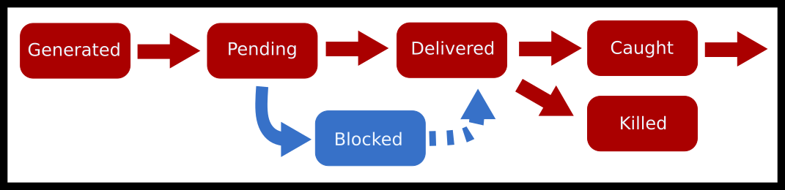

# 信号

信号是一种方便的方式，用于传递低优先级信息，并在其他方式不起作用时（例如标准输入被冻结）与用户程序交互。它们允许程序在事件发生时进行清理或执行操作。有时，程序可以选择忽略事件，这是受支持的。由于信号的处理方式，编写使用信号良好的程序是棘手的。因此，信号通常用于终止和清理。很少在编程逻辑中使用信号。

对于那些有建筑背景的你们来说，这里使用的中断并不是由硬件生成的中断。这些中断几乎总是由内核处理，因为它们需要更高级别的权限。相反，我们谈论的是由内核生成的软件中断——尽管它们可能是对硬件事件（如 SIGSEGV）的响应。

本章将介绍如何从已退出或被信号处理的进程读取信息。然后，它将深入探讨什么是信号，内核如何处理信号，以及进程如何处理信号的各种方式，无论是带线程还是不带线程。

## 信号深入探讨

信号允许一个进程异步地将事件或消息发送到另一个进程。如果该进程想要接受信号，它可以，然后，对于大多数信号，决定如何处理该信号。

首先，一些术语。信号处置是每个进程的属性，它决定了信号在**传递**后被如何处理。将其视为信号-动作对的表。完整的讨论在[手册页](http://man7.org/linux/man-pages/man7/signal.7.html)中。动作包括

1.  ，终止进程

1.  ，忽略

1.  ，生成核心转储

1.  ，停止一个进程

1.  ，继续一个进程

1.  执行自定义函数。

信号掩码确定特定信号是否被传递。内核发送信号的整体过程如下。

1.  如果没有信号到达，进程可以安装自己的信号处理程序。这告诉内核，当进程收到信号 X 时，它应该跳转到函数 Y。

1.  创建的信号处于“生成”状态。

1.  从信号生成到内核可以应用掩码规则之间的时间称为挂起状态。

1.  然后，内核会检查进程的信号掩码。如果掩码表明进程中的所有线程都在阻塞信号，那么信号目前被阻塞，直到某个线程解除阻塞之前不会发生任何事情。

1.  如果单个线程可以接受信号，那么内核将执行处置表中的操作。如果操作是默认操作，则不需要暂停任何线程。

1.  否则，内核通过停止特定线程当前正在执行的操作，并将该线程跳转到信号处理程序来传递信号。信号现在处于传递阶段。现在可以生成更多信号，但它们必须在信号处理程序完成之前传递，这时传递阶段才结束。

1.  最后，我们考虑如果进程在信号传递后仍然完好无损，则认为该信号已被捕获。

作为流程图



信号生命周期图

这里有一些你可能会看到的常见信号。

|c|c|c| 名称 & 可移植编号 & 默认动作 & 常用用途

SIGINT & 2 & 终止（可捕获）& 优雅地停止一个进程

SIGQUIT & 3 & 终止（可捕获）& 严厉地停止一个进程

SIGTERM & 15 & 终止进程 & 更严厉地停止一个进程

SIGSTOP & N/A & 停止进程（无法捕获）& 暂停一个进程

SIGCONT & N/A & 继续进程 & 停止后启动

SIGKILL & 9 & 终止进程（无法捕获）& 你希望进程消失

我们最喜欢的一个轶事是，出于众多原因，永远不要使用它。以下是从[链接到存档](http://porkmail.org/era/unix/award.html)摘录的内容。

> 不，不，不。不要使用 kill -9。
> 
> 它不会给进程一个干净的机会：
> 
> 1) 关闭套接字连接
> 
> 2) 清理临时文件
> 
> 3) 通知其子进程它即将离开
> 
> 4) 重置其终端特性
> 
> 等等。
> 
> 通常，发送 15，等待一秒钟或两秒钟，如果不起作用，发送 2，如果不起作用，发送 1。如果还不行，删除二进制文件，因为程序表现不佳！
> 
> 不要使用 kill -9。不要为了整理花盆而拿出联合收割机。

我们仍然保留它，以应对极端情况，其中进程需要消失。

## 发送信号

信号可以通过多种方式生成。

1.  用户可以发送一个信号。例如，你正在终端上，你按下了。也可以使用内置的命令来发送任何信号。

1.  系统可以发送一个事件。例如，如果一个进程访问了它不应该访问的页面，硬件会生成一个中断，该中断被内核拦截。内核找到导致此中断的进程，并发送一个软件中断信号。还有其他内核事件，比如创建子进程或进程需要恢复。

1.  最后，另一个进程可以发送消息。这可以用于进程之间低风险的事件通信。如果你依赖信号作为你程序中的驱动，你应该重新考虑你的应用程序设计。使用 POSIX/实时信号进行异步通信有很多缺点。处理进程间通信的最佳方式是使用，嗯，专门为你的任务设计的进程间通信方法。

你或另一个进程可以通过发送信号暂时暂停一个正在运行的进程。如果成功，它将冻结进程。进程将不再分配任何 CPU 时间。为了允许进程恢复执行，发送 SIGCONT 信号。例如，以下是一个程序，它每秒缓慢打印一个点，最多打印 59 个点。

```c
#include <unistd.h>
#include <stdio.h>
int main() {
 printf("My pid is %d\n", getpid() );
 int i = 60;
 while(--i) {
 write(1, ".",1);
 sleep(1);
 }
 write(1, "Done!",5);
 return 0;
}
```

我们首先在后台启动进程（注意末尾的&）。然后，通过使用 kill 命令从 shell 进程向它发送信号。

```c
$ ./program &
My pid is 403
...
$ kill -SIGSTOP 403
$ kill -SIGCONT 403
...
```

在 C 语言中，程序可以使用 POSIX 调用向子进程发送信号，

```c
kill(child, SIGUSR1); // Send a user-defined signal
kill(child, SIGSTOP); // Stop the child process (the child cannot prevent this)
kill(child, SIGTERM); // Terminate the child process (the child can prevent this)
kill(child, SIGINT); // The equivalent to CTRL-C (by default closes the process)
```

如上所述，shell 中也有一个可用的命令。另一个命令的工作方式完全相同，但它不是通过 PID 查找，而是尝试匹配进程的名称。是一个重要的实用工具，可以帮助你找到进程的 PID。

```c
# First let's use ps and grep to find the process we want to send a signal to
$ ps au | grep myprogram
angrave  4409   0.0  0.0  2434892    512 s004  R+    2:42PM   0:00.00 myprogram 1 2 3

#Send SIGINT signal to process 4409 (The equivalent of `CTRL-C`)
$ kill -SIGINT 4409

# Send SIGKILL (terminate the process)
$ kill -SIGKILL 4409
$ kill -9 4409
# Use kill all instead to kill a process by executable name
$ killall -l firefox
```

向正在运行的过程发送信号，使用或。

```c
raise(int sig); // Send a signal to myself!
kill(getpid(), int sig); // Same as above
```

对于非 root 进程，信号只能发送到同一用户的进程。你不能对任何进程发送 SIGKILL！更多详情。

## 处理信号

在信号处理程序内部的可执行代码有严格的限制。大多数库和系统调用都是不可重入的，这意味着它们不能在信号处理程序内部使用，因为它们不是可重入的。可重入安全性意味着你的函数可以在任何点被冻结并再次执行，你能保证你的函数不会失败吗？让我们看看以下

```c
int func(const char *str) {
 static char buffer[200];
 strncpy(buffer, str, 199);
 # Here is where we get paused
 printf("%s\n", buffer)
}
```

1.  我们执行 func("Hello")

1.  字符串被完全复制到缓冲区中 (strcmp(buffer, "Hello") == 0)

1.  当一个信号被传递并且函数状态被冻结时，我们也会停止接受任何新的信号，直到处理程序之后（我们这样做是为了方便）

1.  我们执行

1.  现在 (strcmp(buffer, "World") == 0) 并且输出缓冲区为 "World"。

1.  我们恢复中断的函数，现在再次打印出缓冲区 "World"，而不是函数调用最初打算的 "Hello"

通过移除共享缓冲区来保证你的函数是信号处理程序安全的并不能解决问题。你还必须考虑多线程和同步——当我双重锁定互斥锁时会发生什么？你还得确保每个函数调用都是可重入安全的。假设你的原始程序在执行库代码时被中断。malloc 使用的内存结构将不一致。在信号处理程序中使用，作为信号处理程序的一部分，是不安全的，并会导致**未定义行为**。避免这种行为的一种安全方式是设置一个变量，并让程序继续运行。设计模式也有助于我们设计能够接收两次信号并正确操作的程序。

```c
int pleaseStop ; // See notes on why "volatile sig_atomic_t" is better

void handle_sigint(int signal) {
 pleaseStop = 1;
}

int main() {
 signal(SIGINT, handle_sigint);
 pleaseStop = 0;
 while (!pleaseStop) {
 /* application logic here */
 }
 /* clean up code here */
}
```

上述代码在纸上可能看起来是正确的。然而，我们需要向编译器和将要执行循环的 CPU 核心提供提示。我们需要防止编译器优化。表达式在循环体中不会改变，因此一些编译器可能会将其优化为 TODO: 需要引用。其次，我们需要确保使用 CPU 寄存器来未缓存 的值，而不是总是从主内存中读取和写入。类型意味着变量的所有位都可以作为 - 单个不可中断操作来读取或修改。不可能读取由一些新位值和旧位值组成的值。

通过指定正确的类型 ，我们可以编写可移植的代码，其中主循环将在信号处理程序返回后退出。在大多数现代平台上，类型可以与一样大，但在嵌入式系统中可以小到 ，只能表示 (-127 到 127) 的值。

```c
volatile sig_atomic_t pleaseStop;
```

这种模式的两个例子可以在基于终端的 1Hz 4bit 计算机中找到（Šorn 2015）。使用两个布尔标志。一个用于标记（CTRL-C）的传递，并优雅地关闭程序，另一个用于标记信号以检测终端大小调整并重新绘制整个显示。

你也可以选择异步或同步地处理挂起的信号。要异步处理信号，请使用 。要同步捕获挂起的信号，请使用 ，它阻塞直到信号传递或它也阻塞并提供一个文件描述符，可以从中检索挂起的信号。

### Sigaction

你应该使用 而不是 ，因为它具有更好的语义定义。在不同的操作系统上做不同的事情是 **不好的**。 更具有可移植性，并且对线程来说定义得更好。你可以使用系统调用来设置信号或读取特定信号的当前处理程序和处置。

```c
int sigaction(int signum, const struct sigaction *act, struct sigaction *oldact);
```

sigaction 结构体包括两个回调函数（我们只看‘handler’版本），一个信号掩码和一个标志字段 -

```c
struct sigaction {
 void     (*sa_handler)(int);
 void     (*sa_sigaction)(int, siginfo_t *, void *);
 sigset_t   sa_mask;
 int        sa_flags;
};
```

假设你遇到了使用 . 的遗留代码。以下代码片段将其安装为 SIGALRM 处理程序。

```c
signal(SIGALRM, myhandler);
```

相当的代码是：

```c
struct sigaction sa;
sa.sa_handler = myhandler;
sigemptyset(&sa.sa_mask);
sa.sa_flags = 0;
sigaction(SIGALRM, &sa, NULL)
```

然而，我们通常也可以设置掩码和标志字段。掩码是在信号处理程序执行期间使用的临时信号掩码。如果服务信号的线程在系统调用中间被中断，标志将自动重新启动一些否则会因 EINTR 错误而提前返回的系统调用。后者意味着我们可以稍微简化一些代码，因为可能不再需要重启循环。

```c
sigfillset(&sa.sa_mask);
sa.sa_flags = SA_RESTART; /* Restart functions if interrupted by handler */
```

由于标志的选择性，通常更好的做法是让代码检查错误并自行重启。

## 阻塞信号

要阻塞信号，请使用 ! 使用 sigprocmask，您可以设置新的掩码，将新的被阻塞信号添加到进程掩码中，并取消当前被阻塞的信号。您还可以通过传递非空值给 oldset 来确定现有的掩码（并用于以后）。

```c
int sigprocmask(int how, const sigset_t *set, sigset_t *oldset);
```

从 sigprocmask 的 Linux 手册页中，以下是可能的值 TODO: 引用。

+   . 被阻塞的信号集合是当前集合和参数集合的并集。

+   . 从集合中移除的信号将不再属于当前被阻塞信号的集合。尝试取消一个未阻塞的信号是允许的。

+   . 被阻塞的信号集合设置为参数集合。

sigset 类型表现得像一个集合。在向集合中添加之前忘记初始化信号集合是一个常见的错误。

```c
sigset_t set, oldset;
sigaddset(&set, SIGINT); // Ooops!
sigprocmask(SIG_SETMASK, &set, &oldset)
```

正确的代码将集合初始化为全开或全关。例如，

```c
sigfillset(&set); // all signals
sigprocmask(SIG_SETMASK, &set, NULL); // Block all the signals which can be blocked

sigemptyset(&set); // no signals
sigprocmask(SIG_SETMASK, &set, NULL); // set the mask to be empty again
```

如果您使用 或 阻塞信号，则除非明确地传递给 TODO: 引用，否则注册给 的处理程序不会传递。

### Sigwait

Sigwait 可以一次读取一个挂起信号。用于同步等待信号，而不是在回调中处理信号。在多线程程序中 sigwait 的典型用法如下。请注意，首先设置了线程信号掩码（并且将被新线程继承）。掩码阻止信号被 *传递*，因此它们将保持挂起状态，直到 sigwait 被调用。请注意，sigwait 使用相同的集合变量 - 除了而不是设置被阻塞信号的集合外，它用作 sigwait 可以捕获并返回的信号集合。

与回调函数相比，编写自定义信号处理线程（如下面的示例所示）的一个优点是，您现在可以安全地使用更多 C 库和系统函数。

基于 sigmask 代码 (n.d.)

```c
static sigset_t signal_mask; /* signals to block */

int main(int argc, char *argv[]) {
 pthread_t sig_thr_id; /* signal handler thread ID */
 sigemptyset (&signal_mask);
 sigaddset (&signal_mask, SIGINT);
 sigaddset (&signal_mask, SIGTERM);
 pthread_sigmask (SIG_BLOCK, &signal_mask, NULL);

 /* New threads will inherit this thread's mask */
 pthread_create (&sig_thr_id, NULL, signal_thread, NULL);

 /* APPLICATION CODE */
 ...
}

void *signal_thread(void *arg) {
 int sig_caught;

 /* Use the same mask as the set of signals that we'd like to know about! */
 sigwait(&signal_mask, &sig_caught);
 switch (sig_caught) {
 case SIGINT:
 ...
 break;
 case SIGTERM:
 ...
 break;
 default:
 fprintf (stderr, "\nUnexpected signal %d\n", sig_caught);
 break;
 }
}
```

## 子进程和线程中的信号

这是对进程章节的回顾。在派生之后，子进程继承了父进程的信号处理和信号掩码的副本。如果您在派生之前安装了 SIGINT 处理程序，那么如果向子进程发送 SIGINT，子进程也将调用处理程序。如果父进程中阻塞了 SIGINT，它将在子进程中同样被阻塞。请注意，在派生期间，子进程的挂起信号不会被继承。然而，之后，只有信号掩码和挂起信号会被携带过来（“执行文件”，n.d.）。信号处理程序被重置为其原始操作，因为原始处理程序代码可能随着旧进程一起消失。

每个线程都有自己的掩码。新线程会继承调用线程的掩码副本。在初始化时，调用线程的掩码与进程掩码完全相同。然而，在创建新线程之后，进程的信号掩码变成了灰色区域。相反，内核喜欢将进程视为线程的集合，每个线程都可以设置自己的信号掩码并接收信号。要开始设置您的掩码，您可以使用，

```c
pthread_sigmask(...); // set my mask to block delivery of some signals
pthread_create(...); // new thread will start with a copy of the same mask
```

在多线程程序中阻塞信号与单线程程序中的阻塞信号类似，以下是对应的翻译。

1.  使用代替

1.  在所有线程中阻塞一个信号以防止其异步传递

确保在所有线程中阻塞信号的最简单方法是在创建新线程之前在主线程中设置信号掩码。

```c
sigemptyset(&set);
sigaddset(&set, SIGQUIT);
sigaddset(&set, SIGINT);
pthread_sigmask(SIG_BLOCK, &set, NULL);

// this thread and the new thread will block SIGQUIT and SIGINT
pthread_create(&thread_id, NULL, myfunc, funcparam);
```

正如我们所看到的，包括一个‘how’参数，它定义了信号集的使用方式：

```c
pthread_sigmask(SIG_SETMASK, &set, NULL) - replace the thread's mask with given signal set
pthread_sigmask(SIG_BLOCK, &set, NULL) - add the signal set to the thread's mask
pthread_sigmask(SIG_UNBLOCK, &set, NULL) - remove the signal set from the thread's mask
```

然后，可以将信号传递给任何愿意接受该信号的信号线程。如果有两个或更多线程可以接收该信号，那么哪个线程将被中断是任意的！常见的做法是有一个可以接收所有信号的线程，或者如果有特定的信号需要特殊逻辑，为多个信号拥有多个线程。即使外部程序不能向特定线程发送信号，你仍然可以使用 . 在下面的示例中，新创建的执行线程将被

```c
pthread_create(&tid, NULL, func, args);
pthread_kill(tid, SIGINT);
pthread_kill(pthread_self(), SIGKILL); // send SIGKILL to myself
```

作为警告，将杀死整个进程。尽管个别线程可以设置信号掩码，但信号处理是*按进程*而不是*按线程*的。这意味着可以从任何线程调用，因为你会为进程中的所有线程设置信号处理程序。

Linux 手册页在第二部分讨论了信号系统调用。在第七部分还有一个更长的文章（尽管不在 OSX/BSD 中）：

```c
man -s7 signal
```

## 主题

+   信号

+   信号处理程序安全性

+   信号处理

+   信号状态

+   在 Fork/Exec 时的挂起信号

+   Fork/Exec 时的信号处理

+   在 C 中提升信号

+   在多线程程序中提升信号

## 问题

+   什么是信号？

+   在 UNIX 下如何处理信号？（加分：Windows 下又是如何？）

+   函数是信号处理程序安全性的含义是什么？关于可重入性又是如何的？

+   进程信号处理是什么？它与掩码有何不同？

+   在单线程程序中，哪个函数会改变信号处理？在多线程程序中又是如何的？

+   使用信号有哪些缺点？

+   异步和同步捕获信号的方法有哪些？

+   Fork 后、exec 后挂起的信号会发生什么？我的信号掩码呢？信号处理呢？

+   内核从创建到传递/阻塞的过程是什么？
