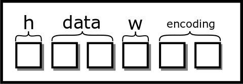
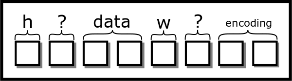

# 附录

## Shell

实际上，shell 是您与系统交互的方式。在用户友好的操作系统出现之前，当计算机启动时，您所能访问的只有 shell。这意味着您所有的命令和编辑都必须以这种方式完成。如今，我们的计算机以桌面模式启动，但您仍然可以通过终端访问 shell。

```c
(Stuff) $
```

它已准备好接收您的下一个命令！您可以在 shell 中输入许多 Unix 工具，如`ls`和`grep`，shell 将执行它们并给出结果。其中一些是所谓的内建命令，即代码在 shell 程序本身中。还有一些是编译后的程序，您运行它们。shell 只通过一个名为 path 的特殊变量进行查找，该变量包含一系列以冒号分隔的路径，用于搜索具有您名称的可执行文件，以下是一个示例路径。

```c
$ echo $PATH
/usr/local/sbin:/usr/local/bin:/usr/sbin:
/usr/bin:/sbin:/bin:/usr/games:/usr/local/games
```

因此，当 shell 执行`.`时，它会遍历所有这些目录，找到并执行它。

```c
$ ls
...
$ /bin/ls
```

您始终可以通过完整路径来调用。这就是为什么在过去的课程中，如果您想在终端上运行某些东西，您通常必须这样做，因为您正在工作的目录通常不在变量中。`.`代表您的当前目录，而 shell 执行的是一条有效命令。

### Shell 技巧和提示

+   上箭头会获取您最近的命令

+   将搜索您之前运行的命令

+   将中断您的 shell 进程

+   将执行最后一条命令

+   回退那么多命令并运行它们

+   运行具有该前缀的最后一条命令

+   是上一个命令的最后一个参数

+   是上一个命令的所有参数

+   将最后一个命令中的模式`pat`替换为替换`sub`

+   进入上一个目录

+   将当前目录推送到栈上并`cds`

+   `cds`到栈顶的目录

### 什么是终端？

终端是一个显示 shell 输出的应用程序。您可以使用默认的终端、基于 quake 的终端、terminator 等，选项无穷无尽！

### 常用工具

1.  连接多个文件。它通常用于将文件内容打印到终端，但其原始用途是连接。

    ```c
    $ cat file.txt
    ...
    $ cat shakespeare.txt shakespeare.txt > two_shakes.txt
    ```

1.  告诉您两个文件之间的差异。如果没有打印任何内容，则返回零，表示文件在每个字节上都是相同的。否则，将打印出最长公共子序列的差异。

    ```c
    $ cat prog.txt
    hello
    world
    $ cat adele.txt
    hello
    it's me
    $ diff prog.txt prog.txt
    $ diff shakespeare.txt shakespeare.txt
    2c2
    < world
    ---
    > it's me
    ```

1.  告诉您文件或标准输入中的哪些行与 POSIX 模式匹配。

    ```c
    $ grep it adele.txt
    it's me
    ```

1.  告诉您当前目录中有哪些文件。

1.  这是一个 shell 内建命令，但它会改变到相对或绝对目录

    ```c
    $ cd /usr
    $ cd lib/
    $ cd -
    $ pwd
    /usr/
    ```

1.  每个系统程序员的 favorite 命令会告诉您更多关于您所有 favorite 函数的信息！

1.  根据 makefile 执行程序。

### 语法

壳有很多有用的工具，比如使用重定向将一些输出保存到文件。这会从文件开头覆盖文件。如果你只想追加到文件，你可以使用。Unix 还允许文件描述符交换。这意味着你可以将一个文件描述符的输出取走，并使其看起来像是从另一个文件描述符输出的。最常见的一个是，这意味着取走 stderr 并使其看起来像是从标准输出输出的。这很重要，因为当你使用时，它们只写入文件的标准输出。下面有一些例子。

```c
$ ./program > output.txt # To overwrite
$ ./program >> output.txt # To append
$ ./program 2>&1 > output_all.txt # stderr & stdout
$ ./program 2>&1 > /dev/null # don't care about any output
```

管道运算符有着迷人的历史。UNIX 哲学是编写小的程序并将它们连接起来以完成新的和有趣的事情。在早期，硬盘空间有限，写入速度慢。Brian Kernighan 想要保持这种哲学，同时省略掉占用硬盘空间的中间文件。因此，UNIX 管道应运而生。管道将左侧程序的输出取走并喂给右侧程序的输入。考虑命令 `ls | grep file`。它可以作为重定向运算符的替代品，因为 tee 会同时写入文件并输出到标准输出。它还有额外的优点，即它不需要是列表中的最后一个命令。这意味着，你可以写入一个中间结果并继续你的管道操作。

```c
$ ./program | tee output.txt # Overwrite
$ ./program | tee -a output.txt # Append
$ head output.txt | wc | head -n 1 # Multi pipes
$ ((head output.txt) | wc) | head -n 1 # Same as above
$ ./program | tee intermediate.txt | wc
```

`&&` 和 `||` 是按顺序执行命令的运算符。`&&` 只有在之前的命令成功时才会执行命令，并且总是执行下一个命令。

```c
$ false && echo "Hello!"
$ true && echo "Hello!"
$ false || echo "Hello!"
```

### 环境变量是什么？

每个进程都有自己的环境变量字典，这些变量会被复制到子进程中。这意味着，如果父进程更改了它们的变量，这些变量不会传递给子进程，反之亦然。这在 fork-exec-wait 三部曲中很重要，如果你想要以与父进程（或任何其他进程）不同的环境变量执行程序。

例如，你可以编写一个 C 程序，遍历所有时区并执行打印所有本地日期和时间的命令。环境变量被用于各种程序，因此修改它们很重要。

#### 结构打包

结构可能需要一种叫做[填充](http://www.catb.org/esr/structure-packing/)（教程）的东西。**我们并不期望你在本课程中打包结构，但要知道编译器会执行它**。这是因为早期（甚至现在）在内存中加载地址是在 32 位或 64 位块中发生的。这也意味着请求的地址必须是块大小的倍数。

```c
struct picture{
 int height;
 pixel** data;
 int width;
 char* encoding;
}
```

你认为图片看起来像这样。一个盒子是四个字节。



六个盒子的结构

[图：clean_struct]

然而，使用结构打包，从概念上看起来是这样的：

```c
struct picture{
 int height;
 char slop1[4];
 pixel** data;
 int width;
 char slop2[4];
 char* encoding;
}
```

从视觉上看，我们会在我们的图中添加两个额外的盒子



八个盒子的结构，两个盒子的冗余

[图：sloppy_struct]

这种填充在 64 位系统上很常见。在其他时候，如果处理器支持非对齐访问，那么编译器就可以打包结构体。这意味着什么？我们可以让变量从一个非 64 位边界开始。处理器将处理其余部分。为了启用此功能，设置一个属性。

```c
struct __attribute__((packed, aligned(4))) picture{
 int height;
 pixel** data;
 int width;
 char* encoding;
}
```

现在我们的图将看起来像图[[fig:clean_struct]](ch017.xhtml#fig:clean_struct)中的干净结构体。但现在，每次处理器需要访问或时，都需要两次内存访问。一个可能的替代方案是重新排序结构体。

```c
struct picture{
 int height;
 int width;
 pixel** data;
 char* encoding;
}
```

## 栈溢出

每个线程使用一个栈内存。栈‘向下增长’ - 如果一个函数调用另一个函数，那么栈就会扩展到较小的内存地址。栈内存包括非静态自动（临时）变量、参数值和返回地址。如果缓冲区太小，某些数据（例如用户输入的值），那么其他栈变量甚至返回地址被覆盖的可能性是真实的。栈内容的精确布局和自动变量的顺序取决于架构和编译器。通过一点调查工作，我们可以了解如何故意针对特定架构破坏栈。

下面的示例演示了返回地址是如何存储在栈上的。对于特定的 32 位架构[Live Linux Machine](http://cs-education.github.io/sys/)，我们确定返回地址存储在自动变量地址之上的两个指针（8 字节）位置。代码故意更改栈值，以便当输入函数返回时，而不是在主方法内部继续执行，它将跳转到漏洞函数。

```c
// Overwrites the return address on the following machine:
// http://cs-education.github.io/sys/
#include <stdio.h>
#include <stdlib.h>
#include <unistd.h>

void breakout() {
 puts("Welcome. Have a shell...");
 system("/bin/sh");
}
void input() {
 void *p;
 printf("Address of stack variable: %p\n", &p);
 printf("Something that looks like a return address on stack: %p\n", *((&p)+2));
 // Let's change it to point to the start of our sneaky function.
 *((&p)+2) = breakout;
}
int main() {
 printf("main() code starts at %p\n",main);

 input();
 while (1) {
 puts("Hello");
 sleep(1);
 }

 return 0;
}
```

计算机绕过这种限制的方法有很多种。

## 编译和链接

这是从你编译程序到运行程序的高层次概述。我们通常知道编译程序是容易的。你通过 IDE 或终端运行程序，它就正常工作了。

```c
$ cat main.c
#include <stdio.h>

int main() {
 printf("Hello World!\n");
 return 0;
}
$ gcc main.c -o main
$ ./main
Hello World!
$
```

这里是使用 gcc 编译的粗略阶段。

1.  预处理：预处理器扩展所有预处理指令。

1.  解析：编译器解析文本文件以查找函数声明、变量声明等。

1.  生成汇编代码：如果启用了优化，编译器随后为所有函数生成汇编代码。

1.  汇编：汇编器将汇编代码转换为 0 和 1，并创建一个目标文件。这个目标文件将名称映射到代码片段。

1.  静态链接：链接器随后会处理一系列对象和静态库，并解决从一个对象文件到另一个对象文件的变量和函数引用。链接器接着找到主方法，将其作为函数的入口点。链接器还会注意到某个函数打算进行动态链接。编译器还会在可执行文件中创建一个部分，告诉操作系统这些函数在运行前需要地址。

1.  动态链接：当程序准备执行时，操作系统会查看程序需要的库，并将这些函数链接到动态库中。

1.  程序开始运行。

以后的课程将教你关于解析和汇编——预处理是解析的扩展。大多数课程不会教你关于两种不同类型的链接。静态链接库类似于合并对象文件。要创建静态库，编译器将不同的对象文件组合成一个可执行文件。静态库实际上是对象文件的归档。这些库在你希望可执行文件安全、你知道被包含到可执行文件中的所有代码，以及可移植时很有用，这意味着所有代码都捆绑到你的可执行文件中，不需要额外安装。

另一种类型是动态库。通常，动态库是在用户范围或系统范围内安装的，并且大多数程序都可以访问。动态库的函数在运行前填充。这种方式有许多好处。

+   对于像 C 标准库这样的常用库，代码占用空间更小。

+   晚期绑定意味着更通用的代码和更少依赖于特定行为。

+   区分意味着在保持可执行文件不变的情况下，可以更新共享库。

同时也存在一些缺点。

+   所有代码不再捆绑到你的程序中。这意味着用户必须安装其他东西。

+   其他代码中可能存在安全漏洞，导致你的程序出现安全漏洞。

+   标准 Linux 允许你“替换”动态库，这可能导致可能的社会工程攻击。

+   这给应用程序增加了额外的复杂性。两个具有不同共享库的二进制文件可能会导致不同的结果。

#### 关于 Fork-FILE 问题的解释

要解析[POSIX 文档](http://pubs.opengroup.org/onlinepubs/9699919799.2008edition/functions/V2_chap02.html)，我们必须深入研究术语。设定期望的句子如下

> 函数调用涉及任何单个句柄（“活动句柄”）的结果在本卷 POSIX.1-2008 的其他地方定义，但如果使用两个或更多句柄，并且其中任何一个是一个流，则应用程序应确保它们的行为协调，如下所述。如果没有这样做，结果是不确定的。

这意味着，如果我们使用两个文件描述符时没有完全遵循 POSIX 规范，而这些文件描述符跨进程引用相同的描述符，那么我们得到的是未定义的行为。从技术角度讲，文件描述符必须有一个“位置”的含义，这意味着它需要有一个开始和结束，就像文件一样，而不是像任意字节流一样。POSIX 然后引入了活动句柄的概念，其中句柄可以是文件描述符或指针。文件句柄没有名为“活动”的标志。一个活动文件描述符是指当前正在用于读取、写入和其他操作（如）的文件描述符。标准指出，在执行之前，*应用程序*或您的代码必须执行一系列步骤来准备文件的状态。用简单的话说，描述符需要关闭、刷新或读取到其全部内容——详细的细节将在后面解释。

> 为了使句柄变为活动句柄，应用程序应确保在句柄的最后一次使用（当前活动句柄）和第二次句柄（未来的活动句柄）的第一次使用之间执行以下操作。然后第二个句柄变为活动句柄。在第一个句柄再次成为活动文件句柄之前，应用程序影响第一个句柄上的文件偏移量的所有活动都应暂停。（如果流函数的底层函数会影响文件偏移量，则流函数应被视为影响文件偏移量。）

总结来说，如果两个文件描述符正在被积极使用，其行为是未定义的。另一个注意事项是，在 fork 之后，库代码必须将文件描述符准备成好像其他进程可能在任何时间将其激活一样。最后一个要点关注的是在我们的情况下，进程如何准备文件描述符。

> 如果流以允许读取的模式打开，并且底层打开的文件描述符引用的设备能够进行定位，则应用程序必须执行 fflush()，或者关闭流。

文档说明，子进程需要执行一个 fflush 或关闭流，因为文件描述符需要准备，以防父进程需要使其活跃。如果 glibc 关闭了父进程可能期望保持打开的文件描述符，那么它将陷入一个无法赢的局面，因此它会在退出时选择执行 fflush，因为在 POSIX 术语中，退出被视为访问文件。这意味着对于我们的父进程，这个条款会被触发。

> 如果任何先前活动句柄已被一个明确更改文件偏移量的函数使用，除了如上所述为第一个句柄所要求之外，应用程序应执行 lseek() 或 fseek()（根据句柄类型适当选择）到适当的位置。

由于孩子调用了 fflush 而父进程没有准备，操作系统会选择将文件重置的位置。不同的文件系统会执行不同的操作，这些操作都得到了标准的支持。操作系统可能会查看修改时间并得出结论，文件没有变化，因此不需要重置，或者得出退出表示变化的结论，需要将文件回滚到开始位置。

## 银行家算法

我们可以从单个资源银行家算法开始。考虑一个银行家，她拥有有限数量的金钱。拥有有限数量的金钱，她想要发放贷款并最终收回她的钱。假设我们有一组 <semantics><mi>n</mi><annotation encoding="application/x-tex">n</annotation></semantics> 个人，其中每个人都需要获得一定数量的或限制的 <semantics><msub><mi>a</mi><mi>i</mi></msub><annotation encoding="application/x-tex">a_i</annotation></semantics> (<semantics><mi>i</mi><annotation encoding="application/x-tex">i</annotation></semantics> 是第 <semantics><mi>i</mi><annotation encoding="application/x-tex">i</annotation></semantics> 个进程) 才能开始工作。银行家跟踪她给每个人的金额 <semantics><msub><mi>l</mi><mi>i</mi></msub><annotation encoding="application/x-tex">l_i</annotation></semantics>。她始终保留一定数量的金钱 <semantics><mi>p</mi><annotation encoding="application/x-tex">p</annotation></semantics>。人们为了请求金钱，会执行以下操作：考虑系统在时间 <semantics><mi>t</mi><annotation encoding="application/x-tex">t</annotation></semantics> 的状态 <semantics><mrow><mo stretchy="false" form="prefix">(</mo><mi>A</mi><mo>=</mo><mo stretchy="false" form="prefix">{</mo><msub><mi>a</mi><mn>1</mn></msub><mo>,</mo><msub><mi>a</mi><mn>2</mn></msub><mo>,</mo><mi>.</mi><mi>.</mi><mi>.</mi><mo stretchy="false" form="postfix">}</mo><mo>,</mo><msub><mi>L</mi><mi>t</mi></msub><mo>=</mo><mo stretchy="false" form="prefix">{</mo><msub><mi>l</mi><mrow><mi>t</mi><mo>,</mo><mn>1</mn></mrow></msub><mo>,</mo><msub><mi>l</mi><mrow><mi>t</mi><mo>,</mo><mn>2</mn></mrow></msub><mo>,</mo><mi>.</mi><mi>.</mi><mi>.</mi><mo stretchy="false" form="postfix">}</mo><mo>,</mo><mi>p</mi><mo stretchy="false" form="postfix">)</mo></mrow><annotation encoding="application/x-tex">(A=\{a_1, a_2, ...\}, L_t=\{l_{t,1}, l_{t,2}, ...\}, p)</annotation></semantics>。一个先决条件是，我们拥有 <semantics><mrow><mi>p</mi><mo>≥</mo><mi>m</mi><mi>i</mi><mi>n</mi><mo stretchy="false" form="prefix">(</mo><mi>A</mi><mo stretchy="false" form="postfix">)</mo></mrow><annotation encoding="application/x-tex">p \geq min(A)</annotation></semantics>，或者我们有足够的钱来满足至少一个人。此外，每个人将工作一段有限的时间并归还我们的钱。

+   一个人 <semantics><mi>j</mi><annotation encoding="application/x-tex">j</annotation></semantics> 向我请求 <semantics><mi>m</mi><annotation encoding="application/x-tex">m</annotation></semantics>。

    +   如果 <semantics><mrow><mi>m</mi><mo>≥</mo><mi>p</mi></mrow><annotation encoding="application/x-tex">m \geq p</annotation></semantics>，他们将被拒绝。

    +   如果 <semantics><mrow><mi>m</mi><mo>+</mo><msub><mi>l</mi><mi>j</mi></msub><mo>></mo><msub><mi>a</mi><mi>i</mi></msub></mrow><annotation encoding="application/x-tex">m + l_j > a_i</annotation></semantics> 他们将被拒绝

    +   假设我们处于一个新的状态 <semantics><mrow><mo stretchy="false" form="prefix">(</mo><mi>A</mi><mo>,</mo><msub><mi>L</mi><mrow><mi>t</mi><mo>+</mo><mn>1</mn></mrow></msub><mo>=</mo><mo stretchy="false" form="prefix">{</mo><mi>.</mi><mi>.</mi><mo>,</mo><msub><mi>l</mi><mrow><mi>t</mi><mo>+</mo><mn>1</mn><mo>,</mo><mi>j</mi></mrow></msub><mo>=</mo><msub><mi>l</mi><mrow><mi>t</mi><mo>,</mo><mi>j</mi></mrow></msub><mo>+</mo><mi>m</mi><mo>,</mo><mi>.</mi><mi>.</mi><mi>.</mi><mo stretchy="false" form="postfix">}</mo><mo>,</mo><mi>p</mi><mo>−</mo><mi>m</mi><mo stretchy="false" form="postfix">)</mo></mrow><annotation encoding="application/x-tex">(A, L_{t+1}=\{.., l_{t+1, j} = l_{t, j} + m, ...\}, p - m)</annotation></semantics> 其中进程被赋予了资源。

+   如果现在的人 <semantics><mi>j</mi><annotation encoding="application/x-tex">j</annotation></semantics> 已经满足（<semantics><mrow><msub><mi>l</mi><mrow><mi>t</mi><mo>+</mo><mn>1</mn><mo>,</mo><mi>j</mi></mrow></msub><mo>=</mo><mo>=</mo><msub><mi>a</mi><mi>j</mi></msub></mrow><annotation encoding="application/x-tex">l_{t+1,j} == a_j</annotation></semantics>）或者 <semantics><mrow><mi>m</mi><mi>i</mi><mi>n</mi><mo stretchy="false" form="prefix">(</mo><msub><mi>a</mi><mi>i</mi></msub><mo>−</mo><msub><mi>l</mi><mrow><mi>t</mi><mo>+</mo><mn>1</mn><mo>,</mo><mi>i</mi></mrow></msub><mo stretchy="false" form="postfix">)</mo><mo>≤</mo><mi>p</mi></mrow><annotation encoding="application/x-tex">min(a_i - l_{t+1, i}) \leq p</annotation></semantics>。换句话说，我们还有足够的钱来满足另一个人。如果满足任何一个条件，则认为交易安全并给予他们钱。

为什么这行得通呢？好吧，一开始我们处于一个安全状态——定义为我们有足够的钱至少满足一个人。这些“贷款”中的每一个都导致一个安全状态。如果我们用尽了储备，一个人在工作并会给我们比我们之前的“贷款”更多的或相等的钱，从而再次让我们处于安全状态。由于我们总是可以做出一个额外的动作，系统永远不会发生死锁。现在，没有保证系统不会发生活锁。如果我们希望请求某事的进程永远不会这样做，那么就不会有任何工作完成——但这不是由于死锁。这个类比可以扩展到更高的数量级，但要求一个进程可以完全完成其工作，或者存在一个进程，其资源的组合可以满足，这使得算法稍微复杂一些（一个额外的循环），但没有什么太大的问题。有一些显著的缺点。

+   程序首先需要知道每个进程需要多少每种资源。很多时候这是不可能的，或者进程请求了错误数量的资源，因为程序员没有预见这一点。

+   系统可能会发生活锁。

+   我们知道在大多数系统中资源是变化的，比如管道和套接字。这意味着算法的运行时间可能会对拥有数百万资源的系统很慢。

+   此外，这个算法无法跟踪资源的来去。一个进程可能作为副作用删除资源或创建资源。算法假设静态分配，并且每个进程执行非破坏性操作。

## 清洁/脏叉子（Chandy/Misra 解决方案）

还有更多高级解决方案。其中一种解决方案是由 Chandy 和 Misra 提出的（Chandy and Misra 1984）。这不是真正解决就餐哲学家问题的方案，因为它要求哲学家之间可以相互交谈。这是一个确保某种公平性的解决方案。本质上，它定义了一系列哲学家必须在一个回合中吃完，然后才能进入下一个回合的回合。

我们在这里不会详细说明证明过程，因为它稍微复杂一些，但您可以随时阅读更多内容。

## 行为模型

行为模型是另一种形式的同步，它不需要进行锁协商或等待。这个想法很简单。每个行为者可以执行工作、创建更多行为者、发送消息或响应消息。每当一个行为者需要从另一个行为者那里得到某些东西时，它会发送一个消息。最重要的是，一个行为者只负责一件事情。如果我们正在实现一个现实世界应用，我们可能有一个处理数据库的行为者，一个处理传入连接的行为者，一个服务连接的行为者等。这些行为者会相互传递消息，比如“有一个新的连接”从传入连接行为者到服务行为者。服务行为者可能向数据库行为者发送数据请求消息，并返回数据响应消息。

虽然这似乎是一个完美的解决方案，但也有一些缺点。第一个缺点是实际的通信库需要同步。如果你没有现成的框架来做这件事——比如消息传递接口（Message Passing Interface，简称 MPI）或高性能计算中的 MPI——那么框架将不得不被构建，而且很可能构建一个高效框架的工作量与直接同步相当。此外，现在消息在序列化和反序列化时遇到了额外的开销，至少是额外的开销。最后一个缺点是，一个演员可能需要任意长的时间来响应一条消息，这促使需要影子演员来处理相同的工作。

正如之前提到的，有一些框架，如基于演员模型的[消息传递接口](https://en.wikipedia.org/wiki/Message_Passing_Interface)，它允许高性能计算中的分布式系统有效地工作，但效果可能会有所不同。如果你想进一步了解这个模型，请随意浏览以下列出的维基百科页面。[关于演员模型的进一步阅读](https://en.wikipedia.org/wiki/Actor_model)

## 包含和条件

另一个预处理器包含是指令和条件。包含指令通过示例进行解释。

```c
// foo.h
int bar();
```

这是我们的未预处理文件。

```c
#include "foo.h"
int bar() {
}
```

预处理之后，编译器看到的是这个。

```c
// foo.c unpreprocessed
int bar();

int bar() {

}
```

另一个工具是预处理器条件。如果一个宏被定义或为真值，那么就选择这个分支。

```c
int main() {
 #ifdef __GNUC__
 return 1;
 #else
 return 0;
 #endif
}
```

使用你的编译器会对源代码进行预处理，生成以下内容。

```c
int main() {
 return 1;
}
```

使用你的编译器会对源代码进行预处理。

```c
int main() {
 return 0;
}
```

### 线程调度

有几种方法可以将工作分割开来。这些方法在 OpenMP 框架中很常见（Silberschatz, Galvin, 和 Gagne 2005）。

+   将问题分解成固定大小的块（预先确定的），并且让每个线程处理每个块。当每个子问题花费的时间大致相同的时候，这种方法很有效，因为没有额外的开销。你只需要写一个循环，并将映射函数给每个子数组。

+   当一个新问题出现需要线程来处理时，这是很有用的。当你不知道调度需要多长时间时，这种方法特别有用。

+   这是一种结合了上述方法，并混合了优点和权衡的方法。你从静态调度开始，如果需要的话，慢慢过渡到动态调度。

+   你根本不知道问题需要多长时间。与其自己决定，不如让程序决定该做什么！

虽然不需要记住任何调度例程。OpenMP 是一个标准，是 pthreads 的替代品。例如，以下是如何并行化一个 for 循环的示例。

```c
#pragma omp parallel for
for (int i = 0; i < n; i++) {
 // Do stuff
}

// Specify the scheduling as follows
// #pragma omp parallel for scheduling(static)
```

静态调度会将问题分解成固定大小的块。动态调度会在循环结束后分配一个任务。引导调度是动态的，带有块。运行时间是整个一锅杂烩。

## threads.h

我们在额外部分讨论了许多线程库。我们有标准的 POSIX 线程，OpenMP 线程，我们还有一个新的 C11 线程库，它是标准的一部分。这个库提供了受限功能。

为什么使用受限功能？关键在于名称。由于这是 C 标准库，它必须在所有兼容的操作系统（几乎所有的操作系统）中实现。这意味着在使用线程时具有一等可移植性。

我们不会对函数进行冗长的讨论。它们大多数只是 pthread 函数的重命名。如果你问为什么我们不教授这些，有几个原因

1.  它们相当新。尽管标准大约在 2011 年发布，但 POSIX 线程已经存在很长时间了。它们的大多数怪癖已经被消除。

1.  你会失去表达性。这是一个我们将在后续章节中讨论的概念，但当你使某物可移植时，你会失去一些与主机硬件的表达性。这意味着 threads.h 库相当基础。很难设置 CPU 亲和性。一起调度线程。为了性能原因，有效地查看内部结构。

1.  许多遗留代码已经考虑了 POSIX 线程。其他库如 OpenMP、CUDA、MPI 将要么使用 POSIX 进程或 POSIX 线程，对 Windows 的移植则有些勉强。

## 现代文件系统

尽管大多数文件系统的 API 在 POSIX 上多年来保持不变，但实际的文件系统本身提供了许多重要的方面。

+   数据完整性。文件系统使用日志记录和有时使用校验和来确保写入的数据是有效的。日志记录是一种简单的发明，其中文件系统将操作写入日志。如果在操作完成之前文件系统崩溃，它可以在再次启动时使用部分日志恢复操作。

+   缓存。Linux 在缓存文件系统操作方面做得很好，比如查找 inode。这使得磁盘操作看起来几乎是瞬间的。如果你想看到一个慢速的系统，看看使用 FAT/NTFS 的 Windows。磁盘操作需要由应用程序缓存，否则它将耗尽 CPU。

+   速度。在旋转磁盘机器上，位于金属盘末尾的数据将旋转得更快（角速度离中心更远）。程序利用这一点来减少在视频编辑软件中加载大型文件（如电影）的时间。SSD 没有这个问题，因为没有旋转磁盘，但它们会从它们的空间中划分出一部分作为“交换空间”用于文件。

+   并行性。具有多个头（用于物理硬盘）或多个控制器（用于 SSD）的文件系统可以通过复用 PCIe 插槽中的数据来利用并行性，始终在可能的情况下为应用程序提供服务。

+   加密。数据可以使用一个或多个密钥进行加密。苹果的 APFS 文件系统是一个很好的例子。

+   冗余。有时数据可以复制到块中，以确保数据始终可用。

+   高效备份。我们中许多人由于各种原因无法将数据存储在云上。当文件系统被用作备份介质或作为备份的来源时，能够高效地计算更改内容、压缩文件以及在外部驱动器之间同步是非常有用的。

+   完整性和可启动性。文件系统需要能够抵御位翻转。大多数读者都将操作系统安装在与其用于不同操作的文件系统相同的分区上。文件系统需要确保随机的读取或写入不会破坏引导扇区——这意味着你的计算机无法再次启动。

+   碎片化。就像内存分配器一样，为文件分配空间会导致内部和外部碎片化。当单个文件的磁盘块相邻时，也会出现相同的缓存优势。文件系统需要在低、高以及可能的碎片化使用下表现良好。

+   分布式。有时，文件系统应该能够容忍单机故障。Hadoop 和其他分布式文件系统允许你做到这一点。

### 切边文件系统

现在有一些文件系统硬件确实是真正的前沿技术。我们简要想提到的就是 AMD 的 StoreMI。我们并不是在试图推销 AMD 芯片组，但 StoreMI 的功能集值得提及。

StoreMI 是一个硬件微控制器，它分析操作系统如何访问文件，并将文件/块移动到一起以加快加载时间。一个常见的用法可以想象为拥有一个快速但容量小的 SSD 和一个较慢但容量大的 HDD。为了让所有文件看起来都存储在 SSD 上，StoreMI 会匹配文件访问模式。如果你正在启动 Windows，Windows 通常会按相同的顺序访问许多文件。StoreMI 会注意到这一点，当微控制器发现它正在启动时，它会在操作系统请求之前将文件从 HDD 驱动器移动到 SSD。到操作系统需要它们的时候，它们已经在 SSD 上了。StoreMI 也会对其他应用程序做同样的事情。这项技术还有很多需要改进的地方，但它是一个有趣的数据和模式匹配与文件系统的交汇点。

## Linux 调度

截至 2016 年 2 月，Linux 默认使用*完全公平调度器*进行 CPU 调度，以及预算公平调度“BFQ”进行 I/O 调度。适当的调度可以显著影响吞吐量和延迟。延迟对于交互式和软实时应用（如音频和视频流）非常重要。有关更多信息，请参阅[此处](https://lkml.org/lkml/2014/5/27/314)的讨论和比较基准。

这里是 CFS 如何安排的

+   CPU 创建一个红黑树，包含进程的虚拟运行时间（运行时间/优先级值）和睡眠公平性标志——如果进程正在等待某物，当它完成等待时给它 CPU。

+   优先级值是内核为某些进程提供优先级的方式，优先级值越低，优先级越高。

+   内核根据这个指标选择最低的值，并将该进程调度为下一个运行，将其从队列中移除。由于红黑树是自平衡的，这个操作保证了 <semantics><mrow><mi>O</mi><mo stretchy="false" form="prefix">(</mo><mi>l</mi><mi>o</mi><mi>g</mi><mo stretchy="false" form="prefix">(</mo><mi>n</mi><mo stretchy="false" form="postfix">)</mo><mo stretchy="false" form="postfix">)</mo></mrow><annotation encoding="application/x-tex">O(log(n))</annotation></semantics>（选择最小进程的运行时间相同）

尽管它被称为公平调度器，但确实存在不少问题。

+   被调度的进程组可能会有不平衡的负载，因此调度器大致分配负载。当另一个 CPU 空闲时，它只能查看一个组调度平均负载，而不是单个核心。因此，空闲 CPU 可能不会从平均负载良好的 CPU 那里获取工作。

+   如果一组进程在非相邻的核心上运行，则存在一个错误。如果两个核心相距超过一个跳数，负载均衡算法甚至不会考虑该核心。这意味着如果有一个 CPU 空闲，而另一个正在做更多工作的 CPU 距离超过一个跳数，它将不会接受工作（可能已经被修复）。

+   在一个线程在核心子集上休眠后，当它醒来时，它只能被调度在它休眠的核心上。如果这些核心现在正忙，线程将不得不等待它们，从而浪费了使用其他空闲核心的机会。

+   要了解更多关于公平调度器的问题，请阅读[这里](https://blog.acolyer.org/2016/04/26/the-linux-scheduler-a-decade-of-wasted-cores)。

### 实现软件互斥锁

是的，通过一些搜索，今天在特定的简单移动处理器上找到它在生产中的使用是可能的。彼得森算法用于实现 Nvidia 的 Tegra 移动处理器（Nvidia 的系统级芯片 ARM 进程和 GPU 核心）的低级 Linux 内核锁[锁源链接](https://android.googlesource.com/kernel/tegra.git/+/android-tegra-3.10/arch/arm/mach-tegra/sleep.S#58)。

现在，一般来说，CPU 和 C 编译器可以重新排序 CPU 指令或使用 CPU 核心特定的本地缓存值，如果另一个核心更新了共享变量，这些值就会过时。因此，一个简单的伪代码到 C 的实现对于大多数平台来说过于天真。警告，这里可能有龙！考虑这个高级而复杂的话题，但（剧透警告）有一个快乐的结局。考虑以下代码，

```c
while(flag2) { /* busy loop - go around again */
```

一个高效的编译器会推断出变量在循环内部从未改变，因此该测试可以被优化为使用，这有助于防止编译器进行此类优化。

假设我们通过告诉编译器不要优化来解决这个问题。优化编译器可以重新排序独立指令，或者 CPU 通过乱序执行优化在运行时重新排序指令。

相关的挑战是 CPU 核心包含一个数据缓存来存储最近读取或修改的主内存值。修改后的值可能不会立即写回主内存或从内存中重新读取。因此，如上述示例中的标志和转换变量的状态等数据变化可能不会在两个 CPU 代码之间共享。

但有一个美好的结局。现代硬件使用“内存栅栏”也称为内存屏障来解决这些问题。这防止了指令在屏障之前或之后被排序。这会损失性能，但对于正确的程序来说是必需的！

此外，还有 CPU 指令来确保主内存和 CPU 缓存处于合理且一致的状态。高级同步原语，例如，将把这些 CPU 指令作为它们实现的一部分。因此，在实践中，在关键部分周围使用互斥锁和解锁调用就足以忽略这些低级问题。

对于进一步阅读，我们建议以下网络帖子，讨论在 x86 进程上实现彼得森算法以及 Linux 文档中的内存屏障。

1.  [内存栅栏](http://bartoszmilewski.com/2008/11/05/who-ordered-memory-fences-on-an-x86/)

1.  [内存屏障](http://lxr.free-electrons.com/source/Documentation/memory-barriers.txt)

## 假唤醒的奇怪案例

条件变量需要互斥锁有几个原因。其中一个是，需要一个互斥锁来同步线程间*条件变量*的变化。想象一下，条件变量需要提供自己的内部同步来确保其数据结构正常工作。通常，我们使用互斥锁来同步代码的其他部分，那么为什么还要增加使用条件变量的成本。另一个例子与高优先级系统相关。让我们看看一个代码片段。

```c
// Thread 1
while (answer < 42) pthread_cond_wait(cv);

// Thread 2
answer = 42
pthread_cond_signal(cv);
```

无互斥锁的信号

| 线程 1 | 线程 2 |
| --- | --- |
| while(answer < 42) |  |
|  | answer++ |
|  | pthread_cond_signal(cv) |
| pthread_cond_wait(cv) |  |

这里的问题是程序员期望信号唤醒等待的线程。由于指令可以在没有互斥锁的情况下交错，这导致了对应用程序设计者来说令人困惑的交错。请注意，从技术上讲，条件变量的 API 已经满足。等待调用*在信号调用之后发生*，并且信号只需要释放最多一个在等待调用*之前发生*的线程。

另一个问题是需要满足实时调度关注点，我们在这里只是概述。在一个时间关键的应用程序中，具有**最高优先级**的等待线程应该首先被允许继续。为了满足这一要求，在调用或之前也必须锁定互斥锁。对于好奇的人，[这里有一个更长的、历史性的讨论](https://groups.google.com/forum/?hl=ky#!msg/comp.programming.threads/wEUgPq541v8/ZByyyS8acqMJ)。

## 条件等待示例

该调用执行三个操作：

1.  解锁互斥锁。互斥锁必须被锁定。

1.  等待直到在同一个条件变量上调用。

1.  在返回之前，锁定互斥锁。

条件变量**总是**与互斥锁一起使用。在调用*wait*之前，必须锁定互斥锁，并且*wait*必须被循环包裹。

```c
pthread_cond_t cv;
pthread_mutex_t m;
int count;

// Initialize
pthread_cond_init(&cv, NULL);
pthread_mutex_init(&m, NULL);
count = 0;

// Thread 1
pthread_mutex_lock(&m);
while (count < 10) {
 pthread_cond_wait(&cv, &m);
 /* Remember that cond_wait unlocks the mutex before blocking (waiting)! */
 /* After unlocking, other threads can claim the mutex. */
 /* When this thread is later woken it will */
 /* re-lock the mutex before returning */
}
pthread_mutex_unlock(&m);

//later clean up with pthread_cond_destroy(&cv); and mutex_destroy

// Thread 2:
while (1) {
 pthread_mutex_lock(&m);
 count++;
 pthread_cond_signal(&cv);
 /* Even though the other thread is woken up it cannot not return */
 /* from pthread_cond_wait until we have unlocked the mutex. This is */
 /* a good thing! In fact, it is usually the best practice to call */
 /* cond_signal or cond_broadcast before unlocking the mutex */
 pthread_mutex_unlock(&m);
}
```

这是一个相当简单的例子，但它表明我们可以以标准化的方式告诉线程唤醒。在下一节中，我们将使用这些来实现高效的阻塞数据结构。

## 仅使用互斥锁实现 CV

仅使用互斥锁实现条件变量并不简单。以下是我们如何做到这一点的大致草图。

```c
typedef struct cv_node_ {
 pthread_mutex_t *dynamic;
 int is_awoken;
 struct cv_node_ *next;
} cv_node;

typedef struct {
 cv_node_ *head
} cond_t

void cond_init(cond_t *cv) {
 cv->head = NULL;
 cv->dynamic = NULL;
}

void cond_destroy(cond_t *cv) {
 // Nothing to see here
 // Though may be useful for the future to put pieces
}

static int remove_from_list(cond_t *cv, cv_node *ptr) {
 // Function assumes mutex is locked
 // Some sanity checking
 if (ptr == NULL) {
 return
 }

 // Special case head
 if (ptr == cv->head) {
 cv->head = cv->head->next;
 return;
 }

 // Otherwise find the node previous
 for (cv_node *prev = cv->head; prev->next; prev = prev->next) {
 // If we've found it, patch it through
 if (prev->next == ptr) {
 prev->next = prev->next->next;
 return;
 }
 // Otherwise keep walking
 prev = prev->next;
 }

 // We couldn't find the node, invalid call

}
```

这都是一些无聊的定义性内容。有趣的内容在下面。

```c
void cond_wait(cond_t *cv, pthread_mutex_t *m) {
 // See note (dynamic) below
 if (cv->dynamic == NULL) {
 cv->dynamic = m
 } else if (cv->dynamic != m) {
 // Error can't wait with a different mutex!
 abort();
 }
 // mutex is locked so we have the critical section right now
 // Create linked list node _on the stack_
 cv_node my_node;
 my_node.is_awoken = 0;
 my_node.next = cv->head;
 cv->head = my_node.next;
 pthread_mutex_unlock(m);

 // May do some cache busting here
 while(my_node == 0) {
 pthread_yield();
 }

 pthread_mutex_lock(m);
 remove_from_list(cv, &my_node);

 // The dynamic binding is over
 if (cv->head == NULL) {
 cv->dynamic = NULL;
 }
}

void cond_signal(cond_t *cv) {
 for (cv_node *iter = cv->head; iter; iter = iter->next) {
 // Signal makes sure one thread that has not woken up
 // is woken up
 if (iter->is_awoken == 0) {
 // DON'T remove from the linked list here
 // There is no mutual exclusion, so we could
 // have a race condition
 iter->is_awoken = 1;
 return;
 }
 }

 // No more threads to free! No-op
}

void cond_broadcast(cond_t *cv) {
 for (cv_node *iter = cv->head; iter; iter = iter->next) {
 // Wake everyone up!
 iter->is_awoken = 1;
 }
}
```

这是如何工作的呢？我们不是分配可能导致死锁的空间。我们保持数据结构或链表节点在每个线程的栈上。等待函数中的链表是在线程拥有互斥锁锁定的**时候创建的**。这很重要，因为我们可能在插入和删除时遇到竞态条件。一个更健壮的实现将每个条件变量都有一个互斥锁。

关于（动态）的注释是什么？在 pthread man 页面上，wait 创建了一个运行时绑定到互斥锁。这意味着在第一次调用之后，一个互斥锁与一个条件变量相关联，同时还有线程在该条件变量上等待。每个新进入的线程必须具有相同的互斥锁，并且它必须被锁定。因此，wait 的开始和结束（除了 while 循环之外的所有内容）是互斥的。当最后一个线程离开时，即当 head 为 NULL 时，绑定就会丢失。

信号和广播函数只是分别告诉一个线程或所有线程它们应该被唤醒。**它不会修改链表，因为没有互斥锁来防止两个线程同时调用 signal 或 broadcast 时的损坏。**

现在是一个高级点。你看到广播在这种情况下如何可能导致虚假唤醒吗？考虑以下一系列事件。

1.  有多于 2 个线程开始等待

1.  另一个线程调用广播。

1.  那个调用广播的线程在唤醒任何线程之前被停止。

1.  另一个线程在条件变量上调用 wait 并将自己添加到队列中。

1.  广播遍历并释放所有线程。

在高性能互斥锁中，无法保证广播调用和线程添加的确切时间。防止这种行为的方法是包含 Lamport 时间戳或要求以互斥锁调用广播。这样，在广播调用之前发生的事情就不会被信号化。同样的论点也适用于信号。

你也注意到了其他什么吗？**这就是为什么我们要求你在解锁之前发出信号或广播**。如果你在解锁后广播，广播所需的时间可能是无限的！

1.  在等待线程队列上调用广播

1.  首个线程被释放，广播线程被冻结。由于互斥锁被解锁，它被锁定并继续。

1.  它持续了如此长的时间，以至于再次调用了广播。

1.  使用我们的条件变量实现，这将终止。如果你有一个将元素追加到列表尾部并从头部到尾部迭代的实现，这可能会无限次地继续。

在高性能系统中，我们想要确保调用 wait 的每个线程不会被调用 wait 的另一个线程超越。根据我们当前的 API，我们无法保证这一点。我们可能需要要求用户传递一个互斥锁或使用全局互斥锁。相反，我们告诉程序员在解锁之前总是发出信号或广播。

## 高阶同步模型

当使用原子时，你需要指定正确的同步模型以确保程序正确运行。你可以在[gcc wiki](https://gcc.gnu.org/wiki/Atomic/GCCMM/AtomicSync)上了解更多关于它们的信息。这些例子是从那些例子改编的。

### 顺序一致性

顺序一致性是最简单、最不易出错且最昂贵的模型。这个模型表示，任何发生的变化，其之前所有的变化都将被同步到所有线程之间。

```c
 Thread 1                    Thread 2
    1.0 atomic_store(x, 1)
    1.1 y = 10                  2.1 if (atomic_load(x) == 0)
    1.2 atomic_store(x, 0);     2.2    y != 10 && abort();
```

永远不会退出。这是因为要么在线程 2 中存储操作发生在 if 语句之前，且 y 等于 1，要么存储操作发生在之后，且 x 不等于 2。

### Relaxed

Relaxed 是一种简单的内存顺序，提供了更多的优化。这意味着只需要特定的操作是原子的。可以存在过时的读取和写入，但在读取新值之后，它不会变得过时。

```c
 -Thread 1-              -Thread 2-
    atomic_store(x, 1);     printf("%d\n", x) // 1
    atomic_store(x, 0);     printf("%d\n", x) // could be 1 or 0
                            printf("%d\n", x) // could be 1 or 0
```

但这意味着之前的加载和存储不需要影响其他线程。在先前的例子中，代码现在可能会失败。

### Acquire/Release

原子变量的顺序不需要一致——这意味着如果原子变量 y 被赋值为 10，而原子变量 x 为 0，这些值不需要传播，线程可能会得到过时的读取。不过，非原子变量必须在所有线程中更新。

### 消费

想象一下与上面相同的情况，除了非原子变量不需要在所有线程中更新。引入这种模型是为了能够在不混合 Relaxed 的情况下有一个 Acquire/Release/Consume 模型，因为 Consume 类似于 Relaxed。

## Actor 模型和 Goroutines

除了本书中描述的并发方法之外，还有很多其他方法。Posix 线程是最细粒度的线程结构，允许对线程和 CPU 进行紧密控制。其他语言也有它们的抽象。我们将讨论一种类似于 C 的简单性和设计语言的 go 或 golang。要获得 5 分钟入门，请随意阅读[learn x in y 指南](https://learnxinyminutes.com/docs/go/)中的 go。以下是我们在 Go 中创建“线程”的方法。

```c
func hello(out) {
    fmt.Println(out);
}

func main() {
    to_print := "Hello World!"
    go hello(to_print)
}
```

这实际上创建了一个被称为 goroutine 的东西。goroutine 可以被视为一个轻量级的线程。内部，它是一个线程池，执行所有运行 goroutine 的指令。当一个 goroutine 需要停止时，它将被冻结，并“上下文切换”到另一个线程。上下文切换加引号，因为这是在运行时级别完成的，而不是在操作系统级别完成的实际上下文切换。

gofuncs 的优势相当直观。没有样板代码，没有连接，也没有奇特的类型转换。

我们仍然可以在 Go 中使用互斥锁来执行我们的最终结果。考虑之前的计数器示例。

```c
var counter = 0;
var mut sync.Mutex;
var wg sync.WaitGroup;

func plus() {
  mut.Lock()
  counter += 1
  mut.Unlock()
  wg.Done()
}

func main() {
  num := 10
  wg.Add(num);
  for i := 0; i < num; i++ {
    go plus()
  }

  wg.Wait()

  fmt.Printf("%d\n", counter);

}
```

但这很无聊且容易出错。相反，让我们使用演员模型。让我们指定两个演员。一个是主要演员，将执行主要的指令集。另一个演员将是计数器。计数器负责向一个内部变量添加数字。当我们想要添加并查看值时，我们将在线程之间发送消息。

```c
const (
  addRequest = iota;
  outputRequest = iota;
)

func counterActor(requestChannel chan int, outputChannel chan int) {
  counter := 0

  for {
    req := <- requestChannel;
    if req == addRequest {
      counter += 1
    } else if req == outputRequest {
      outputChannel <- counter
    }
  }
}

func main() {
  // Set up the actor
  requestChannel := make(chan int)
  outputChannel := make(chan int)
  go counterActor(requestChannel, outputChannel)

  num := 10
  for i := 0; i < num; i++ {
    requestChannel <- addRequest
  }
  requestChannel <- outputRequest
  new_count := <- outputChannel
  fmt.Printf("%d\n", new_count);
}
```

虽然有更多的样板代码，但我们不再需要互斥锁！如果我们想扩展这个操作并做其他事情，比如按数字增加，或写入文件，我们可以让特定的演员来处理。这种责任区分对于确保你的设计能够很好地扩展非常重要。甚至还有库可以处理所有的样板代码。

## 概念上调度

**本节可能对喜欢从数学角度分析这些算法的人有所帮助**

如果你的同事问你该使用哪种调度算法，你可能没有分析每个算法的工具。那么，让我们从高层次思考调度算法，并按它们的执行时间来分解它们。我们将在这个随机过程调度的背景下进行评估，这意味着每个进程需要随机但有限的时间来完成。

只是一个提醒，以下是一些术语。

调度变量

| 概念 | 含义 |
| --- | --- |
| 开始时间 | 调度器首次开始工作的时间 |
| 结束时间 | 调度器完成进程的时间 |
| 到达时间 | 当作业首次到达调度器时 |
| 运行时间 | 如果没有抢占，进程需要多长时间才能运行 |

以及我们试图优化的度量。

调度效率度量

| 度量 | 公式 |
| --- | --- |
| 响应时间 | 开始时间减去到达时间 |
| 周转时间 | 结束时间减去到达时间 |
| 等待时间 | 结束时间减去到达时间减去运行时间 |

之后将讨论不同的用例。让一个进程运行的最大时间等于 <semantics><mi>S</mi><annotation encoding="application/x-tex">S</annotation></semantics>。我们还将假设在任何给定时间都有有限数量的进程在运行 <semantics><mi>c</mi><annotation encoding="application/x-tex">c</annotation></semantics>。以下是您需要了解的一些排队论概念，这将有助于简化理论。

1.  排队论涉及一个随机变量控制着到达间隔时间——或者说两个不同进程到达之间的时间。我们不会命名这个随机变量，但我们将假设（1）它有一个平均值为 <semantics><mi>λ</mi><annotation encoding="application/x-tex">\lambda</annotation></semantics>，并且（2）它服从泊松分布。这意味着在得到另一个进程后，得到一个进程 <semantics><mi>t</mi><annotation encoding="application/x-tex">t</annotation></semantics> 单位时间的概率是 <semantics><mrow><msup><mi>λ</mi><mi>t</mi></msup><mo>*</mo><mfrac><mrow><mo>exp</mo><mo stretchy="false" form="prefix">(</mo><mo>−</mo><mi>λ</mi><mo stretchy="false" form="postfix">)</mo></mrow><mrow><mi>t</mi><mi>!</mi></mrow></mfrac></mrow><annotation encoding="application/x-tex">\lambda^t * \frac{\exp(-\lambda)}{t!}</annotation></semantics>，其中 <semantics><mrow><mi>t</mi><mi>!</mi></mrow><annotation encoding="application/x-tex">t!</annotation></semantics> 在处理实数时可以近似为伽马函数。

1.  我们将表示服务时间<semantics><mi>S</mi><annotation encoding="application/x-tex">S</annotation></semantics>，并推导出等待时间<semantics><mi>W</mi><annotation encoding="application/x-tex">W</annotation></semantics>和响应时间<semantics><mi>R</mi><annotation encoding="application/x-tex">R</annotation></semantics>；更具体地说，所有这些变量的期望值<semantics><mrow><mi>E</mi><mo stretchy="false" form="prefix">[</mo><mi>S</mi><mo stretchy="false" form="postfix">]</mo></mrow><annotation encoding="application/x-tex">E[S]</annotation></semantics>推导出周转时间是简单的<semantics><mrow><mi>S</mi><mo>+</mo><mi>W</mi></mrow><annotation encoding="application/x-tex">S + W</annotation></semantics>。为了清晰起见，我们将引入另一个变量<semantics><mi>N</mi><annotation encoding="application/x-tex">N</annotation></semantics>，它是当前队列中的人数。排队论中的一个著名结果是 Little 定律，它指出<semantics><mrow><mi>E</mi><mo stretchy="false" form="prefix">[</mo><mi>N</mi><mo stretchy="false" form="postfix">]</mo><mo>=</mo><mi>λ</mi><mi>E</mi><mo stretchy="false" form="prefix">[</mo><mi>W</mi><mo stretchy="false" form="postfix">]</mo></mrow><annotation encoding="application/x-tex">E[N] = \lambda E[W]</annotation></semantics>，这意味着等待的人数是到达率乘以期望等待时间（假设队列处于稳定状态）。

1.  我们不会对每个过程运行所需的时间做出太多假设，除了它将需要有限的时间——否则这几乎无法评估。我们将表示两个变量，其中<semantics><mfrac><mn>1</mn><mi>μ</mi></mfrac><annotation encoding="application/x-tex">\frac{1}{\mu}</annotation></semantics>是等待时间的平均值，而变异系数<semantics><mi>C</mi><annotation encoding="application/x-tex">C</annotation></semantics>定义为<semantics><mrow><msup><mi>C</mi><mn>2</mn></msup><mo>=</mo><mfrac><mrow><mi>v</mi><mi>a</mi><mi>r</mi><mo stretchy="false" form="prefix">(</mo><mi>S</mi><mo stretchy="false" form="postfix">)</mo></mrow><mrow><mi>E</mi><mo stretchy="false" form="prefix">[</mo><mi>S</mi><msup><mo stretchy="false" form="postfix">]</mo><mn>2</mn></msup></mrow></mfrac></mrow><annotation encoding="application/x-tex">C² = \frac{var(S)}{E[S]²}</annotation></semantics>，以帮助我们控制那些需要较长时间完成的过程。一个重要的注意事项是，当<semantics><mrow><mi>C</mi><mo>></mo><mn>1</mn></mrow><annotation encoding="application/x-tex">C > 1</annotation></semantics>时，我们说该过程的运行时间是可变的。我们将在下面指出，这会使得 FCFS 的等待和响应时间呈二次方增长。

1.  <semantics><mrow><mi>ρ</mi><mo>=</mo><mfrac><mi>λ</mi><mi>μ</mi></mfrac><mo><</mo><mn>1</mn></mrow><annotation encoding="application/x-tex">\rho = \frac{\lambda}{\mu} < 1</annotation></semantics> 否则，我们的队列将变得无限长

1.  我们将假设只有一个处理器。这在排队论中被称为 M/G/1 队列。

1.  我们将把服务时间作为期望值 <semantics><mi>S</mi><annotation encoding="application/x-tex">S</annotation></semantics> 否则，我们可能会在代数中出现过度简化的情况。此外，使用服务时间作为共同因素更容易比较不同的排队规则。

### 先到先得

所有结果均来自 Jorma Virtamo 关于该主题的讲座（Virtamo, n.d.)。

1.  第一项是预期等待时间。 <semantics><mrow><mi>E</mi><mo stretchy="false" form="prefix">[</mo><mi>W</mi><mo stretchy="false" form="postfix">]</mo><mo>=</mo><mfrac><mrow><mo stretchy="false" form="prefix">(</mo><mn>1</mn><mo>+</mo><msup><mi>C</mi><mn>2</mn></msup><mo stretchy="false" form="postfix">)</mo></mrow><mn>2</mn></mfrac><mfrac><mi>ρ</mi><mrow><mo stretchy="false" form="prefix">(</mo><mn>1</mn><mo>−</mo><mi>ρ</mi><mo stretchy="false" form="postfix">)</mo></mrow></mfrac><mo>*</mo><mi>E</mi><mo stretchy="false" form="prefix">[</mo><mi>S</mi><mo stretchy="false" form="postfix">]</mo></mrow><annotation encoding="application/x-tex">E[W] = \frac{(1 + C²)}{2}\frac{\rho}{(1 - \rho)} * E[S]</annotation></semantics>

    这是什么意思？当给定 <semantics><mrow><mi>ρ</mi><mo>→</mo><mn>1</mn></mrow><annotation encoding="application/x-tex">\rho \rightarrow 1</annotation></semantics> 或者平均作业到达率等于平均作业处理率时，等待时间会变长。此外，随着作业的方差增加，等待时间也会上升。

1.  接下来是预期响应时间

    <semantics><mrow><mi>E</mi><mo stretchy="false" form="prefix">[</mo><mi>R</mi><mo stretchy="false" form="postfix">]</mo><mo>=</mo><mi>E</mi><mo stretchy="false" form="prefix">[</mo><mi>N</mi><mo stretchy="false" form="postfix">]</mo><mo>*</mo><mi>E</mi><mo stretchy="false" form="prefix">[</mo><mi>S</mi><mo stretchy="false" form="postfix">]</mo><mo>=</mo><mi>λ</mi><mo>*</mo><mi>E</mi><mo stretchy="false" form="prefix">[</mo><mi>W</mi><mo stretchy="false" form="postfix">]</mo><mo>*</mo><mi>E</mi><mo stretchy="false" form="postfix">[</mo><mi>S</mi><mo stretchy="false" form="postfix">]</mo></mrow><annotation encoding="application/x-tex">E[R] = E[N] * E[S] = \lambda * E[W] * E[S]</annotation></semantics> 响应时间计算简单，它是队列中等待处理的人数乘以每个处理过程的预期服务时间。从上面的 Little 定律中，我们可以用这个来替换。因为我们已经知道了等待时间，所以也可以对响应时间进行推理。

1.  对结果的讨论显示了康威和阿尔（Conway, Maxwell, and Miller 1967）发现的一些有趣的东西。任何非抢占式调度策略，如果不考虑进程的运行时间或优先级，将会有相同的等待时间、响应时间和周转时间。我们经常会将其作为基准。

### 轮询调度或处理器共享

从概率的角度分析轮询调度（Round Robin）是困难的，因为它非常依赖于状态。调度器安排的下一个工作需要它记住之前的工作。队列理论开发者做出了一个假设，即时间量子（time quanta）大约为零——忽略了上下文切换等因素。这引出了处理器共享的概念。许多不同的任务可以同时进行，但会经历速度下降。所有这些证明都将改编自 Harchol-Balter 的书籍（Harchol-Balter 2013）。如果你对此感兴趣，我们强烈建议你查阅这些书籍。对于没有队列理论背景的人来说，这些证明是直观的。

1.  在我们跳到答案之前，让我们先对此进行推理。有了我们新发现的抽象，我们实际上有一个先来先服务（FCFS）队列，我们将比以前慢一点地处理每个工作。因为我们总是在处理一个工作

    <semantics><mrow><mi>E</mi><mo stretchy="false" form="prefix">[</mo><mi>W</mi><mo stretchy="false" form="postfix">]</mo><mo>=</mo><mn>0</mn></mrow><annotation encoding="application/x-tex">E[W] = 0</annotation></semantics>

    然而，在非严格分析处理器共享的情况下，调度器等待的时间最好近似为调度器需要等待的次数。你需要<semantics><mfrac><mrow><mi>E</mi><mo stretchy="false" form="prefix">[</mo><mi>S</mi><mo stretchy="false" form="postfix">]</mo></mrow><mi>Q</mi></mfrac><annotation encoding="application/x-tex">\frac{E[S]}{Q}</annotation></semantics>个服务周期，其中<semantics><mi>Q</mi><annotation encoding="application/x-tex">Q</annotation></semantics>是量子，你还需要大约<semantics><mrow><mi>E</mi><mo stretchy="false" form="prefix">[</mo><mi>N</mi><mo stretchy="false" form="postfix">]</mo><mo>*</mo><mi>Q</mi></mrow><annotation encoding="application/x-tex">E[N] * Q</annotation></semantics>的时间在这些周期之间。导致平均时间为<semantics><mrow><mi>E</mi><mo stretchy="false" form="prefix">[</mo><mi>W</mi><mo stretchy="false" form="postfix">]</mo><mo>=</mo><mi>E</mi><mo stretchy="false" form="prefix">[</mo><mi>S</mi><mo stretchy="false" form="postfix">]</mo><mo>*</mo><mi>E</mi><mo stretchy="false" form="prefix">[</mo><mi>N</mi><mo stretchy="false" form="postfix">]</mo></mrow><annotation encoding="application/x-tex">E[W] = E[S] * E[N]</annotation></semantics>

    这个证明非严格的原因是我们不能假设在循环之间平均总会有<semantics><mrow><mi>E</mi><mo stretchy="false" form="prefix">[</mo><mi>N</mi><mo stretchy="false" form="postfix">]</mo><mo>*</mo><mi>Q</mi></mrow><annotation encoding="application/x-tex">E[N] * Q</annotation></semantics>时间，因为这取决于系统的状态。这意味着我们需要考虑处理延迟的各种变化。我们也不能在这种情况下使用 Little’s Law，因为没有真正的系统稳态。否则，我们就能证明一些奇怪的事情。

    有趣的是，我们不必担心车队效应或任何新进程的到来。总等待时间仍然由队列中的人数所限制。对于那些熟悉尾不等式的人来说，由于进程按照泊松分布到达，我们得到许多进程的概率会因 Chernoff 界限（所有到达都是相互独立的）而指数下降。这意味着我们大致可以假设进程数量的方差较低。只要平均服务时间是合理的，等待时间也会是合理的。

1.  预期响应时间是<semantics><mrow><mi>E</mi><mo stretchy="false" form="prefix">[</mo><mi>R</mi><mo stretchy="false" form="postfix">]</mo><mo>=</mo><mn>0</mn></mrow><annotation encoding="application/x-tex">E[R] = 0</annotation></semantics>

    在严格的处理器共享下，它是 0，因为所有作业都在处理中。在实践中，响应时间是<semantics><mrow><mi>E</mi><mo stretchy="false" form="prefix">[</mo><mi>R</mi><mo stretchy="false" form="postfix">]</mo><mo>=</mo><mi>E</mi><mo stretchy="false" form="prefix">[</mo><mi>N</mi><mo stretchy="false" form="postfix">]</mo><mo>*</mo><mi>Q</mi></mrow><annotation encoding="application/x-tex">E[R] = E[N] * Q</annotation></semantics>

    其中<semantics><mi>Q</mi><annotation encoding="application/x-tex">Q</annotation></semantics>是量子。再次使用 Little’s Law，我们可以找出<semantics><mrow><mi>E</mi><mo stretchy="false" form="prefix">[</mo><mi>R</mi><mo stretchy="false" form="postfix">]</mo><mo>=</mo><mi>λ</mi><mi>E</mi><mo stretchy="false" form="prefix">[</mo><mi>W</mi><mo stretchy="false" form="postfix">]</mo><mo>*</mo><mi>Q</mi></mrow><annotation encoding="application/x-tex">E[R] = \lambda E[W] * Q</annotation></semantics>

1.  另一个变量是服务时间，处理器共享的服务时间可以定义为 <semantics><msub><mi>S</mi><mrow><mi>P</mi><mi>S</mi></mrow></msub><annotation encoding="application/x-tex">S_{PS}</annotation></semantics>。减速比是 <semantics><mrow><mi>E</mi><mo stretchy="false" form="prefix">[</mo><msub><mi>S</mi><mrow><mi>P</mi><mi>S</mi></mrow></msub><mo stretchy="false" form="postfix">]</mo><mo>=</mo><mfrac><mrow><mi>E</mi><mo stretchy="false" form="prefix">[</mo><mi>S</mi><mo stretchy="false" form="postfix">]</mo></mrow><mrow><mn>1</mn><mo>−</mo><mi>ρ</mi></mrow></mfrac></mrow><annotation encoding="application/x-tex">E[S_{PS}] = \frac{E[S]}{1 - \rho}</annotation></semantics> 这意味着当平均到达率等于平均处理时间时，作业完成所需的时间将趋于无穷大。在处理器共享的非严格分析中，我们假设 <semantics><mrow><mi>E</mi><mo stretchy="false" form="prefix">[</mo><msub><mi>S</mi><mrow><mi>R</mi><mi>R</mi></mrow></msub><mo stretchy="false" form="postfix">]</mo><mo>=</mo><mi>E</mi><mo stretchy="false" form="prefix">[</mo><mi>S</mi><mo stretchy="false" form="postfix">]</mo><mo>+</mo><mi>Q</mi><mo>*</mo><mi>ϵ</mi><mo>,</mo><mi>ϵ</mi><mo>></mo><mn>0</mn></mrow><annotation encoding="application/x-tex">E[S_{RR}] = E[S] + Q * \epsilon, \epsilon > 0</annotation></semantics> <semantics><mi>ϵ</mi><annotation encoding="application/x-tex">\epsilon</annotation></semantics> 是上下文切换所需的时间量。

1.  这自然引出了比较，哪个更好？与非严格版本相比，响应时间大致相同，等待时间也大致相同，但请注意，关于作业变化的任何信息都没有被考虑进去。这是因为轮转调度（RR）不需要处理车队效应及其相关差异，否则在严格意义上先来先服务（FCFS）会更快。完成作业所需的时间也更多，但在高方差负载下，整体周转时间会更低。

### 非抢占优先级

我们将介绍存在 <semantics><mi>k</mi><annotation encoding="application/x-tex">k</annotation></semantics> 个不同优先级的记号，并且 <semantics><mrow><msub><mi>ρ</mi><mi>i</mi></msub><mo>></mo><mn>0</mn></mrow><annotation encoding="application/x-tex">\rho_i > 0</annotation></semantics> 表示优先级 <semantics><mi>i</mi><annotation encoding="application/x-tex">i</annotation></semantics> 的平均负载贡献。我们受到以下约束 <semantics><mrow><munderover><mo>∑</mo><mrow><mi>i</mi><mo>=</mo><mn>0</mn></mrow><mi>k</mi></munderover><msub><mi>ρ</mi><mi>i</mi></msub><mo>=</mo><mi>ρ</mi></mrow><annotation encoding="application/x-tex">\sum\limits_{i=0}^k \rho_i = \rho</annotation></semantics>。我们还将表示 <semantics><mrow><mi>ρ</mi><mo stretchy="false" form="prefix">(</mo><mi>x</mi><mo stretchy="false" form="postfix">)</mo><mo>=</mo><munderover><mo>∑</mo><mrow><mi>i</mi><mo>=</mo><mn>0</mn></mrow><mi>x</mi></munderover><msub><mi>ρ</mi><mi>i</mi></msub></mrow><annotation encoding="application/x-tex">\rho(x) = \sum\limits_{i=0}^x \rho_i</annotation></semantics>，这是所有高于和类似优先级过程到 <semantics><mi>x</mi><annotation encoding="application/x-tex">x</annotation></semantics> 的负载贡献。最后一个记号是，我们将假设获得优先级 <semantics><mi>i</mi><annotation encoding="application/x-tex">i</annotation></semantics> 的过程的概率是 <semantics><msub><mi>p</mi><mi>i</mi></msub><annotation encoding="application/x-tex">p_i</annotation></semantics>，并且自然地 <semantics><mrow><munderover><mo>∑</mo><mrow><mi>j</mi><mo>=</mo><mn>0</mn></mrow><mi>k</mi></munderover><msub><mi>p</mi><mi>j</mi></msub><mo>=</mo><mn>1</mn></mrow><annotation encoding="application/x-tex">\sum\limits_{j=0}^k p_j = 1</annotation></semantics>

1.  如果 <semantics><mrow><mi>E</mi><mo stretchy="false" form="prefix">[</mo><msub><mi>W</mi><mi>i</mi></msub><mo stretchy="false" form="postfix">]</mo></mrow><annotation encoding="application/x-tex">E[W_i]</annotation></semantics> 是优先级 <semantics><mi>i</mi><annotation encoding="application/x-tex">i</annotation></semantics> 的等待时间，<semantics><mrow><mi>E</mi><mo stretchy="false" form="prefix">[</mo><msub><mi>W</mi><mi>x</mi></msub><mo stretchy="false" form="postfix">]</mo><mo>=</mo><mfrac><mrow><mo stretchy="false" form="prefix">(</mo><mn>1</mn><mo>+</mo><mi>C</mi><mo stretchy="false" form="postfix">)</mo></mrow><mn>2</mn></mfrac><mfrac><mi>ρ</mi><mrow><mo stretchy="false" form="prefix">(</mo><mn>1</mn><mo>−</mo><mi>ρ</mi><mo stretchy="false" form="prefix">(</mo><mi>x</mi><mo stretchy="false" form="postfix">)</mo><mo stretchy="false" form="postfix">)</mo><mo>*</mo><mo stretchy="false" form="prefix">(</mo><mn>1</mn><mo>−</mo><mi>ρ</mi><mo stretchy="false" form="prefix">(</mo><mi>x</mi><mo>−</mo><mn>1</mn><mo stretchy="false" form="postfix">)</mo><mo stretchy="false" form="postfix">)</mo></mrow></mfrac><mo>*</mo><mi>E</mi><mo stretchy="false" form="prefix">[</mo><msub><mi>S</mi><mi>i</mi></msub><mo stretchy="false" form="postfix">]</mo></mrow><annotation encoding="application/x-tex">E[W_x] = \frac{(1 + C)}{2}\frac{\rho}{(1 - \rho(x))*( 1 - \rho(x-1))} * E[S_i]</annotation></semantics> 的完整推导过程如书中所述。一个更有用的不等式是。

    <semantics><mrow><mi>E</mi><mo stretchy="false" form="prefix">[</mo><msub><mi>W</mi><mi>x</mi></msub><mo stretchy="false" form="postfix">]</mo><mo>≤</mo><mfrac><mrow><mn>1</mn><mo>+</mo><mi>C</mi></mrow><mn>2</mn></mfrac><mo>*</mo><mfrac><mi>ρ</mi><mrow><mo stretchy="false" form="prefix">(</mo><mn>1</mn><mo>−</mo><mi>ρ</mi><mo stretchy="false" form="postfix">)</mo><msup><mo stretchy="false" form="postfix">)</mo><mn>2</mn></msup></mrow></mfrac><mo>*</mo><mi>E</mi><mo stretchy="false" form="prefix">[</mo><msub><mi>S</mi><mi>i</mi></msub><mo stretchy="false" form="postfix">]</mo></mrow><annotation encoding="application/x-tex">E[W_x] \leq \frac{1 + C}{2}* \frac{\rho}{(1 - \rho(x))²} * E[S_i]</annotation></semantics> 因为添加<semantics><msub><mi>ρ</mi><mi>x</mi></msub><annotation encoding="application/x-tex">\rho_x</annotation></semantics>只能增加总和，减少分母或增加整体函数。这意味着如果一个进程的优先级是 0，那么它只需要等待其他所有 P0 进程，这些进程应该在 FCFS 顺序中先到达。然后下一个优先级必须等待所有其他进程，依此类推。

    现在期望的总等待时间是

    <semantics><mrow><mi>E</mi><mo stretchy="false" form="prefix">[</mo><mi>W</mi><mo stretchy="false" form="postfix">]</mo><mo>=</mo><munderover><mo>∑</mo><mrow><mi>i</mi><mo>=</mo><mn>0</mn></mrow><mi>k</mi></munderover><mi>E</mi><mo stretchy="false" form="prefix">[</mo><msub><mi>W</mi><mi>i</mi></msub><mo stretchy="false" form="postfix">]</mo><mo>*</mo><msub><mi>p</mi><mi>i</mi></msub></mrow><annotation encoding="application/x-tex">E[W] = \sum\limits_{i=0}^k E[W_i] * p_i</annotation></semantics>

    现在我们有了符号混乱，让我们提取出重要的项。

    <semantics><mrow><munderover><mo>∑</mo><mrow><mi>i</mi><mo>=</mo><mn>0</mn></mrow><mi>k</mi></munderover><mfrac><msub><mi>p</mi><mi>i</mi></msub><mrow><mo stretchy="false" form="prefix">(</mo><mn>1</mn><mo>−</mo><mi>ρ</mi><mo stretchy="false" form="prefix">(</mo><mi>i</mi><mo stretchy="false" form="postfix">)</mo><msup><mo stretchy="false" form="postfix">)</mo><mn>2</mn></msup></mrow></mfrac></mrow><annotation encoding="application/x-tex">\sum\limits_{i=0}^k \frac{p_i}{(1-\rho(i))²}</annotation></semantics>

    我们将其与 FCFS 模型的

    <semantics><mfrac><mn>1</mn><mrow><mn>1</mn><mo>−</mo><mi>ρ</mi></mrow></mfrac><annotation encoding="application/x-tex">\frac{1}{1-\rho}</annotation></semantics>

    用话来说——你可以通过实验分布来解决这个问题——如果系统中有很多低优先级的进程，它们对平均负载的贡献不大，那么平均等待时间会大大降低。

1.  每个进程的平均响应时间是

    <semantics><mrow><mi>E</mi><mo stretchy="false" form="prefix">[</mo><msub><mi>R</mi><mi>i</mi></msub><mo stretchy="false" form="postfix">]</mo><mo>=</mo><munderover><mo>∑</mo><mrow><mi>j</mi><mo>=</mo><mn>0</mn></mrow><mi>i</mi></munderover><mi>E</mi><mo stretchy="false" form="prefix">[</mo><msub><mi>N</mi><mi>j</mi></msub><mo stretchy="false" form="postfix">]</mo><mo>*</mo><mi>E</mi><mo stretchy="false" form="prefix">[</mo><msub><mi>S</mi><mi>j</mi></msub><mo stretchy="false" form="postfix">]</mo></mrow><annotation encoding="application/x-tex">E[R_i] = \sum\limits_{j = 0}^i E[N_j] * E[S_j]</annotation></semantics>

    这意味着调度器需要等待所有优先级更高且相同的作业完成，然后一个进程才能开始。想象一下，进程需要等待轮到自己的一个 FCFS（先来先服务）队列序列。使用 Little 定律对不同颜色的作业和上述公式，我们可以简化这一点

    <semantics><mrow><mi>E</mi><mo stretchy="false" form="prefix">[</mo><msub><mi>R</mi><mi>i</mi></msub><mo stretchy="false" form="postfix">]</mo><mo>=</mo><munderover><mo>∑</mo><mrow><mi>j</mi><mo>=</mo><mn>0</mn></mrow><mi>i</mi></munderover><msub><mi>λ</mi><mi>j</mi></msub><mi>E</mi><mo stretchy="false" form="prefix">[</mo><msub><mi>W</mi><mi>j</mi></msub><mo stretchy="false" form="postfix">]</mo><mo>*</mo><mi>E</mi><mo stretchy="false" form="prefix">[</mo><msub><mi>S</mi><mi>j</mi></msub><mo stretchy="false" form="postfix">]</mo></mrow><annotation encoding="application/x-tex">E[R_i] = \sum\limits_{j=0}^i \lambda_j E[W_j] * E[S_j]</annotation></semantics>

    我们可以通过查看作业的分布来找到平均响应时间

    <semantics><mrow><mi>E</mi><mo stretchy="false" form="prefix">[</mo><mi>R</mi><mo stretchy="false" form="postfix">]</mo><mo>=</mo><munderover><mo>∑</mo><mrow><mi>i</mi><mo>=</mo><mn>0</mn></mrow><mi>k</mi></munderover><msub><mi>p</mi><mi>i</mi></msub><mo stretchy="false" form="prefix">[</mo><munderover><mo>∑</mo><mrow><mi>j</mi><mo>=</mo><mn>0</mn></mrow><mi>k</mi></munderover><msub><mi>λ</mi><mi>j</mi></msub><mi>E</mi><mo stretchy="false" form="postfix">[</mo><msub><mi>W</mi><mi>j</mi></msub><mo stretchy="false" form="postfix">]</mo><mo>*</mo><mi>E</mi><mo stretchy="false" form="prefix">[</mo><msub><mi>S</mi><mi>j</mi></msub><mo stretchy="false" form="postfix">]</mo><mo stretchy="false" form="postfix">]</mo></mrow><annotation encoding="application/x-tex">E[R] = \sum\limits_{i=0}^k p_i [\sum\limits_{j=0}^k \lambda_j E[W_j] * E[S_j] ]</annotation></semantics>

    这意味着我们与所有其他进程的等待时间和服务时间绑定。如果我们分解这个方程，我们会再次看到，如果我们有很多高优先级的工作，而这些工作对负载的贡献不大，那么我们的总和就会下降。我们不会对工作的服务时间做出太多假设，因为这会干扰我们从 FCFS 分析中留下的分析，其中我们将服务时间作为一个表达式。

1.  对于与 FCFS 在平均情况下的比较，如果我们假设有一个平滑的概率分布——即获得任何特定优先级的概率为零，那么它通常表现得更好。在我们所有的公式中，我们仍然有一些概率质量可以放在低优先级进程中，从而降低期望值。这个陈述并不适用于所有平滑分布，但对于大多数现实世界的平滑分布（它们往往很平滑）来说，它们是这样的。

1.  更不用说效用这个概念了。效用意味着，如果我们通过完成某些工作获得一定量的快乐，优先级和抢占优先级将最大化这一点，同时平衡其他效率指标。

### 短作业优先

这是一个将优先级降低得很好的例子。我们不会引入离散的优先级，而是会引入一个需要 <semantics><msub><mi>S</mi><mi>t</mi></msub><annotation encoding="application/x-tex">S_t</annotation></semantics> 时间来获得服务的过程。 <semantics><mi>T</mi><annotation encoding="application/x-tex">T</annotation></semantics> 是一个进程可以运行的最大时间，我们的进程不能无限期地运行。这意味着以下定义成立，覆盖了优先级中的先前定义。

1.  让 <semantics><mrow><mi>ρ</mi><mo stretchy="false" form="prefix">(</mo><mi>x</mi><mo stretchy="false" form="postfix">)</mo><mo>=</mo><msubsup><mo>∫</mo><mn>0</mn><mi>x</mi></msubsup><msub><mi>ρ</mi><mi>u</mi></msub><mi>d</mi><mi>u</mi></mrow><annotation encoding="application/x-tex">\rho(x) = \int_0^x \rho_u du</annotation></semantics> 表示到目前为止的平均负载贡献。

1.  <semantics><mrow><msubsup><mo>∫</mo><mn>0</mn><mi>k</mi></msubsup><msub><mi>p</mi><mi>u</mi></msub><mi>d</mi><mi>u</mi><mo>=</mo><mn>1</mn></mrow><annotation encoding="application/x-tex">\int_0^k p_u du = 1</annotation></semantics> 概率约束。

1.  等等，将上述所有求和替换为积分

1.  唯一的区别是我们不必对工作的服务时间做出任何假设，因为它们由服务时间下标表示，所有其他分析都是相同的。

1.  这意味着，如果你想在平均情况下比 FCFS 有更低的等待时间，你的分布需要是右偏斜的。

### 抢占优先级

我们将在同一部分描述优先级和 SJF 的抢占版本，因为它本质上与我们上面展示的是相同的。我们将使用之前相同的符号。我们还将引入一个额外的术语 <semantics><msub><mi>C</mi><mi>i</mi></msub><annotation encoding="application/x-tex">C_i</annotation></semantics>，它表示特定类别之间的变化

<semantics><mrow><msub><mi>C</mi><mi>i</mi></msub><mo>=</mo><mfrac><mrow><mi>v</mi><mi>a</mi><mi>r</mi><mo stretchy="false" form="prefix">(</mo><msub><mi>S</mi><mi>i</mi></msub><mo stretchy="false" form="postfix">)</mo></mrow><mrow><mi>E</mi><mo stretchy="false" form="prefix">[</mo><msub><mi>S</mi><mi>i</mi></msub><mo stretchy="false" form="postfix">]</mo></mrow></mfrac></mrow><annotation encoding="application/x-tex">C_i = \frac{var(S_i)}{E[S_i]}</annotation></semantics>

1.  响应时间。请注意，这不会很美观。 <semantics><mrow><mi>E</mi><mo stretchy="false" form="prefix">[</mo><msub><mi>R</mi><mi>i</mi></msub><mo stretchy="false" form="postfix">]</mo><mo>=</mo><mfrac><mrow><munderover><mo>∑</mo><mrow><mi>j</mi><mo>=</mo><mn>0</mn></mrow><mi>i</mi></munderover><mfrac><mrow><mo stretchy="false" form="prefix">(</mo><mn>1</mn><mo>+</mo><msub><mi>C</mi><mi>j</mi></msub><mo stretchy="false" form="postfix">)</mo></mrow><mn>2</mn></mfrac></mrow><mrow><mo stretchy="false" form="prefix">(</mo><mn>1</mn><mo>−</mo><mi>ρ</mi><mo stretchy="false" form="postfix">)</mo><mo>*</mo><mo stretchy="false" form="prefix">(</mo><mn>1</mn><mo>−</mo><mi>ρ</mi><mo stretchy="false" form="postfix">)</mo></mrow></mfrac><mo>*</mo><mi>E</mi><mo stretchy="false" form="prefix">[</mo><msub><mi>S</mi><mi>i</mi></msub><mo stretchy="false" form="postfix">]</mo></mrow><annotation encoding="application/x-tex">E[R_i] = \frac{\sum\limits_{j=0}^i\frac{(1 + C_j)}{2}}{(1 - \rho(x))*( 1 - \rho(x-1))} * E[S_i]</annotation></semantics>

    如果这看起来很熟悉，那应该是的。这是非抢占情况下的平均等待时间，只是略有变化。我们不是使用整个分布的方差，而是查看每个进入的作业的方差。整个响应时间是

    <semantics><mrow><mi>E</mi><mo stretchy="false" form="prefix">[</mo><mi>R</mi><mo stretchy="false" form="postfix">]</mo><mo>=</mo><munderover><mo>∑</mo><mrow><mi>i</mi><mo>=</mo><mn>0</mn></mrow><mi>k</mi></munderover><msub><mi>p</mi><mi>i</mi></msub><mo>*</mo><mi>E</mi><mo stretchy="false" form="prefix">[</mo><msub><mi>R</mi><mi>i</mi></msub><mo stretchy="false" form="postfix">]</mo></mrow><annotation encoding="application/x-tex">E[R] = \sum\limits_{i = 0}^k p_i * E[R_i]</annotation></semantics>

    如果低优先级的工作在更高的服务时间方差下到来，这意味着我们的平均响应时间可能会下降，除非它们构成了大部分到来的工作。考虑极端情况。如果 99%的工作是高优先级，其余的构成了其他百分比，那么其他工作将经常被中断，但高优先级的工作将构成大部分工作，因此期望值仍然很低。另一种极端情况是，如果 1%的工作是高优先级，并且它们以低方差到来。这意味着系统获得需要长时间处理的高优先级工作的可能性很低，从而使我们的平均响应时间降低。我们只有在高优先级工作占相当大比例，并且它们在服务时间上有高方差时才会遇到麻烦。这会降低响应时间以及等待时间。

1.  等待时间 <semantics><mrow><mi>E</mi><mo stretchy="false" form="prefix">[</mo><msub><mi>W</mi><mi>i</mi></msub><mo stretchy="false" form="postfix">]</mo><mo>=</mo><mi>E</mi><mo stretchy="false" form="prefix">[</mo><msub><mi>R</mi><mi>i</mi></msub><mo stretchy="false" form="postfix">]</mo><mo>+</mo><mfrac><mrow><mi>E</mi><mo stretchy="false" form="prefix">[</mo><msub><mi>S</mi><mi>i</mi></msub><mo stretchy="false" form="postfix">]</mo></mrow><mrow><mn>1</mn><mo>−</mo><mi>ρ</mi><mo stretchy="false" form="prefix">(</mo><mi>i</mi><mo stretchy="false" form="postfix">)</mo></mrow></mfrac></mrow><annotation encoding="application/x-tex">E[W_i] = E[R_i] + \frac{E[S_i]}{1 - \rho(i)}</annotation></semantics>

    在所有过程中取期望值，我们得到

    <semantics><mrow><mi>E</mi><mo stretchy="false" form="prefix">[</mo><mi>W</mi><mo stretchy="false" form="postfix">]</mo><mo>=</mo><munderover><mo>∑</mo><mrow><mi>i</mi><mo>=</mo><mn>0</mn></mrow><mi>k</mi></munderover><msub><mi>p</mi><mi>i</mi></msub><mo stretchy="false" form="prefix">(</mo><mi>E</mi><mo stretchy="false" form="prefix">[</mo><msub><mi>R</mi><mi>i</mi></msub><mo stretchy="false" form="postfix">]</mo><mo>+</mo><mfrac><mrow><mi>E</mi><mo stretchy="false" form="prefix">[</mo><msub><mi>S</mi><mi>i</mi></msub><mo stretchy="false" form="postfix">]</mo></mrow><mrow><mn>1</mn><mo>−</mo><mi>ρ</mi><mo stretchy="false" form="prefix">(</mo><mi>i</mi><mo stretchy="false" form="postfix">)</mo></mrow></mfrac><mo stretchy="false" form="postfix">)</mo></mrow><annotation encoding="application/x-tex">E[W] = \sum\limits_{i = 0}^k p_i (E[R_i] + \frac{E[S_i]}{1 - \rho(i)})</annotation></semantics>

    我们可以简化为

    <semantics><mrow><mi>E</mi><mo stretchy="false" form="prefix">[</mo><mi>W</mi><mo stretchy="false" form="postfix">]</mo><mo>=</mo><mi>E</mi><mo stretchy="false" form="prefix">[</mo><mi>R</mi><mo stretchy="false" form="postfix">]</mo><mo>+</mo><munderover><mo>∑</mo><mrow><mi>i</mi><mo>=</mo><mn>0</mn></mrow><mi>k</mi></munderover><mfrac><mrow><mi>E</mi><mo stretchy="false" form="prefix">[</mo><msub><mi>S</mi><mi>i</mi></msub><mo stretchy="false" form="postfix">]</mo><msub><mi>p</mi><mi>i</mi></msub></mrow><mrow><mo stretchy="false" form="prefix">(</mo><mn>1</mn><mo>−</mo><mi>ρ</mi><mo stretchy="false" form="postfix">)</mo></mrow></mfrac></mrow><annotation encoding="application/x-tex">E[W] = E[R] + \sum\limits_{i=0}^k \frac{E[S_i]p_i}{(1 - \rho(i))}</annotation></semantics>

    我们在响应时间上承担相同的成本，然后我们必须根据低优先级作业进入并占用这个作业的概率来承担额外的成本。这就是我们所说的平均中断时间。这遵循之前的相同规律。由于我们有一个可变长度的金字塔求和，如果我们有很多服务时间短的作业，那么对于加法部分，等待时间都会下降。可以通过分析证明，在一定的概率分布下，这种方法更好。例如，尝试使用均匀分布与先来先服务（FCFS）或非抢占版本。会发生什么？像往常一样，证明留给读者。

1.  周转时间遵循相同的公式 <semantics><mrow><mi>E</mi><mo stretchy="false" form="prefix">[</mo><mi>T</mi><mo stretchy="false" form="postfix">]</mo><mo>=</mo><mi>E</mi><mo stretchy="false" form="prefix">[</mo><mi>S</mi><mo stretchy="false" form="postfix">]</mo><mo>+</mo><mi>E</mi><mo stretchy="false" form="prefix">[</mo><mi>W</mi><mo stretchy="false" form="postfix">]</mo></mrow><annotation encoding="application/x-tex">E[T] = E[S] + E[W]</annotation></semantics>。这意味着，给定一个具有低等待时间分布的作业，我们将得到低周转时间——我们无法控制服务时间的分布。

### 抢占式最短作业优先

不幸的是，我们无法使用之前的方法，因为无穷小点没有受控的方差。尽管如此，想象一下与之前章节相同的比较。

## 网络额外内容

### 深入 IPv4 规范

互联网协议处理路由、分片和重组分片。数据报格式如下


IP 数据报可分性

1.  第一个八位字节是版本号，要么是 4，要么是 6

1.  下一个八位字节表示头部有多长。尽管看起来头部的大小是固定的，但你仍然可以包含可选参数来增强所采取的路径或其他指令。

1.  接下来的两个八位字节指定了数据报的总长度。这意味着这是头部、数据、尾部和填充。这是以八位字节为单位的，意味着值为 20 表示 20 个八位字节。

1.  接下来的两个是标识号。IP 处理将太大而无法通过物理线发送的数据包，并将它们分成块。因此，这个数字标识了这个数据报最初属于哪个数据报。

1.  接下来的一个八位字节是各种可以设置的位标志。

1.  接下来的一个八位字节和半个字节是分片号。如果这个数据包被分片了，这个数字代表了这个分片。

1.  接下来的一个八位字节是生存时间。这意味着数据包被允许经过的“跳数”（通过线的旅行）。这是设置的，因为不同的路由协议可能导致数据包在某个点进入循环，数据包必须在此处丢弃。

1.  接下来的一个八位字节是协议号。尽管 OCI 模型不同层之间的协议应该是黑盒，但这里也包括了，这样硬件可以有效地查看底层协议。以 IP over IP 为例（是的，你可以这样做！）！你的 ISP 将来自你的计算机发送到 ISP 的 IPv4 数据包包裹在另一个 IP 层中，并发送数据包以交付到网站。在反向行程中，数据包被“解包”，原始 IP 数据报被发送到你的计算机。这样做是因为我们用完了 IP 地址，这增加了额外的开销，但这是一个必要的修复。其他常见协议包括 TCP、UDP 等。

1.  接下来的两个八位字节是互联网校验和。这是一个计算出来的 CRC，用于确保检测到各种位错误。

1.  源地址是人们通常所说的 IP 地址。对此没有验证，所以一个主机可以假装成任何可能的 IP 地址。

1.  目的地址是你希望数据包发送到的位置。目的地对于路由过程至关重要。

1.  附加选项：附加选项的主机，这是可变大小的。

1.  尾部：一些填充以确保数据是 4 个八位字节的倍数。

1.  之后：您的数据！所有高于层协议的数据都放在头部之后。

### 路由

互联网协议路由是理论与应用的惊人交汇点。我们可以想象整个互联网就像一组图。大多数对等点连接到我们所说的“对等点”——这些是在家里、工作和公共场所找到的 WiFi 路由器和以太网端口。这些对等点然后连接到一个由路由器、交换机和服务器组成的有线网络，所有这些设备都进行路由。在高级别上，有两种类型的路由。

1.  内部路由协议。内部协议是为 ISP 网络内部设计的路由。这些协议旨在快速且更信任，因为所有计算机、交换机和路由器都是 ISP 的一部分。两个路由器之间的通信。

1.  外部路由协议。这些通常发生在 ISP 之间。某些路由器被指定为边界路由器。这些路由器与采用不同策略接受或接收数据包的 ISP 的路由器进行通信。如果一个邪恶的 ISP 试图将所有网络流量倾倒到你的 ISP 上，这些路由器将处理这种情况。这些协议还处理收集关于外部世界的每个路由器的信息。在大多数使用链路状态或 OSPF 的路由协议中，路由器必须必然计算到目的地的最短路径。这意味着它需要关于“外部”路由器的信息，这些信息根据这些协议进行传播。

这两个协议必须很好地相互作用，以确保数据包大部分都能成功送达。此外，ISP 之间也需要相互友好。理论上，一个 ISP 可以通过将所有数据包转发给另一个 ISP 来处理较小的负载。如果每个人都这样做，那么将没有任何数据包被送达，这肯定不会让客户感到满意。这两个协议需要公平，以确保结果有效。

如果你想了解更多关于这方面的内容，请查看维基百科上的路由页面 [路由](https://en.wikipedia.org/wiki/Routing)。

### 分片/重组

低于 WiFi 和以太网等层的最大传输大小。原因在于

1.  一个主机不应该长时间占用介质。

1.  如果发生错误，我们希望有一种“进度条”来显示通信已经进行到哪一步，而不是重新传输整个流。

1.  存在物理限制，保持激光束在光学中连续工作可能会导致位错误。

如果互联网协议收到一个比最大大小还要大的数据包，它必须将其分片。TCP 计算需要构建一个数据包的多少个数据报，并确保它们在最终接收端全部传输和重建。我们几乎不使用这个功能的原因是，如果任何分片丢失，整个数据包都会丢失。这意味着，假设每个分片丢失的概率是独立的百分比，随着数据包大小的增加，成功发送数据包的概率会指数级下降。

因此，TCP 将数据包分片，使其适合在 IP 数据报中。这仅适用于发送太大的 UDP 数据包的情况，但大多数使用 UDP 的人都会优化并设置相同的包大小。

### IP 多播

一个鲜为人知的功能是，使用 IP 协议，可以向连接到路由器的所有设备发送一个数据报，这被称为多播。多播也可以配置为组，因此可以有效地分割所有连接的路由器，并高效地向它们发送一条信息。要在高层协议中访问此功能，您需要使用 UDP 并指定一些更多选项。请注意，这将对网络造成不必要的压力，因此一系列的多播可能会快速淹没网络。

### kqueue

当谈到事件驱动 IO 时，游戏的名字就是要快。一个额外的系统调用被认为是慢的。OpenBSD 和 FreeBSD 从 kqueue 模型中有一个可以说是更好的异步 IO 模型。Kqueue 是 BSD 和 MacOs 专有的系统调用。它允许你在统一的接口下在一个调用中修改文件描述符事件和读取文件描述符。那么，它的好处是什么？

1.  没有更多区分文件描述符和内核对象。在 epoll 部分，我们不得不讨论这个区别，否则你可能想知道为什么关闭的文件描述符会在 epoll 中返回。这里没有问题。

1.  你多久调用一次 epoll 来读取文件描述符、获取服务器套接字，并需要添加另一个文件描述符？在一个高性能服务器中，这可能会每秒发生 1000 次。因此，有一个系统调用来注册和获取事件可以节省系统调用的开销。

1.  所有类型的统一系统调用。kqueue 是真正的底层描述符无关。你可以向其中添加文件、套接字、管道，并获得完整或接近完整的性能。你也可以向 epoll 添加相同的，但 Linux 的整个生态系统由于异步文件输入输出而被搞乱，这意味着由于没有统一的接口，你可能会遇到奇怪的边缘情况。

## 各种手册页

### Malloc

```c
Copyright (c) 1993 by Thomas Koenig (ig25@rz.uni-karlsruhe.de)
%%%LICENSE_START(VERBATIM)
Permission is granted to make and distribute verbatim copies of this
manual provided the copyright notice and this permission notice are
preserved on all copies.

Permission is granted to copy and distribute modified versions of this
manual under the conditions for verbatim copying, provided that the
entire resulting derived work is distributed under the terms of a.
permission notice identical to this one.

Since the Linux kernel and libraries are constantly changing, this
manual page may be incorrect or out-of-date.  The author(s) assume no
responsibility for errors or omissions, or for damages resulting from
the use of the information contained herein.  The author(s) may not
have taken the same level of care in the production of this manual,
which is licensed free of charge, as they might when working
professionally.

Formatted or processed versions of this manual, if unaccompanied by
the source, must acknowledge the copyright and authors of this work.
%%%LICENSE_END

MALLOC(3)            Linux Programmer's Manual                MALLOC(3) 

NAME
       malloc, free, calloc, realloc - allocate and free dynamic memory

SYNOPSIS
       #include <stdlib.h>

       void *malloc(size_t size);
       void free(void *ptr);
       void *calloc(size_t nmemb, size_t size);
       void *realloc(void *ptr, size_t size);
       void *reallocarray(void *ptr, size_t nmemb, size_t size);

   Feature Test Macro Requirements for glibc (see feature_test_macros(7)):

       reallocarray():
           _GNU_SOURCE

DESCRIPTION
       The malloc() function allocates size bytes and returns a
       pointer to the allocated memory. The memory is not initialized.
       If size is 0, then malloc() returns either NULL, or     
       a unique pointer value that can later be successfully passed
       to free().

       The free() function frees the memory space pointed to by ptr,
       which must have been returned by a previous call to malloc(),
       calloc(), or realloc().  Otherwise, or if free(ptr)     
       has already been called before, undefined behavior occurs.
       If ptr is NULL, no operation is performed.

       The calloc() function allocates memory for an array of nmemb
       elements of size bytes each and returns a pointer to the
       allocated memory. The memory is set to zero. If nmemb or size
       is 0, then calloc() returns either NULL, or a unique pointer
       value that can later be successfully passed to free().

       The realloc() function changes the size of the memory block
       pointed to by ptr to size bytes. The contents will be unchanged
       in the range from the start of the region up to the minimum of
       the old and new sizes. If the new size is larger than the old
       size, the added memory will not be initialized. If ptr is NULL,
       then the call is equivalent to malloc(size), for all values of
       size; if size is equal to zero, and ptr is not NULL, then the
       call is equivalent to free(ptr). Unless ptr is NULL, it must
       have been returned by an earlier call to malloc(), calloc(), or
       realloc(). If the area pointed to was moved, a free(ptr) is done.

       The reallocarray() function changes the size of the memory block
       pointed to by ptr to be large enough for an array of nmemb
       elements, each of which is size bytes. It is equivalent to
       the call

               realloc(ptr, nmemb * size);

       However, unlike that realloc() call, reallocarray() fails
       safely in the case where the multiplication would overflow.
       If such an overflow occurs, reallocarray() returns NULL,
       sets errno to ENOMEM, and leaves the original block of memory
       unchanged.

RETURN VALUE
       The  malloc()  and  calloc() functions return a pointer to the
       allocated memory, which is suitably aligned for any built-in
       type. On error, these functions return NULL. NULL may also be
       returned by a successful call to malloc() with a size of zero,
       or by a successful call to calloc() with nmemb or size equal
       to zero.

       The free() function returns no value.

       The realloc() function returns a pointer to the newly allocated
       memory, which is suitably aligned for any built-in type and may
       be different from ptr, or NULL if the request fails. If size
       was equal to 0, either NULL or a pointer suitable to be passed
       to free() is returned. If realloc() fails, the original block is
       left untouched; it is not freed or moved.

       On success, the reallocarray() function returns a pointer to the
       newly allocated memory. On failure, it returns NULL and the
       original block of memory is left untouched.

ERRORS
       calloc(), malloc(), realloc(), and reallocarray() can fail with
       the following error:

       ENOMEM Out of memory. Possibly, the application hit the
       RLIMIT_AS or RLIMIT_DATA limit described in getrlimit(2).

ATTRIBUTES
       For an explanation of the terms used in this section, see
       attributes(7).

       +---------------------+---------------+---------+
       |Interface            | Attribute     | Value   |
       |-----------------------------------------------|
       |malloc(), free(),    | Thread safety | MT-Safe |
       |calloc(), realloc()  |               |         |
       +---------------------+---------------+---------+

CONFORMING TO
       malloc(), free(), calloc(), realloc(): POSIX.1-2001,
       POSIX.1-2008, C89, C99.

       reallocarray() is a nonstandard extension that first appeared in
       OpenBSD 5.6 and FreeBSD 11.0.

NOTES
       By default, Linux follows an optimistic memory allocation
       strategy. This means that when malloc() returns non-NULL there
       is no guarantee that the memory is available. In case it
       turns out that the system is out of memory, one or more
       processes will be killed by the OOM killer. For more
       information, see the description of /proc/sys/vm/over-    
       commit_memory and /proc/sys/vm/oom_adj in proc(5), and the
       Linux kernel source file Documentation/vm/overcommit-accounting.

       Normally, malloc() allocates memory from the heap, and adjusts
       the size of the heap as required, using sbrk(2). When
       allocating blocks of memory larger than MMAP_THRESHOLD bytes,
       the glibc malloc() implementation allocates the memory as a
       private anonymous mapping using mmap(2).  MMAP_THRESHOLD is 128
       kB by default, but is adjustable using mallopt(3). Prior to
       Linux 4.7 allocations performed using mmap(2) were unaffected
       by the RLIMIT_DATA resource limit; since Linux 4.7, this limit
       is also enforced for allocations performed using mmap(2). 

       To avoid corruption in multithreaded applications, mutexes are
       used internally to protect the memory-management data structures
       employed by these functions. In a multithreaded application in
       which threads simultaneously allocate and free memory, there
       could be contention for these mutexes. To scalably handle
       memory allocation in multithreaded applications, glibc creates
       additional memory allocation arenas if mutex contention is
       detected. Each arena is a large region of memory that is
       internally allocated by the system (using brk(2) or mmap(2)),
       and managed with its own mutexes. 

       SUSv2 requires malloc(), calloc(), and realloc() to set errno to
       ENOMEM upon failure. Glibc assumes that this is done (and the
       glibc versions of these routines do  this); if you use a private
       malloc implementation that does not set errno, then certain
       library routines may fail without having a reason in errno.

       Crashes in malloc(), calloc(), realloc(), or free() are almost
       always related to heap corruption, such as overflowing an
       allocated chunk or freeing the same pointer twice. 

       The malloc() implementation is tunable via environment
       variables; see mallopt(3) for details. 

SEE ALSO
       valgrind(1), brk(2), mmap(2), alloca(3), malloc_get_state(3),
       malloc_info(3), malloc_trim(3), malloc_usable_size(3),
       mallopt(3), mcheck(3), mtrace(3), posix_memalign(3)
```

## 系统编程笑话

警告：作者不对由这些“笑话”引起的任何神经细胞凋亡负责。- 笑话是允许的。

### 节能灯笑话

Q. 改变一个灯泡需要多少个系统程序员？

A. 只有一个，但他们不断改变它，直到它返回零。

A. 他们更喜欢一个空的套接字。

A. 好吧，你开始时有一个，但实际上它等待一个子进程来完成所有工作。

### 笑话

为什么婴儿系统程序员喜欢他们新彩色的毛毯？因为它多线程。

为什么你的程序这么好，这么柔和？我只使用 400 支或更高的程序。

坏学生 shell 进程死后去哪里？分叉地狱。

为什么 C 程序员这么杂乱？他们把所有东西都存储在一个大堆里。

### 系统程序员（定义）

系统程序员是…

明知是坏主意但仍然梦想找到一个借口去使用它的人。

从不让他们代码死锁的人…但一旦发生，它造成的问题比所有人加起来还要多。

相信僵尸是真实存在的人。

不信任他们的进程在没有使用相同的数据、内核、编译器、RAM、文件系统大小、文件系统格式、磁盘品牌、核心数量、CPU 负载、天气、磁通量、方向、精灵粉末、星座、墙壁颜色、墙壁光泽和反射率、主板、振动、照明、备用电池、一天中的时间、温度、湿度、月相、日-月、共位…

一个系统程序…

不断进化直到能够发送电子邮件。

不断进化，直到它具有创建、连接和杀死其他程序以及消耗所有可能的设备上的所有可能的 CPU、内存、网络……资源的潜力，但今天它选择不这么做。
