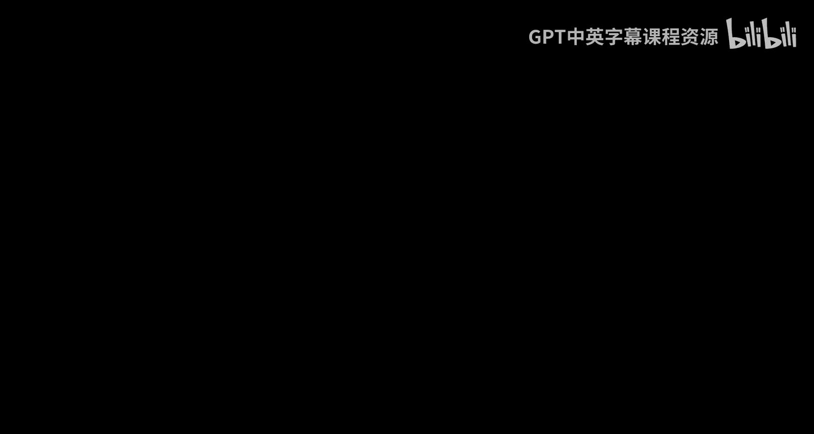
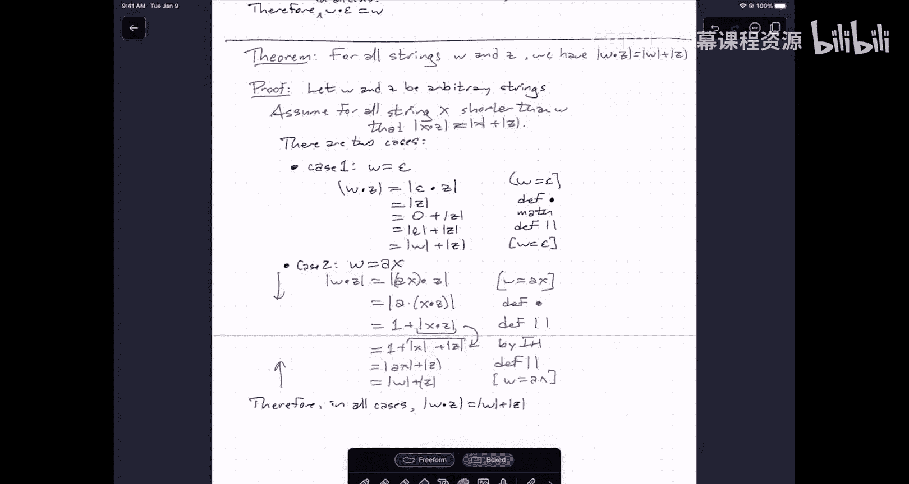

# UIUC《算法与计算模型｜UIUC CSECE 374 - Algorithms and Models of Computation 2023》中英字幕 p01 20230823-Aug 22_ Strings and Induction.zh_en -BV1Mh7RzaEL2_p1-

Hi everybody， this is Jeff I need to apologize because I apparently forgot to push the record button at lecture this morning。

 so I'm recording this video to cover especially the last part of the lecture on Tuesday about induction proofs also we didn't get as far through even the first proof as I wanted to。

I'm going to refer everybody to the course webpage for issues about administration and skip over the description the overall high levell description of what the course is about。

 don't think that is really a surprise to anybody， but I do want to be very careful about going through the recursive definitions of strings and length and concatenation and walking through a couple examples of inductive proofs。

So let's just start off with some definitions。Um a string。Is a finite。Sequence of symbols。Now。

 a symbol is just an element of some。A finite set called the alphabet。

This is abbreviated capital sigma that's a mnemonic for the word symbol this is any。Non empty。

Fite set。Um。And you know， so canonical examples of this。

 the one we're going to be thinking about mostly is this one where the alphabet is bits zero and one。

I'll refer to you finite strings of sequences of these bits as bit strings。but more generally。

 so usually I'm going to be doing this， butum also， you know。

 it could be anything it could be you know。Card suits， you know， cardss。Spades。A diamonds。And clubs。

And you're just asking about。It was sequence， you look at a sequence of cards that go by and well。

 these are the suits and that sequence of suits is a string over the alphabet Ahart's。

DNA is usually modeled in a lot of algorithmic applications as a string of suits。

 except those are usually referred to by。Different set of symbols。

 still a set of four symbols representing the bases that DNA is assembled out of。

 there are four of them。RNA similarly is made of a slightly different set of for proteins or may are sequences of amino acids that come from an alphabet of 22 symbols called amino acids。

 but for most of the things that we're going to be talking about in this class we're going to be sticking to。

The binary alphabet01。Okay， but now what's a finite sequence？

Now you can for fixed length sequences it's relatively easy to just write out the definition。

 a sequence of 10 symbols is assemble， assemble， ass symbolble， assemble， ass symbolble， assemble。

 assemble assemble， ass symbolble， ass symbol and ass symbol。

 but if you want to write down sequences of arbitrary length。

 it's a little bit more difficult to do that except by doing it recursively， so a sequence。

A finite sequence of x's。Is either empty？Or an X followed。By the sequence of x's。So。

A sequence of giraffes is either nothing at all， or it's a giraffe followed by a sequence of giraffes。

A sequence of amino acids is either nothing or it's an amino acid followed by a sequence of amino acids。

 a string is a sequence of symbols。Is either empty or it's a。

It's a symbol followed by a sequence of symbols。So that means that a string in particular is either。

Empty。And the empty string we denote with the Greek letter epsilon。Or it's a symbol。Followed by。

A string。And formally， this is a。啊。An ordered pair where the left half of the pair is the symbol。

 its arbitrary element of the alphabet， and the second half of the ordered pair is another strain。T。

Now the way these recursive definitions work， for purpose you know for this class。

 the way all recursive definitions work is you're allowed to recurse as often as you like but you're not allowed to recurse you have an infinite chain of recurs you must eventually reach the base case of the definitions。

 so you can say things like here's the string STRA and G， this is really an ordered pair。

where the first half is an S and the second half is the same string TRI and G。

 which is really an ordered pair with the left half is t。

 and the right half is really an ordered pair， the left half is an R and so on。

Eventually I reach recursively reach down to considering the string that just consists of the single character G。

 that's formally as a string， the ordered pair。Containing the symbol G on the left and the empty string on the right。

 and then I need to close up all my prints。But we are normally going to emit。Um omit。All this。

Syntactic sugar。We won't write out the pars， we won't write out the commas。

 so instead we'll typically write either a with a little dot X。Or just write AX。So sorry。

 let me make this look a little bit better。You can write that as this or a dot x。Or just。A X。

For some symbol A and for some。String。Thanks。Okay。😊。

Now this is not the only way we could have done this so it could have defined strings in terms of like the data structures like an array or I have a finite sequence in every slot on that sequence finite sequence of memory addresses which I just define as a range of integers and I can put a character each of those slots the part of the reason for wanting to define this recursively is that I also want to define other things recursively on top of strings functions that we would apply to strings that glue them together or compute their length and to be able to reason about those strings using the most powerful common tool that we have for reasoning about structures which is recursion I'm sorry induction it's the same thing so。

Just to give a couple of concrete examples we want to think about， I'll define the length。

This is a function that takes strings to non negative integers。The definition is。

The length of a string is defined with two cases。And these cases exactly mirror the definition of the string W。

 there are two possibilities for what W could be， if W is the empty string。

 then the length of that string is defined to be zero。On the other hand， if w is equal to AX。

For some。Symbol。A and some。Sybol sorry， some string X。

Then the length of W is defined to be 1 plus the length of x。These cases are exhaustive。

 every string falls into one of these two categories by the definition of strength。系。

So if you grind through the example that I gave earlier， the length of the string string。

This is one plus the length of the word。Tring， which is two plus the length of the word ring and follow this through eventually you get six。

嗯。If you run it long enough。You'll eventually get to， actually， let's stop。A little bit earlier。

5 plus the length of the string G， which is six plus the length of the empty string， which is six。

You can think of this definition as a very primitive recursive algorithm。

Um it takes in a string as input if that string is not empty， it adds。

One to the result of a recursive call。If the string is empty， it just returns zero。Now this is。

 you know， behaves pretty much exactly the way that you think it does， but nevertheless。

 there are things that。Follow easily from the definition， but not immediately from the definition。

 not trivially in the sense that it really is only one step of logic， so i'm going to give it。

Actually， now let me let me not try to go into theorems just yet。

 I wanted to find another function first。Sorry， called concatenation。

 so concatenation is a function that takes a pair of strings and returns the result of gluing those strings together。

The right way， so given two strings W and Z， the concatenation of W and Z， again。

 I'm going to fall into two cases this time based on the definition of the string W。

 but not I'm not ever actually going to invoke the definition of the string Z。so again。

 there are two cases， either W is the empty string or W is not the empty string。In the first case。

 the concatenation of W with Z is just Z， gluing on no characters to the beginning of a string doesn't change the string。

On the other hand， if W has a first character A， then the concatenation is defined to be the string formed。

W， the first symbol A and the rest of it is the string。Given by recursively concatenating。X and Z。

So again， if you think of this as a recursive algorithm where you feed into strings W and Z。

 if w is not empty， the algorithm simply returns the second string Z。If W is non empty。

 the algorithm writes down the first symbol of W， recursively concatenates the rest of W with Z。

And then builds a string out of that that symbol and the。The value returned by the recursive call。

OkaySo again， if I write now concatenate here。This would be expanded as N。

Concatenated sorry n together with the concatenation of o and here。

Which is the same as n dot O times the concatenation of。Excuse me， W dot。Here。

Which is the same as N dot O dot W。Dot empty string dot here。Which is。And O， W dot。Here。

And now I can just get rid of all the syntactic sugar again。And I end up with the string nowhere。

Now you notice I've got two different dots here， the little dot。UHere。Beginning of the。

Let string this little dot。This is。Just syntactic sugar again。

 this is part of the definition of string。系。It has a special meaning it's that it's part of the definition on the other hand。

This is a function。That we are defining。If you want to think of these as these are really two different functions because the little dot。

 the first argument is taken two things， but the first one is a symbol， not a string。O。

Now intuitively， if you catate a one symbol string to another string it's exactly the same it's just building a string out of that symbol when and the second string。

 so they' they're really very closely related and over time it makes sense just to。

Not distinguish between these two kinds of spring building operations and not in fact not even right down the dots at all。

 but for now I'm going to be very careful to distinguish between these two different things， one。

 how to build a string by definition and the other。

 how to build a string by this more complicated function。And。

So concatenation again behaves more or less the way we expect。

 but there are some properties that would be nice to know that don't follow it trivially from the definitions。

So I'm going to give the first one of these for any string W。We have。

W concatenated with the empty string is W。Well， of course it is， what else would it be？This is silly。

you know， I want to point out that this theorem and the second theorem that I'll prove later。

Really are blindingly obvious that I'm deliberately choosing examples that fit with your intuition。

 not because I want to convince you that these theorems are true。

 but rather I want to show you the process by which you prove theorems like this true so that when you get to more interesting things like the problems in the homework。

 you can follow the same process。To derive a proof。

So I want you concentrating on the structure of the proof rather than worrying about whether the theorem is believable or not。

 of course， it'sev what else could be。Now you might also say what wait isn't this part of the definition。

 the definition of concatenation has a case where one of the strings is empty， well yes。

 but in the definition it's the first string。That has the opportunity to be empty。

 And here we're taking the second string as being empty。 So it's important that， you know， remember。

 concatenation is not like addition or multiplication。U。So。Nowhere is not the same thing as hair now。

Okay the order that you can catate things actually matters。

So this is not something that follows immediately from the definition， I have to prove it。

And the way that we prove things。About objects that are defined recursively is we use induction because induction is the same thing as recursion。

Now。Oh。I have a sort of religious attitude about this。

so I'm going to stand on a soapbox here and preach to the world that you should never have been taught weak induction。

 that was a crime， you should sue your discrete math teachers。

 you should burn your discrete math books。We conduction doesn't exist the way that people are taught normally to do inductive proofs is just。

Completely broken。Here is what I recommend and I'll talk once I go through it。

 I'll talk about why I recommend thinking about induction this way。

The punchline is eventually because this is the way you already think about recursion。

 and I want you to gain some of your neurons back so that you don't use different pieces of your brain to think about induction or recursion when they're really the same thing。

系。So the way that we how do we actually start？Well， the one thing we notice is， well。

 the theorem begins with a universal quantifier。For all strings。Okay。

So that instantly tells me that the first thing I should write down。Is。Let me choose。

An arbitrary strength。I can spell the word arbitrary。And this is really actually very important。

I am stating the theorem about every possible string。

And really the only way to prove something about every possible string is to say， okay。

 let's call some string W， the only thing I know about it it's a string。

 it could be absolutely anything whatsoever， and then if I can prove it about W。

 then I've proven it about everything because I'd made no other assumptions about W。

Other ways of structuring inductive proofs you have to do extra work to guarantee that you are in fact。

 considering arbitrary objects。is one of the reasons why I say do it this way you write this down even before you read the rest of the theorem。

 so if the theorem says all snarks or boojus， even before you reach the word are you see all snarks and you immediately write down。

 let George be an arbitrary snark。Similarly， when I read the end of the theorem。

This tells me what I need to prove about this strain W that I've chosen。

 so I'm going to go ahead and write that down。Therefore， W dot epsilon equals W。

And now I'm going to fill in the details about this one string W that I've chosen。嗯。Okay， now。

there are a couple of things that need to be go into an inductive proof。

I need an statement of an inductive hypothesis， I need an exhausted case analysis and for each。

 but the cases in the proof， I need to have a logical argument that shows that the theorem holdss in that case。

The way that I actually strongly recommend approaching this is by starting by trying to write down the most general case。

 don't even think about writing down the induction hypothesis yet because we really don't know what induction hypothesis we need。

You can probably guess for this simple example， but when we get to other more complicated examples。

 it'll be less obvious。So what I'm going to do is I'm just going to say intuitively。

 let's assume W is really big。And so we want to choose as general a case as we can W is the empty so trivial case we'll deal with it later。

 I want to think of w is at least you know a Google characters long， okay， so what do I do？Well。

 what I want is to write a chain of equalities。That starts with w。

 epsilon on the left and ends with W on the right， and the way that I'm going to do this is by trying to expand definitions basic math and at some point use the induction hypothesis。

But I'm going to do this specifically， and try to write this with different colors。

I'm going to start by in blue。Going down and I'm going to start with green going up。So start with W。

s。Is there anything in the definitions？That I could expand Well， W's really big。

 that means it's not empty。So that means by definition。嗯。Sorry， not AW。I can rewrite W as。A。AX。

 where a is a symbol and x is a string。Good。嗯。This is by the assumption that。W is big。Okay。

 now is there any other thing that we could use to expand now in principle I could say。

 well if w is really really big then x is also going to be really really big and I could start opening that black box this is starting to get a little bit dangerous I really want to think of the recursive part of this argument as being just magic done by the recursion fairry I might sometimes need to open the black box one or two levels。

But really， I want to concentrate on other things that I might be able to exploit。

And the other thing that we have here on the page or you have something written down is this cacaation operator。

So。If I'm concatenating a really long string with something else。

The definition of concatenation says， oh， if W is really long。

 then here's the definition of the output of the concatenation operator。So I can write this as。

excuse for。This is equal to a times x big dot epsilon， I shouldn't say times and this is by。

 you know the definition。Of。Concation。Um okay。Similarly going the other direction， well。

 what do I know about W， well， I know it's to I know that it's equal to AX。This is just by。

Because stuff you is big。And now the question is， how do I make this jump？Well。

 the expression that you're seeing right here in parentheses， that's a string。

Dot epsilon it's exactly the same kind of thing that we're trying to reason about already the difference is that the string X is shorter than the string W that we started it's smaller it's not the whole string it's it's got less stuff in it and this is exactly where we want to apply。

The induction hypothesis。The induction hypothesis allows us to replace x dot epsilon with x because x is a shorter string than W。

Here is where I'm making the recursive call in my evaluation of W dot Epsil。

So what is the induction hypothesis okay， so here we go。I'm going to write this down。

 assume for all strings。X， such that。X is less than W。That x dot epsilon is equal to x。可。Now。

 what is the one thing you'll notice about this？This is my induction hypothesis。

 and this is the correct place to state it up front。

There are a couple of different ways to interpret this。One of them is。Recursive calls work。

And really， I should say recursive calls on smaller strings work。

 but the fact that I'm looking at smaller strings means if I follow a chain of recursion。

 it will eventually reach the base case in the definition of W。嗯。

Another way of interpreting this is no smaller counter example。

So in the notes that you can find linked from the course webp page。

 you'll see a description of induction as equivalent logically to a proof by contradiction。

 where I would say， well， assume that this isn't true for all strings。

 let W be the shortest string for which the theorem fails。

The assumption that W is the shortest string for which the theorem fails is the same as saying the theorem works for all strings shorter than W。

So that's just what I've written down as the induction hypothesis。

And notice in particular I haven't written down the induction hypothesis only within the inductive case。

 so we'll get to the case analysis in a second， but I'm making this assumption no matter what W is。

 so in particular if W is the empty string， I'm still making this assumption。

 I'm assuming that all strings shorter than the empty string have some property。

That assumption comes for free because there are no strings shorter than the empty string every string shorter than epsilon is a flying giraffe that poops chocolate rainbows yes that statement is correct。

So it's actually quite safe to make this assumption here。

Now the other thing that I need to do is I need to look at this argument。

 you know assume that W is really big and ask you know what did I really assume formally when I said that W is really big and the answer is actually。

 well， I assumed here that W is not the empty string。As long as W isn't empty。

 every step in this thing works， W is not empty then it's equal to AX for some symbol A and some string x and again to the end。

Okay， so that means that I'm going to need to write out another argument for the other case where W is empty。

And so we get two cases。And these two cases surprise exactly mirror the definition of strengths。

 exactly mirror the definition of W。Okay， so case one is W is empty case two W is not empty。

 i'm going to actually just invoke the definition in this case and say well W is equal to aX for。

Some character A and some string X， that's what it said up here in the definition。

There it is right there。Right。Um， so now in the second case，um， I can write， okay。

 now it's not just assumption that W is big。But now I can write this morely as because w is equal to AX。

This is by definition， this is by the induction hypothesis。And this is because。W is IX。

On the other hand is if W is really the empty string， then in that case。

 I can write the proof like this。W。eppsilon is epsilon。 epsilon。Because。W is epsilon。

And that's equal to epsilon。By definition of dot here what I'm canceling out is the epsilon at the beginning。

 the first argument is empty， which means that's I can ignore it by definition and now that's equal to W because。

The view is equal to apstilent。Therefore。In all cases。对。We're done。Okay。

 so the components of the proof that Ive built here。I start by bowing to my sense。

 I declare the arbitrary objects that I'm going to prove about something about。

 I give them names and I declare them to be objects of the correct type。

Then at the bottom of the page， I write the conclusion of the proof。😡，Um。

 if the induction pattern is clear， I might at this point write the induction hypothesis。

 but if it's not clear， I'll just jump into the middle and start making trying to make the inductive argument work。

And this usually involves a bidirectional proof where I'll start with the left side of the thing I want to show equal to something else and end with the thing I want to show it equal to。

And working my way from both ends towards the middle。

Where at each step I'm making some simple assumption like， well， I'm in this case。

 W's really long or this is the definition of concatenation or the definition of length or some previous result that I've already proved or simple mathing like three plus five equals two equals seven。

 no， eight。And at some point in the middle， I'm going to invoke the induction hypothesis。

But I'm always starting the end of working towards the middle。

 now notice that's not the way I read the proof， the way I read the proof is I read the declaration。

 I read the induction hypothesis， which tells me what kind of recursion pattern I'm going to do。

I read the case analysis and I observe even without looking at the rest of the proof that the cases are exhaustive and that's really important。

It should be clear from space when you're looking at these cases that the cases I've written down actually cover all possible strengths。

So here are my two cases。That is every string falls into one of these good。

And that's visible from above and then within each one of these cases。

 I have a line by line argument。For the theorem。In that case。听。

So I'm going to go through this one more time with a slightly more complicated thing。

 and I'm kind of going to go through it at speed。Um， uh。

 but I'm going to point out again why I recommend this particular pattern of writing down the proof as I go。

Okay so that's one theorem， let's try another theorem。😔，And again。

 this is something that's going to be blinding only on the list。But for all。Stringngs。W and Z。

We have。The length of W。 Z is equal to the length of W plus the length of Z Well of course that's what it is we learned addition back in you know elementary school we took three apples and then we took four apples and we stuck them together and that's what it meant to add three and four so this is getting very very close concatenating strings really looks like our intuition for addition already so again this blindingly obvious that this theorem is true but you know let's see if we can prove it。

So I start off， I say， oh， for all strings W and Z。

 so the first thing I to write down is let W and Z be arbitrary strings。

Even before I read the actual proof。And then at the bottom of the proof， I write the actual theorem。

Therefore， and I'm going to guess that。There's going to be some case analysis。

Let's just write down the conclusion of the proof。Okay。😊。

Now I want to I want to jump into the middle， let's assume W is really long and Z is really long i'm not anywhere near the weird empty string boundary cases。

 so let's let's just for the moment。I'm going to write you know as a temporary assumption here。

 assume W and Z are both long。Okay， you know， just。

 I want to avoid any boundaries at all and try to use the most general argument I can。

So I'm going to write down in blue， the left side of the thing that we want to argue about。

And I'm going to write down in green the right side of the sentence that we're trying to prove。

 and I'm going to work my way。From the ends of this equality statement towards the middle。Okay。

 I see the length of W。z and I'm asking， okay， is there anything that I can any definition I can expand well think well what about the definition of length？

Well， the definition of length has something in it where， well。

 if I've got access to the first character， I can kind of， you know pull it out as a plus one。

 but I don't have access immediately to the first character of w。Z。

I have access to the first character of W， but that's not the input to the length function。

 so they can't expand that yet。On the other hand， I can maybe expand the definition of the concatenation function。

 I say， oh， well concatenation function， if w is really long。

 then I know what the concatenation function should do， okay。

 so let me specifically assume here that W is equal to AX。Just that's the definition。

 so I can write this as AX。c。Okay。U。Now I can expand that。Out to a dot， sorry。

 that should be a little dot。A little dot x big dot Z。

This is by the definition of concatenation and now the late function has access to the first character of its argument so I can pull that out。

One plus the length of X doox Z。This is by the definition of length。Okay。

 now let me similarly start working in the other direction from the bottom。

 it looked like I'm going to need to expand W because Z seemed to survive for a while so let's not touch that so I can write this as the length of AX plus the length of z because W is equal to AX。

And here on the left， I have this string AX done' computing the length of it and I have access to its first character。

 so I can write that as one plus the length of x plus the length of z。

 and this is again by the definition of length。And here is the magic step。Okay。

 somehow I need to be able to take this and turn it into that。Now the expression。

 the length of x plus Z， this is another instance of the kind of thing we're proving something about。

 we're proving something about the length of the concatenation of two strings。

 there's a length the concatenation of two strings， but it's not the same as the one we started with。

 the first string has gotten shorter。Something has gotten smaller and that allows me to imagine that this is something happening recursively。

 so I'm going to just you know buy the induction hypothesis。But what is the induction hypothesis？

Okay， the reasoning here is the first string is shorter。And so the theorem works。

So the way that I'm going to write that down is I'm going to say assume。For all。Strings。As。Shorter。

V W。That。The length of x dot z is equal to the length of x plus the length of z。

Now notice in the induction hypothesis， I didn't change the string Z。

 the string Z in the induction hypothesis is exactly the arbitrary string that I chose and line above。

That's sort of just being carried through through all recursive calls without ever being changed without ever opening the box。

 right the only thing that's changing is the first string whenever I make a recursive call is getting shorter。

So I know after a finite number of recursive calls it'll bottom out。系。Um。

 notice also that I didn't say any string X that's shorter than w by one character。

There's no point in writing down the words by one symbol。It got shorter。

 the intuition is it got shorter， therefore where Christ calls were。

That's the induction hypothesis that we want to use。

 this is strong induction or as we like to call it in this class induction doing the extra work to make your induction hypothesis weaker is never going to help you just don't bother。

Okay， now if we look at this argument that we've made here， we need to say， okay。

 what assumptions did we make in order for this argument to go through did I make any additional assumptions at all about Z well no Z is just carried through Z Z it never changes never opens up ever expand the definition of Z so it just goes through。

But I did make an assumption about W， namely the W is big。And in particular。

 in order to make this first step， I really needed to assume that W is equal to ax for some symbol a and some string W。

 so I'm going to write that down as one of the cases of my proof。Let's do that in black。Case， well。

 I know that this is。Going to be， you know the second case because the definition of strings always has two cases so。

Case one。W is empty。And I might as well at this point， right， you know， there are two cases。

And now the only thing I have left to fill in is the argument for what happens when that string W is actually empty。

 so I need to make a little bit of room here for that proof。So I'm going to use。The magic of。

Notability and。That crossed the page boundary right there。Okay， so case one。If W is the empty string。

 then I'll write that down as W dot Z length。Equals and at the bottom， I'm aiming for。

The length of W plus the length of Z。Again， i'm going to work from both ends because that seems to be useful W is the empty string。

 so I'm just going to substitute epsilon here here for W。Epsilon dot something is。

The length of that is the second thing， so this is by the definition of concatenation。

Then going up from the bottom， the length of W this is the length of epsilon plus the length of z because W is equal to epsilon。

And we almost made enough room。just I make a little bit more space here and write the magic step in the middle。

 zero plus the length of z going down， that's by the you know， math。

The integer is the same as zero plus that integer， and then the next one is by the definition of length。

The definition of the length says zero is the same as the length of the empty set。

And so there is my complete proof。Doesn't quite all fit on one screen。But， you know， I can now。

Make it almost work。Yeah。And that is how we write proof induction for theorems about strings。

You'll see more examples of this kind of proof style in the labs on Wednesday and in particular on homework one。

The things you're going to be trying to prove in the labs are similarly obvious， I hope。

The things that you're being asked to prove in the homeworks are not necessarily as obvious。

 but if you play around with some examples， hopefully they'll be believable。

 but the way that we want you to write down the produces in the style that I've shown here。Line1。

Declare your arbitrary objects， then write down the strong induction hypothesis。

 then declare how many cases there are， then have an exhaustive case analysis。

 then inside each case have a line by line proof where every line。

follollows from the previous line either by a previous result or by some definition or by simple math or at one point。

 or possibly even multiple points by the induction hypothesis。

The more examples also in the lecture notes， I invite you to read those and walk through them carefully to understand why they work。

Um， and also， I do even when simple things that maybe you can see how the proof is going to go from the very beginning。

To practice going through the process that I went through to derive the proofs rather than just spitting them out because it'll be good practice for more complicated things。

That is all I want to talk about， no， you can probably guess。

There's no way that I was going to cover all that in lecture on top of you know all the administrative stuff。

 so it's probably a good thing that I forgot to push the record button。

I hope this was helpful and I hope I will see some or all of you in class on Thursday。

Thanks， everybody。