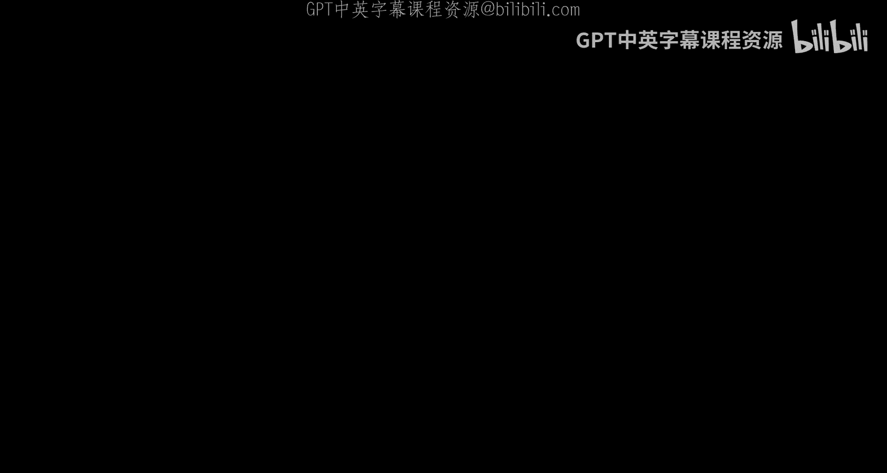
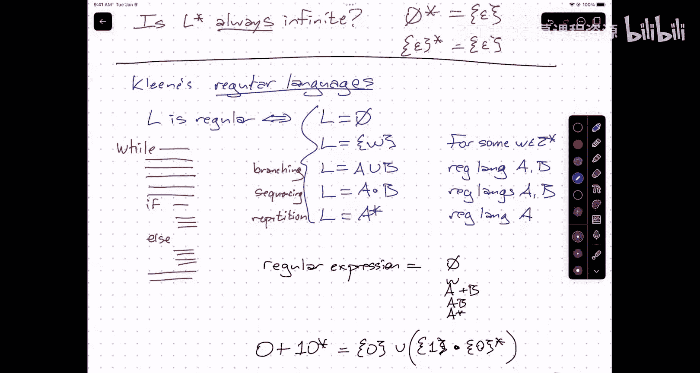

# UIUC《算法与计算模型》：02：归纳法、语言与正则表达式

在本节课中，我们将要学习归纳法在字符串证明中的应用，并引入形式语言理论中的核心概念：语言和正则表达式。我们将从回顾一个归纳法证明开始，然后探讨如何描述和操作字符串的集合。

## 归纳法证明回顾

上一节我们介绍了归纳法证明的基本思想。本节中，我们来看一个具体的例子：证明字符串连接操作满足结合律。

**定理**：对于任意字符串 `W`, `Y`, `Z`，有 `(W · Y) · Z = W · (Y · Z)`。

**证明**：
令 `W`, `Y`, `Z` 为任意字符串。我们将对 `W` 进行归纳证明。

**情况 1**：`W` 非空。
假设 `W = a · X`，其中 `a` 是一个字符，`X` 是一个字符串。
根据连接操作的定义，我们可以展开等式左边：
`(W · Y) · Z = ((a · X) · Y) · Z = a · ((X · Y) · Z)`
根据归纳假设（因为 `X` 比 `W` 短），我们有 `(X · Y) · Z = X · (Y · Z)`。
因此，上式等于 `a · (X · (Y · Z))`。
再次根据连接操作的定义，这等于 `(a · X) · (Y · Z) = W · (Y · Z)`。

**情况 2**：`W` 为空字符串 `ε`。
`(ε · Y) · Z = Y · Z` （根据连接定义）
`ε · (Y · Z) = Y · Z` （根据连接定义）
因此，`(ε · Y) · Z = ε · (Y · Z)`。

综上，对于所有字符串 `W`, `Y`, `Z`，结合律成立。

## 语言：字符串的集合

在讨论了单个字符串之后，我们自然要问：一个算法会接受哪些字符串？会拒绝哪些字符串？这就需要我们研究字符串的集合。

**定义**：给定一个字母表 Σ，一个 **语言** 是 Σ*（所有由 Σ 中字符构成的字符串的集合）的任意子集。

以下是一些语言的例子：
*   Σ*：所有字符串。
*   ∅：空集（不包含任何字符串）。
*   {ε}：只包含空字符串的集合。
*   {所有二进制字符串中，0的数量等于1的数量}。
*   {所有合法的Python程序}。

## 语言的操作

因为语言是集合，所以我们可以使用标准的集合操作，如并集（∪）、交集（∩）、差集（\）和补集。
此外，我们还可以定义两种专用于语言的新操作：

1.  **连接**：语言 A 和 B 的连接记作 A · B，定义为所有字符串 `x · y` 的集合，其中 `x ∈ A`，`y ∈ B`。
    *   示例：{“a”, “b”} · {“1”, “2”} = {“a1”, “a2”, “b1”, “b2”}。
    *   注意：∅ · L = L · ∅ = ∅；{ε} · L = L · {ε} = L。

2.  **Kleene星号**：语言 L 的 Kleene 星号记作 L*，定义为可以**通过连接 L 中的字符串零次或多次**得到的所有字符串的集合。
    *   形式化定义：L* = {ε} ∪ L ∪ (L · L) ∪ (L · L · L) ∪ ...
    *   示例：若 L = {“01”}，则 L* = {ε, “01”, “0101”, “010101”, ...}。
    *   重要特例：Σ* 就是所有字符串的集合，这正是将字母表 Σ 视为单字符字符串语言后取 Kleene 星号的结果。

## 正则语言与正则表达式

利用上述操作（空集、单字符串、并集、连接、Kleene星号），我们可以构建出一类非常重要的语言，称为**正则语言**。

**定义**：一个语言是**正则的**，当且仅当它可以通过以下规则从基础语言构建出来：
1.  ∅（空集）是正则的。
2.  {ε}（仅包含空串）是正则的。
3.  对于字母表中的任意单个字符 `a`，{“a”} 是正则的。
4.  如果 A 和 B 是正则语言，那么 A ∪ B（并集）也是正则的。
5.  如果 A 和 B 是正则语言，那么 A · B（连接）也是正则的。
6.  如果 A 是正则语言，那么 A*（Kleene星号）也是正则的。

为了更简洁地描述正则语言，我们使用**正则表达式**。这是一种紧凑的符号表示法，与上述定义规则一一对应。

**正则表达式语法**：
*   `∅` 表示空集。
*   `ε` 表示语言 {ε}。
*   字母表中的字符 `a` 表示语言 {“a”}。
*   如果 R 和 S 是正则表达式，那么：
    *   `R + S` 表示对应语言的并集（等价于 `R ∪ S`）。
    *   `RS`（或 `R·S`）表示对应语言的连接。
    *   `R*` 表示对应语言的 Kleene 星号。

**运算符优先级**：Kleene星号 (`*`) 优先级最高，接着是连接，最后是加号 (`+`)。括号可以用来改变优先级。

**示例**：正则表达式 `0 + 10*` 描述的语言是：一个单独的 `0`，或者一个 `1` 后面跟着零个或多个 `0`。即 {“0”, “1”, “10”, “100”, “1000”, ...}。

## 构建正则表达式示例

让我们尝试为“所有由0和1交替组成的字符串（即不包含’00’或’11’）”这一语言构建正则表达式。

**思路**：先寻找主要的重复模式。一个明显的模式是 `(01)*`，它生成如 `ε`, `01`, `0101`, ... 的字符串。但这漏掉了一些以 `1` 开头或以 `0` 结尾的字符串。

**解决方案**：在主要模式前后添加可选的部分。
*   开头可以是 `ε`（空，直接进入`(01)*`模式）或 `1`（如果以1开头）。
*   结尾在模式 `(01)*` 之后，可以是 `ε`（直接结束）或 `0`（如果最后多一个0）。

因此，一个可能的正则表达式是：`(ε + 1)(01)*(ε + 0)`。
这等价于：`(01)* + 1(01)* + (01)*0 + 1(01)*0`，覆盖了所有情况。

另一种思考方式是状态机：我们处于“下一个期望字符是0”或“下一个期望字符是1”两种状态之一，并在读取字符后在这两个状态间切换。这引出了我们下节课将要学习的**确定性有限自动机**的概念。

## 总结

本节课中我们一起学习了：
1.  使用归纳法严谨地证明了字符串连接操作的结合律。
2.  引入了**语言**作为字符串集合的概念。
3.  学习了语言的基本操作：并、交、差、补，以及特有的**连接**和**Kleene星号**操作。
4.  定义了**正则语言**，即可以通过空集、单字符串、并、连接和Kleene星号这些基本构件组合而成的语言。
5.  介绍了**正则表达式**作为一种简洁描述正则语言的符号系统，并通过例子演示了如何为特定模式构建正则表达式。

这些概念是形式语言理论和编译器设计的基础，下一讲我们将探讨如何用机器（自动机）来识别这些正则语言。