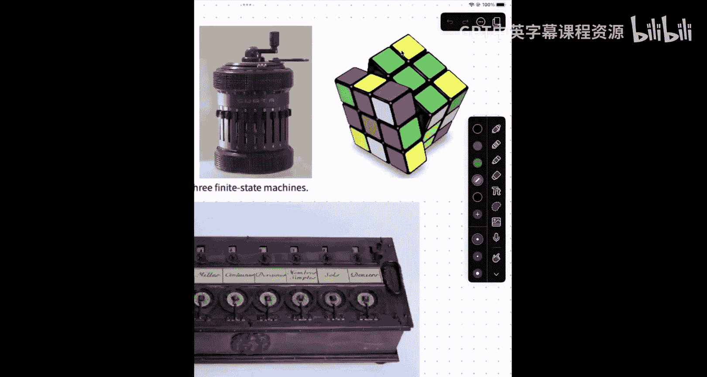
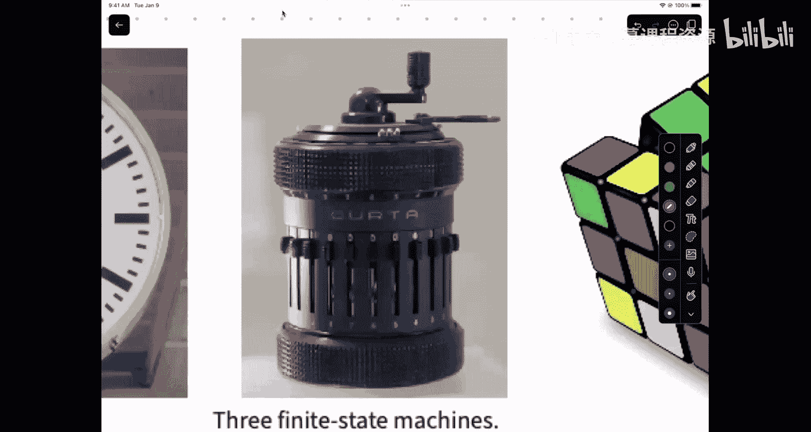
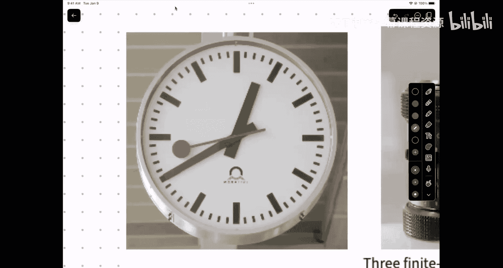
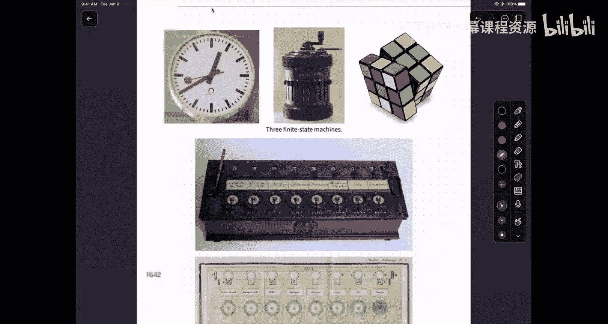
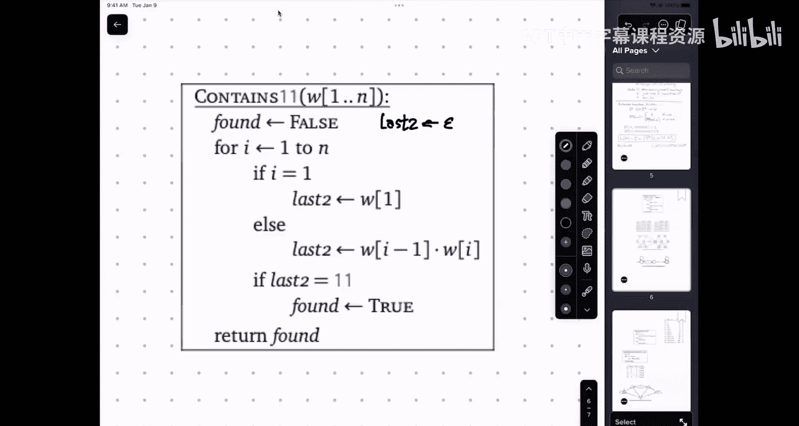
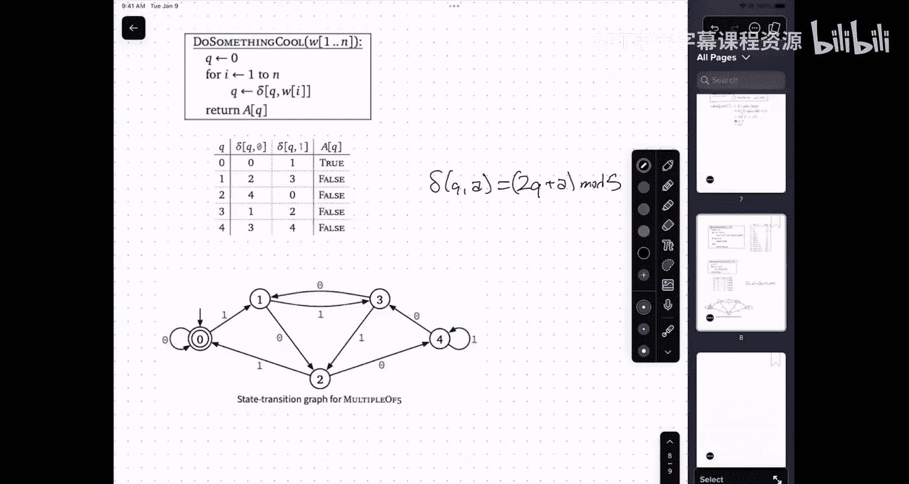

# UIUC《算法与计算模型｜UIUC CSECE 374 - Algorithms and Models of Computation 2023》中英字幕 p03 20230829-Aug 29_ DFA introduction.zh_en -BV1Mh7RzaEL2_p3-

。Back。干不得。Yeah。

。

まは。快快。

系啊，你微生边打开。こるなあ。では。じ本年です对。Okay let's go ahead and get started sorry for the the a couple of quick administrative announcements before we get to the real lecture。

The first thing is homework one is due at 9 pm。Guided problems set one was due last night at 9 pm it is not too late。

To request an extension。So。By tomorrow at 9 pm you can request you have your  food20 hours late and guidance that greater for credit。

 that's the 24 hour deadline after tomorrow at 9 pm will not be able to submit paying integrated grade credit at all。

U there's a bunch of stuff about extension requests on the website that the assuming most been important things to know is if you want。

AAn extension， you must request portfolio yourself if you were in a homework group and everybody in the homework with wants an extension that everybody eating homework must eat their little request attention。

The reason for that is that homework groups change over the course of the semester。

 and it doesn't make sense for one person to decide for someone else that they should spend their centing requirements。

The second thing is。Three of those requests will be granted upon that no matter what don't that reason。

 if you had a use asked for incentive， I was sick， the pipe directly above my bedroom exploded onto my bed and I didn't get any swing last night。

Yes， but I add week。My else my homework groups。Had a height first over their bed last night and they didn't get more than they only got two hours of sleep。

Look that into the experiment request and any reasonable thing that is like obviously out of your control。

 that request will be rendered and it will not turn against more relief for you。Okay。

 so we're not going to generally respond to the expansion robust robust because。第个。

After joining the soon the use staff granted， we do run huge track how many new requests that you've made。

 but when you sand it out if you don't request an extension。

 but you do submit something late on grade scopepe，We won't show that penalty on grade scope。😡。

But Gr scopepe does report to you submitted things like technical limitations of the way grade scope and extensions work。

 again just trust me you to keep track of that， but you can always ask us if you have questions。Okay。

 second thing about homework。嗯。Because we' noticed that in submit to end。

 a few people are not being directed through。If you were a group know three things。The three of you。

 and electronic produced one PDF file to home one couple1。

One of you submits at PDFF off gray scope and tells Grace's about who the other two people are。

The other two people do not submit anything to break them。

Okay so the only reason we should ever see the same PDF file submitted by more than one person。

 the grade scope is if youre G。W you're not。So just one。

Please remember to identify the other members of your group。There's a place the in the。

In the submission form to do this。And。Because this is something that I didn't announce before it probably you able that one。

 but please identify the pages that go to each subproblem。

So the way that we're actually going to grade these。

Is you've got six Ts that problem one and six Ts have problem two。

 and so everyone one of those ABCs we that mecury people is others。Proron two。

 or we got more parts per problem， they're probably 1 C egg all of problem 1 C。

So it's really helpful if you tell grade which page go1 see grade doesn't spend on and around。

 not that big a deal when you're only graing 50 things。

 but when you're graing 250 things it really helps if you guys can navigate for us。Also。PDF only。

Don't submit pictures。Please submit pictures， please submit PDFs。

 please submit PDFs that look like this。Not PDFs that look like photographs。Again。

 this is just to make easy possible on the graders for them to actually be what we're doing。

Next Monday is Labor Day， University holiday， so things that you normally have to settle on Monday won't happen。

That's the Monday morning Home party won't happen， the Monday office hours won't happen and because of that。

All deadlines。Next week our pushed up by 24 hours。So guided problem set two is do。Tuesday。

And homework to is due Wednesday。24 hours after we are， sent request for this week or being Thursday。

 everything needs to put up by that。嗯。嗯。And I think。

That is all of the administrative staff butm happy answered。啊，有是天半。在 don't。Whats the。

You definitely write to that it out。You follow the instructions learn from report。

So if you use a Bri stuff app or Sc or hand plastic or any number of others hand out come on the phone。

 I think the native photos。Ting on iPhone says this。

 it will do the color estimate in East opening and English contrast。And Luke that Adam saw。

 which was like white text by。Yeah。你这样。Okay， we're not getting too annual out the summer one。

 but later when works。Oh， so。Let's move on to the next thing we're going to talk these statements。就。

In the last lecture， we talked about。Setets of strengths。

And we can kind of think of you know a set of strings as being the artifact of boolean function the takes in the string and in returns either this stringing is good or the string is bad。

 so the language is instead of all good strings。So the string is good if it contains the substr 11。

 the string is good if it alters between zeros and ones， the string is good it zero and。

What I want to talk about now are simple machines。That actively compute these objects。Given a string。

 these machines will compute a bit zero or one。Now not all of these are actually going to be outputting bits。

 I think the probably the best example on the upper right。The input to this machine。

Is a set of turning instructions turning the back that clockwise so halfway blockwise。

But the front is thoughtless。And the sequences moved is good if compute solved。系。Now。

 that is unarguably that is' clearly a machine mechanicalcle glass that computes the function。

I pick up a roots tube and executing the sequence of boots and if at the end the sequence of boots solve。

 then that was a good sequence of boots。The cubeB outputs， yes， I'm solved or the cube outputs no。

 I'm not solved。😡，Now， the important thing about that machine。Is that？

When it's not in this sort of photoogenic pose with the left side of halfway turned a little。

 when it's actually in the form of a cube， there are only a finite number of configurationfiions of those pieces that the cube can be in。

If Im you know，14 when your or older， but it's some small concept like that。But it's a concept。

 you can write down the number and in principle， given enough papers you could write down a complete list of the configurations that you can be it。

It's a bio number。As opposed to the mental model that we have for most computers。

 where you can be infinite a number of states， because for example。

 you have a variable that sores anoc injury。I know we open to stuff behave like that。

 but minimal model of computer deaths。This thing down at the bottom here。

Is an early mechanical calculator constructed by Blas Pascal in the 1640s to help with dad who was a accountant。

The Pascalline consists of these dials。Each of which shows a single digit between zero and nine。

And we add by taking the silence， et the dial。So I want to add three。

 then I would doing this dial on the right， go to the knot little three and turn it until it's the barrier down at the bottom。

嗯。Those of you might have like。😡，Visited your great。

 great grandparents at some point in close scene and it does be looks like a photo tip that's about highlight it。

The same idea compared the items of the sauce that changes the state of the vichi and what made the Pascaline useful is that it was the first mechanical calculator that automated carries so if the display here said 99999 and he added three here。

 then afterwards the inner workings of this mechanical device would make display we 100002。

UAnd so the real value of this machine is in the complicated mechanical carrier system that went on internally。

 remember this is 1642。Transistors wouldn't exist for another 300 years， roughly。

So this is really like the prototype for almost all mechanical calculators。

 the best mechanical calculator that was ever built is this lovely device called the Kurta this is what people use half project because exist yet in the 1940s so this could really just a really complicated version of the possibility where again you've got these levers on the outside that allow you to enter the numbers there's display digit display around sides and you turn the crank to make things happen the Kurta could actually not just do different subtraction but with the right instructions could also do moreplication of division。

Even like square roots， I think if you follow the right algorithms。

U。This is another finite state machine， but it all need to even inputs and tank and proposal so I not to properly it was every 60 of a minute that made the secondhand move。

This is this with railway plot。Its finite states are one state for every possible position of the hour hand of the mid hand and the secondhand and the second hand doesn't sweep to get a tick tick tick so it really is always in a discrete set of。

Would have earned 3，600 by 12s。系。So this obviously doesn't compute anything except the time。😡。

But the basic idea is that you have these machines。

With parts that can only be in a finite number of configurations。

 which means use the machine as a whole， can only be in a finite number of configurations。

So if I a you can provide these machines with ins， because people of simple against elements is something set。

Here， the elements of the climate set are。Things like number one main3。

So there's 80 different chicken to offer that。The roots do。

 it suffices to say safe and for each side。For the current thats will be complicated。Now。

 the nice thing about this attraction is that it's possible a reason about exactly what these machines can do。

 and if I produce a machine and I little states like this，And it only has two possible legal values。

If P equals bits， zeros and ones， and it adds only two possible output values。

 this is good and this is not。The set of languages that these machines like this can recognize are preciseci language languages that can bearch。

We coded by regular sites。对。So this means the sort of weird， abstract way of building a sense。嗯。

Exact matches the computational power of this very simple machine model。So。Let me。

Start with a really simple example of a language that we might want to recognize。

 so I'm going to take the set of all strings。Over the alphabet zero and one。

Such that the length of W is。Dvisible。By five。可。😊，A lot of easier do imagine。How you would recognize。

Whether a spring belongs to this set or not。Okay， so I'm going to speak a sequence of bits。

And I want you to mentally。In track of some information and at the end。

 tell me whether the sequence of bits that I speak belongs to this set or not。Ready。😊，Z， one， one。

 zero， zero， one， one， one， zero， one， zero， one， one， one， zero， zero。Yeses。Noose。Don't cares。

Okay those of you present said yes。所你参加他就。Okay， so。What happened when you say try to。我星女系。

When I was looking before the first I both sides。I didn that I saw you。Okay。

 so one strategy here is count the bits if they go by。And then it ends about F5。So I said to this。

So continue to consider like this。Now， that works if I'd only said because I only said 15 bits。

 if I'd sa for an hour。That movie works between in the Orleans count good others。

If you track it multiple page numbers really easily， but I kind you can still figure it out。still。

When spray against feasible but bother without ever computing the entire condition。Yes。

 like every five just start over right， so when you get to five， go check， forget sort of。

So you go zero， one， two， three， four， five， six， seven eight， nine，10。

 you just keep track on your hands I was literally over here on the desk。

Going like this with my fingers。I didn't remember it was 50 or 20， but didn't matter。

 I hit every finger ended on my pink so I it was a multiple5 so what you're doing here is in order to recognize a string of this language。

You don't need to count up how many bits are insert string。

 you just need to count how many bits are in the string mod5。Which means the content of your memory。

It's one of the five things。Z， one， two， three， or four。You know。

 you are in a finite number of states while you do right you have insurance levels。Okay， so。

One way that you could imagine。Doing this sort of in the language of algorithms here is。Count gets。

Count plus one。😔，Modified you start initially with。Count equals zero and then at the end。

You return a bullion。Just counting equal zero。Okay。

So there is your algorithm for recognizing whether youre sort value you。啊。

Is has length multiple fiber or。Now， there's another way that I can visualize what's going on here。

 which is I can imagine and associate with every possible value of that variable count。

 which is the only variable that I really care about。I can think of that as the vertex in the graph。

And。I know I'm imagine that I always have a token my finger or paw or something restling on one of these sets。

 so initially I'm going to start at state zero。And then， if I get a bit。As input。

UmI'm the write instructions that tell me if I'm in this state and I'm where to fit。

 what state should I change to？So for this particular example， if I hear a zero or if I hear a one。

 I'm going to change and I'm going say through I' going to move to state one。😔，Similarly。Zero one。

0ero， one。Zero one。Zero， one。Okay， every time I hear it， I go to the nest state in the circle。

In particular， I'm in bit four， if I'm in state four， and I get another bit。

 I go just take zero because four plus one minus five is zero。Okay。All right， now。

I also have to somehow distinguish when I would say the ask versus when I would say no。

 when the spring ends and the way that I'm going to do that is I'm going to put a double circle or what I call the happening state。

 the state that has if isn the moment state， it's a good one。Right， so if I。Start off。

With this machine。And I'm starting here in state zero。And I hear。0， one， zero， one， one。0ero。

And that's the end。Whenomen halted was the state one， was the state one。

 so in that case the regime would not accept， you can say no， it would reject the third。

On the other hand， if I said starting here， zero one。0ero。1。Zero stop。

Then the machine was set because when the input stopped coming， I was in。Now。

 the inputs and the fatigue can be arbitrary frame。And whenever you're doing arbitrary strings。

 as a sanity check， you need to boundary the pace。So。啊。

Does the machine behave correctly when the English strain has linked one and consists of a single fit？

What state do I end up in like un is discern？で。You good the say one。When I went zero。

 I moved took in from state zero to state one。Because probably know the state one。

 the machine rejects， and that's what the thing to do because the string of one has a length one。

 which is not a local problem。好的。What happens if the input is the empty search？Okay。I stop。Right。

 it starts with zero because what we' done and it's a zero。

And so the this zero is the7 state regime says yes。Its five and correct。

 because zero is five times zero。Okay。😊，So this machine。

With five states correctly identifies all things。Whose link is a multiple of five。All right。

 so there's another way that I can write this down if I really want to be formal。

So let's define a deterministic。By night。Automaton。Atmaton in the Greek that means self moving。

 I think that's moving。Thats automobile is self moving， so self driving automobile is completely red。

But， you know， it's self operated。嗯。This is formally a quadruple。Okay， so Q is the set of states。

So this is any finite。And on empty。So。嗯。S。😊，Little S。This is an element Q， this is the start state。

This is the thing that I'm indicating here with thearrow going into it。A， which is a subset of Q。

 is the set of accepting states。And。The transition function。

 which takes a state and a symbol in the alphabet and gives you a new state。诶。

So I'm going to assume that the alphabet has just been fixed in advance well it is not really a parameter of those finite stage genes found is sort of a higher level thing you can fix in advance。

To he write down these four things？So for that finite state machine。I would say h is the set zero，1。

2。Three， four。The start state is what？Zero。What is the set of acceptance states？

It is the set containing zero。And。How would I wipe down the transition？Well。

 one possibility that I could， one possible way I could write down the transition function。

Is just as a table。Given the state listed on the left and the input listed on the right。

I could just write down。A table that describes the function。

This is probably if you are going to sort of like actively simulate or something to simulate other things。

 this is probably what the way you would internally represent your transition function but if in this case I want to communicate to the human being what my transition function is I would write something like。

Okay， B， for any state Q and then input put to A。My next state is U+ 115。

These two descriptions of this function。Are identical except in syntax。This discussion in red。

I's like difficult to get that picture updated。Again， except for the syns。As a general rule。

 when we ask you to design VFAs， we're not going to tell you in advance you need a picture or you need things in like formal solid invitation or you should build a table for the transition function。

Which one of these representations is the right one will depend on contests？

If you had to get a own task part of six states。Probably in the draw picture we use be clear。

On the other hand， if I've got a DFA that has a quaro space。And if are're pretty good。

 there's some pattern in it， otherwise we could be thinking about it。

 and then writing this down formally， although it's harder to read than the picture is stillqueer than trying to actually draw a trigger qualities。

So sometimes we need to use this formalism， this notation down here at the bottom to talk about the same and the most difficult part of specifying transition of the DFA is right specifying this function。

loads out there。Delta is the universal the for king。So if I were to name this function in English。

I would probably call it next。What's the next state given that the current state huge emergency school today？

Um。The letter S is mnemonic for start， the letter A is the mnemonic for accepting。

 the letter A is capitalized to remind you that it's a set。

 the letter S is not capitalized to remind you that it's a single， a single state。The letter Q。

For states。Is a standard。That goes all the way back to 1940s。

It's really an mneonic for the word configuration now I don't know why physicss spell configuration needed here。

But when you talk about mechanical systems。And you go over to our friends in Mei and they they're looking at。

 you know， arms with you hinges and so on， the letter that you used to talk about the configuration of this mechanical system is Q。

I guess seas just been enlightenned pays。Something else， momentum。

 maybe so Q is sort of the next best thing that they can use for configuration。

And because these things don't through any modeling。Biness or mechanical devices。Again。

 go to another model and have what these things are actually doing is when you're in a different state actually to correspond to a different physical configuration of the pieces make up that machine。

嗯。啊。So。There everybodys have a reasonable reasonable handle， again， very old。

Because I the definition and the rules of how we plan understand rather than con on the corrects machine。

 but so we're going to do have questions about this and back are own get？

The set of second states could be all viewed。It's possibleable that every state cut。

It's often possible to the3 state。诶。Yeah， finally 80。Y就对Y是A类。Okay， so。

It's helpful at this point to like actually spell out what the states mean。I state。Q means。

The number of symbols。Moud5 equals q。Number of symbol be grand。诶。

So I only want string to blink the multiple by。The lead that in Mas here。If the say were three。

 that means I've had。Re I can number plus three symbol and not by。嗯。So let's tweak this。

Sample little。诶。Let's think about。Strings。Where。The number of ones。Is。Dvisible。拜。

Let's be interesting and let's make it six or not。5 would be20。Okay， now again。

 the rule again again is I want you to think about how you would actually do this。啊。As a human being。

 if I'm going to set up here and describing the of fits。What information you need to track？嗯好。Well。

 the number ones is exactly right is after a few weeks we're going to run out of Maryland。

So you don't really need track number one and see if you keep track company simple。

You just need to keep track of the number of one mod。

Mial learned blue shot a lot the I got your A sort of a natural playground。嗯。

Uh so start like remembering how module arithmetic works basically whenever you add。

 you tick your remainder your on。有点百分知道。When we particular didn't do guys。Dis of weird。

 let's not very there， but addition to subtract and multiplication work exactly the way that you think they would if you're used to thinking how minute time do is。

Okay， so how many states would a machine have that accepts that recognizes this language？Okay。

 let's give them names， what should we call them？明。I likely。What should we call the states？Yes。

You've got two states named false， how do I tell them apart？Okay， good。

 so we're going to call the states。Zero， one， two， three， four， and five。Okay， so we're to。

Three four， five， six， zero， one， two， three。F five okay。WhichSo what do the states mean？对。Okay。

What does it mean to be instinct free？Okay， so it means what we're keeping track of here。

 what the state actually represents is the number of ones weve read months。Okay。

 soq is equal to the number of ones that we've seen mod six。So at the beginning of time。

Before we had this。我是认给。How many ones we were？What does it zero？right， so you start in state zero。喂。

😊，If we， which of the states should we take us accepted？Which states are good？

So I one over in the United States too。Did the sequence of bits that I just gotten satisfied the condition。

No， because' the ones I saw on lost two， and I only do on like string one of the religious exact individual citiess。

So the only accepting state。In this DFA should be state at zero。Yeah。

This just goes back to a match between what the states mean and what it means for a string to be good。

 the string and the language we care about。Okay。So now we need to write down a useful transition function。

Start in state Q and I read an A in this case， zeros and ones are going to behave differently。

 so I need to put a case statement here。Okay。诶。😊，So if Im in state Q， now I'm here zero。

What state should I be in this。我明白。嗯。Yeah。Yes。Oh。Sorry， can you speak up a little bit targeted？What。

Okay， if you read a zero， you should stay in the same state。If you hear one。

 you should move to the next state。Marud6。So now。The transitions look。Like this。

So I've got ones that go around and zeros that stay play。哎。😊。

So theres my new GFA that recognizes this new language。Okay。Questions about this example。对。即系呢啲就。

IYeah， please。Okay。So he was say。也有可能如此。We're working on using not with a zero。我然后问一个问题就。系。嗯。好吧。嗯。

Let me show you a different example here。I want to figure out see if we can go the other direction。

What do we think this DFA actually accepts？Okay， so the CFA has three states。

Stay on the left if I read a zero， stay put if I read one of it in middle。

We stayed in the middle if I read zero I go left， I read one I go rights。You can stay on the right。

 no matter what IB NA， I say any the state of the。Which strains lead to the exception？对。嗯，等哋系这种。

There is all springs that contain two consecutive ones。You need all strengths。With。One。

 one as a substream。在见没。So。Again， you know， when I'm generally when I'm describing the FAs。

I really want to give the stage names。And when we ask you to describe the FAAs。

 we're going to insist in the homework， do you actually write out？

What each state needs now sometimes the mod stuff you can write you know what means as a function of the state and the queue here the states are not so homogenous so。

What I'm going to do is I'm going to name this state zero， I'm going to name this state one。

 and I'm going to name this state y。So state zero。State one and state Y。

State one means I just read one， but I haven't。Seecen。Of one one ya。

We statewide is I've seen a11 state zero is。Either start。Or。Just red。Zero haven't seen。我稳。ok。

So if I'm， you know， take this and a you want to recognize whether it was for nos that I'm speaking。

 it contains two ones and a of。At the beginning， you know， okay。

 I haven't never really been interested， that state zero。I say zero zero，1， a for one。

 my ears perk up。I need I need to listen for the next bit to see to one。

 that difference between root and weight set nowm state one I here zero go oh。是下。There one。

 and then the next time you hear one， yes in statewide and now you don't care with the rest of the pit all。

 you just vote them wash out here。Stay in the same state forever until the stream ends。And。

And then when the string ends you say， yes， that string had two ones and it sometime back in the past。

 but I don't remember when I can remember when the wind is not was we say。

It's just Pi's how I in happens state， so I must few wallet。Thank。嗯。No。

When we're reasoning about these things formally。And even way describing。

How a machine behaves when we feed it a pain。Not just a single character。😔，And so。

It's really useful to have in our hands something called an extended transition function。

Oh is called Delta star。The difference between delta and delta star is likely the alphabet sigma and it's that sig star of all strings。

 the difference between the character to string。Theelta star takes a state and a string and it returns a state。

And the definition of Delta star。UW。Depends is a recursive definition。

 that depends on the recursive definition of strings。

There are two possibilities for what the strength can be。You remember what those are。But be empty。

And if it's not empty。Then it's Ax where a is a symbol and x is another strand。系。

TheIf I started to take you and I follow these instructions。Wow， let's me to the other。

What state do I end up with？Yeah。Start and set Q。I hear the empty set of instructions to move。

Where I end？I know you know。The same thing， yes， good。啊。On the other hand。

 if I get this sequence of instruction， it's a x。The first thing I'm going to do is follow the regular transition function。

The one that only takes into state and is symbol。The one that's given by the table or by these arrows。

 and I'm going to follow that。Instruction， this gives me a new state。

And then starting again a new things。I'm going to follow whatever instructions will be given to me by remaining string X。

 which means now recursively。I'm going to apply to this extended transition function to this new say I get my follow the first chapter。

All is to the rest of the Senate。So for this DFA here up at the top of the screen。Delta star of。Well。

 we're starting to say again， I'veed to take zero and now I read in the bits 0100101。What the。

What the machine is going to do is go。0，1， zero， zero， one zero， one。

And so I'm going to end up in state one。If I。Again， started state zero，001，01101。

Then I will start and say zero and read the bits， 00101101 and so I will end in this case。

In statewide。系。😊，So now this new not lets me describe exactly which strings this machine is going to accept。

Okay， so the language accepted by this DFA， so a DFA or a machine is this quadruple QA g。

This is the set of all strings W， such that the extended transition function starting at the start state and reading string W belongs to the set of accepting estates。

Wow， that is a lot of symbols。啊。But let's walk through carefully English。诶。So L of M is。The language。

Recognized by the machine。We do this here as so it' will show up on the video。

The language recognized by the machine is the set of all strings W such that the extended transition function going from state S。

 given input string W is an element of the set of accepting states。Okay。

So for this particular machine。It turns out that。We can actually write this。As。A regular expression。

This is the set of all strings that contain 11 as a substrate could be anything in trunks。Yes。

We are going to learn how to go between the N regular components。

So there are mechanical algorithms that will translate。

A GFA into a regular expression and there map algorithm that translate radio expression into the DF edges。

Now， one of the unfortunate things about both of those algorithms is that they can do the test will amount expansion。

So there are many overcyclings。m of like f andW expression in Penn were the smallest CIAI recognized that language and about via the state。

And for any GFA， at any end， there's a DFA with about8 states with as small as regular expression thatscribe the language has a blink function。

So this is one of these places where， again， different representations are better or worse。

In different the circumstances， its just why we teach both of them， you can go back and forth will。

 it turns out really the right representation to use in terms of efficiency that's better than both of these is something called a nondeterministic finance site machine。

We'll talk about those in next week with nonterminism is one sta occurs by itself。啊。啊。Dr。

 Strange has yet。这什么不好意思。Um， so this gives me， you know。

 language that I can use to talk formally about DFs， language that I can use to say， here's the DfaA。

 what is this language？😡，And first when I want to design together for language。

 this combined meaning， I want to build M， such that the language of that machine M in this definition is the target language that I'm given。

All right。U。Now this example with。To。To one。I want to go back and think about this， you。

 how do you want to go about behind this？But not in worries without you， all。

 but just trying to convince yourself that you can get a DA all。So here is a program。

 an algorithm that reads in a string and returns true if and only if that string contains the substr zero zero。

Okay I have a variable called last two that stores at most two symbols that I've read。

 it has a little bit of weirdness in it that last two is empty if I haven't read anything at all and last two only contains a single symbol if I've only read one symbol。

 so it's a bit heterogeneous， but last two is a screen of length at most two that is always equal to the last two or last two frame of characters I've read if Ive read two and less guess。

对。So I really should start out here by initializing。Last two gets the empty string。

I also have a bullolean variable found that is false society， I just going on one and is certified。

And so I kind of do what you would do mentally， I loop through the string from I goes from one to end。

 sorry。

Aables。

There we go。When I is one， I set last two just to be the first character in second in strength。

 if I is greater than one， then I set last two to be the current of the previous term wholu together。

If those last two categories is that string was equal to the string 11， then I found the string 11。

 I said the to be true and though its the one on。At the end， when I've run out of input string。

 I've returned the value of this woololeing。Now。This。Um。Algorithm has two interesting variables。

 I'm not going to count the loop index。Because really that's while I have more characters to re read the next character。

 not phrasing it here as looking through an array， but really you should be thinking of it as grabbing things out screen。

😔，Uh I've got these two variables that are the only states that this algorithm has。

 the variable found can be in one of two states， true or false。

The variable lasts two can being one of seven。Compty string01，00，01 on1 on zero。And every loop。

 every iteration to this loop changes these variables in a well defined way that I can actually capture。

In this。Paable。Or in this finiteate machine。He so。If I've。

Never seen one one before in the last two characters。呃。

Or one and one well that one can never happen actually so if I'm in this state false one0。

 the last two characters I read with one and0 and I've never seen one one before。

 then when I read a zero， I go to state  zero0 and when I read  one I go to state 01。

False and state  zero1， the last character I read was a one， so if I read a new another one。

 then last two is going to go to one one and found this going to bit true。

So just by complete utter stupid brute force right down this table。

 this table encodes this weird graph。This is a lot more verbose。

Then what you come a little of your own by these smart。Okay。

But if what you want to produce nu yourself that a the exists。The only thing you need to argue is。

I've got some constant number of variables in this case too。

Each of which can only be in a constant number of different values。In this case， two in。

So altogether， this algorithm can only be in more 140 different states。4 is a consequence。

 finite accidents of the finite stateship。There are algorithms for taking a finite same chain like this。

And recognizing that。This is really， really verbose。In this case， I don't think， yeah。

 so if you look at say F11， you're in the middle。You might notice there are no arrows going into it。

😡，Let's because because if the last total have one and one， the variable have taking ball。

That's an unreachable state， it's a perfectly legal DFA。

 it's just that it's got a stupid state in it， so I can make the DFA smaller by removing inaccessible states states I can't get to from the start。

I can also， if I stare at this for a while， you can kind of argue that some pair of these states are equivalent them。

 so once I've into this part of the same chamber here on the right。

I'm bouncing around between different states， but all of them are exciting sets。

So if I'm over in the right part of the machine， I only know that I'm going to accept。

So there's really no reason to keep remembering what the last assembled argument。

I could collapse all of these states over right down to a single accepting state。

So there are algorithms that will do this kind of analysis and will reduce any DFA down to an equivalent DFA DFA that accepts the same language that has a minimal。

This is really good extent， but I also know it taking regular extractionions coming into the DAs。

So we're going day never ask that you day something called that。In particular。In prayer。

We have exercise， we can draw the ahead。In the background。

 the way those graded is we actually take your DFA。We minimize it。

 and we take our reference DfaA and we minimize it and we compare those two minimal DfaAs。actually。

 it's not how we it's how we could have done it， but we did it in a more interesting way than that。

Okay。😊，Um。One more example， and then I think we'll be done for the day。不动。诶。So。Pinary numbers。

这 doesnt go by放。Okay， we've been talking about strangers of bits。

You've just been talking about them as a public objects。

 but one of the most common news starting with this is to represent numbers this is you know binary the binary representation。

 for example，1010， this is two to the three plus。Two to the one。Justs 10 base 10。Um。

 so you have u each one of those built positions represents a power of two。

 starting at two to the zero along the bike and one。You add up the powers you two ones。

Ignore the has zeros， or if you prefer， you multiply the count2 by the corresponding funding bit。

You add the results and that gives you your value。This particular representation of numbers。

Explitly gets back to。Yeah， okay， definitely libibitz in the 1600s。

 probably at some level Roger Bacon in the 1300s implicitly back to the Egyptian of scribes in 4000 BC。

 the way they multiplied numbers was implicitly ahead the binary presentation。And hopefully familiar。

 maybe not sort of immediately your fingertips， but sort of familiar how this key works。Now。

 normally when I would give you a sequence of bits and I'd say， you know， this number。

 is this the fine representation of the number of the by five？Following the protocol before。

 the way you do this is you try to compute that value。That is behind your number of exam。

And the demand end the right of。Okay， so it's useful to remember you know， how you would actually。

Compute the integral value of this from bits。Now， in this case。

 it turns out to be easier if I expand in terms of the last bit instead of the first bit。😡。

So its slightly on standard， but hopefully still makes sense。The string is empty。

And I'm going to say that represent at zero。嗯。Otherwise。If W is equal to X a。Where a is a single bit。

 this is going to be twice the value of x plus a。So to get one zero。The value of。01 oh sorry1010。

 this is twice。The value of 101。Which is twice。Twice the value。Of 10 plus one。The value of 10。

 if you grind through the recursion is two。So this is going to be two times two times two plus one。

 that's two times five， that's10。喂。😊，So this is the 800 algorithm taking an arbitrary this。

I think it the line of temptation for some number visited that number。

I want to stop at this point and make sure that this is okay。All right。

So if I we to look for binary numbers that are divisible by five。

 I mean numbers where this value function returns an integer that's divisible by five and you notice the value function changes。

Every time I read this。Because including the mod five， intuitive。

 I really only need to keep track of value mod five and again。

 that's what you change every time I bids。According to this。This recipe。So what I will end up with。

Is， for example， if I want to think of it in terms of an algorithm。看懂了。

Here's this algorithm called multiple of five。I have a variable called Re that means remainder。😡。

Every time I read a bit。I double the remainder add the bit and because I'm doing everything on five。

 I like do them on five now that double and add the bit。

 that's just the representation that's just the way you' required numbers into actual injuries。

Over here on the right， you see an example of this algorithm in action that all you use about that they talked about before run is the remainder that mark five。

U。This remainder variable can only have。use01 just we did before and so if we actually draw out the state。

We get this thing with five Saints。For example， if my revenue is zero and I hear a zero。

 I double the zero and then take modify them still zero。If I readta one， I double and add one。

 mod five， that gives me one。So this finiteate machine recognizes binary numbers mod five。

I could also like that state machine by writing out the transition function as a big table。

 or I could write out the transition function by saying the delta of QA is2q plus a。Moud five。

 and I still have to fill in the states and start acceptances。嗯。

This is very somewhat one of the examples that you'll have to do in the homework。

 I go through this example letter thats， I encourage you to read those letters walks through everything slowly to get a better idea of what's going on。

We are out of time， I'm happy to answer any questions up front。Thank you。

 and I'll see you on Thursday。错。

