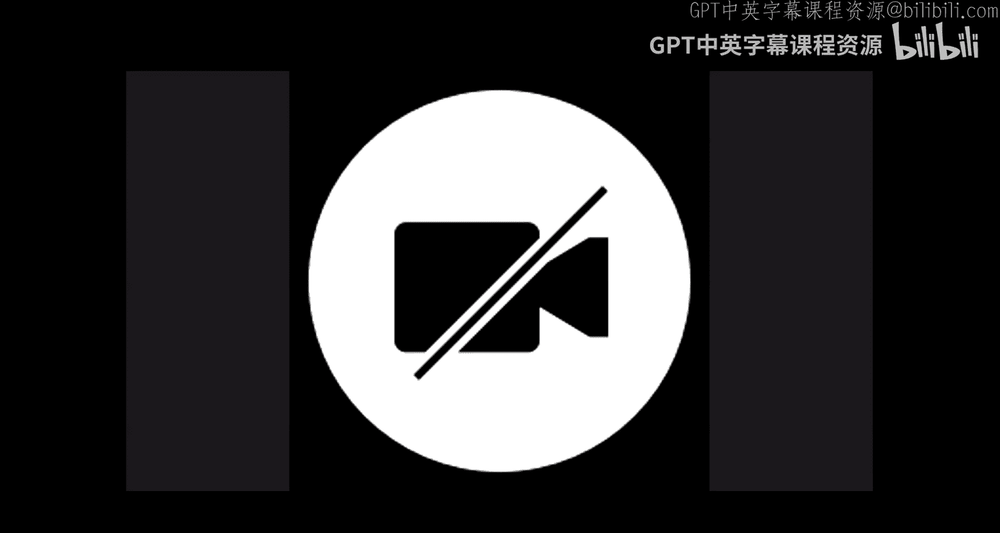
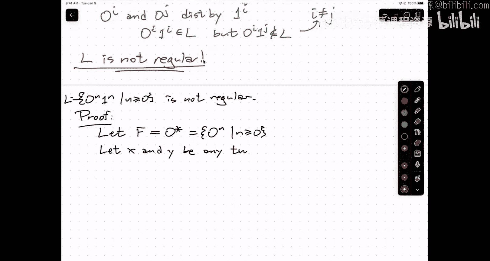
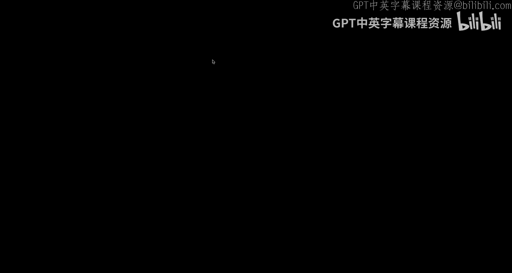
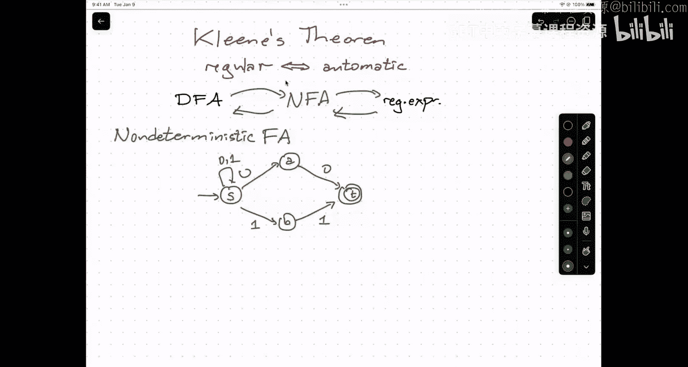
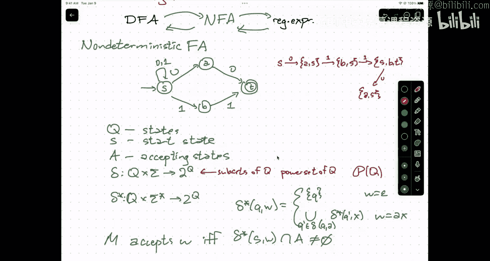

# UIUC《算法与计算模型｜UIUC CSECE 374 - Algorithms and Models of Computation 2023》中英字幕 p05 20230905-Sep 5_ Fooling sets and intro to NFAs.zh_en -BV1Mh7RzaEL2_p5-

。

这啊，行行。😊，What。然后他。Okay， let's go ahead and get started。Thank you all for coming。So as usual。

A couple of quick admin things。Helomework one， problem one is graded。

Which means you can find everything on gradecope。Including the forms to do。

To submit regrade requests。So just a couple of words about regrade requests the way that we're going to handle this。

What is you。Absolutely welcome， encouraged to talk to me。Stop。

Hidates that you on your homework problems。No has the power to grade anything in your present。

 regrade anything。Anyway way to actually re。Is to submit a re grade request on grade scope and that regrade request must come with a justification。

We。With your great team。Likeful。You took off points for the base case， right。you said in。

The group was four points， but you took off six。啊。Things like。My solution is actually correct。

But you took off points incorrect。That's a reasonable justification。I need more points is not。😡。

The rubric is too harsh not。Please can his。I was surprised at how few points I got could？

You need have。I do believe is income according to。Now there are a couple of edge cases here。嗯。Yes。嗯。

You were。To len it。So for example。If you submit。A所 out。

Bringing to the rubric is worth're two out of10。And greater is。Poins up。And you submit。呃。Nine。

 but you should。一。7 point。不者。60。Yes， I am completely serious。嗯。And cut。You get bonus points。一都。😡，go。

Several now and。Ones ever take advantage of this as I think the two years ago。我。Well。People。一。The。

Thank。If the grade is we want to treat grade fairly， but if the grader was too lenient。

Fors you for recognizing your own mistakes and your own solutions。

We will give bonus points for pointing out that the graders were too lenient the other thing is。

There is a。If。I write something in the solutions that is just。Of course。

Everybody gets full credit at the end。Like the entire that。

It was still shows that something still give you feedback。Theation derivative。这么。So got。

He's applied together。You can have 100% and still be the lowest score in the class。Okay。

 so regrets are due within years。For midterms， that'll be three weeks after the grades are released。

Of。If the initial response。Re great。TA in charge of grading the problem， the CA is around the loop。

这是。Yeah。😊，就是哪个行业。But。But。For the。Really a or confused is anger complicated， but in the end。

 I'll make a decision and then it will be final。All right。嗯。啊。Homework。

OhSo sorry GPS two is due tonight at 9 pm Home at two is due。Tomorrow。9 pm。GPS3。Is due next Monday。

At 9 PMm。And homework three is due。Next。Tuesday at 9 pm again。

 the delays this week are because of Labor Day。Any questions about Reg requests。

 any other administrative？So。Let's talk about DFAs。So last time。

We discussed this thing called the product construction。That lets you build。

Larger DFAs are smaller DFAs。😡，So this is the example I used last time on the left。

I have I make this a little bit bigger。On the left。I have a。

DFA that recognizes strings that have two zeros in a row somewhere。On the top， I have a deep。

Sts at two months。More。And。This。Product machine。That I built from this recognizes strings that paint both of those substratestrs。

And again， I do want to emphasize that the structure of the graph。

The vertices and edges are determined entirely by the vertices and edges of the two component DFAs。

 but the definition of the accepting state。In in the product DFA depends on what combination of the languages you want to put together。

 so if I want to change this。To。Either or。嗯。I guess I'm going to remove either because that makes it sound like it's an exclusive bo。

If I want to， you know。A DFA for strings that either have two zeros in a row or have two ones in a row。

The only thing I need to change is the set of acceptances。

So if I wanted to specify this in my homework。I would say I build the products of FAAs and these are my accepting states。

I don't need to regurgitate all of the formalism of what the product construction is。

 that's all in the notes that's on your cheat sheet during exam。

 we know that you know it you know that know that you know that we know that you know it so you don't need to write it down again okay。

Um。Now， one of the things about this product construction that many people know problems immediately。

😡，It inefficient。That isn't a problem， we haven't so far thought that much about what it means for DFAs to be efficient and in general。

 we really don't care generally we're using DFAs just to prove that a language is regular。

 as long as it's not an astronomical number of states， we don't really care what the number is。😡。

But there are circumstances where you do。And there are a couple of ways that can be inefficient one is that there could be states that you just can't get into。

You can't reach this state from the start state， so there's another a point in keeping the state around。

 you throw it away。But a more subtle one is that。Sometimes you have states that are equivalent to each other。

 so once this product machine enters。An accepting state。

 one of these five around the bottom right boundary。It will always be in an accept state。

So at this point。I know I'm going through exponential。

And this mirrors the intuition that once I've found two zeros in a row。

 I don't have to keep looking for two ones in a row or future two zeros in a row。I just say， okay。

 I know I've satisfied the condition I want， though check。And so， you can take。This。Rather。三だけ。

Thank you。This rather silly looking。Oh。呃。EFA and collapse the states that are。

Equivalent to each other。To get something that looks like this。Okay， so there's a start state。

There's a state called zero that is I haven't seen zero I haven't seen two zeros in a row yet and the last symbol I read was a zero one。

 I haven't seen two symbols in a row yet， but the last symbol I read was a one and T。

Is just for target， I've seen two symbols in a row。

Well generally there's a systematic algorithm for taking any GFA and translating it into an equivalent DFA that happens a number of states I want to poke a little bit about how that works。

By just asking， you know， is this？The smallest。DFA。For the language。

 this is the set of strings that we're recognizing now。嗯。嗯。

I can recognize strings that have two the same good in a row， using core stick to。😡。

I do it with three states。Do it with toastth。I'm pretty sure I can't do it with one state because。

The strings have to。嗯。So。How do I know？This is the smallest DfaA for this particular life。第F。Bates。

There's only， I don't know， 80，000 of them。And I could compute the regular expressions that they。

We recognize and somehow check directions for Col。What do we adding。So。

So let me try to repeat what he said。we can argue by saying。好。It leads。Verse。

Proble with this this sounds like something that is。Are you specific to this particular language？

And what added is a could ask more generally。About anything how that。Yeah。Is as small as possible。

Yeah。Okay， if I can't merge anymore， but why can't I merge anything anymore？Okay。

 there two states don't go， the transition functions always lead to different states we're starting to to get close。

But notice over here。嗯。In this original thing with nine states， that was also true。

I never have two one arrows， well I guess in the corner I do。U。No， actually。

 I have that year too in the small DFA。2。And two zero arrows point to A， so it's dial。

Highrely true that the transition function is。呃。It's not an objective as kids say。嗯。个别。Different。

The that。So。For this。啊。For state DFA， how do I know that I can't merge state S？我们。Does。I。Of that。呃。

So there's there's two strings there's a string that leads to different things， the state's S&T。

 what is that string？S， it's the state on the left， he the state on the right。

I can think of a simpler one。The empty string。S& T are distinguishable。

Because one of them is an accepting state， and the other one isn't it。你发。

I T together then things that would lead to X in the original DFA would accept the new DFA。

 though they don't accept in the original。So I can say。啊。Well， the answer here will be yes。

But I'm going to say that two。States。Let's say Q and Q prime。U or。Distinguishable。If and only if。

There is a string。W。Such that。If I look at the two。States that I get to。Starting at Q and Q prime。

 we' be reading string W。😡，啊。One of these is accepting。But not both。系。

And I would say that the two states are distinguished by this string W。

Okay now I can write this differently you know by sort of expanding out the recursive definition of Delta star so either one of。

Q and。Q prime is accepting。Or。No， that missed the key。Or。There is a symbol。A， such that。Delta Q A。

And。Delta Q prime a。are。Distinguishable。Okay， so either。There。Quote unquote， obviously。

Really different because one is an accept state and other is not。Or。

There's a single street that's notempied that I can follow about。

And eventually when I get to the end of。We taking according to the。That。对。It's too an honest。诶。So。嗯。

In this example up here， you know S and T。Are distinguished by the empty strength。嗯。In fact。

 everything NT is distinguished by the empty strength。

 so I can just write those down immediately zero Nt and one Nt are distinguished。

By the empty strength。What about S and zero？Esson1， zero and one。嗯。

So if I take the say S on the left and the say zero and top。不是。Please be sure。

Strerange that distinguishes them。0。So if I start in S and I read zero， I go to state zero。

 which is not accepting， but if I start in state zero and I read zero， I go to an accepting state。😡。

So S and zero are distinguished by the string zero。

 symmetrically S and 1 are distinguished by this string one。

 and then how are the top bottom states distinguished？行。

The state zero is not an accepting state and state t is。WellI started those two states。

 I followed nothing and I end up in exactly one of those two states。ははい。But。That。

How your art say yes。Then this。Yes， that that's exactly right。

 S and T you're distinguished by the empty strain， because if I started S and read the empty strain I on the。

Yeah。By spread tea and， I end up at an inecting state named tea。What about what about zero and one？

Yeah。系。Yeah， either of these one bit strings would work。zero sorry zero and1， if I read a one。

 for example， I'd end up in states and T。还有。So I can distinguish every pair of those four。

Have to actually be different。I collapsed and needed those four states。I screw up the effect guy。岳飞。

系。The converse way of saying this is。Two states are indistinguishable。If for every extreme。对。

E states。不回。Thanks Dave。One time in the Tuesday。Indistinguishable if no matter what I seeed in the media after that。

 get exactly the same out。😡，end。What the minimization algorithm does。

It looks for distinguishing strings so that it can partition the states into smaller and smaller。

something。ですね。Partrisitionan。But within each of those subsets。

 everything is indistinguishable and can just collapse that entire set down。嗯。嗯。就啊。

Another way of saying this。I。Well， actually。I think I've said as many different ways as I need to。

But now there's。Excuse me， now there's this interesting thing I can generalize this idea not to be about。

Sp。If is。To be about the language。对。And so I can say， all right。Let's think about。

What it means for two strings。To be distinguishable。Some language。嗯。So I'm going to say。You know。

 this is very similar。Springs X and Y are distinguishable。You know。

 this is with respect to some language o。If and only if。There is a string。Z。Such that。

X z is in L or Yz is in L， but not。Both。So instead of thinking about a particular machine。

And the solution through stay。say how would I get into the？Oh。给你。

What distinguishing those two states means is there's this suffix that I can add onto the strings that got me there that would one of lead to an accepting state but not the other。

😡，Up there， I called it between you down here I'm calling it Z just because Z comes after x and y in the alphabet。

But this is basically the same idea。Only now I don't need to refer to any particular。DFA。

I could start out by saying， well。嗯。Let's look at。嗯。Let's say a set F。Of strings。

Let's take as my example here， the empty string， the string zero， the string 1， and the string00。

And L is going to be this language that。I。'Been playing with so far okay strings with two symbols in a row。

This is a。Fuol in。这。Or L。What that means is that I can distinguish any two strings in the set。

And we've seen this before， so Epsilon and zero zero。Are distinguished。By epsilon。

 because epsilon is not in L， but 00 is in L。Okay。That's exactly know what。

I wrote a bear about the DFA， I mean now I'm thinking about it in terms of strengths。

And this is true because this statement that I'm writing about strings。

 isn't referring to a particular DFA， I'm just using that DFA to prove a sort of guide。😡。

How I've showed that this is actually a fulling set。So， you know， I can also distinguish。

That by epsilon and 100 seems by epsilon。Epsilon and zero is distinguished by zero。

 epsilon in one is distinguished by one and zero and one is distinguished by， I don't know if one。

So I've got these four strains。That。Pair of which。Has a distinguishing stuffs。😡。

What this means is it any TFA。That accepts this language。Those four strings must end up in。Third。

呃 different。Space。哎，对。So。This this is。Implies you know， any。DFA。Or L must。Have。At least。Four states。

So no matter what DFI have that it cuts L。The state that I get to by following the string and the state that I get by following the string  zero zero are distinguished by the empty string。

Because。OneOne of those。He should be accepted the one。This is a little bit。Abstract。

 so I need to make sure。That people want。But。嗯。They are65lon okay。So I want I claim that the spring。

Ts people are distinguished。Epsilon is not spring in my language， does not have the same character。

不是。If your hurts in a row。On to make them distinguished。That's why the thing is uppsilon。

 but if I look down here at the strings zero and one。Just single bits。

 neither of those the like so I can。You。But if I tack on a one onto both of them。😡，T 01 and11。我你。

Is language out who's got two ones in a row？By tacking on that。I now get a pair of strings。

 exactly one of which is L。So attack that extra stuff。Distinguished。Makes sense。

But for those examples and we had that that were in A by that were' not in LA previously had seven states。

Right， so the。Is when I talk about it in terms of machines， the distinction is。

 does it lead me to an accepted state or not accepting a rejecting state？

But remember what that means this total string that I read isn't not of blackish。It's really a might。

那。Okay， so fullig sets are not unique。I could replace this string0。

 zero with any string that would lead to the accepting state in this DFA， any string at all that had。

😡，Two of the same bits in a row。I could put I could use that in place of zero zero no I might need a different distinguishing suffix in that case。

😡，嗯。But that's。好。The point of this whole exercise。Is that。The minimum number of states。In a DFA。

Is equal to the maximum number of strains。In a fooling set。So for my language L。

 I found this blue set that had four strings in it， that tells me every DFA。

L have at least four states because those four things have to each lead to a different state。

I constructed a D that had four states。So the minimum DFA has at most core。😡。

So at least Florida most Florida that tells me that these are the same it's nice。

I of something it's related to the maximum of something。In this case。

 they're actually equal to each other。OkayNow the interesting application of this idea。

Is not so much in computing minimum DFAs。I didn't show。충급。欢迎。What。

Language is something that is accepted by a deterministic finite state automaton right emphasis on the word finite。

So let me show you an interesting example of the language here。😡。

let L be the set zero to the n 1 to the n， where n is some non negative integer？

Notice this is not zero star1 star。zero star one star means any number of zeros followed by any number of one。

 two numbers do not have to be the same。The definitionition of L。I mean。

 some number of zeros flow by exactly the same number of ones。😡，Thanks so this is。

Epsilon or 01 or 0011 or 000111 and so on。嗯。I'm going to construct a full trip。

We haven't looked at a DFA for this yet， but let me start by building the fooling set for L。

 I'm going to let my fooling set be Epsilon 000。I claim that this set F。😡。

Is a full inset for this language out。Okay。😊，So how would I distinguish？Epsilon and zero。

Distinguished by， well， I could add a one onto it， then epsilon and zero would become one。

 which is not in the language and zero one， which is it。😡。

I can also distinguish by epsilon because that would give to be zero epsilon。

 which is the language and zero， which is not epsilon and zero zero is distinguished by 11。

 zero and00 is distinguished by let's say 11。So the strings zero and the string zero zero are distinguished because if I tack all to11 at the end。

😡，I now have the strength 011。Just not in a language because I have one。And because zero is011。

 which is' in the language， it's two of each。So this argument tells me every DfaA for L has to have at least。

Three states。But I could do better than that。嗯。So I could throw in。0ero，0，0。All。

 so how would I distinguish？That and that。How would I just think it10 from three zeros？

I could add three ones。Actually， I could。こ。W it up， though。

So how would I distinguish zero to the I from zero to the J where I and J are different？

So I have 27 zeros in a row and I have 4。It's a row。What can I glue on to them at the end to？

In this case， one to the eye。So so zero to the I， one to the I is in my language。

But zero to the I1 to the J is not in my language because I and J are different。

And this works for any two natural numbers on the Bay that are not the same。Means。

Ive found a pen set。How many states would a DFA that recognized L have to have？诶。50。All。

Stake machine with an infinite。The whole point of finite state machines is that the number of states is finite。

 it's right there on the top of the box。😡，I might say it。So this is a proof that L is not regular。

Because if it were， this is any state machine that recognizes L。

 according to the rules of state machines that we've use so far。

 would have to have an infinite number of states and that's。Yeah。zero and zero0 by one yes。

 so the distinguishing confidence is not unique。So I could also distinguish， say。

 zero and three zeros with zero00111111。嗯。So if I glue that onto zero， I get four zeros。

 five six ones， I glue that onto three zeros， I get six zeros。So。The distinguishing suff is unique。

The is also not meaning。Right in fact we I think it's。For every non regular language。

 I believe there's an infinite number of infinitefuls。啊。你这是一种。8。This is how you would prove。

That a language isn't regular， you would say， ah。I find an important out for that。😡。

And what does an infinite fooling set mean means I describe an infinite set F。😡。

And then I argue for every pair of strings in that set F， I can find a distinguishing suffix。😡，可。

So here is sort of boiler platelate。For how this works。Right， so I'm going to write the。

Through the n1 to the n， where n as greater as than equal to zero is not regular。Proof。U。

Let F be the language。You know， zero star， but I can write this out more explicitly as zero to the n where n grade or equal to zero。

Okay。Let X and Y be any。Two strings。

In F。Sorry。

Then。X has to be zero to the I， and y has to be equal to zero to the J for some non negative integers。

 I and j that are different。By definition of F。Okay。Now I'm going to say let Z be， I'll change it up。

 I'll say one to the J。Xz is0 to the I1 to the J that's not in L。

Yz is0 to the J1 to the J that is in L。And it's not an L because。😔，I and J are different。

So Z distinguishes。X and Y。And because X and Y are arbitrary strings in F。We've proved。

So F is a fooling set。UFor L。F is infinite。So L cannot be regular。系。And I'm going to highlight。

This part of the proof。The part of the proof that's highlighted in that yellow box。

That is a proof that F is a fooling set for L。The definition of a folding set is for any two strings in F。

 so I start with any two strings in F。There's a distinguishing suffix， so end with Oz。Why。U。

Then I declare what my suffix that I think is going to distinguish。

 and I argue that in fact it is a distinguishing suffix and in this case the argument is pretty straightforward for some of their languages it's going to be possibly a bit less straightforward。

嗯。But here is the boil of light， the parts that you will change when you want to do your own fooling set proofs。

 one part is you get to design the fulling set。😡，And different languages L are going to be fooled by different infinite sets F。

That also is going to control。What comes out of the fooling set？系。And。

Then the other piece that you have control over is what is the distinguishing suffix that you use for that that particular pair and the distinguishing suffix is always going to be like some function of the two strings I and J。

 or in this case， the lengths of the two strings。The links are INJ。And I guess。

 you know you have to fill in the reasons and you have a choice about weather。

whichhich one is an ill and which one is not？But all the rest of the stuff that I haven't highlighted in pink。

It's really just word plate。You should just learn。嗯。系。啊。

So I want to walk through this proof again one more time with a different language L。

And then it lab tomorrow。You'll go through several more examples。

One piece of intuition that I want to emphasize here is what it means for a language to be regular it accepted by a United state gene。

This language L from being here， you have to count zeros any algorithm recognize the string has count like best to keep of something。

And so the art of finding the right fooling tech。Is。

Findying something that you have to count or something that you have to remember that could take on。

😡，We large user internet。And so your full set is going to capture counting this one thing。明明。嗯。😊。

And the distinguishing suffix is essentially what。Counter。Want to。In the out。Okay， so。Let me。

Give a second example here。So。Let's let L be the set of all palindros。

This is the set of strings W in Sigma star， such that W is equal to the reverse of W。Sofa。You know。

Take us an example， 001010100 is a palindrome because if I reverse the bits。

 I end up with exactly the same strain。嗯。I claim that this language is not regular。So。Sierorum。

E is not。Regular。So here's my proof。Let's consider。The the set。F equals。Well。嗯。啊。

Let's say zero to the i1。Where I is greater than equal to zero。Now。Thank for here。Des of the poem。

 there' was a single one and a whole bunch of。Yeah。Um。

 I'm kind of intuitively arguing that if I want to recognize that kind of down。

 I have have I have zero show before the one。And then compare to that。嗯说吧。

So I'm basically putting the first half of my pindros in the set。And the second half。

 the rest of my pounddros is going to live in my distinguishing suffixes。Okay， so。Let X and Y be。

Arbitrary。Distinct。Strings。NF。Then。X equals zero to the I1 and y equals0 to the J1。Or some integers。

 I and J that are different。That's just my definition of。So at this point。

 I claim that I can distinguish that to why。By building different palindrums out of them。

But by gluing the same suffs。So the suffix I'm going to use is zero to the I。Then。

X z equals zero to the I 1，0 to the I I zeros， a single one and I'm more zeros。Is a palindrme？

But yz is0 to the J10 to the I， which is not in L。Because I is not equal to J。

 the one is not exactly in the middle。If I is less than a that this strings zero to the J1。

 zero to the I， the one is too far to the right， so when I reverse it， it's too far to the left。嗯。U。

So Z is。A distinguishing suffix。For x and Y。So F is a fooling set。For this language L。F is infinite。

So S is not。Regular。Again， most of this is just boilerplate。I'll highlight the parts that are not。

Here I defined my fooling set and that shows up as how I picked out my strings X and Y I needed to define my strings Z in this case I chose the first one to be anL and the second one not to be and I still need a proof for the one that's not。

Actually， I need a proof for both but。I think this is obvious enough that I don't derite anything。

So the parts that I've highlighted in pink are the only parts that required me to do different about this language and other。

😡，Yes。Oh， sorry that sorry， fingers slipped。🤧I care。So notice。So the one in the palindrome。

 in this case， I stuck into the strings in the full。

 I could have had the fully except strings of zeros and the puffs have a one followed by a bunch of zeros。

But I needed to have the one in there somewhere。What I can't do is say the fooling set is all strings of zeros and the distinguishing suffix is zero to the whatever。

Because when I look this string of of zeros， it's always。even though。

I've sort of presented this as glueuating two strings together。😡。

I have to analyze the result as a single string， and it might split apart interestingly in other。

Some kind of land in there。I'm done with the first half， I'm going to start second half。

 whether that landmark was put inside the fooling instead of the distinguishing suffix is completely up to you。

 yes。that。Yeah， if IJ were equal， hopefully I can't distinguish string from itself。

So and sure enough， xz is0 to I1 to0， that's pm and yz is0 to the I1，0 to the I。

 which is about so I didn't。Z the optfront salda。Yes。I was first talking event。

Unless I say explicitly say otherwise。Any exponent that appears in a regular expression or in a spring？

A non negative intesure。So。something like that。I'm sorry。So in the fulling set there。

The full executive。As zero， zeros followed by one。Okay， so this is a good question。

 if I want to show that a eFA is minimal， do I need to show that I can't collapse anything least？

Do I need to explicitly find a fully extent turns out those two things are the same。

The way you show you can't eapate。If you do the right bookkeeping， Billtons up。

It's a strain for every state。Distinguish every pair of strings in the empty set。But it doesn't。

I mean， I think a point is you'll notice I never consider。Any palindrum that starts two ones。

There are lot of hodromes that never show up anywhere proof。I'm not actually finding all equivalents。

 classes of springs， don't care。😡，It actually turns out that。啊。If I'm very careful。

 I can use stick star as my folding set。ForFor this language。Have have to be very careful。嗯。

Proving things are hard。It's a not book job。Sp case。嗯。Poros。It's not show。Howynros。

I only need to consider that special case。Solve the problem。

 I'm trying to find a DFA have to consider absolutely all possible inputs when I'm trying to prove that the DFA。

I'm trying to prove that something is hard or impossible to compute。

It's okay to concentrate on a special case of the problem。If you can't solve the special case。

 then you can't solve the more general problem either。All right。Yes。By。哎，第个。Okay。

Why does every nonre language have an infinite full set？

It basically boils down to this min Maxax thing。ま所最判。So I was deliberately skipping over the details。

 but what you can do if you find the largest possible tooling set。可。So in fact。

 you can classify all strings in Sigma star into equivalence classes。

One for each ring in that largest holding set。And those equivalent classes correspond precisely to the states in a minimal DFA。

This is the set of strings that reach that state in the minimal DFA。

And so if you're pivot partition all springs into。被扣的很差。I'm的。Some the lecture notes。Yeah呀。

It's somewhat sketched in the lecture notes， but it's basically there。All right。So like I said。

 in lab tomorrow。U。You'll get to practice a bit more。But this is one of the first examples where。

They're trying to prove that something doesn't exist。In this case， by constructing something else。

And so it takes some time to get used to。The flow， the logic。

I should also point out that there's another technique called the pumping lemma that a lot of textbooks use to prove the language is popular。

 so if you go out and the have you know，你。The reason why choose the folding set thing。

 instead of the pumping lemonma in my experience， every pumping lemonma could be transformed into folding set。

Regular languages where the pumping limit doesn't work。So this。The other one is protectbook doesn't。

So let's use the one that always works。And I find this less confusing。

 partly because there's a bit less back and forth with the quantifiers in the proof。嗯。

So if you run across the clumping limma。Feel free to learn it。

 but please don't use it in the homework。You're just doing more work for yourself。All right。So。

We've got。10 minutes。嗯。And in the last 10 minutes， I want to put something in your that is just going to sit there for two days。

嗯。This is related to。Pinney theorem。Which says essentially。A language is regular。

 means described by a regular expression。If and only if it's automatic。

 meaning it's accepted by a finite state automaton。And。The way cleaning's proof works。

Is I describe a way of transforming。DFAs into regular expressions。But I do it。

By way of an intermediate representation called an NFA。Okay。嗯。

A non deterministic finite state atmaton。Right。U so。Non deterministic。Finite state of tomaton。

The word determines。In DFA。是。The evolution of the machine is completely determined。By。The function。

You。So when I read a bit Zro。Must follow the unique transition out of my current state。

That has a zero on it， at least to my new state。没。Cannot。Blindly follow the directions。

 it's a machine， I turn the crank that makes the gears go， that makes the wheels go around。

 that makes the hands turn。😡，Out pops the gum ball at the bottom right， no choice at all。

A non deterministic finite state machine。U the evolution of the machine is not completely determined by the state's transition functions and the input because you can have multiple transitions out of the same。

😡，To have the same label。So I'm going to give you just start by giving you an example of an NFA。And。

This will。嗯。Actually， I'm going to array， I'm going to leave that off。

So I think that's more interesting with it off。There is an NFA。Okay， so if I'm in state S。

Label these A， B and T but if I'm in state S and I here a zero。I have two things that I could do。

 I could stay in S。Or I could leave past State bank。Aol。So got a bit zero because I have a choice。

Do we say us？Right day。Let's say I moved to A。Now I hear another zero。😡，In this case。

 I don't have any choice。I must move to the final state date。For one。IPad。

Is that you need been a doctors strength？Time and says， actually， you know what， let's not choose a。

 let's choose S。Okay， so we're we're。呃。This NFA accepts。

All strings that either end with two zeros in a row or end with two ones。The idea is。That。

A magic fortune teller who sitting at State S。Says， oh， you got a bit， that's nice， oh you got a bit。

 that's nice， Oh that's oh you got to wait， this is the。Now there's no way。Soically， the oracle said。

 this is the second。If you got a zero， you could go。应对。Yous relaxed。And well， if it doesn't match。

The you die。But that the oh， that was the last bit。At the end。You're accepting。可以。So。

This is a very sort of strange and at least at first counterintuitive idea。

That I have a set of states。I have a start state。I have a set of accepting states。

And now I have a transition function。That as usual takes in a state and a symbol。

 but now instead of returning a single state， it returns a set of states now。This is weird notation。

This is。Subsets of Q。This is also called the power set。

Of Q sometimes people like to write it with a fancy P on it。

 I prefer the two to the Q notation because。If Q has 17 states。

 then two to the Q has two to the 17 states。the 17 elements sort of mnemonic for for every element of Q。

 I make a binary decision about whether to keep it or not。嗯。Now again， I can sort of extend this to。

A transition function over。Strings。The same way I did for DFAs， and I can do that recursively as。

Delta star of QW equals。Well， if W is the empty string。

 then I started in state Q so by not doing anything， I must not do anything， I must stay in state Q。

 but I have to return to set so。😡，There's my set。Otherwise。

This is the union overall Q prime in deelta of Q comma a Delta star。Keep Prime Come X。

Where W equals a x so this is the union over all possibilities for for the first state that I do by reading the first character。

😡，Of the set of states I can get to by reading the rest of the string starting there。Right。Again。

 this is kind of a you know wall of math， but the intuition is something like the following。

 if I start in S and I read a zero， well， then I could end up in either state A or state S if I then read a one。

Well， the parallel universe in which I'm in state A dies。

 the parallel universe in which I'm in state S branches and now be either in state V or in state S。

I read another one can be in either S or B or T。啊。And maybe that's where I would stop。

So I'd say an NFA accepts。The spring W。我 only有。The speaks I get to from the start date。

Contain at least one state。So。That evolution of the machine。In fact。

 this history of all possible evolution change tells me that this NA will accept the string 011。

Right there are a couple are thinking about how this works yeah question0。

If my input consists of alternating zeros and ones， then it will never reach A， that's correct。

So it' start back from no， every time it will continue in the parallel universe that it finds itself。

Okay， so the way to think about this is。When you have a choice， you up。B choice。

But you have no choices， you kill your。If any。To an existing state at the end。The whole is accept。

So this is the lowki branching timeline。TheD。 strangerange version is。you have a choice。😡，Magically。

Yes。It。That will lead to accept acceptance so for this input01 one。

 when you read that first oh you will just know that。The，P。T。いかか。

And then say one but T doesn't have an error that's right so let's say from here I read zero I would then go to A and S。

S can branch to either A or S， B doesn't have a choice so it just dies。

 T doesn't have a choice so it just dies。So if you have no choices， you're white。😡，So。

S keeping the symbols end up with。At all possible branches。

 every possible thread runs out of choices， all threads die before you end the input string in which case。

There's no accepting threads， so you're not going to accept。Okay。G about this for a couple of days。

 we'll come back and talk again on Thursday。Thanks。是。I's this basis of like data。

That's that was what because like you just kind of back sports that way， that's exactly right。Fand。

 initially with call Directorssor we give housing and then after this lecture off。

