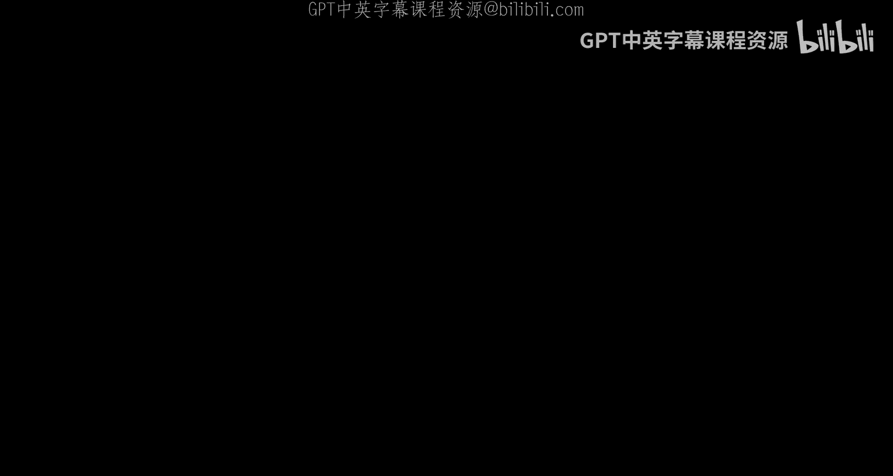
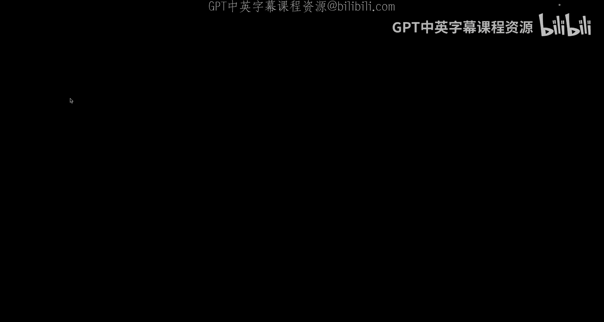
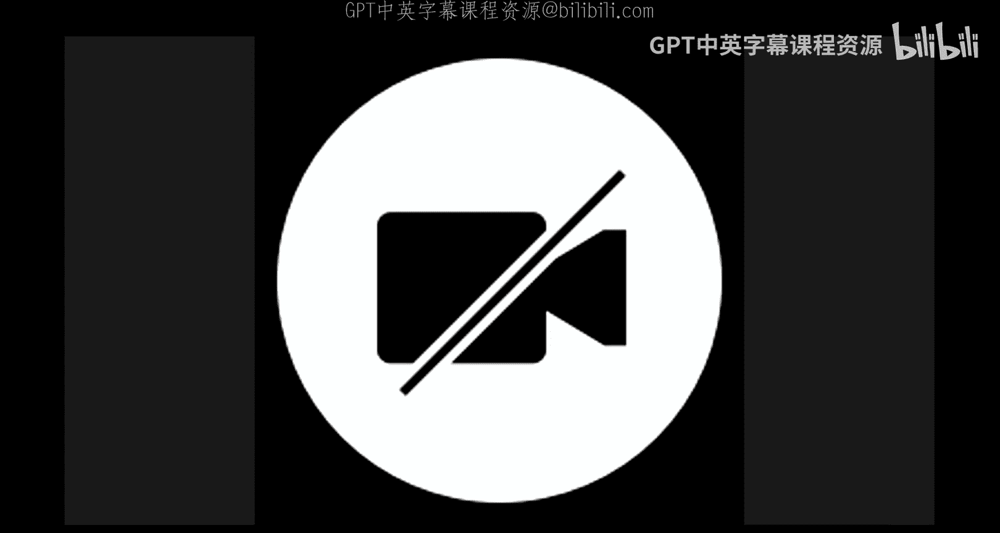
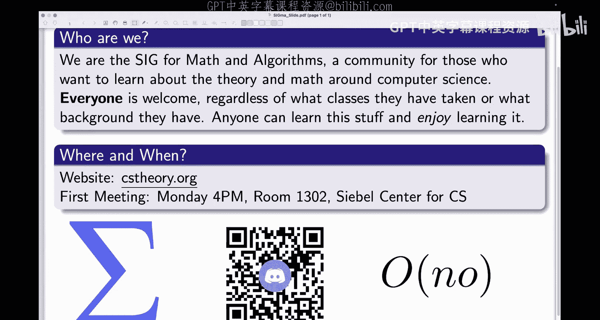
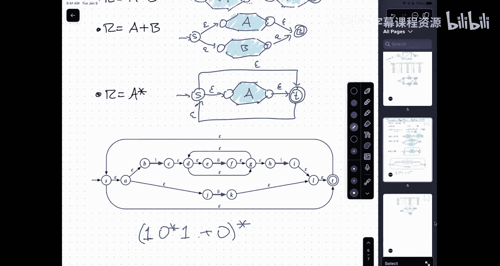

# UIUC《算法与计算模型｜UIUC CSECE 374 - Algorithms and Models of Computation 2023》中英字幕 p06 20230907-Sep 07_ NFA variations and (most of) Kleene’s theorem.zh_en -BV1Mh7RzaEL2_p6-

。好。

Yeah very。

咁系。我要系个。打到。I。唔该系该。Can I steal anyone now？没有。started announcement Sigma before we get on with the class。

Hi everyone next last year being if you find me the set Institute on it theact algorithms every Monday to give a talk on theory this matter between coding and information we have all our community talk recorded we did and conferenceial algorithms we also to get a talk by I welcome all of you to join us at2130 on Monday at 14 if can all of both join our from the QR code or we and we have a wonderful community where we talk about our theory things and hopefully you find something we might parent。

嗯。And this is， of course。A of the student chapter of ACM， which is the oldest and largest。

AChaer of the student chapter of ACM anywhere in the country and anywhere in the world。

 so more generally。If you haven't already， go introduce yourself in the ACM office。

 this is really an incredible resource that is unique to this university。

 please take advantage of it。

Right， so I'm going to try。

To get my machine to do what I want。So pardon me just one second， I need to。Check on。Is this working？

Apparently， great。L mic isn't working， okay， sound is going to be a little bit weird on the recordings。

All right。嗯。Gues， I should start with a couple of very quick administrative things。One is that。

There was an issue with。GPS， the guiding problem set two vanishing。嗯m。

So I had I messed up a pray named the apple from that concept， so if it was up live until。Um。

Tuesday at nine， which is what the official due date and then it this vanish so anyone who wanted to work on it late or anyone who wanted to continue playing with it to get mal practice it went away and people who didn't I did it that I still yes。

 everything that you submitted before the deadline is still there all the grades are safe all your work is done I added GPS2 back so I came to the act rules back。

So the extended deadline for GPS2 is not yesterday at 9 pm it's today at 9 p。

m so I gave everybody an extra 24 hours。And instead of late work being more 50% it worth 90%。

 so hopefully that'll make up for the stress and confusion of vanishing。

Please do let us know and's let this happen again。All of us on the pra learn team。

 all of us and the our staff are human but we're all going to make mistakes but in particular I'm going to make mistakes so the sooner that we find out about those mistakes the faster we can correct for them。

 but the sort of overriding principle that at least I try to follow is mistakesd by the poor staff。

I may should level of you。哦。Okay， so that's been fixed。The other thing that I want to。

Talk about a little bit of over price， so the I price and nus。And they conceal。

A couple of the people the TA and CAAs who've been attending these things are starting to report that people are coming to the Hu parties working mind themselves and raising their hands to ask or staffing questions。

I really want to emphasize that the point of the homework parties is to work with each other。

So before you ask the Yas for help， ask the person sitting next to you for help。Um。

 even if it's like， I don't really think I need help， I just want to， you know。

 verify about the I think to ask the person next to you if they been you've done the right thing。

Again， really want to emphasize this that I'm trying to create。

A social atmosphere where students can help each other， partly because as I'm talking about race now。

 student body is by far the single most important useful resource that this part has and it's also the only resource that scales up with the number of students。

The number of faculty doesn't scale up with the number of students。

 the number of T is doesn't scale up with the number of students。

 the only thing that scales up the number of students is the number of students。

So please do take advantage of that， it's not that we don't want to help you。

 but we want to make sure that you're using the resources that you have available to you as much as possible。

😔，哦。I don't think I have any other administrative or logistics the except for those two things。

 but I'm happy to answer any。Okay， awesome。Last time。嗯。I started talking about。Non deterministic。

Planite state automina。And this was the example that I gave。嗯。Is a more state5ee that accepts。

Instead set of all strands that have the same big place in a row。

 you know two00 or two ones in a row。Now it's like。A。DFA in the sense that you have states。

 you have a transition function and certain states are marked as being accepted because they've got a double circle and other states are marked as being you know there's a start state it's marked of an arrow。

 but it's a little bit different in that the evolution of the machine is not determined。

By the transitions and the English。So if。For example， I feed in the input string here。

Let's say feed in the input string zero，1，1。Z。1 zero， zero one。When I started in state S。

And when I read a zero， I had a choice of how I might evolve。

I might say sick or I might switch the state ahead。I've got two different options for what I can do。

 the rule of the game is I want to accept the straight if and only if there's some way to end up in the second。

He， so one way to imagine this happening is that a little bird lands on my shoulder and says。

 you know what you should just stay at us。So this is how I might。Revolve。Okay。

 so when I read the first several I just hang out of this it's all me when I read the zero near the end of the input screen。

 I go， you know what， I have this inkling， I have this sense little bird lance on my shoulder tells me I'm about to leave two zeros in a row the next bit coming after this one is I just have this view it's also going to be a zero so let me go ahead and transition to say that and here enough the next that comes in and it's zero。

Now， in reality you can't predict the future， no one can。

 and so you had no real way of knowing that this was going to be the case。

 but this is the magic of nondeminism。Nonterminism means you make a guess out of the options that you have。

But somehow magically， you always made the right guess。If there is a right guess to。All right， so。

It's a sort of， you know， magic。But another way that you can think about this。Is。

That when did you run the minute that you spawn off parallel threads？

Or each possible future evolution of the machine， so I start theater in say us and when I read the first zero the universe branches。

And in one parallel universe， I say and say this， and in another parallel universe， I used to say a。

Now， the next bit that comes in is a want in all universes。

And now I again have a choice to find an S in the universe where we're in state S。

 we have a choice to they're staying in S for granting to state B。

In the universe where we decided to go to state A。There are no outgoing heroess labeled one。

So in this universe， there's nothing to do next now that does not mean that we stay in state A。😡。

We are required to do something but there's nothing to do the right way to think about this is we have reached the contradiction we should never create this universe of the first place。

😡，So he destroyed that and killed that threat。Okay， so whatever state I'm in。

I'm going to have exactly one thread for each possible transition out of that state。Particular。

 there are no transitions out of that state there are numbermorph fors。And the magic。

Path that I that I described above is just this path through the threats now notice I may be viol the threat metaphor a little bit by observing that two different threads and up in the same state near the end of the industry。

Any simple， I'm just going to think of those the same bread because it's the same machine in the same state。

 having read the same bits。嗯。But notice this is not the only path through this grant diagram that would accepted that string。

I could also decide， hey， I like this pair of ones。I'm going to accept this way。

So as long as there is a way to get from the start state to the exciting state。

By following all possible options， given by screen。Then the family atmosphere。不是嗯。

Is there a difference between a threat being killed and having？And instead don with the state。OhYeah。

So。Is there a difference between having the Fred baby killed and imagining that there's always you can always go to a dumb state。

 not really。But I I。Just like I won't get ever used to the idea that natural numbers can be zero and springs can be empty。

 I want everybody to be used to the idea that sets can be empty。So the set of states like to be in。

Might be it's possible that every thread gets killed off in a case。No， no。

 but this is we to an accepting state at the end and we'll reject。

So if you're really uncomfortable with the idea of I have no options therefore I destroyed the universe。

You can say I have no options， therefore I go to upstate。

Which is the thread where at the end of time I'm confront the universe。嗯。

It's whatever that waste may look at the end of the world。Will they like the club monster stir。

No that was lost。I think lost and look you to the same show， they all start hell for those。啊。

neitherither one makes much sense。Okay。啊。Okay， so I have these different options for how I can think。

About。How these NFAs execute。So one of these is， I can think about。Ths。Where I branch。

Whenever I see options。Another one is I can think about sort of the magic。Oracle。

 a little bird that sits on my shoulder and just tells me the right thing to do if there is a choice that will lead to acceptance。

😡，Another way of thinking about this。U。Is。I could say。I claim that the string 01101001。

Is it the language in this benefit？And so after the fact， after all the smoke clears， I could say。

 oh， and the way I could prove it to you is by looking at this entire thread diagram and saying。

 oh look， here is a path， like0110，1 zeros grow1。So I me convince you that this surgery is be accepted by telling meeting after the fact how you shouldn have transition。

嗯。He another way of thinking about this。Is you can imagine running this through a recursive backtracking algorithm。

So the way back the number more is follow， I start off and say asking Im here at zero two options。

 I don't know which one of the pieces the way off take so I'm going to do。

 I'm going to try every option。If I'm not going to try to par， I'm going to try to inter。

So first I will try the option where I move to say A。

 and I ask the refer Bar to figure out what happens to say A the rest to you。

If the first American status that now didnt more out then I'm going to the next option stay and say yes and the recur very figure out what happens to the here the rest of the end Now when I'm the person I always starting over to the same place in the industry so finally we know a little bit of the intuition do I don't hear to this one to time。

 but if I imagine you just given an array that I'm just allowed what I'm allowed to do is I don't get one simple and based on my current say this gives me a list of options for what I might come next。

I asked the Re fair to try each of those options with the rest of the administration。

And if any of these locations would rehears period come back。😊，As it being successful。

 then I was attacked and if all of those were Paul come back ten years， then I would。嗯。And then。

Later in the semester。We'll see that the way that you would actually do this in practice and if you want to use this an efficient algorithm is using the technical planning programs where you。

The problem with back checkinging is you might consider the same subproblem multiple times。

 dynamic programming gives you away of not doing that。哎。嗯。

But the main point here is you've got multiple ways of traversing through this graph。

These are all beside in addition to the usual states and start state and so on。

 now you've got this transition function。Which goes from states and symbols。To sets of states。

Which I extend to。This function from states and strings。To sets of states。

And the idea is that I want to accept。W。If and only if deelta star of SW。Contains an acceptance。And。

In the lab we'll see you know a few more like the design things。

 it's kind to make you a little bit easier to design the getAs because with the FAAs。

 you always have to make sure you're always doing one thing。

 you always have to exactly often you're going to dumbstate you don't want to do anything。

 but you can't try multiple things， whereas with an NFA。

 you can kind of independently branch and do multiple things。啊。

When we ask you to print something is regular， you can give us an NFA instead of a DFA that's fine。

 but please tell us that it's an NF。Otherwise， we won't know and we'll just see that go。

 that's not a legal be value。It's got zeros coming out of us， it's got no ones coming out of air。

All right， so we want to be able to distinguish between you did this on purpose and you list， yes。

Why would you meet because this is for example that we've brought all code because why can' just you wish to like a and the moment you get chance something that means that。

So you use the chain word。You started your question， why can't you just？That answers itself。

 there is no such thing it's just doing anything。😡，The rules of the game are。

I want to know if there is a sequence of con victimss that follow the infant strain and leads in second。

One way I could do that is by like trying all possible thingss in seeking what that's kind of the backtracking。

other is I try them all in parallel that's the threads side get the other is I could like in retrospect get down however I want and then just say here it is。

That'solly。Remember what it means for a machine to accept。

Whether or not a state is accepting only matters when the input string is done。😡。

Right so if I start out by transitioning f0 to f1 to B1 to C， see it's an accepting state but。

And I know in this example all transitions out of the accepting state state accepting。

 but that's not generally going to be true I had to wait until I've heard the last bit and then I ask am I in an accepting state。

Yes。嗯Yeah and呢。And maybe simulated at the hardware level using lips。This is math。No。

 this is not hardware， hardware cannot do magical， but threads is a metaphor。😡，Right。

 it's a model that you should have in your head about things running in parallel。

 they don't actually run in arbitrarily parallel things because you know my computer has to fit in my pocket。

I can't have a quadrillion or little thread running on a machine that has left than a quadrillion wires。

But the way we think about it is that， let's just pretend it's all early。

And the machine does as well as it can Yeah， question back。た。Yes。

 every NA is going to result in regular language， and that's actually what I want to spend most of the lecture today convincing you of。

Okay， so there's。So let me move these down a little。Pin' theorem。嗯。

That's anything that is accepted by a DFA。is also described by a regular expression and the way he proved that is by going back into is by using NFAs as an intermediate representation。

So I need to describe how to do these four transformations。Given a DFA。

 how do I construct an equivalent an NA， given an NA， how do I construct an equivalent DFA。

 given an NA， how do I construct an equivalent regular expression， given a regular expression。

 how do I construct an equivalent NA？Now， one of these is really easy。😡，Every DfaA is。An NFA。

 it's just that the set of the output of the transition function is always a single state instead of an arbitrarybit to be。

Generally， NA 374 states72 states。But it could be once。嗯。Sorry， my autocor is kicking in here。Um。

 but if I take now just say， okay， I draw on， now it's an， nothing is been changed。

The formal things to ensure the transition function is changed。

But the output of the transition function now is always a set containing one state and everything is determined again。

 even though it's written as in the type signature of an anethtic。So that direction is easy。

 because it's non deterministic in principle， but it doesn't have to be non deterministic practice。

The more interesting thing is going the other direction。系。啊。Now to start down this road。

I want to first look at a couple of。Variations on NFAs。One of which is really it' pretty widelying。

 but it's convenient， the other of which is a little bit more conceptually interesting。

 the one that's a little bit more lightweight。Is。With D。You always have to have a unique start state。

But with NFAs。You're already getting ons proposal。You already not transitioned out of state but I don't know any of these five states and Imatic before1 I can apply the same logic to the SART state。

 so here is a six state NFA， yes， it is one NFA。It has six states。S A B， S prime。

 A prime and B prime。It also has two start states。So when you want to actually read a string with this NFA。

 the first thing I have to do is non deterministically choose the correct start state。

I'm in the parallel threads metaphor， I start a new thread， one for each start study。

If I'm into the magic little birdie， little birdnie land on my shoulder and says， oh。

 you should start a that prime。呃。啊。If I want to be backtracking， first。

 I'll run my screen through the NFA with the pre statess on the top。

 and if that can work I'll rerun my NFA from the beginning with the free state of NfaA on the bottom。

But the idea is exactly the same。And this really allowing multiple startk doesn't really give these machines any more power because you can always reduce an NA that has multiple start states to an NFA that has a single start state。

 so here on the right， I introduce the new start state S bar and I just make all the transitions out of S bar be the thing that you can get to in one set from any of the original start。

So over here the right。I have we need one start state。But after the first transition。

 it behaves identically to the NFA that I started with on the left。So what this means is。

I need free to decide when I'm reasoning about NFAs， when I'm designing the NFAs。

 when I'm writing algorithms to construct NFAs。If it is more convenient。😡。

For me to assume that there's a unique start state， I can assume there's a unique start there。

If it's more convenient for me to assume that there are multiple star states。

 I can assume that there are multiple star states。😡。

The one thing I do have to remember to do because I want to be nice with the person giving me a grade is I need to say out loud。

If I'm using multiple start states， I should say that。😡。

So that I don't cause any confusion with somebody looking at my work。Okay， so N FAs。Can have。Miple。

Start states。They don't have to。不在看。And in different contexts。

 what we work you need to generate that or describing an out that outputs an NFA generally you want to give yourself as much for you as possible。

 so yeah sure have multiple start phase。When you're describing something that takes and identified inputs。

Then you want to constrain your FAs as much as possible and that in that case you probably want to assume with the FA giving to you all about。

This is going to be in general power。There's flexibility in the definitions。

 or we can generalize things in a way that doesn't really expand the power of the model。

And that gives us some freedom to decide how to write things down。

And in context where we're producing the machine， generally we want to aim for as much freedom as possible。

In context where we're consuming we're trying to understand and prove something about machine。

 we want to give ourselves a little freedom of's much structure。The second one of these variations。

Is all that long guys。So here I have another NFA， again， the success， the same language。

 two zeros or 21 can arrive somewhere in the input strain。

But it's got two different types of transitions， one of them is the transition we all know we love。

If I'm in this state and I seen this character， I can go up with the best。

Or I must go to one of the states and all that。But now also actually indicated in written here these new things for e and。

 what these mean is。You know what， I didnt need to read a bit。I could just follow this chart。

So I can make the transition without consuming a character from the animal。

I'm transitioning not over year， but I'm perrediating the uner。And so now for example。

 if I want to accept that same string， so 01101001。One way I could do that。Is。

I just started S and you know stay at S for a while， we' just mirror what we did before。

us for a while， stay at S for a while。And you know what？嗯。Let's transition on epsilon to D。

 and now let's transition on epsilon to A， and now I read a zero and go to B。

 now I read a zero and go to C， now I read a zero， I read a 1 oh。

 so now I read it epsilon and go to G and then I read the one and get and say at G。Okay， so let me。

Fix this up a little bit。And maybe I should write the epsils in red so that it's clear what's going on。

A。So this is a sequence of transitions。Through this NFA with epsilon transitions。

That accept the strain 0110100 column， it's not the only legal set of directions that see of these zero expect。

 but just as an example do。And the idea is at some point。When I'm sitting at us。

I not only have in this case， when I read a zero or one， I don't have the options of what to do。

 but when I'm just setting that way for the next bit to come in and go， you know what。

 I don't have to wait for the next bit if I would want to。

 I could go to the state of D down there just for free， maybe it's time。That I stopped waiting at us。

And so I decide， oh， well， maybe it's time。I do this transition here。

I'm not consuming any input for this。I just transition and then when I do that I say you know actually I think I'm about to get zeros so I can probably move up to the top states so I execute this second epsilon transition and again this happens for free instantaneously without consuming any input。

I am changing the definition of an NFL。😊，Yeah， I mean。

 I'm not going to write down the formalities here in a lecture。

 but those show up in the lecture notes。But the idea is that I need to define。

 change the signature of my transition function to take in a state and either a symbol or e。

And then I need to change the definition of the extended transition function delta star to take into account that I can symbols and epsilons arbitrarily as long as I could go there is a way of removing all the epsilons。

Very good， but we'll get to that in just a couple of seconds if you reach a state that has an eon。

Marinting out wordss can you have to follow this eallon arrow or change。No， so for example。

 I started to say S so I did not follow the epsilon arrow out of state S from the beginning。

 I waited for a while not you could see there was that epsilon confusion going back over to D I never followed that epsilon transition。

Right turns out if I'm really careful， I can add， you know。

 here's another epsilon transition I can just stick in there for that won't change anything。

this sequence of transmissions goes through state B。

 but never follows the epsilon transition out of B。So it's a choice。

 just like when I've got multiple choices with the same symbol on it。

 I can choose whichever one I want。When I have an epsilonent transition， I could decide。

 do I take this epsilon transition or not， if there are multiple transition from epsilon transitions。

Like in state C up there， which one do I take， whichever one you want。

 or whichever one the little tells you， whichever one is writing or tried them all。喂。😊，Now， there is。

 as somebody just asked， there is a way of getting rid of the epsilon transitions。UAnd。

This way of doing it works in terms of something called the epsilon reach of a state。Okay。

 so I need to write this definition down。The epsilon reach。Of a state。Is all states。Reachable。

From state Q。By a sequence。Of epsilon transitions。Just so we remind ourselves more the walls and the。

 what is the definition of a sequence a hustle on condition？

Remember the definitionition of a sequence of giraffe。

The sequence of giraffe is either a nothing or it's a giraffe followed by the sequence of giraffes。

Strange the sequence of bits either nothing or a bit followed by the sequence of bits the bit followed nothing of a bit followed by screen。

 so sequence of epsilon transitions。Is either nothing？

Or it's an a transition followed by a sequence of abstract。So if I look， for example， at state us。

The epsilon reach of state us。Is all states I can get to from S by only following red errorss？

And following any number of those red arrows。So the epsilon reach of S。Is the S？

I can give from S to F by equal of zero expson transitions。

 I can give from S to D by sequence one itspson transition I give from S to a by two ofon。

OkaySo again， maybe just to make sure that we're you know， understanding what this means。嗯m。

Let's look at。State。What is？I'm going I'm going to remove this because it's just going to make things more complicated I'm going to say what is the epsilon reach。

Of state F。What other states can I reach？Yes。😊，然后。Yep， we can reach out itself。You can reach E。D g a。

Okay， so if I start in。啊。In state F。That I can read any of these other text highlighted highlighted in blue without sitting in dirt。

After we have lunch means。嗯。So I want to build a。嗯。An NA without Epsil on transitions。

The way I can do that is start off by I'm going to have multiple start states in my new machine and the set of start states in my epsilon free machine is going to be the epsilon reach of my single start state in the machine I started with so in this example the epsilon reach of state S is the FAD so in my new epsilon free machine I' got three start states SA and D。

Now， if I want to， I can now add another start state to get rid of them all time。Againgin。

 I don't need to。The Senate of accepting safety doesnt change and then to modify the transition function。

 the right way to think about this is I replace any transition that looks like that。With just。This。

Now there's still going to be a zero transition down there。Okay。

 so if I ever see two trans studentss in the row with the first one that the the second one that thats flat right of them。

I'm going to circle。Directly from the first state lives。没有没有看。

I'm going to do that over over again until I can't do it anymore and then get rid of the exp。

And if I do that， this is the NA around adopted。It's a bit of a about mess because。

Allowing epsilon transitions。Tends to make the design easier。

If of force not to use epsilon transitions， things are a bit more constrained and therefore requires more work to do doing this mechanical simplification tends to produce Ns that are more complicated than necessary even with the constraint you have no epsilons。

But the point of this transformation is just to show you that。Again。

 it's a long transition to something that you can either adopt or forbid。At your convenience。

 depending on whether it's easier to work with NS to have them or easier to work with Nphas does。Yes。

Thank。Yeah。你我嘅。然。呃，填这的话。我。But maybe this will be a little bit easier to talk about if I gave these states names。

So let's call this。No。No， way。I don't want a picture of an butterfly。

I love my son as an entomologist or is trying to become an entomologist。

So let's call this state p this state Q， the state R this is state p， this is state Q。

 this is state R so when I when I replace。The epsilon condition to PR with a direct zero transition from P toR。

 I'm leaving the zero transition from PDQ at。Yeah on that state governor should E have a self loop？

Should E have a cell loop with one， yes， it should do。Thank you。That should have a loop。

With one on that。That's probably not the only mistake。I'll fix that in the notes。喂。😊，So。You could go。

嗯对。Or not， depending on what you like。嗯。No。呃。Let's now look at transforming NFAs back to DFAs。嗯。So。

This is。This is something that I'm going to call that is sometimes called the subset construction。

But I want to just start with an NA that doesn't have any epsilon。

 doesn't have multiple start states just to keep them assumptions。

And let's imagine what happens when we read the same input string that we've been playing with before。

And watch how the evolution of the machine goes so I start off the only state I could be in is in state S when I read a zero now I could be either in state A or in state S if I read a one now I could either be in state B or in state S if I read a1 now I could either be in state B or C or S。

And now I read the zero， I can be in A or C or S。And so on。Okay， so。But what I'm doing here is。

I'm writing down to evolution ther， but I'm not keeping track of like which individual states go to which individual states。

I'm not tracing through the threads， I'm just writing down how of the set of possible current states。

😡，Evolves。嗯。So。Given any subset of states， let me not use A because that has a meaning。

All right so for any subset of states， P it's a subset of Q。We can define。

Delta of P comma a where a is a symbol。To be the union。U呃。

Delta of little P comma a over P in capital P。Okay， so if I'm in a some state in the set capital B。

 and I read the symbol A， then the states that I might be in next are the set delta of capital B。喂。

Now， there's an interesting thing about。This definition。Which is。What I do math。

If I'm in one of the set states A C or S， and I read a zero。I have absolutely no freedom。

The state the set of possible states that I could be in， sorry， Iy to write this down here。Well。

 is from A， I could transition to C from C， I could transition to C。From S。

 I could transition to either S or A。So that's still AC。There's no freedom。In。

How this step of states evolves。In only only to the set of states playing NFA。

 but it could be completely determined by the friend months。And it was her。

How many sets states are good？Here's a machine，'s an NFA that has four states。

How many subsets of states can there be for this？Yeah。人个上。Right。But how many。

Two to the parinality of the number of states， so in this case there are 16 possible subsets。Of SABC。

To describe what state I need currently be in。Think good those as set to the state ofpan。

When I read character， my current possible set of states changes to a unique possible set of states。

That should be characteristic like like set of possible NFS states。

 transitions uniquely to exactly one set of new NFs。Okay so this implicitly is encoding a DFA。

With the states of the DFA are subsets of states NA。Now this is we do an abstract。

Because we're used to saying stake is a circle on the screen or with the letter in it。

And I have to think back to remember the definition that setQ of states for DFA is any non empty binding set。

So the seven 16 possible subsets of these four things。That's a nonfin set， it's perfectly reasonable。

Set of things for the DFA and so there is the DFA。Written out in full。This got 16 states。

Each of those little strings of letters， I've removed the braces and the commas from the set notation。

 if I means， for example， if I find Mar where the kind possible state I'm in is either A or C。

That's if I'm you know here and in state A orRC and I read the zero。

 then after that the set of states I could be in is either S or A orRC， if I read a one。

 the set of states I could be in is only state C。Everything is completely determined。By。

The original transition function in the N。诶。So if I want to write this down， maybe more explicitly。

We would say I'm going to define。I'm going to define。A new。DFA。嗯。U prime as prime， a prime。

 delta prime。2。Q prime equals the power set of Q。UStarting state is。

 well I know that I if I have an NA that is only missing charge paper。

 that that's the set that I might be a fake to starting。啊。My set of accepting states。Is， well。

 any subset of the NFA states。That includes at least one。Accepting state。So here。

 the DFA state FBC is accepted because it mainly includes the NFA state C。

 which was accepting the original ND， but the GFA state SAB is not accepting because the SAB doesn't include any of the accepting NFA states。

And then finally， the transition function from state a DFA state on the symbol。Well。

 this is the union overall NA states in that DFA state。Of the。DF the NFA transition。O。

This is referred to as either the soft that construction or the power that construction。

 because the set state of your。New TFA is the power set of the set of stakes to your old man item。

Every DNA state is a subset of NF states。But I do want to emphasize this is not really a construction。

This is really just。I can interpret the data that I need is provided down on NFA。

Through the difference。Interface that allows you to treat it as this DF。

So algorithms that execute NAs。One way to think about how they work is that they're really executing this EFA。

系。啊。Now。Allologies。嗯。I need to stop at this point and make sure that this makes at least some sense。

Yes。系唔实点度。Are you。S a。Well， okay， so it just sets the order doesn't really matter there。

 but the idea was。嗯。If I happen to be in state A and I read a zero， I have to go to state C。

 sorry I wrote down state C。If I'm in state C and I read zero， I have to go to state C。

 so else's already there。If I'm in state S and I read to zero。

 I can either stay and stay at S or if you go to state A， so I wrote down。

And that shows up down here。As this DfaA state， which I。And missing a loop。

I'm finding all kinds of bugs here。There's a zero there and symmetrically there's going to be one there。

Yes。帮其他是。Okay， so the second transition in the Houston state， the set transition。

 I started in the set AS and I really won。From state A， I can go anywhere and from state S。

 I think through the US us。Okay。So one thing to notice about the sub construction is that you get a lot of states that are inaccessible。

 those are the ones that I'm kind of sha out。I want you to take particular attention to this state during the fall？

This is labeled by the MP set， the MP set is a set。

The empty set is a set the empty set set sets can be empty so this in the subset construction this empty set state has to show up。

 but in this case only five out of the 16 states are actually reachable by transitions from the SART state S and so we can just immediately delete them。

Okay， now if you're doing this kind of implicit encoding of how the the， you know， I just。

Tres this as a podcast， I'm not going put its data as a description of the DFA。

 that's necessarily we include all these in accessible status。

 not using up any memory because your memory is just storing the NFA。

But if I really want to construct an explicit VFA。that I can draw off， for example。

 I want to exclude all of these inaccessible states from the beginning。

 I don't want to have to figure out all of this two to whatever states and then figure out that all the five of them are redundant。

😡，诶。So there's a way of constructing just the reachable states。In the subset instruction。

And this is called the incremental subset construction。So let's。Oh啊 no。P。

So here's how I'm going to do it。I'm going to just write down， okay。

 so I'm going to have some states。And I'll have a transition。

 what function with zero transition function， just had these three columns。U。

So to say I want to figure out what save of my。啊。Subset DFA are reachable。

So I'm going to start by just exploring the by writing down over here in this left column。

 I'm going to write down。DFA states or equivalently subsets of NFA states and then under the right down where it gives to zero around it gets to one。

So I start with state S if I'm in state S and then I read a zero。

 I can either go to state a or state S if I read a one I can either go to state B or state S now I've never seen DFH stateS before。

 so I'm going to write it down in a new row。And I've never seen state BS before either。

 so I'm going to write it down in a new row。Now I'm going to pick a row that I haven to filled it out and fill it out。

So if I start in state ASS and I read a zero， then I could either be in A or C or S。

If I started in AS and I'm going to read a one， I'm going to end up in BS now Ive CS before so I don't need to write a new row。

 but I haven't seen ACS before， so I'm going to add it as a new row to my table。From BS。

 I would transition to either AS or BCS， I haven't seen BCCS before。From ACS。

I would transition to either ACS。Or B CSS and from BCCS， I would again， ACS or BCCS is that right？

Yeah。And at this point， I kind of explored it outwards from start state what sets' state congregation by reading characters and eventually I discovered I've explored every option that I could get to。

And this is exactly those stock say。That we' reachable in the subset DFA。This algorithm has a name。😡。

It's not just called the incremental subset instruction。This is Bret。First。Search。

Remember B research and a graph？You keep a fewversies。You pull numbers pass off front of the queue。

 and go to all neighbors we haven't doing before you put them on game。

This's exactly what's happening here。The row， this is a queue。

My neighbors are things I can get to by the transition book。

And so I'm literally just doing a breakfast traveral of this。Enormous subset graph power set graph。

But the circle can only reach for logistic though more less。excited about that。

 though that's bad what I get。对。Wety breakfast search guide。But I want to point out。

 I mean we're going to do this incremental subset construction on some examples in the lab tomorrow。

 but I do you know want to keep in the back of your head。

 all that's really going on here is this is a bread search of that implicitly defined exponentially large graph。

Some of you that might actually help。Some of you just looked at me like I just said spring the do e breakfast search been implic to find exponentially large graph。

 what the hell are you starting？Um， it might make sense later in the semester。

 but that is exactly how I think about this algorithm。Now。

The incremental sub instruction gets a little bit more complicated。

 in fact the sub instruction more generally gets a little bit more complicated when your NFA has epsilon transitions in it。

 because you have to at some point decide how to deal with those epsilon transitions when you're filling out the table。

 the way that we do this，In in the notes。And the way that I recommend doing this。In the labs。Is。

As follows， start here， this is the Epsiler onreach。

Of the start state in the that's how you initialize the table。

I put an extra column in here to decide whether the resulting DFA states should be accepting or not。

 it's just whether the DFA state contains an accepting NFA state in the description。

Then in the later columns， I figure out what I can get to by transitioning another a zero and then what I can get from that by transitioning only on eps。

Okay。And then what I can get to from prime transition meal1 and what I can get from that by transitioningal Ne so on。

Um。And well， it's writing down a lot of letters。The nice thing about this construction here is all this bookkeeping writing down these sets of states and writing down these strings of like six or seven。

This is something that you will basically almost never have to do by hand。

 we're going to make you walk through it in lab tomorrow to try to understand how the algorithm works。

 but we're not going to ask you to actually execute this algorithm on that it's just there to kind of try to build some intuition about the relationship between the NA and the equivalent DFA。

😡，系。So you do get long strings of state namess。Your GFA state is a fairly long。

 large subset of NFA states when you've got lots of epsilon for Virginiaines。

But the idea is still the same， it's like the names of like EFA states are subsets of NA states。

And the way I transition is by following first zero， and then any number of reps along。

Or first the one， and then any number of vessel。The entire evolution of the DFA is now completely determined by those rules。

嗯。We'll see this in more detail in the lab tomorrow。All right。

I want to talk about the last two pieces of the puzzle right so this is how you go back and forth from the。

就是要 say啊是。In an FAA， you can show this equivalent into a DFA using the subset instruction abstractly。

 or you can actually extract something concrete using this incremental algorithm。

The other half of Klaney's theorem is about regular expressions。So。If I， if I'm given a。

Regular expression。And I want to transform it into an NFA。

 because I want to transform it into something that has as much freedom as possible。

So this is going from regular expression。To NFA。嗯。Thompson's algorithm is overheured as over the structure of of the regular expression。

And remember， a regular expression is defined as one of five things so given。Regular expression。Or。

We have five patients。Or could be the empty expression。R could be a single word W。

R could be a concatenate with B。R could be A or B。And R could be a star。

Where A and B are smaller regulatory。So its often power in the home to produce。

Is a midnight long difference that has exactly what SA state and has exactly what something said。

This is the exactly one start state and exactly when something state is just the convenience to make the recursive algorithm work more easily。

And similarly， I'm using Epsilon transitions because they make the construction simple。Okay， so。

And the NA is going to accept precisely the phrase described by its regular expression before。So。

If R is the empty。😡，Set。There。It's my NFL。It has an exception， it has a start state yes。

And that an acceptance their。你要 the transition况 or many say。两四号。Is anything。There are no。

So when you start executing this NFA。Either you read the empty string and halt in which case you're still in state S。

Or you read anything else and you've destroyed the universe。😡，So this NfaA accepts no strings。

Which is definitely what we want we wanted to accept the emptyception。🤧Thank。

When r is equal to a single character， let's write this A1 A22 AN in this case。A1。A2。A3。

AN and there's。Hey， I just dried it up。This is one reason lie a lot places to G to find one of the base cases for regular treasure was the musical character。

's just a single。It can R。The itself and RV。And。And three。

In which case that starts they will be accepting so right。

 this is another case of the it's a single string。If it's a single string。

 that string might be empty in which case。啊。This is my another。

I always have a unique start state and a unique accepting state and they're different。

You can't have does a star state as I want， because I'm going to do recursion。

 I want to know as an invariant that when I recurarse。

 I'm going to get back an NFA that has a start state exactly when start state and exactly on accepting state ended they're different。

OkayThat's going to be important to。Okay， so。Now， if R is a conation of two smaller regular expressions。

嗯。Then I'm going to ask the recursion fairry to give me an NFA with a single start state in a single accept state for a。

 that's just the lockover here labeled A， and I'm going to ask the recursion fairry to give me a similar NFA for B。

 and then I'm going to string them together。The start state or the whole machine is the start state for a。

 the accepting state， the whole machine is the accepting state for B。

 and here in the middle I have an epsilon transition。

And I really do want this epsilon of privilege you could be there， you might think， oh。

 why don't I just merge those two states， you know that that's not going to work because I use the word just。

😡，Right did。But there are actual examples， and they'll show up in prior learn later about why it doesn't work。

If R is or of S&T， then I'm going to start here with my state S。

 I'm going to epsilon transition up to a recursively defined。NFA for a recur down to。

They're recursively defined NA for B， and then I'm going to epsilon transition to my accepting state。

I'mI'm going to move this down a little， but that's a bit of a mess， sorry。And then finally。

 for a star， I'm going to do something that looks like it's really wasteful。But again。It's not。

 this really needs to be there。嗯。Okay。So in each of the three recursive cases。

As you might guess from the name recursive cases， I recur。

And the recursion ferry in each of these three recursive cases。

Bring back the one or two and a course on through the one or two solid expressions that I'm building are out of。

So this。Is the NFA that Thompson's algorithm gives you for the regular expression，1。

0 star1 or zero all starred？Basically， I'm just writing down the parse tree for this regular expression and connecting the states back up。

😡，Okay building this whole thing recursively。If I then take this NFA and I run it through the incremental subset construction。

 I get a GFA and then the last piece the puzzle which unfortunately I don't have time for is how I get a regular expression back we'll talk about that on Tuesday but。

Thank you。对啊难州咧你去啊诶诶好下。😊，我出佢咧，就系二啲嗰噶。😊， but the Python is incredibly insecure。😊，Yeah。

Don't cheat' not that's cheating because it is possible to cheat with the Python auto don't do that hey just a second let me。

系一个意话八十多啫。但是费。Yeah。Purn off， oh， come on。

