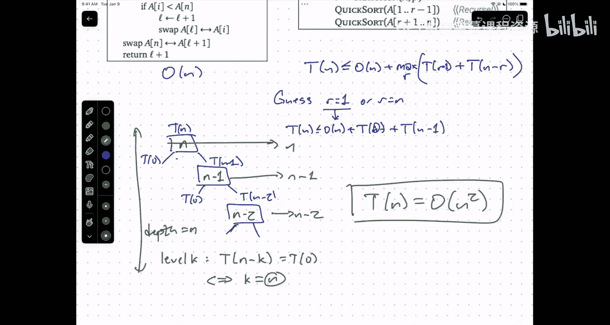

# UIUC《算法与计算模型｜UIUC CSECE 374 - Algorithms and Models of Computation 2023》中英字幕 p11 20230926-Sep 26_ Recursion.zh_en -BV1Mh7RzaEL2_p11-

All right， let's go ahead and。Get started， welcome back。嗯。So。Administrative things。

 homework5 and GPS5 are out。As usual， these are due next Monday and next Tuesday。Of。

Midtermo one with the solutions will be posted。Tomorrow morning。Once all the conflict exams are done。

U。I apologize for the series of。Stupid， but hopefully hopefully。Harmless mistakes。

 switching the problem order and forgetting the black rectangles on the answer booklets。

 the TAs who are scanning are being very careful to keep the exam straight so that if we need to refer back to if something does get cut off。

 we can refer back to the paper exams。嗯。So don't worry about it。嗯。

And I think the third thing I need to mention。In light of the homework that's coming out。嗯。

We're starting to see。Pairs of homework submissions。That。Look basically the same。The same language。

 the same notation and the same steps at exactly the same order。

A lot of a lot of these problems like there may only really be one way of doing it but as we get later and later into the course that becomes less and less true and so these cases where things really look。

Identical or almost identical start to become more glaring。In a lot of these cases。

This is the result of a kind of mix up with the way the group is submitting the homework。So again。

 let me remind you every time you submit。Submit for your entire group and tell gradescope everybody's name。

Otherwise， if the group has submitted something before gradeSpe now says， oh。

 this is a different set of people， I'll assign this new submission to the people that are only attached here。

 the people in the old submission will still be attached to that and now there are two submissions that look almost identical and they get flagged for plagiarism。

We have to untangle this， so grade Sccope will not remember that the last time you submitted Home 5。

1， you named your co conspirators， you have to tell gradecope again if you submit a revision。

Every single time。But the other side of this is we also have found pairs of homeworks where it's clear that these people have shared significant fractions of the text of their homework submissions between them and this is not allowed with the academic integrity policies in this class。

 it's fine to talk to each other but don't share text。

 everything you your group submits should be written by someone in your group。嗯。So u。

We don't like chasing these cases down， nobody likes being chased down。

Please try to pay attention to this more so and again for the 99% of you for which this is not a problem。

 I apologize for having to bring this up， but I do want to mention that this is starting to creep up a little bit and we want to tamp it down。

嗯。Are there any other？Logistical issues or questions that we needed to talk about， yes。I'm sorry。

 you have to yell。So what does it mean for a homework or an exam to be forgiven？

So this is in cases where， for example。You got COVID on Friday。

And so you were not able to take the either the exam last night or the conflict exam right now。

In that case， I would just say， okay， this exam didn't happen。Do other exams have more weight？

Rather than trying to run makeup exams because that really is a logistical nightmare。

 especially in class this big。Similarly with homeworks。

 if there's something that happens that means you need to miss a significant number of homeworks。

 if you're sick one week， okay， we've got extensions and drops to help deal with the majority of these cases。

 but if something serious happens，Then you can send me email and say， okay fine。

 we'll just forgive homeworks five and six and your other homeworks will carry more weight in the final grade calculation。

so this is just an escape clause to make sure that if they're extenuating circumstances that interfere temporarily with your participation in the class。

 that you're not spending your time worrying about the class。

 but rather spending your time dealing with whatever issues are getting in the way。

 in particular if you're sick is much more important to pay attention to your health than it is to pay attention to this class。

Other questions。Okay， so。We are going to start talking about algorithms。And。We've， you know。

We've done a few algorithms already， they just didn't smell like algorithms because we didn't write them in the order in the language that we use to describe algorithms。

 every DFA is an algorithm。It's you know， you get a character。

 you look at your current state and that character that changes to a new state if there is no more symbols then you look at your state and if it's accepting you say yes。

 if it's not accepting you say no， that that's a simple example of an algorithm it's just an algorithm is just a sequence of。

Precisely defined。Sts that you follow in an unambiguous way。

 right that typically designed to accomplish some sort of task。

And we're going to be talking about a lot of these， but for the next few weeks。focusing on。嗯。

You know， the thing that makes us human。Or at least puts us in the set containing humans and songbirds。

Recursion。This is by far the most powerful tool in our algorithmic toolbox。

Is being able to take a problem and reduce it to smaller instances of the same problem。

 which then are somehow solved by magic。Now if you've taken 232 or 340 or ECE 100- 200 something。

 you understand how this recursion actually works， you understand at some level how the magic is done。

 whenever you call a function in real code， what actually happens is there's this new stack frame that's created that contains all the local variables including the inputs to the function you called。

 and then whenever you refer to a variable， you look in that stack frame to see what that variable represents。

 so when you call yourself recursively that the same variable gets repurposed every time you call yourself。

 but you only ever refer to the top stack frame。And when the function call returns。

 that stack frame gets popped off， including the return value。

 and you go back to your next outermost scope。But for purposes of designing algorithms。

Recursion is magic。Um， I will refer frequently and consistently to a mythical being known as the recursion ferry。

 you've heard me refer to the recursion ferry many。

 many times if you ask the recursion ferry to show you their driver's license。

Their government name is induction hypothesis。Okay。

 that's because recursion is the same thing as induction。Remember。

 the way that we prove something is we assume that thing works for all smaller stuff。

And then we use look the different cases， if the thing I'm trying to prove something about is small enough。

 I just prove it。If the thing is big， then while I use the fact that the theorem is true for smaller stuff to prove the theorem is true for the thing in my hand。

 this is exactly the same pattern as we use to describe and think about the behavior of recursive algorithms。

And again， in that context I often refer to the induction fer instead of the recursion ferry。

 but since induction is the recursion ferry's government first name， it's the same thing。

So the canonical initial example of recursion。嗯。Is a puzzle that was invented。By。A French。

Mathematician， and I think actually it's fair to refer to him as a French recreational mathematician。

 he wasn't a math professor， he just liked to write things in the puzzle column of the French newspapers。

 so he's more like Will Schtz than Terry Toow。Ed Luca。

And Lukea discovered this lovely puzzle called the Tower of Hanoi。Now I am。Sure that。

Almost everybody in the room has seen this puzzle before。

 how many of you have ever actually owned a physical version of this？Yeah， so you you。

 you understand how it works， but just to make sure that we're all on the same page， let me describe。

The rules。I've got a series of end discs on three pegs in this picture which comes。

From one of Lucka's advertisements， he actually patented this and like made physical things and sold them in the shops in Paris。

Um。In this picture， n equals8。And these discs all start off on one of the pegs。

 which Luca has helpfully labeled A。And the idea is I want to move these N pegs。From peg A to peg B。

 and there's a third peg which is unlabeled in some of the pictures。

 but you can if you look closely you can see there's a C on in some of them。You're allowed to use。

D see as a kind of temporary holding place。Now， the rules are you can move exactly one disk at a time and you can only move a disk。

From its current peg， if it is the highest disc on that peg。

So from the initial configuration on the top picture there。

 the only disc that I can move is the small disk on Peg A。

And the second rule is I'm never allowed to put a larger disc on top of a smaller disc。

The discs on each peg must always be sorted by size from largest at the bottom and the smallest at the top。

Hey， so。Here's an intermediate stage in the second picture where for the discs are still on the four largest disks are still on peg A。

 the next three largest disks are on peg B and the smallest disk is on peg C。

 this more or less what an intermediate stage looks like except it's not necessarily the case that the discs are going to be together in sorted order。

 but they are going to be decreasing in height as you go up and then finally the goal configuration is down here at the bottom。

And so the toy was sold with。What would now probably be seen as a。

Slightly problematic story about monks in a temple in India that would。

 you know once a day would move one of these giant golden disks from one thing to another。

 one diamond needle to another with and the mythology is that when they finally moved all 64 of these discs。

The universe would end。嗯。You'll see why we don't worry about the end of the universe in a second。

So what's the modern way of actually talking about how this works？So the idea is。Um。

So I'm going to say never。So I can move。Sorry， let'll just write this down， move。Smallest。Disk。

On one peg。To another。嗯。Never。Move。Larger disk。On top of smaller disk。

So the task that we want to perform here is I want to move N discs。From。A to B。

 and in parentheses here， I'm going to write Vta C。

Let's see if I can actually move this thing somewhere。😔，put it over there。

 something it will be a little less annoying。Okay。😊，So the picture I want you to have in your head。

Is I have these discs on peg A。In some order， here's a， here's B， here's C。

It doesn't really matter if the labels are in order。

I've been trying to get everything to be over here at B。All right。No。Here's how I reason about this。

 I know that at some point during the solution for this puzzle， I need to move the largest disk。

That's currently on Peg A to Peg B。Okay， but in order for that to happen。

 the largest disk on peg a has to be the only disc on peg a， it can't have any other discs because。

Those other disc would be smaller and therefore on top of the largest disk。

 and so I can't couldn't move the largest disk。So I have a subtask， which is first。

Before I can do anything else。I need to move these n minus1 smaller discs out of the way to peg C。So。

My strategy is first I'm going to move n minus one disks。From。A to C。And well。

 I still have this third Peg B， which I'm free to use。And I know as I'm doing this。

 that larger disk is going to sit there on the bottom of peg A。

 it's never going to get in the way because it's big and it's on the bottom。

 it's not going to interfere with any of those moves。

 so I can really think of moving those n minus1 disks as a completely independent thing。😡。

So at this point， I observed that that is a smaller instance of exactly the same problem。😡。

Instead of moving end disks from one peg to another。

 I'm now moving and minus one disks from one peg to another。

 and so I call up my friend the recursion fairry and the recursion ferry moves those disks somehow I don't know how it's none of my business。

Then I move the largest disk。To where it goes。So move disc。And from。A2 B。系。Okay， so I've moved。

Move that disk。And now what's left to do？Well， now I need to move those n minus one disks that Ive stuck out of the way from their current position to peg B。

 but again， this is a smaller instance is the same problem， so I move n minus one disks。U from。

B2 C via A。And again， this just happens by magic。It's none of my business， how it's actually done。U。

Because life is complicated enough without worrying about those details。And now I'm done。ok。

The recursion fairry moves the top n minus1 disks， then I move one disk。

 then the recursion ferry moves n minus1 disks。And that's the algorithm。

And it's not hard to see that each of these steps is actually necessary。

I had to move the first 10 minus1 disks， otherwise I'd never be able to move the largest disk at all。

Um， and uh， well then I had to move the largest disks， I had to do that at some point。

 and then I had to solve the puzzle。So there's no room for improving this。嗯。

So that seems to be my algorithm。Now I need to stop and think。When I described this algorithm。

 did I make any assumptions about the input？And if so。

I there may be other cases that violate those assumptions that I need to handle in a different way so when I was describing this strategy for move all the small disks out of the way and then move the largest disk and then move the smaller disks on top。

Was I making any assumptions about the input？Was making an assumption actually？不认。

Input is an empty and is a。Number of discs。One of the possible numbers of disks is zero here。

 I have an instance of the tower Fno problem on the table in front of me。对么。Here's one peg。

 here's another pe， here's another pe。Okay。I have zero disks， which I need to move from A to B。

How do we do it？Great， you all got it perfectly。This is one of those rare instances where I ask a question and simultaneously every single person in the room gives exactly the right answer。

😡，You do nothing。There was nothing to do so I。I need to add make a small modification to this algorithm。

😡，Which is if n is at least one， then I do those things if n is zero， there is no disk n。

And so the main recursive part of the algorithm is not well defined。And in general。

 this is the way that I strongly recommend approaching these recursive problems。

 just like when I recommend approaching inductive proofs。

 think about the most general case first and then look for the edges to see where the argument breaks down where the algorithm breaks down。

He。嗯。Now， okay， so that's the algorithm。What else would we like to know about this？😔。

We'd like to know that it's correct。But basically the algorithm， especially because it's just。

 know four lines。Translates。Almost purely mechanically into a proof by induction that the algorithm works。

So the proof goes something like this， theorem。This algorithm successfully moves and disks from one peg to another for all natural numbers N。

Proof， let n be an arbitrary natural number， assume for all natural numbers n less than n that this algorithm successfully moves M disks from one peg to another。

😡，There are two cases to consider if n is equal to zero， the algorithm correctly does nothing。😡。

If n is equal to one， then by the induction hypothesis。

 the first line correctly moves n minus1 disks， the second line trivially moves one disk to the right place。

 and by the induction hypothesis， the last line moves the other n minus1 disk to their final destination。

The boilerplate， if you take it away， basically says there were cases and in every case I did the right thing。

Some of those right things were recursive， I know they worked by the induction hypothesis。

Now I do still have to like sanity check that the recursion can't go on forever。

But the I know that's not going to happen because every time I recursse， I'm dealing with fewer。

A smaller set of disks。This integer is going down。And when it reaches zero。

 then I don't recurse anymore。So correctness。Follows by induction。Of course。

 it does because recursion is an doctrine。But the other thing that we'd like to know about and really any algorithm at all is what is the running time of the algorithm。

 how many moves。Does this algorithm perform？As a function of。The input。

 which in this case is really just the number n。All right， so I'm going to let。T of N。

Be the number of moves。The number of single disk moves。嗯。To solve。The end this knoy problem。诶。😊，Well。

😮，I can look at the code and basically write down an equation that expresses T of n in terms of smaller values of that function T so T of n is。

😡，Well， if n is equal to zero。Q of then is zero。And if n is positive， well。

 the first line moves n minus1 disks， so by definition that takes t of n n minus1 moves。

And then I move one disk。And then the third line by definition takes t of n minus1 moves。So。I have。

Something called a recurrence equation。I've defined T of n in terms of T of n minus1 I can do a little bit of algebra and maybe make this expression look a little simpler。

 so these two T of n minus one terms are identical so I can merge them together just put a factor of two there。

😡，嗯。And now， well that's great， I've got a recurrence equation。

 I can look on the web and notice that Jeff has written like a you 40 page handout on how to solve recurrences。

 oh God， that's work。I don't want to do that。So how do I solve a recurrence？嗯。

Some of you may have like taken a differential equations class。

 those of you who are actually honest to God card carrying engineers might actually like differential equations。

 this is kind of a discrete version of a differential equation and the techniques are kind of the same。

 but there is a fundamental。Baseline solution strategy for any differential equation whatsoever。

 a little bird lands on your shoulder tells you the answer and then you prove that it's correct。

It's the the only technique that is always guaranteed to work because taking derivatives there's an algorithm。

 but you know solving differential equations， there isn't okay， same thing is going to be true here。

The number one first thing to do when you're faced with a recurrence equation that you don't know how to solve is guess the answer and then prove that you guessed correctly。

 so how would I guess an answer to this？Well。😮，Let's just write down some values of T of N。Okay。

 so if n is equal to zero， t of n is equal to zero。If n is equal to1。

Then t of1 is two times t of0 plus1， which is two times 0 plus one， that's one。

T of two is two times1 plus one that's three， t of three is7 T of4 is 15。

 T of5 is 31 T of 6 is 63 each time I'm writing down a number it I'm writing it down by doubling the previous number and adding one。

By the way。A trick that I just did。I didn't evaluate T of six by treating that recurrence as an algorithm。

 I could。I could have just written defined T of n to be if n equals zero return zero otherwise return this expression。

 I could have called t of6 and it would have made up a bunch of recursive calls and it have taken a very long time instead I wrote the numbers down just by considering larger and larger values of n。

This is。This technique of taking a recursive thing and evaluating it bottom up。

It's called dynamic programming。Um。啊。We'll see a lot of it。But for now。What I want to think of is。

 you know。What。😡，What function is this？ItJust guess， yeah。I'm sorry。It's close to a geometric series。

So the numbers almost double at every step， but not quite。So it's not exactly a geometric series。

 yeah。这 is。Yes， well， that's what it looks like anyway。Two to the n minus1。

 that certainly fits the first seven values that we've got here。

And so for something simple like a first lecture on a recursion。

 you can probably be sure that that's correct， but you should always be a little bit skeptical there are。

Other recursion problems where you know the first several terms are1，2，4，8，16， you go， oh yeah。

 that's two to the end and the next one's 31。Right so for any like finite prefix。

 there's an infinite number of functions that it could be。

 which is why you then have to prove that your guess was correct for all possible values then。嗯。Okay。

 so。Proof without the boiler platelate。If n equals zero， then well two to the0 minus1 equals0。

 that's correct， that's my base case。If n is at least one。Then T of n is2 t of n minus1 plus1。

 which is equal to twice two to the n minus1 plus1。Plus1 by the induction hypothesis。

 which is2 to the n minus1 by mass。So the guess was correct and the way that I proved it。

 the guess was correct was of course， by induction because I'm dealing with something that was defined by recursion。

诶。So。Yes。This has worked， the guess， we got it right。诶。😊。

So this is basically the story of how we design recursive algorithms。First。

 we sort of stare at the problem and try to figure out a way of reducing the instance that were given to one or more smaller instances of exactly the same problem。

And meanwhile， we put those recursive calls together in a way that assuming they work actually solves the problem at hand。

And then correctness then follows by， you know， if you really have to formalizing what it means for putting those pieces together to be correct。

This turns out to be relatively mechanical。And then we analyzed the running time of the algorithm。

 usually this involves transcribing some sort of recurrence for the running time。

 which traditionally we use capital T to mean running time， but it doesn't have to be。

And then using some technique to solve it， the most basic of which is just guess the answer and see if you're right。

系。Any questions about the basic idea？Hopefully， this is mostly review。Yes。Yes。陈证官。3。Sorry。

 how did I get from here to here？How do I get from blue to red？U。Okay。

 so if T of n is the number of moves I need to move N discs。How many moves does this line take？

I'm moving if T is the number of moves I need to move discs。

How long does it take to move n minus1 disks？T of n minus1。And that line。T of n minus1。

 so there are my two T of n minus ones。And then how many moves do I make in line too？1。

So that's the plus one。No， move disc， that's one move。Yes。Okay。All right， good。

So I am going to show you a more systematic way of solving recurrence things like this， again。

 hopefully you've all seen this before in 173， those of you took Math 213 go back in time in take CS 173。

 but yell at the ECE department to tell people to take 173。

But I'll show you the technique that's useful for a lot of recursive algorithms。

 but I'm going to move forward about 60 years in history to the canonical first algorithm problem that you see in every computer science course。

Which is sorted。Now。I've kind of spoiled it by putting this up on the screen already。

 but I'll try this anyway。嗯。Name mis sorting algorithm。Yeah， yeah。

 somebody's always being smart ass bubble sort。Uh， no。Name a sorting algorithm。

 not an exercise in futility。So quick sort， I heard。Merth sort， we'll see both of those。Deep sort。

So these are the sort of three canonical sorting algorithms that。😡。

Under the right assumptions all run in N log N time。

I have to put an asterisk on Quick sort for reasons that I'll show you。

 but merge sort and Heap sort definitively run an n log N time in the worst case。

 Quick sort runs in n log N time if you define that correctly and do the right things。

There are other sorting algorithms like insertion sort selection for bubble sort which are purely iterative。

 they don't really use recursion in a fundamental way that are just written with nested for loops。

And therefore they're not as efficient as these things that they're based on recursion。

 so probably the simplest recursive sorting algorithm is merge sort。So。

Wd sort really is the canonical example of blame the you know， sorry， trust the recursion ferry。

So the way merge sort works。Is you take your unsorted array in this case I'm using in my example。

 letters as the elements of my array and I want to put them into alphabetical order。😡。

I divide the array into approximately equal parts。😡，Obviously， if the array has odd length。

 I can't do that exactly evenly。Then I recursively sort。The part of the array on the left。

I recursively sort。The part of the array on the right。And then I take these two sorted arrays。

And I merged them together。And the way the merging algorithm works。Is。I look at the first elements。

Of those two smaller sortrded arrays。I find the element that is smaller。

I move it to the beginning of my output array。😡，And then I recursively merge everything else。

Now that last bit is an example of what normally is called tail recursion where I reduce things by one and then I recur to solve the remaining problem and tail recursive algorithms。

It really is more efficient to write them out as loops。

That's what I've written over here on the left。This is the algorithm from mergeG。

There are a few more cases than you might imagine from the description that I gave you earlier。

So what this does。Is it merges the array a from1 to M and the array A from m plus1 to n。

Into the same array， A1 to N。系。Um。So the example of the merge algorithm running。

 you can see the boxes up there in the example above。I here is the index。Into the array on the left。

 J is the index into the array on the right。Those both start at1 and m plus one。

And under most circumstances。The main part of the algorithm is the last four lines inside the for loop。

K here is the index。Into the excuse me， into the output array。嗯。

So the reason why I have these other extra cases here is that it's possible when I'm doing this merging。

 think of these as two piles of playing cards， I compare top the top card of each deck in whichever one is smaller I put down on the table。

 now at some point it's possible that one of the other of the decks that I'm emergingrg runs out of cards。

😡，So I need to do a sanity check。Is J bigger than n， that means that the right side has， you know。

 I've run out of things in the right half of the array to merge。

Then the next case is I bigger than M， that means I've run out of things in the left side to merge。

And only if I and J are away from these boundaries， do I do the comparison between AI and AJ？ok。U。

If you've taken CS124 in the last。U。Three years， you've implemented a version of this。

I think if you've taken 225， you've actually implemented this version of this。

 but with a list instead of an array， so again I'm hoping that this is review。

 but if you do have questions about how this merge algorithm works， now would be a good time to ask。

Okay。Then here's the main merge sort algorithm over here on the right。

The divide of the dividing Poer step is literally just。

What is the size of the left side of the array M gets flu of n over2？Now。

This strategy of dividing up the array can only work。If the array has more than one thing in it。

Which is why there's this boundary checker if n is greater than one， if n is equal to one。

 how do I sort the array？Perfect。Do nothing。If n is equal to zero， how do you sort the array？😊。

Perfect， do nothing。But if n is bigger than one， then I have the possibility of splitting the array into two smaller non empty arrays。

 that's what I'm doing keeping it as even as possible。

I asked the recursion ferry to sort the left half， I asked the recursion ferry to sort the right half。

 and then I apply this merge procedure。Which takes those two sort of arrays and turns them into a single sort of array。

Once you convince yourself that merge is correct。Which is an exercise in induction。

Then the correctness of merge sort。Follows by induction。Oh just this does the right thing。

 that does the right thing， this other thing does the right thing， the end。嗯。

You can see that the proofs actually written out in the lecture notes。

 but just to show you that they can be done， but also they're written out in the lecture notes to convince you that it's not particularly enlightening or inspiring or illuminating or provides any intuition to actually write this things down。

 which is why as a general rule， we're not going to ask you to write down formal proofs of correctness for your algorithms。

What we are going to ask you to write down。So that we understand。

That you understand why your algorithm does what it does。

SoI'm going to ask you to write these English descriptions。Anytime you write down an algorithm。

Description of precisely what that algorithm does must be clearly written。First。

Now in the case of merge sort。Well， we were talking about sorting algorithms。

 but if I really wanted to do this， I would say sorts。A1 through n。In place。

Meaning it replaces the original unsorted array。With the sorted array in the same place。

So we are going to insist that every time you write down an algorithm。

 you write an English description of what the algorithm is doing not。Line by line， first I merge。

 then I merge， then I recur， but what task is that algorithm performing？What it's doing。

 not how it's doing it。Ay。嗯。And we might ask you， know， give a few sentences of intuition。Um。

 just as further justification， especially the more complicated things get。

 the more we kind of need to see that intuition to convince us that you understand why your algorithm is doing the right thing。

Okay。So this is all kind of。Classic。嗯。Red butter stuff。

 I don't think the history of this algorithm is actually known。

I think it was first showed up in the literature in the mid 1940s。

Before computer science had really been born as a science。m，But u it， you know。

 versions of merge sort go back to。The Holith card Company。

Building tabulating machines for running the U United States 1900 census。Um。

 so they would record census data on little paper cards by punching holes in them。

 and they had these mechanical machines that would sort the cards by putting needles through the holes and moving the cards over。

Their algorithm arguably was closer to Radic SAt than merge SAt。But this has you know。

 saved the United States government like seven years worth of manual labor by doing this。

 all earth later changed the name of this company to international business machines。

 you might have heard of them。嗯。Actually。You might not have heard of them。

IBM doesn't really you all know what IBM is， right？Right。They were like the Microsoft of the 1850s。

You all know what Microsoft is， right？They were like the Nintendo of the 1980s。嗯。Okay。

 so we've got an algorithm and we're pretty well convinced that it's correct。

 but we need to think about it's running time。So the first thing to observe is that the running time of the merge algorithm。

Is order N？And the reason that I know that it's order N。Is。Well。

Let's actually look at the contents of the algorithm。I don't care about this， everything in that box。

Took constant time。There were no branches， there were no loops， there were no recursive calls。

 there were branches， but no loops， no recursive calls。So everything in that box order one time。

So what's left？For k equals order one k goes from1 to n， do something that takes constant time。

 from k equals 1 to n， do something that takes constant time。Linear time。

The details obviously matter for purposes of thinking about how the algorithm works。

 but for purposes of analyzing the running time， it's just everything inside the for loop is constant。

Because there are no inner loops， there are no function calls， yes。You is。All these cases yeah。

 I explained that， so the idea is I'm maintaining one index finger called I in the left box and one index finger called J in the right box and moving them to the right。

I compare the two characters under my fingers， but if my finger falls off the right end of the box。

 then there's no character there to compare。So it's just boundary cases。

If you like base cases for the recursion。All right。

But now what's the running time of merge sort so again I'm going to use T of n to be the function that means the running time of this function。

 the running time of this algorithm as a function of the input size n。U。Well， there's a base case。

 but it turns out that every recursive algorithm has exactly the same base case。

Every single running time recurrence has this base case when n is a constant。

 the running time is a constant。When there are no variables。Everything is a constant。

so I can pick my favorite base case and yeah sure here there's an n is greater than one。

 but you know I can just say if n is less than a quadrillion it takes constant time。

 let's not worry about such tiny inputs， let me really think about what happens when n is big。

Right so quadrillion is a constant thin， constant done， don't care。

The interesting part of the occurrence。Is。That， well， T of M， that's T of4 of n over two。

That's the running time for the first recursive call。

And then at the running time for the second recurive call， instead of rounding n over two down。

 I round N over two up， and then I have an order endn for murder。Okay。

 first recursive call is T of floor of N over2， second recursive call is T of ceiling of N2。

 merge is order at。The base case is always。T of a constant is a constant。

We're only we're not going to as a general rule， unless we specifically say otherwise。

 we're not going for exact counts here， we're only analyzing algorithms up to constant factors up to big O's。

If I really wanted to be more。Picky about it， I could pick some representative operation like so for example。

 I could say a this is an interesting operation here， this actual comparison between different items。

 let's count precisely as a function of n， how many comparisons we do。

Then we could fill in the base case with something specific and we could go for an exact value。嗯。

Most of the time we really don't want to do that because it's not worth the effort。So instead。

 I'm just going to go up to constant factors， I don't really care that allows me to not care what programming language this is implemented in。

 what operating system this is implemented on， whether the algorithm is running on my laptop or my phone or my watch。

😡，UmOr on my dad's computer in the 1960s。I just want to know up to constant factors。

 how does the running time grow as the input size gets bigger？Now。

 one of the first things that we can do。Is we can ignore the floors and the ceilings in the running time。

Recurrence。There's this assumption that， you know， N always has to be an integer。嗯。

But it could be any integer at all。So one way to think about this is you know without loss of generally I could just assume that n is even and then recursively even so yeah I could assume that n is a power of two and solve the recurrence and this will be good enough another way to say it is you know what i'm going to just。

Allow in to be anything at all。Can you be any rational number and now I still get a recurrence however you want to formalize it is fine the punchline is that it's possible to prove that if you solve the recurrence without the floors and ceilings。

 the solution is going to be the same as if you solve it with the floors and ceilings up to that big O stuff。

Bei。Again， in the textbook， I go through the actual derivation of why this is true。😡。

All you need to know for purposes of this class is that when you see floors and sealoings in a recurrence。

 you could just pretend they're not there。And so now I have。

What I commonly refer to as the merge sort recurrence。Now。You know the solution。

How fast does Mer shirt run？and老人。Okay， so you already know that the answer to this is to go in log again。

And if I wanted to， I could write that down as a guess， little Bernie landed on my shoulder。

 I think the birderie was named Jeff Chaen。Yeah。And Jeff told me it was N log N。

 Jeff with the G told me it was N log N， so I believe him。

 but I better prove it by induction and you can do that and it'll work。

But there's a more general technique that allows you to derive the guess if either you've forgotten everything that you learned from Jeff or you took ECU110 instead。

U。And that's using something called a recursion tree。Okay， so。

The idea behind a recursion tree is I'm going to draw a cartoon。

Of the recursive structure of the computation。So at the very top。

I have a node here that represents the running time。

 this tree that I'm building represents the running time of the entire algorithm。😡，Me。

So the way that I'm going to draw this cartoon is I'm going to say， well。

 there's a recursive call over here， that's t of n over2， and there's a recursive call over here。

 that's t of n over two， and then there's the nonrecursive part of the work which I'm going to write here in this box without the big O。

Okay， so T of N。I'm going to write down as a box that has an n in it。And then a subte on the left。

It's recursively defined as t of n over  two， and the sub on the right。

 that's recursively defined as t of n over two。嗯。So I can expand this recursion one more level。

T of n over two goes to T of n over four on the left。And T of n over4 on the right。And again。

 two event over four on the left。And t of n over four on the right。And then what gets written in。

The box is the amount of nonrecursive work that I do as a function of n and now I'm really I'm writing n over2 there because as I said when I'm doing this recursgenionary stuff in the end。

 I'm going to put a big o around everything。All， so in your mind， it's like we're're。对。

But when I'm working inside the big O， I want to make sure。That。

The N that I've written inside that box is the same as is the correct function of the argument。

To tea。So if T of n， I write down the function n。And T of n over 2。

 I write down the function n over 2。And in two then number four， I write down in number four。

And so on。Forever and ever， okay， so this， this tree keeps going。

At some point I get to a subpro that's just like T of1。

 and then I have leaves for the recursion tree， but for now let me just look at the recursive structure here。

哎。Each of those red things that I've written in a box represents the non recursive work that I'm doing inside that recursive subproblem。

The top the root， that's the non recursive work to do the very last merge。On the left。

 that's the merge inside the left recursive subca from the top。The left grandchild。

 that's two recursive fall down， I'm doing a merge on two arrays of total size N before。

 so the work that I'm doing is entered before。Now I'm going to do something weird。

I'm going to exploit what I refer to as the fundamental theorem of combinators。

Addition is commutative。I'm going to take the total amount of work that I spend is the sum of all the values in these nodes。

The total amount of non recursive work I do at the top level is N。

 and the total amount of work I do in the first recursive call is by the induction hypothesis。

 the total amount of work in the left subte。And the total amount of work I do in the second recursive call is by the induction hypothesis。

 it's the total amount of work that sum of the values in the right sector。

So I need to sum up all these values written in this tree form。

 the way that I'm going to do that is not by doing like ake in order traversal。

 but rather I'm going to sum up level by level。So the zeroth level， the root I only have one node。

 it has value n， so the sum of the zeroth level work is n at level one， I have two nodes。

 each of which is doing n over two work， so the sum total work that I'm doing at level one is n at level three level sorry level two。

 I've got four nodes。Each of which is doing N number four work。

 so total amount of work at level two is N， you might notice a pattern here。

At every level of the recursion treaty， if I sum up the work that I'm doing across that level。

At level K， I'll have two to the K nodes。😡，Each of which will have value n over 2 to the K。

And so the total value of all those nodes will be n。Okay。

So in order to figure out the total sum of all of these values。

I need to know one more thing about the tree。What is it？はい。The depth。so what's the depth of the tree？

Well， remember that when we're at depth k， we're trying to figure out the value of n over two to the K right this if I have a node。

K steps down from the root。Thats the sub root of that node represents this value。

 t of n over2 to the k， every time I go down， the argument goes down by a factor of  two。

But what I'm interested is when is this actually equal to T of1？

Or what value of k do I switch from doing recursive stuff to doing non recursive stuff？Well。

 n over two to the K is one when n is equal to two to the K， which is the same。

As when k is equal to log base2 of n。So the total number of levels in this tree。Is log N？

And at every level of the tree。I'm doing over and work。So the overall time is order n times log n。

The N is， again， the work that I do at every level。And the log n is the depths of the tree。Now。

We fell into a particularly nice case of the recursion tree method。

 which is when it just so happened that all of these level sums were equal。

 and so the only thing that we actually needed to care about beyond what is the level sum。

 which is really what is the value of the root。Is how deep is the tree？And as a crude heuristic。

 you could say， well， every time I recurse my problem size is getting smaller by a constant factor。

 I'm dividing the problem size by something， and that means up to Big O。

 the depth is going to be log out。That's the easy version of this。More interesting version of this。

 which we'll see on Thursday is one， it's possible that as you go further down the tree。

 the level sums shrink。And ideally， they shrink in a geometric series N number two and number four and over eight as you go down。

And the nice thing about geometric series is up to Big O， you only care about the largest term。

 which is the root。The other thing that can happen is you get a geometric series， but it goes up。N2N。

4N，8N。As you go down。And then again， the largest term is the one that matters and that's the term that's associated with the bottom level。

 and so there's a little bit of math involved。We'll see instances of both of those next time。

 but for now does everybody have any questions about the basic technique of building these recursion trees？

Yes。呃， if you看。In your recurrence， if you have another term that has a different rule for man。

 don't be mad I the swell term。Do you have any to read？嗯哼。😊。

Are you still able to draw out the tree like this Okay so this is an excellent question what if you had a different term than like n over three？

Right right， so。I think。Yeah。I think this point will make more sense if I briefly talk about QuickSo and then come back。

Okay。The answer is yes。It still works。You just have to be careful。对以。

Other questions aboutcurion trees are emerge sort。WhenOnce you create a return tree。

 is there possibility that the levels？Produce another recurrence relation。So， I mean， in principle。

 the level sums could be pretty much anything。Right so but what you're typically going to get is something where basically in fact。

 I'm writing down the running time as a double summation。

 I'm summing over the levels and then winning over， I'm summing across。And if things are nice。

 this is really just counting the number of nodes at that level and multiplying by the common value in all。

So it really is a question of， you know， what is this function you get over here on the right？

And the three， by far most common cases are geometric series going down。

 everything is the same and geometric series going up。

 but there are more interesting examples than that。Just won't see them in this class。Okay。So。

Here's quick sort。Again， I'm hoping that most of you have actually seen this before。

 but just in case you haven't。The way QuickSo works is I start instead of doing a sort of trivial divide and then doing recursion and then doing an interesting conquer step at the end。

Here I'm doing a more interesting way of dividing things。

So that the conqueror step at the end is completely trivial。

So what QuickSo does at the beginning is it chooses an arbitrary element in the array that we want to sort。

😡，To be what we call a pivot element。In this case， it's the letter P。

Then it runs an algorithm called partition， I'm not going to walk through the partition algorithm in detail。

😡，U but what I will tell you what it does is it partitions the array so that。

Everything less than the pivot。Is on the left。And everything greater than the pivot。Is on the right。

So what you can imagine doing is holding the pivot in your hand。And again。

 I've got to stack the cards here， I pick up the card if it's bigger than the pivot。

 I put it on the right， if it's less than the pivot I put it on the left。Okay。U then。

The recursion ferry magically sorts the part on the left。

 and then the recursion fery magically sorts the part on the right。

 and at this point the entire array is sorted。One of the side effects of doing this partition algorithm is that the pivot element itself ends up in exactly the right spot。

For being for the sorted output， so in this case， P is the10th smallest letter。In this array。

 there are nine smaller letters。They end up on the left side after the partition in some order。

 but it doesn't matter P is going to be in spotpot Ted。嗯。

This can be implemented with the for loop that looks like this again。

 I won't go through the specifics except to point out that again。

 this algorithm runs in order at time。Okay， so。Again。

 I have some sanity checking if they were raised too small I don't need to do anything。

 otherwise I can make some progress by choosing a pivot doing a partition and then sorting the two sides on either side of the partition the partition subroutine itself takes as input the array and the index of the pivot value in the array and then it returns the corrected pivot the rank of the pivot element are so in the example here the。

The index little P would be 12 and then the the return value from partition would be。'mSorry。

 13 and the return value， no， 12 and the return value would be nine。Right so this is p equals 12。

 this is r equals9。And so I get。Running time recurrence。That's order N。Plus。T of R。

Plus T of n minus R。All right，This is what we kind of want to write down。

There's only one problem with this expression。What's wrong with this recurrence that I've written down for the running time of Quick sortt？

I have an algorithm that runs that sorts and things in T event and time。Springtime is recursive。

The recursion is t of n is O of n plus t of R plus T of n minus r。What's wrong？Yeah。I'm sorry。No， no。

 what's wrong with the recurrence？The algorithm is fine， the algorithm is correct。

There's no n divided by two。I don't know that R is in over2。But the problem is。

 I don't know what R is。R is not well defined in this recurrence。

The value of R doesn't just depend on n， it depends on the actual contents of the input array。

 and moreover， it depends on how I implement that line in italics， how I choose the pivot element。

 I have no clue what R is。😡，So what do I do in this case？Well， then we get to the wonderful world of。

Worst case running time， the only thing that I know。Is。That's well。I want to in the end。

 be able to say this algorithm runs in Big O of Gla about time， and that is always true。😡。

No exceptions， no qualifications， no riders。No， yeah， you know， in practice。Formerally， correctly。

 mathematically， this algorithm runs in big O of something time。

 remember big O always means less than or equal to。😡，喂。And so naturally。

 that leads us to considering worst case running time behavior。

We want to assume the worst and then say， well， it's at most this bad。Good。

Now part of that is just because that's the way big O notation is defined。

 but actually the real reason is that you cannot just magically make assumptions about how the universe is going to treat you。

 the universe is a cold and dark and malicious place and it wants to kill you and eat your children。

And you have to design your algorithms that way because there are people out there who actually do want to kill you and eat your children。

 yes。No， because it's the same R in both calls。So this is what is the worst possible value of R？

That makes this expression as large as possible。That's what I'm hoping for， in other words。

 what is the worst place where the pivot can land after doing the partition？Right。Yeah。

The minus one goes it the same way the floors and ceilings went。Yes。

 technically there should be R minus1 here and not R， but again。

 you know the minus ones that you can sweep doesn into the right。Okay， so intuitively。

 what is the least amount of progress you can make by by doing a partition。

 what's the worst place to partition in the array？Just guess。On one in the ends， right。

 so we can sort of guess。R equals one or r equals n。

 and now I actually do have to put the minus one back in okay。

So what happens when r equals one well in that case， I get something like。

N plus t of n of0 plus t of n minus1， this is what happens when I just happened to choose the smallest element thing in the array is my fit。

Nothing in the algorithm prevents that from happening， so I have to assume it can happen。

Symsymmetricically， if I choose the largest array element as my pivot。

 then these two things get swapped。So they choose the largest thing and small the right subproblem becomes empty and the left subproble has size n minus1 yeah。

But我看。嗯。The pivot itself is at position R， so there are minus one things to the left and there n minus r things to the right。

嗯。Well， this guest turns out to be correct， so let's write out the recursion tree。So T of N。Well。

 the non recursive work I do there has size N。And then on the left。

 I have t of0 and on the right I have t of n minus1。

So the recursive work I do there non recursive work I do there is n minus1。

 here's t of0 and here's t of n minus2。And minus two， and this will go on forever。

Let me sum up along the rows。Just kind of silly， but this is the technique。And you'll notice that。

The roseoms。Aren't staying the same， they're actually going down， but they're going down very。

 very slowly。But still， I could say， you know， up to big O， those all look like ends。

 so what I really care about is the depths of the tree so。

How deep is this tree you can say well at level k， I'm interested in looking at t of n minus k I want that to be let's say t of zero。

That happens when k is equal to n， so the depth of this tree is n。

 and so the running time is big O of n squared。Quick sort runs in P O of n squared time。

Now in practice。Of course， nobody treats it this way， everybody sort of。

He thinks of Quickword as running and N log in time。

 and the reason for that is if you randomly permute the array or do you assume the array is given to you in random order。

 then it doesn't matter how you choose the pivot with high probability。

 the running time really will be at log N。Um， what you actually want to do if you want to guarantee and log and running time for quicksort is literally choose the pivot randomly。

😡，and I'm sorry， I did not get to your point about we un balance trees。

 but we'll get to it on Thursday， but for now we're out of time。Thanks everybody。

 we'll see you on Thursday。嗯，系。This one。

