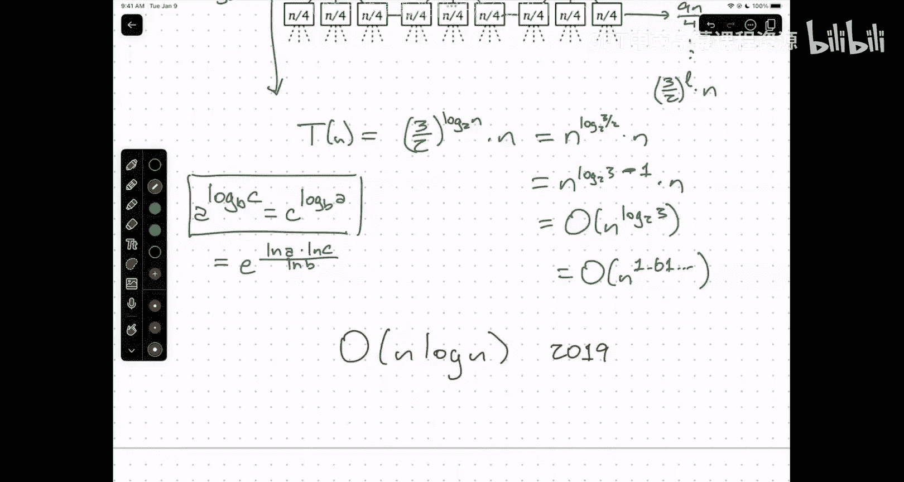

# 算法与计算模型：第12讲：分治算法进阶 🧩


在本节课中，我们将深入学习分治算法的更多有趣变体，特别是快速排序的深入分析、快速选择算法以及一个用于大整数乘法的巧妙分治算法。我们将通过分析递归树来理解这些算法的运行时间。

---

## 快速排序回顾与分析 🔍

上一节我们介绍了分治的基本思想。本节中，我们来看看快速排序算法的具体实现及其运行时间分析。

快速排序的核心思想是选择一个“枢轴”元素，将数组划分为三部分：小于枢轴的元素、枢轴本身以及大于枢轴的元素。然后递归地对左右两部分进行排序。

以下是快速排序的伪代码核心部分：
```python
def quicksort(A, lo, hi):
    if lo < hi:
        p = partition(A, lo, hi)  # 划分数组，返回枢轴索引
        quicksort(A, lo, p-1)     # 递归排序左半部分
        quicksort(A, p+1, hi)     # 递归排序右半部分
```
`partition` 子程序以线性时间 `O(n)` 运行。因此，快速排序的运行时间 `T(n)` 满足以下递推关系：
```
T(n) = O(n) + T(r-1) + T(n-r)
```
其中 `r` 是枢轴在划分后的排名（即它是第 `r` 小的元素）。运行时间取决于 `r` 的值。

为了进行最坏情况分析，我们假设输入总是导致最慢的运行速度。当枢轴是数组中的最小或最大元素时（即 `r=1` 或 `r=n`），会出现最坏情况。此时递推式简化为：
```
T(n) ≤ O(n) + T(n-1)
```
求解此递推式，可得最坏情况运行时间为 `O(n²)`。

然而，直观上，如果枢轴能大致位于数组中间，性能会好得多。假设我们总能神奇地选择一个枢轴，其排名 `r` 介于 `n/3` 和 `2n/3` 之间。那么最坏情况递推式变为：
```
T(n) ≤ O(n) + T(n/3) + T(2n/3)
```
我们可以通过绘制递归树来分析这个递推式。

以下是递归树的分析步骤：
*   根节点的工作量为 `n`。
*   第一层子节点的工作量总和为 `n/3 + 2n/3 = n`。
*   第二层子节点的工作量总和同样为 `n`。
*   虽然树的左右分支深度不同（左侧深度约为 `log₃ n`，右侧深度约为 `log_{3/2} n`），但从大 O 记法的角度看，两者都是 `Θ(log n)`。
*   由于每一层的工作量总和都是 `O(n)`，而深度是 `O(log n)`，因此总运行时间为 `O(n log n)`。

这个分析强化了我们的直觉：只要划分是相对平衡的（即子问题大小以常数因子缩小），快速排序就能在 `O(n log n)` 时间内运行。

---

## 快速选择算法与中位数的中位数 🎯

上一节我们看到，快速排序的效率依赖于选择一个好的枢轴。本节中我们来看看如何在线性时间内确定性地选择一个近似中位的枢轴，这引出了快速选择算法。

快速选择算法用于在未排序数组中找到第 `k` 小的元素。其思路与快速排序类似：
1.  选择一个枢轴并对数组进行划分。
2.  比较枢轴的排名 `r` 与目标 `k`。
3.  如果 `r == k`，则枢轴即为所求。
4.  如果 `k < r`，则在左半部分递归查找第 `k` 小元素。
5.  如果 `k > r`，则在右半部分递归查找第 `k - r` 小元素。

其运行时间递推式为：
```
T(n) = O(n) + max(T(r-1), T(n-r))
```
在最坏情况下（例如总是选择最小元素作为枢轴），这仍然是 `O(n²)`。

关键问题在于：我们能否在线性时间内选择一个保证“不太偏”的枢轴？答案是肯定的，这就是“中位数的中位数”方法。

**算法步骤：**
1.  将输入数组划分为 `⌈n/5⌉` 组，每组最多 5 个元素。
2.  找出每组的中位数（对每组进行插入排序，取中间值，时间复杂度为常数）。
3.  递归地计算这 `⌈n/5⌉` 个中位数组成的新数组的中位数。将这个值作为枢轴 `mom`（Median of Medians）。
4.  使用 `mom` 作为枢轴对原始数组进行划分。
5.  根据目标 `k` 与 `mom` 排名的比较，在相应的子数组上递归。

**为什么有效？**
通过分析可以证明，`mom` 这个枢轴至少比 `30%` 的元素大，也至少比 `30%` 的元素小。因此，在划分后，递归调用处理的子数组大小最多为原数组的 `7/10`。

由此得到运行时间递推式：
```
T(n) ≤ O(n) + T(n/5) + T(7n/10)
```
其中 `T(n/5)` 是递归计算中位数的中位数的时间，`T(7n/10)` 是在较大子数组上递归的时间。

**递归树分析：**
*   根节点工作量：`n`
*   第一层子节点工作量总和：`n/5 + 7n/10 = 9n/10`
*   第二层子节点工作量总和将更少。
*   每一层的工作量总和构成一个公比小于 1 的几何级数。
*   因此，总运行时间由根节点主导，为 `O(n)`。

这意味着我们可以在最坏情况 `O(n)` 时间内找到第 `k` 小的元素，进而也能在线性时间内找到一个优质的枢轴用于快速排序，从而理论上实现最坏情况 `O(n log n)` 的快速排序。

---

## 卡拉楚巴乘法算法 ✖️

最后，我们来看一个经典的分治算法应用：大整数乘法。我们从小学习的竖式乘法需要 `O(n²)` 时间，其中 `n` 是数字的位数。

假设有两个 `n` 位数 `x` 和 `y`。我们可以将它们各自拆分为两个 `n/2` 位数：
```
x = 10^(n/2) * a + b
y = 10^(n/2) * c + d
```
那么它们的乘积为：
```
x * y = (10^(n/2)*a + b) * (10^(n/2)*c + d) = 10^n * (a*c) + 10^(n/2) * (a*d + b*c) + (b*d)
```
这需要计算四个 `n/2` 位数的乘积：`ac`, `ad`, `bc`, `bd`。对应的递推式为 `T(n) = 4T(n/2) + O(n)`，通过递归树分析可知其解为 `O(n²)`，没有改进。

卡拉楚巴算法的巧妙之处在于，它发现中间项 `ad + bc` 可以通过已经计算或将要计算的值组合得到：
```
(a*d + b*c) = (a + b)*(c + d) - a*c - b*d
```
因此，我们只需要计算三个 `n/2` 位数的乘积：`ac`, `bd`, 以及 `(a+b)*(c+d)`。

新的运行时间递推式为：
```
T(n) = 3T(n/2) + O(n)
```
**递归树分析：**
*   根节点工作量：`n`
*   第一层子节点工作量总和：`3 * (n/2) = (3/2)n`
*   第二层子节点工作量总和：`9 * (n/4) = (9/4)n`
*   第 `i` 层的工作量总和为 `(3/2)^i * n`。
*   树的深度为 `log₂ n`。
*   总工作量是各层之和，这是一个递增的几何级数，因此由最后一层（叶子层）主导。
*   叶子层的工作量约为 `3^(log₂ n) * 基础工作量`，利用对数恒等式 `a^(log_b c) = c^(log_b a)`，可得总运行时间为 `O(n^(log₂ 3))`，约等于 `O(n^1.585)`。

这比 `O(n²)` 有了显著改进。更先进的算法（如基于快速傅里叶变换的算法）可以达到 `O(n log n)`，但卡拉楚巴算法因其相对简单，在实践中（如 Python 的大整数运算中）仍有应用。

---

## 总结 📝

本节课中我们一起学习了：
1.  **快速排序的深入分析**：通过递归树分析了在平衡划分下，快速排序能达到 `O(n log n)` 运行时间。
2.  **快速选择与中位数的中位数**：介绍了一种确定性算法，能在最坏情况 `O(n)` 时间内找到第 `k` 小元素，其核心是通过递归地寻找“中位数的中位数”来保证良好的划分。
3.  **卡拉楚巴乘法算法**：展示了一个经典的分治技巧，通过将四个递归调用减少为三个，将大整数乘法的时间复杂度从 `O(n²)` 降低到约 `O(n^1.585)`。



这些例子体现了分治策略的强大和灵活性，以及通过精细的算法设计和分析，我们往往能够突破直觉上的性能瓶颈。