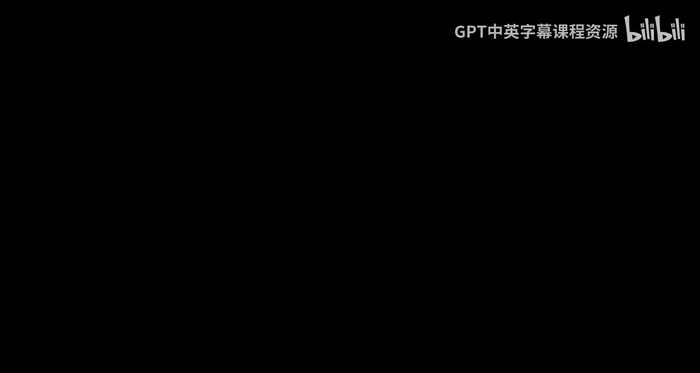
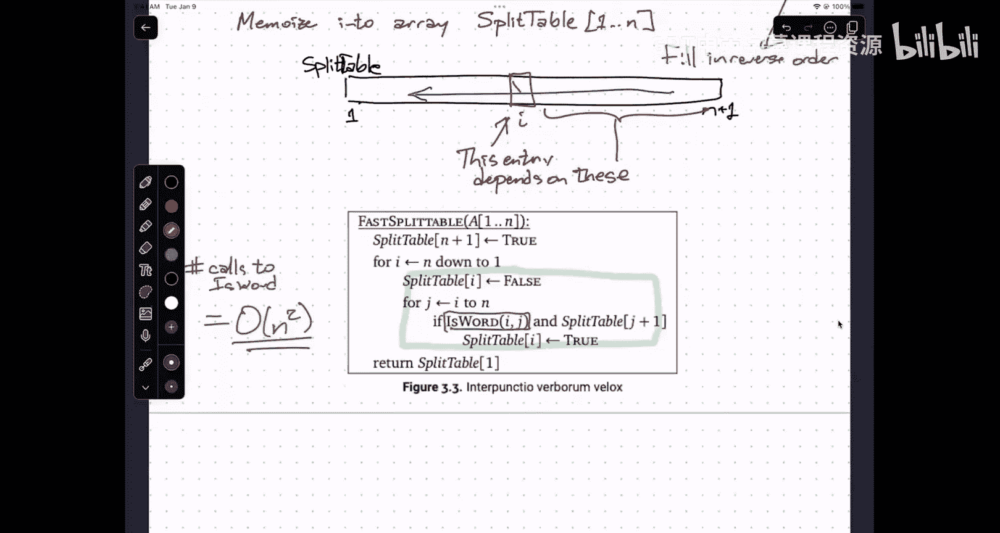

# UIUC《算法与计算模型｜UIUC CSECE 374 - Algorithms and Models of Computation 2023》中英字幕 p14 20231005-CS 374 lecture capture.zh_en -BV1Mh7RzaEL2_p14-

没道。对。

Okay。Hi， everybody。Thanks for。Coming out despite the lovely weather outside。

I don't think I have any new administrative things。To announce。The next homework is out。

 it's due on Tuesday。It is not as interesting as the homework that most of you finished last night。

UmShould be should be should be a bit more straightforward。Soum。

I want to continue talking about a style of recursive algorithm。

 as I mentioned last time we have seen a couple of different kinds of recursive algorithms so far。

There are dividing conquerer algorithms where you take。

An input of size n and you reduce the problem to several instances of size smaller than n and typically smaller by a constant factor。

 so you get you know some running time recurrence。Of the form， you know， roughly of this form。

 n over B plus T of n over C plus I don't know， some some polynomial function。

 maybe you've got more than three subpro， maybe the subproblems have the same size。

Maybe they have different sizes。A B and C you're not necessarily integers， D could be one。

 maybe that end to the D is really like a log end， but this is roughly the kind of recurrence that you're going to get。

And pretty much any kind of recurrence that looks like this。

Is going to give you an algorithm that runs in polynomial time。

The precise polynomial is going to depend on the exact structure of the recurrence。

But just from the fact that you're breaking things down into problems that are a constant factor smaller。

Implies that you have at least nominally， you have an efficient algorithm。

The kind of algorithm that we started talking about last time。Backtracking。Is similar。

 but instead of reducing things by a constant factor。

 you reduce the size of the problem by a constant term。So you now end up with。

A recurrence that looks kind of like that。So instead of n over a you have a sub problemblem of size n minus a where a is some small constant typically one。

 sometimes two or three and you again you may have multiple sub problemsble， you may have。

MultipSome problemsm of different sizes。But as long as you've got at least two some problems that you're reducing to。

This is going to lead to an exponential time algorithm。If there's only one sub problemble。

 T of n equals t of n minus a plus polynomial， that'll still give v polynomial。

 but in more interesting question cases。Where you actually have to backtrack where you have more than one option to recursively explore。

The recursive backtracking algorithm is going to give you an exponential time algorithm。

And remember that。The way these recursive backtracking algorithms work。It is essentially， you know。

Recursive brute force。You try all possible ways of making progress。

And for each one of those possible ways is making progress， you solved some recursive sub problemm。

No smarts， no intelligence， no heuristics to try to get rid of obviously irrelevant things or select obviously the right choice early on。

 just complete brute force。With allowing the recursion fair rate to tell you the consequences of each possible choice。

What I'm going to talk about today is how to take that every。😡，But a lot of。Backtracking algorithms。

And reduce them from exponential time back to polynomial time。And I'm going to start。

With what I think。Is。The oldest example of a dynamic programming problem。😡。

You saw actually saw a hint of this。嗯。In homework one。round 700。BCE so。Pingala was a。Prociist。

 a poet， mathematician。In seventh， eighthth century， BCE was now called India。So he studied Sanskrit。

So this was roughly around the same time。As the Greeks were flourishing maybe a little bit earlier。

So predating， you know， Socrates， Aristotle， euclid all those people。嗯。😊。

It turns out that not all civilization can be traced to Western Europe gasp。

So Pala was in particular， studying patterns of stresses。Or what is？

Trannscribed from Sanskrit and badly pronounced much Riverta。

These are patterns of stresses in a poetic leader。So the idea。Is。Sanskrit， in that time。

 like many languages， distinguish between two types of vowels， short vowels and long vowels。

English also has short vowels and long vowels， but we don't modern English don't tend to distinguish them by the duration that we speak the vowels。

So if I say cat versus Kate。Or attack versus take or put versus poot。

I don't tend to pronounce the long vowels over a longer duration， but other languages。

 including Sanskrit did。So they distinguish between short vowels。And long vowels。And。

In Pingala's study， he imagined that or he said the long vowels were about twice as long as the short vowels。

 and so you can ask the question， okay， if I have a syllable that has a short vowel in it，UmI mean。

 I'm guessing that this would be pronounced Matra Verta， so long， long， short for。

the syables with the long vowels will take about twice as long to say as the syllables with the short vowels。

And then he said， okay。In effect， you can think of this in what we would now use。😡，Musical terms。

 a short vowel last one beat。And a long vowel lasts two beats， so Mara verta。And he said。

 let's look at all of the beats， all of the patterns we can get that last exactly for beats and there are five of them。

So there's four short。Beats or short syllables。One long and too short。One short， one long。One short。

No， I already did that one， sorry。Short， short， long and then long， long。Hey。😊。

So d d d d or da d or d or d d da or da da。And。He moreover， observed。That。Three of these。

Were obtained by taking a pattern that lasts three beats and adding a short syllable onto the end。

And the other two。We're obtained by taking a pattern that lasts two beats and adding long syllable oil to the end。

Now Palla did some other stuff he actually described。

Some elliptically because that's the way a Sanskrit worked。

 an algorithm for computing powers of two by doubling， repeated squaring， sorry。

But he never went any further with these patterns directly that needed to wait。About a century。U so。

About 1，600 years later， so it 800， yeah， about 1500 years later。Petre Hanunkka， who was。

 you another Sanskrit Proodist， was you describing Pingala's observations and said， well， again。

 in modern terms。I could ask define this function。M of N。This is the number of different meters。

That last and beats。And so this is a function that takes an integer and puts an integer out。

This is obviously not the notation that he used。But I'm translating into modern terms。Okay。

 so there's some simple base cases。嗯。Everybody give me。A meter that lasts zero beats。Thank you。

How many ways are there to do that？How many ways are there to do nothing？One。

Do nothing right so there is one empty meter。That lasts zero beats。

There is one meter that lasts one beat it's one short syllable。And for any N larger than one。

Veranka said， look Pallo pointed out this already it's implicit in this pattern。

 we just have have to generalize it the right way， I can take all of the beats that have all of the meters that have n minus one beats and add a short syllable after it and that'll give me a measure with n beats。

Or I can take all of the meters with n minus two beats and add a long syllable at the end of it and that will give me all of the meters within n beats。

 one or the other， so either it ends with the meter either ends with a short syllable。

 their M of n minus one ways of doing that or it ends with a long syllable and their M of n minus two ways of doing that。

嗯。Anybody recognize this？This is these are Fibonacci numbers technically these these are Fibonacci numbers that are off by one in the indices so。

😡，Subbonacci。Leonardo Pisa in his。Book Lib avocacy。In being at 22。So 400 years after Virahanka。

 Fibonacci was a traitor。In particular he traded with people in the Middle East， who。

 unlike Western Europe， had actually been active scientifically for several centuries and had done a whole bunch of stuff learning arithmetic。

 in particular， there was this one guy named Al Clasmi。You might have heard of him？

This is a course about him。He's the guy who invented the algorithm。

 we named the word algorithm after him， he's also specifically what Alismmy invented was the variable。

Instead of giving a long phrase， describing some quantity that you want to keep in mind， he said。

 let's call it X。So he wrote a book。callled the Book of Mendending and Division。

 and the Arabic word for mending same way that you would mend a broken bone was Aljabber。

Which is now algebra。Algorithm Alismmy evolved eventually into the word algorithm that we know now for this procedure。

 so Lib Fibonacci traveled to the Middle East and he carried back all of these algorithms。😡。

That that had developed in the Middle East。Probably based on time spent earlier in India for doing arithmetic。

And he wrote this book of the Abas。To explain to European tradesmen， you know。

 it's really a good idea to be able to like do basic math。So let me explain to you some basic math。

And one of the things he defined。Was the Fibonacci numbers？Which in modern terms。

 we take the zero Fibonacci number to be zero instead of one。

 so it's again off by one from Vader Huunkka's definition。Um，Both。Wahaa and Fibonacci。Wrote down。

You know， sequence of Fibonacci numbers or Virahanka numbers。By saying， you know。

 you can write down these numbers。By just building a list。

And whenever you want to add something new onto the list。

 you just add up the two previous elements on the list。So。嗯。

Vrahanka just says it Fibonacci actually printed it into the margins of the abacus book。Um， after。

 you know， this is several pages in after you'd already explained how to add。嗯。Fbonacci set off。

A this was one of the first interruptions actually of what we call Arabic numerals in the West and these various algorithms for manipulating Arabic numerals。

 this really was one of the things that launched the Renaissance in Western Europe in particular。

 it launched a bunch of Sal of Abeki。Abaco schools， which were basically coding boot camps。

Where tradesmen could go and spend six weeks and give somebody a lot of money and get a certificate that says somebody showed me how to add or other people would actually go and learn the stuff。

But basic arithmetic that you learned in third， fourth grade， that was like you know。

 getting into the CS major in the 1200s。嗯。Thanks to Taacci。

This process of just writing down the list to Fibonacci numbers this way。This is dynamic programming。

Okay， and'll I'll want to go very slowly systematically through the process of sort of deriving this algorithm。

 not because the algorithm is difficult to see or to come up with。

 but because there's a process that I want to illustrate for more interesting recursive backtracking things。

Yeah。It of allowing short and long Beach to allow。Hello。Then you get a different occurrence。

If you have a different problem， then you get a different result。系。I mean I'm not really sure。

 so the question is what happens if you allow arbitrary syllable lengths。

 well then I think what you'll end up with is actually powers of two。

Because there are three ways to split four beats into chunks。Three places where you can split。

 and so there are eight different ways of doing the division。嗯。Piggaa actually did ask。

How many different meters can you build if the number of beats is fixed？So if Ive n beats。

 some are long and some are short。There are two to the n ways of doing that as well。

 but now the lengths of your measures are different。Art。So。This。

Recurretnce this really is a recursive algorithm just written in quote unquote math instead of quote unquotesecode。

 but I mean it's relatively easy to translate it into pseudocode so here is my recursive Fibonacci number algorithm。

 the input is a nonne integer and。😡，If n is zero， I return zero， if n is1， I return one。

 otherwise I recursively compute the n minus1 Fibonacci number and I recursively compute the n minus2 Fibonacci number。

 some people may object that I should have said n minus first and n minus second。Okay。

 but I make two recursive calls。And if you draw out the。😡，Recursion tree。

 here's the recursion tree for computing the seventh Fibonacci number， you get this monster。H。Now。

 this algorithm is basically correct by definition。I mean。

 the previous formula that I showed you is the definition of the Fibonacci numbers that just translated it into pseudocode and so we're done。

So I don't need to worry about correctness。But I can think about。The running time。

So the running time for this algorithm as a function of its input N， this is。

T of n minus one because I make that recursive call plus t of n minus two because I make the other recursive call plus big of one because I need time to do the if and elses in the addition at the end。

U。啊。Anyone care to guess about what the solution to that algorithm， what that recurrence is？

Just very roughly。If I didn't have the big O of one on the end。

 what would the solution for this recurrence be？But I didn't have the big of one on the end。

 but would the solution be？Yeah， so without the big over one in the end。

 this is just the Fibonacci recurrence itself。So this takes time proportional to the end Fibonacci number。

哎。Now the end feacci number， it turns out。Is about。😡。

Is it proportional to the golden ratio to the end？Where this is squared root of5 plus one over two。

 this is about 1。61。So this is an exponential time algorithm。😡。

And another way that you can see that roughly that's going to be the running time is to look at this recursion tree and imagine that instead of the arrows going down representing recursive calls。

That the errors are going up。And the internal nodes represent addition。 so I started here， like okay。

 these are base cases so I can just write them down， but when I look at this node F2 on the far left。

 what that internal node tells me to do is add the values of my two children。

So that's going to be a one， this was a one because the base case two，1，0， that's going to be a one。

 that'll be a three and so forth。So I've got this big tree of additions。

The top result is the seventh Fibonacci number， but what I'm starting with is a whole bunch of ones and zeros。

So if I have a big bag of ones and zeros that sum up to the n of Fi beacci number。

How many ones do I have？If I have a bag of ones。And I add them up and get 10。

 how many ones did I start with？Then， if I have a bag of ones and zeros and I sum them all up and I get the n of the Menacci number。

 how many oneands did I start with？The Anthacci number。So this。Has。The number of F1 leaves。

Is actually the end ofbonacci number and if you walk through the analysis carefully。

The number of F0 leaves is the n plus1 Fibonacci number， sorry n minus1 Fiacci number。And that means。

The number of leaves。Is F of n plus one， which means the number of interior nodes。

Is the number of times I need to add。Is F of the n plus one minus1？

And that's about F of n times a constant。Okay， exponential。Not something you really want to do。

But it's easy enough to write write down this algorithm in your favorite programming language。

 which is Python and let Python run， it's Python because Python does arbitrarily long integers and you run it and you can see yourself。

That the larger end you put in there， the longer the running time is。系。But there's something。Kind of。

Stupid about this algorithm。How many different Fibonacci numbers？Do you see on the screen here？

When I'm computing F7。A， I'm going to count F1 and F2 is distinct because they have different indices even though the same value so there are only eight different indices here F0。

1，23，45，67 right there are only really eight values that I'm interested in。F7 is about。Oh。

I figured it out before one， two， three，4 five six， seven。

 it's about 13 so yeah there's about you know。20 something nodes。Industtry 20 something 20， yeah。

 21 internal nodes industry。啊。Yeah。But I am only trying to do eight things and more generally I'm really only going to be interested in n minus one distinct Fibonacci numbers from FN down to F zero。

 but then it's going to be this exponential end number of。Nodes in the recursion tree。

And the main issue here。Is that I'm repeating a lot of work。So if I look for example at S3。

I'm computing F3 here。But I'm also computing F for year。And I'm also computing F3 here。

And I'm also computing F3 here。And I'm also computing F3 here。But it's not like F3 is changing。

It's the same third Fibonacci number every time I compute it。So I'm being really， really wasteful。嗯。

So。We're repeating。A lot。Of work。And we're repeating it a lot。Okay。

We're really seriously wasting time。All right， so the the。How do you avoid doing that？

How do you avoid repeating this work？Yeah， you just remember what you did。

This is often described as caching your results。So you， whenever you compute， say F of3。

 you put F of3 into your cache and the next time you need F of3 first you look into the cache and if it's there。

 you just grab it。Um， this sort of general idea of taking a recursive algorithm and writing down the results for pretty much arbitrary things。

 arbitrary recursive backtracking algorithms。😡，Was described by Donald Mtitchey in 1967。

 and he called it memorization。Memmoization。So the idea is that every function would have a value store that stores the input parameters and the local variables and so forth that are active when you're actually calling it。

 but would also have something called a memo store that would record all possible every input and output that it's ever seen in the past。

So the process of adding a memo store to a function is called memmoorization。

Or if you're a fan of Loney tunes。This is Elmer Fuud。Saying I'm Elma Fud millionaire。

I own a mansion and a yacht。And I like to meize things。

It's just the same as memmo organizationization。You memorize the results。He。Interestingly enough。

 Donald Mitey described this in a research memorandum which he spelled with an or。

So the idea is just write stuff down。对。So I'm going to。See how。What the structures intuition is。

I need a data structure to write down the results， the recursive results of pulling that function rep fibo。

Okay， so。Whenever I get an integer end。I need to look up in this data structure。😡。

Pass the data structure and have it pass back either the enphibonacci number if I've already computed it or none。

😡，Nothing。What sort of data structure should I use？Okay。

 there is a particular answer that I'm expecting， so yeah。What's taking to。Remember that。

If you only to remember the last。Y you're jumping ahead。

 premature optimization is a source of all evil， stick to the question。Remember。

 there's a process here that I'm trying to describe for all recursive backtracking algorithms。

 which is。I want to memorize this， I need to come up with a data structure to store the results。😡。

I feed in the input。To my recurs of call and ask， have you seen this before and if so。

 give me the output。Okay， can you be more specific？Yes。Okay， great。

 so we can store these things in a hash table。Okay。

 so let's think about this a little bit if I'm computing F of N。

 that means in my recursive subproblems， the input argument to rec fibo is an integer between zero and n。

😡，So I'm going to need a hash table that's at least size n。

Can you suggest to me a reasonable hash function？given an integer between0 and n。

We'll compute a unique address in a table of size n with no collisions。😡，Mud what？

Usually when we hash with modular function， we do like something mod， the table size。Okay。Okay。

 input mod N all right， great， so technically because the input can be between0 and n。

 I should probably do input mod n plus one， but that's fine， oh wait， I'm sorry。😡。

If the integer is already between zero and n。Input modern end is the same as input。😡。

So the hash function that we're using is the identity function。Given an inteature eye。

 I map it to I and then I look at the slot I in the hash table。That data structure has a name。

It's called an array。Throw the hash table out the window and think。

You don't need to do hash tables are one， not magic。And two， really unnecessary。

 if you just think a little bit more about what you actually need。

I need a data structure that takes in an index。😡，And pulls out of value。

That's the definition of an array。Okay， so。I'm going to memorize this function。Into an array。

 and I'm going to call that array F because that's what the function was called。😡，Choose a。

Data structure。So everybody goes。Oh， yeah， let's build a hash table that's overkill you just need an array。

咁。嗯。And it's actually going to be important later on。That we have complete control。

Over where things are stored in the data structure， which when you're using a hash table， you don't。

By the way， because we're using non negative integers。

 using a Python hash map is exactly equivalent to using an array because Python's default hash function for integers is the integer itself unless the integer is minus one in case the hash value is minus2。

😡，Because minus1 indicates it's not in the table。Yeah， that's a really great hash function。嗯。

If you're interested in understanding when and why and how hash tables actually work。

Come take 473 where we do the analysis correctly。嗯。So。Here's my memo wise Fibonacci number。Again。

 if n is zero or turn0， n is1， I return one， otherwise I look into my memorization array and ask。

 hey， have I seen F of N before and if I haven't， then I do my recursive calls。😡，And if I have。

 then oh， and then I write the result of the recursive calls into the table。

And then I return the table value， which is either already there when I called it and I skipped the recursive calls or was written into the table by making those recursive calls。

Yes。UmNo， because。We can just compute them directly。Me could。It's like， okay， is return zero？

Faster or smaller or shorter or simpler or harder than return f of0。Me。😔，It's basically equivalent。

So let's see what effect that has。On。the recursion。

So i'm going to like do the recursal calls on the left first。

 so I call F of one I get one I call F of0 I get zero I pop up to the next level of recurrence I call F of two here because this is the first time I've seen F of two but at this point I write F of two into my array actually let me go ahead and。

put my array down here。Here's F。0， one， two， three， four， five， six， seven， okay。

 zero and one or sort of there automatically。So I started at the top， I want F of seven。

 do I have F of7 no， so recursively call F of six， do I have F of six no。

 so recursively call F five of a four of a three F of two F of one， I've got f of one。

 that's equal to one。I've got f of0 that's equal to zero。

 so at this point I know that f of two is equal to one。

I called that F of two because I needed F of three， so now I need to get F of one， okay， that's one。

 so now I know that F of three is two。😡，I called F of three because I wanted to compute F of4。

 so now I need to call F of2。😡，Right， now I'm calling this。F of two。

But I've already computed F of two， right here。😡，So this， sorry。

This part of the recursion gets pro trimmed away。Great， now I know F of four。That's three。

I computed F of4 because I wanted F of5。So I was here， so now I need to call F of3。

But I've already computed after for three， it's right there in the table。

 so all of this recursion gets trimmed away。And now I can compute the fifth of anacci number is five。

I wanted F of5 because I was computing F of6， so the F of6 now tries to call F of4。

 but F of4 is already in the table， so all of this recursion gets trimmed away and I can write an eight here。

😡，And then finally， at the top level， when I call F of5。

 that's already there so all of this recursion gets trimmed away and now I can write F of seven。

And that's my return value。So。Every leaf in this trimmed recursion tree。

Represents either a base case where I just know the value immediately。Or a table lookup。

Every node that has branching。I made a call for the first time for a particular Fibonacci number。

 and I needed to make recursive calls。You might notice something now about the number of times。

That I need。To recurse。So how many nodes are there？As a function of n。

Where actually need to make recursive calls。Well， for F of seven， there are six of them。

So in general， let's get to be f of N going all the way down to F of 2。

So I'm only really I need to recurse。Only n minus1 times。

Instead of the Anfinacci number a number of times。And anytime I don't recurse。

 I'm spending constant time。So this is also the recursion tree for my new recursive algorithm。

 and at every one of these nodes I'm doing a constant amount of work。

So the overall running time is now。Limger。That's a pretty big improvement。

From exponential time to only linear time。And that's typically how this thing goes。Okay。

 so we've done memorized recursion。Any questions about this example？Yeah。Dpicction。

S represents either。Red for。Yes。Each type of branch。Thank you， Ra。Like an actual。

Yeah that's right so all of the nodes that I've highlighted in red。

 those are some problems where the value wasn't already immediately available in the table。😡。

And so I had to do the real work of making the two recursive calls and doing the addition。

All of the white nodes， those are some problems where when I called them。

 the value was either already stored in the table or it was one of the base cases down and over here in the far left。

And so there's no work at just constant time， either write down the value or in the array。我也就是。

Will the problem require that you in look up？Have you look up。And the rate is。

The number are not in sorted order， or if you're looking up by a string instead。

 different problems require different solutions and therefore have different behavior。

Let's do one example at a time。Okay， Ellie。嗯哼。😊，to allocate an array of size S okay。

 so this is a great question， how do we know how to allocate this array？

The answer is the very first time I said， hey， give me the Anthacci number。

There's your value event and you allocate the array。

What you could do is put it a wrapper around the top level function that says， oh。

 now you want the 10 inth Fibonacci number， I'd better allocate a larger array。

 but I've already got some values so I'll see the larger table。So in a completely memorized system。

For every function， you would have an array attached to it。At the top level。

And when you call that function， you check， do I have enough space in my table for the the the？

Arial results I'm going to get from recursive calls。And do some memory management there。Yeah。

 so if you confirm the way the sort like， let's say you started that like then like you would call the previously0 and then what。

 but then like it just like much later on what they have decide decide。

 you can just call at four and then three like basically keep on like going all the way to0 yeah。

 just just just to repeat。But imagine what's happening here。Okay， when I'm competing F of five。

 I recursedively compute F of4， let's not worry about what happens in that case。

 but part of recursively computing F of4 was computing F of three。So in that left recursive call。

F three， after that lecturericcursive call， I know that F of3 is written into my table。

So when I recurse on the right。And CFF of3 again。This is just a table lookup。

Because the value F3 was already computed elsewhere in the tree。Yeah。然后。啊呢大谢。哎对。MaybeOkay。

 so you caught me sliding some details into the rug。When I talk about running time here。

 I'm just thinking of addition as an atomic operation that takes constant time。And later。

 I'll just think of multiplication as an atomic operation that takes constant time， but really。

Fibbonacci numbers are really big and so those additions don't take constant time。

They actually take time linear in the number of digits。Which means what I should really say here。Is。

This is。Lar number of additions。Which ends up being in scored time。

If I if I count digit by digit operations， which you would really do if you were measuring wall clockton。

And who cheat I just literally write down the truth like myself brutal。Would have to okay。

 so so it's possible to just solve the recurrence if you solve the recurrence。You know， by， you know。

 pulling out your differentialerral equations textbook， you get。This。Okay。😊。

But even if I think of addition and multiplication as being atomic operations。

 I don't think of exponentiation as an atomic operation and so this I'm still computing something to the Earth power。

So this is a nice closed form， but this is not a constant time algorithm。In fact。

 it's no faster or slower properly implemented than the fastest algorithm I're going to get to at the end。

Okay。Let me hold off。So one thing to notice， though， about the way this algorithm behaves。

What order did I fill in the table？When I discovered that I knew a value of Fibonacci number。

 I wrote it into my array， what order did the array get filled in？Left to right。

So instead of doing all this recursive gobblely book。And all this stuff。

 why don't I just intentionally fill the array from left to right？

The array gets filled in this way accidentally because that's just sort of what happened with the pattern of recursion instead of letting it happen accidentally。

In a way that's really not apparent in the code。😡，Let's just do it directly。

Here's my iterative Fibonacci number algorithm。I get the number n， I allocate an array of size n。

And then I fill in the first two entries in the base cases。

 and then I run a four loop filling in the rest。This， the body of the for loop。And here。This。

That is the recurrence。Hiding inside the body of the floor loop。

It's just now I'm not calling the function recursively。

 I'm saying I already know because of the order that I'm the filling in the table that when I want to fill in F of I。

 F of I minus1 and f of I minus two have already been computed so I don't need to do a recursive call。

 I just need to look things up in the table， add them up and write the result into the table。😡，系。

This is oops snow。This is。Dynamic programming。So。And this is the state where as a general rule you would we would sort of stop the process。

 we would say， okay， what have I done， I started off with some recursive algorithm。

I recognized that there was work that was being repeated。

 so I came up with a data structure that allows me to memorize that work。

I realized that the recursive algorithm would fill in the values in that table in a particular order。

So instead of using recursion to fill in the table in that order， I just do it myself。Directly。

 intentionally。AndNow the running time of this algorithm is clearly big O of n because the algorithm is the for loop from from roughly one to n when I do one line of arithmetic inside the body of the loop。

系。So when you're developing dynamic programming algorithms yourself。嗯。I'm going to insist。

That you actually figure out how to turn the algorithm to be purely iterative。

It's not enough just to do memized precursion。From a practical standpoint。

 memo the purely iterative version is going to be about two or three times faster than the memoized percursive part because I don't need to check whether things are in the table I just know that they are thatve done things in the right order and it's much easier to analyze what's going on it's much easier for someone tracing the code as it executes to understand how it behaves it's not necessarily easy to figure out where the algorithm came from but if you understand that it's easier to modify it and watch it work on the fly yes there's a question over here。

😡，Yeah。Thank。小回飞。There are like 2 two numbers that here right。对。This is an excellent question。

OnceOnce I've done writing down my dynamic programming algorithm， the next thing I ask is。

 can I make it any better， first make it work？then make it better so I made it work。

 maybe I can make it better and the thing to realize is that once I've computed eight and 13。

 I'm never going to need five， three， two one，1 or zero ever again。😡。

When I'm filling in a value in the array， I need the previous two entries， but nothing earlier。😡。

So I can forget parts of my past。And improve the algorithm。So now I only have three variables。

 previous current and next。And I'm initializing previous to be the zero Fibonacci number or current to be the zero Fibonacci number。

 technically here I'm setting previous to be the minus1 Fibonacci number just so that I can make the four look different from one to n instead two to n。

😡，And then here's the recurrence。嗯。Right there in the middle of the code。

 right that's the recurrence。And then I just adjust the value of the variables。

 so I have previous and current。😡，I add them to get next， and then I rename the variables。

The previous current， I add them to get next， and then I renamed the variables。

Sometimes when you have a dynamic programming algorithm。

 you can do tricks like this to reduce the amount of space。😡，But not always。In this class。

 as a general rule， we're not going to worry about how much space the algorithm uses。

 really only to focus on running time。Yeah。嗯好。If you want to return the in sequenceequ。

And not just the。Not just a thin not number and bin that。And。

That array hadn't just filled out in the innovative program。

That is the sequence already that's correct so again if I change the problem I need a different algorithm。

 so if I want the entire sequence of Fibonacci numbers。

 the first algorithm computes that entire sequence and stores in an array。

The second algorithm only computes the last ph， or technically the last three。Yeah。

So you said that you won't be worried about。Space yes much。Will really encounter a situation where。

You'll take and split or exponential natural amount of storage space。You will in fact。

 run into problems where the amount of space you need might be n squared or n cubed。

Not probably not exponential， I don't think we're going to do anything where you need an exponential size lookup table。

maybe is it a like practice problem somewhere， but absolutely you are going to run into problems where the correct data structure to meize the results might be two or three dimensional array。

In which case the space would be n squared or possibly un cubed。Okay，I this the best we can do？Great。

 we made it work， we made it fast， are we done？It's pretty fast。It's pretty good。Can we do better？

Well， to sort of give you a hint， here's the days's formula again for the An Fibonacci number。

 ignore the bits about doing square roots， there ways of dealing with square roots。

 but let's think about how to compute n powers of things。

How many multiplications do you need to compute the n power of something？

I' want going to compute2 to the end。😡，How many times do I have to multiply？To get to two to the end。

What。So the most obvious way to do that is to multiply by two n times。😡，24，8， 16， 32。

4 oh that's just the dynamicyn programming algorithm for powers of two。

 but I claim that there's a faster way。multi to compute powers of two。

 if I want to compute two to the 256。I can first compute  two to the 128 and then square that。

I just got rid of 127 multiplications。So instead of computing incrementally。

 I'm going to compute using a divide and conquer strategy。

I'm going to use a dividing conquerer strategy， which is going to allow me to use only a logarithmic number of multiplications。

And。Instead of doing square roots， I think the right way of saying this is let's look at what the matrix。

0ero111 does to the vector。Previous current。Well。The way that you multiply a matrix by a vector is you take the dot product of the first row and the column vector so you multiply the first two entries。

 you multiply the second two entries and you add those together so in this case that's just going to be current。

😡，And for the last one， you multiply the dot product， the bottom row with that vector。

 so it's previous times one plus current times one。That's。Previous。Plus， current。So in other words。

 this is。Current， next。So one iteration of this fast iterative algorithm is the same as multiplying that vector by that two by two matrix。

😡，So N iterations of。Of running this algorithm is the same as multiplying by this matrix n times。

So in other words， zero111。To the N times the original values of previous and current。

This is actually going to give you。Let's see， I think it's F of n minus1 F of N。

But if I want to compute the n power of this matrix and then multiply it by the vector。

I can do that by repeatedly squaring the matrix。I compute the n over two power with maybe with floors and ceilings。

And then square it possibly adding doing one extra multiplication。If I work out the details。嗯。

I get this algorithm， detailstail are in the lecture notes。

 so I'm not going to go through it in detail here。😡，But the idea here is。嗯。I'm。Quickly， computing。

Actually， two adjacent Fibonacci numbers at indices n minus1 and n。By recursively computing。

Two Fibonacci numbers， roughly indices n over two and n over two minus one。And then doing some math。

Which involves a constant number of additions and multiplications。So if I。

Go through the analysis here， this is going to be log n pluses and times as。

If I use schoolbook for multiplication， this is going to be n squared time。😡。

hi is the same as the original iterative algorithm， but if I use Ktsuba。

 this goes down to end to the log three time。And if I use the fastest algorithm known for integer multiplication。

 this goes down to only analog log end time。So in terms of arithmetic operations。

 I went from exponential with the naive recursive algorithm to linear with the straightforward dynamic programming algorithm to logarithmic。

😡，With the sort of second order dynamic programming algorithm。In terms of actual running time。

 it went from exponential to n squared to n log n。系。

We're not going to expect you to do things like that。The general rule。

 but I just did want to point out that that nice simple Fibonacci algorithm that Fibonacci came up with was not the end of the story。

Okay。Any questions about these algorithms？This is a potential application of the。The dynamic program。

Yes， there's about 70 pages in my textbook。嗯。Yes。I'm going to go over another example。

 one that we saw on Tuesday， and I'm going to go through it relatively quickly because we don't have that much time。

But。This is the text segmentation problem。Okay， so if you remember the input to the text segmentation problem is。

呃。A big long string。And。The idea is now I want to know if it's possible to split this string into quote unquote。

 words。Okay， so I'm given。A string。In an array， A from one to n。

And I'm also given a function is word IiaJ that returns true。

If and only if the substring starting at I and ending at J is a word。

And the question is whether it's possible。To split。The given string into words。On Tuesday。

 we figured out a backtracking algorithm for this， a way of describing this problem recursively。

That boils down to computing this function。It is true if and only if。The suffix from AI to N is。

Splittable。Into。Words。Okay， so the function splittable。Here written in。

Math and here written in pseudocode， but they're really the same thing。Takes in an integer eye。

That's an index into the original input array。As its input。And it returns a boolean， true or false。

True， if it's possible to split that suffix of the original input string into words。And false。

 if it is not。And the way this recursive function works is first there's a base case。

 if the suffix I'm thinking about is empty， that means the beginning index of the suffix is past the end of the string。

 then I return true because the empty string can be split into a sequence of zero words。Otherwise。

 I look at all possible places so the the。Here's my string。A， going from one to n。

 I'm really only interested in the suffix going from I to N。I look for all possible indices J。

Between I and N。And if this chunk here in the middle is a word。Then I recursively。Um。

 try to split this shorter suffix from J to n， actually from J plus1 to n。诶。

Same thing just written in two different notations。

This recursive algorithm runs in to do the end of time。But as we mentioned on Tuesday。

 this is kind of stupid because I'm really only computing n distinct Boolean values， splittable one。

 splittable of two， splittable of three， all the whip， to splittable of n。

There are only n different ways to call this recursive function。But I'm spending an exponential time。

An exponential amount of time。Computing this function， so I must be for some values。

 actually computing that same value an exponential number of different times。

All agree yielding exactly the same result。That's kind of dumb。So what do I need to do？

I need to memorize。This function。诶。😊，What kind of data structure do we need？

To memorize a function where the input is an integer between one and n。Somebody know it。

What kind of data structure do we need？I'm going to give you an integer between one and n and you're going to give feedback of value。

mait for somebody in the back to say something。Thank you， an。Okay， so we're going to memorize。

This function into an array。Which I'm going to call split table。From one to n。

It was just there I had to do it。And。Okay。So I don't need to write down the mechanics of how the memmoized forcursive algorithm worked because we're going to skip right past it in a second。

 but instead I'm going to ask， okay， here now is my array split table。

It's indexed you know down from one to N， let's try to figure out what order this table would get filled in in the memorized percursive algorithm。

And the way that I'm going to do that。😡，Is I'm going to look at a particular index。

 a particular slot in the array index I。And I'm going to ask。

When I'm filling in this entry in the table。What other values would I need？To look at。In this table。

All right， so when I'm looking at sable I。I need to make recursive calls at splitable J plus one。

Where is that in the table？Okay so。This entry。Depends。On。What？What already had to be filled in？

Or what's going to be filled in up by those recursive calls before I actually fill in this slot here？

Everything would behind， which way is behind。😡，嗯。To the left。Over here。Okay。

 let's think about this when I'm filling in splittable of five。

I'm going to say for j equals5 to n if splittable of j plus1。

 so j is going to be some number between5 and n and call splittable of six， splittable of seven。

 splittable of eight， splittable of nine。So it's the reverse of what we saw。

7 numbers when I make my recursive calls， my arguments are going up， not down。

The length of my suffix is shrinking， but the starting index of my suffix is going up and that's what I'm using as my recur as my argument。

 so it depends on these。AJ is somewhere to the right。Of I。

 and I have to consider all possible J greater than I before I can fill in the final value at position I。

Okay。😊，So that means the table is actually filling in this order。From right to left。

And another way that you can see that is by thinking， what are the base cases。

 the base cases are the things that I'll fill in first。

The base case for this recurrence is I is greater than n。

 it's over a year off the right end of the array。And then what's the easiest non trivi case。

 well have the suffix of length one， that means I is actually equal to n。

 I'll fill that in really quickly。😡，And then I'll fill in the suffix of link two and suffix of link three and suffix of link four。

系。And there's sort of a general rule here。That on the one hand， here。The recursive argument。

The recursive argument。Is bigger？That implies。We fill。In reverse。我的。

We consider large arguments to the function。We fill in the table for large values before we fill in table values for small。

Indices。Okay， so let me write that down。Okay， I actually put the splitable n plus one into the array。

 so yeah， sure。mightight as well store the base case in the array itself。

 and then I consider all values of I going from n down to one。And all of this stuff。In here。Is。

The recurrence。Here。Except that I've replaced a recursive call to splitable parentheses J+1。

To a table lookup， look at splitable brackets， J plus one。

The difference between parentheses and brackets and the pseudocode language I use is I use parentheses to denote function calls and I use brackets to denote looking things up in an array。

 but I've replaced something recursive with just something that runs in constant time。

But the order that I'm executing these things is exactly the same as the order that I would execute these operations in the memorized Procursive。

😡，Of algorithm。The memorizing the recursive algorithm at the top of the screen。U。Okay。

So I can't really tell you what the running time of this algorithm is because I have this subroutine is word that is a magic black box and I don't know how many times how long it takes。

But I can take the number of calls。To is word。As sort of a proxy for the running time of the algorithm。

 how many times does this algorithm call is word？I've got an outer nested for loop。

That goes from n down to one and iterations。Inside that。

 I've got an inner for loop that goes from I to N， roughly n iterations。An outer loop。

 and inner loop。That gives me a total of n squared。In vocations of the body of the inner loop。系。

So this is going to give me。m， quadratic。Time。Whereas the unmemorized algorithm needed exponential time。

 but the same measure of cost is work。At a very， very high level， this is what happened。I wrote down。

 I have this， I define my function， first I wrote it down in English what the function meant。

 I gave the function itself a mnemonic name， and that mnemonic name was not DP and it was not OPT and it was not a single letter。

 you will lose points for naming your function or your array DP。

 I don't care what your competitive programming coach said。

You name things to remind you of what they mean。We know that it's dynamic programming。

 but what are you computing with your dynamic program？Then I wrote down a recurrence。

For that function， using indices as arguments rather than array。

Then I figured out what kind of data structure I need to memorize that recurrence。😡。

Then I figured out what order I can fill in that table so that when I need to recurse all the values I need are already there。

And then finally， I just wrote everything down as it is pseudocode and figured out the running time。

That's the pipeline that we're going to see over and over and over again for dynamic programming。

That's it， I'm happy to take questions up front， but we're out of time。

