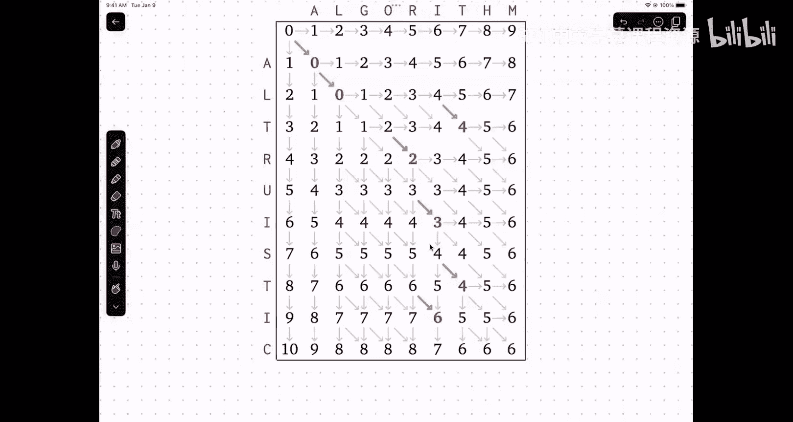

# 算法与计算模型：15：动态规划：编辑距离


## 概述
在本节课中，我们将学习动态规划的一个经典应用：编辑距离问题。我们将遵循动态规划的标准开发流程，从递归回溯算法开始，逐步推导出高效的迭代解法。

---

## 课堂管理与资源提醒

近期实验室发生了一起学生因情绪失控而大声呵斥他人的事件。此类行为在课堂、实验室或答疑时间均不可接受。如果再次发生类似事件，助教将有权要求涉事学生立即离开，并可能上报学校进行进一步处理。

此外，我了解到有学生遭遇了性侵犯。根据联邦法律，我是强制性的Title IX报告人，这意味着我若得知此类事件，必须向校园Title IX办公室报告。同时，我也是计算机科学系CS Cares委员会的主席。该委员会旨在帮助经历或目睹计算机科学系及相关活动中不当行为的学生。我们提供倾听、引导资源（如学生冲突解决办公室、Title IX办公室）或协助沟通等服务。相关答疑时间可在计算机科学系日历上找到。如果你在本课程的任何环节遇到问题，也欢迎随时与我沟通。

期中考试已批改完成约85%-90%，成绩预计明天发布。周四我将公布分数分布及基于当前成绩的预测课程等级。周五我将全天安排额外的答疑时间，以帮助对课程表现或周五午夜截止的退课截止日期有疑问的同学。

---

## 动态规划开发流程回顾

上一节我们介绍了动态规划的基本思想。本节中，我们来看看开发动态规划算法的标准步骤。

### 第一步：设计递归回溯算法
首先，不要考虑效率。目标是获得一个对问题的递归表述。

以下是设计递归算法的关键点：
*   **确定子问题**：通常涉及对输入序列（如后缀或前缀）做决策，并可能需要记住过去决策的某些信息（例如，在最长递增子序列问题中，需要记住最后选择的数字）。
*   **用自然语言描述递归子问题**：这是至关重要的一步，应清晰说明函数参数、全局输入以及函数返回值的具体含义。避免使用“dp”这类无意义的函数名。
*   **推导递推关系（或回溯算法）**：形式化你的直觉。尝试所有可能的下一步选择，递归求解剩余子问题，并组合结果。不要试图提前做出“聪明”的选择，也不要通过递归参数来累积答案。

### 第二步：转化为迭代算法
在获得正确的递归解法后，下一步是使其高效。

以下是转化为迭代算法的步骤：
*   **选择记忆化数据结构**：通常使用多维数组，而非哈希表。数组更高效且易于分析。
*   **确定计算顺序**：分析递推关系中的依赖项，以确保在计算每个数组元素时，其所依赖的元素已被计算。
*   **分析运行时间和空间**：运行时间通常正比于**递推式等号右边出现的不同变量**的所有可能组合数乘以计算每个状态所需的时间。空间复杂度通常由**递推式等号左边的参数**决定，即记忆化数组的维度。

掌握了这个流程后，我们来看一个新的例子。

---

## 编辑距离问题

编辑距离衡量的是将一个字符串转换为另一个字符串所需的最小操作次数。操作包括插入一个字符、删除一个字符或替换一个字符。这个问题在文本编辑器、生物信息学（如DNA序列比对）和音频识别等领域有广泛应用。

### 问题建模
我们可以将编辑操作序列可视化为一个两行的对齐表格：
*   如果一列中上下字符不同，表示一次**替换**。
*   如果一列中只有上方有字符，表示一次**删除**。
*   如果一列中只有下方有字符，表示一次**插入**。

我们的目标是找到总“成本”（操作次数）最小的对齐方式。

### 设计递归解法
我们尝试从右向左构建这个对齐表格。假设我们已经处理了两个字符串的右边部分，现在需要决定最左边新的一列是什么。

**递归子问题的自然语言描述**：
令 `Edit(i, j)` 表示将字符串 `A` 的前 `i` 个字符转换为字符串 `B` 的前 `j` 个字符所需的最小编辑距离。

**递推关系**：
对于一般情况（`i > 0` 且 `j > 0`），我们考虑对最后一个字符的三种操作：
1.  **替换**：将 `A[i]` 替换为 `B[j]`。成本为 `Edit(i-1, j-1) + [A[i] != B[j]]`。其中 `[X]` 是艾弗森括号，当条件 `X` 为真时值为1，否则为0。
2.  **删除**：删除 `A[i]`。成本为 `Edit(i-1, j) + 1`。
3.  **插入**：在 `A` 中插入 `B[j]`。成本为 `Edit(i, j-1) + 1`。

我们选择成本最小的操作：
`Edit(i, j) = min( Edit(i-1, j-1) + [A[i] != B[j]], Edit(i-1, j) + 1, Edit(i, j-1) + 1 )`

**基础情况**：
*   如果 `i = 0`，则需要将空字符串转换为 `B` 的前 `j` 个字符，只能进行 `j` 次插入：`Edit(0, j) = j`。
*   如果 `j = 0`，则需要将 `A` 的前 `i` 个字符转换为空字符串，只能进行 `i` 次删除：`Edit(i, 0) = i`。

### 转化为迭代算法
根据递推关系，我们可以高效地计算 `Edit(i, j)`。

**记忆化数据结构**：
使用一个二维数组 `E[0..m][0..n]`，其中 `m` 和 `n` 分别是字符串 `A` 和 `B` 的长度。`E[i][j]` 将存储 `Edit(i, j)` 的值。

**计算顺序**：
`E[i][j]` 依赖于其左方 (`E[i][j-1]`)、上方 (`E[i-1][j]`) 和左上方 (`E[i-1][j-1]`) 的元素。因此，我们可以按行主序（先 `i` 后 `j`）或列主序（先 `j` 后 `i`）遍历数组，只要确保在计算 `E[i][j]` 时，其依赖的三个值都已计算完毕。

**伪代码**：
```
function EditDistance(A[1..m], B[1..n]):
    let E[0..m][0..n] be a new 2D array
    for i = 0 to m:
        E[i][0] = i  // 基础情况：删除所有字符
    for j = 0 to n:
        E[0][j] = j  // 基础情况：插入所有字符

    for i = 1 to m:
        for j = 1 to n:
            replaceCost = E[i-1][j-1] + (A[i] != B[j] ? 1 : 0)
            deleteCost = E[i-1][j] + 1
            insertCost = E[i][j-1] + 1
            E[i][j] = min(replaceCost, deleteCost, insertCost)

    return E[m][n]
```

**复杂度分析**：
*   **时间复杂度**：我们需要填充一个 `(m+1) x (n+1)` 的表格，每个单元格的计算是常数时间。因此，总时间复杂度为 **O(m*n)**。
*   **空间复杂度**：我们使用了一个 `(m+1) x (n+1)` 的二维数组，因此空间复杂度为 **O(m*n)**。可以进一步优化到 O(min(m, n))，但这不是本课重点。

---



## 总结
本节课我们一起学习了编辑距离问题。我们首先将其建模为寻找最小成本字符串对齐方式的问题。然后，我们遵循动态规划的开发流程：定义了清晰的递归子问题 `Edit(i, j)`，推导出了包含替换、删除、插入三种操作的递推关系，并处理了基础情况。最后，我们将其转化为自底向上的迭代算法，使用二维数组进行记忆化，并分析了其 O(m*n) 的时间和空间复杂度。这个算法是许多序列比对和相似性度量应用的基础。