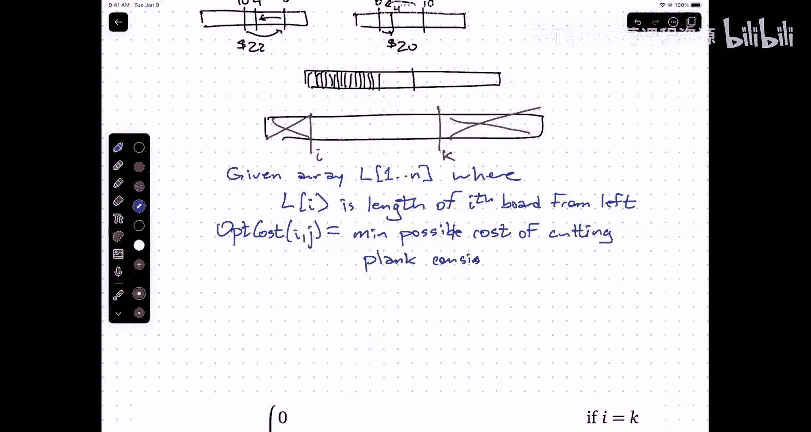
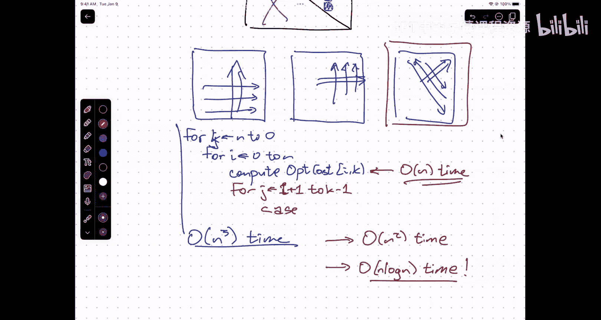

# 算法与计算模型：16：树形动态规划


在本节课中，我们将要学习一种新的动态规划模式——树形动态规划。我们将通过一个“木板切割”问题来理解这种模式，它涉及将一个大问题递归地分解为多个独立的子问题，其依赖关系图呈现出树形结构，而非简单的线性序列。

## 期中成绩概览

首先，我们简要回顾一下期中考试的成绩分布情况。我根据大家提交的作业和习题集（1-4次作业，1-5次习题集）估算了一个课程平均分，并将其与期中考试成绩进行了对比分析。

图表展示了每位学生的估算课程平均分（橙色曲线）和对应的期中考试成绩（蓝色散点）。成绩高于橙色曲线的同学，其作业平均分相对较低；成绩低于曲线的同学，其作业平均分相对较高。目前课程（作业+习题集）的中位数平均分为92%。

关于成绩需要说明以下几点：
*   部分同学因组员未在GradeScope上确认身份而导致作业成绩缺失，请尽快联系组员处理。
*   图表未考虑任何尚未处理的作业或考试的复议请求。
*   冲突考试的分数因其中一题难度较高而略低，我将在期末计算总成绩时进行分数调整。
*   不同助教在批阅同一大题的不同部分时，对评分标准的解读可能存在细微差异。
*   成绩复议的截止日期将会延后。
*   退课截止时间为明天晚上11:59。如果你对成绩感到担忧或考虑退课，请来办公室与我面谈。请注意，目前我只对少数有不及格风险的同学发出了邮件提醒。
*   这个估算比较粗略，仅基于约30%的课程作业，且未考虑最低分剔除、延期等政策。从期中到期末，成绩变动一个甚至两个等级（上升或下降）都是有可能的。
*   本次考试的平均分高于我过去三次教授此课程时的平均分，总体而言大家表现不错。

现在，让我们回到动态规划的主题。

## 回顾：编辑距离问题

上一节我们介绍了编辑距离问题及其动态规划解法。编辑距离定义为将一个字符串A转换为另一个字符串B所需的最少插入、删除或替换操作次数。

我们推导出了以下递推关系，其中 `Edit(i, j)` 表示字符串A的前 `i` 个字符与字符串B的前 `j` 个字符之间的编辑距离：

```
Edit(i, j) = min(
    Edit(i, j-1) + 1,                 // 插入
    Edit(i-1, j) + 1,                 // 删除
    Edit(i-1, j-1) + (A[i] != B[j])   // 替换（字符不同时成本为1）
)
```

基础情况是 `Edit(0, j) = j` 和 `Edit(i, 0) = i`。最终答案是 `Edit(m, n)`。

我们通过一个二维数组（`m+1` 行 x `n+1` 列）来存储（记忆化）所有 `Edit(i, j)` 的值。为了确保计算每个单元格时，其所依赖的左侧(`Edit(i, j-1)`)、上方(`Edit(i-1, j)`)和左上方(`Edit(i-1, j-1)`)的单元格都已被计算，我们通常采用行主序（外层循环遍历行`i`从0到m，内层循环遍历列`j`从0到n）来填充数组。整个算法的时间复杂度为 **O(mn)**。

关于决策方向，一个直观的技巧是：在构思递归时，如果我们从序列的末端（或右端）开始决策并递归处理前缀，那么最终实现动态规划时，循环顺序往往是正向的（索引递增）。反之亦然。两种方式都是可行的。

最后，在计算出包含最优成本（编辑距离）的表格后，我们可以通过回溯（从终点 `Edit(m, n)` 开始，根据递推关系逆向查找每一步的来源）来重建出具体的编辑操作序列。通常，课程中只要求计算最优成本。

## 引入：木板切割问题

现在，我们来看一个新的问题——木板切割问题，它将引导我们进入树形动态规划。

**问题描述**：你有一根长的原木板（plank），需要将其按指定位置切割成若干块较短的木板（boards）。你只能去朋友的车间切割，每次切割的费用等于被切割木板的当前长度。目标是找到一种切割顺序，使得总费用最小。

**示例**：假设原木板长10英尺，需要在距左端2、3、6英尺处进行切割（即得到长度分别为2、1、3、4英尺的木板）。
*   如果从左到右顺序切割：第一次切10英尺板（$10），得到2英尺板和8英尺板；第二次切8英尺板（$8），得到1英尺板和7英尺板；第三次切7英尺板（$7）。总费用 = $25。
*   如果从右到左顺序切割：第一次切10英尺板（$10），得到6英尺板和4英尺板；第二次切6英尺板（$6），得到2英尺板和4英尺板（此处有误，应为得到3英尺板和3英尺板？我们以实际计算为准）。总费用可能更低。
*   如果先切中间（3英尺标记处）：第一次切10英尺板（$10），得到一块3英尺板和一块7英尺板；然后分别切割这两块板。这展示了切割顺序的多样性。

关键在于，第一次切割将原板分成两块后，这两块板的后续切割是**相互独立**的子问题。这与之前编辑距离等问题的线性递归结构不同。

## 定义子问题与递推关系

为了形式化问题，我们定义输入：一个数组 `L[1..n]`，其中 `L[i]` 表示第 `i` 块目标短木板的长度。同时，我们有 `n+1` 个切割点（包括两端）。我们定义子问题：

设 `OptCost(i, k)` 表示将位于切割点 `i` 和切割点 `k` 之间的这段木板（包含了短木板 `i+1` 到 `k`）完全切割成目标小块所需的最小费用。注意，`i` 和 `k` 是切割点的索引，而不是木板的索引。

我们最终要求的是 `OptCost(0, n)`，即将整根原板（从切割点0到切割点n）切割好的最小费用。

现在推导递推关系。考虑一般情况（`i` 和 `k` 不相邻）：
1.  **首次切割成本**：无论第一次在哪里切，切割这段木板本身的成本就是它的总长度，即 `sum(L[j] for j from i+1 to k)`。
2.  **选择切割点**：我们可以在 `i` 和 `k` 之间的任意切割点 `j`（`i < j < k`）进行第一次切割。
3.  **递归子问题**：切割点 `j` 将当前木板分成了左右两段：`[i, j]` 和 `[j, k]`。这两段木板需要分别独立地、以最优方式完成切割，其成本分别为 `OptCost(i, j)` 和 `OptCost(j, k)`。
4.  **总成本**：对于某个特定的 `j`，总成本为 `首次切割成本 + OptCost(i, j) + OptCost(j, k)`。
5.  **最优选择**：我们需要遍历所有可能的 `j`，选择总成本最小的那个。




因此，递推关系如下：

```
OptCost(i, k) = 0, 如果 k - i == 1  # 基础情况：只剩一块板，无需再切
OptCost(i, k) = min(
    (sum(L[j] for j from i+1 to k)) + OptCost(i, j) + OptCost(j, k)
    for all j where i < j < k
)
```

## 动态规划实现

这个递归函数有两个参数 `i` 和 `k`，因此我们需要一个二维数组（或表格）来进行记忆化。数组的行对应 `i`，列对应 `k`，大小约为 `(n+1) x (n+1)`。我们只关心 `i < k` 的部分（矩阵的上三角部分）。

**确定计算顺序**：计算 `OptCost(i, k)` 时，它依赖于所有 `OptCost(i, j)` 和 `OptCost(j, k)`，其中 `i < j < k`。在二维表格中：
*   `OptCost(i, j)` 位于同一行 `i`，但列 `j` 在列 `k` 的左边。
*   `OptCost(j, k)` 位于同一列 `k`，但行 `j` 在行 `i` 的下方。

因此，为了确保计算每个单元格时，其依赖的所有左侧和下方的单元格都已就绪，我们可以按行从下往上、每行从左往右计算。或者，也可以按列从左往右、每列从下往上计算。另一种更直观的顺序是**按子问题长度（即 `k - i` 的值）递增**的顺序进行计算：先处理所有长度为1的基础情况（`k = i+1`），然后处理长度为2，长度为3，...，直到长度为 `n`（即 `OptCost(0, n)`）。

**算法复杂度**：我们需要填充 O(n²) 个单元格。对于每个单元格 `OptCost(i, k)`，我们需要：
1.  计算 `sum(L[i+1..k])`，这可以在 O(n) 时间内完成，但通过前缀和预处理可以优化到 O(1)。
2.  遍历所有可能的切割点 `j` (`i < j < k`)，最多有 O(n) 个。
因此，最直接实现的时间复杂度是 **O(n³)**。通过一些优化技巧（如利用四边形不等式），可以将此特定问题的复杂度降低到 O(n²)。甚至存在基于贪心选择（类似于霍夫曼编码）的 O(n log n) 算法，但这属于该问题的特殊性质，并非所有树形动态规划都适用。

## 总结

本节课中我们一起学习了树形动态规划。我们从编辑距离问题的回顾开始，巩固了基于前缀的线性动态规划思路。然后，我们引入了一个新的木板切割问题，它展示了动态规划的另一种常见模式：**树形分解**。在这个问题中，一个决策（第一次切割）会将原问题分解成两个独立的子问题，这些子问题可以继续递归分解，形成树状的依赖结构。

我们定义了子问题 `OptCost(i, k)`，并推导出了相应的递推关系，其中包含了对中间切割点的遍历。我们讨论了如何用二维表格记忆化，并分析了以子问题长度递增的顺序进行填表的策略。最终，我们得到了一个时间复杂度为 O(n³) 的动态规划算法，并提及了可能的优化方向。



树形动态规划是解决许多区间划分、树形结构优化问题的强大工具，关键在于识别出问题如何被分解为独立的子问题，并正确定义状态和递推关系。