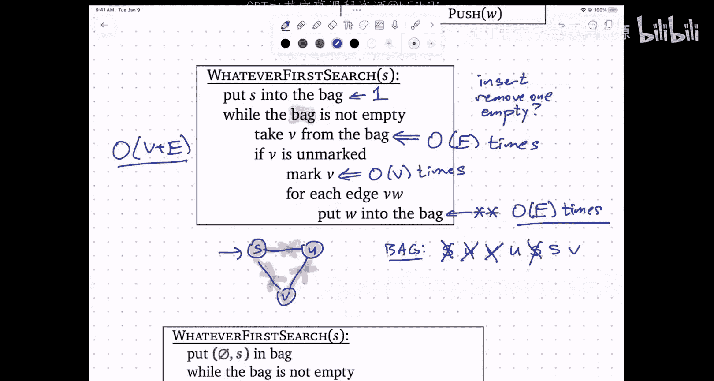

# 算法与计算模型：第17讲：图的表示与遍历 🗺️


在本节课中，我们将要学习图的基本概念、两种核心的数据结构表示方法（邻接矩阵与邻接表），以及一种通用的图遍历算法——任意优先搜索。

图是算法设计中最为有用的数学抽象之一。它由**顶点**（Vertices）和连接顶点的**边**（Edges）组成。一个图可以形式化地定义为 `G = (V, E)`，其中 `V` 是一个非空的有限顶点集合，`E` 是边的集合。对于无向图，边是顶点的无序对 `{u, v}`；对于有向图，边是顶点的有序对 `(u, v)`。重要的是，要将图本身与其图形化表示（即画出来的圆圈和连线）区分开来，后者只是图的一种可视化方式。

上一节我们介绍了图的基本定义，本节中我们来看看如何在计算机中存储和表示图。

## 图的表示方法

当我们在代码中处理图时，需要将其存储在具体的数据结构中。主要有两种标准的数据结构表示方法。

### 邻接矩阵

邻接矩阵使用一个二维布尔数组 `A` 来表示图。如果图有 `n` 个顶点，则矩阵大小为 `n x n`。矩阵元素 `A[u][v]` 的值为 `1`（或 `True`）表示顶点 `u` 和 `v` 之间存在一条边，为 `0`（或 `False`）则表示没有边。

**核心概念公式：**
`A[u][v] = 1 if (u, v) ∈ E else 0`

对于无向图，邻接矩阵是对称的，即 `A[u][v] = A[v][u]`。

**优点：**
*   可以在常数时间 `O(1)` 内查询任意两个顶点间是否存在边。

**缺点：**
*   无论图中有多少条边，它总是占用 `O(V²)` 的存储空间。
*   列出某个顶点的所有邻居需要 `O(V)` 时间，即使该顶点的实际邻居很少。

### 邻接表

邻接表使用一个数组（或列表）来表示图，数组的每个索引对应一个顶点。每个数组元素存储一个链表（或其他动态容器），该链表包含了与该顶点相邻的所有其他顶点。

**核心概念代码（Python风格描述）：**
```python
# 假设顶点编号为 0 到 V-1
adjacency_list = [[] for _ in range(V)]
# 添加一条从 u 到 v 的边（无向图需添加两次）
adjacency_list[u].append(v)
```

**优点：**
*   存储空间与顶点数 `V` 和边数 `E` 成正比，为 `O(V + E)`，对于边数远少于 `V²` 的稀疏图非常高效。
*   可以高效地列出某个顶点 `v` 的所有邻居，时间复杂度为 `O(degree(v))`，即与该顶点相连的边数。

**缺点：**
*   查询任意两个顶点 `u` 和 `v` 之间是否存在边，需要 `O(min(degree(u), degree(v)))` 的时间，在最坏情况下可能达到 `O(V)`。

在实际算法中，尤其是处理稀疏图时，邻接表通常是更优的选择，因为许多图算法（如遍历）的核心操作是“列出某个顶点的所有邻居”。

## 图的遍历：任意优先搜索

遍历图意味着系统地访问图中的每一个顶点。我们介绍一种通用的遍历框架——任意优先搜索。

以下是任意优先搜索的核心思想，它使用一个称为“袋子”的抽象数据结构：
1.  将起始顶点放入“袋子”。
2.  只要“袋子”非空，就从中取出一个顶点。
3.  如果该顶点未被访问过（标记），则标记它已访问，并将其所有未访问的邻居放入“袋子”。
4.  重复步骤2-3。

**核心概念伪代码：**
```
WhateverFirstSearch(s):
    mark all vertices as unvisited
    initialize an empty Bag
    put vertex s into the Bag
    while the Bag is not empty:
        take a vertex v from the Bag
        if v is unvisited:
            mark v as visited
            for each neighbor w of v:
                if w is unvisited:
                    put w into the Bag
```

这个算法的关键在于“袋子”这个抽象。通过选择“袋子”的具体实现，我们可以得到不同的遍历策略：
*   如果“袋子”是一个**栈**（后进先出），那么这就是**深度优先搜索**。
*   如果“袋子”是一个**队列**（先进先出），那么这就是**广度优先搜索**。
*   它也可以是**优先队列**或**随机集合**等。

无论“袋子”如何实现，该算法都能访问从起点 `s` 可达的所有顶点（即 `s` 所在的连通分量）。要遍历整个图（包括所有连通分量），只需在外层循环中依次以每个未访问的顶点作为起点调用此算法即可。

以下是分析该算法时间复杂度的一个关键点：

**运行时间分析：**
*   每个顶点最多被放入和取出“袋子”各一次。
*   对于每条边 `(u, v)`，算法会从 `u` 检查 `v` 一次，并从 `v` 检查 `u` 一次（对于无向图）。因此，检查邻居的循环总共执行 `O(E)` 次。
*   如果图使用邻接表表示，那么总时间复杂度为 `O(V + E)`。



本节课中我们一起学习了图的基本表示方法——邻接矩阵和邻接表，以及一个强大而通用的图遍历框架——任意优先搜索。理解这些基础是学习后续更复杂图算法（如最短路径、连通性分析等）的关键。记住，选择正确的数据表示方式可以显著影响算法的效率。