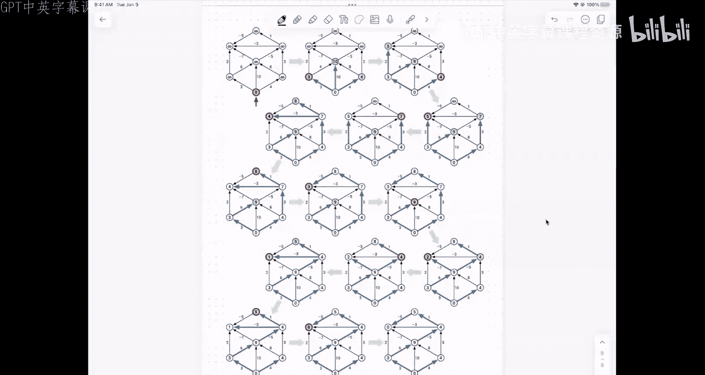

# UIUC《算法与计算模型｜UIUC CSECE 374 - Algorithms and Models of Computation 2023》中英字幕 p19 20231024-Oct 24_ topological sort, dag dynamic programming, shortest paths.zh_en -BV1Mh7RzaEL2_p19-

非常那个单的。

But但。は。Okay。Thanks everybody for coming， let's go ahead and get started one quick admin announcement。

So the there's a homework due tonight， but for problem two on the homework I did not cover enough material on last Thursday's lecture to hit the intended solution so that that problem and that problem alone is now due tomorrow at nine instead of tonight at nine so believe this is。

Is homework seven or homework eight， eight？8。2 is do。Wednesday。October 25th。At 9 p。

m everything else is is due at the usual time in particular。

 that means if for some reason you need to use an extension this week， then for you this week。

Homework 8。2 is due Thursday at night。Which will delay us posting solutions， but I think on balance。

 that's a reasonable price。嗯。啊。Pick9 is out。This is the last homework。Before。Midterm two。

And this is in two weeks。So I will say more about the second midterm as it gets closer。

But the basic structure it will follow more or less exactly what we did in midterm one。

 so in particular the Thursday and Friday before the midterm there will be no lectures and no labs。

 but we'll have review sessions。There will be two practice midterms。

 one of which I will go through in the review session on that Thursday， there will be five questions。

 each worth 10 points。嗯。The basic idea， yeah。Yeah。Oh sorry， I'll fix that link， yeah， thank you。

The fodder will come out next Monday。For maternity。Okay。Any other admin logistics stuff？嗯。Okay。

 so last time。I started talking about。Dip first search。In particular， in directed graphs。嗯。And。

Let me move some things around here。The idea of a。嗯。Pre order or post order traversal of a。

Of a graph using depth for search right so these are entirely consistent with preor and postoral traversals of trees where the idea is in a preorder traversal you visit the node and then recursively explore its subtes post order trasal you do the recursion first and then you explore the node yeah。

Oh yeah， I'm sorry。We're working on it now， there were a lot the question was about homework six。

There were a lot of submissions that got flagged by the CAAs。

As needing TA attention and or needing instructor attention。

 so I'm trying to go through those as much as I can homework 5。

2 was released that the grades were released this morning finally finally got through all of those we got a lot of nonstand solutions that took a while to untangle。

But I'm hoping we can get through those。诶。Within the next couple of days。Yeah。嗯。Okay。So。

Deep for search， there's this wrapper function that goes around the main algorithm that starts by setting the clock to nothing and unmarking all the vertices。

And then it visits the vertices one at a time in arbitrary order。

 if it sees that a vertex is unmarked， then it launches a recursive exploration of the graph from that point。

That recursion is guided by this subbertine over here on the right。

 it takes in a node and the current value of the clock。

And the clock here is just incrementing both the at the beginning。

 the first time the node is marked it immediately increments the clock and records that as the preor label the previsit time for that node。

 then it recursively explores the all outgoing edges from the。😡，So all of the quote unquote。

 children or followers of the test if they're unmarked if they are assign a parent and and。

Passes in the clock and gets the clock back， then when it's completely done with all the outgoing edges。

 increments the clock again and records the time when I'm completely done exploring the。And。

What this is。嗯。Basically， recording。So here's the example that I showed on Thursday of a directed graph。

So I'm assuming that DFS all is going through these vertices in alphabetical order。

 so at the beginning I start my exploration at A and then all of the nodes，In。This。Subree。

That all of these nodes that are reachable from a。All these nodes are marked and all those parent pointers are set。

To the heavy green edges。And then when I pop out the next node in the outer loop that is not marked is node e。

 so I start another recursive exploration at node e and that finds。😡，All of the nodes。

That are reachable from E that were already marked in an earlier iteration of DFS。

So what you're seeing down here at the bottom。Is a record of what's on the recursion stack。

At any given time， so the recursion stack。Stecs normally grow up。

Here i'm drawing these things going down， so the bottom of the stack is actually at the top of the figure here。

 so at time one。I push a onto the stack and then it does a bunch of recursive calls that eventually at time 22 a comes off the stack。

 so a is assigned a pre visit。Time of one and a post visit time of 22。

And one of the things that falls out is that this forest of parent pointers is exactly the same as the forest of recursive subproblem。

 it is the recursion forest。Of depth first search。U。Okay， so I get this this lovely spanning forest。

 this whole algorithm runs in time proportional to the number of vertices plus the number of edges。U。

But why do I want these numbers？I don't really have a good answer for why you would want the preorder。

 the pre visit numbers。I don't have a good application of traversing the nose into graph in DFS preorder。

But what one thing that you should probably。Imagine as sort of a model for for this is modeling something that you might want to do。

 which is let's imagine that your graph isn't represented。In an explicit graph data structure。

 but it's just some pointier base data structure in memory。

You've got records that have pointers between them。

And you want to print out that data structure in some useful way。

So you can do that using this algorithm where instead of incrementing the clock and setting V dot pre for the previsit time and VDt post for the post visit time。

 you could say in the red part where in the previsit， you could say， okay。

 now I'm printing all of the non pointer bits in this particular record。

And then opening up parentheses and increasing an indentation value or something before I recursively print all the stuff that it points to。

 and then in the green part or post order， you could say okay now I'm done with record at this address so me can close the parentheses and outdt。

嗯。This is。One of the ways that。Garbage collection works in languages like Java that use garbage collection。

 there's an internal data structure that points to every node every object that's ever been allocated。

And in the background， it's running depth for search and marking nodes。

That don't have any pointers going into them and marking other nodes that those pointers can reach。

Typically using some kind of depth research like this so that it can free up that dynamically allocated memory in the background without the programmer having to do it themselves。

嗯。But post order。As a thing by itself actually has a relatively useful function。

 which is that I can use it to detect cycles。In a directed graph。hey。😔，So the lema here says。

A graph a directed graph has a cycle if there is an edge from some node v to some node W。

Where the post visit time of V， the tail of that edge is less than the post visit time of W。

 the head of that edge。😡，In other words， there's an edge from V to W。

 but somehow depth for search finishes V before it finishes W。

And just to give you a concrete example of this。For example， here。Is a cycle？KLO。

And there's this edge from K to L that's not in the depth for search forest。And sure enough。

There's an edge from K to L， but somehow depth for search finished with K before it finished with L。

So that signals that there is a cycle。Now， if you didn't have this lemma in hand。

The best way that I could imagine looking for a cycle is to say， well。

 maybe there's a cycle containing the edge from V to W。The way that I would test for that is ask。

 can W reach V？If it can， then I can follow the path from W back to V and then the edge from V to W。

😡，系。So I could detect cycles by doing a bunch of reachability checks。One for each edge of the graph。

But now this is taking time quadratic in the number of edges because for every edge i'm doing work that's at least proportional to the number of edges if i'm a little bit smarter。

 I could say is there a。😡，Is there a cycle going through a single vertex？

And only do a reachability from W to everything else。

 and then look at the incoming edges to W and see if the tail of that edge is reachable so I could reduce to something that's like v times E time。

😡，But this particular lemma。Means we can detect。Cyclees。

In particular directed cycles in v plus E time。I run depth for search。

 marking everything with its post visit time。And then I by brute force。

 look for edges that satisfy this condition。系。嗯。I think in the interest of time。

 it's probably better if I don't。Show you a proof of this slemma。It's relatively simple， but。

I think because I'm a little bit behind already， I don't want to get further behind。

 there's basically three possibilities for what can happen given this edge V to W。

 I know when I visit V， either I haven't touched W at all yet。And then that's one case。

 or I've already completely finished with W， that's another case。

 and there are a couple of subcases in there in one of those three cases you get this inequality and the appearance of the cycle and in the other two cases you don't get either of those things。

Yes。没事的。No。Yes。So it's not that DFS found V before it found W， it's that DFS finished with V。

Before it finished with W。So normally what you would expect if there were no cycles is that， okay。

 DFS at some point is going to find V。If W hasn't been visited yet。

 it will then recursively do everything it can with W， finish with W， come back to V。

 but possibly visit some other edges leaving V and then finish at V。

So that's the case where it will finish it the after it finishes W violating this inequality。嗯。

That's right。That's right。Yeah， so K here is given a post order time of 12 L here is given a post order time of 16。

And sure enough， there's a cycle that goes through the edge from KL。嗯。

But now we also have the flip side of this。Which is suppose。This condition。Never happens。

Suppose I run up the research and I discovered for every edge from V to W。

The post time of V is greater than the post time of W。😡，So every edge。

 you have a record that DFS finished at the head of that edge before it finished at the tail of that edge。

Then what this dilemma says in that case is this graph has no directed cycles。In other words。

 it's a directed acyclic graph。So this is an example of a dag。As it's called。在。Dag equals。Directed。

Acyclic。Graph。So if you look at the graph over here on the left。😡。

It looks like the same pattern of vertices and edges。

 but I've changed the direction of some edges to make sure that there are no cycles。嗯。

There are no directed cycles anywhere in this graph。

 there are things that kind of look like cycles like this。😡。

But you'll notice that these edges are not all oriented consistently。

 so these two green edges are going onclockwise around this cycle。

 but this blue edge is going counterclockwise around this triangle。So that's not actually a cycle。

In the directed sense。and again， I've gone through this particular example with all these green edges。

 this is showing the effect of visiting the vertices in alphabetical order in that outer loop where I'm wrapping around all the vertices and following depth for a search inside starting at any unmarked vertex that I find so at the beginning。

😡，Start a depth search search at A。That can reach B， but then A and B can't reach anything else。

 and so that iteration of invocation of depth Thr search stops after just visiting A and B。

Then later I'll visit C but C doesn't have any outgoing edges and so there's nothing to recursively explore。

 so the next thing I look at D again， D doesn't have any outgoing edges to unmark vertices so the DFS terminates almost immediately yeah。

😡，It's the contrapoitive of this implication。G has no cycle， if and only for every edge from V to W。

 we have V post greater than W post。so I can write that in no。Every。Greater。嗯。So again。

 here is a picture of the stack trace。The history of the recursion stack as I'm running DFS。

 in this case， I get a spanning forest that contains six trees。

 two of those trees are just individual nodes。Three of them just have two nodes connected by an edge。

 there's one non trivial tree in the depth first forest that contains the vertices EIN O K LPH。Again。

 if you look carefully， the structure of the green edges over here into trees。

 it's exactly the same as the nesting order of the nesting relationship between these blocks。

There's a pointer from， the interval of F contains the interval of G that's the same as there's a green arrow from F to G。

U。Because this is a dag there is at least one of each of two special types of vertices。

So the green vertices I have over here Ef and J， those have no incoming edges。Those are。

Called sources。And the red edges。These have no outgoing edges。

 those are called sinks every dag has at least one source， every dag has at least one sink。

 these two vers， the same node can be both a source and a sink if it just has no edges at all。

And but in this case， the dag has three sources and three sinks。嗯。Um and then。Okay。

 so if I apply this， look at this lemma， G has no cycles if for every edge VW。

 we have the post greater than W post。So another way of saying this is if G doesn't have any cycles。

 then I can sort。The verertices。Byu their post time。And every edge will point。From。啊。

A later vertex to an earlier vertex。So if I reverse that， right so this is。Reverse。Post order。

This is called topological order。For the dag？And computing a topological order for a daAg is called topological sort。

Okay， so in this horizontal figure。I've sorted the vertices from right to left by their post order times。

 so you'll notice vertex J has post order time 32， that's the maximum post。😡。

Vertex J shows up on the far left。All of the sources end up kind of over to the left。

 all of the sinks end up kind of over to the right。

 and every edge is pointing from an vertex that's further to the left towards an a vertex that's further to the right。

😡，If there were a cycle in the graph and ordering like this wouldn't be possible because at least one edge in the cycle would have to point the wrong way。

嗯。So the nice thing about this post orderlema is that immediately in linear time。

 in V plus C time gives you an algorithm to compute a topological order for a graph。😡，Here is。

One way of writing that algorithm。I'm using this。You know。

 somewhat idiomatic language here for all vertices v in post order if you prefer you can use that recursive description of that first search and then that line where I where I assigned the post order things I could instead。

😡，Assign the vertex to its place in this array S， which is eventually going to be my topologically sortded list of vertices。

And notice that the clock here is counting down。Because。Topological order。

 all the edges are going forward， but if I sorted things by post order。

 all of the edges would go backward。This is， again。

 an avatar of the fact that the order in which things come off the recursion stack is the opposite of the order that things go onto the recursion stack。

嗯。Now。General piece of advice。Whenever anyone hands you a da。The first thing you should do。

Is topologically sorted。The second thing you should do is ask， okay。

 what do you want me to do with this De？You see a da you go， okay， let me sort it done， okay。

 now what？immediately， first line of anything given a dag is topologically sort the dag because you're going to be spending at least this much time doing other stuff anyway。

So if you're going to be， if you're going to have to touch every vertex in the graph。

 you're going to have to touch every edge in the graph。

 anything you can do in order v plus E time is essentially free as far as the final running time is concerned。

 so you might as well topologically short things。😡，Just from the beginning。

And then you have the vertices in this nice order。Now。Why would an order like this be interesting？

Well。嗯。I'm going to come back to the strong components thing again in a second。

 but let me describe a particular problem that actually shows up。Fairly often。In different forms。

This is the longest path problem。Okay， so I'm going to assume I'm given a dag。G equals V。

I want to and I have weights。On every edge。Some just real numbers。Could be positive。

 could be negative， it could be zero， don't care。All right， I want to find。A path。In G with。

Mat sorry， maximum total。wait。And if you prefer， you can think of these things as lengths。

Although that doesn't really make sense if。The they're negative。

 but still you want to call them length instead of weight that's perfectly fine if you want to call them costs。

 if you want to call them prices， if you want to call them durations， if you want to you know。

Use use other words as long as what you're doing is you're looking for a path in this graph that maximizes the sum of our edges in that path of the value attached to that edge。

😡，I。嗯。Okay， so heres is my graph G， the first thing I'm going to do is topologically sort it。😡。

So the vertices of G are going to be sorted from left to right and with all edges pointing from left to right。

 and I want to find the longest path somewhere inside that dag so the way that I'm going to do this is I think it's actually a little bit simpler if I add an artificial sink。

To the DAg where that's connected to every other vertex of G by an edge of weight zero。

And then I could say find me the longest path that ends at vertex T。Then if I take the last edge off。

 which doesn't contribute to the total weight of the path， I'm going to get a path just inside G。

 any path inside G， I can extend to T by adding that link zero edge that doesn't change the weight。😡。

So finding the longest path inside G without those extra edges is the same as finding the longest path that ends at T using exactly one of those extra edges。

嗯。But now let me define。Length longest path V。This is the length。Of the longest path。Yinz。From。V2 T。

What are we doing？What am I doing here？This doesn't look like I'm doing graph stuff anymore。

I just defined a function in English。Dynamic programming。Yeah。So the idea is。If I don't do that。

 then in principle， I have to consider every possible start and end vertex。

As the start of end of my path， and there V squared such pairs。

 and that's just going to take me too long。If I do this。

 then I know I can just I add an artificial sink。Connected by zero。

 right now just ignore that last edge and I'll still consider。All the possibilities I need to。

Why don't you need a starting course。I'm going to compute this value for every vertex v。😡。

And I have this intuition because I'm about to do dynamic programming that I'm going to need to do that anyway in my recursive subprom。

So adding a vertex S only helps。With the what what's the final value that I want to return so I I sure I could do that I could add a source。

But's。Let's again， that's connected to every every edge， every vertex in G and now we want。LLP of S。

That does simplify things， thank you。If I didn't have that S。

 then I would want MaximerralV of LOP and V。Okay， so you'll notice here that I've fixed the last vertex of the path in every invocation of this function。

 the starting vertex of that path is the thing that can change， it' the input to the function。

 I do want to point out several things that again this seems to be causing some confusion in the dynamic programming homework。

 you'll notice one， the name of the function is mnemonic。😡，Length of longest path two。

 the function has explicit input parameters that carry only the information I need to actually define value。

Namely the start at vertex T is fixed for everything。

 you just assume that the graph and the names of vertices in the graph are global variables。

 I'm not passing any additional information in here except the vertex where I need to start the path three。

😡，The description is self containedtain， it doesn't refer to anything like the current step。

 the next step somewhere in the process， the stuff that I've written down to it doesn't refer to any arrays。

 it doesn't refer to anything except the input。Fourth。

 it explains explicitly how the output of the function depends on the input parameters。

All four of these。Are fairly common things that a lot of people didn't do in the homework。

I want to emphasize this English description is 30%。

Of the points on any dynamic programming problem on the exam。And we are serious。

Please this is one thing that I'm going to you know go over again and the when I start going through the practice midterm。

 writing this English description is by far the single most important part of developing any dynamic programming algorithm if your first instinct is to start typing Python stop。

😡，Resist your first instinct and figure out what you're trying to do first。

I'm saying that mostly because the people who jump in and start writing Python are much。

 much more likely to get it wrong。Then the people who write start with this English description and follow from there。

Okay， so I've got this function that I can think about computing and there's a question that I can ask that will help me phrase interpret this function in terms of quotequ smaller recursive instances of itself。

😡，And that's the question， what is the first edge along this shortest path？Okay。

 so the general case of the recurrence。Is going to be， well， I don't know what the first edge is。

But I do know that。The weight of the longest path that uses some first edge V to W。

Is going to be the length， the weight of that edge。Plus the length of the long this path from W。

 the rest of the way to T。😡，Now I don't know what the right choice of W is。So I'm going to choose。啊。

And choose the best one。So I'm going to take a max over all outgoing edges from V of this expression。

😡，WithThe weight of the first edge plus the rest of the path。

 maximized over all choices of first edge。Now， how do I know that this is actually a proper recurrence。

 how do I know that this recurrence is eventually going to bottom out？Yeah。

Why will I eventually get w as equal to 15？Or why will I eventually get v as equal to phi？

You're right， but why？Yeah。There's something global about the graph， yeah。I的。有。怎么的。

You're getting closer， yeah。It's a dag。There are no cycles in the graph。

If there were a cycle in the graph， this recurrence。Would infinite loop？IIf I had。

 a cycle somewhere from， let's say， A to B to C。Then if I tried to compute LLP of A。

 I'd need to look at LLP of B， but to do that， I'd need to evaluate LLP of C， but to do that。

 I'd have to evaluate LLP of A。😡，So I would have an infinite loop in the recursion。So。

But I can't there are no cycles I assumed at the beginning that the graph was deck。

I need a base pace for the recurrence。So this question is about what is the first edge on the path from V to T。

 when is there no first edge on the shortest the longest path from V to T？Yeah。When v is equal to t。

So if v is equal to t。Otherwise， then here I get zero because the only path from a vertex to itself is the empty path that has no edges and therefore the sum of its edges has weight zero。

Okay， so I have a recurrence。U。I can。Memormalize this recurrence by storing。

The function value LLP of V into an extra field associated with vertex v and whatever data structure I'm using to represent the graph in a standard adjacency list I would just use a parallel array。

 but well here is the memmalized recurrence。😡，嗯。Longest path， again。

 I'm passing in V and the target vertex T if the length of the longest path for V has not been defined yet。

 I'll set it to negative infinity， this is just a signal that anything longer is going to be better。

And then for every edge from V to W， I recursively evaluate the longest path from W to T。

 I add on this length， I take the max of whatever I think my longest path from V is and that recursively computed value and store that in the node is the length of the longest path。

😡，So I memorized the recurrence into the graph itself。嗯。And then at the end。

 I return the longest path。U from。From V， the' links to that longest path。So。

But I can also say this as。嗯。Here are come on， there we go。Here are the vertices。

In topological order。V is a sink or sorry T is a sink， so T is going to be the last vertex。U。

What order are the values of the longest pathway that's going to fill in this array？Bo。

 started the base case。And I work my way back。To the value of what I want。

 the base case is on the far right， the value I want is on the far left。

Every node V depends on some subset of other nodes further to the right because that's all edges point from left to right。

😡，So that means I can evaluate。啊。I can fill in this array。From right to left， in other words。

 in the reverse。Of topological order。So I get just now set up a for loop because I topologically sorted the dag at the beginning of time when I was given the DAg。

 but the interesting thing is now I filled in this thing in reverse topological order。

 but how did I define topological order？Was the reverse a post order？

So the reverse of the reverse of post order。Is post order？

So here is dynamic programming version of that algorithm that just says for all the post order。😡。

And every time I've replaced the recursive calls with data structure lookups。

And this whole thing is really just a modification。Of depth third search。

Instead of checking for you know assigning a counter to every vertex saying this is the next vertex in post order。

 what it's doing is computing this value v。llllP， so instead of computing v dot post。

 it's computing v。llLP in a depth for search。😡，This。Equivalence。I mean。

 arguably these are exactly the same algorithm。The way that I've set it up top is I'm explicitly looking at a modification of depth for search。

😡，I've called it longest path， but the recursion pattern is whenever I visit a vertex。

 I recursively look at all of its out neighborighors and I recursively search from there。

Unless I've been here before， in which case I don't。That's that's just what depth for search does。

 so that first algorithm is depth for search the second algorithm is assume I've already sorted things by post order just scan in that order。

😡，Or run a depth or search， which tells you in post order when it hits vertices。

 and when a new vertex pops up， do this。😡，So you could think of both of these things as just a depth for search post order traversal of the graph。

😡，But you could also think of these things。The second one as an iterative traversal through a data structure in the correct evaluation order to do dynamic programming。

This pattern works。For any。Dynamic programming problem where what you're trying to compute is the length of cost or value or duration or attractiveness or something of a sequence。

😡，The sub problemsblem implicitly define a dependency dag。

And what you're looking for is some variant of what is the best path through this Dg？

So every one of those dynamic programming problems that we looked at where you're looking for a sequenced in lecture。

 in lab， in homework。Really。Is finding an optimal path in a dag using this recursion path。

Whether you're more comfortable thinking about those things as dynamic programming or whether you're more comfortable thinking about them as let's set up the dependency Dg and do topological sort things。

Is a personal choice， they're both correct， they both lead to the same running time。

 they're arguably exactly the same。系。For dynamic programming three things where you're looking for trees like a woodcutter problem or the stupid script problem in the homework。

 that's not like this， the recursion patterns more complicated。

 you can't set that up as the long as path to that question， but for things like edit distance，Well。

 you have this grid dag and you're looking for a path through it。

The details just are in how do you actually set up the function。

 how you compute the value at any particular node， given the values at its successors。Okay。😊，U。

This might be helpful for Home 8。2。The other thing that might be helpful theorem for homework at。

2 is this thing that I mentioned briefly， and I'm going to mention briefly again called the strong component graph。

 the Megraph， when you have a directed graph that is not a DAG，嗯。

It is often useful to identify clusters of vertices where within each cluster you can get from any vertex to any other vertex。

So all of the vertices in the orange cluster in the bottom left， IjMN。

 you can walk from one of those vertices to any other one of those vertices。

These are the strong components of the graph。I can identify them in linear time using either of two algorithms that are in the textbook。

 and I am not going to explain to you because if you care。

 you can read the textbook and if you don't care， you could just think this is a function。

 a library function that's supplied by my operating system move on。😡。

One of the things that those algorithms output as a side effect is this object called a metagraph。

 has one node for each strong component and has edges between two strong components if there's an edge from a node and one strong component to the node in the other。

The metagraph is always a directed ascyclic graph， because if there were a cycle in the metagraph。

 you actually have a cycle in the original graph that should have collapsed all those components into one。

And that means you can do dynamic programming。😡，Over the meta。This might be useful for homework 8。2。

Fush。呃ello。他不道嗯。Longest path using edge weights but longest path on vertex weight so this is an excellent question I talked about longest paths using edge weights one can also consider longest paths using vertex weights and yeah this is an interesting thing for you to figure out how to do。

If you're invoking LLP as a black box， make absolutely sure that it's solving exactly the right problem。

But if it is， you can just say， I'm invoking the longest path algorithm in the textbook， the end。

So if you're invoking that algorithm， you just invoke that algorithm。

if you need to modify the algorithm slightly， perhaps。😡，Then you should describe that modification。

 it's okay to say， oh you gave me a dag I'm going to topologically sort it。

 there's no harm in ever doing that。😡，嗯。But it's not necessary if you're applying the algorithm verbatim from the textbook。

Yeah。If I sorry， I missed the end of that question， if I have a da。

 I don't necessarily have to topological sort it but。Is pretty。

If I'm trying to find the longest path。So I think。In some ways， the right way to say this is。

I'm using this idiom for each node V and post order。

That implicitly visits the vertices in reverse topological order by doing a depth research。

 so I don't need to do an explicit topological sort at all。😡。

Or I did an explicit topological sort and then I'm going backwards through that list。You say potato。

 I say potato。Six size of one half of the other doesn't matter。系。U。

That is what I want to say about directed graphs and depth for search。

That took a little bit longer than 15 minutes。呃。But the next thing I wanted to talk about is computing shortest pads。

😡，So just to start off， how would you compute the shortest path in a DAg？Yeah。

 I changed the letters A and X in this algorithm to the letters I and N。So instead of max everywhere。

 I do min everywhere when I I。Oh oh and I need to change that negative infinity do a plus infinity yeah。

 so found it can do shortest paths in a dag， I can also do that by a post order traversal of the dag。

In linear time。U。Even if the edges have negative weights。This only works。If the ground is a dad。

More generally， if the graph isn't a dag。Shortest paths。A are more interesting。嗯。嗯。So。

Generally speaking。Even if I'm interested in computing， say。

 what's the shortest path in this directed graph between S and T。

 assuming the edges have negative weights？😡，I don't really know of a way of doing that that is more efficient。

Then computing all shortest paths from S to everything else。Or symmetrically。

 all shortest paths from every vertex to T。Okay， so generally you。

When we're talking about shortest paths， by default， we mean the single source shortest path problem。

Which is， you know given。A graph。With weights on the edges。Typically positive and source vertex。Um。

 find。The shortest path。From。As to every。Other。Verex of G。And so the first thing I want to observe。

Is that these sortest paths define a tree。It's a tree rooted。At。Yes。可。😊。

And so let me quickly convince you of this。嗯。So suppose for the sake of argument。

That somewhere in my graph， I have a shortest path here marked in black from S to sometex V。

And I have a different shortest path marked in dash red going from S to sub vertex U。😡。

And these paths， once they diverge， they meet again at some point now if for any pair of these paths。

 if they share a common prefix and then I diverge and they never intersect it again。

 then I have a tree。😡，The only way it can violate。This condition of having a tree is if at some point shortest pads split off。

And then come back together again。Like I'm showing here。对。嗯。No。Let me look at。This subpath。And。

This subpath。These are both pads from A to D。Suppose the green path from A to D is shorter than the red path from A to D。

Then I claimed that that red path from SU isn't the shortest path from SU because I could take out the red subpath and replace it with the green subpath。

Symmetrically， if the green， if the red subpath were shorter than the green one。

Then the shortest path from S to V is incorrect。I should replace the green stuff with the red stuff。

Okay， so。If the green。offff。A to B to C to D is shorter。Then。The red path。A to x to Y to D。Then。呃。

The shortest path。From。S to U is incorrect。Right， I should remove those things。And instead。Do this。

Okay。😊，So if I work under an intuitive simplifying assumption that there's exactly one shortest path between any two nodes。

 then this argument implies that shortest paths can never diverge and then rejoin。Once they diverge。

 they diverge forever， which means that they define a tree。If there are ties。

 then what I can say is there is a collection of shortest pads that define your tree。

And so what algorithms or short pests actually do is they look for this tree。

And even if there are ties between different shortest paths。

 this structure implies that there is a tree that contains shortest paths from S to every other veres。

Right。So。嗯。What every shortest path algorithm does。Every shortest path algorithm does the same thing。

UI。I'm going to maintain at every vertex of my graph。😡，Two pieces of information。

One of those pieces of information is D dotD。This is an estimate。Of the shortest path。Distance。

Or length。From S to V。And V dot pre。This is the。Predecessor。Of the on this estimated shortest path。

Okay， so in the end。V dot disk is going to be the true shortest path distance from S2V。

 and V dot pred is going to be the last edge on the true shortest path from S2V。

So the pre here is it's a predecessor because the paths are going out。

 if I imagine the edges going backwards， I should really think of that as like V dot parent in the way that I set up whatever first search and whatever first spanning trees last week。

This's usually in the context of shortest paths set up as predecessors。

And the paths are oriented away from us。等。So and when I talk about this estimate。

 this is always an overest， it's never an underestimate。

 it's never less than the true shortest Papoint。It's just some number that's greater than or equal to the true shortest path length。

So at the beginning of time， I don't know very much。

I know that I want to compute shortest paths from the source ver textex S to everything else。😡。

But I don't even know that S can reach anything else。

So the only things I know are the shortest distance from S to itself。😡。

Is along the empty path and that has length zero。So I set。The distance at S to be zero。

 and I set the predecessor of s to be null because there is no last edge on this shortest path as to itself。

 that's the emptypath。😡，And for every other vertex in the graph， I go， I don't know。

 as far as I can tell， you can't even get there， so as far as I can tell。

 the only conservative estimate I can give is it's at most infinitely far away。

 so I set the distance to be infinity just saying I haven'tt been able to get there at all yet。😡。

And because I haven't discovered any paths from S toV yet。

 I'll set the predecessor of to be the null point。Okay。

 simple and relatively intuitive initialization。But now I'm going to。Apply。A very， very simple rule。

Okay so I'm going to say that ver edge Uv is tense。If。You don't just。Plus。

 the weight of the edge from U to V。Is less than the do best。So I have， for example， some。

situationituation that looks like this。I have a vertex U that thinks it's distance from s is5。

 I have a vertex v that thinks itss distance from s is 12。

 and there's an edge from u to v that has length three。In this case。

 I know that this distance at V is wrong。This is the length of some path from S toU。

If I add this new edge from U to V onto that path， I'll get a path from S to V that has length 8。

 but8 is less than 12。So this edge is like， ohh， something is wrong。It's tense。

The way that you relax that tense edge。Is you change the distance？

Now that should be eight and you change the predecessor。Yes。If they to check it， it's absolutely。

So this relaxed subroutine， I'm assuming is only called when the edge is10。

So there's if an edge just tense， relax it somewhere else， call relax。In the generic algorithm。So。

Here's the generic algorithm。That was discovered by Lester Ford。Around 1950， not 1590， 1953。嗯。

Initize the graph。Initialize the distances and predecessors。

And then wander on the graph is however you like？If you stumble across a tense edge， relax it。

You stumble across a 10 edge， relax it if you find another 10 edge， relax it。

 if you find another 10 edge， relax it， if you've got five10 edges， relax one of them。

Keep going until you can't find any more tense edges once all the edge none of the edges are tenses。

Ford approved。You now have the correct shortest paths。是。呃。2不。

So the way that the question is do I need back pointers， it turns out no。

 because the way that I'm going to do this is I'm going to look at I'm going。Using some strategy。

 I'm going to pull a vertex U out of a bag， and I'm going to look at all of its outgoing edges and see if they're tense。

And if they are， I'm going to relax them。So I only ever need to look forward along the edges。

Now it is incredibly useful in lots of circumstances that whenever you have a directed graph。

 you need to implicit access not only to the edges in their forward direction。

 but also the reverse edges in the backward direction。So that you can navigate， you know。

 for all incoming edges do something。Or walk backwards through graph here because I've got preor explicit predecessor pointers。

 again， I don't need to actually store those reversed edges in my graph data structure。

 I can just walk back by following predecessor pointers。😡，But in other circumstances。

 you really do want access to both the graph and its reversal。

 but it's really easy to construct the reversal of a graph at v plus E time。So fine。

 just assume you have that。Yeah I remember that in previous classes that。At G traver algorithms。

 you relax as you traverse， but here you relax at the very end here I relax however the hell I want。

You have some magical strategy with a Ouiji board that says， oh well the edge from Peterta7 is tense。

 okay， I'll relax it， okay， the edge from alpha to smilemiy is tense， okay， relax it。

As long as at the end， every edge is relaxed， there are no 1 edges。

 this algorithm correctly computes shortest paths。Yes。

It's a lot of work if I don't make any other assumptions， the question is。

 how do I analyze the running time of this algorithm。

 it turns out that if I don't make any other assumptions at all。

 this algorithm runs in exponential time in the worst case， even if all the edges are positive。😡。

in particular， if I use depth first search to look for tense edges。😡。

This algorithm can run in exponential time。don't use depth first search to compute shortest paths。

Unless your graph is a dag。嗯。Oh， there was actually one one， as while I'm on this topic。

 where there is one really nasty， pernicious rumor going around the internet and in people's brains that I want to try to exterminate about depth for search。

There are a lot of think times when we'll ask questions like find the longest walk the shortest walk in this graph from U to V that has an even number of edges or things like this。

And there's a very common。Not very common， but pernicious incorrect solution。

 which is use depth first search in linear time to explore every path in the graph from U to V。

Why is this obviously wrong？Two reasons。You can't explore an exponential number of paths in linear time。

You can't do exponentially many things in linear time second is that's not what depth first search does。

😡，Deepbt for search does not explore every possible path from one vertex to another。

 it explores one path。From every vertex to any reachable vertex。Namely the one that it gets to first。

So whenever you're tempted to say， explore try all possible paths， I want you to remember。

 we haven't told you how to do that。It is possible to do it with a recursive backtracking algorithm。

 but it's not depth for search。And it is going to take exponential time。

Um that's not the solution we're looking for okay depth research does not explore every path。

 it just finds every reachable vertex in a particular order。😡，Okay。

So if I use depth for search to drive this generic forest path algorithm。

 things kind of go pe shaped， but here's another avatar of Ford's algorithm。

 it's called Breth First search， she've seen it before。😡，Okay。

 so here is where I initialize the shortest paths。And here is where I say if UV is tense and here is where I relax U to be。

Okay， so this is the algorithm of choice when you have。Waied。Edges。Or equivalently。

 every edge has weight one， or every edge has the same weight。

U this is exactly the breadth first search that we talked about last week。

 that's an example of whatever first search where the bag is a first in first out queue。Um。I。

The way that if you wanted to actually prove that， you know in sort of isolation that this is a shortest path algorithm is to do what I talked about last time。

 but is say， okay， here's a graph。I'm going to launch a breadth search starting from the bottom。

 in the first phase of Bth first search， I'm going to consider all vertices that are one step away from the source for TS。

😡，Then in the second phase， I'm going to consider all vertices that are two steps away from the source and then three steps away from the source and then four steps away from the source。

So Brett for search computes。It finds all vertices where the distance is one and then finds all vertices where the distance is two。

 and then all vertices where the distance is three in this expanding wave front out from S。

But we already know because this is also a version of whatever first search。That this runs。

In linear time。诶。So there's the execution of Bth research on this particular graph in the textbook I go through the proof in。

Enough detail that I've been criticized for going into too much detail by college where I have this token that I stick into the queue。

 that's that little Maltese cross there that I use to help with the proof。

 but the idea is when I pull that token out of the queue。

 that means I'm done computing finding all the vertices that have some distance I。

 and I'm now ready to start looking for vertices that have distance I+ one。嗯。

So hopefully this you kind of already know， you kind of know how this already works。

 but I should stop and double check that that's actually correct。Okay。

 so now we have two shortest path algorithms that run in linear time。😡。

One that uses depth for search or topological sort or dynamic programming when the graph happens to be a dag for arbitrary weights。

 the other which uses breadth research， which works for arbitrary structures of the graph。

 but assuming that all the edges have the same weight， typically that weights taken to be one。

Neither of those special cases is necessarily that common。

The most common case is you're given a directed graph and it's not a dag and there are weights on the edges。

 but they're different。And in that case。What do we do？Yeah。Very good。

Oh that's the dag shortest fat thing I just went through it again。啊， extratra。

Edgar Dyextra was a Dutch computer scientist who discovered this algorithm in the mid-1950s。

 there's some evidence that he was not the first person to discover this algorithm but of course nothing is ever named after the person who discovered at first。

 so we call it Dyexster's algorithm， Dyketra's algorithm is kind of a version of best first search where I keep vertices in a priority queuee is my back。

And the priority of。So think of this first as you know， best first。Search。

Using a so this is whatever for search using a priority queue。Where the priority。

Of a vertex is its estimated distance。But I'm going to make one small tweak to this， which is to say。

 if at any point I relax an edge and the head vertex of that edge。Is already in the priority queue。

 then I'm going to do this thing called the decrease cube that changes the priority of that vertex and the priority queue from its original priority to its new priority because its distance just went down。

😡，But if it's not already the priority queue， I'm going to put it in。😡。

This is different from the version of Dyketra's algorithm that shows up in Wikipedia and that you probably saw in 225 because I am not assuming the edge weights are positive。

This algorithm works as long as there are no negative cycles in the graph。

 it just might not run as fast。诶。If all of the edges are in fact positively weighted。

 then nothing is going to get pulled out of the priority keyor once， once it's out。

 it's never going back in and distances are discovered in increasing order from the source vertex just like Bret first search。

😡，I get this expanding wave fronts intuition。But if there are negative edges。

 as long as there are no negative cycles。The algorithm still works。It's just that it。Might。😡，Take。

Exponential time。But。If there's only a small number of negative edges in practice。

 it's still better than the algorithm I'm going to talk about on Thursday in practice。

 the right thing to do is to run distra。😡，Even when there are a small number of negative edges。

 in fact， even in theory， if there are only a constant number of negative edges。

 the running time is still going to be V loggy just like you learn in 225。

That's as much as I want to talk about Dkesster today。

 I'll talk about it a little bit more on Thursday and then go to the last two algorithms。Thanks。

嗯。