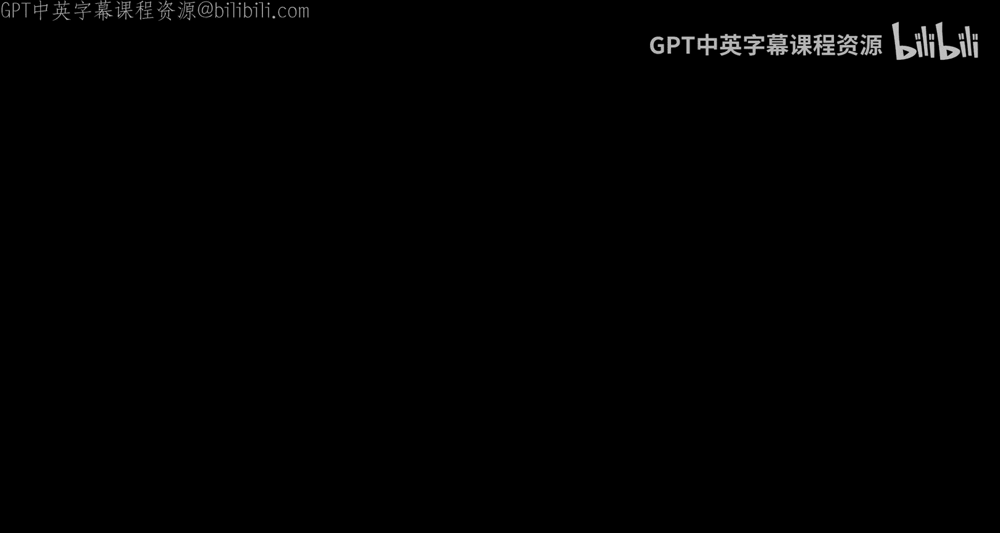
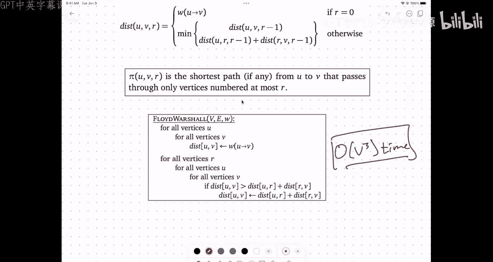

# UIUC《算法与计算模型｜UIUC CSECE 374 - Algorithms and Models of Computation 2023》中英字幕 p21 20231031-Oct 31_ Bellman-Ford again, all-pairs shortest paths.zh_en -BV1Mh7RzaEL2_p21-

。

。Hi everybody， thanks for raving the。The cold to come out to the lecture， this will be the last。

Lecture before midterm two。So I do want to spend took a few minutes talking about the exam before we go on to。

Actual content。No， I don't want things that big。So。Mter two is。呃。Next Monday。Which is November 6th。

From7 to 9 pm。嗯。The missionroom will cover all of the material in。Homeworks509。

And the parallel that problem assess and the labs and electors。So。Roughly。Speaking。

 I guess the list of topics。Splits into recursion and graphs。So recursion。There's divide and conquer。

Backtracking。And dynamic programming graphs， theirs。Tveral and variations like connectivity。嗯。

Tological sort。Strong components。And shortest passed us。So。

Basically the stuff that you've been doing in labs and homework that you've been seeing in lectures since midterm one ended。

 so we're not going to be calling back to any earlier material from mid term one that's a little getting them find exam。

 but not。So the usual thing。Just like。Reviews just like the term one。Thursday and Friday。

 instead of lectures and labs， there'll be review sessions。呃。Thursday afternoon， Saturday。

Sorry Thursday evening， Saturday afternoon and Monday morning they'll be。呃。

Because you could call them study parties instead of homework parties。

 just that the same ros behind and then having homework parties。

be there as a place for you to study with other students。

 but there will also be Ts and CAs wandering through the room to help。嗯。Saturday at 530。

Is another review session， this one run by Ada Kaappanu？UIn the the main EC E hall。

 at least kind believe main， this one will be more like the review set and the other one on Thursday and the Ts world will go。

The last on private so it helps them demonstrate， solve。

 walk through in front of the class or in friend the audience several exams the been offered the。

Yeah information everything is sponsor to the one。嗯。There will be two practice exams。

So one of them I will go through the on during the Earth reset， that exam is already on the website。

 the second practice exam should be up probably within a couple of hours after the class。

I've got to introduce anybody I send you a top of the answer booklet。

 I will post solutions for that on Saturday。There are lots of。Practice questions。

In the quote unquote midterm pe pot， there are a whole with practice identified on theer。

So there's a lot that we available again， just like last time we don't plan to publish。

Solutions for the problems to the exam plot， except for the ones that actually show up in the practice exams。

 just why we're giving the practice exam the same thing that I said last time about the practice problems。

Our intention is not that you solve every single problem。In the 2017 booklet。

 but rather the problems are divided out these categories based on this is comfort problem。

 that's a dynamic programming problem， this is the problem involving sort DAGs。

 this is the problem involving for those ads。Solve a few problems in each category to see how comfortable you are。

And if things are going pretty well in a given category or move on your。You're most likely ready。

But focus your enemies on the parts where you're struggling more。Again。

 I do strongly recommend you have the chance， especially for the practice exams。

T to take them under exam but was give here two hours in a quiet room。Nos that distract。

And see how far you can get on your own。Before the solution the reveal over say Saturday。嗯。

The locations。Or。On the course website。If your memory is good。

 you might notice that the set of roots is exactly the same as the term one。

 but every single person is in a different room than they origin or one。

Because I want to spread out the pain of medium。啊。They want to punish the one subset of students to always have to be in those horrible rooms so things are shuffled around。

 please don't go to the room you went to picture one。

 please go to the room you respond to on course does it's different。U。

There will be a conflict exam the day after the regular exam assignment in order today。

These filled out by the end of the week and in particular， if you don't。

 if you have conflicts either both immediately before and the evening after this class on next Tuesday。

 which we' being when we want to schedule move the conference exam。

 we filled this out as students you plan the buildings on Wednesday so we can start to figure out how to make all alternative arrangements。

U。If you have a dressre accommodation for additional time。

we recommend for low structure environments or other kinds of accommodations strongly recommend taking the exam testing accommodation center。

 but if you're in that situation， you can pull out your laptop right now and that the reservation to take the exam the rest all your or piece。

 and seriously when I take right now， don't wait until the end of the lecture。

 they really want the possible week a week so to do this。啊，啊。So if you haven't done there already。

Now's the time to do it。嗯。And on Thursday we'll see more about the structure of the exam。

 but it's fairly similar to the we saw。More actual content will be revealed over the next several days。

 but are there any logistical or administrative questions about how many interes？Yeah。嗯，我的运费你较报是下。嗯。

So there will be four open ended questions and one question that is more like to the precise format and so。

But I guess one other the things you say about this。

 I'm going trying to clear somewhere between 10 and 15 emission three requests per day。

 now that to do these annual clear， so it all goes well， all emission two three cut。

Rco should be cleared by Thursday。U at this point we're down to the reb request that I have to handle my sorrow rather than than letting the Ts use do it。

We've already handled， I think， something like 160 degree classes。啊。

So you guys are definitely taking advantage of that feature in grade scope there we are aware and painfully aware that there are long outstanding and re requests for open works before the number one great thought will not let us submit。

We will handle those by means there are a few people who submitted re requests by an email because rate closed request 9 pm on the deadline day instead of at 11 to 9 p。

m on the deadline day， my mistake I apologize for that if you said me email about re after that 9 deadline I did get for you haven't it seen response or change in it was it'll be in the comments down of audit since there will actually be a great requests to you。

If you haven't seen something by the end of the week， we send you your library。这没什么来。

Normally earth in the States， you know。It's a little bit less for what。Yes， is that that that。

This will include the first actual five minutes contact in。

W is there's this thing that' there path where you can be path from everything to everything else in the line of time。

And the rest of welfare， I was explain that but the content that you may need is the one line。

 this is the running time to solve this problem。这哪来那那。Nothing吗对。No exclusive。Other questions。O。So。

This is again， one more lecture about shores Pats。U。

So there have been a couple of questions on this order about the over size formulation of the problem。

' been a little bit fast and loose describing what the output of the shortest path problem is。Let me。

Be a little bit more specific。About this， so single。The single source shortest paths problem。

 the inputs。Is a graph。G equals the vertices and edges。

 it's natural to assume that this graph is directed。

 you can of course define sort of platforms over undirected graph。But in that case。

 at least in the absence of negative edges， the right thing to imagine is every undirected edge is really a pair of opposing direct edge。

So instead of to speaking an undirected edge between each two vertices and human B。

 you do have a directed edge from human B and you have another directed edge to be。

Think of those as separate edges。Edges have weights， so you have some sort of weight function。

That assigns a real number to every directed a。Which could be positive but be negative could be zero and often we kind of strap this to allow。

If there is。You know， that has wait positive anything is next remember when you。

path you may be to assume the edges up there， an edge that has a weight negative the confinity is an edge that you absolutely must traverse in any short path but kind of population so maybe better not to go there。

So just stick with real numbers。And a source。Vtex。S in as one of in B。嗯。The output。Is。嗯。For every。

Vertex。We compute two values。V dot disk is the length。Of the shortest path。Promise to be。

And V dot pred。Is the second to last。Vertex。On that shortest path。

So we compute distances and we compute preite。So the predecessors collectively defined a standing tree of the graph。

 assuming everything is reach from us。F spanry of the reachable roads there are unreachable vertices。

 meaning there is no problem fromness to be then the distance of being will be an anity and the private sector of being will be an all。

Okay， if b is equal to S， the distance to S is always a0 and the preiscessor of a s is always an L pointer。

But for every other it whos。its H other attack for has to be then。

The president both be glass and along that。Now， if at this point。

 I want to actually destruct the habit itself from be。

 I didnt do that by thought bytation and credits back the course。Soね single that part take all。

I'm sorry yes so so put put the first line as to take。In classな。今天。

Oh the sort of down here going forward that can fix possibly of that further else。

It's over so as the initialized access the approval sets all to be decade and you kind that all double。

I'm going to just be clear is matter of course policy unless the problem is specifically about connectivity。

You can assume grasp a the net。For purposes of time。Connected， not strong。

If's very the fear of how to give a that you strong effect that in number。哎。

You can assume that the number of edges is at most the of number of vertices is big than the number of edges。

I mean， the only time that the universities can really exceed the number ends by more that time amount is it。

Say a majority of diversity have。大的。So we just ignore them。

Okay so that's the output and then from that output we can drive things like what is the optimal path？

And you'll notice that if I say， compute。The actual score is passed from S to every other vertex。

writing down those paths explicitly might take you be square time。

If each of those paths might have a number of edges that werement。

 most of those paths might use most verities to graph。But nevertheless。

 dira runs nearly record search in linear time because it's only computing the distances in the train direction。

Not but all those patternss was yes。therere missing this right just parallel in the or there reason close。

So it's true that you can think of the predeceptor。

It's got another day for your parents in the manager。

But I want to emphasize the semantics of there they from SV。

 and we may the press of the black on that。Okay。And again， with all of these。

 with there's several different single shortest pack algorithms。😡，So if。Your graph is unweighted。

Then you can use Bret first search， which runs。In order V plus E or you know under the natural assumption that the graph is connected。

 this is ordering V time if the graph is a Dg， then no matter what the weights are。

 you can use depth for search or topological sort。And again。This is V plus E time。I have positive。

 actually， I guess I should say。嗯。诶。Non negative weights。Then I can use Stykesster's algorithm。

Dexter's algorithm runs in E log V， some sources。Point out that if I use a more complicated data structure for the underlying priority queue。

 I can actually improve the running times very slightly so that instead of having a log factor attached to the edges。

 I only have a log factor attached to the vertices。fine。

you can quote live of the repeats as the runningex。我十日。我は yes。Could you said that amount of。

It makes the problem trivial。现你吧还是等说。And at least be more others。The order B is orderner me。

But I just swallowed up that we're done under the going thing。And then for arbitrary things。

We have the Belmon Ford algorithm。Which runs in time v times Z and here's the development4 algorithm again in the form that you probably want to spend using in。

Again， emit SSP just sets all the initialized of all thisfin and whether an edge is tense。

 when you compare the distance value to the divers and the edge value between the way the edge putting them and if the distance value to be is obviously too big。

 then the edge is tense and relaxing it just means resetting to be and inting the。

You talked about this before。嗯。So the intuition you should have the thought going moving forward。

 I mean you can actually derive it from a dynamic programming formulation using this intuition but。

The right way to think about this。Is after eye iterations。Of the main。Loop。That's this one。The dist。

Is at most the link？Of the shortest。好。From。S to V with。At most eye edges。

So in every iteration of the algorithm， we're considering shortest paths that have one more edge or a maximum lower more energy。

 so literally by all had one them， then we combine all paths with。Sorry。

 with top link the sometimes follow at all versus two edges， then you find all versus three edges。

And since a simple path can't have more than v minus one edges， after v minus1 iterations。

 v dot this is the length of the sort path most v minus1 edges but at that point with most v minus1 edges is reliable。

 every path。系。And if you don't like dynamic programming。

 you can prove that this invariing holds by doing induction on eye。

 but the arguments essentially would be said。嗯。You know。

I want to mention briefly because I said I would do this in the first five minutes and those first five minutes are already gone。

But I do want to mention one。When variant， which is the all。Pairs。Shortest path problem。

So in this one， you're not given。A source for test。

Because you actually want short the link from the shortest path from any vertex to any other vertex。

So the output here。It is an array just。Indexed by the vertices。

But it's a two dimensional array where the disk of UV is the length。Of the shortest。

Haath from you to the。And as an artifact， you will also get a s two minutesal array。

So that tells you the second to last ver that on the short path from it you do。嗯。

This problem can be solved in the cubeE time using an algorithm called Floyd Warsshaaw。

Which I will show you。记得 about。30 minutes。That is as much as you need to know。

 I guess the other thing you could do to solve the healthcare your shortages path algorithm problem is run an appropriate single searchchar path algorithm of starting airport wordex。

就是。😊，For every resource run think it will worth。And you would get potentially different running times that might even be better than that word acute。

But you can always do it in order if you can。Okay like I said。

 I will come back to this so were going forward why do we why it's v minus break repeatating and v minus one times gain routineina and everything is relaxed。

So the area is how I run the main loop。By times。The distance values reflects the link out of all path to the most by evidenceness。

This is value over resource。So after to B minus one iterations。

Then I all add that those D minus one edges be about this in minus。

 but with that those p minus parameters every past。Otherwise I working or estimate how matter。Yeah。

 so for the。嗯。We supposed be？比较的。That's what we return like everything you look like about the returns to the pandemic and then if you wanted to July more information from that。

 so if you said I love the length of a month for path that as we do that and say that you can。Yeah。

You are going to be out balance。You might have to better about through sort of factory。

Any computer to you might forward。嗯。If you call Bel Ford be timess and get。

And time will be v squared E but V cube faster than v squared E。

 V cube isn in that faster than b squared E。Un the graph is really， really sparse。

 like if the graph is true， there's no different。But on most graphs you can imagine the number of edges is bigger than the number of vertices。

 but less than square the number of vertices。And in that case。

 v square E is somewhere strictly in between two。So them before run at every source is not going to use to as running forward。

Okay。嗯。So back to Belman Ford， I want to show you an alternate formulation of Belman Ford。You know。

 be them for again。呃。And this is。Basically， just to remind you that whatever you see I an hurry algorithm of them。

You can we practice that algorithm as a ga to algorithm。诶。

So can say I'm given my graph G and my weights W and my source S。I'm going to build。A dag。

G prime the B prime E prime。Using。A standard grant layering idea。So。V prime is going to be v times0。

1，2，3 up through v minus1。诶。😊，So I'm going to create copies of the se verses。U。An E prime。

Is going to be。Following， I'm going to have an edge from U comma I to v comma I plus one。

For every edge going from U to V。And every index I。Between zero and v minus one。嗯。Because every edge。

Goes from some I send my above one， the second half of the edge distributor。

 the sort ver distributor is going up， there's no way for this graph。So。

So we' going have to go through this first in layer three to average in layer four and that in layer five。

 and somehow have what its way back to the where free applied free by animal。

There was a question over here。Oh't know， I just I didn't see possible one I thought it was much last time。

Yeah， it needs to be less than because if I write less than I'm equal to。

 then this ver is not the fault。Yeah。If all and are positive can you talk diasra multiple times instead Lloydhell。

 shows what talking about？Right now we on about。不不不。看。Okay。啊。This is a dag。Because。

Second second component。Increases。Along every edge。系。😊。

Now let's think about what the structure of the graph is encoded in here。

 so if I take a walk in G that's say it starts at S and then goes to V1 and then goes to V2 and then goes。

Eventually to the Sebel。That's going to correspond to a path in G prime that goes from S0 to V11 to V22 and so on up through VLL。

Okay， so what the second part of my neural identifier does is that it gave me a way of remembering how many es you to get hear from this orance。

对。Now I need to give every one of these edges a weight。So I'm going to define。

The weight of the edge from Ui to V i plus one。To be equal to the original weight of the edge for you to be。

 I guess I should put a prime here。嗯。U。So this correspondence in fact， means that。哦哦。呃。

That walk in G has the same total weight as the corresponding have in G prime so I've got one to one correspondence between walks in G and paths in G prime up to a certain number of edges。

And that correspondence preserves the length or the total weight。

 the sum of the weights of the edges alone that half。So that means。

That if I'm looking for the shortest half。From。S to V in G。

This is going to corresponds to the shortest。啊啊。From。S zero to sum verts。

The form V comm L in G prime。If I wanted the shortest path in G from S could be used exactly L。

That would correspond to the shortest path of D prime from S0 to not tov。

 but since I don't know how many edges are in the shortest pack of advance，I try all possibilities。

So the way that now I can compute the shortest path from S to V and G is I construct this graph。

And then I run my single source shortest path algorithm for daAgs starting at the source of Retx S zero。

The fact that the graph has negative edges doesn't bother me because it's tagged。喂。😊，So。We can。

Compute。The distance from S to D and G。啊。Why。Running。The Dg。Shortest path algorithm。

From the source vertex S0 in G prime。That will compute a distance value for every vertex in each time。

 and then I stand through all ver the of something and take the solidce distance that I have on all of this。

Does that make sense as an out？I officially have the second parameter that。

Because I know that the pur form this happens when we have most email address。

And I put this later version of mycra and then I said， oh， that's a dad， I look to do facts。

When that dag algorithm the DAG algorithm takes v prime plus E prime time。

Where the prime E prime are the number of vertices and edges in this graph G prime that I've built。

 but how many of those vertices are there， how many of those edges are there， so if I go back here。

UmThe number of vertices in v prime is， well， let's just say order of v squared it's in fact exactly a v squared。

And。The number of edges in my new graph。Is。Order v times E。

Because for every edge in my original graph， I'm going to have to be minus1 copies with that DR。So。

The overall running time of this algorithm。😡，Is v squared plus V E？But this is equal to VE if。

G is connected。And remember， of course policy is unless you hear otherwise input graphs are connected。

They're just the right choice， so if you want to past more negative cycle。

We would have to change yes， if I wanted to test for negative cycles。

Then just like in this original formulational Bel forward。

 I have to do one more pass through the edges to see if anything is tense。

I could build one more layer to my dad。And then see if using that layer reduced any distances。Yes。

T kind of going from the start。every single。听个是。Well。

 the initialization phase handles the patient zero。

For zero by this theance to happen zero theance to anything else。Then the first get away to the loop。

 you were asking why so youre considering the pass with why。当是求这。Right。

 so those will give you all the things that are having for the next round things that are making both by another end。

啊，你说我你说。So if all of the edges have ways one and you end on the board。

 you behave at least the two really exactly what we at first。You said it's kind of wasting。

Is it's looking at edges that are already in the source believe。哦。So great。

 that's dynamic programming， but expressed in terms of daAGs instead of in terms of recurrences。

 but this sort of shows of general orness to the painting6 I use。

The dive veries of the DAg correspond to the in substanceance。

 the recurs to thought problems in my dynamic programminging algorithm。

 the edges in my bagg correspond in substance reverse person calls in my dynamic programming algorithm and doing that depth first search through the DAg corresponds to traverseate through the dependencies in some order that make sure that that I'm need there。

So there's a sense in which。Any DAg commercial algorithm is identical to the corresponding dining in the programming algorithm。

 obviously if you actually implement them using the natural data structures you would use for each formulation。

 you can get something different and it might be the case for some problems that one or the other of these would be slightly more efficient。

But in the worst case， you're going to get exactly the same running time。对。

A there any other questions about Bell Winfork， yes？好。对是还对。But was accident inside of the be already。

Yes。是。对。Yeah， no board is a single quarter quarter path。

The where value for itself is in situated with the graph， not an ag。

 but some of the editing in the graphator。This system。This is。

 I gave you a graph I didn't tell you anything else。Then no before。Yeah。特回家。你不有。

We built to see that oh we never known that was like time。We the。By the9X， Omin town only very。

 very explicit。To say either edge weights are non negative or edge weights could be negative。

So that or whatever thing correspond wants to add weight to you go up。So any on these identity。

 I will either say these values are not negative or these values be negative。You'm going have还 this。

对，才行，其实呢。好的。Exaceement。When it has negative events。Or rather。

 when you don't know the waste you never。You know all the weights are non negative in your OR？Yeah。

 this is。You said what you'。And speaking on di then like。

 would you explicitly say then no negative cycles？So again。

 I'll just stay up front if I don't say anything about my the disciples you pursue that doing exist。

Um if I say excited， then then you can， if I take my on into good cycles。

 you just have to remember that using on before you just have done in the same。YeahThank you。Yeah。

 that's correct， so even with negative metrics experts collapse。

At least the written vector that I on that book， use the written vector on P note。But that。

There version vector that staying back to the further review when theM could run in a much that could have been find that are loss in multi negative。

Yeah。对你。Yeah。这个这不起好的。Oh。Yeah so like I said， the left。

 the actual worst thing day of the back happens。Don state example I know at least isn't a tagg where everybody gets is naked。

 so there are no ps。Every is negative。And what you end up doing is。

The short path and the birth of the the last actually goes through every subsequent months。

Ofners very history the algorithm， so it's like a minor comfort。But runs into。on the board。

 it's sometimesC， but for that you actually doing what you're。 so the trigger for tax versus 6004 is。

If there's you know， reverse in the exam， it's not might negative vulnerable。

How many reveal the world if a significant number of evidence are negative？这识到。

If there's an negative cycle， then Governor Ford will detect it in that same gra time。

The Exp probe will eventually be have against the same but estimate and forward pace。Oh。Yes。

I things are horrible。啊。So DMS there is forhand for。

Be sure the how for NAs that I described in class that uses that ver top level sort intelligence。

And as long you say， this grant is a gag， so I think that these words just have to do that for research。

把国家。Yeah。We're computing all pairs for past， let's wait until we're talking about all peripheral paths before you're asking。

明確かピンな全部少し。I'm sorry。一。So for why is it order of b times Z， for this formulation of Belmond Ford。

 there's a four loop that repeats B B times and inside that there's a four loop that repeats e times。

 that's b times E。For this formulation of Bellllman Ford， for every edge in the original input graph。

 I have z minus1 copies of badge in the bag front， so the total number of hits in my bag is u and that dominates the running time that。

可以。不那再见。对。And。No。You have to analyze the number of edges。According to definition of guidanceness。

So the question was if I know that I'm inflating the neuroity bias urban factor。

 and I automatically to conclude that I'm inflating the bed just by exactly that same factor。Yeah。啊。

明的。No。We have to look at the definition of attendance and graphic。

And do the analysis that I couldn draw that up。好。All right。

Now let's talk about all pair shortest paths， you had a question。

You had a question about welfare shortage paths。The running times for。If L athlete are positive。对。

If all graduates are positive， then。And running bags for us little times， be faster。Pro out， yes。

You can't。Okay， so let me， let me first go back， you know。

 remember the definition of the all pair shortest path problem is I want for every pair of vertices the shortest path distance between that versus from one in vertex to the other。

So the obvious algorithm for doing this is for every vertex， I run a single sortchar path algorithm。

 which could be BFS if the underlying graph is way it could be DS。

 the underlying graph stack could be the underlying graph has not that way it could be done for。

So in particular， this algorithm。You know， you get the same pattern of running times。

So if I have unweighted。An unweighted graph。I'm running an algorithm again。

 assuming the graph is connected， one iteration of breadth for search takes me but one invocation of breadth search takes me order E time。

 so I'm learning E time this one through cortex， so this is my overall running time。If I have a Dg。

 again， I get order V if I have non negative。Wais。I get V E log V using biketra and in general。

At least at the moment， the most I can say is be squared。All right， so this is BFS。DFS。Dyiketra。

And Bman Ford。诶。So I briefly want to walk through a couple of different ways of thinking about the architectures path algorithms to sort of get beyond this obvious of using the plasma black。

对。In the case you have non negative weights， none of these are actually going to be running distra at every river that these three really are your correct choice for。

😡，When you have grasp satisfy these these historical religions？

It's just in the most general case where things get a bit more interesting。嗯。

So one way I could imagine solving this problem， I can't justify define the distance from U to V in terms of other distances。

I have to add another parameter there is avoid kind of recurarsive infinite loop。

 so one way to do this。😔，And really the one I'm going to follow for the next couple of slides。

 distance UL， this is the length。Of the shortest path。From。You to the energy with。At most L edges。

And if you think about this for a while using the same logic that we use4 as9。

 you did almost exactly the same recurrence， in fact。

 really it is the same recurrence except that I have this first of you which never changes in any of the recursive calls。

 that's why I didn't include it in the recurrence for developing down forward because it was always confident。

 but now we actually need to compute this for different rounds of view as well。So again。

 in the initialization part， the base case where L is zero， I can't use any edges。I either say， well。

 the distanceson from my vertex to itself is always zero I doing end this and this me one ver x any different vertex using O edges is infinity because there's no big from there that on that。

And in the domainma resive case。The choices are either I actually don't need all L edges。

 I could get away with just L minus one。So I just reduce the curve parameter and re prefer ask thecursion carry or。

I try all possibilities for the predecessor of the along that path。

 that's what I'm calling is note x， so I think the minimum over all incoming edges into V of the shortest path from u to x with at most L minus1 edges plus the weight of this last edge。

😡，And not surprisingly， if you turn this algorithm into dynamic programming and you do the same kind of surgery that you did for Belmond Ford。

 we basically just get spellman forwardd in part。😡。

Except maybe I'm leaving things by coming hell in the outer loop。

So here it is in you know completely spelled out， no hidden subroutines。

 no magical tense to relax or admit， it's like everything is completely spelled out here in 11 lines。

Again， I have a main loop over L， and then within that loop I have a double loop over over edges and vertices and then edges。

So the running time for this algorithm is going to be v times v times e。

And one way to say what it's doing is。嗯。In the health theory in the blue。

At the end of that iteration， I compute this one the path from every vertex and every other vertex got those be edges。

 so in the first iteration might get all one n short paths in the second iteration I did all two bed shortest pads and so on。

Okay， so no different。From what I got before by just putting Bel forward in the forward。

 but just doing things in a different order。But now the interesting thing is。

This is not the only recurnce that I can use。Once I allow possibility， you know。

 I'm not taking advantage of the。Changing where paths begin。

IThere's the possibility of breaking paths down in different ways， so instead of saying。😡，You know。

 here is a shortest path from U to V that uses that most L edges and having the recurrence basically be。

Let's ask about the last edge。Can you think of something that my。我是。Meat weather。ItOkay。

 so one thing that I could do。Is organize a different dynamic programming algorithm around this idea。

Where instead of guessing the last edge in the shortest path， I guess the first edge。

 and so I keep the target shorter path but I allow source。

This is identical to running belt board or versus the graph。就时间唔成万。系啊。It mean。

 you get slightly different details in the forms， but you release。

But there's a different way that I could bring out of the path of the notologists。Yeah。孩子。Yeah。

How about let's do this。So instead of the journey 8000 miles beginning to the single staff。

we walked 500 miles and we walked 50 more。Okay。Now， if you do this。😡，You get a different recurrence。

Now， instead of just looking at all of the neighbors of the or all of the in neighbors in the ocean looking to all the other neighbors of you。

 I say， well， let's pick。I don't know what ver going to be exactly halfway along this path。

 so I try all the possibilities to that and the work test。And then I say， oh， well。

 the first half of that half has to be the shortest path for you to x with the most L over two edges and the second half has to be the shortest path from x to V with most L over two edges if you're worried about the course can use round v minus1 up to the x power over two so it has all the power。

哎。Now， even without running writing down the iterative code for this。

U I've already given away the answer to this question， but what's the time for this algorithm？

You notice edges don't show up really in the resive part at all。

I would be a base paste there that if it's one edge it like let take the weight of that edge and I'm using this implicit base paste。

 the distance compute is about zero， I should probably go ahead and write that in。

You zero if u equals b， but we're never actually going to recur down to the U and me your different and L is zero case because you can't get to zero by dividing by twos。

That's why I needed I because that should be L。Why I needed El equals one is a base case。嗯。

Let's think now what the running time of this algorithm is and the way that we figure this out is back in envelope。

 we say how many burials？Up here on the white side of the equal sign now in terms of space。

If I really want to memorize this function， I need a three dimensional array。

I get away with this essentially by only being a constant number of two dimensional layers。

But really it's a three dimensional array。But I've got four variables。On the right， U， V， L and X。

So if I just count。Variables。It looks like I'm going to get order V to the fourth time。

 which is not that great。But there's some special about one of these variables。

Howm in difference values of L and I'm actually going to see when I'm on the subject。

Assuming that I started the power it。要知噶我话啲。So I think the reverseerssity and around of the power two。

 that guarantees that in every rever Paul that brand of that is power two。

 so I started with the power that between being be。Now look at powers left than that。

 the number of powers of twoness less than V is log V。All right， say but。L has only。

Log the different values。So in fact， the running time is v cubed log V。嗯。

which is is potentially better than what I got here， if the number of edges is v squared。

 then this algorithm runs in before fourth time， this algorithm beats it by almost a factor of V。

If I grind through the details of turning this into an in algorithm。

 the main loop now only goes lo times instead of v times。and。

Then I have two for loops over with UV and then inside where I'm evaluating that recurrence。

 I have an innermost for loop of intermediate versus status。Right， and so again， this is。

Log v times v times v times v is v cubed log v time。So same function。

 I just changed the recurrence that I would use to guarantee that wanted the parameterss。

Does't pay on all possible values， but only takes on values。

With this particular structure that there' hours two and that you a number if not stuff。一次。对。对。Yes。

After。Okay， so let's imagine a graph that has to be squared edges。Okay that4 one plus。

Takes the it the huge fun。F fored every sortt therefore being important。This is。包括自。嗯。

But I've promised you be cubed and that's not what I've given you so far。

 and the reason why it's not V cubed yet is I now need to change。

The parameter that's going down over time。And the way that William and Northfall and before them。

Roy and Planey did this。Is。To sort of recall that in a standard graph that is structure。

Theivever themselves are represented by indigers between one and。ConContuous range of dinners。

So at vertex 1， vertex2， vertex 3 up up through vertex capital V。U。

And now I'm going to exploit that the following bizarre way， so now I'm going to define。😡。

Distance from U to V and I'm going to name the third parameter or something different just to signal in your head that i'm doing something different with it but really it's the same it's another three parameter function where all three parameters are integer between one and V。

But this now is the length。Of the shortest。啊。From U to V。ho。呜。Vertices。Less that are equal to R。😡。

Okay， what on earth does that mean？So remember U， V and R are really。Integers。

so this is U and this is V。The constraint that I'm putting on the path。

Is the value of the largest label？That appears along the path anywhere except of the animals。Hey。

 so the idea is basically。Initially， R is going to be zero are not allowed to go through many interview persons。

Then in the next generation， I'm allowed to go through vertex 1， but I'm not allowed to go for。

In the next generationeration， I'm allowed to go through vertex1 and two。

 but I'm allowed for two and one， we about two， just one。

 but I'm not allowed to go through any accounts。Okay。

 so and instead of over time considering longer and longer paths。Over time。

 I'm going to consider pads that are permitted to use more and more intermediate stocks。哎。

And so if I look at the actual path。From U to the， where everything in between is at most are。

There are again two possibilities for this， one is that I don't go through this path doesn't go through vertex R。

😡，That's one possibility， say I want the shortest path you to be that most of vertices labeled less than six。

 okay， who's a path qualify？So that's the case over there and left， I just reduce hard。

The other possibility。Is it actually does go through bar？😡。

But then every vertex between you and R must be numbered less than R。

 because every urtex along this path is number the most sorry the of blankets。😡。

So this is at most R minus1， this is at most R minus one。

Now I don't know which of these two possibilities is the right one。

 maybe the short path from U ofB that goes through only vertices labeled at most are actually goes through the vertical and maybe doesn I two possibilities。

 the right one， so I have no choice but to try them both。😡，And so I end up。With this recurrence。

Describing that sorry， I'll pop this up。I get this recurrence。😡，Which is just saying， well。

 I don't know which of those two it is， but I'll take the shorter one。

And notice now there's only three variables on the left， UVNR and three are on the right UVNR。

 that's it。😡，There's no new variable being introduced on the right side of the recurrence。

 and so I get this running time。It's just three， four loops and relax。

But the three far loops have to be in exactly the right order。this gives you order VQ time。Which is。

Up to some logarithmic noise。The fastest algorithm for all pair shortage patternss in general cases that we know about。

It's a significant open problem actually， whether it's possible even in unweighted graphs to compute these v squared different for path distances and say V to the 2。

99999 times。And it's kind of beenmus to actually look at you know， the two algorithms。

 one that's based on。That's recursive bisection and one that's based on just building on just。

The intermediateverses in both of these I've got three nest for loops over the vertices。

 but in one of them， the intermediateverses are the outer loop and the other one。

 the intermediatediver of the inner loop and just that in the organ requires that rapidness with loger limit a layer。

So。If all that flew over over your head。The thing to remember is。This red box。

And that is as much as I want to say about Toto's paths。

I believe second B is one them on the back because they have the midterm。

 so I'll take it back from the outside that everybody in know least talk loud to。他的你给我。嗯。

See you on Thursday。

