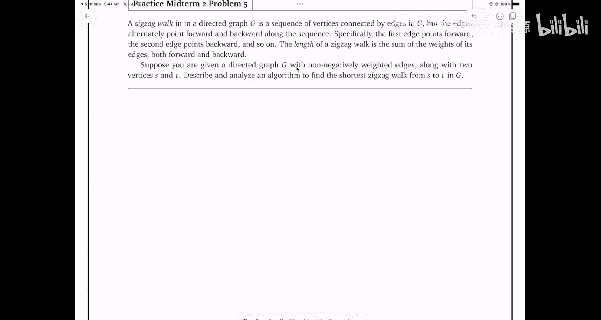

# UIUC《算法与计算模型｜UIUC CSECE 374 - Algorithms and Models of Computation 2023》中英字幕 p22 20231102-Nov 02_ Practice Midterm 2.zh_en -BV1Mh7RzaEL2_p22-

嗯。刚后才有这个。一保。我么。I。哦 thank应该。好。Yeah， yeah。 I went the。If you， if you're going save your life will by。

All right。Let's go ahead and get started。So thanks everybody for coming again。

 just to remind everybody， this is not a normal lecture。

 this is a review session for midterm two on Monday。So I'm going to walk through。

The exam the same way that I did for the review session for midterm one。

So the exam will follow the same protocol， there'll be a separate handout that will contain all five questions。

And then we'll give you。Five minutes or so to read through the entire question handout。

 then we'll pass out the separate answer booklets， which willll have space to actually write your answers。

And we learned from last time we're going to have extra scrap paper on the back。

And that's when you'll write your answers。啊。Just like midterm one。

 you have a double sided handwritten normal US letter paper， cheat sheets。

 two one sided cheat sheets is fine。啊。At the end of the lecture you're going to give us all the paper that you use。

 we'll have extra scratch paper， but we're going to really as much as possible encourage people to use the scratch paper in the back of the answer of look it first。

Because we're。we had some trouble， you took actually several iterations to track down everybody's the scratch paper that everybody used and handed in。

Things got a little bit。Wonky with the scanning。So as much as you can stick to the scratch paper in the answer book clip。

So let's walk through the。😡，The questions in the practice midterm。This is almost exactly the same。

As the midterm two from two years ago。Okay。So in the beginning there's a section of short answer questions。

 so part A solve， there's three recurrences to solve that all look identical except for the coefficients three。

 seven and four。There are a couple of questions that ask draw a directed acyclt graph with the most 10 vertices exactly one source and one sync more than one topological order。

 draw a directed graph with the most 10 vertices， distinct positive edge weights as more than one shortest path from some vertex S to some other vertext so just in the style of when you're thinking about designing your own graph algorithms and you want to come up with interesting examples to run your algorithms on。

There may be some to look for， just see if you can do that。And in part D。

 here's a dynamic programming recurrence that doesn't mean anything。

 describe an appropriate memorization structure and an evaluation order and give the resulting running time。

Question two。You and your eight year old cousin or nephew Elmo decided to play a simple card game at the beginning of the game。

 the cards are dealt in a long row， face up。Each card is worth some number of points。

 which could be positive negative or zero after all the cards are dealt。

 you and MO take turns removing either the leftmost card or the rightmost card until all the cards are gone。

At each turn， you can decide which of the two cards you want to pick。

And the winner of the game is the player that collects the most points by the time the game ends and all the cards are gone。

Elmo is only eight， he's never taken an algorithms class。

 so he just follows the obvious greedy strategy there are two cards。

 one of them has more points than the other， take that one。Um I。

Your task is to find a strategy that will beat Elmo whenever possible。

 so you want to actually find a strategy that maximizes the number of points that you could win Elmo hates it when grownups patronize him and let him win so you actually want to do this for real even though he's only eight。

Part A proved that you should not use the same greedy strategy as I'll know。

 so this is asking specifically to show that there is an instance of Elmo's card game that you can win。

 but you can only win by not following the greedy strategy。And then part B。

 describe and analyze an algorithm to determine given the initial sequence of cards。

 the maximum number of points that you can collect playing against Elmo。Question three。

Suppose you're given a directed graph whose vertices are either red， green or blue。

 edges do not have weights， G is not necessarily a dag。

The remoteness of a vertex is the maximum of three shortest past lengths。

The length of the shortest path to v from the closest red vertex。

 the shortest path from V to the closest blue vertex。

 the shortest path to V from the closest green vertex。In particular。

 if V is not reachable from vertices of all three colors， then V is infinitely remote。😡。

Describe and analyze an algorithm defined find a vertex G， a vertex of G。With minimum remoteness。嗯。

Question four。You're given an array of integers such that the sum of any two adjacent integers is even only for one index I。

 only in one position， or equivalently the numbers in the array alternate between even and odd except at one place where you have either two even numbers in a row where you have two odd numbers in a row。

😡，And then the describe and analyze algorithm to find the unique index I such that a sub and a sub plus one。

I have it even some。So given this example array， you should return the index six because。😡，One， two。

 three， four， five， six because these two integers have the same parity。All the if you look closely。

 you can see all the cells that are shaded in blue or even and all the cells that are not shaded broad。

Last question。A zigzag walk in a directed graph is a sequence of vertices connected by edges。

 but the edges alternately point forward and backward。

 so a walk is an alternate is vertex follow the edge to another vertex。

 follow the edge to another vertex， all the edges pointing in the same direction。😡，A zigzag walk。

 the edges alternate directions， so the first edge points forward。

 the second edge points backward and so forth。😡，The length of his exact walk is the sum of the weights of its edges。

 both forward and backward。For example， here's a graph and highlighted in the graph is a particular is Zg walk from A to E。

 so I go forward to B backward to D， forward F， backward to C forward to E。The question asks。

Given a directed graph with non negatively weighted edges。😡。

And two vertices S& T find the shortest zigzag walk。From S to C in this graph。诶。

Those are the questions。Does anybody have any questions about the questions？

Anything that you think needs to be clarified when we go through them individually i'm happy to take questions again。

 but for now is everybody。Comfortable with what each of these problems is asking for。Yes。不认。嗯。Yeah。对。

两。哎。Useance。I guess。So I was going to ask that eventually you would have to take。

A card that has the highest value。So at some point。

There might only be one card on the table and if it's your turn， you have to take it。So in that case。

 then that ends the game。That is， in fact following the greedy strategy。

So because you've taken the largest card that you can on your turn。

 so we're looking for an example where at some point you have two cards and you choose to take the one with smaller value。

You must at some point have a choice and you take the non ingredient choice from that。Yes。对我。Or。诶。

I'm not sure I understand the question， how does the proving work？Here is the example。

 if I follow the greedy strategy， I'd make this many points， if I don't follow the greedy strategy。

 I'd get that many points， that many is bigger than this many。s。What could it this。

Enough information to convince me that you're correct。In other words， a proof。Other questions？Okay。

 so we've got five things generally speaking， I recommend。

Figuring out which one of these you think you can make progress on the most quickly。

So we've got these short answer things。We've got Elma's card game。

We've got remote vertices in a graph with colors。We've got this parody thing。

And we've got this zigzagawt question。啊。What do people want to do first？3。Okay。

So before I start working on this， let me write my name。Here， in fact。

 let me make sure that I write my name。Okay。Question three。Suppose I have a directed graph。

Some vertices are red， some vertices are whose vertices are either red， green or blue。

 so all vertices have a color。Reoteness is defined as the maximum of three shortest path lengths。

Find the vertex with minimum remoteness。Okay。So I think the way that I want to approach this。Is。

Let me see if I can compute the remoteness of every vertex。Because whatever I'm doing。

 I'm going to be spending time proportional， at least to the number of vertices。

 so if I can find the remoteness of every vertex， then in order of V time I can just scan through the vertices and find one whose remoteness is minimal。

😡，Okay， so I'm going to find。The remoteness。Of。Every。Vortex。No。One thing to notice about the way。

The problem is phrased here。UI。I'm looking for the length of a shortest path。

To the from the closest red vertex， not from the to the closest red vertex。😡。

So I need to compute shortest pads from the red things to everything else。

 from the green things to everything else， from the blue things to everything else。😡，ok。All right。U。

So I。I think。嗯。The way one way that I could do this。Is I could run diyextra from every red vertex。

And then that gives me for every vertex I get the shortest path from each red vertex and I take the minimum of those shortest path distances。

 so one thing one possibility here。😡，So one possibility。

Is to run an old pair shortest path algorithm。And then。For each vertex。

 I would loop over all the red vertices， find the minimum distance， loop over all the blue vertices。

 find the minimum distance， loop over all the green vertices， find the minimum distance。

All pair shortest paths。Um。Let's see。Vertices do not have weight， edge just don't have weights。

So this is BFs times V， so this is going to give me。Something that runs in like V time。Um。

And I need to write out some more details， I'm just sort of sketching out an idea here。

 but something tells me I might be able to do a little bit better than that， yes。

And reverse the edges。So yeah， I could compute a reversal of the graph。

 I could reverse all the edges that's straightforward to do in linear time。😡。

And then I could compute。😡，Shortest pass from V to everything else， take the minimum red distance。

 the minimum blue distance and the minimum green distance。

 and again that would give me the remoteness of V。But then I need to do that for every vertex v。😡。

So that's still effectively in all pair's shortest path computation。

So that isn't actually saving me any time。How did you do without reval in the same amount time？

I compute the shortest path from every vertex to every other vertex。And then for reach V。

 I compute minimum overall red vertices R distance from R to V。😡，Instead of in the reversal。

 minimum over all red vertices are distance to R。嗯。嗯。I'm just trans reversing the array， sorry。

 reversing the graph is the same as taking like the distance matrix and just transposing it。U。

But I think I might be able to do a little bit better than that， so I'm going to。

 fortunately I brought colored pens to my exam。So。I to imagine。

 all the vertices here are either going to be red or green or blue。So。I want to compute。Dance is。

看 of。I'm not really interested in the individual distances from individual red vertices to other things。

 so you know maybe I don't know here's them for text V sitting over here in the green stuff。

 I don't actually care about the distances between each individual thing in R and V。

 I really only want the closest thing in R to V。So。What I think I might do here。Is add。A red source。

I'll call R。With edges。To everything in R。Capital R。And then ask。

What's the shortest path distance from little R to V？Right， so if I ask。All。

 what's the shortest path from little R？To。V。Um， that's going to include the shortest path from some red vertex to V to just chop off the first edge。

Hey。So I think a better idea。Is add？Vertices。Little R little G little B。

 so I'll add a little green vertex here and I'll add a little blue vertex here。Um。

I'll add edges from R to V。For all red vertices V。B to V for all blue vertices V and G to V for all green vertices V。

Now I need to compute。Right， so so the minimum。Distance。From overall red vertices。This is。

The same as the distance from R to v minus1。Okay， so and I can compute this。Or。All the with。1。

Brereadth for search。要是。Yes。It he is already， it V free。Then if V is green。

 then it' minimum distance from a green verex is zero。

Which lot of the remoteness is defined as the maximum of these three distances。All right， so okay。

 so I have three Bss from。R， G and B， and then I'll define the remoteness。

Of V is now equal to the max of。Distance from R to V。Distance from B to B。Distance from G to V。

So for all V， I get this， this part takes me order v plus E time。This part takes me order V time。

So the overall running time of my algorithm。Is。V plus。

The number of edges that I added when I computed augmented the graph is I added three vertices and I added a total of V edges。

 so the number of vertices in the augmented graph is big O of the number of vertices in the original graph。

 and the number of edges in the augmented graph is big O of v plus E in terms of the original graph。

😡，mSom not I'm not cheating here with the working teams。Yes。

How the overall running time only O was even do for all remoteness。But that's a for loop。

For all vertices set remoteness of V to the maximum of three scalar quantities that I've already computed。

No， I compute three， I compute all the distances from little R little G little B by running breadth for search from R breadth first search from a G breadth for search from B that takes me three times order v plus e time now every vertex is labeled with a red distance of blue distance and a green ver distance。

😡，At that point， for every vertex， I take the maximum of those three distances that takes constant time。

系 you见度啊。I pre computeute three numbers for every vertex。

And then by brute force compared the three numbers at every urtex。Yes。

So just picture sure Im understanding。Correct， we say an over all minimum。He was an R。

 that's the minimum distance from a red verticity or a red vertex to B， right， yeah。

So I basically nominate I create a special Sinel text that represents all red things。

 and I compute shortest distances from that because I know the first step is going to go to any one of the red vertices。

Okay questions about this？Yeah。So general1，4 PM。I only see three。

So the one that I've written up there， so just to make this clear。UFrom little R。

And then I do this again for little G， and I do this again for little B。Yeah的。

So all that information needs to be there。But it doesn't necessarily have to be in the form of that bullet list。

 so you'll notice here。At this point， I've described what the vertices of my modified graph are。

At this point， I've described what the edges of my modified graph are。So the information is there。

I can locate it， but the bullet point formatting is helpful and it may be helpful for you to write it down that way to help you organize your thoughts。

 but we're not going to require that specific formatting on the exam。

I think there was another question even further back。Or not。I'm sorry， could you speak up， please？

Yeah， what I have written here。I worth 10 points。I've described a modified graph。

 I've described what I'm computing and described how I compute it。I gave the running time。Yes。No。

 I compute using B for search， remember Bre first search computes minimum distance from the source vertex to every other vertex。

Having done that， distance R2V is stored at vertex V。哦，还行。Single source。Yeah。

 this is the way shortest path algorithms work。Yes。that's exactly right。

 so the minus one in that formula there takes into account the edge that I added from the newu vertex R into the red group。

Yes。Yeah， that's right。Yeah。不。这个。So order VE would be worth partial credit because it's correct。

But it would not be worth full credit because there's a faster algorithm。

So if you did this using all pair short paths instead of three single source short paths。

 I don't remember。How much partial credit we gave for that？嗯。

I think it was like on the order of six or seven points。Yes。But。yeah， you're right right。

 so just just general rule for graph algorithms， you're allowed to say I'm going to store this value at each vertex。

😡，Was you know， if you're given a standard graph data structure that what that means is you're building parallel arrays to store those things if you're given a pointer based data structure and you say。

 okay， make the records a little bit longer。So that's completely fine。Yeah， I mean， I didn't， I mean。

 I could have said Bill G prime by modifying G as follows and say the ver， you know。

 V prime equals v union little or little G little B， but I think this is sufficiently clear。

Especially in an exam setting。Okay， we should look at one of the other problems。嗯。Short answer stuff。

U Ellmo。A。Or it's fixig。不。Or I'm hearing more noise for four。What comes after four？Yeah。

mI'm hearing a few more ones， so let' do let's make some progress on four。

And then let's go back to one。Okay。嗯。Okay， so。We have。An array。

Just to remind myself what the problem looks like。There's even odd， even odd， even odd， even odd。

 odd， even odd， even odd， something like this is a typical example。

 and I am looking for the position where have two things with the same parody in a row。Okay。

First thing。I can clearly do this by brute force in linear time。Um。That will get a few points， but。

You might have already guessed that that's not the solution we're looking for。So。

Let's see if we can be a little bit better than that。嗯。So。嗯。Okay。

 I'm going to imagine that the pair that has the same parity is somewhere in the middle of the array。

 not at one end or the other， I can check AI is A1 plus A2 even is AN plus n minus1 even。

 so I'm not going to worry about things near the ends。And。I'm going to also。

Assume without loss of generality that a1 is even otherwise， I'm going to just say flip。Even an odd。

Throughout the algorithm。系。嗯。So。I wanted to do better than linear time I want to somehow not have to look at every。

Element of the array， so that suggests that I should be able to get some information about the thing that I'm looking for by looking at only a few elements of the array。

U。So。The what？We've seen a style of algorithm that has this kind of property where I look at a small bit of the array。

Do a constant amount of work。And then I can somehow make substantial progress towards my answer。

Anybody think of an algorithm that smells like that？Yeah。Bionary search。Okay， interesting。

 so maybe what I should be doing。Is。嗯。Let me look at。Say one element in the middle of the array。

And ask， is it possible to tell just by looking at this one element？

Whether the repeated pair is further to the left or further to the right。诶。😊，Yeah。啊来对。

First athlete say what us that the course were given or all in different places。Okay。

 so I can look at the parity of that element。And I can look at the parity of the array index。😡。

So I said， you know without loss of generality， element one is even。

 I' here I am now looking at element seven in the array。😡，And I see something that's even。

So I had the same pary as1， and the element had the same parodity as a of 1。

That means that I've kept with the alternating pattern up through one through seven。

 so the repeating pair of two adjacent elements where the pattern is broken must be further to the right。

😡，喂。嗯。So this means that now I can recurse， I don't know。

 maybe I can recurse and I'll keep that element around just to give me a buffer to avoid edge cases and now I'll look further down now again I've got a smaller array the first element in that smaller array is even。

So if I look at the smaller rate down， this is indexed。This is the playing the role of index one。

 and I looked at the middle element of this sub position four。And now I see。

That I have an even index， but I also have an even element。Whereas the thing that I saw before。

 I had an odd index in an even element。So something has changed about the parity between that red box and that green box。

So I know that my repeating pair has to be in between those two。嗯。

So this sort of suggests that I should do something like the following， you know。

 I'm going to start writing out binary search。So while high minus low is bigger than five because。

I'm a little worried about boundary cases。So。Let me give myself a bit of a room to work。嗯。

So I'm going to say mid is。High plus low over two， I don't know ceiling floor。

 I don't really want to think about that， so I'll just say floor。嗯。If。Mid plus a mid。

Is congruent to low plus a low？Mud too。This is the condition that the parity pattern hasn't。

Chaanged between low and mid。Then in that case， I'll set low to be equal to mid。Um elselse。诶。Well。

 I guess I'll set high to be equal to mid。And maybe just to give myself some go some room to avoid boundary cases。

 I'll give myself a little bit of splash。And then in the end， I'll search my array from low to high。

By brute For。This this step is only going to take the order one time because high and low differ by less than equal to five。

嗯。It's five enough。Okay， fine， let's be safe。嗯。and in fact， I don't need。

 I didn't actually ever need to assume that A1 is even， this seems to work even if A1 is odd。

 so I didn't need to assume this。m，And yeah， its your research。

The running time for this algorithm is log n。And I appeared to be done。Yes。I'm sorry。Yeah， yeah。

 of course， you could write this recursively instead of iter that's completely fine。Yeah。

 when setting though and I didt round through nearest。Here smoke too。喂hy。M c诶。

if condition is satisfied what that actually means， I mean。

 I know by the induction hypothesis that the parity pattern hasn't been broken between one and low。

So in fact， I could change this， maybe this would make what you're thinking a little bit more comfortable。

嗯。Just write it like that。So this is saying， does the regular alternating pattern last from one up to at least mid？

If there are no violations up to less than or equal to mid。

 then that condition will hold and if that condition breaks。

 that means the single violation has to happen before mid。Yes。Oh， well， I mean。

 what happens if say instead of index seven， index six was the middle？

So what I'm doing is I'm summing up the index and the value。And for both index6 odd and index7 even。

 the sum of the index and the value is odd， which matches one plus even at the beginning of the array。

So I could break this down into several cases if I'm at an even index and I see even value。

 if I an even index and I seen an odd value， but an odd index see an even value。

 an odd index an odd value， the A1 is even if A1 is odd and write out the cases。But in this case。

 I can actually express the condition I want in just one line。Yeah。You know。

 the pattern I'm looking for isn't just at one spot， it's a little spread out。

And I worry a little bit about somehow breaking the array between the two。

Things that that have the same parity， so just to be on the same side。

 I'm just going to expand the array a little bit before I recur。

I don't actually know offhand whether that's necessary or not。

But it makes me feel safer and you know， if I imagine putting the red thing on top of that first， oh。

 maybe recur on the left， okay， great， if I put it on the second oh， maybe recur on the left， yeah。

 it seems to be okay。It doesn't do any damage， so fine。I actually don't think it's necessary。

 but it doesn't hurt。Yeah。Okay。So。The indices always alternate between even and index， one， two。

 three， four， five， six that's odd， even odd， even odd， even odd， even odd， even odd， even。Okay。

 so I'm looking for a place where the values。Although even odd， even odd， even odd， odd。

 even you there's a repetition。ThatWhen that repetition happens。

 the sum of index value is going to switch。From always being even to always being odd。

Or from always being odd to always being even。And so I'm really looking for the index I where that changed from all even to all odd happens。

And so the if line is saying。Is index plus value at position mid？

Does that have the same parity as index plus value at position one？If if it is。

 that means that scch hasn't happened in the prefix from one to mid。

 it's happened in the suffix from mid to N。So I should recurarse on the right。Technically。

 I'm not assuming that I have already proved it in earlier iterations。So what the the。

There's an invariant here。Which is if I want to think about this in terms of recursive calls。

When I recursively search a subet， the breakpoint is in that subet。

So there are no switches above high and there are no switches below low。

switchitch had strictly between low and high。Yes。I'm sorry， could you repeat the question？W。嗯。

Let me look at the problem statement。I do not see the word prove。

 I do not see the word justify as so no。When we want you to prove something。

 we'll use the word proof in big bold letters。Otherwise， you just write down。The algorithm。All right。

I think。1。Next。Everybody okay with。Brief。Appropriately this is oh no， this is for okay。

 I was about to say appropriately this is the question exactly in the middle of the exam that would have been a hint except it isn't true。

 okay。嗯。Let's try number one okay so we've got a bunch of recurrences here I think hopefully these should be relatively easy to knock out using the recurst tree method that we used。

Early on you've had a little bit of practice with with Prairie learn so the idea is I'm going to build a tree that represents A of N and I'm going to put the non recursive part of the formula in the root。

 then I'm going to have three children because I've got three recursive subproblem and each of those children is going to be。

The root of a acursion tree for A of N over two。So the value that I write at the root of the recursion treey for A of n over two is the same function of the problem size。

 so this is n over two squared I'm going to write that three times and squared over four and squared over four and then I'll have you know each of these will have three more children。

😡，That are the roots of recursion trees for A of N over four。Those， I'll write。

 you know n over four squared， and this will be you know nine times。

I'm not going to bother to draw everything out。And then again。

 thankfully I brought multiple colored pens to the exam， this row adds up to n squared。

 this row adds up to three fourths n squared， this row adds up to nine times n squared over 16。啊。

And so it looks like I have a descending geometric series。

 every level is three quarters the level above it。So only the root matters。Yes。Oh yeah。

 you can bring yes， you're allowed to bring color， I would strongly recommend colored pens。

Not pencils。If you do bring you do decide to write your exam with a pencil。

 please use a number two pencil or if you're from Europe or Japan， an HB pencil or a B pencil。

 not like an H3 pencil。The marking should be dark enough that when you take out your camera and you take a picture of your exam。

 you can still read it。Not that we're going to ask you to take your camera out and take a picture of it during the exam。

 but we had to rescan several exams and even then it there was a little squinting involved because the pencil markings were really。

 really light。This is especially true if you write small。Um， strongly recommend recommend if you。

 if you're， at least if you're comfortable with it， use a pen。

 it is possible to guide pens that are erasable。recommendd using those if you can。Okay。

 so for Vi then， I have the same idea， fortunately I brought a lasso to my exam。Um， so， I I I write。

 you know， B of n again， I'm going to write n squared here， two3，4，5，67。呃。

I'm going to have seven children， each of which is going to have n squared over four and each of these is also going to have seven children。

 each of which is going to say n squared over 16 so if I sum up this way n squared。

7 n squared over four。And7 times7 is 49 n squared over 16。

 Now I seem to have an ascending geometric series， which means the only term that matters is the one at the bottom。

Now there are a couple of ways that I could I can think about this。

 but one is I could say well at a certain level L here's the formula for the total work。

 but I can also remember that the amount of non the value at any leaf in this tree is a constant so really all I need to figure out is the number of leaves。

Well。The number of wes is going to be。啊。Well， seven to the depth of the treaty。

And the depth of the tree， well， I'm dividing the problem size by two at every level。

I think this is B of N， B of N over two。B event over4。

So the depth of my tree is going to be log based2 of n。

 which by the magic of logs and the formula that I remembered to write on my cheat sheet。

I get n to the log base two of seven that comes out to end of the 2。8 ish。Um。

So anyone want to guess what C's going to be？Yeah。N squared log in why？

We've seen the case of recursion trees where I have a descending descending geometric series。

 we've seen the ascending geometric series， the only case we haven't seen yet is every level's the same and that actually turns out to be what happens so I'll write again n squared and then I'll have four four things that have n squared over four and then each of those has four things n squared。

Over 16， so every level of the recursion tree。Gives me unsquared。So it's n squared times the depth。

 but we already figured out that the depth is a log base2 of n， so this is n squared log n。Yes。Some。

Fel have experience falling the God。The geometric series formula is。Big O largest term。

don'This is an algorithms class， why would we need an exact for？Right， no， yes。

 you just need to know the biggest term。嗯。Okay， draw a directed acyclic graph with at most 10 vertices。

 this is just to keep you from drawing like huge amounts of stuff。One source。

 one sink and more than one topological order， so I'm going to draw my source。

 I'm going to draw my sink， the source has stuff coming out of it the sink still has stuff coming into it and I need to have more than one topological order。

So I can't have any more vertices that are dead ends going left to right because dead ends are sinks。

 I can't have any more dead ends going right to left because dead ends like that are sources。

 every other vertex has to be on the way from S to T。So。Any idea what I should do？Yeah。あ是。没用。

So if I call these vertices A and B， there are two topological orders， S BT and SBAT。😡，Okay。

Direct your graph with at most 10 vertices with distinct positive edge weights that is more than one shortest path from subvertex S to subvertex T。

Any ideas， yeah， all the way in the back。Yeah。So when you say edgeway A。

 can you make that more concrete？And。What should I put from S2 be？好。

Same graph just put weights on it， perfect。Yes。It says distinct oh yeah， it says distinct。

 I need distinct that weights so that't doesn't work so don know nine and six。Okay。U。

Describe an appropriate memorization structure and evaluation order for this recurrence， okay？U。

I've got two。U argumentsrguments that appear to be integers because I'm computing hub from one to n。

That means my second integer going to show is going to be somewhere between looks like it's going to be somewhere between zero and n。

And。Similarly， the first integer appears it's going to be somewhere between one and n。

So what sort of data structure should I use？不么。2D array。I this way， came that way。嗯。

What kind of imization order should I use well， if I look at a particular square IK。

It's potentially going to depend。On。The squared I minus1 and k minus2。

Which is in the next row and two columns over。Or。I plus 2 k minus1。

 which is that two rows down and one column back。Or i plus1 k minus2 that's the same thing again i plus 2 k minus1 that's the same thing again。

 so I need to make those red squares show up in my evaluation order before this square I've outlined in black。

So what kind of evaluation or can I use that will do that？没有。Re by row。From the bottom。So again。

 the convention is that the double line arrow represents the outer loop and the single arrows represent the inner loop。

 and it actually turns out it doesn't matter what the inner loop here is if you have an outer loop that goes by decreasing eye。

I could have also written4I in decreasing order。And then 4 k in whatever order。

What's the final running time？Thank you。N squared。Yeah what happens when。I am manage to one and。

He is。one。嗯哼，不 then。嗯They depend。Those that outside the memorization array。

 and it's not zero the zero case。😊，So I clearly need to start indexing at zero instead of。1。

So Kain needs to go from zero to n。Not from one to n and probably I needs to get from zero to n two just to be safe。

And okay。Or maybe I should index starting at negative one。Just to be really safe。Yeah。This picture。

This is sufficient what I wrote in fact。Sorry， let me be clear。嗯。This。Is sufficient。

And the n squared。You don't need to write both the arrows and the for loops， one or the other。Yeah。

系有。Like I is the wrong past the column。 So we feel the array from bottom to up and from left to side。

So you do need to be a little bit careful。To when you say from bottom to top and from left to right。

 you're not specifying which is the inner loop and which is the outer loop。So to be concrete。To say。

Fill the rows from bottom to top in the outer loop。

Fill each row from left to right in the inter loop。In this case， it doesn't actually matter。

 but we want to see something concrete。Right， so I want to make so what the red and white squares there indicate is when I need to fill in the white square。

 what other values in the array already have to be there。So that。

The red squares were already defined before the white square。

But then I need to choose an evaluation order that makes sure that always happens。Yeah。You're fine。

 you're fine， you're fine。Yeah。the bigger the arrow， the further out the loop。

IsSo if you add a three dimensional array， there'd be a triple arrow going this way and a double arrow going this way and this single arrow coming out of the page。

That tells me the order of the three Philips。我个。So when I am filling in row eye。

No matter whether I'm filling row I from left to right or right to left。

The values that this square depends on are all in later rows。

I don't have any dependence within a row。So regardless of way'， which order I'm evaluating row I。

 when I get to this column K， these two squares have already been evaluated because they're in earlier rows。

Earlier iterations of the outer loop。That's correct。

 so you could do for k in increasing order in the outer loop and for I in whatever order in the inner loop。

 that would also be correct。😡，You could also go diagonally。

So you go along each diagonal in whatever order you want in the inner loops and in the outer loop。

 you sweep diagonals from lower left to top right。Any any of these is fine。Yeah。Yeah。

 if you've written。For I decreasing for K decreasing， fine。What credit。嗯。So again。

The picture by itself and the running time is full credit。

A box or the words 2D array and these two four loop lines and the running time is full credit。Um。

Technically， the box and the four loops are inconsistent because I've specified an order for k。

 but yeah， whatever。We're not going to pick up things like that。Yeah。有。Yes。

 double arrows always indicate the outer loop， single arrows always indicate the inner loop。

All right。So we've got two problems left。One about Elmo and one about zigzag paths。Okay。

 everybody up front wants to do five， do people in the back have an opinion？

Do people in the back have an opinion they want to advocate for themselves？6。Six。All right。

Let's see too。It's been a while since we've seen dynamic programming。

 so hopefully that didn't give anything away。嗯。There had to be a dynamic programming algorithm somewhere on this an exam and the other one doesn't look like it it' probably the one。

So the first thing I need to do is。So remember the way the game works， I've got a line of cards。

 each with the number on them， everybody can see all the numbers。Um。

 Blow starts by picking either the left card or the right card and because he's eight。

 he's always going to pick the one that's higher。Then it's my turn。

 I pick the card that's either on the left at the right。

Then Elma picks whichever card on the left to right， whichever is higher and so on。

 and I want to prove that the greedy strategy is not the strategy that I should follow but coming up with an example where I can win。

 but I can only win if I don't follow the greedy strategy。系。嗯。So。呃。

Here'Here's kind of what I'm thinking， so I'm going to say there's a card labeled infinity。

 whoever gets this card wins。😡，RightI'm just going to short circuit。

 there's a card that has Googleplex on it。I'm simplifying the game by making sure that whoever has this one single card absolutely will win the game。

And I want to set things up so that I get that card。So I need to lay a trap for Elmo。

I need to have a card on one side of the infinity that has a larger value and another card on the other side that has a smaller value。

That will say Elmo sees this and maybe there's other cards in the middle。If Elmo sees this setup。

 he's going to take the five。Which will allow me to win。ok。

But I need to get into this situation by not following the greedy strategy。

So I'm going to put another card here。Um。啊。And I need to make sure that if I did follow the greedy strategy。

 that Elma wouldn't die so。I think probably the right thing to do。Is this？And then finally。

 Elmo' is going to move first。So I want Elmo to leave this position。

 so I'll put a card here like that and it doesn't matter what this card is。ok。😊。

So if everybody's greedy。Elmo takes the 10， then I take。

The two and then Elmo takes the five oh sorry， no， that's not the degree strategy。嗯。I take the three。

And then Elmo would take the six。And now I'm left with zero infinity 5，2。嗯。I would take the two。

 that's not good。I want to be tricked into taking following the greedy strategy as well。

 so I think I need to make this a four because in this case I would take the four and Elma would take the infinity。

But a better solution。Is Elmo takes the 10， I take the two， Elmo takes the five。

 and then I get the infinity。I'm sure if I spent more time thinking about it。

 I could make that example shorter， but that's the basic idea。会建的。二。Yeah。

 I think there's a way to do it with only five。Fine。sort all kinds of community。要。这方。

You want to alternate between positive and negative。Okay， let's。Let's see if this works。So let's。

Do the greedy strategy， Elma moves first。And following the greedy strategy， I would move here。

And then Elmo would move first and then following the greedity strategy I would move here and Elmo would move here and then I would move here and then Elmo would move here。

 I would move here and then finally Elmo takes that so I win massively。

By following the greedy strategy。是个一个。No， the game says the rule says you can win。

 but only if you do not follow the greedy stretch。Only if you don't follow the greeting strategy。系。

So。This isn't going to work because the greedy strategy wins。

I need something of the greedy strategy loses， but I could still win using something else。Yeah。

 can you just do the same， but change the par so that。By adding a card。Possibly。

 but given that there's only four minutes left。To finish， I want to move on to Part B。

So we're making decisions from both ends of the pile of cards about whether to take the card or not and Elmo' is going to take cards or not。

 so in the middle of the game the shape of the subproblem I need to think about is an interval of cards starting at some index I and ending at some index J so I'm going to say that max points of IJ is。

😡，The maximum。Number of points。I can earn。R。Cards。I through J F Elmo。Goes。First。喺。So。Max points of。

I J。I'm going to follow my usual recommended strategy and say。

 let's think about the most general case first and worry about the basic cases after。Okay。

 so Elmo is going to move first and Elmo's choices of what he's going to do is always going to depend on whether the card on the left is smaller than the card on the right end or if the card on the right end is bigger than the card on the left end。

Okay。If the card on the left and is bigger than what I'm left with。Is cards？I plus1 through J。

And I have the choice of taking one of the either the card I'm plus one or the card at J。

 and I want to take the one that gives me the maximum number of points。

 so if I take the card on the left，😡，I get this many points and then we recurse。U I plus2 to J。

Otherwise， I take the card at the right end and I recurse at max points。I plus 1 J minus1。

I don't know which of these two is better， I don't want a reason about whether which of these two is better。

 I'm just going to try one in one parallel universe。

 try the other in a different parallel universe in whichever parallel universe gives me the better result。

 I'll destroy the other one and do that。😡，嗯m。Similarly here。I've got two choices。

 I'm either going to take AI or I'm going to take a J minus one， and then I'll recurse。Max points。

From i plus1， J minus1。And here Max points。I。And J minus2。嗯。

Even without writing down the base cases in the interest of time。

 I can already kind of see what the shape of the iterative parts is going to be。

 so I'm going to have two dimensional array indexed by INJ。

And if I look at a particular spot at a particular row I particular column J。

UmMy answer at Ij depends on， well， I minus I plus1 j minus one that's going to be next row。

Previous column。At Ij plus minus2， that same row。And two columns ago。Or i plus 2j。

 that's this subproblem here。So that's same column， but two rows down。

So I want to make sure that the black squares are filled in before the white square。

 so fortunately you've already done this in problem one。We use this order， for example。

 increasing J in the inner loop， or sign the outer loop， decreasing I in the inner loop。

 and I could swap the inner outer order。And this gives me n squared time in this case。

 the direction of the inner loop matters。Because I have dependencies row within the same row and I have dependencies within the same column。

So whichever way I do it， I actually do need to specify an order for both within the row within the column。

 again， I could always also do diagonals。I still need to work out the base cases。

 I'll fill in the rest of those details before I post these scribbles to the web and I will also show a solution for this exzag wt question。

嗯。Happy to answer questions afterwards， but we're out of time。

 please go to the various review sessions and I'll see you all on Monday。😡。

没有。