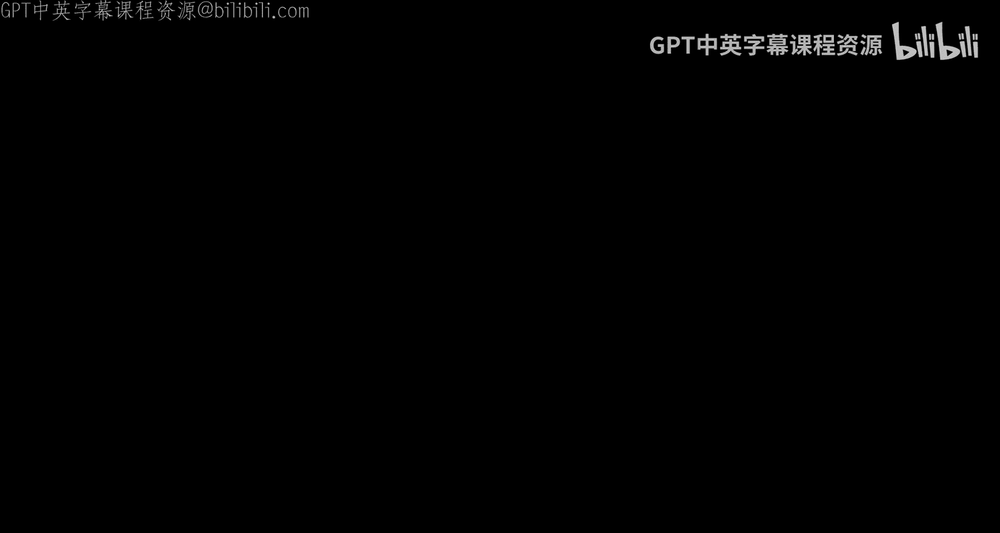
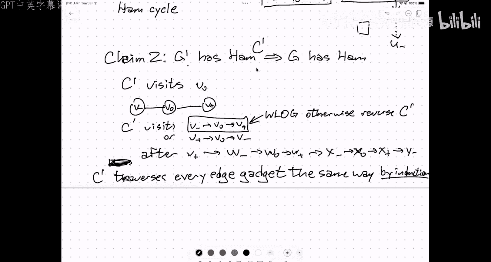

# 算法与计算模型：第24讲：多项式时间归约

在本节课中，我们将学习如何通过“归约”来证明计算问题的难度。我们将看到，如果一个问题可以快速解决，那么另一个问题也可以快速解决。我们将通过几个图论问题的例子来理解归约的概念和具体操作。

---

## 概述

到目前为止，我们主要关注如何设计高效的算法来解决问题。现在，我们将转向问题的“困难”部分。我们将探讨一类问题，对于这些问题，我们目前只知道指数时间的“暴力”解法。为了理解这些问题的内在难度，我们将学习“归约”技术。归约的核心思想是：如果我们能快速解决问题X，那么通过某种转换，我们也能快速解决问题Y。本节课将通过独立集、团、顶点覆盖以及哈密顿环等具体问题来演示归约。

---

## 从简单问题到困难问题

上一节我们介绍了算法设计中“简单”的部分。本节中，我们来看看那些被认为是“困难”的问题。在20世纪50年代，苏联数学家们开始研究所谓的“蛮力”问题，即那些最显而易见的算法也需要指数级运行时间的问题。

一个典型的例子是旅行商问题：在一个带权图中，寻找访问每个顶点恰好一次的最短环。长期以来，解决此问题的唯一已知方法是尝试所有顶点的排列，即n!种可能性，这是一个指数级的时间复杂度。

另一个例子是布尔可满足性问题：给定一个布尔公式，判断是否存在一组变量赋值使得公式为真。最直接的解法是尝试所有2^n种可能的变量赋值组合。

对于这些问题，尽管存在针对特定实际输入的启发式算法，但在最坏情况下，我们目前不知道是否存在多项式时间的算法。接下来，我们将形式化这种“困难性”。

---

## 归约的基本概念

归约是一种技术，用于证明如果一个问题可以快速解决，那么另一个问题也可以快速解决。其核心是设计一个算法，该算法将问题Y的实例转化为问题X的实例，然后利用一个能快速解决问题X的“黑盒子”子程序来解决问题Y。

以下是归约算法的一般结构：
1.  将问题Y的输入实例转化为问题X的输入实例。
2.  将转化后的实例输入给能解决问题X的黑盒子算法。
3.  将黑盒子的输出转化回问题Y的解。

我们将通过几个图论问题来具体说明。

---

## 图问题之间的归约

我们将研究三个密切相关的问题：最大团、最大独立集和最小顶点覆盖。对于这些问题，已知的最佳算法运行时间都是指数级的。

### 最大团与最大独立集

首先，我们展示如何将最大团问题归约到最大独立集问题。

**定义**：
*   **最大团**：在图中寻找最大的顶点子集，使得该子集中任意两点之间都有边相连。
*   **最大独立集**：在图中寻找最大的顶点子集，使得该子集中任意两点之间都没有边相连。

**归约算法**：
给定一个图G，我们希望找到其最大团的大小。我们构造一个新图G‘，其顶点集与G相同，但边集是G的补集。也就是说，在G’中，两个顶点之间有边当且仅当在G中它们之间没有边。

**公式描述**：
*   设原图 G = (V, E)
*   构造新图 G‘ = (V’, E‘)，其中 V’ = V，E‘ = {(u, v) | u, v ∈ V, u ≠ v, 且 (u, v) ∉ E}

然后，我们将G‘输入给能解决最大独立集问题的黑盒子。黑盒子返回G’中最大独立集的大小k。我们直接输出k作为G中最大团的大小。

**正确性证明**：
需要证明：图G中的一个顶点子集A是一个团，当且仅当A是图G‘中的一个独立集。
*   如果A是G中的一个团，则A中任意两点在G中都有边相连。根据G‘的定义，这些点在G’中都没有边相连，因此A是G‘中的一个独立集。
*   如果A是G’中的一个独立集，则A中任意两点在G‘中都没有边相连。根据G’的定义，这些点在G中都有边相连，因此A是G中的一个团。

因此，G‘中最大独立集的大小就等于G中最大团的大小。如果最大独立集问题能在多项式时间内解决，那么通过这个归约，最大团问题也能在多项式时间内解决。

---

### 最大独立集与最小顶点覆盖

接下来，我们展示最大独立集问题与最小顶点覆盖问题之间的归约。

**定义**：
*   **最小顶点覆盖**：在图中寻找最小的顶点子集，使得图中的每条边都至少有一个端点在该子集中。

**归约算法（从最大独立集到最小顶点覆盖）**：
给定一个图G，我们希望找到其最大独立集的大小。我们直接将图G输入给能解决最小顶点覆盖问题的黑盒子。黑盒子返回G中最小顶点覆盖的大小k。设图G的顶点总数为n，我们输出 n - k 作为G中最大独立集的大小。

**正确性证明**：
需要证明：图G中的一个顶点子集S是一个独立集，当且仅当它的补集 V \ S 是一个顶点覆盖。
*   如果S是一个独立集，那么S中任意两点之间没有边。这意味着图中的每一条边，都至少有一个端点不在S中（即在V \ S中）。因此，V \ S是一个顶点覆盖。
*   如果C是一个顶点覆盖，那么每条边都至少有一个端点在C中。这意味着没有任何一条边的两个端点都在V \ C中。因此，V \ C是一个独立集。

因此，最大独立集的大小 = n - 最小顶点覆盖的大小。这个归约同样可以在相反方向进行。

---

## 哈密顿环问题的归约

哈密顿环问题是另一个经典的难题：给定一个图，判断是否存在一个经过每个顶点恰好一次并回到起点的环。

### 从无向图到有向图的归约

首先，我们展示如何将无向图的哈密顿环问题归约到有向图的哈密顿环问题。

**归约算法**：
给定一个无向图G，我们构造一个有向图G‘。G’的顶点集与G相同。对于G中的每一条无向边(u, v)，我们在G‘中添加两条方向相反的有向边：u → v 和 v → u。

**正确性证明**：
*   如果G有一个哈密顿环，那么按照环的顺序遍历顶点，在G‘中总可以选择对应方向的有向边来构造一个有向哈密顿环。
*   如果G‘有一个有向哈密顿环，忽略所有边的方向，就得到了G中的一个无向哈密顿环。

因此，G有哈密顿环当且仅当G‘有哈密顿环。如果能在多项式时间内解决有向图哈密顿环问题，那么无向图版本也能解决。

---

### 从有向图到无向图的归约

现在，我们展示更复杂的反向归约：如何将有向图的哈密顿环问题归约到无向图的哈密顿环问题。

**归约算法**：
给定一个有向图G，我们构造一个无向图G‘。对于G中的每一个顶点v，我们在G’中创建三个顶点：v_in, v_mid, v_out。我们在它们之间添加两条边，形成一个长度为2的路径：v_in — v_mid — v_out。
对于G中的每一条有向边 u → v，我们在G‘中添加一条无向边：u_out — v_in。

**正确性证明思路**：
*   **正向（G有环 ⇒ G‘有环）**：如果G有一个有向哈密顿环 v1 → v2 → … → vn → v1，那么在G’中，我们可以构造环：v1_in — v1_mid — v1_out — v2_in — v2_mid — v2_out — … — vn_in — vn_mid — vn_out — v1_in。这个环访问了G‘中的每一个顶点。
*   **反向（G‘有环 ⇒ G有环）**：关键在于证明G’中的任何哈密顿环都必须以特定的“模式”遍历顶点。由于v_mid顶点只与v_in和v_out相连，任何哈密顿环访问v_mid时，必然紧接着访问v_in和v_out（或相反顺序）。进一步分析表明，环在离开一个v_out后，必须进入某个u_in，然后遍历u_in—u_mid—u_out。这种模式强制对应回G中的一个有向哈密顿环。

这个构造确保了归约的正确性。如果无向图哈密顿环问题能在多项式时间内解决，那么有向图版本也能解决。

---

## 总结

本节课中，我们一起学习了多项式时间归约的核心思想。归约是证明问题计算难度的强大工具。我们通过具体例子看到：
1.  最大团、最大独立集和最小顶点覆盖这三个问题可以通过简单的图变换或取补集操作相互归约。
2.  哈密顿环问题在无向图和有向图版本之间也可以相互归约，其中从有向图到无向图的归约需要更精巧的“构件”设计。

这些归约表明，如果其中任何一个问题存在多项式时间算法，那么其他所有问题也都将迎刃而解。这为理解NP完全性理论奠定了基础，我们将在后续课程中深入探讨。