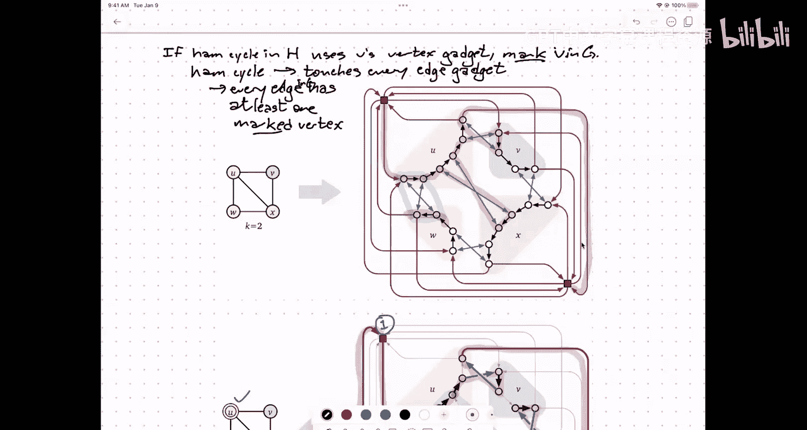

# 算法与计算模型：P26：NP困难性进阶，从顶点覆盖到哈密顿环的规约

在本节课中，我们将要学习NP困难性证明的更多细节，特别是如何从一个已知的NP困难问题（顶点覆盖）规约到另一个问题（哈密顿环）。我们将详细探讨规约的构造过程、直觉以及证明思路。

---

## 概述

上一节我们介绍了NP完全问题的基本概念和库克-列文定理。本节中我们来看看如何利用已知的NP困难问题，通过构造性的规约，来证明其他问题的NP困难性。我们将以从顶点覆盖问题到有向哈密顿环问题的规约为例，展示这一过程。

## NP困难性定义回顾

一个问题X是NP困难的，当且仅当在多项式时间内解决X意味着P = NP。从实践角度，这通常意味着存在一个从某个已知的NP完全问题（如3-SAT）到X的多项式时间规约。

**公式**：问题 X 是 NP-hard ⇔ 3-SAT ≤_p X

库克-列文定理表明，任何可以在多项式时间内验证证明的问题，都可以规约到3-SAT。因此，如果我们想证明一个新问题X是NP困难的，一种方法是展示一个从3-SAT到X的规约。然而，我们也可以利用已经证明是NP困难的问题作为起点。

## 规约的传递性

我们已经看到了一些问题的规约链。例如，我们证明了从3-SAT到最大独立集问题的规约，以及从最大独立集到顶点覆盖问题的规约。这意味着顶点覆盖问题也是NP困难的。

**核心思想**：如果问题A可以规约到问题B（A ≤_p B），并且问题B可以规约到问题C（B ≤_p C），那么问题A也可以规约到问题C（A ≤_p C）。因此，我们可以使用任何已知的NP困难问题作为新规约的起点，而不必总是从3-SAT开始。

以下是构建规约库的直观理解：
*   我们积累了一系列已知的NP困难问题。
*   当需要证明新问题Y是NP困难时，我们可以选择库中任何一个问题X，并构造一个从X到Y的规约。

## 从顶点覆盖到哈密顿环的规约

现在，我们来看一个更复杂的规约例子：从顶点覆盖的判定问题规约到有向哈密顿环的判定问题。这个规约的构造颇具技巧性，旨在展示如何将一种图结构（覆盖）编码到另一种完全不同的图结构（环）中。

### 问题定义

首先，明确两个问题的定义：

1.  **顶点覆盖（判定问题）**：
    *   **输入**：一个无向图 G 和一个整数 K。
    *   **输出**：True，如果 G 中存在一个大小不超过 K 的顶点覆盖（即一组顶点，使得每条边都至少有一个端点在该集合中）；否则输出 False。

2.  **有向哈密顿环（判定问题）**：
    *   **输入**：一个有向图 H。
    *   **输出**：True，如果 H 中包含一个哈密顿环（即一个经过每个顶点恰好一次的有向环）；否则输出 False。

### 规约构造的直觉

规约的目标是：给定一个顶点覆盖问题的实例 (G, K)，我们构造一个有向图 H，使得 H 具有哈密顿环 **当且仅当** G 具有一个大小不超过 K 的顶点覆盖。

构造的核心是设计两种“小工具”：
*   **顶点小工具**：对应原图 G 中的每个顶点。
*   **边小工具**：对应原图 G 中的每条边。

我们需要设计 H 的结构，使得 H 中哈密顿环的行为能够反映 G 中顶点覆盖的性质。具体来说，哈密顿环如何穿过一个边小工具，应该对应原图中该边的两个端点是否被选入顶点覆盖。

### 边小工具的设计

边小工具是一个有向子图，对应原图 G 中的一条边 (u, v)。经过精心设计，哈密顿环穿过该小工具的方式只有三种：
1.  **从“u端”进入并离开**：这对应于在顶点覆盖中只选择了顶点 u。
2.  **从“v端”进入并离开**：这对应于在顶点覆盖中只选择了顶点 v。
3.  **从两端都穿过**：这对应于在顶点覆盖中同时选择了顶点 u 和 v。

小工具的内部结构确保了哈密顿环必须访问其内部所有顶点，并且上述三种模式是唯一可能的方式。

### 顶点小工具与覆盖顶点的连接

对于原图 G 中的每个顶点 u，我们在 H 中创建一条有向路径，称为“u的顶点路径”。这条路径会依次经过所有与 u 相关联的边小工具的对应端点（即“u端”的入口和出口）。

此外，我们引入 K 个特殊的“覆盖顶点”。每个覆盖顶点都有边指向每个顶点路径的起点，并且从每个顶点路径的终点也有边指回这些覆盖顶点。

### 构造的整合

最终的图 H 由以下部分组成：
*   K 个覆盖顶点。
*   对于 G 中的每个顶点，一条对应的顶点路径。
*   对于 G 中的每条边，一个对应的边小工具，其端点与相应顶点路径中的点连接。

### 规约的证明思路

证明分为两个方向：

**方向一：如果 G 有大小不超过 K 的顶点覆盖 C，则 H 有哈密顿环。**
1.  从覆盖顶点1开始。
2.  对于 C 中的每个顶点 u：
    *   从当前覆盖顶点进入 u 的顶点路径。
    *   沿着该路径前进。当到达关联边 (u, v) 的小工具时：
        *   如果 v 也在 C 中，则让哈密顿环直接穿过小工具的“u端”（模式3）。
        *   如果 v 不在 C 中，则让哈密顿环从“u端”进入，穿过小工具内部，从“v端”出来，再返回“u端”（模式1），从而“覆盖”该小工具的所有顶点。
    *   完成 u 的顶点路径后，前往下一个覆盖顶点。
3.  最后，从最后一个覆盖顶点返回起始覆盖顶点，形成环。由于 C 覆盖了所有边，所有边小工具的顶点都已被哈密顿环访问。

**方向二：如果 H 有哈密顿环，则 G 有大小不超过 K 的顶点覆盖。**
1.  观察 H 中的哈密顿环。它必须访问所有 K 个覆盖顶点。
2.  分析环的结构可以发现，它必须被分解成 K 段，每段从一个覆盖顶点开始，进入并完整遍历**恰好一条**顶点路径，然后到达下一个覆盖顶点。
3.  那些其顶点路径被哈密顿环遍历的顶点，构成了 G 的一个候选顶点集合 C。
4.  由于哈密顿环必须访问每个边小工具的所有顶点，通过分析环穿过边小工具的方式（上述三种模式），可以证明每条边至少有一个端点属于 C。
5.  因此，C 就是 G 的一个大小不超过 K 的顶点覆盖。

---

## 总结

本节课中我们一起学习了NP困难性证明中一个复杂的规约案例：从顶点覆盖问题到有向哈密顿环问题。我们看到了如何通过设计顶点小工具和边小工具，将图覆盖的结构性条件编码为图环存在的条件。虽然这个规约本身很复杂，但它阐释了规约证明的核心思想：**在目标问题实例中精心构造结构，以模拟源问题实例的约束和解决方案**。对于作业和考试，大家需要掌握的规约通常比这个例子更直接和简洁。