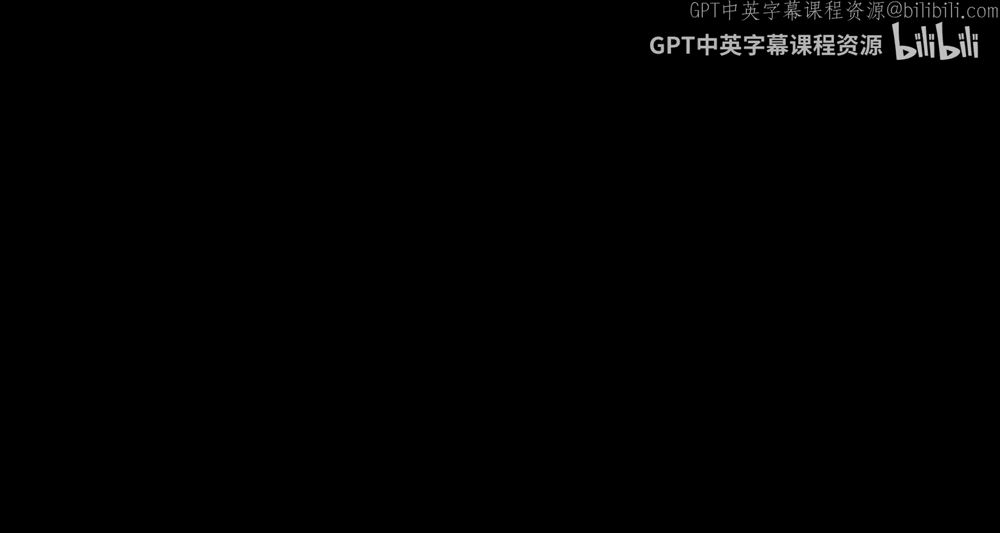
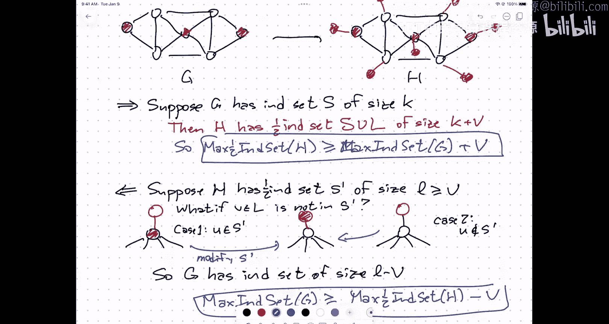

# UIUC《算法与计算模型》：27：NP-hardness：为何关注与如何选择归约起点

在本节课中，我们将探讨NP-hardness证明的高级策略，特别是如何选择合适的问题作为归约的起点。我们将通过几个例子来理解这一过程，并首先讨论为何要证明问题是NP-hard的。

## 为何要证明问题是NP-hard的？

证明一个问题是NP-hard的，在某种意义上可以让你从为所有可能输入寻找一个既高效又正确的算法的责任中解脱出来。因为如果问题是NP-hard的，这样的算法几乎肯定不存在。这意味着，在某种程度上，你试图解决的是一个错误的问题。

现在，可能的情况是，你实际上想解决你真正关心的问题，但你开发了一种攻击策略，并且你发现这种策略实际上意味着能为一个子问题、相关问题或更一般的问题提供高效算法。那么你就应该放下这种策略，尝试其他方法。

另一种方法是尝试特化问题。例如，你已经知道旅行商问题是NP-hard的，因此没有为所有边赋权图设计的、可证明高效且正确的算法。另一方面，如果你碰巧知道你的图是一个有向无环图，那么存在一个简单的动态规划算法可以找到该图中的最长路径。因此，如果你能根据应用中实际期望看到的输入类型，对输入做出限制性假设，通常可以将一个NP-hard问题特化为一个可以有效解决的特殊情况。

另一种可能性是，你并不一定需要这个问题的最佳解决方案，因为那会很困难。实际上，你的应用需要的不是最佳解决方案，而是一个足够好的解决方案。因此，存在一个专门研究近似算法的子领域。例如，对于旅行商问题，我无法在任意图中精确求解最优解，但相对容易得到一个在最优解两倍以内的答案。根据具体情况，也许你可以将近似因子驱动到任意接近1，只要你愿意花费更多时间。

还有一种方法是依赖启发式算法，这些算法在实践中有效。现在我们正从理论领域转向更实际的领域。例如，对于大多数来自真实地理数据的旅行商问题实例，存在在实践中有效的方法。一种方法是将其表述为整数线性规划问题，然后对于广泛的整数线性规划类别，存在可以快速求解到最优的技术。但当我提到“广泛类别”时，这不是一个定理，而是一种观察，即在实践中这些问题可以快速解决。

## 选择归约起点

现在，我们来讨论如何选择归约的起点。Cook-Levin定理表明3-SAT是NP-hard的。这意味着，如果存在从3-SAT到问题X的多项式时间归约，那么X就是NP-hard的。一旦我们证明了某个问题是NP-hard的，我们就可以用它作为新的归约起点来证明其他问题是NP-hard的。

因此，我们有一个已知的NP-hard问题列表，例如：3-SAT、电路可满足性、最大团、最大独立集、最小顶点覆盖、各种着色问题、哈密顿回路或路径、旅行商问题等。

那么，如何选择从哪个问题归约呢？虽然没有硬性规定，但有一些经验法则。

以下是选择归约起点的一些启发式方法：

*   **如果问题涉及二元选择**：例如，决定哪些对象应该涂成红色，哪些涂成蓝色；或者选择一个具有某种性质的子集。这听起来可能与布尔可满足性有关，因此3-SAT可能是一个有用的归约起点。
*   **如果问题涉及寻找满足约束的最大/小子集**：例如，寻找一个尽可能大的子集，但要求子集中没有三角形。那么最大独立集或最大团可能适合作为归约起点。类似地，如果寻找一个满足某些约束的小子集，那么最小顶点覆盖可能是正确的选择。
*   **如果问题涉及将集合划分为若干子集**：例如，将房间里的所有人分成4组，并满足某些约束。这开始有点像四色问题（比三色问题更难）。或者你想知道将房间里的人分成团队的最小数量。当给图着色时，你实际上是将顶点划分成红色、黄色和蓝色集合，每个集合内部没有边。因此，着色问题可能是正确的选择。
*   **如果问题涉及寻找对象的顺序**：例如，哈密顿回路是寻找一个经过所有顶点的回路，哈密顿路径是寻找一个经过所有顶点的路径。在某种意义上，这是顶点的一个排列，要求排列中相邻的顶点在图中有边相连。因此，如果你在寻找一堆对象的排序，那么也许可以从哈密顿问题归约。
*   **如果问题涉及平衡或调度**：例如，负载均衡、调度，需要将具有成本的资源分配给多个代理或多个消费者。那么也许可以使用像划分这样的问题。划分问题是：给定一组带权重的物品，能否将它们分成两组，使得两组的权重和相等。

一个有趣的经验法则是：**注意数字“3”**。许多NP-hard问题，如3-SAT、3-着色、3-划分，当把“3”换成“2”时，问题就变得简单了；换成更大的数字，问题仍然困难。因此，如果你的问题看起来有“3”的特性，尝试从3-SAT归约通常很有效。

## 一个例子：半独立集问题

让我们通过一个例子来具体说明。定义：在无向图G中，一个顶点子集是**半独立的**，如果该子集中的每个顶点最多与该子集中的另一个顶点相邻。

我们要证明：在给定图中寻找最大半独立集的问题是NP-hard的。

**第一步：选择归约起点**。我们选择一个看起来尽可能像这个问题的已知NP-hard问题。这里我们选择**标准的最大独立集问题**。

**第二步：构造归约**。我们有一个算法，输入图G，输出最大独立集的大小k。在中间，我们有一个解决最大半独立集问题的黑盒，输入图H，输出最大半独立集的大小l。我们需要找到一种方法将G转换为H，并将k转换为l。

**构造H**：从图G开始，为G中的每个顶点v添加一个新的“叶子”顶点u，并用一条边连接v和u。也就是说，给每个原始顶点附加一个长度为1的路径（一个叶子）。

**证明思路**：
*   **正向（如果G有大小为k的独立集S，则H有大小至少为k+|V|的半独立集）**：取S，并包含所有新添加的叶子顶点。这个集合是半独立的：S中的原始顶点彼此不相邻（因为S是独立集），每个叶子顶点只与S中的一个顶点相邻（如果其父顶点在S中）。因此，我们得到了一个大小为k + |V|的半独立集。
*   **反向（如果H有大小为l的半独立集S‘，则G有大小至少为l - |V|的独立集）**：关键是要论证，我们可以修改S‘，使其包含所有叶子顶点，而不减少其大小。然后，从修改后的集合中移除所有叶子顶点，剩下的就是G中的一个独立集，其大小至少为l - |V|。修改过程涉及：对于每个叶子顶点，如果它不在S‘中但其父顶点在S’中，则将叶子加入S‘并移除父顶点；如果父顶点也不在S’中，则直接将叶子加入S‘。可以验证，经过这样的修改，我们仍然得到一个半独立集，并且它包含了所有叶子顶点。

因此，图G的最大独立集大小等于图H的最大半独立集大小减去|V|。这就证明了，如果我们能在多项式时间内解决最大半独立集问题，我们就能在多项式时间内解决最大独立集问题。由于最大独立集是NP-hard的，所以最大半独立集也是NP-hard的。

## 总结

本节课中，我们一起学习了证明NP-hardness的动机和策略。我们了解到，证明问题是NP-hard的可以指导我们放弃寻找通用高效精确算法的徒劳努力，转而寻求特化、近似或启发式方法。在证明技巧方面，我们学习了如何根据目标问题的特征（如二元选择、子集选取、划分、排序、平衡等）来选择合适的已知NP-hard问题作为归约起点。一个实用的启发式是注意“3”这个数字。最后，我们通过“半独立集”问题的归约例子，具体展示了如何构造和证明一个归约。掌握这些策略，将有助于你理解和应对计算中的困难问题。

