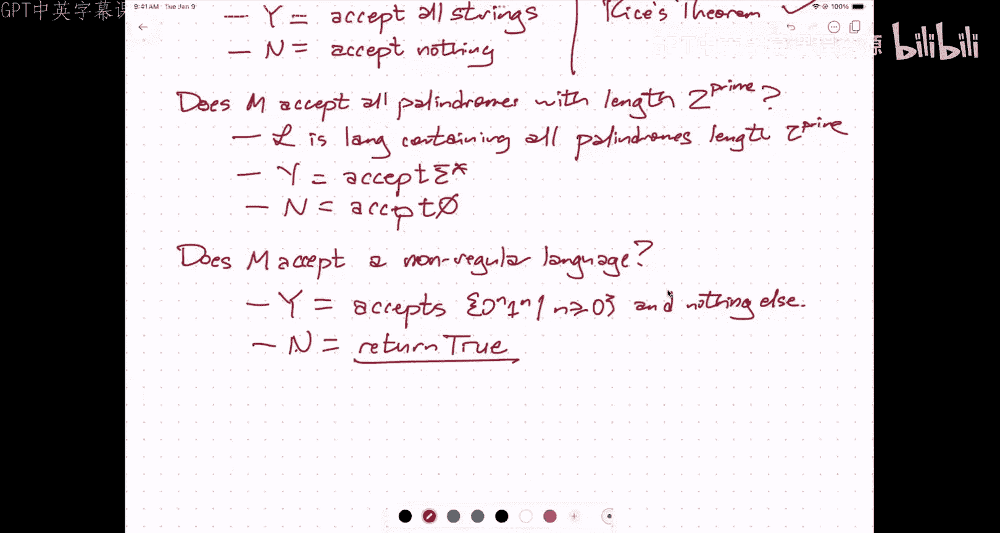

# UIUC《算法与计算模型｜UIUC CSECE 374 - Algorithms and Models of Computation 2023》中英字幕 p29 20231130-Nov 30_ Undecidability proofs.zh_en -BV1Mh7RzaEL2_p29-

Yeah。

是吗。It。可以。成到年钟就我飞点。た場。公回。Hey， hi everybody。Thanks for coming to。The last。Lecture of the semester。

Tuesday next week will be exam review， so again I'm going to do what I did for the midterms。

Over the weekend， I'll publish。A。An example final。And I'll walk through。

 I won't have time to go through all of it in only an hour and 15 minutes。

But I'll go through whatever pieces of that exam you want me to go through in that time。

And then after after class， I'll finish walking through the exam and writing out solutions。

 and then there'll also be a second practice exam。Which I'll release solutions to。

Probably on Thursday。嗯。But this is the last actual lecture with actual content。

I want to emphasize here that the stuff that I'm showing you isn't going to show up in the form of a long answer question on the final。

 but it might show up in the form of like true false justify questions similar to the questions that you saw at the beginning of midterm one。

 so the reason for asking you to like engage with this material in the lab tomorrow in lecture today on Prairie learn do next Monday is just so that you understand the rules of the game well enough to look at a proof。

And tell me what pieces of it are doing or look at a problem that is undecidable for easy reasons。

 which I'm going to explain at the end of this lecture and say yes。

 I know that's undecidable because it's sort of obvious by this theorem。Right。So。Again。

 the game that we're playing here。It is similar in spirit。To。Um。And Pharness。

In that we're trying to prove that something is hard。

We're not trying to derive an algorithm to solve the problem and we're certainly not trying to derive an algorithm to solve the problem quickly we're trying to show that literally there is no algorithm that can。

😡，That can solve this problem。Right。So。You know， problem。X is undecidable。If and only if。

There is no algorithm。To solve。Arbitrary。Instances。Of x in a finite amount of time。So in particular。

 when I say solve， if x is a decision problem a yes， no problem。

 which is mostly what we're going to focus on。Means if I give you a good instance of x。

 the algorithm will say yes in a finite amount of time， if I give you a bad instance。

 the algorithm will say no in a finite amount of time。😡，So some problems like， here's an array。

 is it sorted？You can imagine fairly hopefully， fairly quickly a linear time algorithm to decide whether a given array is sorted or not。

Given a graph to say does is there a Hamiltonian path in this graph？Okay。

 it may be a little bit more difficult to come up with the precise details。

 but at least in principle， you can imagine trying all possible permutations of the vertices and checking for each permutation。

 whether that permutation describes a path through the graph and if one of those permutations works you say yes。

 and if none of them work you say no。So those problems are decable。The kinds of things that we are。

End up proving undecidable， generally these are problems where the input itself is a piece of code。

And I'm asking questions about what the code， either the function or the behavior of that code。

So this is， I should say typically。But this is definitely not universal。Uncidable。Problems。Ask。

Questions。About。Code and formally， these are usually formalized in terms of asking questions about tuuring machines。

For some reason， I can't spell today。But you know， you could also ask questions about Python programs。

 CP programs， Java programs， etc cea。哎。Here's a piece of code。

 is it possible to make this code go into an infinite loop？Here are two pieces of code。

Are they functionally identical given the same inputs do they always produce the same outputs？U。

Sometimes this gets a bit more subtle。Here is a piece of C++ code will it compile？

According to the rules of C++ now in fact， the C++ compiler tries for a while to figure out how to compile things and it has an alarm that goes off after a certain amount of time it just that I hell if I know if this is compilable or not I'm just giving up。

but because you can have like nested templates and recursively applied templates and so on。

 just compiling C++ code itself is running a program。

And asking whether the code compiles is asking whether that program will halt。

And then there there are other examples like this post correspondence problem that's not obviously about code。

 but even you know the proof of that ultimately boils down to showing that with the post correspondence problem。

 you can simulate，ArbitThe execution of arbitrary algorithms。

So typical undecidable things and where where we sort of start talking about undecidable things is asking。

um what does this code， does this code do this thing that I want it to do？😡，Now sometimes。

Some questions about code are actually solvable。So， for example。Let's see。

It's easy to think about this in terms of turing machines， so a turing machine。

 you have a finite state machine sitting on top of an infinite tape。

And the finite state machine originally sort of sits at the left end of the tape。

There's my tuuring machine， there's my tape。And the question is。

Does the Tring machine ever move the readr head？Ever。

And so I can actually figure that with a given input。

So I can actually figure that out by running the Tring machine until either it moves the readwrite head one step to the right。

 in which case I immediately say yes。Or I end up in the same state。

With the same symbol on the tape that I was in before。In which case I'm stuck in a loop。

 and I would say no。So there are examples of questions about code that are decable。

I think is this Python program syntactically correct as decidable？Unlike like C++。

But these tend to be relatively subtle things。And so。Probably not going to see a lot of them。

Right so。Some questions。About code。Are decidable。So does this， the Tring machine M given some input？

W， ever move。Is just an example。Okay。So the canonical， undecidable problem。

The one that everybody knows is undecidable already。Is called the whole thing problem。

And the whole thing problem says I'm given。A program。UW which I'm going to write like this。

 that means mean I'm given the source code to say a Python program and see program。

 a touring machine。And I'm given an input。String。X。Does？M halt。When。Given。Input X。ok。😊。

Over here I have a piece of code that claims to be a sorting algorithm。😡。

That's that's my program and over there I have an array， which I'm going to call X。

 if I feed this array into my sorting program， will it actually halt and return some sort of value？

Okay， now for any sorting program that a normal sane human being would write。

 it probably consists of a couple of nested for loops， or maybe， you know。

 if you're doing merge sort or quick sort a couple of recursive calls。

 but written in a way where it's obvious that the subproblems are getting smaller and so you can answer yes。

Sometimes when we're grading people's submissions for sorting algorithms。

 we observe that there are cases where the recursive calls actually don't make the array smaller。

Because of rounding errors or something else， in which case we can say， actually no。

 you're going to get this infinite chain of recursive calls and the algorithm's never going to halt。

So again， given something that a normal human being would write。This problem is。You know。

Proably decable， which is why there are program analysis tools that in debuggs that quote unquote。

  detect infinite loops。Yes。That that's correct， so the brackets around M mean the source code of E a string。

😡，PR INT open Parn， double quote H E LLO comma space， WO RLD exclamation point。

 double quote close Par， semi。That string is M in brackets。

A program that prints Hello World is just M。哎。嗯。Now。

So there's the point is there's no algorithm where if I give you an arbitrary program and an arbitrary input string will 100% of the time absolutely correctly in a finite amount of time。

😡，Tell you yes or no。This algorithm running on this program running on this input will infinite loop or it will halt。

Um soum。The first thing I need to do today is。Prove to you that this problem is undecidable。

And the way I'm going to do that， I'm going to do that in a couple of steps。

 I'm going to do it by starting with the problem that we saw on Tuesday that I called self reject。Um。

Except I'm going to do a slight variant of self project called self halt。So。Given。A program。M。Does？

Sour code M does the compiled program halt？When it is given。That's its own source code is input。哎。😊。

This is the problem I'm going to refer to as self halt。So given my own input， I will go， hey。

 that's me and I'll stop。It might loop forever on some other input。That doesn't matter。Okay。So。

I'm going to prove that this self halt problem is undecidable using a direct proof by contradiction。

 a diagonalization argument， I'm going to argue that if this problem were decable。

Then I can build another program。That has a certain behavior。

 if and only if it has the opposite behavior。So I'm going to assume that there is something that solves the self halting problem。

And。I'm going to use it to derive something impossible。系。So let's， for the sake of argument。

Suppose that I have a program that decides self holds。What should we call that program？S。Bob， okay。

 suppose Bob。There's a program that decides。The problem self halt。ok。😊，So。Bob。

 given an arbitrary piece of source code， will tell you truthfully in a finite amount of time。

 whether that program will halt when given that source code as input。😡，诶y。😊。

So that means that the accepting language of Bob。Is。So halt。

And the language of inputs that make Bob loop forever is empty。

 that's what it means for Bob to decide something it Bob always makes a decision。

 always returns a result， it never goes into an infinite loop。诶。😊，So this is。

Just what it means this word decide。Okay， so I'm going to write a new program。😡。

Which in grand computer science tradition， if you have one thing named Bob。

 the other thing should be named Alice。So I'm going to write a new program called Alice。

 and Alice takes in a string as input and the hope is that Alice will either return true or return false。

Okayy。So here is what Alice is going to do。First， Alice asked Bob。嗯。If Bob likes that string W。等。😊。

And if so。Alice will go into an infinite loop。If Bob doesn't like the string W。

Then Alice will return true。诶y。So what I'm doing here when I'm writing this piece of code。

Remember these sort of reduction cartoons that I would。嗯。Draw for NP hardness。

We're doing exactly the same thing here， a string W comes into Alice。

That string gets passed directly to this magic。Black box that solves the selfaling problem。

 which we've called Bob。So this is。Magic， so so got a wizard hat on it。嗯。And three things can happen。

One possibility is that Bob says true， another possibility is that Bob says false。If Bob says true。

Then Alice is going to go into an infinite loop。And if Bob says false。

Then Alice is going to output true。Now， the third thing that could happen in principle is that Bob goes into an infinite loop。

 but I know that's impossible because they declared it at the beginning that Bob is deciding something。

So there's no， Bob must halt and either return true or false。

Okay so this thing on the left is just pseudocode， this thing on the right is the same thing just in cartoons。

Right。So the important thing here。Is。That the accepting language of Alice。

Is exactly the same as the rejecting language of Bob。哎。Everybody with me so far。

We've got all the things set up， yeah， over there。So formally， self halt is a language。

 it's a set of strings。😡，Think of it as the set of all Python programs。

 which when you feed those programs， their own source code， will eventually halt。

But I'm phrasing it instead as a yes no question where I feed in as input the source code and ask this question。

 would this program halt given its own source code and it returns yes or no。

 this is just asking whether this program is in this language or not。

So it's the same kind of thing that you would ask a do。That clarifies？Okay。All right。

So let's walk through a few cases and say， well。Suppose I feed the source code to Alice。To Alice。

Okay， so one of the things that could happen。Is that Aliceis will accept？The string。嗯。

The encoding of Alice， the source code for Alice。喂。Now， what does that imply？Well。

 because the accepting language of Alice is equal to the rejecting language of Bob。

 Alice accepts a string if and only if Bob rejects it。This means that Bob。Rejects。Alice。嗯。Xi。

Hang on just a second day。Just a second。The next step that I need some。

 and need to double check with here。So the next thing I want to imply is that Alice hangs on Alice us。

Which。It's not quite what I want。There's a bug in my notes。I'm going to cheat here for a second。

And I'm going to actually。Look at my real notes。A。Because the。系。Sas。

SHx except if and only if SH this is this SHx here。

 that's so SH is what I was calling previously calling Bob。And。SHx is what。好 on。

What I was previously calling Alice。So this is Alice， and this is Bob。Um。

And I'm describing the behavior。And somehow I'm jumping to。What my notes say here is that Alice。

Hangs。On。Alice。Which， of course， implies that Bob。U。啊。Rejects， sorry。Let me try this again。I going。

Okay， I figured it out， I got it， I got it， I got it。

 all right sorry just need a little time to clear my cash。Okay。

 Alice accepts Alice's own source code， so that means in particular Alice halts when Alice is given its own source code。

 Alice is a good example， a good program for self halt。

Okay so and Bob decides whether a given program halts on its own source。

 so here I have a program that halts on its own source， that means that Bob should accept it。Okay。

 so Bob。Excepts。Alice。By the definition of self halt。Okay。😊，There we go。

Does everybody understand this step？Yeah。I said， assume Alice accepts the source code Fs。

 let's see what this implies。Okay， let's take this as a hypothesis because this is one of the things that Alice could do with her own source code。

 suppose she accepts her own source code， well that means Bob would also accept Alice's source code。

Because Alice is a program that halts on its own source code。And Bob detects all such programs。

 but if Bob accepts Alice， then by definition of Alice， Alice hangs on Alice's source code。

This is by the definition of Alice。And so Alice， if Alice accepts her own source code。

 then Alice hangs on her own source code。That's a contradiction so that means Alice can't accept her own source code else it turns out Alice can't reject her own source code because you get exactly the same the same implication。

 but let's start with what happens when Alice hangs given her own source code well in this case this means that Bob would reject。

Alice's source code。Again， by the definition of self halt。

But if Bob rejects Alice's source code then look at the actual look at the actual algorithm， Alice。

 if Bob returns false， then Alice will return true， that means Alice。Excepts her own source code。

So we get this。Again，nakinging its own tail contradiction。

Alice accepts her own code if and only if Alice hangs on her own Coke。

And so we've derived something impossible。This chain of implications。Implies。Bob。Doesn't。Exist。Hey。

 there is no program that decides the problem self fault。Yao。一。

Please give me information that helps on how。Okay。Let's look at the code for Alice。Okay， so remember。

 Bob accepts the string。Let's just refer to for the moment， let's just refer to this stream as W。

Okay， so if Alice accepts W。Then， well， because of the particular string W that means Bob accepts W。

 if Bob accepts W。😡，The now is infinite loops right there， the second line。 so this is， you know。

 if Bob accepts W。Then I go into an infinite loop。U。That's Alice hangs on down Alice。

 so if Alice hangs on on the straight Alice， then by definition of self halt。

 Bob should reject Alice's source code。But then in this case。

 I go to the ElLS clause in the AliceLS program。And I return true， I accept。Our success。は。Yes。

Excuse me， say that again。Right， Alice。Well， okay， I want to recommend something here。

 whenever we're talking about undecidability proofs， never use pronouns。

You you said if Alice returns true， then it doesn't hang， I don't know what the word it refers to。

If Alice returns true， then that means Alice doesn't hang。Because it returned to value， it halted。

Is that what you' were asking？Okay， yeah。All right。So this is close to the halting problem， its。

 you know， do I have a program that halts on a particular input namely its own source code。

 which is a little unsatisfying because it has this weird self reference in it。😡。

But I can still use this as a stack to prove that the more general halting problem is undecidable。

 so I want you know theorem。Halt is undecidable。And the proof I'm going to use is a reduction。嗯。2。

Or sorry， reduction from。呃。Solf halt。He， so here is。

I'm going to try to build an algorithm for self halt。

 using an algorithm for the halting problem as input。

Now the input to the halting problem consists of two things。

 it consists of the encoding of a machine。And it consists of another input string。And the idea is。

 I'm going to intuitively， I'm going to。Run program M on input X。

And if I get a result in a finite amount of time， then this halting oracle will return true。

 and if the program runs forever， then the halting Oracle will return false。系。Hey。😊，So。

This will either return true or return false and i'm just going to。Sit those out。Verbatim。Now。

 self halt。Takes as input， the inputcoding of a machine and maybe not too surprisingly。

 I'm just going to pass that machine directly to the machine， the source code input for B。

 but I'm also going to pass the same encoding as in the other role as the input streaming X。😡，Okay。

 so。I'm writing a problem for。You know， the self halt decider。Given a。This string m is。Well。

 I need to verify that。M is really an encoding， so there's a bit of a preproces step there。

 but otherwise I'm going to return halt of M given the input string M。U。

So what I've now shown is that that inner box can't exist。Because if it did。

 I could build an algorithm to decide the language self halt， which I just proved it doesn't exist。

The flavor of， this reduction。You'll notice is really very。

 very similar to the flavor of NP hardness reductions。InThere's a bit of tension here。

 it feels uncomfortable。嗯。First of all， I'm taking a problem I know is hard and I'm trying to reduce it to a problem that I'm trying to prove is hard。

 which is the opposite direction that we normally want to do reductions。

We normally want to do reductions from something we're trying to solve to something we already know how to solve。

So it's backwards。The other thing is， you notice this reduction can't give me all possible inputs to the halting problem。

It only gives me specific inputs to the halting problem where the two input strings happen to be equal。

😡，So what I've really done is only show that a certain special case of the H thing problem is undecidable。

But if a special case of a problem is hard， then the more general a problem is hard。

IfThe special case to the problem is impossible， then the more general case is impossible。嗯。

So I needed this sort of self referential diagonalization argument to sort of ground the proof。

 but in the end， I don't actually need the self reference to get an undecidable problem。Yeah。白就啊。系。

喂喂你。The party like the post。Okay， so the question is why didn't we start directly with the halting problem and if you cast your mind back。

😡，That was what I tried to do in the last lecture right before mid Ter one。And at some point。

 somebody noticed， hey， wait a minute， the input to the halting problem isn't just a machine。

 it's a machine and another input string and the argument doesn't， it isn't as straightforward。

So it is always possible to combine these two arguments into one and just get a single diagonalization argument for the original halting problem。

 but I think that direct diagagonalization argument is much less clear than factoring it into these two pieces。

Yeah。然打。他上发过。So the way we usually do reductions is oh。If I could only sort it。

 then I could solve this problem。So you're doing a reduction for your problem to sorting like in the homeworks。

 you did reduction from this weird problem to shortest paths。She then solved by Dexster。

Or you do a reduction from this problem to strong in components。

 which you solve using Kazju's algorithm。That's the way we almost always see reductions when we're designing algorithms。

This， like NP hardness proof， does that backwards。Right。

 so the general rule here is if I want to prove。Something is undecidable。I can describe。A reduction。

From。Any other undecidable problem？2 x。And just like with NP hardness。

 we now are building up a vocabulary of undecidable problems that we can use to reduce from just like for NP hardness。

 we had you know， threeatAT， three color， Max Cique， Hamiltonian path。Same thing here。

 we've got self reject self halting problem， yeah。你先俾你。Under the side found that is like。对。这第次。

And these hard。yes， this is it。This is the least hard undecidable problem。

There are harder undecidable problems， so if you could solve the halting problem then you could solve self halt there's the proof。

 so self halt is also the sort of same degree of undecidability as the standard halting problem。

 but there are other problems where even if you had a magical fairy who could solve the halting problem would still be undecidable。

Those are higher， you know more undecidable or higher touring degrees or there some technical stuff about it。

嗯。We're not going to talk about that。Yeah。What is the sorry？X is a problem。Oh， wait， sorry。

I'm using X up there to represent a string， let me be a little bit more careful about this to prove that problem X is undecidable。

 reduce any undecidable problem to problem X。And maybe what I should do to make this even clear is just use。

You know，W here as the name of my string。And just at the。

strict of M is know how why you pass the and and also。

So the definition of the halting problem is given a program and given an input to that program。

 does this program halt and given this input？Right now there are variants of the altering problem where you just get the code and you ask。

Does this program halt no matter what the input is？😡。

And there's another reduction argument like this that is in the notes。

That once you know that the halting problem works， then you can go to always halts。Or never halt。

Or always diverges or always accept。yeah。So as a technical issue here。

 self halt decider has to take in arbitrary strings as input。So the question is。

 is this a Python program that halts given its own source code？

One of the ways to return false is this is of the Declaration of Independence。

It's not actually a Python program at all， so there's I need to。

Make sure the data has the right format before I try to pass it to the halting Oracle。Yeah。

I use the assignment operator， W equals the source code of M。😡，I mean， there's the code right there。

The first argument and the second argument are the same straighter。When I call， I mean。

 the definition， these things are given two different names and have two different purposes。

But they're just two strings， so I can pass the same string into both。Okay。嗯。So u。Let's see。

Do want to do。😔，One more。Yeah， let me do one more example。This is the。Problem， never halt。Right。

 so given。The source code do a program。啊。Does M。Always。engng。诶。Well， infinite loop。嗯。Right。

Never halt should return true if no matter what I feed to the program M。

 it goes into an infinite loop and it should return false if there is even a single input that makes M actually halt。

系。So let's see。Let's I need a name of a program。That decides。嗯。Never holds。嗯。Let's call it Bummy。

For the Ever ready Bunny。Keeps going and going and going and going， never halts。Okay。

I'm going to write。We're going to build。An algorithm。For halt， the halting problem。As follows。

 so here's my algorithm for halt。And take as input， a piece of source code and an input string。

And now the way that my。嗯。Algorithm is going to work。Is by taking advantage of the effect。

That source code is a string and it's a string whose syntax and semantics I understand。

If this is a Python program， I know what Python programs look like。

 I know how to take a Python program and edit it to be a slightly different Python program。😡。

I know how to take a Tring machine and edit it to be a slightly different Tring machine。

 I know how to take the C program and edit it to be a slightly different C program and moreover I know how to do this algorithmically this was the point back at the before midterm one。

 we would take in a DFA and you would edit it to produce a slightly different DFA that would accept a different language。

😡，So I'm going to do exactly the same thing here。I'm going to write。The following code。😮，All。

 so I'm going to write code for a。A function that's called meow and it takes its string x is input。

And what Miow does is it returns。M running on W。Okay， so I write out a piece of source code。😡。

That says， take this source code M。Bop， and then at the bottom of it。

 it says now call M on the input string W。😡，Okay， so Miao is just another piece of code。All right。

Written out into some file somewhere。And then I'll say if。neverever halt。So if Bunny likes meow。

I'm going to return false。Otherwise。I'm going to return。True。

And make sure that absolutely sure that I've got this right。Well， that's what I've got in my notes。

 so we'll hope that is's actually right。哎。Yeah。So the program X that's right。

 it takes X and it throws it on the floor and it laughs at it and then it runs M on the input string W。

Whi hard which is hard coded into the program meal。

I write a program where you give me an integer and I go，Ha， ha，ha， and I return five。

No haltt knows M because M is one of the inputs to halt。There it is the first input to halt。

So Holt writes the program MIA。哦。The thing in the box is the program halt or the instructions for the program halt。

 the first thing that halt does is it writes this program called me out。😡。

Using the source code it was given to produce slightly different source code。哎。Yes。

Bunny is a hypothetical program that decides the language never helped。

There's the definition of button。I needed a naing。So I named it Bunny。对。到。Okay。

 so the biggest mistake that you can make with these things is to try to hold the whole thing in your head。

So I'm going to walk through the proof that the existence of。

 I claim that this is a correct algorithm for the halt thing problem。

But I need to walk through step by step。The arguments that this is a correct algorithm for halting problem and the thing that makes this confusing is there are one。

2，3。诶。F programs going on here。So there's this program called Bunny that I claim two sides never hold。

And I'm using that to write this other program that I'm calling haltt。😡。

And one of the inputs to haltt is this third program called M and one of the things that the halting program builds is this fourth program called Miow。

 I deliberately chose four very different names for these things because that way I can keep them straight。

Yes。完闭。RightI'm trying to decide whether the program Miow never halts。

And part of the architecture for this is you'll notice that the behavior of Miow doesn't depend on its input stream。

😡，Either Miow always halts or Miow never halts。Because I built it to take the input string。

 laugh at it and throw it on the floor。So the behavior is always exactly the same。

 and it always matches whatever M does with Wium。And that's really the key to the proof。

 so there are two sides to this proof。Suppose M halts when it's given。W is input。Well， that implies。

That。If I run meow。It will always halt。It doesn't matter what x is。

Mow is going to throw X on the floor， run the program M on input W。hypoypothetically M halts on W。😡。

So done， it halts。😡，So given X。Yeah helps。No matter what X is。Um。But if Miow halts on every input。

 Miow is a bad example for self for always for never halt。Okay so this means that Bunny doesn't like。

Miao。Because Bunny only likes things that never halt。And this always halt。Um， and well。

 if Bunny rejects me out， then this algorithm returns true。accepts。M andW， which is what we want。

So if M in fact halts on W， you this chain of implications that says this program actually returns true。

 which is correct。😡，On the other hand。Suppose。M loops。On W。Well， then in that case。

No matter what I feed into the program meow， it will infinite loop。I throw X on the floor。

 I try to write an among W， it goes， ah。And just hangs。So Miow。Um。Loops。On。Every。Input。

Which means this is exactly the sort of thing that bunny is looking for Bunny loves programs that always loop forever but never bunny loves programs that never halt so that means。

That funny。Excepts。Yeah。But if B accepts me out， then this program returns false。

So that means my halting program rejects。The string， the input MW， which is correct。

So if M actually halts on W， this program correctly returns true， if M infinite loops on W。

 then this program correctly returns false。😡，Which means this is a program to solve the halting problem。

We just showed 10 minutes ago that there is no program to solve the halting problem。

 so we have a contradiction。Bunny doesn't exist。Eventually， even the Ever ready bununny will。Ot。嗯。嗯。

Okay， so this is a proof that never halts。Is undecidable by reduction to sorry from the whole thing problem。

So this is。Just reduction。From。Hoalt。And this is so now the second way that we have to prove that problems are undecidable。

 the first way is to derive a contradiction directly program behaves some way on its own source code if and only if it doesn't。

😡，But then once we have those， we can build up by this kind of reduction argument。

 you know more complicated behaviors or different behaviors and the content here of the reduction is。

You're given a program is input， the reduction transforms that program into a different program and then tries to use that different program。

 passes that different program into the magic black box in this case called Bunny for the program you're trying to prove is hard。

😡，系。Now one thing I want to make very， very clear。The program meow。Never runs。

Nothing is ever running the program called MiA。I never compile the program called MeA。

 I never interpret the program called MeA， it's treated purely as source code。😡。

Into this oracle Bunny that says if I were to run this。Would it always hold or would it never hold？

The only program that's actually getting run here is likewise， M is never actually being run。

 so halt is the thing that we're running and it calls the subroutine Bny。

 the other two things are just treated as source code as data。😡，Makes this， you know。Admittedly。

 pretty confusing。So the art of doing these kinds of reductions is， first of all， figuring out。

What goes in that box in the middle and it's usually amount three lines。

Maybe you do something with the input string X， maybe you don't。

Maybe you run the given Tring machine on the fixed input， the given input string W。

 maybe you compare W to X， maybe you compare X to some other string。

 you'll see several examples of this in the lab on Friday and on Prairie Learn。Yeah，就哦关。7号 the nice。

what is操。I should have given that machine a different name。诶。

I need a name of a program that supposedly decides halt。Halt decideder， all right， sure。Alt decider。

Which means I should。But haltt decider down there in the bottom line haltt decider is a piece of code。

 it's a program。这行。对他但平时。The halting problem is given a machine and an input to that machine。

 does this machine halt when given this input is the string is input？

The definition of the halting problem is it's a function of two arguments。

 a program and an input to that program。So any program that decides a halt needs to take in two inputs。

The program and the input to that program。Yes。Okay， so what I just。

 I assumed that Bunny exists is' this program called Bunny that decides the language never halt。

And using that assumption， I wrote a program to solve the halting problem。

But I proved 10 minutes ago that there is no program to solve the halting problem。

So I've derived a contradiction。I assume Bunny exists， I proved a contradiction。

 therefore Bunny doesn't exist。But。So reductions are not decidable， reductions are algorithms。

 problems are decidable。What we can conclude from these two paragraphs in red is that this reduction is correct。

If Bonnie correctly decides to self halt， then halt decider correctly decides the whole thing problem。

But halt is undecidable， so we've reached a contradiction。Yeah。That's a proof why I never。

 Bny doesn't exist， never halt as undecidable。All right， yeah。好爸啊你今天才去了。Whatever。

But that that curious。谢す。You write down one string and then you write down the special character and you write down the other string。

Or you write， you have two input tapes and you write one string on one and one and the other。

 or again， whatever。It doesn't really matter。All right。

 so now the sort of end goal for all this and the one tool that I think it's reasonable for you to remember is a sort of grand meta theorem about what things that are undecidable called I theorem。

嗯。Rice was a logician in the 1960s， I believe。Um。So it's about questions of the following form。

 given the encoding from a tuuring machine， I want to ask questions of the form， does M accept？😡。

Something。Does M accept at least one string？Does M accept nothing， does M accept every palin？

Does M accept only palindromes， Does M accept the string。University of Illinois。

Does M accept theing University of Michigan？Does M accept any string of the form University of followed by the name of the state？

嗯。But this thing that you need to write down over here under accept。Has to be definable in isolation。

So if I have two different machines that have the same have different source code。

 but compute the same function， I'm not allowed to say things like does M accept its own source code because its own source code isn't something that is independent of M right。

😡，In other words， what I want to。Look at is。嗯。Thisす。Language。Except for them。And。So。

The the statement of the theorem is let this fancy L。This is going to be any。Family。

Family is just a fancy word for set。Of。Languages。With two properties。First of all。There is。A。Program。

C'll call why such that the accepting language。Of why belongs to this family。

And there is another program。And。Such that the accepting language。啊。Of N。Is not in this family。几。So。

Does give an attorney turning machine， does it accept？啊。The set of all pds are nothing else。Okay。

 I can build a Tring machine， I can write a program that will decide whether a givenscreen is a palindrome。

 that's the program why。The accepting language is in the set of all languages that contain all the palindrrums and nothing else。

I can also write a program called N。😡，That accepts the Str University of Illinois。

University of Illinois isn't a palindrome， so the accepting language of this program isn't all palindromes and nothing else。

 and so it satisfies the second condition。What R's theorem says is deciding whether。Then deciding。

Given the source code for a machine。If the accepting language。Of that machine。Is in L。Is impossible。

So there is no program which can take in an arbitrary program。

And decide whether that given program accepts only palinddermes。

There is no program that can take in an arbitrary turing machine and decide whether that tuuring machine accepts exactly five strings。

系。The only two exceptions to this are given a Tring machine is it a Tring machine。

There is no Tring machine N， like except L is all languages， right if except L is all languages。

 then well， there's no Tring machine that is bad。If all Tring machines are good。

 then deciding whether a turing machine is good is trivial。😡，On the other hand。

Does this Tring machine accept discover， no， discover is not a string and it's not a language。

 it's a credit card。😡，So no turning machine excepts discover cover。

So this problem is also trivially decidable， you just returned no。Okay， so this set script L。

 this is sometimes called a property of languages。😡，So any。

 any adjective that you can apply to languages like finite， regular， decitable context free。

Contains only palindromes， contains nothing but palindromes。

 contains every palindrome contains exactly 17 palindromes。

 contains all strings with length exactly 374。Contains your name， but not mine。Anything like that？

Deciding whether a turning machine accepts a language with that property is undecidable unless either every language has that property or no language has that property。

Any non trivial question about the accepting language of turing machines？Is undeciable。系。Now。

 the proof of this is ultimately a complicated reduction。From the whole thing problem。

I'm not going to walk through this。😡，Because even a sketch of this thing is going to be。

I think more confusing than enlightening， but just to give you you know， some。

Some idea how useful this is。Let's take。The question does M？Except the empty strain。ok。😊。

So now in this case， script L is the set of all languages。That contain。The empty string？

The turningring machine why？Is just accept。All strings。And in particular。

 because it accepts all strings， it accepts the empty strain。And the turning machine can end is。

Except nothing。You know rejectject everything。And in particular， reject the empty string。

And so you would write these three things down。And you go， racist theorem。Done。

I have a Tring machine who's accepting language has the property。

 I have a turing machine who's accepting language does not have the property。

 therefore that property is undecidable。And in every proof involving racist theorem。

One of these two is going to work。You can always either take Y to be a turing machine that just immediately accepts everything。

Or you can take n to be a Tring machine that rejects everything。

So there's really only one little program that you need to say， hey。

 here's a program that has the whose's accepting language has the right the right thing that I want and the rest of it follows so let's try another one。

Does M。Ex。All palindromes。With。Length。Two to the prime。Okay。

 does it does M accept all pindros with length 4，832？127。2048 and so on。ok。It's a stupid question。

 but it's easy enough to prove it's a stupid language。

 but it's easy enough to show that it's undecidable you go oh so L is languages containing。哦。

Pinromes。With length。To the prime。Why is？Let's accept Signig star and N is。

Let's accept the empty step。Dee， that was easy。睇。呃。How about this one？Yeah， question。But assess。

It by， languages from and history。Does M accept the empty string is the same as saying。

 does the language of strings that M accepts include the empty and include the empty string so is the accepting language of M？

😡，A language that includes the empty strip。So L is all languages that include the empty。Yeah。

Sigma star。Actually， I could say why is any program that accepts the emptyster？But just fine。

 just accept everything， that's the easy way to make sure you accept the MP string。

Does M accept a non regular？Language。Okay this is a bit weirder。

 so L here is the set of all non regular languages。

 so I need a Tring machine that accepts whose's accepting language is non regular。

And I need another Turing machine whoses accepting language is regular。

 so can somebody give me a program that accepts a regular language？对。That's a non regular language。

So I could write a program that accepts。All strings of the form zero to the N1 to the n。啊。

And nothing else。So here's a program， I look at the first so many characters。

 I count how many zeros at the beginning， after all the zeros， I count how many ones are after that。

 if those two numbers are equal and there are no other symbols I say yes， otherwise I say no。😡，喂。

But now for N， I need a program whose accepting language is regular。And somebody suggests。

A turing machine who's accepting language is regular。Not accept the regular language。

 I want a Tring machine whose's accepting language is regular。😡，Two words。The first one is return。

The program return true accepts every string。So it's accepting language as Sigma star。

Signma star is regular。等。I could have also said return false。Because the empty strain is regular。

Yeah。So what？Why is a program that accepts a string if and only if it has to form zero to the end one to the end？

N is a program that accepts every string no matter what。These have these are two different sets。

 yeah， one of them contains the other， but yeah whatever doesn't matter。We saw that already。

 Sigma star contains the empty set。As long as the accepting language of N does not have the property that we're interested in。

 it's a good， bad， it's a good N for purposes of racist theory。Okay。

 people in back are lining up for an exam， so thank you everybody， I'll see you on Tuesday。

 happy to answer questions out in the hallway please。

 but meanwhile let's make room for the other people to come in。Hi， out in the hallway with。Yeah。你这个。

感觉差。

