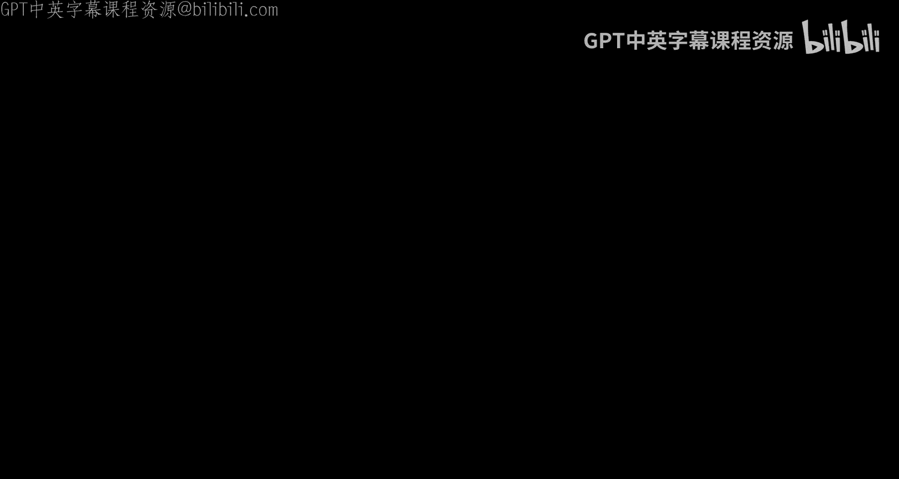
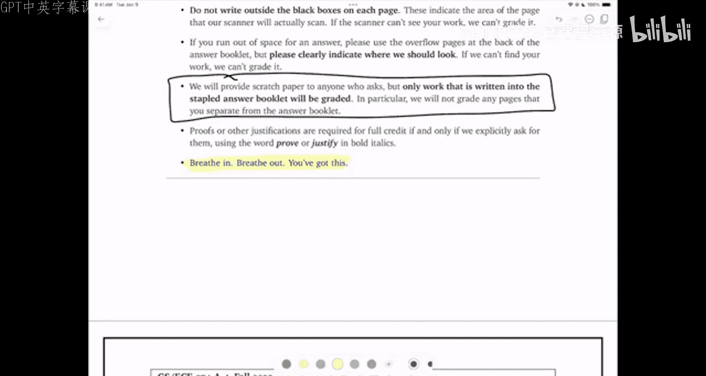

# UIUC《算法与计算模型｜UIUC CSECE 374 - Algorithms and Models of Computation 2023》中英字幕 p32 20231207-Dec 7_ Second practice final walkthrough.zh_en -BV1Mh7RzaEL2_p32-

Hi everybody， I'm back， this is the walkthrough for the second practice final exam。U。

It format will be very similar to the first practice final exam and the eventual actual final tomorrow。

So let's go ahead and get started， as usual， I'm going to start by reading through all of the questions before making a decision about what to work on first。

You'll notice in this exam。It didn't start with the set of yes no questions。

 the yes no questions appeared at the end， so the same kind of distribution of questions is just in a different order because it fit better on the page that way。

Okay， so。Recall that a run in a string W from the alphabet 01 is a maximal substr of W whose characters are all equal。

 For example， this string is the concatenation of three runs。

First let LA denote the set of all non empty strings where the length of the first run is equal to the number of runs。

So for example， this language contains the string。嗯。呃。

The length of the first run is equal to the number of runs。

 so the string 0 has one run and its first and only run has length  one。

The string 110000 has two runs and the first run has linked two this string has three runs and its first run has linked three。

嗯。Prove that this language is not regular。The second let LB denote set of all strings and 01 star that contain an even number of odd length runs。

 so for example， this string has four runs that are of odd length。

This string has zero runs that are of odd length。 The empty string。

 likewise says zero string runs of odd length。But this string down here has one run of odd length and this one also has one run of oddd length and one is odds。

 that's bad。So describe either a DFA or an NFA for this language and give a regular expression that describes the language。

All right。Question two。Aladdin and Bala Baur are playing a cooperative game。

Each player has an array of positive integers， I can see this below arranged in a row of squares。

 each player has a token which starts at the leftmost square。

 so maybe there's a red token here and there's a blue token here。

And the goal is to move both tokens to the rightmost squares。So in each turn。

 both players move their tokens in the same direction， either left or right。

The distance each token travels is equal to the number under that token at the beginning of the turn。

For example， if a token starts on a square labeled 5。

 that moves either five squares to the left or five squares to the right。

If either token moves past either end of the board the row then bulk players loses。

 so in this case with seven， the first move must be to the let's be to the right。So it must be one。

 two， three， four， or five， six， seven steps for As token and one， two， three， four， five。

For bees token。And in this example， they can win the game by by first making this move to the right and then making the move to the left and left and right and right and left and right。

 you can follow through yourself if you want to and have time， on the other hand。

 if they're given this second example array， they can't win because the first move。

By Aladdin must be to the right。UmBecause if I move left， it goes off the board， but at this point。

 no matter which direction aad moves。TheyThey fall off the end of the board。

So there's no way that they can win。Describe and analyze an algorithm to determine whether Aladdin and Beruadur can solve their puzzle。

 given the input arrays A and B。嗯。I'm going to go ahead and scribble something down about this I don't know maybe this is dynamicnaite programming maybe this is something to do with the graph it's still a bit fuzzy so let's。

Keep it in the back of our minds and and move on。Submit a solution to exactly one of the following problems。

 don't forget to tell us which problem you've chosen， so these are both。NP hardness proofs。U。

Given an undirected graph， a subset of vertices is mostly independent if more than half of the vertices at S have no neighbors in S。

Prove that finding the largest， mostly independent set in a graph is in Piard。And then part B。

 given an undirected graph， find the largest integer K such that G contains two disjoint independent sets of size K。

Both these problems are NP hard， but we only need to proof for one of them。Okay， sos it's。

 this is both， you know， NPp stuff and both got independent sets。

Recall that a palindrome is any string that is equal to its reversal， like re divideividder or poop。

And part A is describe and analyze an algorithm to find the length of the longest sub sequenceequence of a given string that is a palindrome right off the bat。

 I see sub sequenceence， I think done dynamic programming。maybe。

And then part B a double palindrome is the concatenation of two non empty palindrorummes。

 like referee is the concatenation of the palindrome refer in the palindrome double E。

Poop re divideivids， poop。 re divideividder。De and analyze now we're going to find the length of the longest sub sequenceence of a given string that is a double palindrome。

For both algorithms， the input is an array A and the output is an integer。

 and there's a specific example。So for maybe dynamic programming。

 your algorithm for part A should return seven for one of those two subequs and for the part B return 12 because。

This is a concatenation of two polydrummes。This of course is another hint that it's probably going to be dynamic programming。

You have a collection of enlock boxes and M gold keys， each key unlocks at most one box。

Without a matching key， the only way to open a box is with a hammer。 Unfortunately。

 your baby brother has locked all of your keys inside the boxes。 And luckily。

 at least you know which keys， if any， are inside each box， so。Um。

 you're going to have to smash one of the boxes with a hammer。

Your baby brothers found the hammers the eager eyeing one of the boxes。

 De and analyze an algorithm to determine if it's possible to free all of the keys without smashing any box except the one that your brother has chosen。

And then part B is describe and analyze an algorithm to compute the minimum number of boxes that must be smashed in order to retrieve all of the keys。

可能。嗯。Well， here I've got， you know， some relationship between。Keys and boxes， in fact。

 I've got two relationships between keys and boxes。

 keys can be inside boxes and keys can unlock boxes。嗯。Of。I'll have to come back to this one。

a little weird。And in part six is the check yes or no and provide a justification。嗯。

Li sort of quickly glance through。These different sections。

 part A is asking about statements that are true for all languages， L L star equals L star star。

 false decidable then L star is decidable。L is either empty or sorry regular or NP hard。

 if L' is undecidable， then L has an infinite following set。

And something about turningring machinecoings being undecidable。

In which the following statements are true， there's a couple of recurrences。

UEvery dag has at least has it most one source it， most one sink。

UThere's obviously a typo that should be capital D depth of research explores every path from the source to every other vertex the input graph。

Here's a dynamicyn programming recurrence that's asking me about evaluation order。

Part C is asking about an undecidability reduction。

So it shows the language that we're doing and we're doing a reduction from Hol。

Stard halting language。And walk through it walks through the actual reduction。

And then asks several questions about that reduction。嗯。And then finally， part D。

 suppose there's a polynomial time reduction from a to B， which of the following statements are。True。

 assuming P is not equal to NPp。And B intersect， there's an algorithm to transform a Python program for B into a Python program for a。

 both run and polynomial time。This is NPR then so is that， if this is decidable， then so is that。And。

Something about toring machines accepting every string。And so that's the。The whole thing。

So let's go ahead and get started。The usual rules， you know。

 two handwritten double sided cheat sheets。You know， please write write your name。

 everything here again， similar to midterm two， don't rip anything out of the answer booklet。

Um obviously， we'll make an exception if something happens accidentally。

 but we don't want to get into the situation that we did with midterm one where pages got lost during the scanning process。

OK。😊，嗯。So。We've got some questions about regular languages and what looks like it's probably going to be some sort of fooling that argument。

嗯。呃。Sorry， that's part A。Part B is's just a construction。Um， for Part B， Aladdin and Barubador。

Remember we weren't sure whether this is going to be dynamic programming or not。

 I think I want to come back to this after we do some slightly easier things。

This is obviously you know， MP hardness。About independent sets。

There'Just two different independent at variance， we need to pick one and see if it's inP。Part three。

 palindromes， this is almost certainly dynamic programming because you're talking about finding sub sequenceequences。

And from there's a hint in example。Then problem five。Keys and lock boxes and so on。

What haven't I seen here well there hasn't been any sort of definitive。

 we've seen a couple of things， one that's definitely dynamic programming and one that that might be。

🤢，UmU but might also be graph stuff we haven't any seen anything that's definitively a graph problem so。

I'm going to just。See， maybe there's a graph thing here。And then finally， a bunch of yes。

 no questions。I'm going to try to knock out as many of these yes， no questions as I can first。Um，Uh。

 soum we can，um， you know， get to the， let let the other things do it in the back of my hand。

All right， so which of the following statements are true for all languages is L star equal to L star star？

Well， the only weird things that we have to remember about the clean closure is that like when you take the clean closure of the empty set。

 you get the language that contains the empty string。嗯。But once you've got， you know， a string。Um。

Once you've got produced， you know， all sequences of things in L。

Producing all sequences of sequences of things in L aren't going to give you anything new。

 so this is yes。So， concatet。The needing。Concatetnations。呃 can count the。Nations。Of strings。And。

Yields。Stngs。In the L star， I mean it's sort of。Concatetnation is associatedsociative if actually would work just fine。

嗯。As an explanation。If L is decdable， then L star is decidable， this again is yes。

 this is the text segmentation problem that we saw in class。UmSo I just let his word。

Be something that decides。Deecdes all。So remember， the setup for that problem is I'm given a subroutine is word that tells me whether a given strain is a word。

And I want to know whether a given string is the concatenation of words。Um，Uh。

 so there was a dynamic programming algorithm called is Word some number of timesum that that that's a decision algorithm for LstarAR。

L is either regular or NP hard。 Well， no， I can find languages that are not regular。

 is it the canonical non regular language。U this is easy to recognize。

 it's easy to recognize strings in this language in polynomial time。I given the string。

 I count how many zeros there are at the beginning of the string and then I count how many ones there are after that。

And if those two numbers are the same and the spring doesn't contain anything else， then I say yes。

 otherwise I say no。Thats a linear time algorithm。Um。And I'm of course。

 assuming that P is not equal to NPp because that's only the same thing to do。

 even though technically we don't know。We also don't know that gravity works as a mathematical theorem。

 but we assume it does。If L is undecidable， then L has an infinite fooling set， so。

Infinite fooling sets this is you know the same as not regular， so if L is undecidable。

 is it not regular？Or equivalently protect the contra positiveitive。

 is it true that every regular language is decidable and the answer is yes， so let's say。

Regular defines。Decidable。Using， for example， the DfaA is an algorithm that decides membership in a regular language。

And the last one on this page， the language of Tring machine encodings M brackets。

 such that M decides L。Is that undecidable for every language L and the answer is yes。

By Rice's theorem。Actually。Technically， this is。没有。

Hang on no R's theorem doesn't work because that's about what the things that Tring machines accept。

 not the things that Tring machines decide the subtle difference between decides and accepts is that you say the Turing machine decides a language if it accepts every string in that language and does not accept any string it rejects every string that's not in the language。

Whereas M accepts cell just means it accepts everything in the language， but given any string。

 not in language， it either rejects it or it loops forever。

So there is a difference between these two things。嗯。But you know， basically， you know。

 you can reasonably say here you know any interesting。嗯。A problem。About。Tururing machines。

Is undecidable。And that that would be enough explanation。If you really insisted， yeah。

 I can set up a diagagonalization proof or I can set up a reduction but。

This is sufficient for the exam。Where let's see part B。

 the solution to the recurrence T of n is4 T of n over 4 plus big of n is n log n well let's set up the recursion tree I've got four children。

Each with value n over four， and then each of that has four children， each with value n over four。

These add up to you know at every level， things add up to n。

 so I've got four children of the root each with value n over four。I've got 16 children of the root。

 each with value n over four over four。It's N number 16。So it adds up to n， so yes。All levels。嗯。

Equal to n。And then we have a similar recurrence except now the non recurst terms is n squared。

So let's set that up。The non recursive work is n squared。

 I've got four children now the the the thing to remember is what I'm drawing is the tree for T of n。

And what goes in this child here is the tree for T of N over4。Right。

And so the non recursive part of that is an。Over four。Squared， so we that little bigger n over4。

Squared。A， not n squared over four。Umh， so the the argument going in is n over four and the non recursive term is the square of that argument。

Similarly， I've got four children here， each of which is going to store anniversary 16 squared。

Because the problem size， the input size has gone from n over4 to n over 16。

 and then the non recursive part of the function squares that。

So now the the zeroth level adds up to n squared， the first level adds up to。N squared over four。

 I've got four nodes each with value n squared over 16。4 over 16 is one fourth。

And if I do the math here， I'll also get n squared over 16 so in fact I get decreasing。

Gemetric series。Which means the answer is actually n squared， not n squared log n。

Every directed acyclic graph contains at most one source and at most one sink， no。

Here is a directed acyclic graph that has two sources in two sinks that is still true if I had an edge here so nope。

Depth for search explores every path from the source vertex to every other vertex in the input graph。

No， this is not what DFS does DFS only。Exploreers。one。Paathath。From。As to any other vertex of any。

It does not explore all paths another way saying this is the number of paths from a source vertex v to another vertex could be exponentially large in the size of the graph。

 but DFS runs in linear time in the size of the graph。

 you can't do an exponential amount of things in only linear time。So no。

 it's just no this is not how DFS works， DFS finds one path， likewise。

 breadth for search finds one path or whatever for finds one path from the source to every other vertex in the graph。

Okay suppose a is an array of integers considered the following recursive function。

 the question is whether we can compute of n comma zero by memorizing this function into an array n square time in a particular order。

 so let's。Say try to put this into a two dimensional array， I and J。Um and。

Let's see where our dependencies lie， so for a particular value of Ij。

I that depends on the value in the table in the same row and the next column。🤢，So I J+ one。

In the previous row and the same column。So I minus 1 J。And in the previous row and the next column。

Okay， so it looks like as long as I。Do things。Better。Decreasing J。

Because I want to make sure that I look at everything in column J plus1 before I look at everything in column J。

And increasing I， so I want to look at things in row I minus1 before I look at things in row I。

Then I should be okay， but if I read this， it says increasing eye in the outer loop。Yeah， okay。

 there's not really any priority between I and J so here I did increasing J in the outer or decreasing J in the outer loop。

 but。You know， fine， I can， I can go the other way instead。So let's make eye the outer loop。

And increasing J in the inter loop。No， that definitely doesn't work。So the answer no。Need decreasing。

Zy。The evaluation order isn't correct。The running time's fine， the memorization。

 data structure is fine， but the evaluation order is wrong。系。All right。

 this is probably the most interesting in one of these true false questions。

 so we should read this carefully。Umum。I'm going to read through this carefully。

 but I'm going to actually not answer the yes no questions right away because I want to give myself some time to like。

Think about it and come back， I'm going to use the fact that brains are actually pretty good at processing stuff in the background。

So I'm going to read through it once， but I'm going to hold off。On answering the questions just yet。

Okay， suppose we want to prove that the following language is undecidable muggle is the set of all Tring machine encodings。

Such that the Tring machine accepts the string science， but rejects the string magic。系。

Professor Potter， your instructor in defense against models of computation。

 suggests a reduction from the standard halting language， so halt is the set of all pairs of strings。

 or you can think of as two strings glued together with some symbol in the middle。

But the first string is the encoing the turing machine。

 and the second string is the input to that turing machine。

And I want to accept this if that Tring machine halts when it's given that input string。

ThatThis is just the standard definition of the whole thing problem。So Potter suggests specifically。

Let's suppose that there is a Tring machine， Deect muggggleton。

That decides whether a string belongs to the language muggle。Oh。

Potter claims the following algorithm now decides the halt thing problem。

 so he describes this hypothetical machine needs building decide halt takes in a turningring machine encoding in a string W。

The first thing he does is he writes code for this thing called River duckuck。

Rubber duck takes in a string X as input。Holds off on it for a while。 First it runs the machine M。

 the input to decide halt on the input W， the other input to decide halt。It just runs it。

 then ignores the output， so this the question is， you know， does M halt？🤢。

On W is sort of tested here。And then it doesn't matter whether M accepts W or not。

 rubber duck then proceeds by saying hey， is my input string equal to magic， if so reject it。

 if the input string X is anything else， then I'll accept。

And so the basic idea here is going to be something like。嗯。If。Hs。On W。Then。诶。Rr duck。Is a mule。

Because it accepts magic。It runs M halts and then from there it looks in at the string magic and says yes or says it rejects magic。

 excuse me， but it accepts science because science is not equal to magic。嗯。诶。Else。

Rber duck is not a muggle。Because if X doesn't halt on W。

 then rubber Duck will try to run M onW and we'll just hang。

And it'll never end up looking at the input string at all。

 so it won't accept science and it won't reject magic。嗯。So that's kind of the setup。

And so if De mugggleton can decide whether rubber duck is a mugle。

Then detect then this whole thing can decide whether M holds on W。But that seems to be the idea。嗯。

Now， I think we can go ahead and answer this。So let's see if M accepts the W。

 then rubber duck accepts magic， so I walk through okay， so pass in rubber duck。The string magic。

First thing Reproductduct does is it runs M on input W， but M accepts W。

In particular M Hts on WM so then rubber duck continues and when it sees magic it rejects so the answer is no。

Rr duck rejects。Msure。嗯。Let's try the next one if M diverges that's same thing as hangs on W。

 then rubber duck rejects magic so if I'll see what rubber duck does I pass in magic I run M on the input W it diverges and so rubber duck never gets a chance to finish。

So again， the answer is no， rubber duck hangs。嗯。If M accepts W。

 then detect O muggle to accepts rubber duck， So okay first， if M accepts W。

 what does rubber duck do？Well， what does rubber duck do with science？well。

 rubber duck of science runs M on inputW that comes back because M holds。

Then is science equal to magic no， else I return true so rubber duck accepts science and a similar argument。

Says rubber duck rejects magic。So。If M accepts W， then rubber duck is in fact， a muggle。

And so Deect O Mggleton。Dcides the language muggle， so it's like know yeah。You know。

 rubber duck is a model。If M diverges on W， then decide how it rejects the string， so again。

 if M diverges on W， then rubber duck diverges on everything， which means rubber duck's not a mule。

Right， so duck is not。同乜公。Which means detectile modelton will reject。Rverend duck。

And so I return false。And so finally， decide halt decides language halt that this is。喂。最后。对。Fect。

And it seems to be。On WM， which is。Enough to ground the proof。Finally。嗯。

Suppose there's a polynomial time reduction from some language A to some other language B。

 which of the following statements are true， assuming P is not equal to NP。A intersect B is empty。

His art is not empty。So this is definitely not true because I could set a to B zero star and I could set B to B1 star and the reduction is flip every bit in the input。

So if I want to build an algorithm language A。呃。I want to know whether this string only has zeroes in it。

I could write a polynomial time algorithm that replaces every zero with one and everyone with zero and then ask whether the output has only ones in it。

And these two languages are， oh， sorry， I should say zero。

 zero star and11 star because I don't want the empty string。To be in their intersection。

 so now these are these are non empty strings， only zeros and non empty strings with only ones they definitely don't intersect。

Um if there's a reduction， u， there is an algorithm to transform any Python program that solves B。

 maybe， you know， I should do the usual thing here。Of。Drawing the cartoon。

Of what actually happens in the reduction。Just to remind myself of the structure was otherwise unlikely to get confused。

There's an algorithm to transform any Python program that solves B。That's this inner thing。

Into a Python program that solves a in polynomial time， well。Yeah， actually。

U I take the Python program that that actually does the input transformation and I write it down and I call the。

The algorithm for part B and then I write the source code that the Python program that solves B down underneath it I probably have to do some some namespace gobblely hook to make sure that that。

That variable names and function names don't collide but that's just a matter of careful bookkeeping so yes and this is essentially the the definition of。

Reduction。Right。I can think of B as a as a black box that I can only invoke as a machine。

 but if I'm actually given the source code for B then well， I can。A。You know。

 or I guess we can you know。We can simulate B。Given。It's source code。啊。

Because that's what Python's for。If B is N hard， then A is N hard。 You know， again， yes。

 this is the standard。And Pharness proof。Mr if I want to prove that A is NP hard。No。See。

 this is write down this is why I always write down the cartoon。Um the answer here was no。

 if I want to prove that A is NP hard， I reduce from a known NPR problem。Here I'm taking。

 I'm attempting to prove。A is NP hard。By describing a reduction to a known NPR problem。

 so no actually the correct answer here is no。The reduction。U goeses the wrong way。Right。So。

If you make a mistake like this， just be very， very clear。About correcting that mistake。

So it's like this one， this one。Not that one。If B is decidable， then a is decidable。Well。

If I want this box， this cartoon that I've written up here is an algorithm that decides a provided I can plug in an algorithm in this inner box that decides B。

 so again this is sort of yes。Sorry， the answer here is in fact yes。And again。

 this is more or less the definition of reduction。I should probably say this is the definition of a polynomial time reduction in the second one just to be。

Absolutely clear。And then the last one says if a Tring machine accepts every string in B。

 the same Tring machine also accepts every string in A。Well。

 we've already seen an example where this is no， if a is 00 star， B is 11 star。

 there's a very simple reduction， but I can easily imagine a Tring machine that accepts only strings with zeros and therefore or accepts only strings with ones and therefore would reject every string in a。

Okay。So I think that's enough for the true false questions， managed to answer them all。

Let's go back and look at the open ended questions。So。We got something about DfaAs and fooling sets。

We've got something that not really sure whether it's going to be dynamic programming or graph or something。

We've got something that' definitely about NP hardness。

We've got something that' is definitely about dynamic programming and we've got something that I don't know might be easy about graphs。

 so let's see what we can do with one of these I think this dynamic programming one I think we can tackle pretty directly seems kind of smells like something we might have seen before。

So let's start out with part A and start out by just building some intuition。Right。嗯。

I'm given this piece of text and I want to find in it。呃。Some sort of。Of palinorium subsequent。And。

So a reasonable question whenever I'm asking any question about finding a sequence is。

How am I going to find the the first letter in the sequence and well in a normal sequence I would say。

 well， I you know， I just I don't know where this is。So where is the。First letter。

So I'm going to have to try， you know， all possibilities。U。

But there was another another way of asking this is sort of like， is this？The first。Letter。

Now I only have a yes no question， so that yes， no question is going to be kind of more likely to lead to a simpler production。

Simimpr recurrence。But I can't really decide that just by looking at the beginning because the definition of a palindrome is a string that is the same as its reversal。

 so I also have to look at the end。🤢，And so， actually， the。

The question I want to ask is something like， are these the first？And last。Letters。

In my in my palin room。In this case， the example that I've drawn here on the screen。

 the answer looks like it's no， I've got something else in no。

But at some point' i'll find the first and last letters and i'll find the second and second last letters and i'll find the third and the third last letters and so over time I will work on my way into some。

Interval in the middle of the word。U。So not I'm not going to be asking this question。

 I'm not going to be asking this question， but rather this is the question that's sort of driving my my thought process。

So my sub problems。啊。Problems。Or。U。Substrs。Or intervals。

So I can reasonably index these by looking at the index of the first symbol and the index of the last symbol in this substream so I can define。

LPS of IJ。This is the length。Of the longest。Coundrome。Subsequence。Of the substr T I through J。

And I don't need any information from earlier decisions。

 so I don't need to care about what's going on on in the outside of that red box if I'm asking this question about the inside of that red box。

U so it's。There's no。No condition like things must be increasing or decreasing or only change by small amounts or anything like that that would require me to remember anything about how I got to this subproblem。

So we need to compute LPS of。Sum my riseor one indexed and need LPS from one to N。Okay。So。

LPS of IJ satisfies some sort of recursive。Property， I've got some cases。

 one of the cases that I've got is if the first and last characters are different。

Of the substr of TI and TJ are different that I know that the answer to this question are these the first and last letters is no right so if。

TI is not equal to TJ。Then I know either TI doesn't participate at all in the longest palinrum sub or TJ doesn't participate at all。

Um， it's like maybe one of the maybe TI is the first letter and maybe TJ is the last letter。

 but it's definitely not both。 but TI can't participate in any other way in the palindrum sub sequence of T for I to J。

So I've got now two possibilities， either I need to throw a T sub I。Or I need to throw A sub J。

And I don't know which one of those I want， so it's either LPS of I plus1 J or Lps of I J minus1。

 I don't know which of those is the right one。But it's whichever one of those is bigger。

Sent take the max of these two。On the other hand， if。

That's it they're not equal if T of I is equal to T of J。

Then the answer to are these the first and last letters is maybe？Possible。

But I don't know so in this case I need to take the max of three possibilities one two of them are exactly the same as before。

The other one is now if TI and TJ are the first and last symbols in my palindrum sub。

 I need to account for them in the length of the longest pald sub， so two plus。

And then I need to throw them out and recursse on what's between。OPS of i plus1 J minus1。Hey。😊。

Now there are some base cases that I need to consider when I was thinking about this。

 I was really imagining the situation that's at the top of the screen here where first of all the interval has to be non empty so if I is bigger than J then then I'm dealing with an empty interval。

 an empty substring the only palindme subequence of the empty substring is the empty sub sequenceequence which is like zero。

Fortunately， the empty subence is a palinderorm， it's the same as its reversal。

But the other base case that I need to consider， I kind of implicitly assumed it was possible。

For TI and TJ to be different symbols。Which means that the indices I and J must themselves be different。

So there is the possibility that I is equal to J， in which case I'm looking at a one symbol substring。

And it is a palindrome so I should return one for this case and it's a good thing that I remembered this because if I hadn't remembered。

This additional base case， then the output of my algorithm would always be an even number。

My base cases are even and whenever I modify something I add to。

 so I would have only had even results， which means if my input string was something like radar。

 our ADAR， which is an odd length poundro， I would never have returned the way。嗯。

You might be tempted to put in you know what happens if I have a string of length to when should I put in another base case。

 that's strictly speaking not necessary because you've got。this case will already handle it。

So if those two characters are equal， then you'll either get two plus this recursive call。

 which will turn out to be zero。This recursive call will turn out to be one。

 this recursive call will turn out to be one， so I'll get2 plus zero or1 or one and the largest the those is two。

On the other hand， if they're different。If the two symbols in the substring are different。

 then these two recursive calls will both return one and that's the correct answer。

So seems to be fine。嗯。I need to memorize this into some sort of 2D array indexed by I and J。

Every entry depends on。Next row， same column。Or。Same same row previous column。Or。In this case。

 next row previous column。So every the white square depends on these three black squares。

 so the ordering I need to consider the columns。Sorry。

 I need to consider the rows in decreasing order and I need to consider the columns。

Each row in increasing order。And I'm doing a constant work for every cell in the table。

 so I have n squared cells。Times order one time。Equals in squared。That was。Part a。

I don't really have room to write Part B here。So I'm going to see， where's a nice blank page。

There's page 10。😔，So， I'm gonna say。C page。10 for part B。

But let's just think about what Part B is asking first。

I need to find the largest double palindrome sub sequenceequence， so I need to find。

A sub sequence that is the concatenation of two palinders。

Um so I think a very natural question to ask about this double poundrum sub sequence。Is。

Where would I split the sub sequenceequence into the first plodrome and the second pelodrome so。

You can find， you know of at what index could I split the input string into two parts？

And then I would need to find a palindrome in the first part。

 and I need to find a palindrme in the second part。So。A fairly simple solution。To a。This。嗯。Or B。

The double palunddme。mIs。To say， well， the the the the the longest。Double palindrome。去。

Longest double palindrome subence。U。Ts from1 to N。Right。There's somewhere where it splits。

Into a palindrome sub sequenceequence。And another palindro sub sequence。Right。Um。And in fact。

 let's just say that this splits at some index eye。

So the first I symbols in T contain the first palindrome in the longest double palindrome sub sequence。

 and the last n minus y characters include the second palindrome in the longest double palindrome sequence。

Well， in fact， the palindrome that shows up in the left chunk must be the longest palindrome subence of the left part。

Because otherwise， I could swap it out for something longer and I would get a longer double calendar。

Likewise the。The palind subence that appears on the right must be the longest palindro sub sequenceequence that appears to the right。

So it looks like what I want to return then。Is the maximum of。

Longest palindrome sub sequenceence from1 to i plus the longest palindro sub sequenceence from i plus1 to n。

Over all possible places to split。So that seems to be。Yes。嗯。Okay。Now we've we've already we've。

Already。Computed。LPS of IJ。For all I and J in n squared time。Using the algorithm for part day。So。

Once we've done that， I can evaluate this expression。For any index I。In constant time。So u。Then。

 a computing。So if we've already computed that。Then。嗯。Computing。呃。This。Max。Takes。我你。Order in。

Additional time。Right。嗯。Okay， so I think then。Then we're done。 So the algorithm is。Run the algorithm。

Or。Or a。This outputs。The array longest poly sub sequenceence from one to N。1 to run。

Right so I'm not just looking I'm。The algorithm for Part A formally it outputs the length of the longest poundundro sub sequenceence。

 but I just haven't remember， compute the table and return that table。And then， then。啊。Compute。

This max overall eye。Of Lps。1 eye。Plus LPS。5 plus1 N。The overall running time is squared。

So we're not going to get much better than this because finding a single paldrum sub to10 square time。

 this seems pretty good。So there's no dynamic programming。

 there's no graphs it just you just sort of do it using the algorithm from part of A as a sub team。

Okay， and which number problem is that？That was problem four， so let me make sure that I've written。

Problem。Or be here。Okay。This would be a good time to kind of stare up at the ceiling for a moment。

 take a deep breath。A gather your thoughts。嗯。You know， take a deep breath in。Deep breath out of。B。

Slow breath out。All right， let's。we relaxed a little bit。

Let's see if we can make some more progress on something else how about this this DFA problem this this looks like it might not be such a bad thing right so there's a there's a fooling set problem and there's a DfaA design problem but you know what I'm going to go for the DFA first。

There's no reason I have to solve these problems in order， so I'm going to go for B first。

Contains an even number of odd， even number of。Od length。Runs。嗯。So。嗯。

One way that I could build aside to build a DFA for this。

Is I could set up or a regular expression for this is I could set up。Um。

h a regular expression for an even linked run of zeros， another one for an even linked run of ones。

 another for an odd length run of zeros， another for an odd length run of ones。

And then I alternate between zeros and ones and I need to somehow manage to make sure I have an number of odd things and even number of times。

And this will work you know， it'll be a bit tedious。But I do want to point out one thing here。

That's the length。Of a string。Is the sum of the lengths？Of its runs。

So a string that has an even number of odd length runs。

The sum of those runs is the sum of an even number of odd numbers。Plus， a bunch of even numbers。

Right。So this seems to imply。That。Any string that's in this language？Is going to have even length。

On the other hand， if the result of this sum is odd right。

 so if suppose I have an odd number of odd length runs， and this is the only other possibility。

 if I have an odd number of odd length runs， then the total length of the string is the sum of an odd number of odd numbers。

Plus， a bunch of easy numbers。And so it's odd。And so if I have an odd number of odd length runs。

 then the whole string has odd length， so this is actually an if and onlyF。

So really all I need to do is write down a regular expression for any string of even length。

And the runs will take care of themselves。8ight。That seems a bit easier than than you know。

 assembling things and even runs and odd runs and so on， just like， well。

 let's look at all the runs together and see if there's any information we can gather through about those。

And that also means that my TFA is going to be very simple。You're a commona one。

Don't really want to put a plus there。😔，It's not a regular expression machine。

It's just you know it it's a simple two state machine。

 one machine one state labeled Y one labeled n for yes and no。

 but want to be nice and mnemonic this this DfaA clearly accepts every string that hasn' even lengthened it clearly reduces every string that has odd length so。

I think I'm done with part B。So let's look at part A here， the length of the first run。

Is equal to the number of runs。So how would I I want to think about how I would generate。嗯。Examples。

That if I want to build the fooling set， then I kind of want to think of examples of of。

Sts that are in the language that have enough structure that I could say this is the third one and that's the eighth one so I can I can pick out two of them and characterize them by like integers in a nice way。

So I don't know， I'll just say， you know， start with a bunch of zeros。Um。

 and then if I start out with a run of four zeros， then I need three more run。

But those runs could be any length at all， and I want to keep things as simple as possible。

 so I'm going to just use runs of length one from now on。🤢，So I need three more of them， zero0，0，0，0。

 then I would need 10，10 to come after that。So the thing that we're going to aim for。

Is strings of form zero to the n。And then 10，10 and so on， alternating， this has length。

And minus one。And even this is kind of awkward。Because you know I don't know whether this ends in a zero or ends in a one and it's kind of weird。

 so maybe what I should do is decide on the pary first only consider。

Strings that have an even number of runs are only considered things that have an odd number of runs。

Um， so I don't know， maybe let's try， you know， zero two the end。

And then 101001 and this length is to the n minus1。嗯。So that would be zero to the2N。

10 to the n minus11。It seems like a reasonable pattern， I mean， the other way I could do it。

 I guess is。To the N plus1 zeros。Followed by n iterations of 10， okay。

 I think this is the pattern that I'm going to aim for instead。系。

So this is the special case of the language。Um， that I'm going to aim my feelingsing that argument that。

Right and the general idea is I built these strings。

 this simple example of strings that split into two parts。

 the first part is going to be the things that live in my fooling set and the second part is going to be my distinction suffixes。

 so let's let F be all strings0 an odd number of zeros， so that's zero zero star zero。可以。

Let X and Y be any strings。In F。That implies x is zero to the 2 i plus1 and y equals zero to the 2 j plus1。

For some integers， I not equal to J。嗯。'mI'm going to let Z be the string01 to the I。🤢。

That's what I'm trying to build up this。ThisThis pattern over here。Then Xz is02 to the i+1。

Times 10 to the I， this has two i plus one runs。😔，So it's in El A。

OkayIt's got one run of zeros and then it's got two i runs that alternate between one a single one and a single zero。

And yz is0 to the2 J plus110 to the I， this has2 to the i plus one runs。

Which is not equal to the J plus1， so not in LA。And that's enough for the proof。but the trick to。

Finding the the fooling set and and is and is largely I'm trying to sort of optimize。

How simple a pattern can I find inside this language among the strings。

 how simple an infinite family of strings can I find in the language in a way that allows me to split into a prefix that I can use is thing in my fooling set in a suffix that I can use to distinguish two different things in the fooling set this is by no means the only way that I could the only fooling set proof I could use for this。

I didn't have to choose my my all my later runs to have length one， I could have， for example。

 just gone with n runs each of length n。Um，Uh， but I thought this would be easier to write down。

So this one I went with。Okay， so。He knocked out another one。He's got。This sort of。Other。Game problem。

We've got this MP hardness proof。And we've got something that probably involves a graph。

Why don't we see if we can do the NP hardness thing？U。All right， so let's think about this。

So so part A says a subset is mostly independent if more than half of the vertices have no neighbors in S so here I want to set up。

mSomething where。any。呃。Any mostly independent set。There's half of the vertices that have no neighbors in S。

 and then the other half， I need to control exactly where they are somehow。Um， so the thing that。

 you know， sort of occurs to me to do for part A。Is。Maybe do something like。I'll take a graph G。And。

呃。I want the half of the mostly independent set to be kind of over here off to the side。

Somewhere not actually in G so when I delete the edge the vertices in S that have neighbors and S what i'm going to be left with is an independent set in G so I need to make sure that whatever's in that box everything is connected so maybe this is a complete。

Graph。With。U。The same number of vertices as my original graph J。Okay。

 and it is just sort of disjoint， so this this whole thing is age。

Let me see if I can if I can make this。嗯。Make this idea work。So one direction is if。

I is an independent set。😔，Of size。K in G。Well， then I can find K vertices over in this other clique that I'll call the clique this complete graph K。

嗯。Then。My union， little kverses。In this clt decay。Is a mostly。Independent。I' wait to more than half。

Okay， if I came minus-1。Wetic season K is mostly independent。Set in H。

Okay that that seems to work one way let's go to the other way， let's say that if S is a mostly。

Independence set。In H。Well， I want to somehow conclude。That。U。You know。

 so more than half of the vertices of S have no neighbors in us I somehow want to conclude that。

S consists of an independence setting G and some vertices over in K。

 I can't necessarily do that immediately。The independent set might contain some vertices over in K。🤢。

Yeah， I don't know， so I'm going to write this as the union of A and B。Where a is with S intersect G。

 B is。S intersect K。嗯。诶。So。The idea is that if a is not。Independent。I want to replace。嗯我。Size。哦。

2 k minus1， that's what I was getting before。Replace vertex。V and a with。Neighbor。别人呢。Oh no。

 that's not how they wanted to split things up at all， sorry， let me let me let me try that again。

I'm going to split it up into A and B where A is the things that have no neighbors in us and B。

 things that has at least one neighbor in us okay， so if。Any vertex。In B。Is in G。

Then then I can't just delete all the verses in Ka and get the large independence at so when to。嗯。

Move it decay， so replace。The with。Any。Vertex。In okay。So if u。I've got a bad vertex in S。

 I'm going to delete it from S that that is not going to make any other vertices bad and I'm going to replace it with some other vertex that's in my clique K。

Then， I still have。We still have。A mostly independent set。And it's of the same size。系。Soum。

I want to replace this if with a while loop。Then by induction。

 every time I remove a vertex every time I remove a bad vertex from G and I add a vertex to K。

The the set of vertices that have no neighbors in S might actually grow because if two bad vertices are next to each other。

 I'd move one out of the way that the second bad vers might become good， but that only helps us。

So yeah， this actually seems to work。So I still have a mostly independent set of2 k minus plus one vertices。

And K of them。Sorry， at least k of them， that's at least k of them here。R in G。And are independent。

So right。S intersect G is in fact， an independent set。In G of size。Okay。

 so to this actually seems to work。Okay， so let me just recall what I said。H is G is the。Union。a坑。

Weat。Graph。Okay， with the same number vertices as。嗯。She。And the claim that I just proved。

Is G has an independent set。Of size。Okay， if and only if H has a mostly incumbent set。Of size。

2 k minus1。Or said differently。The maximum independent set。哦嗯。And。Zhi。Is。The floor of。啲。

Max mostly independent set in H1 by2。No， not for ceiling。And yes。

 this can be done in poly and mealal time。No。I think that's。I think， I think。

I think we're solid here， I think we're good。So I for so one thing sort of to say about the argument that I've just gone through。

 I wasn't sure until I'd actually keep writing on proof that the reduction I have would actually work you know I'm actually taking this test to fly。

I thought， well， I want to build something where you know， without， in some sense。

 without loss of generality in any mostly independent set in this graph。

 there's the independent part which is sitting in the graph that I in my original input graph and there's the not independent part which I'm going to just shove over to the side。

That kind of intuition builds something that can capture all the bad parts。Is fairly common。

 this is why you know。You put antennas on vertices and you you know new vertices that connect to all the old ones。

 you're essentially saying I'm going to put all the bad parts here。

 the things that make my problem different from the problem I'm producing from。

 I'm going to put in this part of the graph that I'm building。嗯。

But I wasn't sure that it would actually work because not necessarily every mostly independent set has exactly the structure I want。

So the key is I。Needed to you know， sort of get this exchange argument going。

That if I have a mostly independent set that has a bad vertex。

 somebody that has another neighbor in the set over in G。

 then I can remove it from S and add a vertex from the dumping ground instead。And this will keep。

 you know， I've replaced one bad vertex with another bad vertex。

So the number of bad vertices has not gone up。U。TheSo I still have a mostly independent scent。

I still have the same number of vertices in the mostly independent set。

 so by doing this over and over again until all the bad vertices are over okay。

 that means what I'm left with is an independent set that sits over in G。8ight。嗯。

There's a small technical point here that I need to make sure there's at least two vertices in K because then if there's only one vertex in K。

 it's technically independent of everything else， but that。Um， you know。

 so if there are no bad vertices。Then what I get is an independence set of size 2 k minus2。

 So I technically， if I were wanting to do this formally， I'd have to say。If k is less than five。

 just try all sets of five vertices。And that I can do an end of the five time。But again， on an exam。

'm not those small details I'm not going to matter。Um。If we have time at the end。

 I might come back and also look at part B， but I really want to go on to look at the rest of the exam first。

So we did part A and it seemed to work out so great。啊。Um， right。Okay。So。four problem five。

 some sort of graph thing。And problem two， there's some sort of Dp graph thing。

I'm a little bit more confident about problem two， it seems I at least understand the question a little bit better so let's go back to the question handout and look at this problem again okay so we've got tokens moving on these pair these two arrays wherever the tokens are now I could decide to move both tokens to the left。

And I'd have to move them both by whatever the amount is under。The token。

 so I'd have to move the top one to the left by two and the bottom to the left by three。

Or I can move the top one to the right by two and the bottom one sorry。

Bottom one to the right by three。And so I've got a couple of different possibilities for what my second move is going to be。

So whenever I see an array like this， it's really very natural， especially you know。

 when you've been playing a lot with dynamic programming algorithms to think， hey。

 maybe this is a dynamic programming problem。I'm trying to find a sequence of moves so sequence things that like dynamic programming so my intuition is let's like try to figure out by considering all possibilities what the first move is or in the middle of the game what the next move is。

And then let the recursion fairry do everything else， there's a problem with this。

 which is when I design any recursive algorithm。I need to make sure that the size of the problem that I pass to the recursion ferry is smaller。

Than the size of the problem I'm starting with。I'm trying to wander around on this two by N grid of squares。

But when I make a move， I still have a two by n grid of squares in the future I might move to the right and I might move to the left。

 so I can't consider only the squares further to the right。

 I can't consider only the squares further to the left。Now there is a thing that's going down。

 which is the number of moves that I have left in the future。

 but that's not something I know right now。So it's not really part of the input that's going down。

It's part of the output。So that's not really a good basis for doing something with recursion。

When I recursse，' I don't see anything that's obviously getting small or getting closer to a base case。

嗯。Because tokens can move towards the goal and then they can move further away from the goal so I don't think dynamic programming is is the right approach here。

 I don't see anything that would support a recursive solution strategy。

And fundamentally dynamic programming is recursion only without repeating yourself。

 so given in the context of this class it probably something involving a graph and when i'm thinking about graphs。

嗯。I really want to capture。Like the state of the world and how that state of the world changes。

And in this case， I actually have a pretty good idea for what the state of the world is。

 the state of the world， if you want to describe the world to me。

 you would say where is Aladdin's token？And where is Baroador's token。

So I can describe the state of the world with two integers each between1 and n that tells me where the two tokens are on their respective boards。

And moreover， I can describe how that state can change。

Can change by both tokens moving to the left by appropriate amounts。

 or both tokens moving to the right by appropriate amounts。

So that seems to describe you know states and transitions between them that directly modeled by graphs。

 so that's what I'm going to do I' I'm going to run with the graph intuition and see where it gets me。

可以。So I'm going to start， no， it's not dynamic programming you build a graph okay。Build a graph。G。

With vertices and edges。The vertices are。Pars。And I'm just going to write this， you know。嗯呃。

To see what this means。嗯。Aladdin is at his。Eth square。And。E Drubador。Is at。嗯。🤢，Beath square。嗯。

And I have edges。Um， and u I can have an edge from sorry。

 let's be consistent here let's just call it AB instead of Ij。Of A B， this can go to a minus。

The value in the eighth square forlain's board。嗯。And alert if I'm moving to the left。Okay。

 so there's this。Provided that a is greater than。A sub and B is greater than B sub。

 so otherwise I'll fall off the board。Union， so this is moves to the left。Moves to the right。

Is symmetric？I increase。Aladdin's index by the number at Alin's index。

 I'd increase Bad Bur's index by the number atdel Bad's index。And again。

 I need to make sure that a plus， you know that Aladin's new index is MN。And。His wife's and。

Address is also less than none。noticeice that these these edges are directed。

 this is not a a you know moves are not reversible in this game because the length of a move depends on the squares I'm moving from。

Not square as I'm moving to， so it's unlikely that I'll be able to undo a move immediately。

And the idea is now we we start at the square 11 and we are trying。To reach。Square N N。

 so the problem we are solving is。嗯。A and B。A can win。There。Game。If and only if。1， one can reach。

And in this graph G。There is a sequence of moves in the game that moves the tokens from the left ends of the boards to the right ends of the boards that's equivalent to saying there is a sequence of edges。

Joined a vertices into a path。Or really into a walk， starting at vertex 11 and ending at vertex NN。

 that's another way of saying if there's a walk from vertex v to vertex v。

 that's the same as you can reach V。So we can run。D FS。呃。In G。Starting。At。1，1。And can return。True。

If and only is in and。Is marked。well I don't actually need breadth for search right the the the right thing to do is to use whatever for search i'm not trying to find well am I trying to find the shortest number of moves。

No， I'm just trying to define whether Aladin and Bedor Blue York can win。

So I just need to return true or false。Right， suppose Ill just sales false。This all happens in。

Time proportional to the number of vertices plus the number of edges。

 but the number of vertices is n squared and every vertex has at most two outgoing edges。

 so the number of edges is also u of n squared so this whole thing happens in that squared time。Okay。

We seem to be done with this cooperative game。Um， but I I deliberately went a little bit down the dynamic programming road because I wanted to point out the intuition why I decided not to do dynamic programming is I didn't see anything that was obviously decreasing。

When I tried to quote unquote recur， so it wasn't clear that the recursal would terminate if I'd gone further down that road and tried to write a recurrence。

 the inputs to the recurrence would likely have been equivalent to these vertices and the recursive quote unquote calls would likely have been similar to this pattern here。

 but then when I came to to determine an evaluation order。

You would notice that the value at a particular square in the two dimensional array depends on things that are above and to the left and it depends on things that are below and the right and so no evaluation order seems to actually do the right thing。

I both need to access earlier rows and columns before I get to this cell and I need to do later rows and columns when I get to this cell。

So the fact that I can't come up with an evaluation order also suggests that perhaps the dependency graph has cycles and the reason I can't come up with an evaluation order is because no evaluation order exists。

And in fact， if you can come up with examples， say if the whole board is just ones where， yes。

 the board will have the configuration graph will have cycles。

 the dependency graph if you're quote unquote， dynamic programming recurrence will have cycles。

 so dynamic programming wasn't the right way to go。

 we should just deal with this dependency graph directly is a graph。O。

And now we're left with Johnny and the gold keys in the boxes。

So what are we thinking about here so got， I've got a bunch of these boxes。That are locked。

 so here's box one， two， three， and four， but the key for box one is inside box two the key for box two and four are inside box three and maybe the key for box three is inside box one。

Okay， so if I decide that I'm going to smash this box。What happens then is I will get。

The key to box three and I'll open box three and that'll give me the key to box two and the key to box four and so it looks like then I can in fact retrieve。

All of the keys。 But if Johnny decided instead that he wanted to kill box4。嗯。The answer is no。

 I am not going to be able to retrieve all the keys。Um， and in fact， in this case， further， you know。

 no matter which of the these first three boxes I I get。

 I'll be able to open the other two because I have this lovely cycle looking thing here。

So it looks like I'm sort of building a graph。Where I have an edge from I to J， if and only if。

There is a key。For box J inside。Fox， I。And okay， so let's let's sort of of of let's sort of run with this okay。

 so vertices is。Just the the box themselves Okay edges， I'm going to have。Edge is defined like this。

And the question now is under what circumstances， let's say， you know， without loss of generality。

 Johnny is lying。Box one I'll just number the number the boxes so Johnny and you're looking at box one。

 I'll number the rest two three。ok。Which boxes can we open？

That's a sort of natural question and well， so I open if we smash box one。if we smash。boxox。1。Well。

 the answer seems to be。Anything that's reachable in this graph。From box1。Um， because uh。

 if I like any edge that comes out of box one points to a box that I now have a key for。

And then when I open that box， I get keys to more boxes， which I'd get to by following more edges。

And so any。Vertex that I can reach in this graph from vertex 1。

By following a path from vertex from1 to I to j to something something to vertex to vertex v。

Each of those steps involves。Well， I got to this box so I could open it and get the key to the next box。

 right？So the observation now is。呃。The set。The set of。Boxes。Oh， we can open。Byai。😔，Smlashing box one。

Is equal to the set of vertices。Reachable。From。One in this graph。Right。😊，So we can compute this。

Using whatever first search in。Order of V plus E time， which is。Number of vertices is n and well。

 the number of keys。Is M。Okay。嗯。So then the second step here， right。

 the question is not whether we can box is whether we can retrieve all the keys。Right then if。

Any unopened box。As a key。Return false。Else returned true。

This takes an additional linear amount of time。It's like to look at each of the remaining boxes that you vertices you couldn't reach and ask。

 is this box empty？so the entire algorithm is going to run in linear time。か。So let's。

Move on to page 11 here for the for the second part of the question the second part of the question is I need the minimum number of boxes that I need to open to。

Retieve every single key。Okay。So this is sort of an interesting， interesting question。

But let's go on down to page 11。嗯。Right， so this is， I mean， the minimum number of boxes。To smash。

To get。Every。ok。All right， so actually the first thing I'm going to do is I'm just going to ignore。

empty。Empty boxes just。Any boxs that's empty？I can pick up the box and shake it and see this and I not I I want to smash it I don't want to open it like I'm just going to put it aside so I am going to assume that every box contains at least one key。

And so this implies among other things that every vertex。In G has at least one outgoing edge。

Right because remember the edges go from boxes that contain a key to box that that key opens。Okay。

So this is going to be equivalent to。The number of veres。In the smallest。Subset。S of V。Such that。

Every vertex。Is reachable。R。At least one。Vertex。And yes。Great。😊，So I can get from， you know。

 for every vertex， there's some other， some corresponding vertex in this S。

That can reach my favorite verts。系。嗯。That's what I want to figure out。嗯。So reachable， reachable。

 reachable reach。There's a question about like sort of global properties of reachability in this graph。

 who can reach what， how do I find a minimum number of things that can reach everything and I think it's a general rule like reachability things okay so there's some sort of directed graph so。

I don't know much about the structure of the graph， but let me try to think about two。

Special cases these two special cases when i'm verym thinking about directed graphs and especially for reachability questions that。

呃。Seem useful to consider。嗯。You know， when I look at this problem， you know。The first time I saw it。

 know， I'm picking out a small subset of vertices that have some property。

This kind of smells like a vertex cover kind of thing and like like wait， is this， is this s hard？

But no， I mean， it's asking me to find an algorithm， so all right， fine。

 so let's let's look at a special case here。So the two special cases that we want to consider。

 one special case is that G is strongly connected。And this case is really easy， the answer is one。

 I can pick any vertex。And。From that one vertex I can reach all of the other vertices so this actually this actually might be a nice observation that that if I can get things down to strongly connected components then then。

Once I've reached one thing in that stronger connected component。

 I've reached everything in that stronger connected component。Oh。

 so I'm probably going to be building the meta。Of G， we'll call that G prime。

 but but lets let's think about the second special case， what happens if G is a dag。Okay。

USo I'll I'll。Look at a。啊，这不过。Ag here。Something like this。嗯。Okay。Um well。

What are the hardest vertices to reach？Like if I if I just like pick a vertex here and I go， okay。

 well， everything that this can reach just sort of further down。

 but if I think about well to dag I think about a topological order。

 the vertices behind me are harder to reach。And the vertices ahead of me。

That that can't reach anything behind me。So for a daAg。

 it looks like the only way to reach a source vertex is to smash it。Let's go， at must be in us。

And so。嗯。I have to， in this subset that can reach everything。

 I have to include every source ver attacks。Right us。Must include。Every source。But on the other hand。

 once I've included a source， once I've included all the sources。

I've included everything the sources can reach and everything they can reach and everything that can reach and so on。

 this is actually going to cover the entire graph。Once I've included every source。

Every other vertex in the Dg is reachable from some source。

 even if I just have an isolated vertex sitting somewhere that just has its own key inside it。

 I'm ignoring the little self for purposes of defining a dag that once I decide to smash that box that I've opened that box。

 that vertex is reachable from itself。So it must include every source and。That's。Enough。

So the source vertices are， it's necessary that they be in thisness and it is sufficient that they billion be in this stness。

So。The hypothetical algorithm now。Is I'm going to build the meta。

And then from each source in the metagraph。I'm going to pick out one vertex， right。呃。

So I'm going to let S be。It vertex。啊。Wait， I'm trying to use math， I don't want to use math。

 I just want to write English， let S consist。Of one vertex。In each。Stores。A component。Of G。

Right which you know we can identify that， we build the metagraph using， for example。

 Ts algorithm or course post Rager Shaer algorithm， this is going to take me order V plus E time。

And then one of the things that gives me is for every vertex in my original graph。

 I have a label that tells me which vertex it belongs to in the metagraph。

U so it's not hard using that information to do a complete scan。through the vertices of G and ask。

 hey， does this vertex belong to a source component， does it belong to a source of G prime？

This is a source。Vertex。Of G prime。And if it does， is it the first one of these I've seen from that component？

And so again， this takes order B plus E time。And then the finally I'm going to return。嗯。

Return the number of vertices in S as my answer。So the whole algorithm runs in v plus E。

 which is again n squared time。Right now the problem statement didn't say that I had to prove the algorithm is correct。

 but as a sanity check I want to。嗯。At least informally convince myself that this is correct。

 so the idea is。诶。I have to include。At least one vertex in each source component。

 because there's no other way to reach the vertices in that source component。

The only things that can reach nodes inside a source component。Are vertices in that component itself？

So I have to include at least one vertex for me source。On the other hand。

 once I've included a vertex in every source component。

 then I can at least reach every vertex inside each of those strong components by following sort of edges internal to that component。

But then I can follow metagraph edges forward to vertices and other components。

 and once I can reach into any other strong component。

 I can reach everything in that strong component。So the Dg analysis implies that I can reach every strong component in the metagraph。

And then the strongly connected analysis implies， once I'm in a strong component。

 I can reach everything there。So all Johnny needs to do or all I need to do to protect myself from Johnny is to build the strong component graph。

Of these boxes。And then identify the clusters that are all strongly and connected to each other that have no edges coming in from the outside。

 so their sources and say you can smash one box from two these sets。Okay。

 and that seems to be the answer to problem 5 b， and so we seem to have answers for everything。

And so probably is a sanity check。I want to write my name on the tops of these pages。

 just in case things fall apart。But they probably won't。It's been。

 I've been talking for about two hours， so I probably spend the next hour or so， at least the next。

Half hour or so， reading through everything that I've written and making sure that I've said everything that I want to say that things that are important to include in solutions like you know what is the claim that I need to prove for an NPRness proof。

 this is just helpful for。Uh， you know， actually writing down the proof。

So I know what if means and I know what only if means， or when I'm doing a dynamic programming thing。

 I absolutely need an English definition of the recursive function underneath the dynamicyn program。

Here， I， it's helpful to say， once I've established， here's the graph， then I write in English。

 here is the problem， specific problem that I need to solve within this graph。um。啊。

Before starting to describe the algorithm I'm going to use to solve that problem。嗯。Yeah， okay。

Um in this case， I'm not really doing dynamic programming。

 it's just literally a for loop over stuff I've already done。

So it's simple enough that English doesn't really help。嗯。And。Likewise， here。Right。

 this is the English description of what I'm looking for in terms of just the original graph。

 not in terms of lot boxes and keys， but entirely in terms of vers edges。So that looks good。

 we seem to be done。I have spent long enough doing this， I really want to go eat lunch。

So I'm going to call it quits here， hopefully。The exam will go well。

 good luck for everybody I do want to。啊。Make you know one last。Point here。

 this has not been an easy semester， this is not easy material。

 but you all have worked extremely hard， you have learned an awful lot of stuff you are absolutely prepared to do this you really can do this。

So do the best that you can to get a good night's sleep tonight。

 don't stay up all night because if you do you will go into the exam tired and you will not do as well。

Uh， one more hour of sleep， honestly， is probably going to do you more good than one more hour of studying。

 I do hope this the walkthrough has been helpful。Thanks for a fun semester and good luck with your exam。

And have a lovely break。

