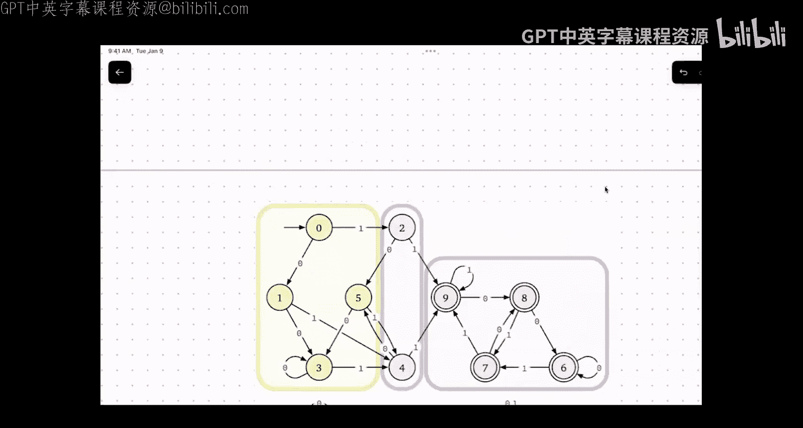

# 004：DFA乘积构造与状态最小化

在本节课中，我们将学习确定性有限自动机（DFA）的两个重要概念：乘积构造和状态最小化。我们将看到如何通过组合两个简单的DFA来构建一个识别更复杂语言的DFA，以及如何识别并合并DFA中的冗余状态，从而得到一个更简洁、更高效的自动机。

## DFA 回顾

上一节我们介绍了确定性有限自动机（DFA）的基本概念。一个DFA M 可以形式化地定义为一个四元组 `M = (Q, Σ, δ, s, A)`：
*   **Q** 是有限状态集。
*   **Σ** 是有限的输入字母表。
*   **δ: Q × Σ → Q** 是转移函数。
*   **s ∈ Q** 是唯一的起始状态。
*   **A ⊆ Q** 是接受状态集。

DFA 通过读取输入字符串，并根据转移函数在状态间移动来工作。如果读完字符串后，DFA 停留在某个接受状态 `q ∈ A`，则该字符串被接受。DFA M 接受的所有字符串的集合称为 M 的语言，记作 `L(M)`。

## 乘积构造

本节中，我们将探讨如何通过“乘积构造”将两个DFA组合成一个新的DFA。这个新DFA可以识别原有两个DFA语言的布尔组合（如交集、并集等）。

### 构造动机

假设我们有两个DFA：`M1` 识别语言 `L1`（例如，包含连续两个“1”的字符串），`M2` 识别语言 `L2`（例如，包含连续两个“0”的字符串）。我们想构建一个DFA来识别 `L1 ∩ L2`（即同时包含连续两个“1”和连续两个“0”的字符串）。

一个直观的想法是同时运行 `M1` 和 `M2`。对于输入字符串中的每个字符，我们同时将其馈送给 `M1` 和 `M2`，让它们各自独立地更新状态。当输入结束时，只有当 `M1` 和 `M2` 都处于接受状态时，我们才接受整个字符串。

### 形式化定义

给定两个DFA：
*   `M1 = (Q1, Σ, δ1, s1, A1)`
*   `M2 = (Q2, Σ, δ2, s2, A2)`

我们定义它们的乘积DFA `M = (Q, Σ, δ, s, A)` 如下：

1.  **状态集 Q**：`Q = Q1 × Q2`。新DFA的每个状态是一个有序对 `(p, q)`，其中 `p ∈ Q1`，`q ∈ Q2`。这代表了 `M1` 处于状态 `p` 且 `M2` 处于状态 `q` 的“组合状态”。
2.  **起始状态 s**：`s = (s1, s2)`。我们从两个DFA的起始状态开始。
3.  **转移函数 δ**：对于任意状态 `(p, q) ∈ Q` 和符号 `a ∈ Σ`，定义 `δ((p, q), a) = (δ1(p, a), δ2(q, a))`。这意味着我们分别应用 `M1` 和 `M2` 的转移函数。
4.  **接受状态集 A**：这里取决于我们想要实现哪种布尔运算。
    *   对于**交集** `L1 ∩ L2`：`A = {(p, q) | p ∈ A1 **且** q ∈ A2}`。要求两个组件DFA都接受。
    *   对于**并集** `L1 ∪ L2`：`A = {(p, q) | p ∈ A1 **或** q ∈ A2}`。要求至少一个组件DFA接受。
    *   对于其他布尔运算（如对称差、差集等），可以相应地定义接受条件。

### 关键引理与正确性

乘积构造的正确性基于一个关键引理，它描述了扩展转移函数 `δ*` 在乘积DFA中的行为：

**引理**：对于任意状态 `p ∈ Q1`, `q ∈ Q2` 和任意字符串 `w ∈ Σ*`，有：
`δ*((p, q), w) = (δ1*(p, w), δ2*(q, w))`

这个引理可以通过对字符串 `w` 的长度进行归纳来证明。它保证了乘积DFA在读取字符串 `w` 后到达的状态，正好是 `M1` 和 `M2` 分别读取 `w` 后到达的状态对。

基于此引理，可以证明乘积DFA的语言确实是原语言按定义方式组合的结果。例如，对于交集构造：
`w ∈ L(M)` 当且仅当 `δ*((s1, s2), w) ∈ A`
当且仅当 `(δ1*(s1, w), δ2*(s2, w)) ∈ {(p, q) | p ∈ A1 且 q ∈ A2}`
当且仅当 `δ1*(s1, w) ∈ A1` **且** `δ2*(s2, w) ∈ A2`
当且仅当 `w ∈ L(M1)` **且** `w ∈ L(M2)`
当且仅当 `w ∈ L1 ∩ L2`

### 乘积构造的意义

乘积构造展示了DFA的一个重要特性：**状态可以分解为组件**。新DFA的状态是组件DFA状态的组合。这种“状态即数据”的思想在计算机科学中反复出现，例如在动态规划（状态表示子问题的解）和图算法中。

此外，乘积构造自动产生的DFA可能包含冗余状态（例如从起始状态无法到达的状态，或者行为完全相同的状态），但这并不影响其正确性。我们通常先进行构造，再考虑优化。

## 状态最小化

上一节我们通过乘积构造得到了可能包含冗余状态的DFA。本节中，我们来看看如何识别并消除这些冗余，得到一个状态数最少的等价DFA。

### 状态等价与可区分性

两个DFA状态 `p` 和 `q` 被称为**可区分的**，如果存在一个字符串 `w`，使得从 `p` 出发读取 `w` 到达的状态是接受状态，而从 `q` 出发读取 `w` 到达的状态是非接受状态（或者反之）。换句话说，存在一个“证据”字符串 `w` 能揭示 `p` 和 `q` 行为的不同。

如果不存在这样的字符串，则称 `p` 和 `q` **等价**或**不可区分**。等价的状态在功能上完全一样，可以合并为一个状态而不改变DFA接受的语言。

### 最小化算法概述

DFA最小化的核心思想是将所有状态划分成等价类，每个等价类内的状态彼此等价，然后将每个等价类压缩成一个单一状态。算法通常从一个粗糙的划分开始，然后不断细化：

1.  **初始划分**：将所有状态分为两个组：接受状态组和非接受状态组。显然，接受状态和非接受状态是可区分的。
2.  **迭代细化**：检查每个组内的状态对 `(p, q)`。对于字母表中的每个符号 `a`，查看 `δ(p, a)` 和 `δ(q, a)` 是否属于当前划分中的**不同**组。如果是，则 `p` 和 `q` 在当前划分下就是可区分的，应该被分到不同的组。重复此过程，直到划分不再改变。
3.  **构建最小DFA**：最终的每个组成为一个新的状态。新DFA的转移函数定义为：从组 `G` 在符号 `a` 上转移到包含 `δ(p, a)` 的组（`p` 是 `G` 中任意代表状态）。起始状态是包含原起始状态的组。接受状态是那些包含至少一个原接受状态的组。

### 示例

考虑一个识别“包含连续两个1”的DFA，经过最小化后，我们得到了熟悉的三个状态的结构：
*   状态 `S`：尚未看到连续两个1。
*   状态 `A`：刚看到一个1，但尚未形成连续两个1。
*   状态 `B`：已经看到连续两个1（吸收状态）。

原DFA中其他更复杂的状态都被证明与这三个状态之一等价，因此被合并。

## 总结

本节课中我们一起学习了DFA的两个核心操作。

首先，我们深入探讨了**乘积构造**。通过将两个DFA的状态集进行笛卡尔积，并同步运行它们的转移函数，我们可以构建一个新的DFA，用于识别原语言的各种布尔组合（如交集、并集）。这体现了DFA的模块化能力和“组合状态”的思想。

其次，我们介绍了**状态最小化**的概念。通过定义状态的“可区分性”，我们可以系统地识别并合并DFA中的冗余状态，从而得到唯一（在同构意义下）的状态数最少的等价DFA。这帮助我们优化自动机，并加深对状态本质的理解。

这些工具不仅本身有用，也为后续证明某些语言不是正则语言（需要无穷多个状态来区分）奠定了基础。