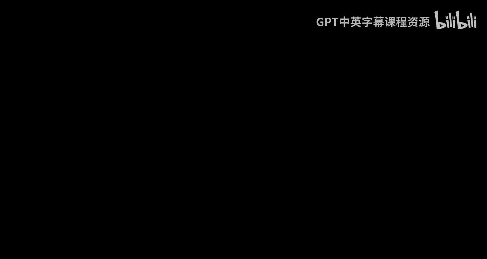
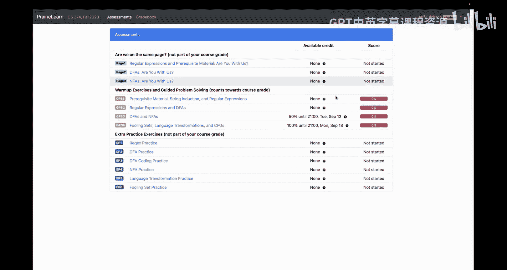
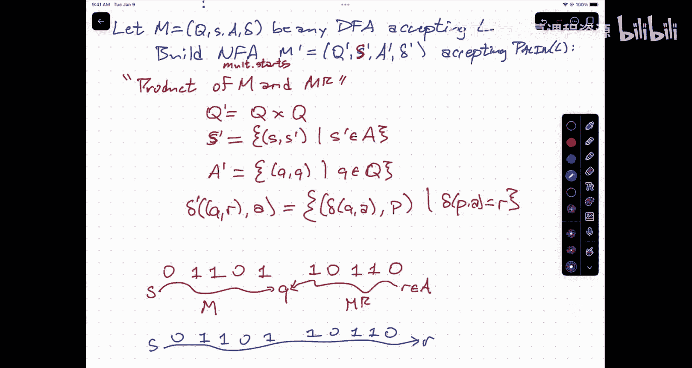

# 007：语言变换

在本节课中，我们将学习如何对正则语言进行变换，并证明变换后的语言仍然是正则的。我们将通过构造新的自动机来实现这些变换，并理解其背后的核心思想。

---

## 概述

我们已知正则语言有三种等价的表示方式：正则表达式、确定性有限自动机（DFA）和非确定性有限自动机（NFA）。此外，正则语言在并集、交集和补集等布尔运算下是封闭的。本节课，我们将探讨其他几种对语言进行变换的操作，例如星号闭包、按位取反、反转以及取回文前半部分等，并证明这些操作同样保持正则性。核心方法是：给定一个接受原语言的自动机，我们能够构造一个新的自动机来接受变换后的语言。

上一节我们介绍了正则语言的等价表示和基本封闭性，本节中我们来看看更复杂的语言变换操作。

---

## 星号闭包变换

给定一个正则语言 L，证明 L*（L的星号闭包）也是正则的。

**构造思路**：
我们从一个接受 L 的 DFA M 出发，目标是构造一个能接受 L* 的 NFA M‘。关键在于允许机器在读完一个属于 L 的子串后，非确定性地选择回到开始状态，以开始读取下一个子串。

**正式构造**：
设 M = (Q, Σ, δ, s, A) 是接受 L 的任意 DFA。我们构造一个带 ε 转移的 NFA M‘ = (Q‘, Σ, δ‘, s‘, A‘) 如下：
*   Q‘ = Q ∪ {s_new, a_new}，其中 s_new 和 a_new 是新状态。
*   s‘ = s_new。
*   A‘ = {a_new}。
*   δ‘ 定义如下：
    1.  从新开始状态 s_new 添加 ε 转移到原开始状态 s：`δ‘(s_new, ε) = {s}`。
    2.  从原接受状态集 A 中的每个状态，添加 ε 转移到新接受状态 a_new：对所有 q ∈ A，`δ‘(q, ε) = {a_new}`。
    3.  为了允许循环拼接，从新接受状态 a_new 添加 ε 转移回新开始状态 s_new：`δ‘(a_new, ε) = {s_new}`。
    4.  保留原 DFA 的所有转移：对所有 q ∈ Q 和 a ∈ Σ，`δ‘(q, a) = {δ(q, a)}`。

**直觉解释**：
这个 NFA 从 s_new 开始，通过 ε 转移进入原 DFA 的模拟。在模拟过程中，每当到达原 DFA 的一个接受状态（意味着识别完 L 中的一个子串），它可以选择通过 ε 转移到 a_new 来结束整个计算，也可以选择通过 ε 转移回到 s_new 来非确定性地“重置”自动机，开始尝试识别下一个子串。通过这种方式，它能够猜测输入串如何被分割为多个属于 L 的子串。

---

## 按位取反变换

定义字符串上的变换 `flip`：将字符串中的每个 0 变为 1，每个 1 变为 0。将其扩展到语言上：`FLIP(L) = { flip(w) | w ∈ L }`。证明若 L 正则，则 `FLIP(L)` 也正则。

**使用 DFA 的构造思路**：
我们可以修改原 DFA 的转移函数，使得它在读取符号时，实际内部模拟的是原 DFA 读取相反符号的行为。

**正式构造**：
设 M = (Q, Σ, δ, s, A) 是接受 L 的任意 DFA。我们构造一个 DFA M‘ = (Q‘, Σ, δ‘, s‘, A‘) 如下：
*   Q‘ = Q
*   s‘ = s
*   A‘ = A
*   δ‘ 定义如下：对所有 q ∈ Q，
    *   `δ‘(q, 0) = δ(q, 1)`
    *   `δ‘(q, 1) = δ(q, 0)`

**直觉解释**：
新机器 M‘ 的状态和接受条件与原机器 M 完全相同。唯一的区别在于，当 M‘ 读取输入符号 a 时，它内部调用 M 的转移函数，但传入的符号是 flip(a)。这相当于在输入流和原自动机 M 之间插入一个“转换器”，实时地将输入比特取反后再交给 M 处理。

---

## 字符串反转变换

定义字符串上的变换 `reverse`：将字符串字符顺序颠倒。将其扩展到语言上：`REV(L) = { reverse(w) | w ∈ L }`。证明若 L 正则，则 `REV(L)` 也正则。

**构造思路**：
DFA 只能从左到右读入字符串。为了接受反转后的语言，我们需要让自动机从右向左“模拟”原 DFA 的运行。这可以通过将原 DFA 的所有转移边反向，并将开始状态和接受状态互换来实现，从而得到一个 NFA。

**正式构造**：
设 M = (Q, Σ, δ, s, A) 是接受 L 的任意 DFA。我们构造一个 NFA M‘ = (Q‘, Σ, δ‘, S‘, A‘) 如下：
*   Q‘ = Q
*   S‘ = A （原 DFA 的所有接受状态成为新 NFA 的开始状态集）
*   A‘ = {s} （原 DFA 的开始状态成为新 NFA 的唯一接受状态）
*   δ‘ 定义如下：对所有 q ∈ Q 和 a ∈ Σ，
    `δ‘(q, a) = { p ∈ Q | δ(p, a) = q }`

**直觉解释**：
新 NFA M‘ 的状态集与原 DFA 相同。原 DFA 中从状态 p 经符号 a 到状态 q 的转移 (`δ(p, a) = q`)，在反转后的 NFA 中，对应着从状态 q 经符号 a 可以（非确定性地）转移到状态 p。开始状态和接受状态的互换是因为：原 DFA 从 s 开始，在 A 中结束接受；对于反转后的字符串，计算应从原接受的终点（即 A 中的状态）开始，反向运行到原起点 s 结束。

---

## 回文前半部分变换

定义语言变换 `PAL(L)`：`PAL(L) = { w | w · reverse(w) ∈ L }`。即，所有那些与其自身反转拼接后属于 L 的字符串 w 的集合。证明若 L 正则，则 `PAL(L)` 也正则。

**构造思路**：
接受 `PAL(L)` 的机器需要在读取 w 的同时，并行地模拟两个过程：一个原 DFA M 正向读取 w（作为回文的前半部分），另一个原 DFA M 的“反向版本” MR 反向读取 w（作为回文的后半部分的反向）。当 w 读取完毕时，如果这两个模拟过程处于**同一个状态**，则说明存在一条路径，使得原 DFA M 能从其开始状态，经过 w·reverse(w) 的转移，到达其某个接受状态。

**正式构造**：
设 M = (Q, Σ, δ, s, A) 是接受 L 的任意 DFA。我们构造一个 NFA M‘ = (Q‘, Σ, δ‘, S‘, A‘) 如下：
*   Q‘ = Q × Q。每个状态是一个二元组 (p, q)，跟踪正向模拟和反向模拟的状态。
*   S‘ = { (s, f) | f ∈ A }。正向模拟从 s 开始，反向模拟非确定性地从某个接受状态 f ∈ A 开始（猜测回文串的结束点）。
*   A‘ = { (q, q) | q ∈ Q }。当正向和反向模拟到达同一个状态 q 时接受。
*   δ‘ 定义如下：对 M‘ 中的状态 (p, q) 和输入符号 a，
    `δ‘((p, q), a) = { (δ(p, a), r) | r ∈ Q 且 δ(r, a) = q }`

**直觉解释**：
这是一个更复杂的构造，充分利用了非确定性。机器同时运行两个副本：
1.  **正向副本**：从状态 s 开始，对于输入 w 中的每个符号 a，简单地应用 δ 向前推进。
2.  **反向副本**：从某个猜测的接受状态 f 开始。对于输入 w 中的每个符号 a，它需要沿着原 DFA 中**以 a 标记进入当前状态**的边向后走。由于可能有多条这样的边，所以这里需要非确定性猜测。

如果存在一个状态 q，使得正向副本在读完 w 后到达 q，同时反向副本通过一系列正确的猜测，在“反向”读完 w 后也到达 q，那么就意味着在原 DFA M 中，存在一条从 s 到 f 的路径，其标签恰好是 w·reverse(w)。因此，w 应被接受。

---

## 总结

本节课中我们一起学习了多种对正则语言进行变换的操作，并证明了这些变换后得到的语言仍然是正则的。关键要点在于掌握如何通过算法化的构造，从一个接受原语言的自动机（通常是 DFA）出发，构建一个新的自动机（可能是 DFA 或 NFA）来接受变换后的语言。这些构造的核心思想包括：利用非确定性进行猜测、模拟并行过程、以及巧妙地重新定义状态、开始条件和转移函数。理解这些构造有助于深化对正则语言封闭性和自动机计算能力的认识。