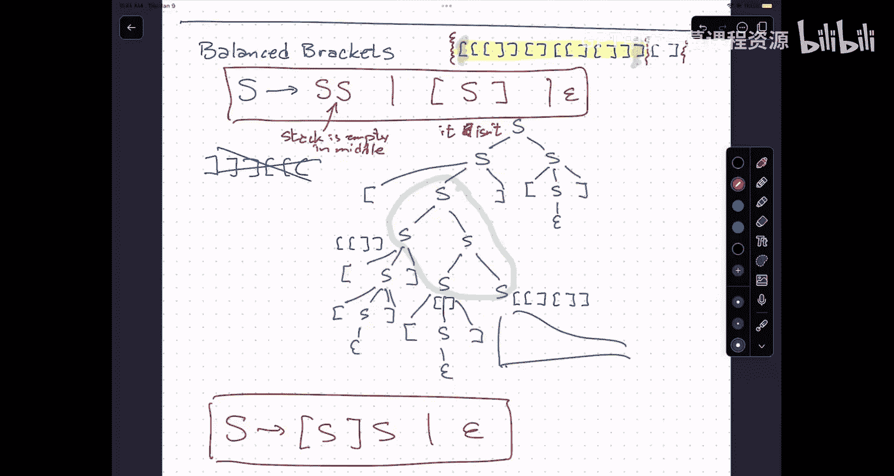

# 008：上下文无关文法

## 概述

在本节课中，我们将要学习上下文无关文法。这是一种比正则表达式更强大的工具，用于描述语言。我们将了解其基本组成部分、工作原理，并通过例子学习如何用它来描述具有递归结构的语言。

---

## 从正则语言到上下文无关语言

上一节我们介绍了正则语言，它由三种基本操作构成：**序列**、**选择**和**重复**。然而，许多语言无法用正则表达式描述。

一个经典的例子是语言 **L = {0^n 1^n | n ≥ 0}**，即由相同数量的0和1组成的字符串。这个语言无法被任何有限状态自动机识别，因为识别它需要一个计数器来追踪0的数量，并与1的数量进行比较，这超出了有限状态的能力。

这种模式体现了**递归**的思想。例如，我们可以将0视为“入栈”，将1视为“出栈”。一个合法的字符串就是一系列“入栈”和“出栈”操作，最终栈为空且从未下溢。这种嵌套的、需要记忆“深度”的结构，正是上下文无关文法能够描述，而正则表达式不能的。

---

## 上下文无关文法简介

上下文无关文法是一种用于生成字符串的规则系统。它由四个部分组成：

1.  **终结符**：构成最终字符串的字符。
2.  **非终结符**：代表中间结构的符号。
3.  **产生式规则**：规定如何将一个非终结符替换为一串终结符和非终结符。
4.  **起始符号**：推导开始的非终结符。

其核心思想是：从起始符号开始，反复选择并应用产生式规则，将非终结符替换为相应的字符串，直到得到一个完全由终结符组成的字符串。所有能这样生成的字符串的集合，就是该文法定义的语言。

---

## 文法示例与分析

让我们分析一个具体的上下文无关文法 **G**：

*   **非终结符**：`S, A, B, C`
*   **终结符**：`0, 1`
*   **起始符号**：`S`
*   **产生式规则**：
    *   `S → A | B`
    *   `A → 0 A | 0 C`
    *   `B → B 1 | C 1`
    *   `C → ε | 0 C 1` （`ε` 代表空字符串）

以下是分析每个非终结符所生成语言的方法：

**首先分析 `C`：**
规则 `C → ε | 0 C 1` 允许我们生成 `ε`，或者生成一个 `0`，后面跟着一个 `C`，再跟着一个 `1`。这本质上生成了语言 `{0^n 1^n | n ≥ 0}`。

**接着分析 `B`：**
规则 `B → B 1 | C 1` 允许我们在字符串右侧添加任意多个 `1`，最后必须应用一次 `C 1`。因此，`B` 生成的语言是 `{0^m 1^n | n > m ≥ 0}`，即1的数量严格多于0的数量。

**然后分析 `A`：**
规则 `A → 0 A | 0 C` 允许我们在字符串左侧添加任意多个 `0`，最后必须应用一次 `0 C`。因此，`A` 生成的语言是 `{0^m 1^n | m > n ≥ 0}`，即0的数量严格多于1的数量。

**最后分析起始符号 `S`：**
规则 `S → A | B` 意味着 `S` 生成的语言是 `A` 和 `B` 生成语言的并集。所以，`S` 生成所有 `0` 和 `1` 数量不相等的字符串，即 `{0^m 1^n | m ≠ n}`。

这个例子展示了上下文无关文法如何描述非正则语言。

---

## 更多例子与性质

**正则语言都是上下文无关的。**
任何正则表达式都可以转化为一个上下文无关文法。例如，正则语言 `0*1*` 可以用以下文法描述：
`S → 0 S | S 1 | ε`

**并非所有语言都是上下文无关的。**
存在一些语言，其结构过于复杂，无法用上下文无关文法描述。两个经典的例子是：
1.  `{0^n 1^n 0^n | n ≥ 0}`：要求三部分数量相等。
2.  `{ww | w ∈ {0,1}*}`：要求字符串由两个完全相同的子串连接而成。

**文法的歧义性。**
有时，同一个字符串可以由同一个文法的多棵不同的“语法分析树”生成，这样的文法称为**歧义文法**。歧义性会给语言解析带来困难，因此在设计编程语言语法时，我们通常追求**无歧义文法**。

---

## 设计文法：平衡括号

让我们尝试为“平衡括号”语言设计一个文法。该语言包含所有正确匹配的括号串，例如 `()`, `(())()`, `(()(()))`。

一种思考方式是：一个平衡括号串，要么是空串，要么是由一对匹配括号包裹着一个平衡串，再后接另一个平衡串。

基于此，我们可以写出以下文法：
`S → ( S ) S | ε`

另一种等价的、可能更直观的文法是：一个平衡括号串，总可以看作是以一个左括号开始，其对应的右括号将整个串分割为内部和后续两部分。
`S → ( S ) S | ε` （这与上式相同）

或者，我们可以明确区分“被括号包裹的串”和“串的连接”：
`S → T S | ε`
`T → ( S )`
这个文法也是无歧义的。

---

## 总结

本节课中，我们一起学习了上下文无关文法。我们了解到：
*   上下文无关文法通过**产生式规则**和**递归**，能够描述比正则语言更复杂的结构，例如嵌套的括号。
*   文法的核心组成部分包括**终结符**、**非终结符**、**产生式规则**和**起始符号**。
*   我们通过分析例子 `{0^m 1^n | m ≠ n}`，掌握了从文法推导其所定义语言的方法。
*   我们尝试为“平衡括号”语言设计文法，看到了对同一语言可能存在多种不同的文法描述。
*   最后，我们知道了正则语言是上下文无关语言的真子集，并且存在不是上下文无关的语言。

上下文无关文法是编译器设计、自然语言处理等领域的基础工具，用于描述程序语法或句子结构。